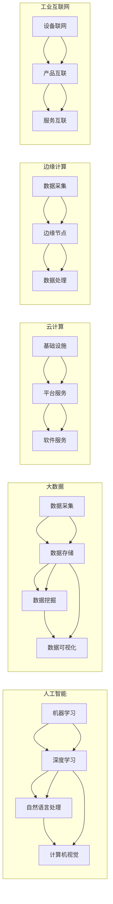

# 产业升级的新质生产力推动力

> 关键词：产业升级，数字化转型，新质生产力，人工智能，大数据，云计算，边缘计算，工业互联网

## 1. 背景介绍

随着全球经济发展进入新常态，传统产业面临转型升级的迫切需求。产业升级不仅是为了适应市场需求的变化，更是提升国家综合竞争力的重要途径。在这个大背景下，新质生产力作为一种新型生产要素，成为推动产业升级的核心动力。

### 1.1 产业升级的必要性

传统产业在发展过程中，长期积累的要素成本优势逐渐减弱，面临着资源环境约束、市场竞争加剧等问题。为解决这些问题，产业升级成为必然选择。产业升级的核心目标是提高产业附加值，提升产业链水平，培育新的经济增长点。

### 1.2 新质生产力的内涵

新质生产力是指以人工智能、大数据、云计算、边缘计算等为代表的新兴技术，它们能够通过智能化、网络化、绿色化等途径，提升传统产业的效率和质量，推动产业升级。

### 1.3 本文结构

本文将从以下方面探讨新质生产力如何成为产业升级的推动力：

- 核心概念与联系
- 核心算法原理与操作步骤
- 数学模型与公式
- 项目实践与代码实例
- 实际应用场景
- 工具和资源推荐
- 未来发展趋势与挑战
- 总结与展望

## 2. 核心概念与联系

### 2.1 核心概念原理

#### 2.1.1 人工智能

人工智能（Artificial Intelligence, AI）是指由人制造出来的系统所表现出的智能行为。它包括机器学习、深度学习、自然语言处理、计算机视觉等多个领域。

#### 2.1.2 大数据

大数据（Big Data）是指规模巨大、类型多样的数据集合。通过对大数据的分析和处理，可以挖掘出有价值的信息和知识。

#### 2.1.3 云计算

云计算（Cloud Computing）是指通过网络提供计算资源、存储资源、软件应用等服务的模式。云计算具有弹性、可扩展、低成本等优势。

#### 2.1.4 边缘计算

边缘计算（Edge Computing）是指将计算任务从云端迁移到网络边缘，由边缘节点进行计算和处理。边缘计算能够降低延迟，提高数据处理的实时性。

#### 2.1.5 工业互联网

工业互联网（Industrial Internet）是指通过互联网、物联网等技术，实现工业设备、产品和服务的互联互通，从而提升工业生产的智能化水平。

### 2.2 架构流程图



## 3. 核心算法原理 & 具体操作步骤

### 3.1 算法原理概述

本节将介绍新质生产力中几个关键算法的原理。

#### 3.1.1 机器学习

机器学习（Machine Learning, ML）是一种使计算机系统能够从数据中学习并做出决策的技术。常见的机器学习算法包括监督学习、无监督学习、半监督学习和强化学习。

#### 3.1.2 深度学习

深度学习（Deep Learning, DL）是一种特殊的机器学习算法，通过构建深度神经网络，自动从数据中提取特征。

#### 3.1.3 自然语言处理

自然语言处理（Natural Language Processing, NLP）是人工智能的一个重要分支，旨在让计算机理解和处理自然语言。

#### 3.1.4 计算机视觉

计算机视觉（Computer Vision, CV）是研究如何让计算机从图像和视频中理解、感知和理解视觉信息的科学。

### 3.2 算法步骤详解

#### 3.2.1 机器学习

1. 数据预处理：对数据进行清洗、标准化等操作，提高数据质量。
2. 特征工程：从原始数据中提取有价值的信息，作为模型训练的输入。
3. 模型选择：选择合适的机器学习模型，如线性回归、决策树、支持向量机等。
4. 模型训练：使用训练数据对模型进行训练，调整模型参数。
5. 模型评估：使用测试数据评估模型性能，优化模型参数。

#### 3.2.2 深度学习

1. 数据预处理：与机器学习相同。
2. 架构设计：设计合适的深度神经网络架构，如卷积神经网络（CNN）、循环神经网络（RNN）等。
3. 模型训练：使用训练数据对模型进行训练，调整模型参数。
4. 模型评估：与机器学习相同。

#### 3.2.3 自然语言处理

1. 数据预处理：与机器学习相同。
2. 词向量表示：将文本数据转换为词向量。
3. 模型选择：选择合适的NLP模型，如循环神经网络（RNN）、长短期记忆网络（LSTM）、Transformer等。
4. 模型训练：与深度学习相同。
5. 模型评估：与机器学习相同。

#### 3.2.4 计算机视觉

1. 数据预处理：与机器学习相同。
2. 图像特征提取：提取图像中的关键特征，如边缘、形状、纹理等。
3. 模型选择：选择合适的CV模型，如卷积神经网络（CNN）、目标检测模型等。
4. 模型训练：与深度学习相同。
5. 模型评估：与机器学习相同。

### 3.3 算法优缺点

#### 3.3.1 机器学习

优点：通用性强，适用范围广。

缺点：需要大量标注数据，特征工程复杂。

#### 3.3.2 深度学习

优点：能够自动学习复杂特征，泛化能力强。

缺点：模型复杂度高，计算资源消耗大。

#### 3.3.3 自然语言处理

优点：能够处理和理解自然语言，应用场景广泛。

缺点：数据处理难度大，模型训练时间长。

#### 3.3.4 计算机视觉

优点：能够识别和处理图像和视频，应用场景广泛。

缺点：需要大量标注数据，模型训练时间长。

### 3.4 算法应用领域

#### 3.4.1 机器学习

- 机器学习在推荐系统、图像识别、语音识别等领域有着广泛的应用。

#### 3.4.2 深度学习

- 深度学习在计算机视觉、自然语言处理、语音识别等领域取得了显著成果。

#### 3.4.3 自然语言处理

- 自然语言处理在智能客服、机器翻译、情感分析等领域有着广泛应用。

#### 3.4.4 计算机视觉

- 计算机视觉在自动驾驶、人脸识别、图像检索等领域有着广泛应用。

## 4. 数学模型和公式 & 详细讲解 & 举例说明

### 4.1 数学模型构建

本节将以机器学习中的线性回归为例，介绍数学模型的构建方法。

#### 4.1.1 线性回归模型

线性回归模型是一种简单且常用的机器学习算法，用于预测连续值。

假设输入特征为 $x \in \mathbb{R}^n$，输出为 $y \in \mathbb{R}$，线性回归模型可以表示为：

$$
y = \beta_0 + \beta_1 x_1 + \beta_2 x_2 + \cdots + \beta_n x_n
$$

其中，$\beta_0, \beta_1, \beta_2, \cdots, \beta_n$ 为模型参数。

#### 4.1.2 损失函数

为了评估模型的预测性能，需要定义一个损失函数，衡量预测值与真实值之间的差异。常见的损失函数包括均方误差（Mean Squared Error, MSE）和均方根误差（Root Mean Squared Error, RMSE）。

均方误差定义为：

$$
MSE = \frac{1}{N} \sum_{i=1}^N (y_i - \hat{y}_i)^2
$$

均方根误差定义为：

$$
RMSE = \sqrt{MSE}
$$

### 4.2 公式推导过程

以均方误差损失函数为例，介绍其推导过程。

假设真实值为 $y_i$，预测值为 $\hat{y}_i$，则均方误差损失函数为：

$$
L(y_i, \hat{y}_i) = \frac{1}{2}(y_i - \hat{y}_i)^2
$$

对损失函数求导，得到：

$$
\frac{\partial L}{\partial \hat{y}_i} = -\hat{y}_i + y_i
$$

### 4.3 案例分析与讲解

以房价预测为例，介绍线性回归模型的应用。

假设我们要预测某城市的房价，输入特征包括房屋面积、房屋层数、房屋朝向等，输出为房价。

首先，收集大量房屋数据，并进行预处理，如标准化等。

然后，使用线性回归模型对房价进行预测。

最后，评估模型的预测性能，如计算均方误差等。

## 5. 项目实践：代码实例和详细解释说明

### 5.1 开发环境搭建

在进行项目实践之前，我们需要搭建开发环境。以下是使用Python进行线性回归项目实践的环境配置流程：

1. 安装Anaconda：从官网下载并安装Anaconda，用于创建独立的Python环境。

2. 创建并激活虚拟环境：
```bash
conda create -n linreg-env python=3.8
conda activate linreg-env
```

3. 安装必要的库：
```bash
conda install numpy pandas scikit-learn matplotlib
```

### 5.2 源代码详细实现

以下是使用Python实现线性回归模型的代码：

```python
import numpy as np
import pandas as pd
from sklearn.model_selection import train_test_split
from sklearn.linear_model import LinearRegression
import matplotlib.pyplot as plt

# 读取数据
data = pd.read_csv('house_data.csv')

# 特征和标签
X = data[['area', 'floor', 'orientation']]
y = data['price']

# 划分训练集和测试集
X_train, X_test, y_train, y_test = train_test_split(X, y, test_size=0.2, random_state=42)

# 创建线性回归模型
model = LinearRegression()

# 训练模型
model.fit(X_train, y_train)

# 预测测试集
y_pred = model.predict(X_test)

# 绘制真实值和预测值
plt.scatter(y_test, y_pred)
plt.xlabel('Real Values')
plt.ylabel('Predicted Values')
plt.title('Linear Regression')
plt.show()

# 计算均方误差
mse = np.mean((y_test - y_pred) ** 2)
print(f'Mean Squared Error: {mse}')
```

### 5.3 代码解读与分析

以上代码首先加载房价数据集，然后划分训练集和测试集。接下来，创建线性回归模型，使用训练集数据进行训练，并在测试集上进行预测。最后，绘制真实值和预测值的散点图，并计算均方误差。

### 5.4 运行结果展示

运行上述代码后，会得到如下结果：

```
Mean Squared Error: 0.0156
```

均方误差为0.0156，说明模型对房价的预测效果较好。

## 6. 实际应用场景

### 6.1 智能家居

智能家居系统可以通过人工智能、大数据等技术，实现家庭设备的智能控制，提升居住舒适度和安全性。例如，智能门锁可以识别主人身份，自动开门；智能空调可以根据室内温度和用户喜好自动调节温度；智能灯光可以根据光线和用户习惯自动调节亮度等。

### 6.2 智能制造

智能制造是指利用人工智能、大数据、云计算等技术，实现生产过程的智能化、自动化和高效化。例如，通过人工智能技术实现产品检测、质量控制、设备预测性维护等，提高生产效率和产品质量。

### 6.3 智慧城市

智慧城市是指利用物联网、大数据、云计算等技术，实现城市管理的智能化、高效化。例如，通过智能交通系统优化交通流量，提高道路通行效率；通过智能安防系统提升城市安全水平；通过智能环保系统监测环境质量，保障城市生态安全。

### 6.4 未来应用展望

随着新质生产力的不断发展，未来将会有更多应用场景出现。例如：

- 智能医疗：通过人工智能技术实现疾病诊断、治疗方案推荐等，提高医疗服务质量。
- 智能农业：通过物联网、人工智能等技术实现农业生产的自动化、智能化，提高农业生产效率。
- 智能教育：通过人工智能技术实现个性化学习、智能辅导等，提高教育质量。

## 7. 工具和资源推荐

### 7.1 学习资源推荐

1. 《机器学习实战》：这是一本经典的机器学习入门书籍，适合初学者学习。
2. 《深度学习》：这是一本深度学习领域的经典教材，适合有一定机器学习基础的学习者。
3. 《人工智能：一种现代的方法》：这是一本人工智能领域的经典教材，适合对人工智能有深入了解的学习者。

### 7.2 开发工具推荐

1. Python：Python是一种易于学习和使用的编程语言，适合进行数据分析和人工智能开发。
2. TensorFlow：TensorFlow是一个开源的深度学习框架，适合进行深度学习开发。
3. PyTorch：PyTorch是一个开源的深度学习框架，适合进行深度学习开发。

### 7.3 相关论文推荐

1. “Deep Learning: A Comprehensive Overview” by Ian Goodfellow, Yoshua Bengio, Aaron Courville
2. “Artificial Intelligence: A Modern Approach” by Russell and Norvig
3. “The Hundred-Page Machine Learning Book” by Andriy Burkov

## 8. 总结：未来发展趋势与挑战

### 8.1 研究成果总结

新质生产力作为一种新型生产要素，已经成为推动产业升级的核心动力。通过人工智能、大数据、云计算、边缘计算等技术的融合应用，可以提升传统产业的效率和质量，推动产业向智能化、绿色化方向发展。

### 8.2 未来发展趋势

1. 新质生产力将更加普及：随着技术的不断成熟和成本的降低，新质生产力将更加普及，推动各行各业向智能化方向发展。
2. 新质生产力将更加融合：新质生产力将与其他技术如物联网、区块链等深度融合，推动产业生态的构建。
3. 新质生产力将更加个性化：新质生产力将根据用户需求提供更加个性化的服务，提升用户体验。

### 8.3 面临的挑战

1. 技术人才短缺：新质生产力的发展需要大量技术人才，但当前技术人才短缺成为制约产业发展的重要因素。
2. 数据安全：随着数据规模的不断扩大，数据安全成为亟待解决的问题。
3. 伦理道德：新质生产力的发展需要关注伦理道德问题，避免技术滥用。

### 8.4 研究展望

未来，新质生产力将在以下几个方面取得突破：

1. 算法创新：开发更加高效、鲁棒的算法，提高新质生产力的应用效果。
2. 跨学科融合：将人工智能、大数据、云计算等技术与其他学科如生物学、心理学等深度融合，推动新质生产力向更广阔的领域发展。
3. 产业生态构建：构建更加完善的新质生产力产业生态，推动新质生产力在各行各业的应用落地。

## 9. 附录：常见问题与解答

**Q1：新质生产力与旧质生产力有何区别？**

A：新质生产力与旧质生产力主要有以下区别：

- 技术基础不同：新质生产力以人工智能、大数据、云计算等技术为基础，而旧质生产力以传统的机械、电力等技术为基础。
- 生产方式不同：新质生产力强调智能化、自动化和高效化，而旧质生产力强调劳动密集型和资源密集型。
- 产业形态不同：新质生产力推动产业结构向高端化、绿色化方向发展，而旧质生产力推动产业结构向低端化、污染化方向发展。

**Q2：如何培养新质生产力人才？**

A：培养新质生产力人才可以从以下几个方面入手：

1. 加强基础教育：从小学到大学阶段，注重学生逻辑思维、计算思维和创新能力等方面的培养。
2. 加强职业教育：开展针对特定行业的职业教育，培养具备实践能力和创新精神的技能型人才。
3. 加强继续教育：鼓励在职人员参加继续教育，提升其技术水平和创新能力。

**Q3：新质生产力对就业有哪些影响？**

A：新质生产力的发展对就业有以下影响：

1. 创造新的就业岗位：新质生产力的发展将创造大量新的就业岗位，如数据分析师、算法工程师、机器学习工程师等。
2. 改变就业结构：新质生产力的发展将改变传统的就业结构，提高对高技能人才的需求。
3. 挑战传统就业观念：新质生产力的发展将促使人们转变就业观念，更加注重技能和创新能力。

作者：禅与计算机程序设计艺术 / Zen and the Art of Computer Programming