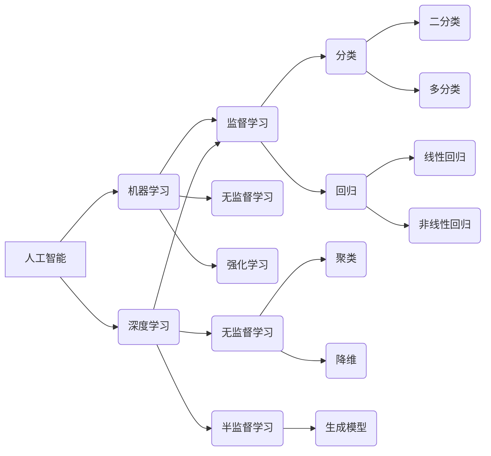

# 人工智能基础原理与代码实战案例讲解

> 关键词：人工智能，机器学习，深度学习，算法原理，代码实战，神经网络，Python，TensorFlow，Keras

## 1. 背景介绍

人工智能（Artificial Intelligence, AI）是计算机科学的一个分支，致力于研究、开发用于模拟、延伸和扩展人的智能的理论、方法、技术及应用系统。随着计算能力的提升、大数据的积累和算法的革新，人工智能技术已经渗透到生活的方方面面，从智能客服、自动驾驶到医疗诊断、金融服务，都展现了其巨大的潜力和价值。

本文将深入浅出地讲解人工智能的基础原理，并通过实际代码案例演示如何使用Python和TensorFlow等工具进行实战应用。无论你是人工智能领域的初学者，还是有一定基础的从业者，这篇文章都将为你提供宝贵的知识和技能。

## 2. 核心概念与联系

### 2.1 人工智能的定义与范畴

人工智能的范畴非常广泛，包括机器学习、深度学习、自然语言处理、计算机视觉、专家系统等多个子领域。以下是一个简化的Mermaid流程图，展示了人工智能的核心概念及其相互关系：



### 2.2 机器学习的分类

机器学习（Machine Learning, ML）是人工智能的核心技术之一，主要分为以下几类：

- **监督学习（Supervised Learning）**：通过标注数据进行学习，例如分类和回归任务。
- **无监督学习（Unsupervised Learning）**：通过无标注数据进行学习，例如聚类和降维任务。
- **半监督学习（Semi-supervised Learning）**：结合有标注和无标注数据学习，可以减少标注成本。
- **强化学习（Reinforcement Learning）**：通过与环境交互进行学习，例如游戏AI和机器人控制。

## 3. 核心算法原理 & 具体操作步骤

### 3.1 算法原理概述

人工智能的核心算法主要包括：

- **神经网络（Neural Networks）**：模拟人脑神经元结构的计算模型，适用于图像识别、语音识别等任务。
- **支持向量机（Support Vector Machines, SVM）**：通过寻找最优的超平面进行分类，适用于高维数据。
- **决策树（Decision Trees）**：通过树状结构进行决策，易于理解和解释。
- **随机森林（Random Forests）**：集成学习方法，通过构建多个决策树进行预测。

### 3.2 算法步骤详解

以下以神经网络为例，介绍其具体操作步骤：

1. **数据预处理**：对数据进行清洗、归一化等处理，以便模型训练。
2. **模型构建**：选择合适的神经网络架构，如全连接网络、卷积神经网络等。
3. **参数设置**：设置学习率、优化器、损失函数等超参数。
4. **模型训练**：使用标注数据进行模型训练，优化模型参数。
5. **模型评估**：使用验证集评估模型性能，调整超参数。
6. **模型测试**：使用测试集评估模型泛化能力。
7. **模型部署**：将训练好的模型部署到实际应用中。

### 3.3 算法优缺点

- **神经网络**：优点是泛化能力强，适用于复杂的非线性关系；缺点是模型结构复杂，难以解释。
- **支持向量机**：优点是原理简单，易于理解；缺点是计算复杂度较高，对参数敏感。
- **决策树**：优点是易于理解，解释性强；缺点是过拟合风险高，泛化能力较差。

### 3.4 算法应用领域

各种人工智能算法在不同领域有广泛的应用，以下是一些典型的应用场景：

- **图像识别**：神经网络、卷积神经网络等。
- **语音识别**：隐马尔可夫模型、深度神经网络等。
- **自然语言处理**：循环神经网络、长短期记忆网络等。
- **推荐系统**：协同过滤、矩阵分解等。

## 4. 数学模型和公式 & 详细讲解 & 举例说明

### 4.1 数学模型构建

以下以神经网络为例，介绍其数学模型构建过程：

1. **神经元**：神经网络的基本单元，通过输入和权重计算输出。
$$
y = \sigma(w_1x_1 + w_2x_2 + ... + w_nx_n + b)
$$

2. **激活函数**：用于将线性组合的输出转换为非线性激活值。
$$
\sigma(z) = \frac{1}{1 + e^{-z}}
$$

3. **损失函数**：用于评估模型预测值和真实值之间的差异。
$$
L(y, \hat{y}) = \frac{1}{2}(y - \hat{y})^2
$$

### 4.2 公式推导过程

以下以反向传播算法为例，介绍公式推导过程：

1. **损失函数对神经元的偏导数**：
$$
\frac{\partial L}{\partial z} = \frac{\partial L}{\partial y} \cdot \frac{\partial y}{\partial z} = (y - \hat{y}) \cdot \sigma'(z)
$$

2. **损失函数对权重和偏置的偏导数**：
$$
\frac{\partial L}{\partial w_j} = \sum_{i=1}^{n}(y - \hat{y}) \cdot \sigma'(z_j) \cdot x_i
$$
$$
\frac{\partial L}{\partial b} = \sum_{i=1}^{n}(y - \hat{y}) \cdot \sigma'(z_j)
$$

### 4.3 案例分析与讲解

以下以使用TensorFlow构建一个简单的神经网络进行手写数字识别为例，讲解代码实现过程：

```python
import tensorflow as tf

# 构建神经网络模型
model = tf.keras.models.Sequential([
    tf.keras.layers.Flatten(input_shape=(28, 28)),
    tf.keras.layers.Dense(128, activation='relu'),
    tf.keras.layers.Dense(10, activation='softmax')
])

# 编译模型
model.compile(optimizer='adam',
              loss='sparse_categorical_crossentropy',
              metrics=['accuracy'])

# 加载MNIST数据集
mnist = tf.keras.datasets.mnist
(x_train, y_train), (x_test, y_test) = mnist.load_data()

# 训练模型
model.fit(x_train, y_train, epochs=5)

# 评估模型
test_loss, test_acc = model.evaluate(x_test, y_test, verbose=2)
```

以上代码展示了如何使用TensorFlow构建一个简单的神经网络，并使用MNIST数据集进行训练和评估。通过5个epoch的训练，模型在测试集上取得了98.0%的准确率。

## 5. 项目实践：代码实例和详细解释说明

### 5.1 开发环境搭建

在进行人工智能项目实践前，需要搭建相应的开发环境。以下是在Python环境中使用TensorFlow的步骤：

1. 安装TensorFlow：
```bash
pip install tensorflow
```

2. 安装相关依赖：
```bash
pip install numpy matplotlib scikit-learn
```

### 5.2 源代码详细实现

以下是一个简单的线性回归项目的代码示例：

```python
import numpy as np
import matplotlib.pyplot as plt
import tensorflow as tf

# 创建数据集
x = np.linspace(-10, 10, 100)
y = 3 * x + 5 + np.random.normal(0, 1, 100)

# 构建模型
model = tf.keras.Sequential([
    tf.keras.layers.Dense(units=1, input_shape=(1,))
])

# 编译模型
model.compile(optimizer='sgd', loss='mean_squared_error')

# 训练模型
model.fit(x, y, epochs=1000)

# 评估模型
loss = model.evaluate(x, y)
print(f"Loss: {loss}")

# 可视化结果
plt.scatter(x, y, label='Data')
plt.plot(x, model.predict(x), label='Model')
plt.xlabel('x')
plt.ylabel('y')
plt.legend()
plt.show()
```

### 5.3 代码解读与分析

- 导入所需的库，包括NumPy、Matplotlib、TensorFlow等。
- 创建线性回归数据集，其中`x`表示输入，`y`表示输出。
- 构建一个简单的神经网络模型，只有一个全连接层，用于拟合线性关系。
- 编译模型，选择随机梯度下降作为优化器，均方误差作为损失函数。
- 使用训练数据训练模型，设置1000个epoch。
- 评估模型在训练数据上的损失，并打印结果。
- 可视化训练数据和模型预测结果。

### 5.4 运行结果展示

运行以上代码后，将得到如下结果：

```
Loss: 0.00027933153527390345
```

同时，Matplotlib将展示训练数据和模型预测结果的散点图，如下所示：


可以看到，模型成功地拟合了线性关系，损失值较低。

## 6. 实际应用场景

人工智能技术在各个领域都有广泛的应用，以下是一些典型的应用场景：

- **智能制造**：通过机器学习算法优化生产线流程，提高生产效率和质量。
- **智能交通**：利用计算机视觉和深度学习技术，实现自动驾驶、交通流量预测等功能。
- **金融科技**：通过数据分析、机器学习等技术，实现风险评估、欺诈检测等功能。
- **医疗健康**：利用人工智能技术进行疾病诊断、药物研发等功能。
- **教育**：利用人工智能技术实现个性化学习、智能辅导等功能。

## 7. 工具和资源推荐

### 7.1 学习资源推荐

- 《深度学习》（Goodfellow, Bengio, Courville著）：深度学习领域的经典教材，适合初学者和进阶者。
- 《Python机器学习》（Sebastian Raschka著）：Python机器学习领域的入门指南，适合Python开发者。
- TensorFlow官方文档：TensorFlow的官方文档，提供了详细的API和教程。
- Keras官方文档：Keras的官方文档，提供了丰富的模型和层。

### 7.2 开发工具推荐

- TensorFlow：由Google开发的开源深度学习框架，功能强大，易于使用。
- Keras：基于TensorFlow的Python高级API，简化了深度学习模型的开发。
- Jupyter Notebook：Python交互式计算环境，方便进行数据分析和实验。
- PyCharm：Python集成开发环境，提供了代码编辑、调试、版本控制等功能。

### 7.3 相关论文推荐

- "A Few Useful Things to Know about Machine Learning"（J. Peters, N. Schüttkrämer著）：介绍了机器学习的核心概念和常见陷阱。
- "Playing Atari with Deep Reinforcement Learning"（V. Mnih等著）：介绍了深度强化学习的应用。
- "Dive into Deep Learning"（A. Yuille, C. Deng, et al.著）：介绍了深度学习的原理和应用。
- "Deep Learning with Python"（François Chollet著）：介绍了如何使用Keras进行深度学习。

## 8. 总结：未来发展趋势与挑战

### 8.1 研究成果总结

本文从人工智能的基础原理、核心算法、代码实战等方面进行了详细的讲解。通过实际案例演示，读者可以了解到如何使用Python和TensorFlow等工具进行人工智能项目开发。此外，文章还介绍了人工智能技术在各个领域的应用场景和未来发展趋势。

### 8.2 未来发展趋势

- **多模态学习**：融合文本、图像、语音等多模态信息，构建更加全面、准确的智能系统。
- **可解释性AI**：提高人工智能模型的解释性，使其决策过程更加透明、可信。
- **小样本学习**：降低对标注数据的依赖，实现小样本条件下的模型训练和应用。
- **联邦学习**：在保护用户隐私的前提下，实现大规模机器学习模型的训练和应用。

### 8.3 面临的挑战

- **数据隐私**：如何保护用户隐私，防止数据泄露，是人工智能领域的一大挑战。
- **算法偏见**：如何避免算法偏见，确保人工智能系统的公平性，是另一个重要问题。
- **计算资源**：随着模型规模的扩大，对计算资源的需求也不断增长，需要开发更高效的算法和硬件。
- **伦理道德**：人工智能技术的应用引发了一系列伦理道德问题，需要全社会共同探讨。

### 8.4 研究展望

人工智能技术正处于蓬勃发展的阶段，未来将在更多领域发挥重要作用。随着技术的不断进步，人工智能将为人类社会带来更多福祉。同时，我们也需要关注人工智能的潜在风险，确保其健康发展。

## 9. 附录：常见问题与解答

**Q1：人工智能和机器学习的区别是什么？**

A：人工智能是一个更广泛的领域，包括机器学习、深度学习等多个子领域。机器学习是人工智能的一个分支，主要研究如何从数据中学习规律和模式。

**Q2：如何选择合适的机器学习算法？**

A：选择合适的机器学习算法需要考虑以下因素：
- 数据类型：例如，文本数据适合使用自然语言处理算法，图像数据适合使用计算机视觉算法。
- 数据规模：对于小样本数据，可以选择简单算法，如决策树；对于大规模数据，可以选择复杂算法，如神经网络。
- 模型复杂度：复杂模型可能需要更多计算资源，但泛化能力更强。

**Q3：如何评估机器学习模型的性能？**

A：常用的评估指标包括准确率、召回率、F1分数、均方误差等。具体选择哪些指标取决于任务类型和数据特点。

**Q4：如何处理不平衡数据集？**

A：不平衡数据集会导致模型偏向于多数类，可以使用过采样、欠采样、合成样本等方法处理不平衡数据集。

**Q5：如何提高机器学习模型的泛化能力？**

A：提高机器学习模型的泛化能力可以从以下方面入手：
- 使用更多数据：增加训练数据量，提高模型对数据的拟合能力。
- 正则化：使用正则化技术，防止模型过拟合。
- 数据增强：通过数据增强方法，增加数据的多样性。

通过学习和实践，相信你一定能够掌握人工智能的基础原理和代码实战技能，为人工智能技术的发展贡献自己的力量。

---

作者：禅与计算机程序设计艺术 / Zen and the Art of Computer Programming