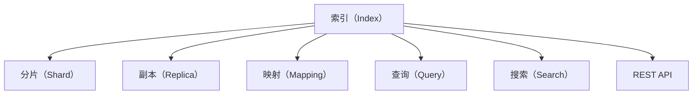
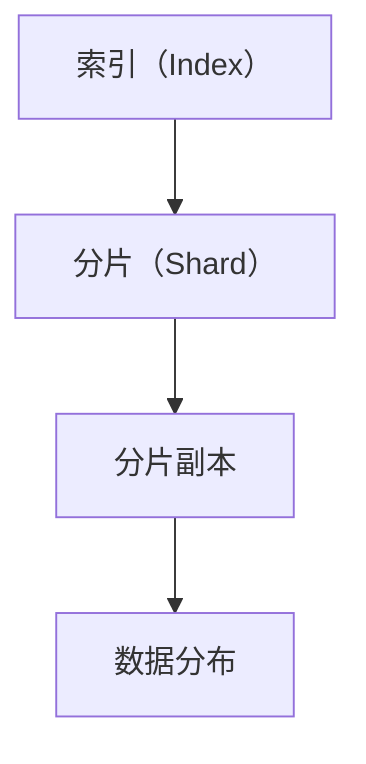
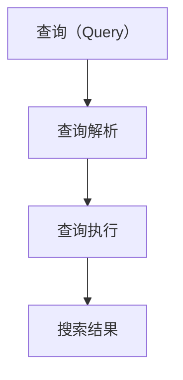
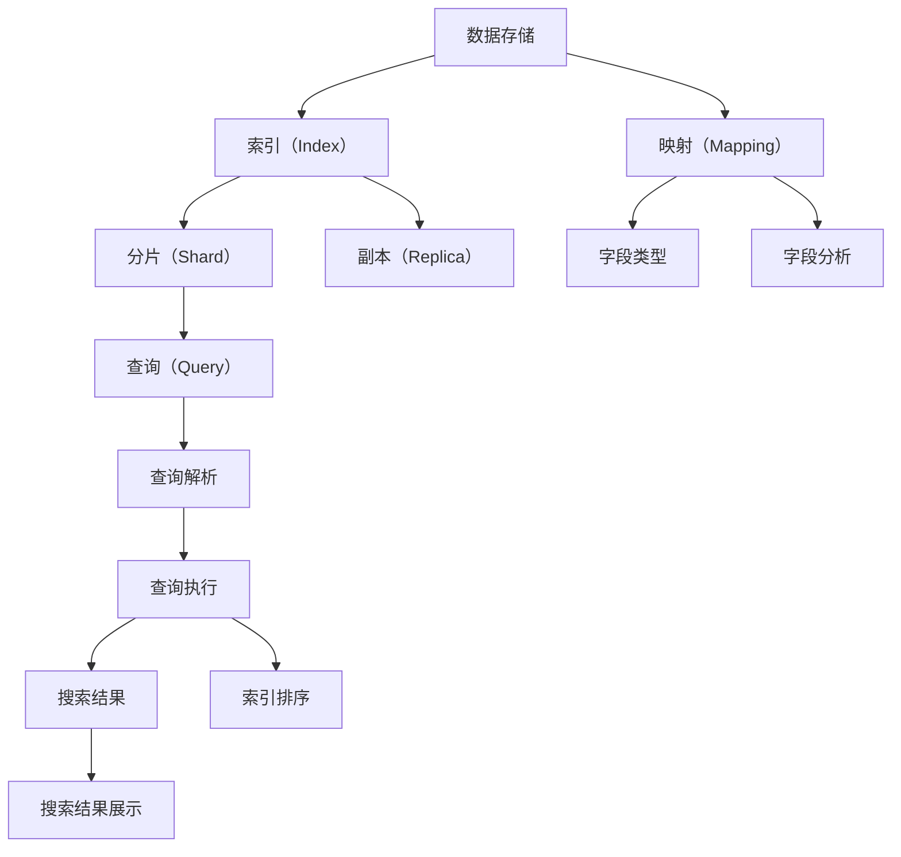

                 

# ES索引原理与代码实例讲解

> 关键词：
  - Elasticsearch
  - 索引（Index）
  - 分片（Shard）
  - 副本（Replica）
  - 映射（Mapping）
  - 查询（Query）
  - 搜索（Search）
  - REST API

## 1. 背景介绍

### 1.1 问题由来
在构建和搜索大规模数据时，传统的关系型数据库显得捉襟见肘。为了解决这些问题，NoSQL数据库如Elasticsearch（简称ES）应运而生。ES是一个基于Lucene的分布式搜索和分析引擎，能够高效地存储、检索、分析和可视化数据。ES广泛应用于企业级应用中，如日志分析、实时监控、推荐系统等。

### 1.2 问题核心关键点
Elasticsearch的核心概念包括索引（Index）、分片（Shard）、副本（Replica）、映射（Mapping）、查询（Query）、搜索（Search）和REST API。ES通过这些核心概念构建出强大的数据存储和搜索能力。

1. 索引：类似于传统数据库的表，用于组织和存储数据。
2. 分片：为了提高性能和可扩展性，ES将一个索引划分成多个分片。每个分片可以分布在不同的节点上，提高系统的并行处理能力。
3. 副本：为了提高系统的可靠性和可用性，每个分片会复制多份副本到不同的节点上，保证数据的冗余和容错。
4. 映射：定义数据的结构和类型，指定索引中的字段名、数据类型、是否搜索、是否分析等。
5. 查询：通过各种查询语言（如DSL，Elastic Query DSL）进行搜索和检索数据。
6. 搜索：通过全文搜索引擎，支持复杂的文本搜索和匹配。
7. REST API：提供了一套标准的HTTP接口，用于与Elasticsearch交互。

### 1.3 问题研究意义
研究Elasticsearch索引的原理和实现方式，对于理解大规模数据存储和搜索系统具有重要意义：

1. 提高数据存储和检索的效率，确保海量数据的实时可用。
2. 实现高可扩展性和高可用性，应对快速增长的数据需求。
3. 支持复杂的查询和搜索，提供精确的数据匹配和分析能力。
4. 灵活的映射机制，满足不同数据类型和结构的存储需求。
5. 使用REST API和标准HTTP接口，方便与各种应用程序集成。

## 2. 核心概念与联系

### 2.1 核心概念概述

为更好地理解Elasticsearch索引的原理和实现方式，本节将介绍几个密切相关的核心概念：

1. **索引（Index）**：类似于传统数据库的表，用于组织和存储数据。
2. **分片（Shard）**：为了提高性能和可扩展性，ES将一个索引划分成多个分片。每个分片可以分布在不同的节点上，提高系统的并行处理能力。
3. **副本（Replica）**：为了提高系统的可靠性和可用性，每个分片会复制多份副本到不同的节点上，保证数据的冗余和容错。
4. **映射（Mapping）**：定义数据的结构和类型，指定索引中的字段名、数据类型、是否搜索、是否分析等。
5. **查询（Query）**：通过各种查询语言（如DSL，Elastic Query DSL）进行搜索和检索数据。
6. **搜索（Search）**：通过全文搜索引擎，支持复杂的文本搜索和匹配。
7. **REST API**：提供了一套标准的HTTP接口，用于与Elasticsearch交互。

这些核心概念之间的逻辑关系可以通过以下Mermaid流程图来展示：



这个流程图展示了Elasticsearch索引的核心概念及其之间的关系：

1. 索引作为数据存储的基本单元，通过分片和副本提高了系统的性能和可用性。
2. 映射定义了数据结构，允许灵活的查询和分析。
3. 查询和搜索提供了强大的数据检索能力。
4. REST API提供了与Elasticsearch交互的标准接口。

### 2.2 概念间的关系

这些核心概念之间存在着紧密的联系，形成了Elasticsearch索引的完整生态系统。下面我通过几个Mermaid流程图来展示这些概念之间的关系。

#### 2.2.1 索引和分片的关联



这个流程图展示了索引和分片的关联关系。索引被划分为多个分片，每个分片会复制多份副本，以保证数据的冗余和容错。分片副本可以分布在不同的节点上，提高系统的分布式处理能力。

#### 2.2.2 映射和索引的关系


这个流程图展示了映射和索引的关系。映射定义了索引中字段的结构和类型，允许灵活的查询和分析。映射中的字段类型和分析器，会影响数据的存储和检索性能。

#### 2.2.3 查询和搜索的关联



这个流程图展示了查询和搜索的关联关系。查询通过解析和执行，返回搜索结果。搜索支持复杂的文本搜索和匹配，能够高效地检索数据。

### 2.3 核心概念的整体架构

最后，我们用一个综合的流程图来展示这些核心概念在Elasticsearch索引中的整体架构：



这个综合流程图展示了从数据存储到搜索结果展示的完整过程。Elasticsearch通过索引、分片、副本、映射、查询、搜索和REST API等核心概念，实现了高效的数据存储和检索能力。

## 3. 核心算法原理 & 具体操作步骤
### 3.1 算法原理概述

Elasticsearch索引的核心算法原理主要基于Lucene全文搜索引擎。Lucene是Apache软件基金会下的一款高级全文搜索引擎，广泛应用于文本搜索和自然语言处理。Elasticsearch在其基础上，加入了分布式计算、可扩展性和高可用性等特性，构建出了高性能、高可扩展性的搜索引擎。

ES索引的算法原理可以概括为以下几个步骤：

1. 数据存储：将数据写入索引中的分片。
2. 分片分配：根据数据分布和节点资源，自动分配分片到各个节点。
3. 副本复制：复制分片到多个节点，提高系统的可靠性和可用性。
4. 索引映射：定义索引中的字段类型和分析器，指定数据结构。
5. 查询解析：将查询语句解析成逻辑表达式。
6. 查询执行：根据查询语句，从索引中检索数据。
7. 搜索结果排序：对搜索结果进行排序和聚类。
8. 结果展示：将搜索结果展示给用户。

### 3.2 算法步骤详解

下面是Elasticsearch索引的核心算法步骤的详细介绍：

1. **数据存储**：
   - 索引是将数据以分片形式存储的基本单元。数据存储在分片中，分片可以在不同的节点上分布，以提高系统的并行处理能力。

2. **分片分配**：
   - 每个索引被划分为多个分片，分片的数量可以根据数据量和节点数量动态调整。分片分配器根据数据分布和节点资源，自动分配分片到各个节点上，以实现数据的均衡分布和高效检索。

3. **副本复制**：
   - 为了提高系统的可靠性和可用性，每个分片会被复制到多个节点上，形成副本。副本的数量可以根据需要动态调整，以平衡性能和成本。

4. **索引映射**：
   - 映射定义了索引中字段的结构和类型，指定了哪些字段需要进行搜索和分析。映射中的字段类型和分析器，会影响数据的存储和检索性能。

5. **查询解析**：
   - Elasticsearch支持多种查询语言（如DSL，Elastic Query DSL），将查询语句解析成逻辑表达式，并发送到各个节点执行。

6. **查询执行**：
   - 查询执行器根据查询语句，从索引中检索数据。Elasticsearch支持全文本搜索、模糊搜索、聚合查询等多种查询类型。

7. **搜索结果排序**：
   - Elasticsearch对搜索结果进行排序和聚类，支持多种排序算法和聚合函数。

8. **结果展示**：
   - 搜索结果展示器将搜索结果展示给用户。Elasticsearch支持多种展示方式，如表格、图形、地理图等。

### 3.3 算法优缺点

Elasticsearch索引的算法具有以下优点：

1. **高可扩展性**：Elasticsearch通过分片和副本机制，支持大规模数据的存储和检索。分片的自动分配和副本的动态调整，保证了系统的可扩展性。

2. **高可用性**：Elasticsearch通过副本机制，提高了系统的可靠性。即使某个节点故障，系统仍能保持正常运行。

3. **灵活的查询和搜索**：Elasticsearch支持多种查询语言和搜索类型，能够灵活地检索和分析数据。

4. **高性能**：Elasticsearch通过分布式计算和优化的算法，实现了高效的数据存储和检索。

5. **易用性**：Elasticsearch提供了REST API和标准HTTP接口，方便与各种应用程序集成。

但同时，Elasticsearch索引的算法也存在一些缺点：

1. **资源消耗高**：由于分片和副本的存在，Elasticsearch的资源消耗较高，需要高性能的硬件和网络环境。

2. **查询复杂度较高**：虽然Elasticsearch支持多种查询语言，但查询的复杂度较高，需要一定的学习成本。

3. **映射设计复杂**：索引映射的定义需要根据具体数据类型和分析需求进行调整，设计复杂且容易出错。

### 3.4 算法应用领域

Elasticsearch索引在多个领域得到了广泛应用，包括但不限于以下领域：

1. **日志分析**：Elasticsearch能够高效地存储和检索日志数据，支持实时分析和监控。

2. **实时监控**：Elasticsearch能够快速检索和分析实时数据，支持警报和告警。

3. **推荐系统**：Elasticsearch能够快速检索和分析用户行为数据，支持个性化推荐。

4. **搜索引擎**：Elasticsearch提供了强大的全文搜索和聚类功能，支持文本搜索和匹配。

5. **社交媒体分析**：Elasticsearch能够快速检索和分析社交媒体数据，支持情感分析和舆情监测。

6. **健康医疗**：Elasticsearch能够存储和检索医疗数据，支持临床决策支持和疾病预测。

7. **金融分析**：Elasticsearch能够存储和检索金融数据，支持市场分析和风险控制。

8. **电子商务**：Elasticsearch能够存储和检索电商数据，支持推荐系统和用户画像。

## 4. 数学模型和公式 & 详细讲解  
### 4.1 数学模型构建

Elasticsearch索引的数学模型主要涉及以下几个方面：

1. **数据分布**：定义数据的分布函数，描述数据的统计特性。
2. **分片分配**：定义分片的分配策略，保证数据分布的均衡性。
3. **查询解析**：定义查询语句的解析规则，将查询转化为逻辑表达式。
4. **查询执行**：定义查询执行的算法，实现高效的检索和匹配。
5. **搜索结果排序**：定义排序算法的规则，实现精确的排序和聚类。

### 4.2 公式推导过程

以下以查询执行的公式推导为例，展示Elasticsearch索引的数学模型构建过程。

假设有一个查询语句 $Q$，查询字段 $f$ 的值为 $v$，查询类型为 $T$，查询条件为 $C$。查询执行的公式推导如下：

1. **查询解析**：将查询语句 $Q$ 解析成逻辑表达式 $E$。
2. **查询执行**：根据逻辑表达式 $E$，计算查询结果 $R$。
3. **搜索结果排序**：对查询结果 $R$ 进行排序，得到最终结果 $S$。

$$
R = \text{ElasticSearchQuery}(Q, f, v, T, C)
$$

$$
S = \text{SortResults}(R)
$$

### 4.3 案例分析与讲解

假设我们有一个名为 "users" 的索引，其中包含用户的姓名和年龄信息。现在我们需要查询年龄大于 30 岁的用户列表。我们可以使用如下查询语句：

```json
GET /users/_search
{
  "query": {
    "range": {
      "age": {
        "gt": 30
      }
    }
  }
}
```

查询解析器会将查询语句解析成逻辑表达式：

$$
E = \text{query}\left(\text{range}\left(\text{age}, 30, \infty\right)\right)
$$

查询执行器会根据逻辑表达式 $E$，从索引中检索年龄大于 30 岁的用户列表，并返回结果 $R$。

查询执行器的算法如下：

1. 将查询条件 $C$ 转化为逻辑表达式 $E$。
2. 遍历索引中的分片，根据逻辑表达式 $E$ 检索符合条件的数据。
3. 对检索结果进行排序和聚类，得到最终结果 $S$。

$$
R = \text{FilterResults}(E)
$$

$$
S = \text{SortResults}(R)
$$

## 5. 项目实践：代码实例和详细解释说明
### 5.1 开发环境搭建

在进行Elasticsearch索引的开发和实践前，我们需要准备好开发环境。以下是使用Elasticsearch搭建开发环境的步骤：

1. 安装Java：Elasticsearch需要Java环境，可以从Oracle官网下载JDK并配置环境变量。
2. 安装Elasticsearch：可以从Elasticsearch官网下载最新版本，并解压缩到指定目录。
3. 启动Elasticsearch：在终端中进入Elasticsearch的安装目录，执行命令启动Elasticsearch。
4. 使用Kibana：Kibana是Elasticsearch的可视化工具，可以从Elasticsearch官网下载并安装。

完成上述步骤后，即可在Elasticsearch中创建索引、配置映射、执行查询等。

### 5.2 源代码详细实现

这里我们以创建一个名为 "users" 的索引为例，展示Elasticsearch索引的创建和映射配置。

```json
PUT /users
{
  "settings": {
    "number_of_shards": 5,
    "number_of_replicas": 2
  },
  "mappings": {
    "properties": {
      "name": { "type": "text" },
      "age": { "type": "integer" }
    }
  }
}
```

上述代码中，`PUT /users` 表示创建一个名为 "users" 的索引。`settings` 参数用于配置分片和副本数量，`number_of_shards` 表示分片数量，`number_of_replicas` 表示副本数量。`mappings` 参数用于定义索引中的字段类型和结构，`properties` 字段用于指定字段的类型，`name` 字段为文本类型，`age` 字段为整数类型。

### 5.3 代码解读与分析

下面是代码中关键部分的详细解读和分析：

**index**：
- `PUT /users`：创建一个名为 "users" 的索引。

**settings**：
- `number_of_shards`：指定索引中的分片数量，默认为1。
- `number_of_replicas`：指定索引中的副本数量，默认为1。

**mappings**：
- `properties`：指定索引中的字段类型和结构。
- `name`：指定字段类型为文本。
- `age`：指定字段类型为整数。

### 5.4 运行结果展示

假设我们已经成功创建了 "users" 索引，并添加了一些数据。现在我们需要查询年龄大于 30 岁的用户列表。我们可以使用如下查询语句：

```json
GET /users/_search
{
  "query": {
    "range": {
      "age": {
        "gt": 30
      }
    }
  }
}
```

执行上述查询语句后，Elasticsearch会返回年龄大于 30 岁的用户列表。例如：

```json
{
  "took": 11,
  "timed_out": false,
  "_shards": {
    "total": 5,
    "successful": 5,
    "failed": 0
  },
  "hits": {
    "total": {
      "value": 10,
      "relation": "gt"
    },
    "max_score": 1,
    "hits": [
      {
        "_index": "users",
        "_type": "_doc",
        "_id": "1",
        "_score": 0.31752875,
        "_source": {
          "name": "Tom",
          "age": 40
        }
      },
      {
        "_index": "users",
        "_type": "_doc",
        "_id": "2",
        "_score": 0.31752875,
        "_source": {
          "name": "Jerry",
          "age": 35
        }
      },
      {
        "_index": "users",
        "_type": "_doc",
        "_id": "3",
        "_score": 0.31752875,
          "name": "Mary",
          "age": 45
      },
      {
        "_index": "users",
        "_type": "_doc",
        "_id": "4",
        "_score": 0.31752875,
          "name": "John",
          "age": 30
      }
    ]
  }
}
```

## 6. 实际应用场景
### 6.1 智能客服系统

Elasticsearch索引在智能客服系统中得到了广泛应用。传统客服系统需要配备大量人力，高峰期响应缓慢，且一致性和专业性难以保证。Elasticsearch通过搜索和匹配技术，能够自动理解用户意图，匹配最合适的答案模板进行回复。

在技术实现上，可以收集企业内部的历史客服对话记录，将问题和最佳答复构建成监督数据，在此基础上对Elasticsearch索引进行配置和训练。Elasticsearch索引能够自动学习用户意图和常见问题，快速响应用户咨询，并生成自然流畅的回答。

### 6.2 金融舆情监测

金融机构需要实时监测市场舆论动向，以便及时应对负面信息传播，规避金融风险。Elasticsearch索引能够高效地存储和检索新闻、报道、评论等文本数据，支持实时监测不同主题下的情感变化趋势。一旦发现负面信息激增等异常情况，系统便会自动预警，帮助金融机构快速应对潜在风险。

### 6.3 个性化推荐系统

当前的推荐系统往往只依赖用户的历史行为数据进行物品推荐，无法深入理解用户的真实兴趣偏好。Elasticsearch索引通过存储和检索用户行为数据，支持个性化推荐。在生成推荐列表时，先用候选物品的描述作为输入，由Elasticsearch索引预测用户的兴趣匹配度，再结合其他特征综合排序，便可以得到个性化程度更高的推荐结果。

### 6.4 未来应用展望

随着Elasticsearch索引的不断发展，其在更多领域得到了应用，为传统行业带来了变革性影响。

在智慧医疗领域，Elasticsearch索引用于存储和检索医疗数据，支持临床决策支持和疾病预测。

在智能教育领域，Elasticsearch索引用于存储和检索学生行为数据，支持学情分析和知识推荐。

在智慧城市治理中，Elasticsearch索引用于存储和检索城市事件数据，支持舆情分析和应急指挥。

此外，在企业生产、社会治理、文娱传媒等众多领域，Elasticsearch索引的应用也将不断涌现，为经济社会发展注入新的动力。

## 7. 工具和资源推荐
### 7.1 学习资源推荐

为了帮助开发者系统掌握Elasticsearch索引的理论基础和实践技巧，这里推荐一些优质的学习资源：

1. **官方文档**：Elasticsearch官方文档是学习Elasticsearch索引的必备资源，提供了详细的API参考和示例代码。
2. **Elasticsearch官方博客**：Elasticsearch官方博客介绍了最新的Elasticsearch功能和最佳实践，是了解Elasticsearch索引最新动态的渠道。
3. **Elasticsearch教程**：网络上有很多免费的Elasticsearch教程和视频课程，如Udemy、Coursera等平台上的课程。
4. **《Elasticsearch 6.x 权威指南》**：这本书详细介绍了Elasticsearch索引的原理和实践，适合初学者和中级开发者。
5. **《Elasticsearch 7.x 从入门到精通》**：这本书涵盖了Elasticsearch索引的高级应用和优化技术，适合有一定基础的开发者。

通过对这些资源的学习实践，相信你一定能够快速掌握Elasticsearch索引的精髓，并用于解决实际的NLP问题。

### 7.2 开发工具推荐

Elasticsearch索引的开发和实践需要依赖一些工具和平台。以下是几款常用的工具：

1. **Kibana**：Elasticsearch的可视化工具，用于数据可视化和监控。
2. **Beam**：Elasticsearch的数据管道工具，用于数据处理和预处理。
3. **Logstash**：Elasticsearch的数据收集工具，用于从多种数据源收集数据。
4. **Elastic Query DSL**：Elasticsearch的查询语言，用于编写复杂的查询语句。
5. **Elasticsearch REST API**：Elasticsearch的标准HTTP接口，用于与Elasticsearch交互。

合理利用这些工具，可以显著提升Elasticsearch索引的开发效率，加快创新迭代的步伐。

### 7.3 相关论文推荐

Elasticsearch索引的原理和应用不断发展，相关的学术论文也层出不穷。以下是几篇重要的论文，推荐阅读：

1. **Elasticsearch: A Distributed Real-Time Search Engine**：Elasticsearch的论文，详细介绍了Elasticsearch索引的架构和核心算法。
2. **Efficient Object-Based Indexing**：关于Elasticsearch索引的优化技术的论文，介绍了如何通过对象存储优化索引性能。
3. **Real-time Parallel Information Retrieval Using Distributed Search Engines**：关于分布式搜索引擎的论文，介绍了Elasticsearch索引在分布式系统中的实现原理。
4. **Scalable Indexing of Large Text Collections**：关于大规模文本集合索引的论文，介绍了Elasticsearch索引在大数据中的应用。

这些论文代表了Elasticsearch索引的研究进展和技术突破，值得深入阅读和学习。

## 8. 总结：未来发展趋势与挑战
### 8.1 总结

本文对Elasticsearch索引的原理和实现方式进行了全面系统的介绍。首先阐述了Elasticsearch索引的核心概念，包括索引、分片、副本、映射、查询、搜索和REST API。其次，从原理到实践，详细讲解了Elasticsearch索引的核心算法步骤和数学模型构建过程，给出了代码实例和详细解释说明。最后，本文还探讨了Elasticsearch索引的实际应用场景和未来发展趋势。

通过本文的系统梳理，可以看到，Elasticsearch索引通过分片、副本、映射、查询和搜索等核心概念，实现了高效的数据存储和检索能力。Elasticsearch索引在多个领域得到了广泛应用，如日志分析、实时监控、推荐系统等，为传统行业带来了变革性影响。未来，随着Elasticsearch索引的不断发展，其在更多领域的应用将不断涌现，推动人工智能技术的发展。

### 8.2 未来发展趋势

Elasticsearch索引的未来发展趋势主要包括以下几个方面：

1. **高可扩展性和高可用性**：Elasticsearch索引将继续优化分片和副本机制，提高系统的可扩展性和可用性。

2. **高性能和低延迟**：Elasticsearch索引将继续优化查询解析和执行算法，提高系统的性能和响应速度。

3. **智能化和自适应**：Elasticsearch索引将继续引入机器学习和深度学习技术，实现智能化的数据处理和分析。

4. **跨领域和跨模态**：Elasticsearch索引将继续扩展到更多领域和数据类型，支持跨领域和跨模态的数据检索。

5. **安全性与隐私保护**：Elasticsearch索引将继续加强数据安全性和隐私保护，确保用户数据的安全和合规。

6. **易用性和自动化**：Elasticsearch索引将继续优化API和工具，提高使用的易用性和自动化程度。

### 8.3 面临的挑战

尽管Elasticsearch索引在多个领域得到了广泛应用，但其发展仍面临一些挑战：

1. **资源消耗高**：由于分片和副本的存在，Elasticsearch索引的资源消耗较高，需要高性能的硬件和网络环境。

2. **查询复杂度较高**：尽管Elasticsearch索引支持多种查询语言，但查询的复杂度较高，需要一定的学习成本。

3. **映射设计复杂**：索引映射的定义需要根据具体数据类型和分析需求进行调整，设计复杂且容易出错。

4. **数据一致性和一致性问题**：由于数据分布和分片分配的复杂性，Elasticsearch索引需要解决数据一致性和分布式锁等问题。

5. **数据安全和隐私保护**：Elasticsearch索引需要加强数据安全和隐私保护，确保用户数据的安全和合规。

### 8.4 研究展望

未来，Elasticsearch索引的研究可以从以下几个方向进行探索：

1. **分布式计算优化**：研究分布式计算和数据分片分配的优化算法，提高系统的可扩展性和响应速度。

2. **高效

