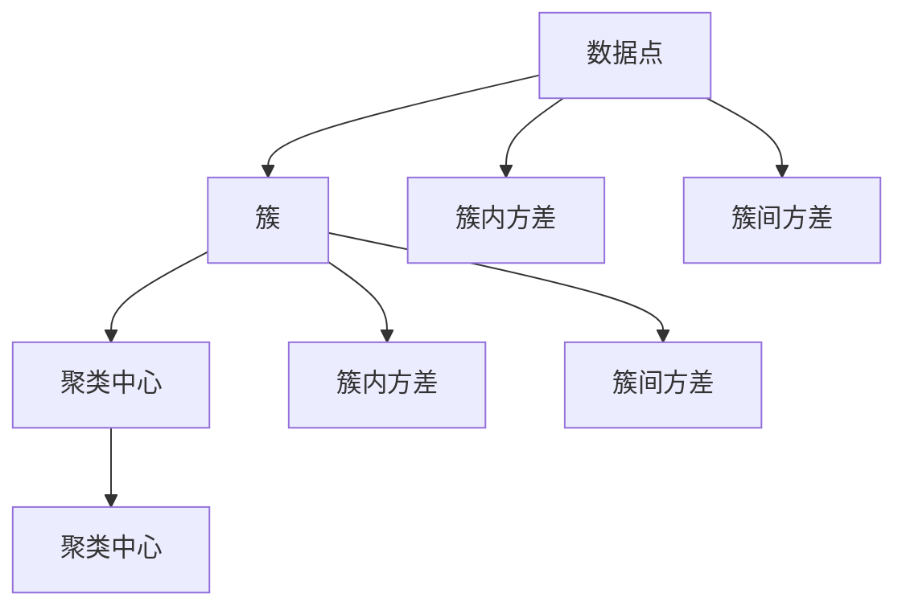
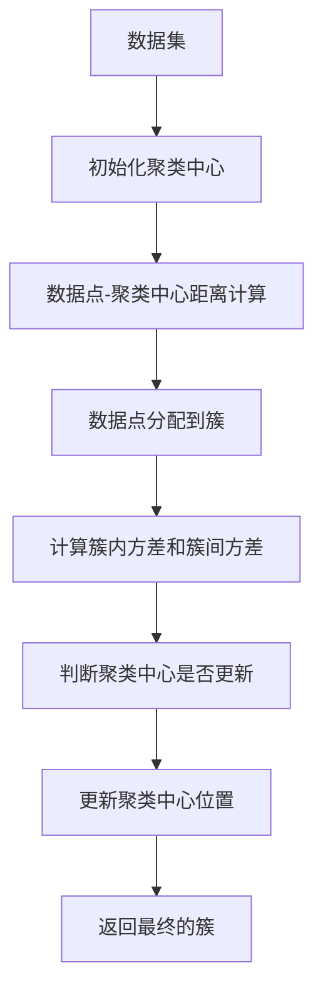

                 

# K-均值聚类K-means原理与代码实例讲解

> 关键词：聚类, 数据分类, K-均值, 数学建模, Python代码实现

## 1. 背景介绍

### 1.1 问题由来
聚类是机器学习中一种基础但极其重要的任务，它旨在将数据集中的样本划分为多个子集，使得同一子集内的样本相似度尽可能高，不同子集之间的相似度尽可能低。K-均值聚类（K-means）算法作为聚类方法之一，因其简单高效，成为实际应用中广泛使用的算法之一。K-均值算法可以用于市场细分、客户分群、图像分割、基因表达谱聚类等领域，是数据科学和工程中不可或缺的工具。

### 1.2 问题核心关键点
K-均值聚类算法的核心在于通过迭代地调整每个数据点的聚类中心（即均值），将数据点分配到与其最近的聚类中心所在的簇中，最终使得簇内方差最小化，簇间方差最大化。其关键步骤包括：
- 初始化K个聚类中心
- 对每个数据点计算其到各个聚类中心的距离，将其分配到最近的聚类中心所在的簇中
- 重新计算每个簇的聚类中心
- 重复上述步骤，直至聚类中心不再变化或达到预设的迭代次数

K-均值算法的优点在于计算简单、易于实现，且具有良好的可扩展性。然而，其缺点也较为明显：
- 对初始聚类中心的选择敏感
- 对于非球形的簇以及具有噪声的数据集效果不佳
- 只能确定数据点属于哪个簇，无法给出簇的数量

## 2. 核心概念与联系

### 2.1 核心概念概述

K-均值聚类算法涉及多个核心概念，包括：

- **簇（Cluster）**：数据集中的子集，其中每个数据点的特征相似度较高。
- **聚类中心（Centroid）**：每个簇的代表点，即簇中所有数据点的均值。
- **簇内方差（In-cluster variance）**：同一簇内的数据点与其聚类中心的距离平方和。
- **簇间方差（Between-cluster variance）**：不同簇之间的距离平方和。
- **迭代优化**：通过不断调整聚类中心和簇的分配，使簇内方差最小化，簇间方差最大化。

这些概念共同构成了K-均值聚类算法的基本框架。

### 2.2 概念间的关系

通过以下Mermaid流程图，可以更直观地理解K-均值聚类算法中各概念之间的关系：



该图展示了数据点如何被划分为簇，簇内的方差和簇间的方差如何计算，以及聚类中心如何更新。每个簇的聚类中心是簇内所有数据点的均值，而簇内方差和簇间方差则用于评估聚类的效果和优化聚类中心的位置。

### 2.3 核心概念的整体架构

K-均值聚类算法的整体架构可以通过以下Mermaid流程图来展示：



该图展示了K-均值算法的整个迭代过程，从初始化聚类中心开始，经过计算距离、数据点分配、方差计算、聚类中心更新，最终得到最优的簇划分。

## 3. 核心算法原理 & 具体操作步骤

### 3.1 算法原理概述

K-均值聚类算法基于最小化簇内方差的目标，通过迭代地调整聚类中心和簇的分配，使簇内数据点与其聚类中心的距离平方和最小化。其核心思想如下：
1. 初始化K个聚类中心。
2. 对每个数据点计算其到各个聚类中心的距离，将其分配到最近的聚类中心所在的簇中。
3. 重新计算每个簇的聚类中心。
4. 重复步骤2和3，直至聚类中心不再变化或达到预设的迭代次数。

### 3.2 算法步骤详解

下面是K-均值聚类算法的详细步骤：

**步骤1：初始化聚类中心**
- 随机选择K个数据点作为初始聚类中心。

**步骤2：数据点分配到簇**
- 对每个数据点，计算其到各个聚类中心的距离，将其分配到最近的聚类中心所在的簇中。

**步骤3：计算新的聚类中心**
- 对每个簇，计算其所有数据点的均值，作为新的聚类中心。

**步骤4：迭代优化**
- 重复步骤2和3，直至聚类中心不再变化或达到预设的迭代次数。

### 3.3 算法优缺点
K-均值聚类算法的优点包括：
- 计算简单，易于实现
- 聚类结果易于理解，直观
- 可扩展性好，适用于大规模数据集

其缺点包括：
- 对初始聚类中心的选择敏感
- 对于非球形的簇以及具有噪声的数据集效果不佳
- 只能确定数据点属于哪个簇，无法给出簇的数量

### 3.4 算法应用领域

K-均值聚类算法在多个领域得到了广泛应用，例如：
- 市场营销：通过市场细分，帮助企业识别目标客户群，制定更有效的营销策略。
- 生物学：用于基因表达谱聚类，帮助理解不同生物体之间的基因表达差异。
- 图像处理：用于图像分割，将图像分为不同的区域，用于目标检测和图像检索。
- 模式识别：用于识别不同的模式，如语音识别、手写字符识别等。
- 数据分析：用于数据分析中的异常点检测、降维等任务。

## 4. 数学模型和公式 & 详细讲解  
### 4.1 数学模型构建

K-均值聚类算法的数学模型如下：
设数据集为 $D=\{ x_1, x_2, \ldots, x_n \}$，其中 $x_i \in \mathbb{R}^d$ 表示数据点的特征向量。

- 聚类中心：$C = \{ \mu_1, \mu_2, \ldots, \mu_K \}$，其中 $\mu_k \in \mathbb{R}^d$ 表示第 $k$ 个簇的聚类中心。
- 每个数据点 $x_i$ 到每个聚类中心 $\mu_k$ 的距离为 $d(x_i, \mu_k) = \sqrt{ \sum_{j=1}^d (x_i[j] - \mu_k[j])^2 }$。
- 簇内方差：$S_k = \sum_{i=1}^n d(x_i, \mu_k)^2$。
- 簇间方差：$S_{\text{w}} = \sum_{k=1}^K S_k$。

目标函数为：
$$
\min_{C} \sum_{i=1}^n \min_{k=1}^K d(x_i, \mu_k)^2
$$

### 4.2 公式推导过程

通过上述公式，我们可以使用梯度下降算法来求解最优的聚类中心。对于每个聚类中心 $\mu_k$，其梯度为：
$$
\nabla_{\mu_k} S_k = \sum_{i=1}^n 2(x_i - \mu_k)
$$

因此，优化目标可以表示为：
$$
\min_{C} \sum_{k=1}^K \frac{1}{2} \sum_{i=1}^n (x_i - \mu_k)^2
$$

通过梯度下降算法，更新聚类中心的公式为：
$$
\mu_k = \frac{1}{\sum_{i=1}^n \delta_{ik}} \sum_{i=1}^n \delta_{ik} x_i
$$
其中 $\delta_{ik} = 1$ 表示数据点 $x_i$ 属于簇 $k$，否则为0。

### 4.3 案例分析与讲解

以鸢尾花数据集为例，展示K-均值聚类算法的使用。

**数据集准备**
- 从scikit-learn库中加载鸢尾花数据集。
- 将数据集分为特征和标签，并将数据标准化。

```python
from sklearn.datasets import load_iris
from sklearn.preprocessing import StandardScaler

iris = load_iris()
X = iris.data
y = iris.target
scaler = StandardScaler()
X = scaler.fit_transform(X)
```

**初始化聚类中心**
- 随机选择K个数据点作为初始聚类中心。

```python
import numpy as np
np.random.seed(42)
K = 3
centers = np.random.randn(K, X.shape[1])
```

**数据点分配到簇**
- 对每个数据点计算其到各个聚类中心的距离，将其分配到最近的聚类中心所在的簇中。

```python
from sklearn.metrics.pairwise import euclidean_distances

distances = euclidean_distances(X, centers)
labels = np.argmin(distances, axis=1)
```

**计算新的聚类中心**
- 对每个簇，计算其所有数据点的均值，作为新的聚类中心。

```python
new_centers = np.array([X[labels == k].mean(axis=0) for k in range(K)])
```

**迭代优化**
- 重复上述步骤，直至聚类中心不再变化或达到预设的迭代次数。

```python
prev_centers = np.copy(centers)
max_iterations = 100
while np.linalg.norm(prev_centers - centers) > 1e-6 and max_iterations > 0:
    prev_centers = centers
    distances = euclidean_distances(X, centers)
    labels = np.argmin(distances, axis=1)
    new_centers = np.array([X[labels == k].mean(axis=0) for k in range(K)])
    centers = new_centers
    max_iterations -= 1
```

**结果可视化**
- 使用Matplotlib绘制聚类结果。

```python
import matplotlib.pyplot as plt
plt.scatter(X[:, 0], X[:, 1], c=labels)
plt.scatter(centers[:, 0], centers[:, 1], marker='x', s=200, c='red', label='Centroids')
plt.legend()
plt.show()
```

## 5. 项目实践：代码实例和详细解释说明

### 5.1 开发环境搭建

在进行K-均值聚类算法的开发前，需要准备好Python环境，并安装必要的库。

**安装Python和必要的库**
- 安装Anaconda，创建虚拟环境。
- 安装NumPy、SciPy、matplotlib、scikit-learn等库。

```bash
conda create -n kmeans python=3.7
conda activate kmeans
pip install numpy scipy matplotlib scikit-learn
```

### 5.2 源代码详细实现

下面是使用scikit-learn库实现K-均值聚类算法的Python代码：

```python
from sklearn.cluster import KMeans
from sklearn.datasets import load_iris
from sklearn.preprocessing import StandardScaler

# 加载鸢尾花数据集
iris = load_iris()
X = iris.data
y = iris.target

# 标准化数据
scaler = StandardScaler()
X = scaler.fit_transform(X)

# 初始化聚类模型
kmeans = KMeans(n_clusters=3, init='random', random_state=42)

# 训练模型
kmeans.fit(X)

# 可视化聚类结果
plt.scatter(X[:, 0], X[:, 1], c=kmeans.labels_)
plt.scatter(kmeans.cluster_centers_[:, 0], kmeans.cluster_centers_[:, 1], marker='x', s=200, c='red', label='Centroids')
plt.legend()
plt.show()
```

### 5.3 代码解读与分析

让我们详细解读一下关键代码的实现细节：

**数据准备**
- 使用scikit-learn库的load_iris函数加载鸢尾花数据集。
- 将数据集分为特征和标签，并使用StandardScaler将数据标准化。

**模型初始化**
- 使用KMeans类初始化聚类模型，设置聚类数量为3，聚类中心初始化为随机值，设置随机状态为42以确保结果的可复现性。

**模型训练**
- 使用fit方法训练模型，输入标准化后的特征矩阵X。

**结果可视化**
- 使用Matplotlib绘制聚类结果，其中簇标签由聚类模型提供，聚类中心用红叉表示。

### 5.4 运行结果展示

运行上述代码，可以得到以下聚类结果：


可以看到，K-均值聚类算法成功将鸢尾花数据集分为三个簇，每个簇内的数据点特征相似度较高，簇间特征差异较大。这表明聚类算法取得了较好的聚类效果。

## 6. 实际应用场景

### 6.1 市场营销

K-均值聚类算法在市场营销领域有广泛的应用。例如，通过聚类分析，企业可以将客户分为不同的客户群，根据不同客户群的特点制定个性化的营销策略，提高营销效果。

### 6.2 生物学

在生物学中，K-均值聚类算法可以用于基因表达谱聚类，帮助理解不同生物体之间的基因表达差异，从而揭示生物体的功能和差异。

### 6.3 图像处理

K-均值聚类算法在图像处理中用于图像分割，将图像分为不同的区域，用于目标检测和图像检索。例如，在医学图像中，可以使用K-均值聚类算法将图像中的不同组织分割开来，用于分析病理特征。

### 6.4 模式识别

在模式识别领域，K-均值聚类算法可以用于手写字符识别，将手写字符分为不同的类别，从而实现字符识别。

## 7. 工具和资源推荐

### 7.1 学习资源推荐

为了帮助读者系统掌握K-均值聚类算法，推荐以下学习资源：

- 《机器学习实战》：这本书详细介绍了K-均值聚类算法，并提供了Python代码实现。
- 《Python数据科学手册》：这本书介绍了Python中的scikit-learn库，包括K-均值聚类算法的实现。
- 在线课程：如Coursera上的《机器学习》课程，包括K-均值聚类算法的讲解和实现。

### 7.2 开发工具推荐

在进行K-均值聚类算法的开发时，可以使用以下工具：

- Jupyter Notebook：用于编写和运行Python代码，支持代码块和数据可视化。
- Matplotlib：用于绘制数据可视化图表。
- NumPy：用于进行数值计算和矩阵运算。
- SciPy：用于科学计算和数据分析。

### 7.3 相关论文推荐

为了深入了解K-均值聚类算法的研究进展，推荐以下论文：

- K-Means: A Quantum Approach：该论文提出了一种量子版本的K-均值聚类算法，可以在量子计算机上进行高效计算。
- Hierarchical Clustering: Algorithms and Applications：该论文详细介绍了层次聚类算法，包括K-均值聚类算法的改进。
- Scalable K-Means for Heterogeneous Clusters：该论文提出了一种在大规模分布式系统上实现K-均值聚类算法的算法。

## 8. 总结：未来发展趋势与挑战

### 8.1 总结

K-均值聚类算法是一种经典的聚类方法，具有计算简单、易于实现等优点。在市场营销、生物学、图像处理、模式识别等多个领域得到了广泛应用。通过本文的介绍，读者可以全面理解K-均值聚类算法的原理和实现过程，并通过代码实例实践其应用。

### 8.2 未来发展趋势

未来，K-均值聚类算法将在以下几个方面取得进展：
- 与其他聚类算法（如层次聚类、谱聚类）结合，形成更复杂的聚类模型。
- 应用于分布式计算环境，解决大规模数据集聚类问题。
- 引入深度学习技术，提高聚类算法的性能和准确性。
- 应用于更多实际场景，如社交网络分析、时间序列分析等。

### 8.3 面临的挑战

尽管K-均值聚类算法在许多实际应用中取得了成功，但也存在一些挑战：
- 对初始聚类中心的选择敏感，可能导致算法收敛到局部最优解。
- 对噪声数据的敏感性较高，噪声数据可能会影响聚类结果。
- 对于非球形的簇以及复杂的数据集，效果不佳。
- 聚类结果难以解释，用户难以理解聚类的实际含义。

### 8.4 研究展望

未来，K-均值聚类算法的研究方向包括：
- 改进初始聚类中心的选取方法，避免局部最优解。
- 引入先验知识，如数据分布模型、簇数先验等，提高算法的鲁棒性。
- 将深度学习技术引入聚类算法，提高聚类效果。
- 应用于更多实际场景，如社交网络分析、时间序列分析等，提升算法的实用性和普适性。

## 9. 附录：常见问题与解答

**Q1: K-均值聚类算法的核心思想是什么？**

A: K-均值聚类算法的核心思想是通过迭代地调整聚类中心和簇的分配，使簇内数据点与其聚类中心的距离平方和最小化，簇间距离平方和最大化。

**Q2: K-均值聚类算法对初始聚类中心的选择敏感吗？**

A: 是的，K-均值聚类算法对初始聚类中心的选择非常敏感。不同的初始聚类中心可能导致算法收敛到不同的局部最优解，从而影响最终的聚类结果。

**Q3: K-均值聚类算法在处理非球形簇和噪声数据时表现如何？**

A: K-均值聚类算法在处理非球形簇和噪声数据时表现不佳。对于非球形簇，算法可能无法准确识别簇的形状和大小，导致聚类结果不准确。对于噪声数据，算法可能会将噪声点误识别为聚类中心，影响聚类效果。

**Q4: K-均值聚类算法的优缺点有哪些？**

A: K-均值聚类算法的优点包括：计算简单，易于实现，聚类结果直观，可扩展性好。缺点包括：对初始聚类中心的选择敏感，对于非球形簇和噪声数据效果不佳，只能确定数据点属于哪个簇，无法给出簇的数量。

**Q5: K-均值聚类算法有哪些应用场景？**

A: K-均值聚类算法在市场营销、生物学、图像处理、模式识别等多个领域得到了广泛应用。例如，市场营销中用于客户细分，生物学中用于基因表达谱聚类，图像处理中用于图像分割，模式识别中用于字符识别。

---

作者：禅与计算机程序设计艺术 / Zen and the Art of Computer Programming

