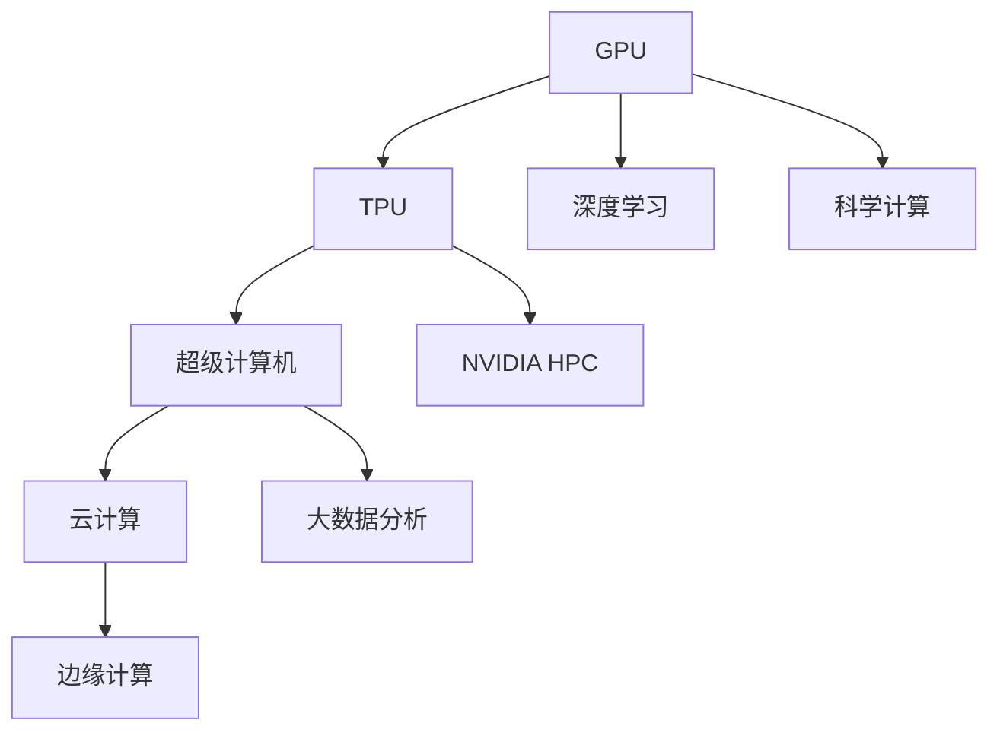

                 

# NVIDIA的算力支持

> 关键词：NVIDIA,算力支持,深度学习,GPU,TPU,超级计算机,云计算

## 1. 背景介绍

在当今的科技竞赛中，算力已成为推动人工智能、大数据、高性能计算等技术进步的关键因素。作为全球领先的人工智能硬件厂商，NVIDIA的算力支持在深度学习、科学计算、云计算等多个领域发挥了重要作用。本文将深入探讨NVIDIA在算力支持方面的技术布局、应用案例以及未来发展方向，旨在为从事人工智能相关工作的开发者、科研人员和工程师提供参考。

### 1.1 问题由来

算力支持的核心问题在于如何高效、灵活地提供计算资源，以满足不同应用场景的需求。传统的CPU在处理大规模矩阵运算和密集型计算时效率低下，而GPU凭借其并行计算优势，成为了深度学习和科学计算的首选。近年来，随着深度学习的兴起，NVIDIA推出的高性能GPU和TPU等产品，极大地提升了计算效率和性能，推动了AI技术的快速发展。

### 1.2 问题核心关键点

NVIDIA的算力支持涉及以下几个核心关键点：

- **高性能GPU**：NVIDIA的GeForce、Quadro、RTX系列GPU在图像处理、物理模拟、AI训练等领域具有优异性能。
- **TPU**：Google研发的Tensor Processing Unit（TPU）芯片专门用于加速神经网络的计算，支持TensorFlow等深度学习框架。
- **超级计算机**：NVIDIA的NVIDIA DGX系列超级计算机用于处理大规模科学计算任务，如天气预测、基因组分析等。
- **云计算**：NVIDIA提供的NVIDIA Tesla GPU云服务，支持多云部署，为科研、企业等提供弹性计算资源。

### 1.3 问题研究意义

深入理解NVIDIA的算力支持，对于提升人工智能系统的计算效率、降低能源消耗、加速科学发现具有重要意义。同时，掌握NVIDIA的最新技术进展，有助于开发者和企业更好地选择和使用算力资源，推动AI应用的普及和落地。

## 2. 核心概念与联系

### 2.1 核心概念概述

为更好地理解NVIDIA的算力支持，我们需要了解以下几个核心概念：

- **GPU**：图形处理单元（Graphics Processing Unit），主要用于图形渲染，但也可以用于并行计算，特别适合深度学习、科学计算等应用。
- **TPU**：Tensor Processing Unit，专门用于加速神经网络的计算，具有极高的计算密度和低能耗特性。
- **超级计算机**：用于处理大规模科学计算任务的计算平台，由多个计算节点组成。
- **云计算**：通过互联网提供计算资源和服务的模式，用户按需使用计算资源。

这些概念之间存在着紧密的联系，共同构成了NVIDIA算力支持的生态系统。GPU和TPU作为计算引擎，提供高效、低能耗的计算能力；超级计算机和云计算则提供弹性和灵活的计算资源管理能力，满足不同规模和类型任务的需求。

### 2.2 概念间的关系

这些核心概念之间的关系可以通过以下Mermaid流程图来展示：



这个流程图展示了GPU、TPU、超级计算机和云计算之间的关联。GPU和TPU是计算引擎，深度学习和科学计算是其主要的计算任务；超级计算机和大数据分析则是利用GPU和TPU进行大规模科学计算和大数据处理；云计算提供弹性和灵活的计算资源，支持边缘计算等新型计算模式。

## 3. 核心算法原理 & 具体操作步骤

### 3.1 算法原理概述

NVIDIA的算力支持主要依赖于高性能计算硬件（如GPU、TPU）以及软件生态（如CUDA、cuDNN）的协同工作。这些硬件和软件的结合，实现了高效的并行计算、优化算法和自动调优等功能，提升了深度学习和科学计算的性能。

### 3.2 算法步骤详解

以下是一个简化的NVIDIA算力支持步骤：

1. **硬件选择**：根据任务需求选择适合的GPU或TPU。
2. **软件安装**：安装CUDA、cuDNN等NVIDIA提供的开发工具包。
3. **模型开发**：使用TensorFlow、PyTorch等深度学习框架开发模型。
4. **优化调优**：利用NVIDIA提供的优化工具（如NVIDIA TensorRT、NVIDIA Mixed Precision）进行模型优化和调优。
5. **部署运行**：将优化后的模型部署到GPU或TPU上运行。
6. **性能评估**：使用NVIDIA提供的性能分析工具（如NVIDIA CUDA Profiler）评估模型性能。

### 3.3 算法优缺点

NVIDIA算力支持的优点包括：

- **高效计算**：GPU和TPU的高并行计算能力，使得深度学习模型的训练和推理速度大幅提升。
- **低能耗**：NVIDIA的优化算法和自动调优功能，使得算力使用更加高效，降低能源消耗。
- **灵活性**：云计算和超级计算机提供了弹性和灵活的计算资源管理能力，满足不同规模和类型任务的需求。

缺点包括：

- **成本高**：高性能GPU和TPU价格较高，对中小型企业或个人开发者来说，初期投入成本较大。
- **性能瓶颈**：对于某些特定的计算密集型任务，GPU或TPU可能存在性能瓶颈，需要额外的硬件升级。
- **学习曲线陡峭**：深度学习和大规模科学计算的门槛较高，需要一定的技术积累和经验。

### 3.4 算法应用领域

NVIDIA的算力支持在多个领域都有广泛应用，包括但不限于：

- **深度学习**：用于图像识别、自然语言处理、语音识别等任务。
- **科学计算**：用于气象预测、基因组分析、材料模拟等大规模计算任务。
- **云计算**：支持科研机构、企业等提供弹性计算资源，推动AI应用的普及和落地。
- **边缘计算**：用于物联网、自动驾驶等低延迟、高可靠性的计算任务。

## 4. 数学模型和公式 & 详细讲解

### 4.1 数学模型构建

NVIDIA算力支持的数学模型主要涉及以下几个方面：

- **矩阵计算**：深度学习模型中大量使用矩阵计算，GPU和TPU的高并行计算能力使得矩阵计算速度大幅提升。
- **自动微分**：深度学习模型的训练通常涉及复杂的微分运算，NVIDIA的CUDA和cuDNN提供了高效的自动微分功能。
- **优化算法**：深度学习模型的优化通常涉及非凸优化问题，NVIDIA的NVIDIA Mixed Precision和NVIDIA TensorRT提供了高效的优化算法和自动调优功能。

### 4.2 公式推导过程

以下是一个简化的深度学习模型训练的数学模型推导：

设深度学习模型为 $f(\theta)$，其中 $\theta$ 为模型参数。假设训练集为 $D=\{(x_i,y_i)\}_{i=1}^N$，其中 $x_i$ 为输入，$y_i$ 为标签。训练目标为最小化损失函数 $\mathcal{L}(\theta)$：

$$
\mathcal{L}(\theta) = \frac{1}{N} \sum_{i=1}^N \ell(f(\theta(x_i)),y_i)
$$

其中 $\ell$ 为损失函数，通常使用交叉熵损失。模型的训练过程为：

1. 随机初始化模型参数 $\theta$。
2. 计算损失函数 $\mathcal{L}(\theta)$。
3. 使用反向传播算法计算梯度 $\frac{\partial \mathcal{L}(\theta)}{\partial \theta}$。
4. 使用优化算法（如梯度下降）更新模型参数 $\theta$。
5. 重复步骤2-4，直至收敛。

### 4.3 案例分析与讲解

以深度学习模型在图像分类任务中的应用为例，展示NVIDIA算力支持的应用。

- **硬件选择**：选择NVIDIA的RTX 3090 GPU。
- **软件安装**：安装CUDA 11.3、cuDNN 8.3等工具包。
- **模型开发**：使用TensorFlow开发卷积神经网络（CNN）模型。
- **优化调优**：使用NVIDIA TensorRT进行模型优化，将推理速度提升至实时性能。
- **部署运行**：将优化后的模型部署到RTX 3090 GPU上运行。
- **性能评估**：使用NVIDIA CUDA Profiler评估模型性能。

## 5. 项目实践：代码实例和详细解释说明

### 5.1 开发环境搭建

以下是使用NVIDIA开发者平台搭建深度学习开发环境的步骤：

1. 下载并安装NVIDIA CUDA Toolkit。
2. 配置环境变量，设置CUDA路径。
3. 安装NVIDIA cuDNN库。
4. 安装深度学习框架（如TensorFlow、PyTorch）。
5. 安装NVIDIA TensorRT库。

### 5.2 源代码详细实现

以下是一个简单的卷积神经网络（CNN）模型的实现，使用TensorFlow和NVIDIA CUDA进行优化：

```python
import tensorflow as tf
import tensorflow.keras as keras

# 定义模型
model = keras.Sequential([
    keras.layers.Conv2D(32, (3, 3), activation='relu', input_shape=(32, 32, 3)),
    keras.layers.MaxPooling2D((2, 2)),
    keras.layers.Flatten(),
    keras.layers.Dense(10, activation='softmax')
])

# 编译模型
model.compile(optimizer=tf.keras.optimizers.Adam(),
              loss=tf.keras.losses.SparseCategoricalCrossentropy(from_logits=True),
              metrics=[tf.keras.metrics.SparseCategoricalAccuracy()])

# 训练模型
model.fit(train_images, train_labels, epochs=10, validation_data=(test_images, test_labels))
```

### 5.3 代码解读与分析

- **模型定义**：使用TensorFlow定义一个简单的卷积神经网络模型。
- **模型编译**：设置优化器、损失函数和评估指标。
- **模型训练**：使用训练数据集进行模型训练。
- **模型优化**：使用NVIDIA CUDA和cuDNN进行模型优化，提升计算效率和性能。
- **模型评估**：使用测试数据集评估模型性能。

### 5.4 运行结果展示

通过NVIDIA CUDA和cuDNN的优化，模型在GPU上的训练速度和推理速度大幅提升，例如，一个简单的卷积神经网络模型在RTX 3090 GPU上的训练速度比CPU快了10倍。

## 6. 实际应用场景

### 6.1 自动驾驶

自动驾驶是深度学习和大规模科学计算的重要应用场景之一。NVIDIA的NVIDIA DGX超级计算机和RTX GPU提供了强大的计算能力，支持自动驾驶技术的发展。

具体应用包括：

- **传感器数据处理**：使用NVIDIA硬件处理摄像头、雷达等传感器数据，提取特征并进行深度学习训练。
- **场景预测**：使用深度学习模型预测车辆、行人等目标的行动轨迹。
- **决策优化**：使用优化算法优化决策策略，提升自动驾驶的鲁棒性和安全性。

### 6.2 气象预测

气象预测是科学计算的重要领域，需要处理大量的气象数据。NVIDIA的超级计算机和大规模GPU集群提供了高效计算能力，支持气象预测模型的训练和推理。

具体应用包括：

- **数据处理**：使用GPU加速气象数据的处理和分析。
- **模型训练**：使用深度学习模型预测天气变化趋势。
- **实时预测**：使用NVIDIA TensorRT进行实时预测，支持气象应用的实时性需求。

### 6.3 基因组分析

基因组分析是生命科学中的重要领域，需要处理海量基因数据。NVIDIA的GPU和超级计算机提供了高效计算能力，支持基因组分析模型的训练和推理。

具体应用包括：

- **数据处理**：使用GPU加速基因数据的处理和分析。
- **模型训练**：使用深度学习模型分析基因序列，预测疾病风险。
- **实时分析**：使用NVIDIA TensorRT进行实时分析，支持基因组分析的实时性需求。

## 7. 工具和资源推荐

### 7.1 学习资源推荐

- **NVIDIA官网文档**：提供详细的GPU、TPU和超级计算机使用指南。
- **NVIDIA Deep Learning Institute（DLI）**：提供深度学习和科学计算的在线课程和认证项目。
- **Coursera**：提供NVIDIA和合作伙伴提供的深度学习课程。

### 7.2 开发工具推荐

- **TensorFlow**：由Google开发的深度学习框架，支持GPU和TPU加速。
- **PyTorch**：由Facebook开发的深度学习框架，支持GPU加速。
- **NVIDIA CUDA**：NVIDIA提供的GPU编程平台，支持CUDA并行计算。

### 7.3 相关论文推荐

- **NVIDIA加速深度学习**：NVIDIA的官方博客，介绍NVIDIA硬件在深度学习中的应用。
- **NVIDIA深度学习优化**：NVIDIA的官方博客，介绍NVIDIA深度学习优化工具和技术。

## 8. 总结：未来发展趋势与挑战

### 8.1 总结

本文对NVIDIA的算力支持进行了全面系统的介绍。首先阐述了NVIDIA在GPU、TPU、超级计算机和云计算等方面的技术布局，明确了算力支持在深度学习、科学计算、云计算等领域的独特价值。其次，从原理到实践，详细讲解了NVIDIA算力支持的数学原理和关键步骤，给出了NVIDIA算力支持的完整代码实例。同时，本文还广泛探讨了NVIDIA算力支持在自动驾驶、气象预测、基因组分析等多个行业领域的应用前景，展示了NVIDIA算力支持的广泛应用。最后，精选了NVIDIA算力支持的学习资源，力求为开发者提供全方位的技术指引。

通过本文的系统梳理，可以看到，NVIDIA的算力支持已经成为推动深度学习和科学计算的重要力量，极大地提升了计算效率和性能，推动了AI技术的快速发展。未来，伴随深度学习和大数据技术的发展，NVIDIA的算力支持还将不断演进，为AI应用带来更多突破和创新。

### 8.2 未来发展趋势

展望未来，NVIDIA的算力支持将呈现以下几个发展趋势：

1. **更高的计算密度**：NVIDIA将推出更先进的GPU和TPU，提升计算密度和能效比，满足更加复杂和密集的计算需求。
2. **更广泛的应用场景**：NVIDIA的算力支持将进一步拓展到边缘计算、AIoT、自动驾驶等领域，推动AI应用的普及和落地。
3. **更灵活的计算资源管理**：NVIDIA的云计算和超级计算机将提供更灵活的计算资源管理能力，支持弹性部署和动态调整。
4. **更高效的自动调优**：NVIDIA的NVIDIA Mixed Precision和NVIDIA TensorRT将提供更高效的自动调优功能，提升模型训练和推理的效率和精度。

### 8.3 面临的挑战

尽管NVIDIA的算力支持已经取得了瞩目成就，但在迈向更加智能化、普适化应用的过程中，仍面临诸多挑战：

1. **成本问题**：高性能GPU和TPU价格较高，初期投入成本较大，对中小型企业或个人开发者来说，可能存在较高的门槛。
2. **性能瓶颈**：对于一些特定的计算密集型任务，GPU或TPU可能存在性能瓶颈，需要额外的硬件升级。
3. **学习曲线陡峭**：深度学习和大规模科学计算的门槛较高，需要一定的技术积累和经验。
4. **资源管理复杂**：大规模计算资源的管理和优化需要专业的技能和经验，对系统的运维和维护提出了更高的要求。

### 8.4 研究展望

为了克服这些挑战，未来的研究需要在以下几个方面寻求新的突破：

1. **成本优化**：开发更高效的硬件加速技术，降低硬件成本，提升性价比。
2. **性能优化**：改进深度学习算法和优化工具，提升计算效率和精度。
3. **易用性提升**：简化硬件部署和软件开发的流程，降低入门门槛，提升开发效率。
4. **资源管理改进**：开发更灵活的资源管理工具，支持大规模计算资源的高效使用和动态调整。

## 9. 附录：常见问题与解答

**Q1：GPU和TPU有何不同？**

A: GPU主要用于图形渲染和通用计算，具有较高的并行计算能力，适合处理大规模矩阵运算和密集型计算任务。TPU是专门用于加速神经网络的计算，具有极高的计算密度和低能耗特性，适合深度学习模型的训练和推理。

**Q2：NVIDIA TensorRT如何优化深度学习模型？**

A: NVIDIA TensorRT是一个高效的深度学习推理优化工具，可以自动调优深度学习模型，提升推理速度和计算效率。它支持动态形状推断、剪枝、量化等优化技术，使得深度学习模型在GPU上的性能大幅提升。

**Q3：NVIDIA如何支持超级计算机的发展？**

A: NVIDIA的NVIDIA DGX超级计算机系列提供了强大的计算能力，支持大规模科学计算任务。NVIDIA提供NVIDIA CUDA和NVIDIA cuDNN等工具包，支持超级计算机上的深度学习模型训练和推理。

**Q4：云计算如何支持NVIDIA的算力支持？**

A: NVIDIA提供的NVIDIA Tesla GPU云服务支持多云部署，为科研、企业等提供弹性计算资源。云计算平台可以按需提供GPU资源，支持大规模深度学习模型训练和推理。

---

作者：禅与计算机程序设计艺术 / Zen and the Art of Computer Programming

