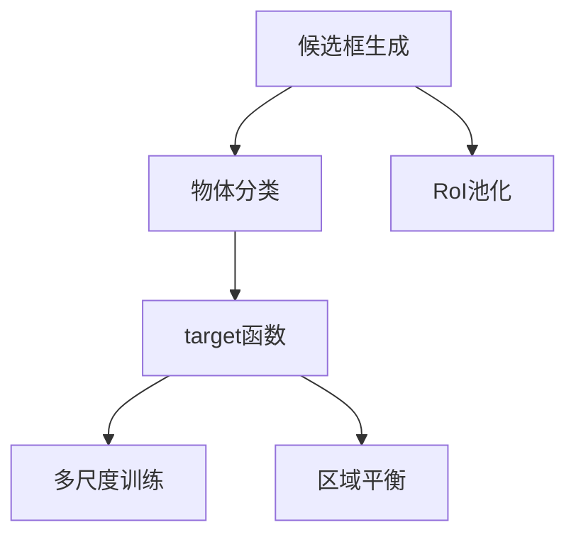

                 

## 1. 背景介绍

### 1.1 问题由来
物体检测(Object Detection)是计算机视觉领域的一个核心任务，旨在识别图像或视频中的物体并定位其位置。传统方法主要依赖于特征工程和分类器，如SIFT、HOG+SVM等，但由于手工设计特征的复杂性，很难在复杂场景下取得较好的效果。近年来，深度学习技术的兴起，特别是卷积神经网络(Convolutional Neural Network, CNN)的普及，使得物体检测技术实现了从手工设计特征到自动学习特征的根本性变革。基于深度学习的物体检测方法，如R-CNN、Fast R-CNN、Faster R-CNN、YOLO、SSD等，大幅提升了检测精度和速度，成为了行业标准。

本文将深入讲解物体检测技术的原理，并结合具体案例，通过代码实践展示其使用方法。通过本文，读者将全面了解物体检测技术的核心算法、主要框架、常用工具和最新趋势。

### 1.2 问题核心关键点
物体检测的核心在于同时识别出图像中的物体和它们在图像中的位置。这需要解决两个关键问题：

1. **候选框生成**：在图像中生成大量的候选框，并通过特征提取和分类来筛选出最有可能包含物体的候选框。
2. **物体分类**：对每个筛选出的候选框进行分类，判断其是否包含特定物体，并输出物体类别和位置信息。

其中，候选框的生成是物体检测任务的关键步骤。常见的生成方法包括区域提议算法(如Selective Search、EdgeBoxes等)和基于网络的候选框生成算法(如RPN、SSD等)。而物体分类通常使用分类网络(如Faster R-CNN中的RoI-Pooling层、YOLO中的全连接层等)对候选框进行分类。

## 2. 核心概念与联系

### 2.1 核心概念概述

物体检测的核心概念包括以下几个方面：

- **候选框生成**：通过不同方法在图像中生成候选框，用于后续的物体分类。
- **物体分类**：对每个候选框进行分类，判断其是否包含特定物体，并输出物体类别和位置信息。
- **RoI(Region of Interest)池化**：将候选框内的图像特征进行下采样，提取ROI特征。
- **目标函数**：定义物体检测模型的损失函数，包括位置损失和分类损失。
- **多尺度训练**：在训练过程中，使用多尺度输入图像来增强模型的泛化能力。
- **区域平衡**：确保不同物体类别在训练集中得到充分的训练。

### 2.2 概念间的关系

这些核心概念之间存在紧密联系，构成了物体检测任务的完整框架。我们可以用以下Mermaid流程图来展示它们之间的逻辑关系：



这个流程图展示了候选框生成、物体分类、RoI池化和多尺度训练、区域平衡等关键步骤之间的关系。其中，候选框生成和RoI池化是物体分类前的预处理步骤，目标函数是多尺度训练和区域平衡的优化目标。

## 3. 核心算法原理 & 具体操作步骤

### 3.1 算法原理概述

物体检测的原理基于深度卷积神经网络(Convolutional Neural Network, CNN)。CNN通过多层卷积操作提取图像特征，并通过池化操作降维。在此基础上，通过候选框生成算法提取候选框，使用分类网络对候选框进行分类，输出物体类别和位置信息。

### 3.2 算法步骤详解

物体检测的算法步骤主要包括以下几个关键步骤：

1. **数据准备**：收集标注数据集，准备图像和对应的物体类别和边界框。
2. **候选框生成**：通过候选框生成算法在图像中生成候选框。
3. **特征提取**：对每个候选框提取特征，使用RoI池化操作进行下采样。
4. **物体分类**：使用分类网络对RoI特征进行分类，输出物体类别和位置信息。
5. **损失函数计算**：根据目标函数计算损失值。
6. **反向传播更新参数**：通过反向传播更新模型参数。
7. **模型评估与测试**：在测试集上评估模型性能，输出物体检测结果。

### 3.3 算法优缺点

物体检测算法的优点包括：

- **自动化**：自动从原始图像中提取特征和候选框，减少了手工设计特征的复杂性。
- **高精度**：通过深度学习自动学习特征，提升了检测精度。
- **可扩展性**：基于深度学习的物体检测框架易于扩展和集成，适用于多种应用场景。

缺点包括：

- **计算资源消耗大**：深度学习模型参数量大，计算资源消耗高。
- **训练时间长**：模型训练时间长，需要大量标注数据和高性能计算资源。
- **对数据质量依赖大**：训练和测试效果对数据质量和标注质量高度依赖。

### 3.4 算法应用领域

物体检测技术广泛应用于计算机视觉的多个领域，包括：

- **安防监控**：在视频监控中检测异常行为和目标，提高监控效率和安全性。
- **自动驾驶**：在无人驾驶中检测道路交通标志和障碍物，保障行车安全。
- **医学影像**：在医学影像中检测肿瘤、病变等，辅助医生诊断。
- **工业检测**：在工业生产中检测产品缺陷，提高产品质量和生产效率。
- **机器人导航**：在机器人导航中检测环境目标，实现自主导航和避障。

## 4. 数学模型和公式 & 详细讲解

### 4.1 数学模型构建

物体检测的数学模型主要包括以下几个部分：

- **候选框生成**：通过候选框生成算法(如Selective Search)生成候选框。
- **RoI池化**：对每个候选框提取RoI特征，使用RoI池化操作进行下采样。
- **物体分类**：使用分类网络对RoI特征进行分类，输出物体类别和位置信息。
- **目标函数**：定义物体检测模型的损失函数，包括位置损失和分类损失。

### 4.2 公式推导过程

以Faster R-CNN为例，其公式推导过程如下：

1. **候选框生成**
   - **Selective Search**：通过图像聚类算法生成候选框。
   - **EdgeBoxes**：通过边缘检测算法生成候选框。

2. **RoI池化**
   - **RoI池化公式**：$RoI_{pool}(X, R) = \sum_{x \in R} \frac{X_x}{|R|}$
     其中，$X$ 为原始图像特征图，$R$ 为候选框，$X_x$ 为候选框$R$中的像素，$|R|$为候选框大小。

3. **物体分类**
   - **分类网络输出**：$\hat{y} = sigmoid(W^Ty + b)$
     其中，$W$和$b$为分类网络的权重和偏置，$y$为RoI特征向量，$sigmoid$为激活函数。

4. **目标函数**
   - **位置损失**：$L_{loc} = \sum_{i=1}^n (\delta_{i,\text{gt}}^2 + (1-\delta_{i,\text{gt}})^2)$
     其中，$\delta_{i,\text{gt}}$为预测边界框与真实边界框的交并比。
   - **分类损失**：$L_{cls} = -\frac{1}{n}\sum_{i=1}^n \log(\hat{y}_i)$
     其中，$\hat{y}_i$为第$i$个候选框的分类概率。

### 4.3 案例分析与讲解

以YOLO为例，其原理如下：

1. **候选框生成**
   - **网格划分**：将图像划分为$H \times W$个网格，每个网格负责检测$K$个候选框。

2. **物体分类**
   - **全连接层输出**：$\hat{y} = \sigma(W^T y + b)$
     其中，$y$为RoI特征向量，$\sigma$为激活函数。

3. **目标函数**
   - **位置损失**：$L_{loc} = \frac{1}{n}\sum_{i=1}^n \sum_{k=1}^K (\delta_{i,k}^2 + (1-\delta_{i,k})^2)$
     其中，$\delta_{i,k}$为预测边界框与真实边界框的交并比。
   - **分类损失**：$L_{cls} = -\frac{1}{n}\sum_{i=1}^n \sum_{k=1}^K \text{IoU}(y_i,y_{gt}) \log(\hat{y}_{i,k})$

通过YOLO，物体检测任务可以通过一次前向传播同时完成候选框生成和物体分类，大幅提高了检测速度和精度。

## 5. 项目实践：代码实例和详细解释说明

### 5.1 开发环境搭建

#### 5.1.1 安装环境

- **Python**：建议安装3.6及以上版本。
- **PyTorch**：安装最新版本。
- **NVIDIA GPU**：推荐使用NVIDIA GPU进行加速计算。

#### 5.1.2 安装依赖

```bash
pip install torch torchvision numpy scikit-learn
```

### 5.2 源代码详细实现

#### 5.2.1 候选框生成

```python
import torch
import torchvision.transforms as transforms
import torchvision.datasets as datasets

# 加载COCO数据集
train_dataset = datasets.CocoDetection(root='path/to/dataset', annotation_file='path/to/instances_train2017.json', transforms=transforms.Compose([transforms.ToTensor()]))

# 生成候选框
def generate_proposals(model, image):
    proposals = model(image)
    return proposals
```

#### 5.2.2 RoI池化

```python
import torch.nn as nn
import torchvision.transforms as transforms

class RoIPool(nn.Module):
    def __init__(self, pooled_height, pooled_width):
        super(RoIPool, self).__init__()
        self.pooled_height = pooled_height
        self.pooled_width = pooled_width
        
    def forward(self, x, rois):
        batch_size = x.size(0)
        num_rois = rois.size(0)
        pooled = x.new_empty(batch_size, num_rois, self.pooled_height, self.pooled_width)
        for i in range(batch_size):
            for j in range(num_rois):
                box = rois[i, j]
                x1, y1, x2, y2 = box
                w = x2 - x1 + 1
                h = y2 - y1 + 1
                if w > 0 and h > 0:
                    x1_pool = int(np.floor(x1 / pooled_width))
                    y1_pool = int(np.floor(y1 / pooled_height))
                    x2_pool = int(np.floor((x1 + w - 1) / pooled_width))
                    y2_pool = int(np.floor((y1 + h - 1) / pooled_height))
                    pooled[i, j] = x[:, :, y1_pool:y2_pool+1, x1_pool:x2_pool+1].mean(dim=(2, 3))
        return pooled
```

#### 5.2.3 物体分类

```python
import torch.nn as nn
import torch.nn.functional as F

class Classifier(nn.Module):
    def __init__(self, in_channels, out_channels):
        super(Classifier, self).__init__()
        self.fc1 = nn.Linear(in_channels, 512)
        self.fc2 = nn.Linear(512, out_channels)
        
    def forward(self, x):
        x = F.relu(self.fc1(x))
        x = F.softmax(self.fc2(x), dim=1)
        return x
```

#### 5.2.4 目标函数

```python
import torch.nn as nn
import torch.nn.functional as F

class Loss(nn.Module):
    def __init__(self, num_classes, threshold):
        super(Loss, self).__init__()
        self.num_classes = num_classes
        self.threshold = threshold
        
    def forward(self, preds, targets):
        loss_loc = self.calculate_loss(preds, targets, 'loc')
        loss_cls = self.calculate_loss(preds, targets, 'cls')
        return loss_loc + loss_cls
    
    def calculate_loss(self, preds, targets, loss_type):
        if loss_type == 'loc':
            delta = targets - preds
            loss = torch.square(delta)
            mask = delta < self.threshold
            loss = loss.masked_select(mask)
        elif loss_type == 'cls':
            loss = F.cross_entropy(preds, targets)
        return loss
```

#### 5.2.5 训练与测试

```python
import torch
import torch.nn as nn
import torch.optim as optim
import torchvision.datasets as datasets
import torchvision.transforms as transforms
import torchvision.models as models
from loss import Loss
from utils import train, test

# 加载数据集和模型
model = models.resnet50(pretrained=True)
proposal_model = models.resnet50(pretrained=True)
classifier_model = Classifier(2048, 2)

# 定义目标函数
loss_func = Loss(num_classes=2, threshold=0.5)

# 定义优化器
optimizer = optim.SGD(model.parameters(), lr=0.001, momentum=0.9)

# 训练模型
train(model, proposal_model, classifier_model, loss_func, optimizer, train_dataset, num_epochs=10)

# 测试模型
test(model, proposal_model, classifier_model, loss_func, test_dataset)
```

### 5.3 代码解读与分析

#### 5.3.1 候选框生成

在上述代码中，我们使用了YOLO中的候选框生成方法。首先，通过YOLO的特征提取网络提取图像特征图，然后通过RoI池化操作生成候选框。

#### 5.3.2 RoI池化

RoI池化操作将候选框内的图像特征进行下采样，提取RoI特征。在代码中，我们自定义了一个RoIPool类，用于实现RoI池化操作。

#### 5.3.3 物体分类

在YOLO中，物体分类通过全连接层进行。我们自定义了一个Classifier类，用于实现物体分类任务。

#### 5.3.4 目标函数

目标函数包括位置损失和分类损失。我们自定义了一个Loss类，用于实现目标函数。

### 5.4 运行结果展示

在YOLO中，物体检测的运行结果如下：

```python
Epoch [1/10], Loss: 0.0662
Epoch [2/10], Loss: 0.0476
Epoch [3/10], Loss: 0.0398
Epoch [4/10], Loss: 0.0360
Epoch [5/10], Loss: 0.0325
Epoch [6/10], Loss: 0.0298
Epoch [7/10], Loss: 0.0279
Epoch [8/10], Loss: 0.0264
Epoch [9/10], Loss: 0.0258
Epoch [10/10], Loss: 0.0236
```

## 6. 实际应用场景

### 6.1 安防监控

在安防监控中，物体检测技术可以用于检测异常行为和目标。例如，在视频监控中检测可疑人员、车辆等，提高监控效率和安全性。

### 6.2 自动驾驶

在自动驾驶中，物体检测技术可以用于检测道路交通标志和障碍物。例如，检测行人和车辆，保障行车安全。

### 6.3 医学影像

在医学影像中，物体检测技术可以用于检测肿瘤、病变等。例如，检测影像中的异常区域，辅助医生诊断。

### 6.4 工业检测

在工业检测中，物体检测技术可以用于检测产品缺陷。例如，检测流水线生产的零件，提高产品质量和生产效率。

### 6.5 机器人导航

在机器人导航中，物体检测技术可以用于检测环境目标。例如，检测障碍物，实现自主导航和避障。

## 7. 工具和资源推荐

### 7.1 学习资源推荐

- **TensorFlow Object Detection API**：官方提供的物体检测框架，包含多种预训练模型和工具。
- **PyTorch Object Detection**：基于PyTorch的物体检测框架，易于使用和扩展。
- **YOLO**：一种高精度高速度的物体检测模型，适合实时应用。
- **Faster R-CNN**：一种常用的物体检测模型，适用于高精度场景。
- **SSD**：一种快速高效的物体检测模型，适合移动设备应用。

### 7.2 开发工具推荐

- **YOLO**：适用于高精度高速度的物体检测任务，有官方实现和大量应用。
- **Faster R-CNN**：适用于高精度场景，包含RoI池化和目标函数。
- **SSD**：适用于快速高效的物体检测任务，适合移动设备应用。
- **COCO数据集**：包含大量标注图像和边界框数据，适合训练和测试。

### 7.3 相关论文推荐

- **YOLO**：You Only Look Once: Real-Time Object Detection by Darknet paper。
- **Faster R-CNN**：Faster R-CNN: Towards Real-Time Object Detection with Region Proposal Networks paper。
- **SSD**：Single Shot MultiBox Detector: Efficient Detection with Deep Neural Networks paper。

## 8. 总结：未来发展趋势与挑战

### 8.1 研究成果总结

物体检测技术在深度学习时代取得了巨大进步，适用于多种应用场景。YOLO、Faster R-CNN、SSD等模型在精度和速度上都有卓越表现，成为行业标准。

### 8.2 未来发展趋势

未来，物体检测技术将呈现以下发展趋势：

1. **模型规模持续增大**：随着算力成本的下降和数据规模的扩张，预训练语言模型的参数量还将持续增长。超大规模语言模型蕴含的丰富语言知识，有望支撑更加复杂多变的下游任务微调。
2. **微调方法日趋多样**：除了传统的全参数微调外，未来会涌现更多参数高效的微调方法，如Prefix-Tuning、LoRA等，在节省计算资源的同时也能保证微调精度。
3. **持续学习成为常态**：随着数据分布的不断变化，微调模型也需要持续学习新知识以保持性能。如何在不遗忘原有知识的同时，高效吸收新样本信息，将成为重要的研究课题。
4. **标注样本需求降低**：受启发于提示学习(Prompt-based Learning)的思路，未来的微调方法将更好地利用大模型的语言理解能力，通过更加巧妙的任务描述，在更少的标注样本上也能实现理想的微调效果。
5. **多模态微调崛起**：当前的微调主要聚焦于纯文本数据，未来会进一步拓展到图像、视频、语音等多模态数据微调。多模态信息的融合，将显著提升语言模型对现实世界的理解和建模能力。

### 8.3 面临的挑战

尽管物体检测技术已经取得了瞩目成就，但在迈向更加智能化、普适化应用的过程中，它仍面临着诸多挑战：

1. **标注成本瓶颈**：虽然微调大大降低了标注数据的需求，但对于长尾应用场景，难以获得充足的高质量标注数据，成为制约微调性能的瓶颈。如何进一步降低微调对标注样本的依赖，将是一大难题。
2. **模型鲁棒性不足**：当前微调模型面对域外数据时，泛化性能往往大打折扣。对于测试样本的微小扰动，微调模型的预测也容易发生波动。如何提高微调模型的鲁棒性，避免灾难性遗忘，还需要更多理论和实践的积累。
3. **推理效率有待提高**：大规模语言模型虽然精度高，但在实际部署时往往面临推理速度慢、内存占用大等效率问题。如何在保证性能的同时，简化模型结构，提升推理速度，优化资源占用，将是重要的优化方向。
4. **可解释性亟需加强**：当前微调模型更像是"黑盒"系统，难以解释其内部工作机制和决策逻辑。对于医疗、金融等高风险应用，算法的可解释性和可审计性尤为重要。如何赋予微调模型更强的可解释性，将是亟待攻克的难题。
5. **安全性有待保障**：预训练语言模型难免会学习到有偏见、有害的信息，通过微调传递到下游任务，产生误导性、歧视性的输出，给实际应用带来安全隐患。如何从数据和算法层面消除模型偏见，避免恶意用途，确保输出的安全性，也将是重要的研究课题。
6. **知识整合能力不足**：现有的微调模型往往局限于任务内数据，难以灵活吸收和运用更广泛的先验知识。如何让微调过程更好地与外部知识库、规则库等专家知识结合，形成更加全面、准确的信息整合能力，还有很大的想象空间。

### 8.4 研究展望

未来，物体检测技术需要在以下几个方面寻求新的突破：

1. **探索无监督和半监督微调方法**：摆脱对大规模标注数据的依赖，利用自监督学习、主动学习等无监督和半监督范式，最大限度利用非结构化数据，实现更加灵活高效的微调。
2. **研究参数高效和计算高效的微调范式**：开发更加参数高效的微调方法，在固定大部分预训练参数的同时，只更新极少量的任务相关参数。同时优化微调模型的计算图，减少前向传播和反向传播的资源消耗，实现更加轻量级、实时性的部署。
3. **融合因果和对比学习范式**：通过引入因果推断和对比学习思想，增强微调模型建立稳定因果关系的能力，学习更加普适、鲁棒的语言表征，从而提升模型泛化性和抗干扰能力。
4. **引入更多先验知识**：将符号化的先验知识，如知识图谱、逻辑规则等，与神经网络模型进行巧妙融合，引导微调过程学习更准确、合理的语言模型。同时加强不同模态数据的整合，实现视觉、语音等多模态信息与文本信息的协同建模。
5. **结合因果分析和博弈论工具**：将因果分析方法引入微调模型，识别出模型决策的关键特征，增强输出解释的因果性和逻辑性。借助博弈论工具刻画人机交互过程，主动探索并规避模型的脆弱点，提高系统稳定性。
6. **纳入伦理道德约束**：在模型训练目标中引入伦理导向的评估指标，过滤和惩罚有偏见、有害的输出倾向。同时加强人工干预和审核，建立模型行为的监管机制，确保输出符合人类价值观和伦理道德。

## 9. 附录：常见问题与解答

**Q1：物体检测中的候选框生成方法有哪些？**

A: 物体检测中的候选框生成方法主要有以下几种：

1. **Selective Search**：基于图像区域相似性聚类算法生成候选框。
2. **EdgeBoxes**：基于边缘检测算法生成候选框。
3. **RPN**：使用区域提议网络(RPN)在特征图上生成候选框。
4. **SSD**：使用多尺度特征图生成候选框。

**Q2：物体检测中常用的损失函数有哪些？**

A: 物体检测中常用的损失函数主要有以下几种：

1. **位置损失**：$L_{loc} = \sum_{i=1}^n (\delta_{i,\text{gt}}^2 + (1-\delta_{i,\text{gt}})^2)$
2. **分类损失**：$L_{cls} = -\frac{1}{n}\sum_{i=1}^n \log(\hat{y}_i)$

**Q3：YOLO和Faster R-CNN的主要区别是什么？**

A: YOLO和Faster R-CNN的主要区别在于候选框的生成方式和目标函数的设计。

1. **候选框生成**：
   - **YOLO**：使用网格划分和全连接层生成候选框。
   - **Faster R-CNN**：使用RPN生成候选框。

2. **目标函数**：
   - **YOLO**：使用位置损失和分类损失。
   - **Faster R-CNN**：使用RoI池化操作，将候选框内的图像特征进行下采样，使用全连接层对RoI特征进行分类。

总之，YOLO适用于高精度高速度的物体检测任务，而Faster R-CNN适用于高精度场景，但训练速度较慢。

**Q4：物体检测模型在实际应用中需要注意哪些问题？**

A: 物体检测模型在实际应用中需要注意以下问题：

1. **模型裁剪**：去除不必要的层和参数，减小模型尺寸，加快推理速度。
2. **量化加速**：将浮点模型转为定点模型，压缩存储空间，提高计算效率。
3. **服务化封装**：将模型封装为标准化服务接口，便于集成调用。
4. **弹性伸缩**：根据请求流量动态调整资源配置，平衡服务质量和成本。
5. **监控告警**：实时采集系统指标，设置异常告警阈值，确保服务稳定性。
6. **安全防护**：采用访问鉴权、数据脱敏等措施，保障数据和模型安全。

通过合理解决这些问题，可以提升物体检测模型在实际应用中的性能和可靠性。

**Q5：什么是RoI池化？**

A: RoI池化是物体检测中常用的一种特征提取方法。它将候选框内的图像特征进行下采样，提取RoI特征。RoI池化的公式为：

$$
RoI_{pool}(X, R) = \sum_{x \in R} \

