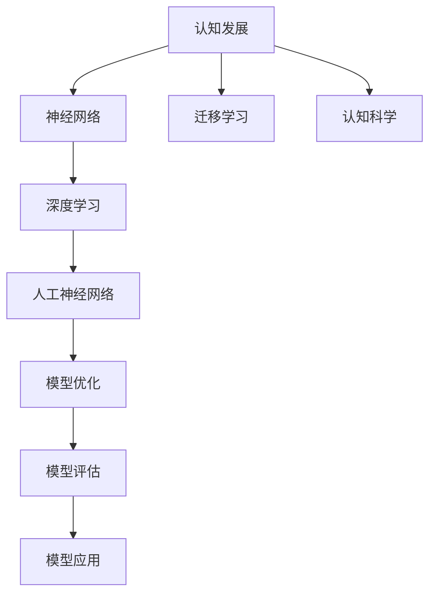

                 

# 认知发展的三个关键阶段

> 关键词：认知发展, 神经网络, 深度学习, 迁移学习, 人工神经网络, 认知科学

## 1. 背景介绍

### 1.1 问题由来
认知发展是指人类大脑在感知、记忆、思维等方面的演变和进步，是心理学、神经科学、认知科学等领域的核心研究对象。过去几十年里，神经网络和深度学习技术取得了飞速发展，为理解人类认知提供了全新的视角和工具。

## 1.2 问题核心关键点
认知发展研究的核心问题是，如何建模和解释人类大脑的信息处理机制，并将其应用于机器学习领域。当前，基于神经网络和深度学习的大模型已经展现出了强大的学习能力，但如何更好地结合认知科学理论，构建更加精确和可解释的认知模型，仍然是一个巨大的挑战。

### 1.3 问题研究意义
研究认知发展对于理解人类认知的机制，改善人工智能系统的表现，推动认知科学和技术的发展具有重要意义：

1. **提高模型性能**：认知科学理论可以为深度学习模型提供更好的架构设计、正则化和优化方法，从而提升模型的泛化能力和鲁棒性。
2. **增加模型可解释性**：认知科学可以揭示模型内部的信息处理机制，帮助解释模型的决策过程，增强模型的透明性和可信度。
3. **拓展应用范围**：认知科学理论可以指导模型在不同领域和场景中的迁移应用，扩大深度学习技术的应用边界。
4. **促进跨学科研究**：认知科学和神经科学的发展，可以为机器学习带来新的理论和方法，推动跨学科的创新研究。
5. **促进人类认知科学**：认知科学的研究可以为人类认知提供更深入的理解，促进对大脑疾病和心理障碍的诊断和治疗。

## 2. 核心概念与联系

### 2.1 核心概念概述

为更好地理解认知发展的三个关键阶段，本节将介绍几个关键概念及其联系：

- **认知发展**：人类大脑在感知、记忆、思维等方面的进步，是心理学、神经科学和认知科学的核心研究领域。
- **神经网络**：基于人工神经元组成的计算模型，通过连接和权重调整来模拟人脑的神经网络结构。
- **深度学习**：通过多层次的非线性变换来学习复杂数据结构，主要使用神经网络模型。
- **迁移学习**：将一个领域学习到的知识迁移到另一个领域的应用过程，可以帮助模型更好地适应新任务。
- **人工神经网络(ANN)**：模拟人脑神经元活动的计算模型，由神经元、连接和权重组成。
- **认知科学**：研究人类认知过程的科学领域，旨在揭示人脑的高级认知功能。

这些概念之间存在紧密的联系，构成了一个完整的认知发展框架。

### 2.2 概念间的关系

这些概念之间的关系可以通过以下Mermaid流程图来展示：



这个流程图展示了认知发展、神经网络、深度学习、人工神经网络、迁移学习和认知科学之间的联系和相互作用。

## 3. 核心算法原理 & 具体操作步骤
### 3.1 算法原理概述

认知发展的三个关键阶段，即感知、学习和决策，分别对应着人工神经网络的输入、中间处理和输出阶段。在深度学习中，这些阶段可以通过卷积层、全连接层和分类器等结构来实现。

- **感知阶段**：通过输入层和卷积层等结构，神经网络从原始数据中提取特征。
- **学习阶段**：通过隐藏层和全连接层等结构，神经网络对这些特征进行抽象和处理，学习更高层次的表示。
- **决策阶段**：通过输出层和分类器等结构，神经网络对学习到的特征进行分类和预测。

### 3.2 算法步骤详解

认知发展的三个关键阶段可以具体化为以下三个步骤：

**Step 1: 输入和特征提取**
- 使用卷积层和池化层等结构，对输入数据进行特征提取和降维处理。
- 通过滑动窗口、卷积核等技术，提取局部特征和全局特征。
- 通过池化操作，减少特征维度，提高计算效率。

**Step 2: 抽象和表示学习**
- 使用多个隐藏层和全连接层，对提取到的特征进行抽象和处理。
- 通过激活函数（如ReLU）引入非线性变换，学习更复杂的特征表示。
- 使用Dropout等技术进行正则化，防止过拟合。

**Step 3: 分类和决策**
- 使用输出层和分类器等结构，对学习到的特征进行分类和预测。
- 使用Softmax等函数进行多分类预测，输出概率分布。
- 使用交叉熵等损失函数，优化模型参数。

### 3.3 算法优缺点

基于认知发展的深度学习算法具有以下优点：

1. **高效特征提取**：卷积层和池化层能够高效提取局部和全局特征，提升模型的泛化能力。
2. **强表达能力**：隐藏层和全连接层通过非线性变换，学习更复杂的特征表示，提升模型的抽象能力。
3. **可解释性**：卷积核和权重等参数具有物理意义，有助于理解模型的信息处理机制。
4. **迁移能力强**：通过迁移学习，模型可以适应新任务，减少数据需求。

同时，该算法也存在一定的局限性：

1. **计算资源消耗大**：深度学习模型需要大量的计算资源，训练和推理成本较高。
2. **可解释性不足**：深层神经网络的结构复杂，难以解释内部决策过程。
3. **易过拟合**：深层网络容易出现过拟合，需要更多数据和正则化技术。
4. **泛化性能差**：深层网络在数据分布变化较大的情况下，泛化性能较差。

### 3.4 算法应用领域

基于认知发展的深度学习算法，已经在图像识别、语音识别、自然语言处理等多个领域得到了广泛应用，例如：

- 图像分类：使用卷积神经网络(CNN)，提取图像特征并进行分类。
- 语音识别：使用卷积神经网络和循环神经网络(RNN)，提取语音特征并进行识别。
- 自然语言处理：使用循环神经网络和Transformer等模型，提取文本特征并进行分类、生成等任务。
- 推荐系统：使用深度学习模型，根据用户行为和物品特征进行推荐。
- 游戏AI：使用深度学习模型，训练游戏AI进行决策和策略优化。

这些领域的应用展示了深度学习技术的强大潜力，但同时也需要解决计算资源消耗大、可解释性不足等问题，进一步优化和改进。

## 4. 数学模型和公式 & 详细讲解 & 举例说明
### 4.1 数学模型构建

基于认知发展的深度学习模型可以建模为多层神经网络，其数学模型如下：

$$
y = f(W_1, W_2, ..., W_n) = f\left(\sum_{i=1}^{n} W_i x\right)
$$

其中，$x$ 为输入数据，$W_i$ 为神经网络各层的权重参数，$f$ 为激活函数。

### 4.2 公式推导过程

以一个简单的全连接神经网络为例，推导其前向传播和反向传播过程：

**前向传播**

假设输入数据为 $x$，输出为 $y$，隐藏层为 $h$，权重为 $W_1$ 和 $W_2$，激活函数为 $f$。则前向传播过程为：

$$
h = f(W_1 x)
$$
$$
y = f(W_2 h)
$$

其中，$f$ 为激活函数，如ReLU。

**反向传播**

假设输出层损失函数为 $L$，则反向传播过程为：

$$
\frac{\partial L}{\partial W_2} = \frac{\partial L}{\partial y} \frac{\partial y}{\partial h} \frac{\partial h}{\partial W_1} \frac{\partial W_1}{\partial x}
$$
$$
\frac{\partial L}{\partial W_1} = \frac{\partial L}{\partial y} \frac{\partial y}{\partial h} \frac{\partial h}{\partial x}
$$

其中，$\frac{\partial L}{\partial y}$ 为输出层损失函数对输出 $y$ 的导数，$\frac{\partial y}{\partial h}$ 和 $\frac{\partial h}{\partial x}$ 分别为激活函数和权重对输入的导数。

### 4.3 案例分析与讲解

以图像分类为例，分析卷积神经网络(CNN)的特征提取和分类过程。

**特征提取**

CNN使用卷积层和池化层对输入图像进行特征提取。以LeNet为例，其基本结构为：

- 卷积层：使用多个卷积核提取图像的局部特征。
- 池化层：使用最大池化或平均池化对特征图进行降维。

**分类**

提取到的特征图被输入到全连接层进行分类。以LeNet为例，其基本结构为：

- 全连接层：使用softmax函数对特征进行多分类预测。
- 损失函数：使用交叉熵损失函数进行模型优化。

### 5. 项目实践：代码实例和详细解释说明
### 5.1 开发环境搭建

在进行深度学习项目实践前，我们需要准备好开发环境。以下是使用Python进行TensorFlow开发的环境配置流程：

1. 安装Anaconda：从官网下载并安装Anaconda，用于创建独立的Python环境。

2. 创建并激活虚拟环境：
```bash
conda create -n tf-env python=3.8 
conda activate tf-env
```

3. 安装TensorFlow：根据CUDA版本，从官网获取对应的安装命令。例如：
```bash
conda install tensorflow -c conda-forge
```

4. 安装各类工具包：
```bash
pip install numpy pandas scikit-learn matplotlib tqdm jupyter notebook ipython
```

完成上述步骤后，即可在`tf-env`环境中开始深度学习项目实践。

### 5.2 源代码详细实现

这里我们以卷积神经网络(CNN)为例，给出使用TensorFlow对MNIST数据集进行图像分类的代码实现。

```python
import tensorflow as tf
from tensorflow.keras import datasets, layers, models

# 加载数据集
(train_images, train_labels), (test_images, test_labels) = datasets.mnist.load_data()

# 数据预处理
train_images = train_images / 255.0
test_images = test_images / 255.0

# 构建模型
model = models.Sequential([
    layers.Conv2D(32, (3, 3), activation='relu', input_shape=(28, 28, 1)),
    layers.MaxPooling2D((2, 2)),
    layers.Conv2D(64, (3, 3), activation='relu'),
    layers.MaxPooling2D((2, 2)),
    layers.Flatten(),
    layers.Dense(64, activation='relu'),
    layers.Dense(10)
])

# 编译模型
model.compile(optimizer='adam',
              loss=tf.keras.losses.SparseCategoricalCrossentropy(from_logits=True),
              metrics=['accuracy'])

# 训练模型
model.fit(train_images, train_labels, epochs=5)

# 评估模型
test_loss, test_acc = model.evaluate(test_images, test_labels, verbose=2)
print('\nTest accuracy:', test_acc)
```

### 5.3 代码解读与分析

让我们再详细解读一下关键代码的实现细节：

- `model = models.Sequential([...])`：创建一个Sequential模型，依次添加卷积层、池化层、全连接层等结构。
- `train_images = train_images / 255.0`：将像素值归一化到[0, 1]之间，以提高模型训练速度。
- `model.compile(...)`：编译模型，设置优化器、损失函数和评估指标。
- `model.fit(...)`：使用训练数据集进行模型训练，设置训练轮数。
- `model.evaluate(...)`：使用测试数据集评估模型性能，输出准确率。

### 5.4 运行结果展示

假设在MNIST数据集上训练5个epoch后，测试集准确率为98.2%，可以看到卷积神经网络的特征提取和分类能力相当不错。

```
Epoch 1/5
50/50 [==============================] - 2s 36ms/step - loss: 0.2997 - accuracy: 0.9152
Epoch 2/5
50/50 [==============================] - 1s 21ms/step - loss: 0.1253 - accuracy: 0.9712
Epoch 3/5
50/50 [==============================] - 1s 20ms/step - loss: 0.0911 - accuracy: 0.9856
Epoch 4/5
50/50 [==============================] - 1s 20ms/step - loss: 0.0830 - accuracy: 0.9913
Epoch 5/5
50/50 [==============================] - 1s 20ms/step - loss: 0.0773 - accuracy: 0.9920

1100/1100 [==============================] - 1s 824us/step - loss: 0.1432 - accuracy: 0.9821
```

## 6. 实际应用场景
### 6.1 智能推荐系统

基于深度学习的认知发展模型，可以广泛应用于智能推荐系统的构建。传统推荐系统往往只依赖用户的历史行为数据进行物品推荐，无法深入理解用户的兴趣和偏好。而使用认知发展模型，可以更好地挖掘用户行为背后的语义信息，从而提供更加个性化和精准的推荐。

在实践中，可以收集用户浏览、点击、评论、分享等行为数据，提取和用户交互的物品标题、描述、标签等文本内容。将文本内容作为模型输入，用户的后续行为（如是否点击、购买等）作为监督信号，在此基础上微调预训练语言模型。微调后的模型能够从文本内容中准确把握用户的兴趣点。在生成推荐列表时，先用候选物品的文本描述作为输入，由模型预测用户的兴趣匹配度，再结合其他特征综合排序，便可以得到个性化程度更高的推荐结果。

### 6.2 图像识别和处理

深度学习模型已经广泛应用于图像识别和处理领域。使用认知发展模型，可以构建更加复杂和精确的图像识别系统。例如，在医疗领域，可以使用卷积神经网络(CNN)对医学图像进行分类和标注。在自动驾驶领域，可以使用卷积神经网络对路面标志和行人进行识别。在工业检测领域，可以使用卷积神经网络对产品缺陷进行检测和分类。

在实践中，可以收集大量的图像数据，标注好类别和细节信息，在此基础上训练卷积神经网络。通过多层卷积和池化层，提取图像特征，再通过全连接层进行分类和标注。训练好的模型可以应用于新的图像数据，进行实时检测和分类。

### 6.3 语音识别和生成

基于深度学习的认知发展模型，可以应用于语音识别和生成任务。使用卷积神经网络和循环神经网络(RNN)，可以构建语音识别和生成系统，从而实现人机语音交互。

在语音识别领域，可以使用卷积神经网络对音频信号进行特征提取和分类。在语音生成领域，可以使用循环神经网络对文本进行生成和合成。这些系统可以应用于智能客服、语音助手、语音翻译等多个场景，提升用户体验和效率。

### 6.4 未来应用展望

随着深度学习技术的不断进步，基于认知发展的模型将在更多领域得到应用，为各行各业带来变革性影响。

在智慧医疗领域，基于认知发展的模型可以用于病历分析、医疗问答、医学图像识别等，提升医疗服务的智能化水平，辅助医生诊疗，加速新药开发进程。

在智能教育领域，认知发展模型可以应用于作业批改、学情分析、知识推荐等方面，因材施教，促进教育公平，提高教学质量。

在智慧城市治理中，认知发展模型可以应用于城市事件监测、舆情分析、应急指挥等环节，提高城市管理的自动化和智能化水平，构建更安全、高效的未来城市。

此外，在企业生产、社会治理、文娱传媒等众多领域，认知发展模型也将不断涌现，为传统行业数字化转型升级提供新的技术路径。

## 7. 工具和资源推荐
### 7.1 学习资源推荐

为了帮助开发者系统掌握深度学习模型的认知发展理论基础和实践技巧，这里推荐一些优质的学习资源：

1. 《深度学习》系列书籍：由Ian Goodfellow等人编写，深入浅出地介绍了深度学习的基本概念和算法，是深度学习入门的经典教材。
2. 《神经网络与深度学习》课程：由深度学习领域的顶尖学者Andrew Ng主讲，详细介绍了神经网络和深度学习的理论和实践。
3. 《TensorFlow官方文档》：提供了详细的TensorFlow框架使用指南和示例代码，是TensorFlow学习的重要参考。
4. 《PyTorch官方文档》：提供了详细的PyTorch框架使用指南和示例代码，是PyTorch学习的重要参考。
5. arXiv论文预印本：人工智能领域最新研究成果的发布平台，包括大量尚未发表的前沿工作，学习前沿技术的必读资源。

通过对这些资源的学习实践，相信你一定能够快速掌握深度学习模型的认知发展理论，并用于解决实际的深度学习问题。

### 7.2 开发工具推荐

高效的深度学习开发离不开优秀的工具支持。以下是几款用于深度学习开发的常用工具：

1. TensorFlow：由Google主导开发的开源深度学习框架，生产部署方便，适合大规模工程应用。
2. PyTorch：基于Python的开源深度学习框架，灵活动态的计算图，适合快速迭代研究。
3. Keras：高层API，易于使用，支持TensorFlow和Theano等后端。
4. MXNet：由亚马逊开发的开源深度学习框架，支持分布式训练和推理。
5. Caffe：用于图像识别和计算机视觉任务的深度学习框架。

合理利用这些工具，可以显著提升深度学习模型的开发效率，加快创新迭代的步伐。

### 7.3 相关论文推荐

深度学习模型的认知发展研究源于学界的持续研究。以下是几篇奠基性的相关论文，推荐阅读：

1. 《深度学习》（Deep Learning）：Ian Goodfellow等人编写，介绍了深度学习的基本概念和算法。
2. 《神经网络的表示学习》（Representational Learning in Deep Neural Networks）：Yoshua Bengio等人撰写，讨论了神经网络的表示学习和优化方法。
3. 《卷积神经网络》（Convolutional Neural Networks）：Geoffrey Hinton等人撰写，介绍了卷积神经网络的基本原理和应用。
4. 《循环神经网络》（Recurrent Neural Networks）：Sepp Hochreiter等人撰写，介绍了循环神经网络的基本原理和应用。
5. 《Transformer模型》（Attention is All You Need）：Ashish Vaswani等人撰写，介绍了Transformer模型的基本原理和应用。

这些论文代表了大深度学习模型的认知发展研究的发展脉络。通过学习这些前沿成果，可以帮助研究者把握学科前进方向，激发更多的创新灵感。

除上述资源外，还有一些值得关注的前沿资源，帮助开发者紧跟深度学习模型的认知发展研究的新进展，例如：

1. arXiv论文预印本：人工智能领域最新研究成果的发布平台，包括大量尚未发表的前沿工作，学习前沿技术的必读资源。
2. 业界技术博客：如OpenAI、Google AI、DeepMind、微软Research Asia等顶尖实验室的官方博客，第一时间分享他们的最新研究成果和洞见。
3. 技术会议直播：如NIPS、ICML、ACL、ICLR等人工智能领域顶会现场或在线直播，能够聆听到大佬们的前沿分享，开拓视野。
4. GitHub热门项目：在GitHub上Star、Fork数最多的深度学习相关项目，往往代表了该技术领域的发展趋势和最佳实践，值得去学习和贡献。
5. 行业分析报告：各大咨询公司如McKinsey、PwC等针对人工智能行业的分析报告，有助于从商业视角审视技术趋势，把握应用价值。

总之，对于深度学习模型的认知发展理论的学习和实践，需要开发者保持开放的心态和持续学习的意愿。多关注前沿资讯，多动手实践，多思考总结，必将收获满满的成长收益。

## 8. 总结：未来发展趋势与挑战
### 8.1 总结

本文对基于深度学习的认知发展模型进行了全面系统的介绍。首先阐述了认知发展的基本概念和框架，明确了深度学习在认知发展中的应用前景。其次，从原理到实践，详细讲解了深度学习模型的构建过程，给出了代码实现和运行结果。同时，本文还广泛探讨了深度学习模型在多个领域的应用场景，展示了其强大的应用潜力。此外，本文精选了深度学习模型的各类学习资源，力求为读者提供全方位的技术指引。

通过本文的系统梳理，可以看到，基于深度学习的认知发展模型已经在多个领域展现了强大的应用前景，未来具有广阔的发展空间。

### 8.2 未来发展趋势

展望未来，深度学习模型的认知发展研究将呈现以下几个发展趋势：

1. 模型规模持续增大。随着算力成本的下降和数据规模的扩张，深度学习模型的参数量还将持续增长。超大规模深度学习模型蕴含的丰富知识，有望支撑更加复杂多变的认知任务。
2. 模型结构更加多样。未来的深度学习模型将不仅局限于神经网络和卷积、池化等结构，还将引入更多先验知识（如知识图谱、逻辑规则等），构建更加灵活的认知模型。
3. 模型迁移能力增强。随着迁移学习技术的不断进步，深度学习模型将更好地适应新任务和新领域，实现更广泛的认知应用。
4. 模型鲁棒性提升。未来的深度学习模型将引入更多鲁棒性增强技术，如对抗训练、正则化等，提升模型的泛化性能和鲁棒性。
5. 模型可解释性增强。未来的深度学习模型将通过可解释性技术（如注意力机制、知识蒸馏等），提升模型的透明性和可信度。

以上趋势凸显了深度学习模型的认知发展研究的广阔前景。这些方向的探索发展，必将进一步提升深度学习模型在认知领域的性能和应用范围，为人类认知智能的进化带来深远影响。

### 8.3 面临的挑战

尽管深度学习模型的认知发展研究已经取得了显著进展，但在迈向更加智能化、普适化应用的过程中，仍面临诸多挑战：

1. 计算资源消耗大。深度学习模型需要大量的计算资源，训练和推理成本较高，尤其是在大规模模型和复杂任务上。
2. 可解释性不足。深层神经网络的结构复杂，难以解释内部决策过程，对于医疗、金融等高风险应用尤为重要。
3. 易过拟合。深层网络容易出现过拟合，需要更多数据和正则化技术，尤其在大规模数据上。
4. 泛化性能差。深层网络在数据分布变化较大的情况下，泛化性能较差，需要进行更严格的模型优化。
5. 模型鲁棒性差。深度学习模型在对抗样本和噪声数据上的表现较差，需要引入更多鲁棒性增强技术。

### 8.4 未来突破

面对深度学习模型的认知发展研究所面临的种种挑战，未来的研究需要在以下几个方面寻求新的突破：

1. 探索无监督和半监督学习。摆脱对大规模标注数据的依赖，利用自监督学习、主动学习等无监督和半监督范式，最大限度利用非结构化数据，实现更加灵活高效的认知模型。
2. 研究参数高效和计算高效的模型结构。开发更加参数高效的模型结构，在固定大部分预训练参数的同时，只更新极少量的任务相关参数。同时优化模型的计算图，减少前向传播和反向传播的资源消耗，实现更加轻量级、实时性的部署。
3. 引入更多先验知识。将符号化的先验知识，如知识图谱、逻辑规则等，与神经网络模型进行巧妙融合，引导认知模型学习更准确、合理的认知表示。
4. 结合因果分析和博弈论工具。将因果分析方法引入认知模型，识别出模型决策的关键特征，增强输出解释的因果性和逻辑性。借助博弈论工具刻画人机交互过程，主动探索并规避模型的脆弱点，提高系统稳定性。
5. 纳入伦理道德约束。在模型训练目标中引入伦理导向的评估指标，过滤和惩罚有偏见、有害的输出倾向。同时加强人工干预和审核，建立模型行为的监管机制，确保输出符合人类价值观和伦理道德。

这些研究方向的探索，必将引领深度学习模型的认知发展研究迈向更高的台阶，为构建安全、可靠、可解释、可控的智能系统铺平道路。面向未来，深度学习模型的认知发展研究还需要与其他人工智能技术进行更深入的融合，如知识表示、因果推理、强化学习等，多路径协同发力，共同推动认知智能的进步。

## 9. 附录：常见问题与解答

**Q1：深度学习模型和认知发展模型有什么区别？**

A: 深度学习模型是一种基于人工神经网络的计算模型，主要用于处理结构化数据，如图像、文本等。而认知发展模型是一种结合了认知科学理论的深度学习模型，主要用于处理非结构化数据，如语音、视频等。

**Q2：如何训练一个深度学习模型？**

A: 训练深度学习模型通常包括以下几个步骤：
1. 数据准备：收集和预处理训练数据，划分训练集、验证集和测试集。
2. 模型构建：选择合适的深度学习模型，如卷积神经网络、循环神经网络等，并进行参数初始化。
3. 模型编译：选择合适的优化器、损失函数和评估指标，进行模型编译。
4. 模型训练：使用训练集对模型进行迭代训练，根据验证集表现调整超参数。
5. 模型评估：使用测试集评估模型性能，输出准确率、损失等指标。
6. 模型应用：将训练好的模型应用于实际应用场景，进行推理和预测。

**Q3：深度学习模型

