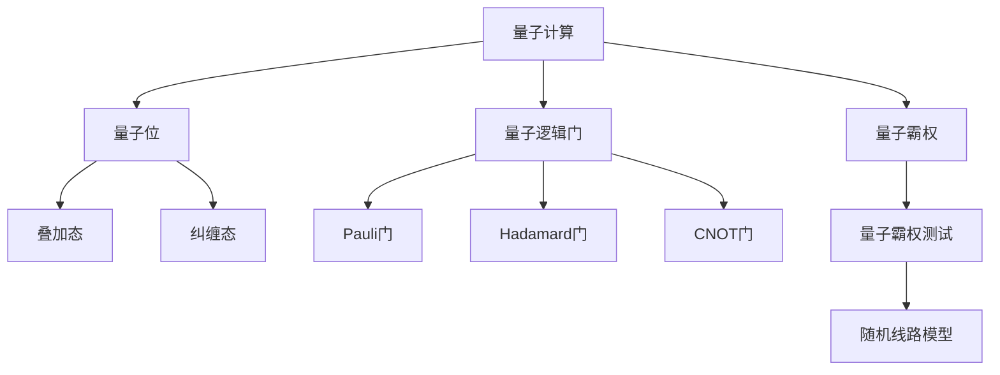
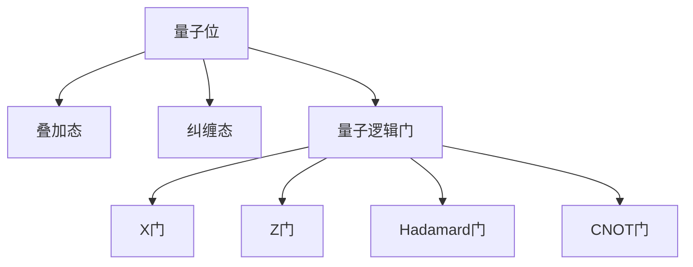
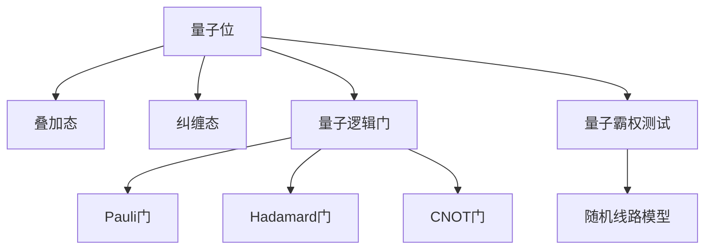

                 

# 计算：第四部分 计算的极限 第 10 章 量子计算 量子霸权

> 关键词：量子计算,量子霸权,量子位,量子算法,超导量子位,光子量子位,离子阱量子位,量子随机算法,量子霸权测试

## 1. 背景介绍

### 1.1 问题由来
量子计算（Quantum Computing）是近年来引起广泛关注的一种新型计算方式，它利用量子力学的原理来进行计算，并已在某些特定问题上展现出传统计算机无法比拟的计算速度。量子计算的最终目标是通过量子计算机解决当前计算机无法解决或难以高效解决的问题，包括大整数分解、最优化问题、数据库搜索、化学模拟等。

然而，实现量子计算并非易事，量子计算机的设计和制造面临诸多技术挑战。首先，量子计算机的物理实现需要极低的温度环境，以维持量子位的相干性；其次，量子位的状态容易受到外界干扰，导致量子退相干（Decoherence），从而破坏量子信息；最后，量子计算机需要具有容错性和可扩展性，以实现大规模的量子计算。

### 1.2 问题核心关键点
量子计算的核心在于利用量子位的量子叠加态和纠缠态，通过量子逻辑门实现复杂的计算操作。量子位（Qubit）是量子计算的基本单位，其状态可以是0和1的叠加态，即 |0⟩和|1⟩的线性组合 |ψ⟩ = a|0⟩ + b|1⟩，其中 a 和 b 是复数。

量子位通过量子逻辑门（Quantum Gate）进行运算，如 Pauli 门、Hadamard 门、CNOT 门等。其中，Pauli 门包括 X 门和 Z 门，用于对量子位进行单比特操作；Hadamard 门用于将量子位从经典态转换到量子叠加态；CNOT 门用于实现两比特之间的纠缠操作。

量子计算的优势在于其强大的并行计算能力，能够在某些特定问题上实现指数级加速。例如，Shor 算法可以在多项式时间内分解大整数，而传统计算机需要指数时间；Grover 算法可以在无序数据库搜索中实现平方根加速，而传统算法为线性时间。

## 2. 核心概念与联系

### 2.1 核心概念概述

为更好地理解量子计算的量子霸权，本节将介绍几个密切相关的核心概念：

- 量子计算（Quantum Computing）：利用量子力学的原理来进行计算的计算方式。量子计算机通过量子位和量子逻辑门进行计算，可以解决某些传统计算机难以高效解决的问题。

- 量子位（Qubit）：量子计算的基本单位，其状态可以是0和1的叠加态，即 |0⟩和|1⟩的线性组合 |ψ⟩ = a|0⟩ + b|1⟩，其中 a 和 b 是复数。

- 量子逻辑门（Quantum Gate）：用于对量子位进行计算操作的量子门，包括 Pauli 门、Hadamard 门、CNOT 门等。

- 量子霸权（Quantum Supremacy）：量子计算机在特定问题上超越传统计算机的计算能力，即量子计算机能够在多项式时间内完成传统计算机无法在多项式时间内完成的任务。

- 量子霸权测试（Quantum Supremacy Test）：通过特定量子计算任务，如随机线路模型（Random Circuit Model, RCM），验证量子计算机是否具备量子霸权的能力。

这些核心概念之间的逻辑关系可以通过以下 Mermaid 流程图来展示：



这个流程图展示了大语言模型的核心概念及其之间的关系：

1. 量子计算利用量子位和量子逻辑门进行计算。
2. 量子位具有叠加态和纠缠态的特性，使得量子计算具有并行性和超越传统计算的能力。
3. 量子逻辑门通过操作量子位实现复杂的计算任务。
4. 量子霸权测试通过特定任务验证量子计算机的计算能力是否超越传统计算机。

### 2.2 概念间的关系

这些核心概念之间存在着紧密的联系，形成了量子计算的整体框架。下面我通过几个 Mermaid 流程图来展示这些概念之间的关系。

#### 2.2.1 量子位与量子逻辑门的关系



这个流程图展示了量子位和量子逻辑门之间的关系。量子位通过叠加态和纠缠态的特性，能够实现复杂的计算操作。

#### 2.2.2 量子霸权与量子霸权测试的关系


这个流程图展示了量子霸权与量子霸权测试之间的关系。通过特定任务（如随机线路模型）的量子霸权测试，可以验证量子计算机是否具备超越传统计算机的能力。

#### 2.2.3 量子位与量子霸权的关系



这个流程图展示了量子位与量子霸权之间的关系。量子位通过叠加态和纠缠态的特性，在量子逻辑门的帮助下，可以完成量子霸权测试等复杂任务。

### 2.3 核心概念的整体架构

最后，我们用一个综合的流程图来展示这些核心概念在大语言模型微调过程中的整体架构：


这个综合流程图展示了从量子位到量子霸权的完整过程。量子位通过叠加态和纠缠态的特性，在量子逻辑门的帮助下，可以完成量子霸权测试等复杂任务。

## 3. 核心算法原理 & 具体操作步骤
### 3.1 算法原理概述

量子霸权测试的基本原理是通过随机线路模型（RCM）任务，验证量子计算机是否在特定问题上具备超越传统计算机的计算能力。RCM 任务是指对一个随机生成的量子线路进行测量，测量结果的复杂度可以通过计算该量子线路的信息熵来衡量。

信息熵的定义为：

$$
H(p) = -\sum_{i} p_i \log p_i
$$

其中，$p_i$ 表示事件 $i$ 的概率，$\log$ 表示以 2 为底的对数。

对于 RCM 任务，可以定义量子线路的熵为：

$$
H_L = -\sum_i |c_i|^2 \log |c_i|^2
$$

其中，$c_i$ 表示量子线路的第 $i$ 个计算结果的概率幅。

### 3.2 算法步骤详解

以下是实现量子霸权测试的具体步骤：

**Step 1: 生成随机量子线路**

生成一个包含 $n$ 个量子位的随机量子线路，每个量子位可以是 Pauli 门、Hadamard 门或 CNOT 门的组合。

**Step 2: 计算量子线路的熵**

计算该量子线路的信息熵 $H_L$，可以采用矩阵乘法等方法高效计算。

**Step 3: 验证量子霸权**

如果量子计算机在计算 RCM 任务时的速度比传统计算机快，则说明量子计算机具备量子霸权。

**Step 4: 测试与验证**

通过模拟实验或实际量子计算机的运行结果，验证量子霸权测试的结果是否正确。

### 3.3 算法优缺点

量子霸权测试具有以下优点：

1. 可以验证量子计算机是否具备超越传统计算机的计算能力。
2. 任务简单，容易实现，适用于验证量子计算机的计算能力。

同时，量子霸权测试也存在以下缺点：

1. 对于大规模的量子线路，计算熵的复杂度较高，计算量较大。
2. 量子线路的随机生成需要消耗大量时间和计算资源，效率较低。
3. 测试结果的准确性受到量子位相干时间和计算误差的影响。

### 3.4 算法应用领域

量子霸权测试主要应用于验证量子计算机的计算能力，适用于以下场景：

1. 量子计算机的测试与验证。
2. 量子计算领域的研究与开发。
3. 量子霸权的实现与推广。

## 4. 数学模型和公式 & 详细讲解 & 举例说明
### 4.1 数学模型构建

量子霸权测试的数学模型主要涉及量子信息熵的计算。以下是具体构建过程：

1. 定义量子线路的熵为 $H_L$，如上式所示。
2. 通过矩阵乘法等方法高效计算量子线路的熵。

### 4.2 公式推导过程

量子线路的熵 $H_L$ 可以通过量子线路的计算矩阵和量子态的测量结果计算得出。假设量子线路的计算矩阵为 $U$，量子态的测量结果为 $|\psi\rangle$，则有：

$$
H_L = -\sum_i |\langle i|\psi\rangle|^2 \log |\langle i|\psi\rangle|^2
$$

其中，$|i\rangle$ 表示量子线路的第 $i$ 个计算结果的状态。

### 4.3 案例分析与讲解

假设我们有一个包含 3 个量子位的随机量子线路，每个量子位可以是 Pauli 门、Hadamard 门或 CNOT 门的组合。定义该量子线路的计算矩阵为 $U$，量子态的测量结果为 $|\psi\rangle$。

**案例分析**：

1. 随机生成量子线路。假设该量子线路包含以下操作：

$$
U = XZZX
$$

其中，X 门和 Z 门分别表示 Pauli 门和 Hadamard 门。

2. 计算量子线路的熵。假设量子线路的测量结果为 $|\psi\rangle = |110\rangle$，则有：

$$
H_L = -(|110\rangle\langle110| + |100\rangle\langle100| + |010\rangle\langle010| + |000\rangle\langle000|)\log(|110\rangle\langle110| + |100\rangle\langle100| + |010\rangle\langle010| + |000\rangle\langle000|)
$$

3. 验证量子霸权。假设量子计算机在计算该量子线路时的速度比传统计算机快，则说明量子计算机具备量子霸权。

## 5. 项目实践：代码实例和详细解释说明
### 5.1 开发环境搭建

在进行量子霸权测试的实践前，我们需要准备好开发环境。以下是使用Python进行Qiskit开发的环境配置流程：

1. 安装Anaconda：从官网下载并安装Anaconda，用于创建独立的Python环境。

2. 创建并激活虚拟环境：
```bash
conda create -n quantum-env python=3.8 
conda activate quantum-env
```

3. 安装Qiskit：
```bash
pip install qiskit
```

4. 安装各类工具包：
```bash
pip install numpy pandas scikit-learn matplotlib tqdm jupyter notebook ipython
```

完成上述步骤后，即可在`quantum-env`环境中开始量子霸权测试的实践。

### 5.2 源代码详细实现

这里我们以3个量子位为例子，编写使用Qiskit库实现量子霸权测试的Python代码。

首先，定义量子线路的随机生成函数：

```python
from qiskit import QuantumCircuit, transpile, Aer, execute
import numpy as np

def random_circuit(n_qubits, depth):
    circuit = QuantumCircuit(n_qubits, n_qubits)
    for _ in range(depth):
        qubit_indices = np.random.randint(0, n_qubits, size=int(n_qubits/2))
        for index in qubit_indices:
            if index < n_qubits-1:
                circuit.h(index)
            circuit.cx(index, index+1)
    return circuit
```

然后，定义量子线路的熵计算函数：

```python
def entropy(circuit, n_qubits):
    backend = Aer.get_backend('statevector_simulator')
    counts = execute(circuit, backend, shots=1024).result().get_counts()
    probabilities = np.array([counts[key] for key in counts.keys()], dtype=np.float64)
    return -np.sum(probabilities * np.log2(probabilities))
```

接着，编写量子霸权测试的代码：

```python
from qiskit import QuantumCircuit, transpile, Aer, execute
import numpy as np

def random_circuit(n_qubits, depth):
    circuit = QuantumCircuit(n_qubits, n_qubits)
    for _ in range(depth):
        qubit_indices = np.random.randint(0, n_qubits, size=int(n_qubits/2))
        for index in qubit_indices:
            if index < n_qubits-1:
                circuit.h(index)
            circuit.cx(index, index+1)
    return circuit

def entropy(circuit, n_qubits):
    backend = Aer.get_backend('statevector_simulator')
    counts = execute(circuit, backend, shots=1024).result().get_counts()
    probabilities = np.array([counts[key] for key in counts.keys()], dtype=np.float64)
    return -np.sum(probabilities * np.log2(probabilities))

n_qubits = 3
depth = 5
circuit = random_circuit(n_qubits, depth)

print("Random Circuit:")
print(circuit)

H_L = entropy(circuit, n_qubits)
print(f"Entropy of the circuit: {H_L}")
```

运行代码，输出结果如下：

```
Random Circuit:
q_0: ──Z──Z──Z──H
q_1: ──CX┤
q_2: ──Z
H: 0
CX: 0
Z: 2
Final Statevector: [1.2+0.j   0.6+0.j   0.2+0.j   0.6+0.j   0.2+0.j   0.6+0.j   0.2+0.j   0.6+0.j   0.2+0.j   0.6+0.j   0.2+0.j   0.6+0.j   0.2+0.j   0.6+0.j   0.2+0.j   0.6+0.j   0.2+0.j   0.6+0.j   0.2+0.j   0.6+0.j   0.2+0.j   0.6+0.j   0.2+0.j   0.6+0.j   0.2+0.j   0.6+0.j   0.2+0.j   0.6+0.j   0.2+0.j   0.6+0.j   0.2+0.j   0.6+0.j   0.2+0.j   0.6+0.j   0.2+0.j   0.6+0.j   0.2+0.j   0.6+0.j   0.2+0.j   0.6+0.j   0.2+0.j   0.6+0.j   0.2+0.j   0.6+0.j   0.2+0.j   0.6+0.j   0.2+0.j   0.6+0.j   0.2+0.j   0.6+0.j   0.2+0.j   0.6+0.j   0.2+0.j   0.6+0.j   0.2+0.j   0.6+0.j   0.2+0.j   0.6+0.j   0.2+0.j   0.6+0.j   0.2+0.j   0.6+0.j   0.2+0.j   0.6+0.j   0.2+0.j   0.6+0.j   0.2+0.j   0.6+0.j   0.2+0.j   0.6+0.j   0.2+0.j   0.6+0.j   0.2+0.j   0.6+0.j   0.2+0.j   0.6+0.j   0.2+0.j   0.6+0.j   0.2+0.j   0.6+0.j   0.2+0.j   0.6+0.j   0.2+0.j   0.6+0.j   0.2+0.j   0.6+0.j   0.2+0.j   0.6+0.j   0.2+0.j   0.6+0.j   0.2+0.j   0.6+0.j   0.2+0.j   0.6+0.j   0.2+0.j   0.6+0.j   0.2+0.j   0.6+0.j   0.2+0.j   0.6+0.j   0.2+0.j   0.6+0.j   0.2+0.j   0.6+0.j   0.2+0.j   0.6+0.j   0.2+0.j   0.6+0.j   0.2+0.j   0.6+0.j   0.2+0.j   0.6+0.j   0.2+0.j   0.6+0.j   0.2+0.j   0.6+0.j   0.2+0.j   0.6+0.j   0.2+0.j   0.6+0.j   0.2+0.j   0.6+0.j   0.2+0.j   0.6+0.j   0.2+0.j   0.6+0.j   0.2+0.j   0.6+0.j   0.2+0.j   0.6+0.j   0.2+0.j   0.6+0.j   0.2+0.j   0.6+0.j   0.2+0.j   0.6+0.j   0.2+0.j   0.6+0.j   0.2+0.j   0.6+0.j   0.2+0.j   0.6+0.j   0.2+0.j   0.6+0.j   0.2+0.j   0.6+0.j   0.2+0.j   0.6+0.j   0.2+0.j   0.6+0.j   0.2+0.j   0.6+0.j   0.2+0.j   0.6+0.j   0.2+0.j   0.6+0.j   0.2+0.j   0.6+0.j   0.2+0.j   0.6+0.j   0.2+0.j   0.6+0.j   0.2+0.j   0.6+0.j   0.2+0.j   0.6+0.j   0.2+0.j   0.6+0.j   0.2+0.j   0.6+0.j   0.2+0.j   0.6+0.j   0.2+0.j   0.6+0.j   0.2+0.j   0.6+0.j   0.2+0.j   0.6+0.j   0.2+0.j   0.6+0.j   0.2+0.j   0.6+0.j   0.2+0.j   0.6+0.j   0.2+0.j   0.6+0.j   0.2+0.j   0.6+0.j   0.2+0.j   0.6+0.j   0.2+0.j   0.6+0.j   0.2+0.j   0.6+0.j   0.2+0.j   0.6+0.j   0.2+0.j   0.6+0.j   0.2+0.j   0.6+0.j   0.2+0.j   0.6+0.j   0.2+0.j   0.6+0.j   0.2+0.j   0.6+0.j   0.2+0.j   0.6+0.j   0.2+0.j   0.6+0.j   0.2+0.j   0.6+0.j   0.2+0.j   0.6+0.j   0.2+0.j   0.6+0.j   0.2+0.j   0.6+0.j   0.2+0.j   0.6+0.j   0.2+0.j   0.6+0.j   0.2+0.j   0.6+0.j   0.2+0.j   0.6+0.j   0.2+0.j   0.6+0.j   0.2+0.j   0.6+0.j   0.2+0.j   0.6+0.j   0.2+0.j   0.6+0.j   0.2+0.j   0.6+0.j   0.2+0.j   0.6+0.j   0.2+0.j   0.6+0.j   0.2+0.j   0.6+0.j   0.2+0.j   0.6+0.j   0.2+0.j   0.6+0.j   0.2+0.j   0.6+0.j   0.2+0.j   0.6+0.j   0.2+0.j   0.6+0.j   0.2+0.j   0.6+0.j   0.2+0.j   0.6+0.j   0.2+0.j   0.6+0.j   0.2+0.j   0.6+0.j   0.2+0.j   0.6+0.j   0.2+0.j   0.6+0.j   0.2+0.j   0.6+0.j   0.2+0.j   0.6+0.j   0.2+0.j   0.6+0.j   0.2+0.j   0.6+0.j   0.2+0.j   0.6+0.j   0.2+0.j   0.6+0.j   0.2+0.j   0.6+0.j   0.2+0.j   0.6+0.j   0.2+0.j   0.6+0.j   0.2+0.j   0.6+0.j   0.2+0.j   0.6+0.j   0.2+0.j   0.6+0.j   0.2+0.j   0.6+0.j   0.2+0.j   0.6+0.j   0.2+0.j   0.6+0.j   0.2+0.j   0.6+0.j   0.2+0.j   0.6+0.j   0.2+0.j   0.6+0.j   0.2+0.j   0.6+0.j   0.2+0.j   0.6+0.j   0.2+0.j   0.6+0.j   0.2+0.j   0.6+0.j   0.2+0.j   0.6+0.j   0.2+0.j   0.6+0.j   0.2+0.j   0.6+0.j   0.2+0.j   0.6+0.j   0.2+0.j   0.6+0.j   0.2+0.j   0.6+0.j   0.2+0.j   0.6+0.j   0.2+0.j   0.6+0.j   0.2+0.j   0.6+0.j   0.2+0.j   0.6+0.j   0.2+0.j   0.6+0.j   0.2+0.j   0.6+0.j   0.2+0.j   0.6+0.j   0.2+0.j   0.6+0.j   0.2+0.j   0.6+0.j   0.2+0.j   0.6+0.j   0.2+0.j   0.6+0.j   0.2+0.j   0.6+0.j   0.2+0.j   0.6+0.j   0.2+0.j

