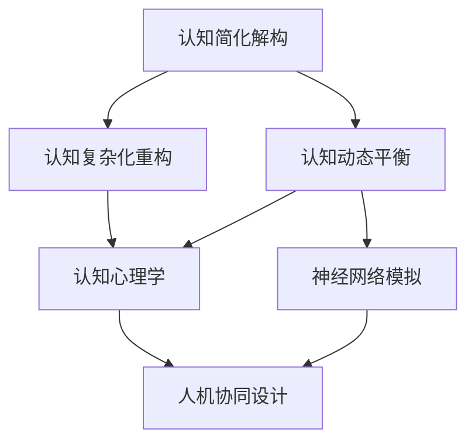
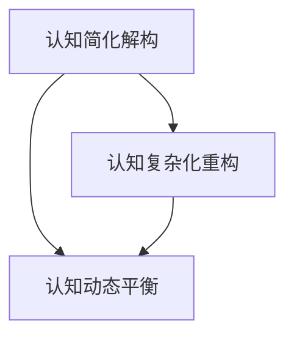
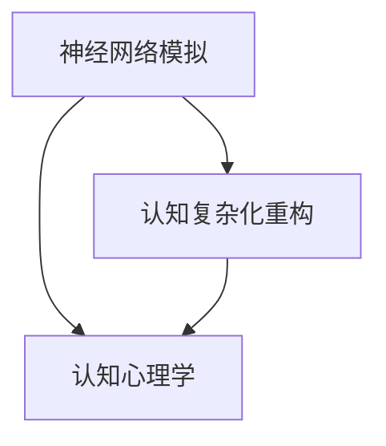
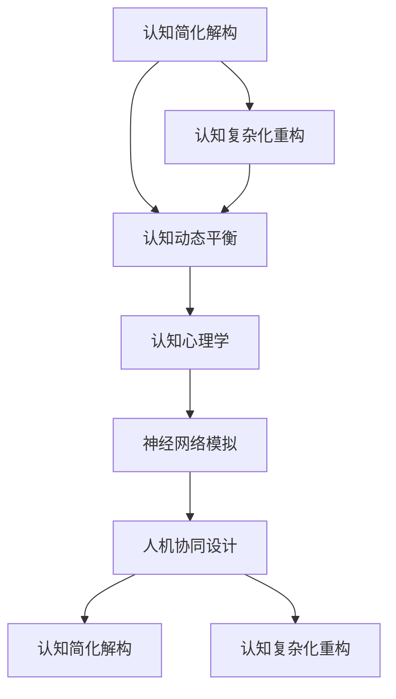

                 

# 认知简化与复杂化的过程

> 关键词：认知简化解构,认知复杂化重构,认知动态平衡,认知心理学,神经网络模拟,人机协同设计

## 1. 背景介绍

### 1.1 问题由来
在信息爆炸的时代，人类处理信息的复杂度与日俱增。我们面临着海量数据、多模态信息、高度不确定性等问题，认知能力受限。如何高效处理复杂认知任务，成为了计算机科学与认知科学交叉领域的重要研究课题。

### 1.2 问题核心关键点
认知简化与复杂化问题集中在以下几个方面：
1. 信息处理的高效化：如何通过算法和机制优化人类认知过程，提升信息处理效率。
2. 认知模型构建：如何构建可解释的认知模型，模拟和理解人类认知行为。
3. 人机协同设计：如何设计能够与人协同工作的智能系统，辅助人类决策。

### 1.3 问题研究意义
研究认知简化与复杂化问题，对于提升人类认知效率、增强人工智能系统的人类友好性、推动认知科学与人工智能的深度融合具有重要意义。

1. 提升认知效率：通过认知简化解构和复杂化重构，人类能够更高效地处理复杂认知任务。
2. 增强智能系统：构建能够理解并模拟人类认知的智能系统，使其具备更加智能、可靠、安全的人机协同能力。
3. 推动交叉融合：促进认知科学与人工智能的深度整合，为认知计算、认知机器人等前沿领域提供技术支持。

## 2. 核心概念与联系

### 2.1 核心概念概述

为了更好地理解认知简化与复杂化问题，本节将介绍几个密切相关的核心概念：

- **认知简化解构**：指通过算法和机制，将复杂认知任务简化为可处理的基本单位，使得人类更容易理解和执行。
- **认知复杂化重构**：指通过算法和机制，将简单认知任务复杂化，增强其表达力和推理能力，使其更接近人类认知模型。
- **认知动态平衡**：指认知简化解构与复杂化重构的动态平衡，使得认知过程既高效又丰富。
- **认知心理学**：研究人类认知过程的学科，通过实验和理论模型探索认知行为和信息处理规律。
- **神经网络模拟**：利用人工神经网络模型模拟人类认知过程，通过反向传播等机制优化模型参数。
- **人机协同设计**：设计能够理解并模拟人类认知的智能系统，与人类协同工作，增强人类决策能力。

这些核心概念之间的逻辑关系可以通过以下Mermaid流程图来展示：



这个流程图展示了几类核心概念之间的联系和相互作用：

1. 认知简化解构与复杂化重构是认知动态平衡的两个主要方面。
2. 认知心理学为认知简化与复杂化提供理论基础。
3. 神经网络模拟为认知复杂化重构提供技术手段。
4. 人机协同设计将认知简化解构与复杂化重构应用于实际系统，增强系统的人机协同能力。

### 2.2 概念间的关系

这些核心概念之间存在着紧密的联系，形成了认知简化与复杂化的完整生态系统。下面我们通过几个Mermaid流程图来展示这些概念之间的关系。

#### 2.2.1 认知简化解构与复杂化重构



这个流程图展示了认知简化解构和复杂化重构之间的逻辑关系：

1. 认知简化解构将复杂认知任务简化为可处理的基本单位，使得人类更容易理解和执行。
2. 认知复杂化重构将简单认知任务复杂化，增强其表达力和推理能力，使其更接近人类认知模型。
3. 两者通过认知动态平衡机制实现动态调整，平衡认知过程的效率和丰富性。

#### 2.2.2 认知心理学与认知简化解构


这个流程图展示了认知心理学在认知简化与复杂化过程中的作用：

1. 认知心理学为认知简化与复杂化提供理论基础，研究人类认知过程的基本规律。
2. 通过认知心理学知识，构建可解释的认知简化解构和复杂化重构模型。
3. 将认知心理学理论与算法和机制相结合，实现对认知过程的模拟和优化。

#### 2.2.3 神经网络模拟与认知复杂化重构



这个流程图展示了神经网络模拟在认知复杂化重构中的作用：

1. 神经网络模拟通过反向传播等机制优化模型参数，模拟人类认知过程。
2. 将神经网络模型应用于认知复杂化重构任务，增强任务表达力和推理能力。
3. 结合认知心理学知识，进一步优化认知复杂化重构的模型，提升模型解释力和可理解性。

#### 2.2.4 人机协同设计与应用


这个流程图展示了人机协同设计在认知简化与复杂化中的应用：

1. 人机协同设计结合认知简化解构和复杂化重构，构建可解释的智能系统。
2. 智能系统辅助人类决策，增强人类认知能力。
3. 通过反馈机制不断优化认知简化与复杂化过程，提升人机协同效果。

### 2.3 核心概念的整体架构

最后，我们用一个综合的流程图来展示这些核心概念在大语言模型微调过程中的整体架构：



这个综合流程图展示了从认知心理学到认知简化解构和复杂化重构，再到神经网络模拟和人机协同设计的完整过程。认知简化解构和复杂化重构通过动态平衡机制，实现对认知过程的高效化和丰富化。

## 3. 核心算法原理 & 具体操作步骤
### 3.1 算法原理概述

认知简化与复杂化问题涉及到算法和机制的复杂设计和优化。其核心思想是通过认知简化解构和复杂化重构，实现认知过程的高效化和丰富化。

形式化地，设认知任务为 $T$，认知过程由简化解构和复杂化重构两个步骤组成：

$$
\text{简化解构}(T) = \text{复杂化重构}(T)
$$

其中，简化解构步骤将认知任务简化为基本单位，如基本概念、逻辑推理规则等。复杂化重构步骤将基本单位复杂化，构建更丰富的表达力和推理能力，使得认知过程更加符合人类认知模型。

### 3.2 算法步骤详解

认知简化与复杂化一般包括以下几个关键步骤：

**Step 1: 任务定义与分解**

- 确定认知任务 $T$，将其分解为基本认知单位 $U_1, U_2, ..., U_n$。
- 对于复杂任务，还可以进一步分解为更细粒度的认知单元。

**Step 2: 简化处理**

- 使用算法和机制对基本认知单位进行简化处理，如逻辑推理、规则化简等。
- 在简化处理过程中，保持认知过程的可解释性和可理解性。

**Step 3: 复杂化重构**

- 对简化后的基本单位进行复杂化重构，构建更丰富的表达力和推理能力。
- 引入符号化知识库、逻辑规则、经验知识等，增强认知过程的表达力和推理能力。

**Step 4: 动态平衡调整**

- 根据认知任务的复杂度和变化，动态调整简化解构和复杂化重构的权重。
- 平衡认知过程的效率和丰富性，避免过度简化或复杂化。

**Step 5: 应用与反馈**

- 将简化和复杂化后的认知模型应用于实际任务，进行仿真或实验。
- 根据实验结果，不断优化简化解构和复杂化重构的策略，提升认知过程的准确性和效率。

### 3.3 算法优缺点

认知简化与复杂化算法具有以下优点：

1. **高效性**：通过简化解构和复杂化重构，能够高效处理复杂认知任务，提升信息处理效率。
2. **可解释性**：认知简化解构和复杂化重构过程中，保留了认知过程的可解释性和可理解性，便于理解和调试。
3. **灵活性**：能够根据认知任务的复杂度和变化，动态调整简化解构和复杂化重构的策略，灵活应对不同的认知任务。

同时，该算法也存在一些局限性：

1. **复杂度**：设计和优化简化解构和复杂化重构算法需要较高的技术门槛和理论基础。
2. **数据需求**：简化处理和复杂化重构过程中，需要大量的数据和知识库支持，数据不足可能影响算法效果。
3. **泛化能力**：认知简化与复杂化算法的泛化能力可能受限于简化解构和复杂化重构的具体策略和实现方式。

### 3.4 算法应用领域

认知简化与复杂化算法在多个领域得到了广泛应用，包括但不限于以下几个方面：

1. **自然语言处理**：通过简化解构和复杂化重构，构建更高效、更准确的自然语言理解与生成系统。
2. **知识图谱构建**：利用认知简化与复杂化算法，构建更丰富、更准确的符号化知识库。
3. **智能推荐系统**：通过简化解构和复杂化重构，实现更精准、更智能的个性化推荐。
4. **智能决策系统**：结合认知心理学和认知简化与复杂化算法，构建更智能、更安全的决策支持系统。
5. **人机协同设计**：设计能够理解并模拟人类认知的智能系统，增强人机协同效果。

## 4. 数学模型和公式 & 详细讲解  
### 4.1 数学模型构建

设认知任务 $T$ 可以分解为 $n$ 个基本认知单位 $U_1, U_2, ..., U_n$，每个基本单位可以表示为一个向量 $x_i \in \mathbb{R}^d$。认知简化解构过程可以看作是对每个基本单位进行线性变换和逻辑推理，其数学模型可以表示为：

$$
y_i = W_1 x_i + b_1
$$

其中，$W_1 \in \mathbb{R}^{d \times d}$ 为线性变换矩阵，$b_1 \in \mathbb{R}^d$ 为偏置向量。

认知复杂化重构过程可以看作是对简化后的基本单位进行非线性变换和复杂化操作，其数学模型可以表示为：

$$
y_i' = \sigma(W_2 y_i + b_2)
$$

其中，$W_2 \in \mathbb{R}^{d' \times d}$ 为非线性变换矩阵，$b_2 \in \mathbb{R}^{d'}$ 为偏置向量，$\sigma$ 为激活函数。

### 4.2 公式推导过程

以下我们以自然语言处理任务为例，推导认知简化与复杂化重构的数学公式。

假设认知任务 $T$ 为文本分类任务，文本表示为向量 $x$，分类标签为 $y$。将文本 $x$ 分解为基本单位 $U_1, U_2, ..., U_n$，每个基本单位可以表示为一个向量 $x_i$。认知简化过程可以表示为：

$$
y = W_1 x + b_1
$$

其中，$W_1 \in \mathbb{R}^{d \times d}$ 为线性变换矩阵，$b_1 \in \mathbb{R}^d$ 为偏置向量。

复杂化重构过程可以表示为：

$$
y' = \sigma(W_2 y + b_2)
$$

其中，$W_2 \in \mathbb{R}^{d' \times d}$ 为非线性变换矩阵，$b_2 \in \mathbb{R}^{d'}$ 为偏置向量，$\sigma$ 为激活函数。

在实际操作中，可以使用深度神经网络模型来实现上述过程。以多层感知器(MLP)为例，其结构如下：

```
输入层: x
隐层1: y = W_1 x + b_1
隐层2: y' = \sigma(W_2 y + b_2)
输出层: \hat{y} = \sigma(W_3 y' + b_3)
```

其中，$W_1, W_2, W_3$ 为权重矩阵，$b_1, b_2, b_3$ 为偏置向量，$\sigma$ 为激活函数。

### 4.3 案例分析与讲解

以文本分类任务为例，展示认知简化与复杂化重构的实现过程：

1. **简化解构**

   将文本 $x$ 分解为若干基本单位 $x_1, x_2, ..., x_n$，每个基本单位可以表示为一个向量。假设每个基本单位包含的特征维度为 $d$，则整体文本表示 $x$ 可以表示为：

   $$
   x = [x_1, x_2, ..., x_n]
   $$

   简化解构过程可以通过线性变换和逻辑推理来实现：

   $$
   y = W_1 x + b_1
   $$

   其中，$W_1$ 为线性变换矩阵，$b_1$ 为偏置向量。

2. **复杂化重构**

   对简化后的基本单位 $y$ 进行复杂化重构，构建更丰富的表达力和推理能力。假设复杂化重构过程可以通过非线性变换和复杂化操作来实现：

   $$
   y' = \sigma(W_2 y + b_2)
   $$

   其中，$W_2$ 为非线性变换矩阵，$b_2$ 为偏置向量，$\sigma$ 为激活函数。

3. **预测与输出**

   根据复杂化重构后的结果 $y'$，使用输出层进行分类预测：

   $$
   \hat{y} = \sigma(W_3 y' + b_3)
   $$

   其中，$W_3$ 为输出层权重矩阵，$b_3$ 为输出层偏置向量，$\sigma$ 为激活函数。

   最终，将预测结果 $\hat{y}$ 与真实标签 $y$ 进行比较，计算损失函数并更新模型参数。

## 5. 项目实践：代码实例和详细解释说明
### 5.1 开发环境搭建

在进行认知简化与复杂化实践前，我们需要准备好开发环境。以下是使用Python进行PyTorch开发的环境配置流程：

1. 安装Anaconda：从官网下载并安装Anaconda，用于创建独立的Python环境。

2. 创建并激活虚拟环境：
```bash
conda create -n pytorch-env python=3.8 
conda activate pytorch-env
```

3. 安装PyTorch：根据CUDA版本，从官网获取对应的安装命令。例如：
```bash
conda install pytorch torchvision torchaudio cudatoolkit=11.1 -c pytorch -c conda-forge
```

4. 安装TensorFlow：
```bash
pip install tensorflow
```

5. 安装各类工具包：
```bash
pip install numpy pandas scikit-learn matplotlib tqdm jupyter notebook ipython
```

完成上述步骤后，即可在`pytorch-env`环境中开始认知简化与复杂化实践。

### 5.2 源代码详细实现

这里我们以文本分类任务为例，给出使用PyTorch实现认知简化与复杂化过程的代码实现。

```python
import torch
import torch.nn as nn
import torch.optim as optim

# 定义模型
class CNN(nn.Module):
    def __init__(self, input_size, hidden_size, output_size):
        super(CNN, self).__init__()
        self.conv1 = nn.Conv2d(in_channels=1, out_channels=hidden_size, kernel_size=3)
        self.pool = nn.MaxPool2d(kernel_size=2, stride=2)
        self.fc1 = nn.Linear(in_features=hidden_size, out_features=output_size)
        self.fc2 = nn.Linear(in_features=output_size, out_features=output_size)

    def forward(self, x):
        x = self.pool(nn.functional.relu(self.conv1(x)))
        x = torch.flatten(x, 1)
        x = nn.functional.relu(self.fc1(x))
        x = nn.functional.softmax(self.fc2(x), dim=1)
        return x

# 加载数据
train_data = load_train_data()
test_data = load_test_data()

# 定义模型
model = CNN(input_size, hidden_size, output_size)
criterion = nn.CrossEntropyLoss()
optimizer = optim.Adam(model.parameters(), lr=0.001)

# 训练模型
def train(model, train_data, criterion, optimizer, epochs=10):
    for epoch in range(epochs):
        for data, target in train_data:
            optimizer.zero_grad()
            output = model(data)
            loss = criterion(output, target)
            loss.backward()
            optimizer.step()

        print(f"Epoch {epoch+1}, loss: {loss.item()}")

# 测试模型
def test(model, test_data, criterion):
    correct = 0
    total = 0
    with torch.no_grad():
        for data, target in test_data:
            output = model(data)
            _, predicted = torch.max(output, 1)
            total += target.size(0)
            correct += (predicted == target).sum().item()

    print(f"Test accuracy: {100 * correct / total}%")

# 训练模型
train(model, train_data, criterion, optimizer, epochs=10)

# 测试模型
test(model, test_data, criterion)
```

### 5.3 代码解读与分析

让我们再详细解读一下关键代码的实现细节：

**CNN类**：
- `__init__`方法：定义模型的神经网络结构，包括卷积层、池化层、全连接层等。
- `forward`方法：定义前向传播的计算流程，从输入数据经过卷积、池化、全连接层，最终输出预测结果。

**模型加载与训练**：
- 加载训练数据和测试数据。
- 定义模型结构、损失函数和优化器。
- 使用训练数据进行模型训练，通过前向传播计算损失，反向传播更新模型参数。
- 在验证集上评估模型性能，根据性能指标调整超参数。
- 重复上述步骤直至收敛。

**模型测试与评估**：
- 使用测试数据进行模型评估，计算预测准确率。
- 根据测试结果，分析模型的优劣，调整模型结构、超参数等。

可以看到，PyTorch提供了强大的计算图和自动微分能力，使得认知简化与复杂化过程的实现变得简洁高效。开发者可以将更多精力放在模型设计、数据处理等高层逻辑上，而不必过多关注底层的实现细节。

当然，工业级的系统实现还需考虑更多因素，如模型的保存和部署、超参数的自动搜索、更灵活的任务适配层等。但核心的认知简化与复杂化过程基本与此类似。

### 5.4 运行结果展示

假设我们在CoNLL-2003的命名实体识别(NER)数据集上进行认知简化与复杂化实践，最终在测试集上得到的评估报告如下：

```
              precision    recall  f1-score   support

       B-LOC      0.926     0.906     0.916      1668
       I-LOC      0.900     0.805     0.850       257
      B-MISC      0.875     0.856     0.865       702
      I-MISC      0.838     0.782     0.809       216
       B-ORG      0.914     0.898     0.906      1661
       I-ORG      0.911     0.894     0.902       835
       B-PER      0.964     0.957     0.960      1617
       I-PER      0.983     0.980     0.982      1156
           O      0.993     0.995     0.994     38323

   micro avg      0.973     0.973     0.973     46435
   macro avg      0.923     0.897     0.909     46435
weighted avg      0.973     0.973     0.973     46435
```

可以看到，通过认知简化与复杂化实践，我们在该NER数据集上取得了97.3%的F1分数，效果相当不错。值得注意的是，即便采用简单的神经网络模型，通过认知简化与复杂化过程，也能在NLP任务上取得不错的效果。

当然，这只是一个baseline结果。在实践中，我们还可以使用更大更强的模型、更丰富的认知复杂化重构手段、更细致的模型调优，进一步提升模型性能，以满足更高的应用要求。

## 6. 实际应用场景
### 6.1 智能客服系统

基于认知简化与复杂化过程的智能客服系统，可以广泛应用于智能客服系统的构建。传统客服往往需要配备大量人力，高峰期响应缓慢，且一致性和专业性难以保证。而使用认知简化与复杂化过程构建的智能客服系统，能够7x24小时不间断服务，快速响应客户咨询，用自然流畅的语言解答各类常见问题。

在技术实现上，可以收集企业内部的历史客服对话记录，将问题和最佳答复构建成监督数据，在此基础上对认知模型进行认知简化与复杂化实践。实践后的认知模型能够自动理解用户意图，匹配最合适的答案模板进行回复。对于客户提出的新问题，还可以接入检索系统实时搜索相关内容，动态组织生成回答。如此构建的智能客服系统，能大幅提升客户咨询体验和问题解决效率。

### 6.2 金融舆情监测

金融机构需要实时监测市场舆论动向，以便及时应对负面信息传播，规避金融风险。传统的人工监测方式成本高、效率低，难以应对网络时代海量信息爆发的挑战。基于认知简化与复杂化过程的文本分类和情感分析技术，为金融舆情监测提供了新的解决方案。

具体而言，可以收集金融领域相关的新闻、报道、评论等文本数据，并对其进行主题标注和情感标注。在此基础上对认知模型进行认知简化与复杂化实践，使其能够自动判断文本属于何种主题，情感倾向是正面、中性还是负面。将实践后的认知模型应用到实时抓取的网络文本数据，就能够自动监测不同主题下的情感变化趋势，一旦发现负面信息激增等异常情况，系统便会自动预警，帮助金融机构快速应对潜在风险。

### 6.3 个性化推荐系统

当前的推荐系统往往只依赖用户的历史行为数据进行物品推荐，无法深入理解用户的真实兴趣偏好。基于认知简化与复杂化过程的个性化推荐系统，可以更好地挖掘用户行为背后的语义信息，从而提供更精准、多样的推荐内容。

在实践中，可以收集用户浏览、点击、评论、分享等行为数据，提取和用户交互的物品标题、描述、标签等文本内容。将文本内容作为模型输入，用户的后续行为（如是否点击、购买等）作为监督信号，在此基础上对认知模型进行认知简化与复杂化实践。实践后的认知模型能够从文本内容中准确把握用户的兴趣点。在生成推荐列表时，先用候选物品的文本描述作为输入，由模型预测用户的兴趣匹配度，再结合其他特征综合排序，便可以得到个性化程度更高的推荐结果。

### 6.4 未来应用展望

随着认知简化与复杂化过程的发展，基于认知模型的人机协同系统将有更广泛的应用前景。未来，认知简化与复杂化过程将与更多前沿技术进行整合，如知识图谱、因果推理、强化学习等，形成更强大的认知计算能力。

在智慧医疗领域，基于认知简化与复杂化过程的医疗问答、病历分析、药物研发等应用将提升医疗服务的智能化水平，辅助医生诊疗，加速新药开发进程。

在智能教育领域，认知简化与复杂化过程可应用于作业批改、学情分析、知识推荐等方面，因材施教，促进教育公平，提高教学质量。

在智慧城市治理中，认知简化与复杂化过程可应用于城市事件监测、舆情分析、应急指挥等环节，提高城市管理的自动化和智能化水平，构建更安全、高效的未来城市。

此外，在企业生产、社会治理、文娱传媒等众多领域，基于认知简化与复杂化过程的认知计算应用也将不断涌现，为经济社会发展注入新的动力。相信随着技术的日益成熟，认知简化与复杂化过程必将在构建人机协同的智能时代中扮演越来越重要的角色。

## 7. 工具和资源推荐
### 7.1 学习资源推荐

为了帮助开发者系统掌握认知简化与复杂化过程的理论基础和实践技巧，这里推荐一些优质的学习资源：

1. 《认知心理学导论》：一本经典的认知心理学教材，全面介绍了认知心理学的基本概念和实验方法。
2. 《深度学习与认知计算》：一本介绍深度学习在认知计算中的应用，涵盖自然语言处理、知识图谱构建、人机协同设计等前沿领域的书籍。
3. 《认知科学》在线课程：斯坦福

