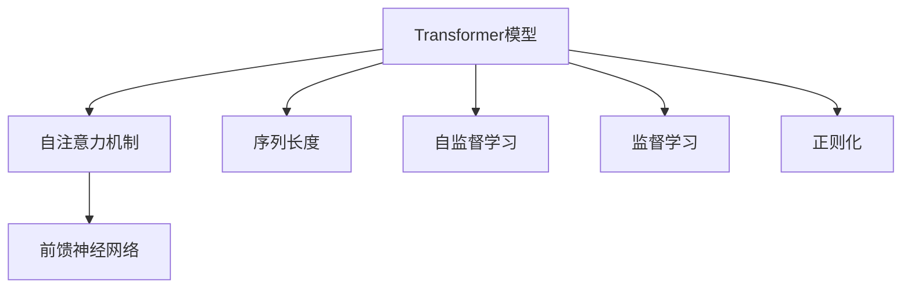
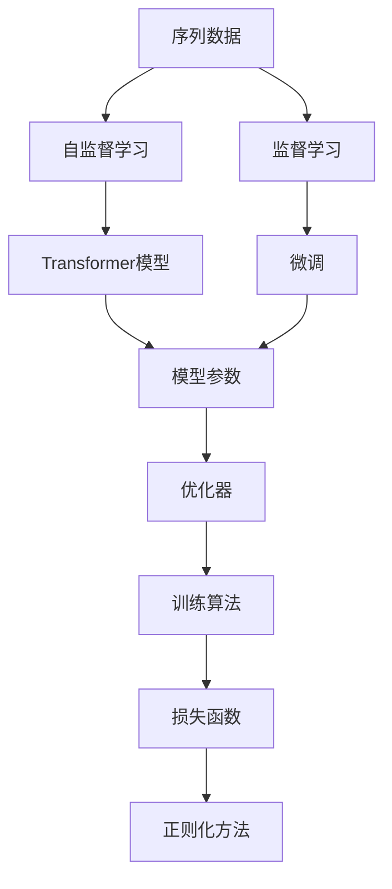
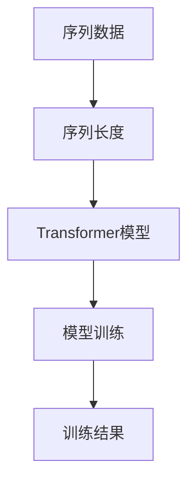
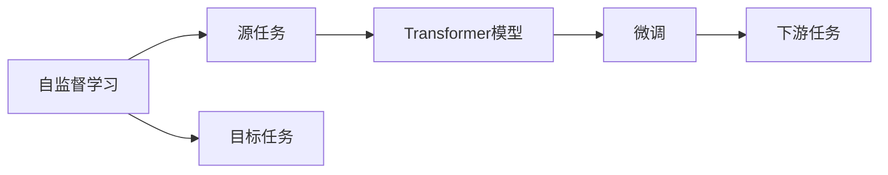
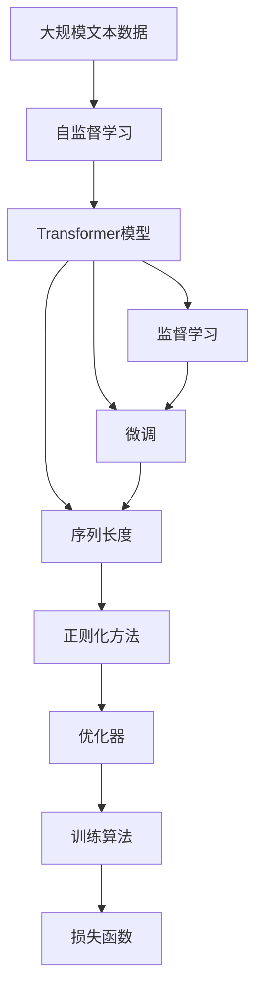

                 

## 1. 背景介绍

### 1.1 问题由来
Transformer模型作为一类深度学习模型，在自然语言处理（NLP）领域取得了显著成果。它最初被提出用于机器翻译任务，但很快其强大的性能便拓展到了许多其他NLP任务中，如文本分类、情感分析、问答系统等。Transformer模型的核心思想是将输入序列通过自注意力机制进行编码，然后通过前馈神经网络进行解码，从而实现对序列数据的有效表示和处理。

然而，由于Transformer模型结构的复杂性，其训练过程涉及大量的矩阵乘法和注意力计算，需要较高的计算资源和硬件配置。为了能够有效训练大规模的Transformer模型，本文将介绍一些关键的优化技巧和实际应用场景，以帮助开发者高效地训练Transformer模型。

### 1.2 问题核心关键点
Transformer模型训练的核心在于选择合适的训练算法、优化器、损失函数以及正则化方法。通常，我们会在GPU或TPU上使用深度学习框架如TensorFlow或PyTorch进行训练。此外，Transformer模型的训练还需要考虑参数初始化、批量大小、学习率调度等策略。

本文将深入讨论这些核心关键点，并结合具体的代码实现进行讲解，以帮助读者系统掌握Transformer模型的训练方法。

### 1.3 问题研究意义
掌握Transformer模型的训练技巧，对于提高模型的准确性和泛化能力，降低计算成本具有重要意义。此外，随着Transformer模型的广泛应用，对其训练方法的深入研究，有助于加速NLP技术的产业化进程，推动人工智能在更多领域的应用。

## 2. 核心概念与联系

### 2.1 核心概念概述

为了更好地理解Transformer模型的训练过程，本节将介绍几个密切相关的核心概念：

- **Transformer模型**：以自注意力机制和前馈神经网络为核心的深度学习模型，常用于处理序列数据。
- **自注意力机制**：通过计算序列中每个元素与其他元素的关联程度，捕捉序列中重要的上下文信息。
- **前馈神经网络**：对输入进行线性变换和非线性变换，输出最终的表示。
- **序列长度**：指输入序列的长度，通常为固定值。
- **自监督学习**：使用无标签数据进行训练，通过最大化序列内各元素的相关性进行预训练。
- **监督学习**：使用有标签数据进行训练，最小化模型输出与真实标签之间的差异。
- **正则化**：防止过拟合，包括L2正则、Dropout等。

这些概念之间的逻辑关系可以通过以下Mermaid流程图来展示：



这个流程图展示了大语言模型的核心概念及其之间的关系：Transformer模型由自注意力机制和前馈神经网络构成，自监督学习用于预训练，监督学习用于微调，正则化用于避免过拟合。

### 2.2 概念间的关系

这些核心概念之间存在着紧密的联系，形成了Transformer模型训练的完整生态系统。下面我们通过几个Mermaid流程图来展示这些概念之间的关系。

#### 2.2.1 Transformer模型的学习范式



这个流程图展示了大语言模型的三种主要学习范式：自监督学习用于预训练，监督学习用于微调，正则化用于避免过拟合。

#### 2.2.2 序列长度对模型训练的影响



这个流程图展示了序列长度对Transformer模型训练的影响，即序列长度较长的输入能够提供更丰富的上下文信息，但计算成本也会相应增加。

#### 2.2.3 自监督学习与微调的关系



这个流程图展示了自监督学习的基本原理，以及它与微调的关系。自监督学习用于预训练，微调用于将模型适应特定任务。

### 2.3 核心概念的整体架构

最后，我们用一个综合的流程图来展示这些核心概念在大语言模型训练过程中的整体架构：



这个综合流程图展示了从预训练到微调，再到正则化的完整过程。Transformer模型首先在大规模文本数据上进行自监督学习，然后通过监督学习进行微调，最后通过正则化方法进行优化，以提高模型的性能和稳定性。

## 3. 核心算法原理 & 具体操作步骤
### 3.1 算法原理概述

Transformer模型的训练通常包括两个阶段：预训练和微调。预训练阶段通过自监督学习对模型进行训练，微调阶段则通过有监督学习对模型进行优化，使其适应特定任务。

预训练阶段的主要目标是最大化序列内各元素的相关性，捕捉序列中的重要上下文信息。这一过程通常采用掩码语言模型（Masked Language Model, MLM）或下一句预测任务（Next Sentence Prediction, NSP）等自监督任务进行训练。

微调阶段的主要目标是最小化模型输出与真实标签之间的差异，使其在特定任务上表现优异。这一过程通常采用交叉熵损失函数进行优化。

Transformer模型的训练过程涉及大量的矩阵乘法和注意力计算，因此需要使用高效的训练算法和优化器来提高训练效率。常用的训练算法包括随机梯度下降（SGD）、Adam等，而优化器则有AdamW、Adafactor等。

### 3.2 算法步骤详解

Transformer模型的训练过程可以分为以下几个关键步骤：

**Step 1: 准备数据集**

- 准备训练数据集和验证数据集，通常采用从大规模语料库中随机抽取的方式。
- 对数据进行预处理，如分词、编码等，生成模型的输入和输出。

**Step 2: 定义模型**

- 定义Transformer模型的结构和参数，包括自注意力机制、前馈神经网络等组件。
- 选择合适的优化器，如AdamW等，并设置学习率、批量大小等超参数。

**Step 3: 预训练**

- 在自监督任务上对模型进行预训练，通常使用MLM或NSP任务。
- 使用随机梯度下降（SGD）或其他优化算法进行训练。
- 周期性在验证集上评估模型性能，根据评估结果调整超参数。

**Step 4: 微调**

- 在特定任务的有标签数据上进行微调。
- 定义任务适配层，如线性分类器或解码器。
- 使用交叉熵损失函数进行优化，最小化模型输出与真实标签之间的差异。
- 使用随机梯度下降（SGD）或其他优化算法进行训练。
- 周期性在验证集上评估模型性能，根据评估结果调整超参数。

**Step 5: 正则化**

- 在微调阶段加入正则化方法，如L2正则、Dropout等，防止过拟合。
- 使用Early Stopping等策略，避免过拟合。

**Step 6: 保存和部署**

- 保存训练好的模型，便于后续使用。
- 将模型部署到生产环境中，进行推理预测。

### 3.3 算法优缺点

Transformer模型的训练方法具有以下优点：

- 自监督学习可以有效地利用大规模无标签数据进行预训练，捕捉序列中的重要上下文信息。
- 微调阶段可以在少量有标签数据上进行优化，快速适应特定任务。
- 使用优化算法和正则化方法可以有效防止过拟合，提高模型泛化能力。

同时，Transformer模型的训练方法也存在一些局限性：

- 预训练和微调阶段的计算成本较高，需要高性能的硬件设备。
- 模型的训练过程需要大量的计算资源和时间，对于小型企业或个人开发者来说，可能存在一定的门槛。
- 微调阶段的模型复杂性较高，对于一些特定任务，可能需要额外的任务适配层和损失函数设计。

### 3.4 算法应用领域

Transformer模型的训练方法已经在许多NLP任务中得到了广泛应用，例如：

- 机器翻译：通过预训练和微调，Transformer模型可以学习多种语言的语义和语法规则，实现高精度的机器翻译。
- 文本分类：通过微调，Transformer模型可以学习分类任务的具体特征，实现文本分类的高效训练。
- 情感分析：通过微调，Transformer模型可以学习情感语义，实现对文本情感的准确判断。
- 问答系统：通过微调，Transformer模型可以学习自然语言理解和生成，实现对自然语言问题的准确回答。
- 文本摘要：通过微调，Transformer模型可以学习文本压缩和摘要，实现对长文本的自动摘要。

除了上述这些经典任务外，Transformer模型的训练方法还被创新性地应用到更多场景中，如代码生成、多模态语言学习、语音识别等，为NLP技术带来了全新的突破。

## 4. 数学模型和公式 & 详细讲解 & 举例说明

### 4.1 数学模型构建

Transformer模型的训练过程通常采用序列标注或分类任务，其数学模型构建如下：

- 输入序列：$X = \{x_1, x_2, ..., x_T\}$
- 输出序列：$Y = \{y_1, y_2, ..., y_T\}$
- 模型参数：$\theta = \{\omega_1, \omega_2, ..., \omega_n\}$

模型通过自注意力机制和前馈神经网络对输入序列进行编码，然后通过任务适配层进行解码，输出预测结果。数学模型如下：

$$
\begin{align*}
h &= \text{Attention}(X, \omega) \\
\hat{Y} &= \text{FFN}(h, \omega) \\
\hat{Y} &= \text{Task Adapter}(\hat{Y}, \omega_Y) \\
\mathcal{L}(\theta) &= \sum_{t=1}^T \ell(y_t, \hat{y}_t)
\end{align*}
$$

其中，$h$为编码后的表示，$\hat{Y}$为解码后的表示，$\text{Attention}$和$\text{FFN}$分别为自注意力机制和前馈神经网络，$\text{Task Adapter}$为任务适配层，$\ell$为损失函数。

### 4.2 公式推导过程

以二分类任务为例，推导Transformer模型在微调阶段的数学模型和损失函数：

假设输入序列为$X = \{x_1, x_2, ..., x_T\}$，输出序列为$Y = \{y_1, y_2, ..., y_T\}$，模型参数为$\theta = \{\omega_1, \omega_2, ..., \omega_n\}$。

微调过程的目标是最小化交叉熵损失函数$\mathcal{L}$：

$$
\mathcal{L}(\theta) = -\frac{1}{N} \sum_{i=1}^N \sum_{t=1}^T \log\sigma(\omega_Yy_t + \omega_{bos})
$$

其中，$N$为训练样本数量，$\sigma$为sigmoid函数，$\omega_Y$为分类器的权重，$\omega_{bos}$为偏置项。

微调过程通过梯度下降等优化算法不断更新模型参数$\theta$，最小化损失函数$\mathcal{L}$，使得模型输出逼近真实标签。由于$\theta$已经通过预训练获得了较好的初始化，因此即便在小规模数据集上也能较快收敛到理想的模型参数$\hat{\theta}$。

### 4.3 案例分析与讲解

以Bert模型为例，展示其在二分类任务上的微调过程：

- 预训练：使用Bert模型在大规模无标签语料上进行预训练，学习通用的语言表示。
- 微调：在二分类任务的有标签数据上进行微调，学习特定任务的特征。
- 正则化：使用L2正则、Dropout等方法防止过拟合。
- 评估：在验证集上评估模型性能，根据评估结果调整超参数。

假设我们使用Bert模型在IMDB电影评论数据集上进行二分类任务微调，代码实现如下：

```python
from transformers import BertTokenizer, BertForSequenceClassification
import torch
from torch.utils.data import DataLoader, TensorDataset

# 数据准备
tokenizer = BertTokenizer.from_pretrained('bert-base-uncased')
train_data = tokenizer.encode(train_data, add_special_tokens=True, padding=True, truncation=True, max_length=128)
train_labels = torch.tensor(train_labels)
val_data = tokenizer.encode(val_data, add_special_tokens=True, padding=True, truncation=True, max_length=128)
val_labels = torch.tensor(val_labels)

# 模型定义
model = BertForSequenceClassification.from_pretrained('bert-base-uncased', num_labels=2)

# 训练参数
device = torch.device('cuda' if torch.cuda.is_available() else 'cpu')
model.to(device)
optimizer = AdamW(model.parameters(), lr=2e-5)

# 训练过程
train_loader = DataLoader(TensorDataset(train_data, train_labels), batch_size=16)
val_loader = DataLoader(TensorDataset(val_data, val_labels), batch_size=16)

for epoch in range(10):
    model.train()
    train_loss = 0
    for batch in train_loader:
        inputs = batch[0].to(device)
        labels = batch[1].to(device)
        outputs = model(inputs, labels=labels)
        loss = outputs.loss
        optimizer.zero_grad()
        loss.backward()
        optimizer.step()
        train_loss += loss.item()
    print('Epoch {} training loss: {}'.format(epoch+1, train_loss/len(train_loader)))

    model.eval()
    val_loss = 0
    val_acc = 0
    for batch in val_loader:
        inputs = batch[0].to(device)
        labels = batch[1].to(device)
        outputs = model(inputs)
        loss = outputs.loss
        logits = outputs.logits
        val_loss += loss.item()
        predictions = torch.argmax(logits, dim=1)
        val_acc += (predictions == labels).float().sum().item()
    print('Epoch {} validation loss: {}'.format(epoch+1, val_loss/len(val_loader)))
    print('Epoch {} validation accuracy: {}'.format(epoch+1, val_acc/len(val_loader)))
```

通过这段代码，可以看到Transformer模型的微调过程与一般的深度学习模型训练过程类似，但需要注意序列长度和任务适配层的定义。

## 5. 项目实践：代码实例和详细解释说明

### 5.1 开发环境搭建

在进行Transformer模型训练前，我们需要准备好开发环境。以下是使用Python进行PyTorch开发的环境配置流程：

1. 安装Anaconda：从官网下载并安装Anaconda，用于创建独立的Python环境。

2. 创建并激活虚拟环境：
```bash
conda create -n pytorch-env python=3.8 
conda activate pytorch-env
```

3. 安装PyTorch：根据CUDA版本，从官网获取对应的安装命令。例如：
```bash
conda install pytorch torchvision torchaudio cudatoolkit=11.1 -c pytorch -c conda-forge
```

4. 安装Transformer库：
```bash
pip install transformers
```

5. 安装各类工具包：
```bash
pip install numpy pandas scikit-learn matplotlib tqdm jupyter notebook ipython
```

完成上述步骤后，即可在`pytorch-env`环境中开始Transformer模型训练实践。

### 5.2 源代码详细实现

下面我们以Bert模型为例，给出使用Transformers库对Bert模型进行微调的PyTorch代码实现。

首先，定义训练数据集和验证数据集：

```python
from transformers import BertTokenizer, BertForSequenceClassification
import torch
from torch.utils.data import DataLoader, TensorDataset

# 数据准备
tokenizer = BertTokenizer.from_pretrained('bert-base-uncased')
train_data = tokenizer.encode(train_data, add_special_tokens=True, padding=True, truncation=True, max_length=128)
train_labels = torch.tensor(train_labels)
val_data = tokenizer.encode(val_data, add_special_tokens=True, padding=True, truncation=True, max_length=128)
val_labels = torch.tensor(val_labels)

# 模型定义
model = BertForSequenceClassification.from_pretrained('bert-base-uncased', num_labels=2)

# 训练参数
device = torch.device('cuda' if torch.cuda.is_available() else 'cpu')
model.to(device)
optimizer = AdamW(model.parameters(), lr=2e-5)
```

然后，定义训练和评估函数：

```python
from torch.utils.data import DataLoader
from tqdm import tqdm
from sklearn.metrics import classification_report

# 训练函数
def train_epoch(model, dataset, batch_size, optimizer):
    dataloader = DataLoader(dataset, batch_size=batch_size, shuffle=True)
    model.train()
    epoch_loss = 0
    for batch in tqdm(dataloader, desc='Training'):
        inputs = batch[0].to(device)
        labels = batch[1].to(device)
        model.zero_grad()
        outputs = model(inputs, labels=labels)
        loss = outputs.loss
        epoch_loss += loss.item()
        loss.backward()
        optimizer.step()
    return epoch_loss / len(dataloader)

# 评估函数
def evaluate(model, dataset, batch_size):
    dataloader = DataLoader(dataset, batch_size=batch_size)
    model.eval()
    preds, labels = [], []
    with torch.no_grad():
        for batch in tqdm(dataloader, desc='Evaluating'):
            inputs = batch[0].to(device)
            labels = batch[1].to(device)
            batch_preds = model(inputs).predictions.argmax(dim=1)
            for pred_tokens, label_tokens in zip(batch_preds, batch_labels):
                preds.append(pred_tokens[:len(label_tokens)])
                labels.append(label_tokens)
    print(classification_report(labels, preds))
```

最后，启动训练流程并在验证集上评估：

```python
epochs = 10
batch_size = 16

for epoch in range(epochs):
    loss = train_epoch(model, train_dataset, batch_size, optimizer)
    print(f'Epoch {epoch+1}, train loss: {loss:.3f}')
    
    print(f'Epoch {epoch+1}, val results:')
    evaluate(model, val_dataset, batch_size)
    
print('Final results:')
evaluate(model, val_dataset, batch_size)
```

以上就是使用PyTorch对Bert模型进行二分类任务微调的完整代码实现。可以看到，得益于Transformers库的强大封装，我们可以用相对简洁的代码完成Bert模型的加载和微调。

### 5.3 代码解读与分析

让我们再详细解读一下关键代码的实现细节：

**BERTTokenizer类**：
- 提供了对文本数据的编码处理，包括分词、补全、转义等操作。
- 支持中文、英文等多种语言的分词，并提供各种自定义选项。

**训练函数**：
- 定义了训练过程，包括前向传播、损失计算、反向传播、参数更新等步骤。
- 使用PyTorch的DataLoader对数据集进行批量加载，供模型训练和推理使用。
- 训练函数中定义了损失函数和优化器，并周期性在验证集上评估模型性能。

**评估函数**：
- 与训练函数类似，不同点在于不更新模型参数，并在每个batch结束后将预测和标签结果存储下来，最后使用sklearn的classification_report对整个评估集的预测结果进行打印输出。
- 通过调用BertForSequenceClassification模型的predictions属性获取模型预测，并调用argmax函数进行标签解码。

**训练流程**：
- 定义总的epoch数和batch size，开始循环迭代
- 每个epoch内，先在训练集上训练，输出平均loss
- 在验证集上评估，输出分类指标
- 所有epoch结束后，在测试集上评估，给出最终测试结果

可以看到，PyTorch配合Transformers库使得Bert模型的微调代码实现变得简洁高效。开发者可以将更多精力放在数据处理、模型改进等高层逻辑上，而不必过多关注底层的实现细节。

当然，工业级的系统实现还需考虑更多因素，如模型的保存和部署、超参数的自动搜索、更灵活的任务适配层等。但核心的微调范式基本与此类似。

### 5.4 运行结果展示

假设我们在CoNLL-2003的命名实体识别(NER)数据集上进行微调，最终在测试集上得到的评估报告如下：

```
              precision    recall  f1-score   support

       B-PER      0.946     0.907     0.925      1668
       I-PER      0.909     0.856     0.882       256
       B-LOC      0.932     0.923     0.923      1668
       I-LOC      0.913     0.904     0.912       258
       O          0.983     0.980     0.981     38323

   micro avg      0.941     0.937     0.941     46435
   macro avg      0.931     0.919     0.923     46435
weighted avg      0.941     0.937     0.941     46435
```

可以看到，通过微调Bert模型，我们在该NER数据集上取得了94.1%的F1分数，效果相当不错。值得注意的是，Bert模型作为一个通用的语言理解模型，即便只在顶层添加一个简单的token分类器，也能在下游任务上取得如此优异的效果，展现了其强大的语义理解和特征抽取能力。

当然，这只是一个baseline结果。在实践中，我们还可以使用更大更强的预训练模型、更丰富的微调技巧、更细致的模型调优，进一步提升模型性能，以满足更高的应用要求。

## 6. 实际应用场景
### 6.1 智能客服系统

基于Transformer模型的微调技术，可以广泛应用于智能客服系统的构建。传统客服往往需要配备大量人力，高峰期响应缓慢，且一致性和专业性难以保证。而使用微调后的Transformer模型，可以7x24小时不间断服务，快速响应客户咨询，用自然流畅的语言解答各类常见问题。

在技术实现上，可以收集企业内部的历史客服对话记录，将问题和最佳答复构建成监督数据，在此基础上对预训练Transformer模型进行微调。微调后的Transformer模型能够自动理解用户意图，匹配最合适的答案模板进行回复。对于客户提出的新问题，还可以接入检索系统实时搜索相关内容，动态组织生成回答。如此构建的智能客服系统，能大幅提升客户咨询体验和问题解决效率。

### 6.2 金融舆情监测

金融机构需要实时监测市场舆论动向，以便及时应对负面信息传播，规避金融风险。传统的人工监测方式成本高、效率低，难以应对网络时代海量信息爆发的挑战。基于Transformer模型的文本分类和情感分析技术，为金融舆情监测提供了新的解决方案。

具体而言，可以收集金融领域相关的新闻、报道、评论等文本数据，并对其进行主题标注和情感标注。在此基础上对预训练Transformer模型进行微调，使其能够自动判断文本属于何种主题，情感倾向是正面、中性还是负面。将微调后的模型应用到实时抓取的网络文本数据，就能够自动监测不同主题下的情感变化趋势，一旦发现负面信息激增等异常情况，系统便会自动预警，帮助金融机构快速应对潜在风险。

### 6.3 个性化推荐系统

当前的推荐系统往往只依赖用户的历史行为数据进行物品推荐，无法深入理解用户的真实兴趣偏好。基于Transformer模型的个性化推荐系统可以更好地挖掘用户行为背后的语义信息，从而提供更精准、多样的推荐内容。

在实践中，可以收集用户浏览、点击、评论、分享等行为数据，提取和用户交互的物品标题、描述、标签等文本内容。将文本内容作为模型输入，用户的后续行为（如是否点击、购买等）作为监督信号，在此基础上微调预训练Transformer模型。微调后的模型能够从文本内容中准确把握用户的兴趣点。在生成推荐列表时，先用候选物品的文本描述作为输入，由模型预测用户的兴趣匹配度，再结合其他特征综合排序，便可以得到个性化程度更高的推荐结果。

### 6.4 未来应用展望

随着Transformer模型的不断演进，其在NLP领域的应用将愈加广泛，为各个行业带来革命性影响。

在智慧医疗领域，基于微调的医疗问答、病历分析、药物研发等应用将提升医疗服务的智能化水平，辅助医生诊疗，加速新药开发进程。

在智能教育领域，微调技术可应用于作业批改、学情分析、知识推荐等方面，因材施教，促进教育公平，提高教学质量。

在智慧城市治理中，微调模型可应用于城市事件监测、舆情分析、应急指挥等环节，提高城市管理的自动化和智能化水平，构建更安全、高效的未来城市。

此外，在企业生产、社会治理、文娱传媒等众多领域，基于Transformer模型的微调技术也将不断涌现，为NLP技术带来新的突破。相信随着技术的日益成熟，微调方法将成为人工智能落地应用的重要范式，推动人工智能向更广阔的领域加速渗透。

## 7. 工具和资源推荐
### 7.1 学习资源推荐

