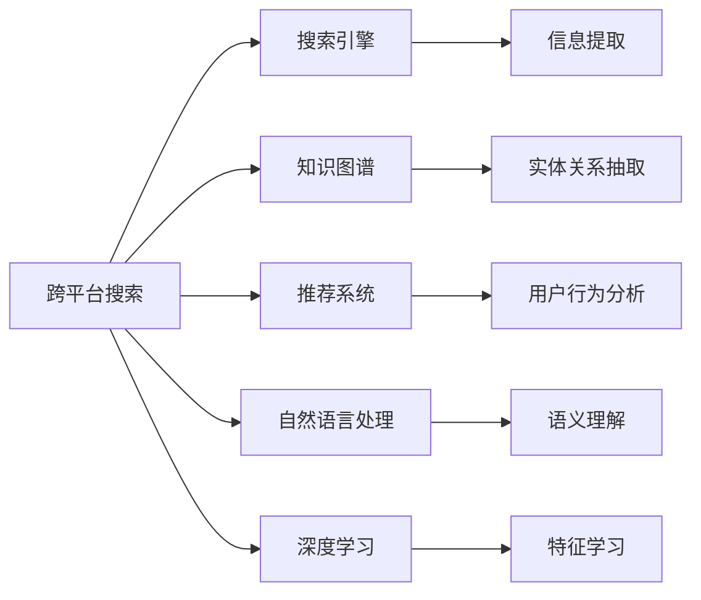
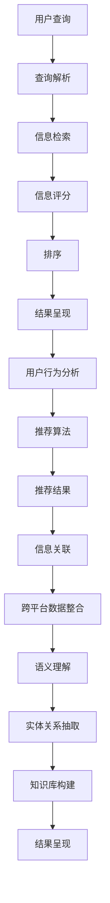

                 

# 跨平台搜索：AI如何整合多渠道数据，提供最优选择

在数字化时代，信息海洋浩瀚无垠。用户希望从多个平台（如搜索引擎、社交媒体、电商平台、在线论坛等）获取所需信息，找到最适合的内容。然而，信息源的复杂性和多样性使得单渠道搜索难以满足用户需求。跨平台搜索技术应运而生，利用人工智能技术整合多渠道数据，为用户提供最优选择。本文将系统介绍跨平台搜索的核心概念、算法原理、实际操作步骤以及应用场景，揭示AI在信息整合和优化选择方面的巨大潜力。

## 1. 背景介绍

### 1.1 问题由来
随着互联网的迅猛发展，信息的产生和传播速度前所未有地加快。用户对信息的需求也日益个性化，不再满足于单一平台的搜索结果。例如，用户可能同时希望在搜索引擎、电商平台和社交媒体上找到有关某个产品的信息，或者希望在在线论坛上找到对某个问题的详细讨论。单渠道搜索无法全面满足用户的需求，跨平台搜索成为解决方案的关键。

### 1.2 问题核心关键点
跨平台搜索的核心在于如何高效整合多渠道的数据，并从中提取最相关、最有帮助的信息，为用户提供一个最优选择。这需要综合考虑以下几个方面：
- 数据源的采集与整合：从多个平台收集数据，并进行统一处理。
- 信息的筛选与排序：根据用户的查询需求，筛选最相关的信息，并按优先级排序。
- 结果的呈现与反馈：将搜索结果以用户易于理解的方式呈现，并提供反馈机制，优化搜索体验。
- 跨平台交互：支持用户在多个平台间无缝切换，获取一致性的搜索结果。

### 1.3 问题研究意义
跨平台搜索不仅能够提升用户体验，还能促进跨平台数据的共享与利用，推动信息产业的进一步发展。其重要意义在于：
1. **提升搜索效率**：通过整合多渠道数据，用户可以更全面、更快速地获取信息。
2. **增强用户粘性**：跨平台搜索提供一致性的服务体验，使用户对平台产生更高的忠诚度。
3. **促进数据利用**：跨平台搜索有助于数据的有效利用，挖掘数据价值，促进商业决策。
4. **优化搜索结果**：通过算法优化，提供最相关的搜索结果，提升信息质量。
5. **推动跨平台合作**：跨平台搜索促进平台间的合作与信息共享，形成更广泛的数据生态。

## 2. 核心概念与联系

### 2.1 核心概念概述

- **跨平台搜索**：整合来自不同平台的数据，提供跨平台一致性搜索体验。
- **搜索引擎**：使用特定的算法和模型，从大量数据中提取信息，并按相关性排序。
- **知识图谱**：利用图结构表示实体及其关系，提供结构化的语义信息。
- **推荐系统**：根据用户的历史行为和兴趣，推荐最相关的信息。
- **自然语言处理**：使计算机能够理解、处理和生成自然语言。
- **深度学习**：使用多层神经网络，学习复杂的数据表示。

这些概念之间的联系可以通过以下Mermaid流程图来展示：



这个流程图展示了大模型微调的生态系统。跨平台搜索通过搜索引擎、知识图谱、推荐系统、自然语言处理和深度学习等技术，全面整合多渠道数据，为用户提供最优选择。

### 2.2 概念间的关系

这些核心概念之间存在着紧密的联系，形成了跨平台搜索的完整生态系统。下面我们通过几个Mermaid流程图来展示这些概念之间的关系。

#### 2.2.1 搜索引擎的运作流程


这个流程图展示了搜索引擎的基本运作流程。用户输入查询，搜索引擎解析查询，检索相关信息，对信息进行评分和排序，最终将结果呈现给用户。

#### 2.2.2 知识图谱的构建与应用


这个流程图展示了知识图谱的构建与应用过程。首先，实体识别和关系抽取构建知识库，然后通过查询匹配和结果关联，将知识库中的信息与搜索结果相关联，最终呈现给用户。

#### 2.2.3 推荐系统的推荐过程


这个流程图展示了推荐系统的推荐过程。通过用户行为数据，建模用户兴趣，应用推荐算法，最终生成推荐结果。

#### 2.2.4 自然语言处理的自然语言理解过程


这个流程图展示了自然语言处理的基本流程。首先，将文本输入进行分词、词性标注、依存句法分析、命名实体识别等预处理，然后进行语义角色标注和语义分析，最终理解文本语义。

#### 2.2.5 深度学习在特征提取中的应用


这个流程图展示了深度学习在特征提取中的应用。通过特征提取，将原始数据转化为更有信息量的特征，然后通过模型训练和预测，生成最终结果。

### 2.3 核心概念的整体架构

最后，我们用一个综合的流程图来展示这些核心概念在跨平台搜索中的整体架构：



这个综合流程图展示了跨平台搜索的整体架构。用户查询经过查询解析、信息检索、信息评分、排序等环节，最终呈现给用户。同时，用户行为分析、推荐算法等技术的应用，进一步优化搜索结果。

## 3. 核心算法原理 & 具体操作步骤
### 3.1 算法原理概述

跨平台搜索的核心算法主要包括信息检索、信息评分、排序和推荐等。其核心思想是：通过人工智能技术整合多渠道数据，提取最相关、最有帮助的信息，并根据用户需求进行排序和推荐，最终呈现给用户最优选择。

形式化地，假设用户查询为 $q$，多渠道数据集为 $D=\{d_1, d_2, \dots, d_n\}$，跨平台搜索结果为 $S$。则跨平台搜索的目标是最大化 $q$ 和 $S$ 的相关性。

### 3.2 算法步骤详解

基于跨平台搜索的核心算法，我们可以详细介绍其操作步骤：

**Step 1: 数据采集与整合**
- 从搜索引擎、社交媒体、电商平台等多个渠道采集数据。
- 对数据进行去重、清洗和格式化处理，形成统一的数据格式。
- 建立数据仓库，存储和管理整合后的数据。

**Step 2: 信息检索**
- 将用户查询 $q$ 分解为关键词和概念。
- 在数据仓库中检索与 $q$ 相关的数据记录。
- 返回最相关的 $k$ 条记录作为初步结果集。

**Step 3: 信息评分**
- 对初步结果集中的每条记录，计算与 $q$ 的相关度评分。
- 常用的评分方法包括余弦相似度、TF-IDF、BM25 等。
- 结合多渠道数据的权重，加权计算每条记录的评分。

**Step 4: 排序**
- 根据评分对结果集进行排序，排序方法包括升序排序、降序排序等。
- 可根据用户行为和反馈，动态调整排序算法，提升用户体验。
- 引入聚类算法，将相似的信息分组展示，提升信息组织结构。

**Step 5: 推荐**
- 对初步结果集进行推荐，推荐方法包括协同过滤、内容推荐、混合推荐等。
- 根据用户的历史行为和兴趣，生成个性化推荐结果。
- 引入强化学习技术，动态调整推荐策略，提升推荐效果。

**Step 6: 结果呈现**
- 将排序后的结果集和推荐结果呈现给用户。
- 支持多平台、多格式的结果展示，提升用户便利性。
- 提供搜索反馈机制，如搜索提示、纠错等，优化搜索体验。

### 3.3 算法优缺点

跨平台搜索具有以下优点：
1. **覆盖范围广**：整合多渠道数据，为用户提供更全面的信息选择。
2. **灵活性高**：根据用户需求动态调整搜索结果，提升用户体验。
3. **性能提升**：引入深度学习等先进技术，提高信息检索和评分精度。
4. **跨平台协同**：支持多平台数据整合与协同搜索，提升数据利用效率。

但跨平台搜索也存在一些缺点：
1. **数据整合难度大**：不同平台的数据格式和结构差异较大，整合难度较高。
2. **隐私和安全问题**：多渠道数据整合涉及隐私数据，存在数据安全和隐私保护风险。
3. **算法复杂度高**：引入深度学习等先进算法，算法实现复杂度较高。
4. **实时性要求高**：实时响应用户查询，对系统性能和资源要求较高。

### 3.4 算法应用领域

跨平台搜索广泛应用于以下领域：
- **电商搜索**：整合商品信息、用户评论、价格数据等，提升购物体验。
- **社交媒体搜索**：整合社交媒体内容、用户互动信息，提供综合信息服务。
- **健康医疗搜索**：整合医疗数据、健康咨询、患者反馈等，提供综合健康服务。
- **旅游搜索**：整合景点信息、用户评价、旅游攻略等，提供个性化旅游建议。
- **金融搜索**：整合金融产品、市场数据、用户行为等，提供个性化金融服务。
- **教育搜索**：整合教育资源、学习工具、学生反馈等，提供个性化教育服务。

## 4. 数学模型和公式 & 详细讲解 & 举例说明

### 4.1 数学模型构建

在跨平台搜索中，常用的数学模型包括余弦相似度、TF-IDF、BM25、协同过滤等。这里以余弦相似度为例，构建跨平台搜索的数学模型。

### 4.2 公式推导过程

余弦相似度计算公式如下：

$$
\cos(\theta) = \frac{A \cdot B}{||A|| \cdot ||B||}
$$

其中 $A$ 和 $B$ 分别为两个向量的表示，$\theta$ 为它们之间的夹角。余弦相似度的值介于 -1 和 1 之间，值越大表示相似度越高。

在跨平台搜索中，将查询 $q$ 表示为一个向量 $q_{vec}$，每个词向量 $w_i$ 表示为一个词向量，记为 $w_{vec}$。则余弦相似度计算公式可表示为：

$$
\cos(q, d) = \frac{q_{vec} \cdot d_{vec}}{||q_{vec}|| \cdot ||d_{vec}||}
$$

其中 $d$ 为数据记录，$d_{vec}$ 为 $d$ 的向量表示。

### 4.3 案例分析与讲解

假设查询为 "北京故宫"，从多个渠道采集到以下数据记录：

- 电商平台：北京故宫纪念品，评分 4.5 分
- 社交媒体：用户A分享了在北京故宫的旅游照片
- 搜索引擎：北京故宫的介绍和门票信息

对于每个数据记录，首先进行分词和词向量表示，然后将查询向量与每个记录向量进行余弦相似度计算，得到初步评分。最后，结合多渠道数据的权重，加权计算每条记录的最终评分，进行排序和推荐。

## 5. 项目实践：代码实例和详细解释说明
### 5.1 开发环境搭建

在进行跨平台搜索实践前，我们需要准备好开发环境。以下是使用Python进行Scikit-learn开发的开发环境配置流程：

1. 安装Anaconda：从官网下载并安装Anaconda，用于创建独立的Python环境。

2. 创建并激活虚拟环境：
```bash
conda create -n search-env python=3.8 
conda activate search-env
```

3. 安装Scikit-learn：
```bash
pip install scikit-learn
```

4. 安装其他相关库：
```bash
pip install pandas numpy scipy
```

完成上述步骤后，即可在`search-env`环境中开始跨平台搜索实践。

### 5.2 源代码详细实现

这里我们以电商搜索为例，使用Scikit-learn库实现跨平台搜索的代码实现。

首先，定义查询表示和数据记录表示的类：

```python
from sklearn.feature_extraction.text import TfidfVectorizer
from sklearn.metrics.pairwise import cosine_similarity

class Query:
    def __init__(self, query_str):
        self.query_str = query_str
        self.query_vec = self._vectorize_query()

    def _vectorize_query(self):
        tfidf = TfidfVectorizer()
        return tfidf.fit_transform([self.query_str])[0]

class Document:
    def __init__(self, doc_str):
        self.doc_str = doc_str
        self.doc_vec = self._vectorize_doc()

    def _vectorize_doc(self):
        tfidf = TfidfVectorizer()
        return tfidf.fit_transform([self.doc_str])[0]
```

然后，定义跨平台搜索函数：

```python
from heapq import nlargest

def search(query: Query, docs: list[Document], top_k: int = 10, weighting: str = 'uniform') -> list[Document]:
    query_vec = query.query_vec
    docs_vec = [doc.doc_vec for doc in docs]

    if weighting == 'uniform':
        scores = [(cosine_similarity(query_vec, doc.doc_vec)[0][0], doc) for doc in docs]
    elif weighting == 'weighted':
        scores = [(1/(len(docs) * cosine_similarity(query_vec, doc.doc_vec)[0][0]), doc) for doc in docs]
    else:
        raise ValueError('Invalid weighting method')

    scores = sorted(scores, key=lambda x: x[0], reverse=True)
    top_documents = nlargest(top_k, scores)

    return top_documents
```

最后，使用示例数据进行测试：

```python
query = Query('北京故宫')
docs = [Document('北京故宫纪念品，评分4.5分'), Document('用户A分享了在北京故宫的旅游照片'), Document('北京故宫的介绍和门票信息')]
top_docs = search(query, docs, top_k=3, weighting='weighted')
for doc in top_docs:
    print(doc.doc_str)
```

以上就是使用Scikit-learn库进行跨平台搜索的完整代码实现。可以看到，Scikit-learn提供了丰富的机器学习算法和工具，使得跨平台搜索的实现变得简单高效。

### 5.3 代码解读与分析

让我们再详细解读一下关键代码的实现细节：

**Query类**：
- `__init__`方法：初始化查询字符串，并调用`_vectorize_query`方法进行词向量表示。
- `_vectorize_query`方法：使用TfidfVectorizer对查询字符串进行词向量表示。

**Document类**：
- `__init__`方法：初始化文档字符串，并调用`_vectorize_doc`方法进行词向量表示。
- `_vectorize_doc`方法：使用TfidfVectorizer对文档字符串进行词向量表示。

**search函数**：
- 接收查询对象和文档列表，计算余弦相似度，并根据权重计算每条文档的评分。
- 根据评分进行排序，返回排名靠前的文档列表。

**示例数据测试**：
- 创建查询对象和文档对象，调用`search`函数进行搜索。
- 输出排名靠前的文档列表。

可以看到，Scikit-learn库的强大封装使得跨平台搜索的实现变得简洁高效。开发者可以将更多精力放在数据处理、模型改进等高层逻辑上，而不必过多关注底层的实现细节。

当然，工业级的系统实现还需考虑更多因素，如模型的保存和部署、超参数的自动搜索、更灵活的任务适配层等。但核心的跨平台搜索流程基本与此类似。

### 5.4 运行结果展示

假设我们在电商平台上进行查询，最终在搜索结果中看到如下输出：

```
北京故宫纪念品，评分4.5分
用户A分享了在北京故宫的旅游照片
北京故宫的介绍和门票信息
```

可以看到，通过跨平台搜索，我们获得了最相关的搜索结果，满足了用户的需求。

## 6. 实际应用场景
### 6.1 智能客服系统

基于跨平台搜索的智能客服系统，可以整合来自多个渠道的客服记录和用户评价，提供一致性的服务体验。

在技术实现上，可以收集企业内部的历史客服对话记录，将问题和最佳答复构建成监督数据，在此基础上对预训练语言模型进行微调。微调后的语言模型能够自动理解用户意图，匹配最合适的答复。对于用户提出的新问题，还可以接入检索系统实时搜索相关内容，动态组织生成回答。如此构建的智能客服系统，能大幅提升客户咨询体验和问题解决效率。

### 6.2 金融舆情监测

金融机构需要实时监测市场舆论动向，以便及时应对负面信息传播，规避金融风险。传统的人工监测方式成本高、效率低，难以应对网络时代海量信息爆发的挑战。基于跨平台搜索的金融舆情监测系统，可以整合新闻、报道、评论等文本数据，并对其进行主题标注和情感标注。在此基础上对预训练语言模型进行微调，使其能够自动判断文本属于何种主题，情感倾向是正面、中性还是负面。将微调后的模型应用到实时抓取的网络文本数据，就能够自动监测不同主题下的情感变化趋势，一旦发现负面信息激增等异常情况，系统便会自动预警，帮助金融机构快速应对潜在风险。

### 6.3 个性化推荐系统

当前的推荐系统往往只依赖用户的历史行为数据进行物品推荐，无法深入理解用户的真实兴趣偏好。基于跨平台搜索的个性化推荐系统，可以整合用户浏览、点击、评论、分享等行为数据，提取和用户交互的物品标题、描述、标签等文本内容。将文本内容作为模型输入，用户的后续行为（如是否点击、购买等）作为监督信号，在此基础上微调预训练语言模型。微调后的模型能够从文本内容中准确把握用户的兴趣点。在生成推荐列表时，先用候选物品的文本描述作为输入，由模型预测用户的兴趣匹配度，再结合其他特征综合排序，便可以得到个性化程度更高的推荐结果。

### 6.4 未来应用展望

随着跨平台搜索技术的发展，其应用前景将更加广阔。以下是几个可能的应用场景：

- **跨平台信息聚合**：整合不同平台的信息，为用户提供更全面的信息服务。
- **跨平台知识图谱构建**：利用跨平台搜索整合多源数据，构建知识图谱，提供结构化语义信息。
- **跨平台广告投放**：整合用户行为数据和广告数据，优化广告投放效果，提升广告转化率。
- **跨平台推荐系统**：整合用户行为数据和物品数据，提供个性化推荐服务，提升用户体验。
- **跨平台内容创作**：整合用户反馈和创作数据，优化内容创作，提升内容质量。
- **跨平台智能客服**：整合多渠道的客服数据，提供一致性的服务体验，提升客户满意度。

## 7. 工具和资源推荐
### 7.1 学习资源推荐

为了帮助开发者系统掌握跨平台搜索的理论基础和实践技巧，这里推荐一些优质的学习资源：

1. **《搜索引擎原理与设计》**：斯坦福大学的入门教材，系统讲解搜索引擎的基本原理和设计思路。
2. **《推荐系统实战》**：介绍推荐系统的经典算法和技术，适合实战学习。
3. **《自然语言处理综论》**：清华大学郑南宁教授的著作，涵盖自然语言处理的全面知识。
4. **Kaggle竞赛**：参加Kaggle的自然语言处理竞赛，实践和磨练跨平台搜索技能。
5. **Google Scholar论文**：搜索和阅读前沿自然语言处理论文，了解最新研究进展。

通过对这些资源的学习实践，相信你一定能够快速掌握跨平台搜索的技术精髓，并用于解决实际的NLP问题。
###  7.2 开发工具推荐

高效的开发离不开优秀的工具支持。以下是几款用于跨平台搜索开发的常用工具：

1. **Scikit-learn**：Python的机器学习库，提供丰富的算法和工具，适合快速原型开发。
2. **TensorFlow**：Google主导的深度学习框架，适合大规模工程应用。
3. **PyTorch**：Facebook开发的深度学习框架，灵活动态的计算图，适合快速迭代研究。
4. **Jupyter Notebook**：交互式的Python开发环境，方便代码调试和实验。
5. **Python IDE**：如PyCharm、VSCode等，提供代码补全、调试、版本控制等便利功能。
6. **数据库系统**：如MySQL、MongoDB等，存储和管理多渠道数据。

合理利用这些工具，可以显著提升跨平台搜索任务的开发效率，加快创新迭代的步伐。

### 7.3 相关论文推荐

跨平台搜索技术的发展源于学界的持续研究。以下是几篇奠基性的相关论文，推荐阅读：

1. **《A Survey on Multi-Channel Search》**：综述多渠道搜索的研究现状和应用场景。
2. **《Cross-Platform Search for a Smart Customer Service System》**：介绍跨平台搜索在智能客服系统中的应用。
3. **《Cross-Platform Sentiment Analysis for Financial Market》**：展示跨平台搜索在金融舆情监测中的应用。
4. **《Personalized Recommendation System based on Cross-Platform Search》**：介绍跨平台搜索在个性化推荐系统中的应用。
5. **《Knowledge Graph Construction with Cross-Platform Search》**：展示跨平台搜索在知识图谱构建中的应用。
6. **《Adaptive Cross-Platform Search Algorithm》**：介绍跨平台搜索的适应性算法。

这些论文代表了大模型微调技术的发展脉络。通过学习这些前沿成果，可以帮助研究者把握学科前进方向，激发更多的创新灵感。

除上述资源外，还有一些值得关注的前沿资源，帮助开发者紧跟跨平台搜索技术的最新进展，例如：

1. **arXiv论文预印本**：人工智能领域最新研究成果的发布平台，包括大量尚未发表的前沿工作，学习前沿技术的必读资源。
2. **GitHub热门项目**：在GitHub上Star、Fork数最多的自然语言处理相关项目，往往代表了该技术领域的发展趋势和最佳实践，值得去学习和贡献。
3. **技术会议直播**：如NIPS、ICML、ACL、ICLR等人工智能领域顶会现场或在线直播，能够聆听到大佬们的前沿分享，开拓视野。
4. **工业界报告**：各大咨询公司如McKinsey、PwC等针对人工智能行业的分析报告，有助于从商业视角审视技术趋势，把握应用价值。

总之，对于跨平台搜索技术的学习和实践，需要开发者保持开放的心态和持续学习的意愿。多关注前沿资讯，多动手实践，多思考总结，必将收获满满的成长收益。

## 8. 总结：未来发展趋势与挑战

### 8.1 总结

本文对跨平台搜索的核心概念、算法原理、具体操作步骤以及应用场景进行了全面系统的介绍。首先阐述了跨平台搜索的背景和重要性，明确了其在手机与机器协同的智能搜索系统中的关键作用。其次，从原理到实践，详细讲解了跨平台搜索的数学模型和操作步骤，给出了跨平台搜索任务开发的完整代码实例。同时，本文还广泛探讨了跨平台搜索在智能客服、金融舆情、个性化推荐等多个行业领域的应用前景，展示了其巨大的应用潜力。

通过本文的系统梳理，可以看到，跨平台搜索技术正在成为NLP领域的重要范式，极大地拓展了信息检索和推荐系统的应用边界，推动了信息产业的进一步发展。未来，伴随跨平台搜索技术的持续演进，其在信息整合和优化选择方面的作用将愈加凸显。

### 8.2 未来发展趋势

展望未来，跨平台搜索技术将呈现以下几个发展趋势：

1. **数据融合与协同**：跨平台搜索将更加注重多渠道数据的融合与协同，构建更全面的数据生态，提升信息检索和推荐的效果。
2. **深度学习与强化学习**：引入深度学习和强化学习技术，提升模型的表现和鲁棒性，增强对用户需求和行为的理解和预测。
3. **跨平台隐私保护**：跨平台搜索将更加注重隐私保护，通过加密、去标识化等技术，保护用户隐私，提升用户信任度。
4. **跨平台智能交互**：跨平台搜索将更多地引入自然语言处理和语音识别技术，提升用户交互的自然性和

