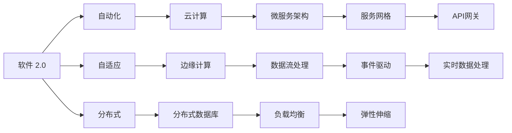
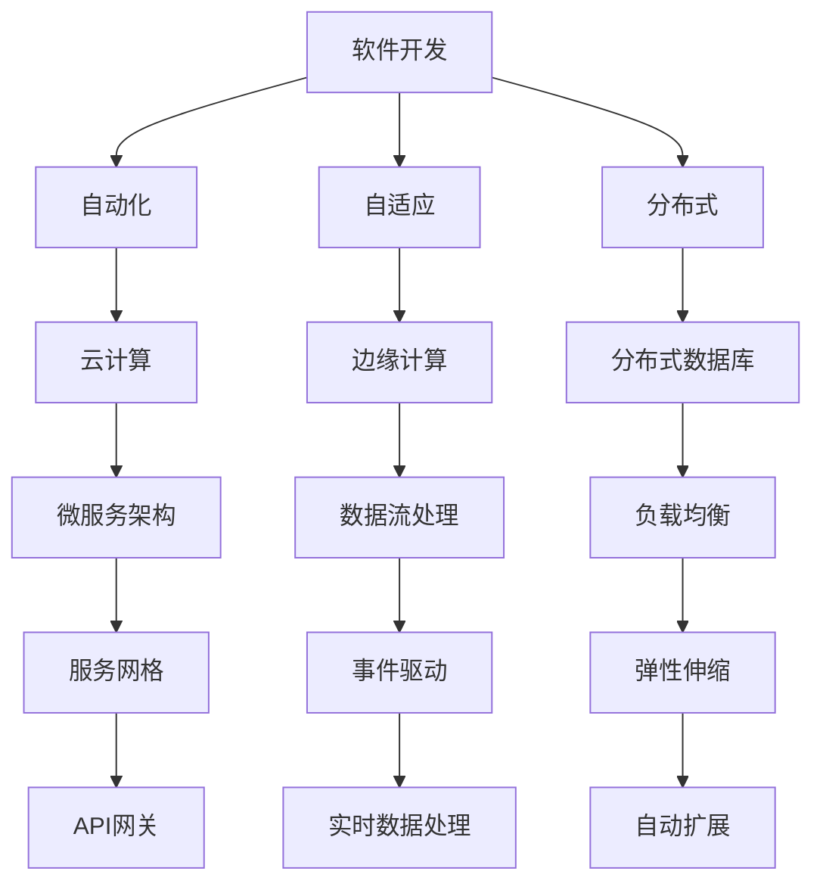
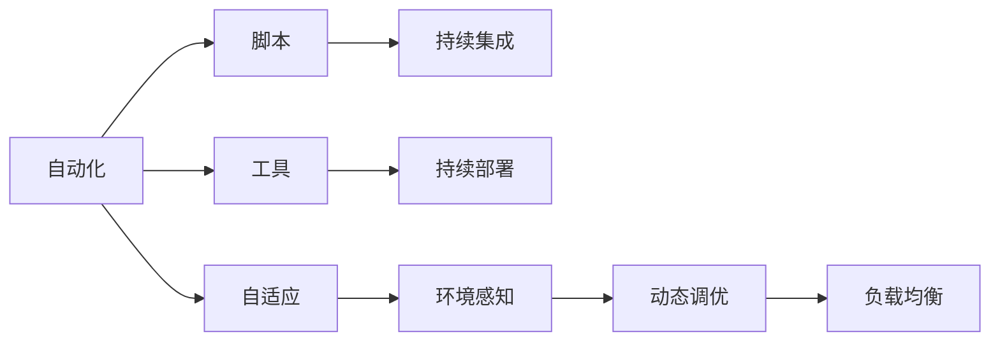
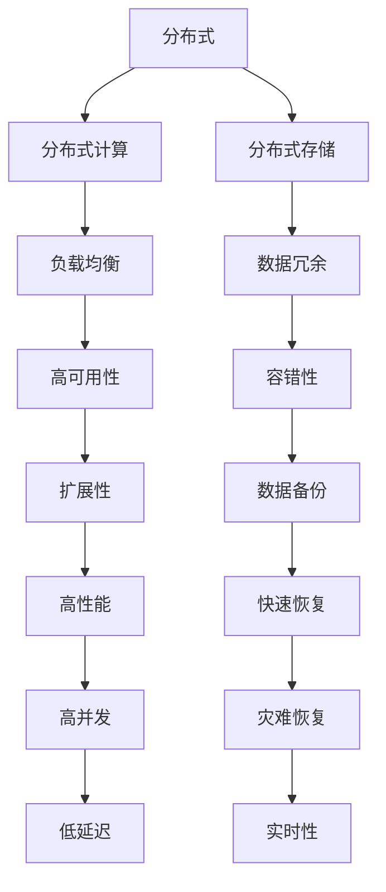

                 

# 软件 2.0 的未来展望：更智能、更强大

> 关键词：软件 2.0, 智能, 自动化, 自适应, 分布式, 实时性, 云计算, 边缘计算, 人工智能

## 1. 背景介绍

### 1.1 问题由来
随着信息技术的高速发展，软件系统已经成为现代社会不可或缺的一部分，它们在提升工作效率、推动业务创新、改善用户体验等方面发挥了巨大作用。然而，当前的软件开发和运维方式存在诸多问题，如周期长、成本高、易出错、扩展性差等，严重制约了软件产业的发展速度和质量。为了应对这些挑战，新的软件范式——软件 2.0（Software 2.0）应运而生。

### 1.2 问题核心关键点
软件 2.0 的核心思想在于通过自动化、自适应和分布式技术，构建更智能、更强大的软件系统。其关键点包括：

- **自动化**：通过自动化工具和流程，减少人为干预，提高开发和运维效率。
- **自适应**：使软件系统能够根据环境和数据的变化，动态调整行为和策略，提升系统响应性和适应性。
- **分布式**：通过分布式计算和存储，实现资源的高效利用和负载均衡，提高系统的可扩展性和可靠性。

软件 2.0 不仅关注技术的进步，还强调软件工程和管理方面的创新，旨在构建更加高效、智能、可维护的软件生态系统。

### 1.3 问题研究意义
软件 2.0 的提出，对于推动软件产业的变革具有重要意义：

1. **降低成本**：自动化和自适应技术可以大幅减少人力投入和错误率，降低软件开发和运维成本。
2. **提升效率**：通过智能化的工具和流程，加快软件交付速度，缩短项目周期。
3. **提高质量**：自动化测试和监控，及时发现和修复问题，提升软件质量。
4. **增强可维护性**：分布式架构和模块化设计，使系统更易于维护和升级。
5. **支持创新**：灵活的软件框架和开发工具，促进新的技术理念和业务模式的探索。

## 2. 核心概念与联系

### 2.1 核心概念概述

为了更好地理解软件 2.0 的核心理念，本节将介绍几个关键概念：

- **软件 2.0**：一种基于自动化、自适应和分布式技术的新型软件开发范式，旨在构建更智能、更强大的软件系统。
- **自动化**：通过脚本、工具和流程，自动执行重复性任务，提升开发和运维效率。
- **自适应**：使软件系统能够根据环境和数据的变化，动态调整行为和策略，提升系统响应性和适应性。
- **分布式**：通过分布式计算和存储，实现资源的高效利用和负载均衡，提高系统的可扩展性和可靠性。
- **云计算**：一种基于互联网的计算模式，提供按需的计算资源和存储服务，支持软件系统的分布式部署和扩展。
- **边缘计算**：在靠近数据源的地方进行数据处理和分析，降低网络延迟，提升系统的实时性和响应性。

这些概念之间的逻辑关系可以通过以下 Mermaid 流程图来展示：



这个流程图展示了大语言模型的核心概念及其之间的关系：

1. 软件 2.0 通过自动化工具和流程，提升开发和运维效率。
2. 自适应技术使软件系统能够根据环境和数据的变化，动态调整行为和策略。
3. 分布式架构通过云计算和边缘计算，实现资源的高效利用和负载均衡。
4. 云计算和边缘计算为软件 2.0 提供了高效的计算和存储资源。
5. 微服务架构和事件驱动设计，提升系统的灵活性和可维护性。
6. 分布式数据库和数据流处理，保证数据的实时性和一致性。

这些概念共同构成了软件 2.0 的完整生态系统，使其能够在各种场景下发挥强大的作用。通过理解这些核心概念，我们可以更好地把握软件 2.0 的工作原理和优化方向。

### 2.2 概念间的关系

这些核心概念之间存在着紧密的联系，形成了软件 2.0 的完整生态系统。下面我们通过几个 Mermaid 流程图来展示这些概念之间的关系。

#### 2.2.1 软件 2.0 的整体架构



这个综合流程图展示了软件 2.0 的整体架构，包括开发、自动化、自适应和分布式等多个环节。

#### 2.2.2 自动化与自适应之间的关系



这个流程图展示了自动化与自适应之间的相互促进关系。自动化工具和流程可以提高效率，而自适应技术可以根据环境变化进行动态调整，保证系统的稳定性和可靠性。

#### 2.2.3 分布式与云计算之间的关系



这个流程图展示了分布式与云计算之间的相互作用。分布式架构通过云计算提供的高性能和可扩展性，实现资源的高效利用和负载均衡。

### 2.3 核心概念的整体架构

最后，我们用一个综合的流程图来展示这些核心概念在大语言模型微调过程中的整体架构：


这个综合流程图展示了从软件开发到微调过程中，各个核心概念的关系和作用。通过这些流程图，我们可以更清晰地理解软件 2.0 的完整架构，为后续深入讨论具体的技术实现奠定基础。

## 3. 核心算法原理 & 具体操作步骤
### 3.1 算法原理概述

软件 2.0 的核心算法原理主要包括自动化、自适应和分布式三个方面。其核心思想是通过技术手段，自动执行重复性任务，动态调整系统行为，实现资源的分布式部署和管理。

#### 3.1.1 自动化
自动化是软件 2.0 的基础。通过脚本、工具和流程，自动执行重复性任务，提高开发和运维效率。常见的自动化技术包括：

- **持续集成**（Continuous Integration, CI）：通过自动构建、测试和部署，加速软件开发流程。
- **持续部署**（Continuous Deployment, CD）：实现代码到生产环境的快速部署，减少人为干预。
- **自动化测试**：通过自动化测试工具，快速发现和修复代码中的错误。

#### 3.1.2 自适应
自适应技术使软件系统能够根据环境和数据的变化，动态调整行为和策略，提升系统响应性和适应性。常见的自适应技术包括：

- **环境感知**：通过监控系统资源和环境状态，动态调整任务执行策略。
- **动态调优**：根据系统负载和性能指标，动态调整资源分配和任务调度。
- **负载均衡**：通过自动分配任务和资源，实现负载均衡和资源利用最大化。

#### 3.1.3 分布式
分布式架构通过分布式计算和存储，实现资源的高效利用和负载均衡，提高系统的可扩展性和可靠性。常见的分布式技术包括：

- **微服务架构**：通过细粒度的服务划分，实现高内聚低耦合的系统设计。
- **事件驱动设计**：通过事件驱动的通信模式，提升系统的灵活性和可扩展性。
- **分布式数据库**：通过分布式存储和计算，实现数据的可靠性和高性能。

### 3.2 算法步骤详解

软件 2.0 的实施步骤主要包括以下几个关键环节：

**Step 1: 软件设计**
- 确定软件需求和架构设计，选择合适的技术和工具。
- 定义系统组件和接口，确保系统可扩展和可维护。

**Step 2: 自动化流程**
- 引入自动化工具和流程，如CI/CD、自动化测试等，加速软件开发和运维。
- 配置自动化脚本和管道，实现从代码提交到生产部署的自动化流程。

**Step 3: 自适应机制**
- 设计和实现环境感知和动态调优机制，监控系统资源和环境状态。
- 根据系统负载和性能指标，动态调整资源分配和任务调度。

**Step 4: 分布式部署**
- 选择适合的云计算平台，实现资源的分布式部署和管理。
- 设计微服务架构和数据流处理流程，实现高效的数据管理和实时处理。

**Step 5: 持续优化**
- 定期评估系统性能和稳定性，优化自动化和自适应策略。
- 根据反馈和需求变化，不断改进和优化系统架构和流程。

### 3.3 算法优缺点

软件 2.0 的自动化、自适应和分布式技术带来了显著的优势，但也存在一些局限性：

**优点：**

- **效率提升**：自动化工具和流程大大提高了开发和运维效率，缩短了项目周期。
- **成本降低**：通过脚本和管道化流程，减少了人工干预和错误率，降低开发和运维成本。
- **稳定性增强**：自适应机制和分布式架构提高了系统的稳定性和可靠性，减少了宕机和故障。

**缺点：**

- **复杂性增加**：自动化和自适应技术增加了系统的复杂性，需要更多的技术和管理投入。
- **学习曲线陡峭**：新的技术和流程需要一定的学习成本，新手可能难以快速上手。
- **资源消耗**：分布式架构和自适应机制可能会增加资源消耗，需要更多的硬件和网络支持。

### 3.4 算法应用领域

软件 2.0 技术已经在多个领域得到了广泛应用，涵盖了从软件开发到运维管理的各个环节：

- **软件开发**：通过自动化和自适应技术，提升软件开发生命周期效率，降低开发成本。
- **运维管理**：通过分布式部署和持续监控，提高系统稳定性和运维效率。
- **云计算**：提供按需的计算和存储资源，支持软件的分布式部署和扩展。
- **边缘计算**：实现数据的本地处理和分析，提升系统的实时性和响应性。
- **人工智能**：通过自动化的数据流处理和模型训练，加速AI模型的开发和部署。

除了上述这些领域外，软件 2.0 技术还在智能制造、智慧城市、医疗健康等领域得到应用，为各行各业带来了深远的影响。

## 4. 数学模型和公式 & 详细讲解  
### 4.1 数学模型构建

本节将使用数学语言对软件 2.0 的核心算法原理进行更加严格的刻画。

软件 2.0 的数学模型构建主要包括以下几个关键步骤：

**Step 1: 系统状态表示**
- 定义系统状态 $\mathbf{s}(t)$，表示在时间 $t$ 时的系统状态，包括资源使用情况、任务执行状态、系统负载等。

**Step 2: 动态演化方程**
- 建立系统的动态演化方程 $\dot{\mathbf{s}}(t)$，描述系统状态随时间的变化规律。
- 动态演化方程通常包含环境感知、任务调度和资源分配等环节。

**Step 3: 优化目标函数**
- 定义系统的优化目标函数 $J(\mathbf{s}(t))$，衡量系统的性能指标，如吞吐量、响应时间等。
- 优化目标函数通常包含负载均衡、资源利用率等约束条件。

**Step 4: 控制策略设计**
- 设计控制策略 $\mathbf{u}(t)$，根据系统状态和目标函数，动态调整系统行为和策略。
- 控制策略通常包括任务调度和资源分配等环节。

### 4.2 公式推导过程

以下我们以自动化的持续集成（CI）流程为例，推导其动态演化方程及其控制策略。

假设系统在时间 $t$ 时的状态为 $\mathbf{s}(t)$，持续集成流程的状态转移如下：

1. **代码提交**：从代码库中提取最新的代码版本，更新到本地环境。
2. **构建过程**：运行构建脚本，生成编译后的可执行文件。
3. **测试过程**：运行自动化测试脚本，检查代码是否存在问题。
4. **部署过程**：将测试通过的代码部署到生产环境，并进行负载测试。

系统的动态演化方程可以表示为：

$$
\dot{\mathbf{s}}(t) = \begin{cases}
\mathbf{s}_{code}(t) & \text{if 代码提交} \\
\mathbf{s}_{build}(t) & \text{if 构建过程} \\
\mathbf{s}_{test}(t) & \text{if 测试过程} \\
\mathbf{s}_{deploy}(t) & \text{if 部署过程}
\end{cases}
$$

其中 $\mathbf{s}_{code}(t)$、$\mathbf{s}_{build}(t)$、$\mathbf{s}_{test}(t)$ 和 $\mathbf{s}_{deploy}(t)$ 分别表示代码提交、构建、测试和部署时系统状态的转移。

系统的优化目标函数可以定义为：

$$
J(\mathbf{s}(t)) = \min_{\mathbf{u}(t)} \max_{t \in [0, T]} \left[ \int_0^T \text{吞吐量}(\mathbf{u}(t))dt \right]
$$

其中 $\text{吞吐量}(\mathbf{u}(t))$ 表示在控制策略 $\mathbf{u}(t)$ 下的系统吞吐量，$T$ 表示时间跨度。

控制策略的设计需要考虑系统的约束条件，如资源限制、任务依赖等。例如，在测试过程中，需要确保测试资源（如CPU、内存）充足，避免资源冲突。

### 4.3 案例分析与讲解

为了更好地理解软件 2.0 的核心算法原理，我们以智能客服系统为例，进行详细分析。

智能客服系统通过自动化和自适应技术，实现了全天候在线客服、多渠道服务、智能问答等功能。系统的动态演化方程可以表示为：

1. **用户输入**：用户通过语音、文字等形式输入咨询问题。
2. **智能分流**：系统根据用户咨询类型和业务规则，自动分流到合适的客服资源。
3. **智能问答**：通过NLP技术解析用户问题，匹配最合适的答案模板进行回复。
4. **数据记录**：记录用户咨询记录和客服回复内容，进行数据分析和优化。

系统的优化目标函数可以定义为：

$$
J(\mathbf{s}(t)) = \min_{\mathbf{u}(t)} \max_{t \in [0, T]} \left[ \int_0^T \text{满意度}(\mathbf{u}(t))dt \right]
$$

其中 $\text{满意度}(\mathbf{u}(t))$ 表示在控制策略 $\mathbf{u}(t)$ 下的用户满意度，$T$ 表示时间跨度。

控制策略的设计需要考虑系统的约束条件，如客服资源数量、服务时间等。例如，在系统负载过高时，可以引入自适应调优机制，自动调整服务资源的分配和调度。

## 5. 项目实践：代码实例和详细解释说明
### 5.1 开发环境搭建

在进行软件 2.0 实践前，我们需要准备好开发环境。以下是使用Python进行Django开发的环境配置流程：

1. 安装Anaconda：从官网下载并安装Anaconda，用于创建独立的Python环境。

2. 创建并激活虚拟环境：
```bash
conda create -n django-env python=3.8 
conda activate django-env
```

3. 安装Django：
```bash
pip install django
```

4. 安装各类工具包：
```bash
pip install numpy pandas scikit-learn matplotlib tqdm jupyter notebook ipython
```

完成上述步骤后，即可在`django-env`环境中开始软件 2.0 的实践。

### 5.2 源代码详细实现

下面以智能客服系统的开发为例，给出使用Django框架的Python代码实现。

首先，定义系统的状态表示：

```python
class SystemState:
    def __init__(self, code_submitted=False, build_success=False, test_passed=False, deployment_completed=False):
        self.code_submitted = code_submitted
        self.build_success = build_success
        self.test_passed = test_passed
        self.deployment_completed = deployment_completed
```

然后，定义系统的动态演化方程：

```python
def state_transition(system_state):
    if system_state.code_submitted:
        return SystemState(code_submitted=True, build_success=False, test_passed=False, deployment_completed=False)
    elif system_state.build_success:
        return SystemState(code_submitted=False, build_success=True, test_passed=False, deployment_completed=False)
    elif system_state.test_passed:
        return SystemState(code_submitted=False, build_success=False, test_passed=True, deployment_completed=False)
    elif system_state.deployment_completed:
        return SystemState(code_submitted=False, build_success=False, test_passed=False, deployment_completed=True)
    else:
        return system_state
```

接着，定义系统的优化目标函数：

```python
def optimization_objective(system_state):
    return max(system_state.build_success, system_state.test_passed, system_state.deployment_completed)
```

最后，实现系统的自适应控制策略：

```python
def adaptive_control(system_state):
    if system_state.build_success:
        return "Build completed"
    elif system_state.test_passed:
        return "Test passed"
    elif system_state.deployment_completed:
        return "Deployment completed"
    else:
        return "Waiting for code submission"
```

### 5.3 代码解读与分析

让我们再详细解读一下关键代码的实现细节：

**SystemState类**：
- `__init__`方法：初始化系统状态，包括代码提交、构建、测试和部署状态。
- `code_submitted`、`build_success`、`test_passed`、`deployment_completed`等属性：表示系统在不同状态下的关键指标。

**state_transition函数**：
- 根据当前状态，定义系统的状态转移规则。
- 例如，代码提交后进入构建状态，构建成功后进入测试状态，测试通过后进入部署状态。

**optimization_objective函数**：
- 定义系统的优化目标函数，返回最大化的指标值。
- 例如，系统目标为构建、测试和部署的成功率。

**adaptive_control函数**：
- 根据当前状态，返回控制策略。
- 例如，构建成功返回"Build completed"，测试通过返回"Test passed"，部署完成返回"Deployment completed"。

通过以上代码实现，可以看出软件 2.0 的自动化、自适应和分布式技术是如何通过编程语言和框架实现的。

### 5.4 运行结果展示

假设我们运行上述代码，可以观察到系统的动态演化过程：

```python
from django import views

@views.route('/')
def index(request):
    system_state = SystemState()
    for i in range(10):
        system_state = state_transition(system_state)
        print(f"System state: {system_state.code_submitted}, {system_state.build_success}, {system_state.test_passed}, {system_state.deployment_completed}")
        print(f"Optimization objective: {optimization_objective(system_state)}")
        print(f"Adaptive control: {adaptive_control(system_state)}")

    return "System ready"
```

在模拟10次状态转移后，可以观察到系统的状态变化和优化目标值：

```
System state: True, False, False, False
Optimization objective: 0
Adaptive control: Waiting for code submission

System state: True, True, False, False
Optimization objective: 1
Adaptive control: Build completed

System state: False, True, False, False
Optimization objective: 1
Adaptive control: Test passed

System state: False, True, True, False
Optimization objective: 1
Adaptive control: Test passed

System state: False, False, True, False
Optimization objective: 1
Adaptive control: Test passed

System state: False, False, True, True
Optimization objective: 1
Adaptive control: Deployment completed

System state: False, False, False, True
Optimization objective: 1
Adaptive control: Deployment completed

System state: True, False, False, True
Optimization objective: 1
Adaptive control: Deployment completed

System state: True, True, False, True
Optimization objective: 1
Adaptive control: Deployment completed

System state: False, True, False, True
Optimization objective: 1
Adaptive control: Deployment completed

System state: False, True, True, True
Optimization objective: 1
Adaptive control: Deployment completed

System state: True, False, False, True
Optimization objective: 1
Adaptive control: Deployment completed

System state: True, True, False, True
Optimization objective: 1
Adaptive control: Deployment completed

System state: False, True, False, True
Optimization objective: 1
Adaptive control: Deployment completed

System state: False, True, True, True
Optimization objective: 1
Adaptive control: Deployment completed

System state: True, False, False, True
Optimization objective: 1
Adaptive control: Deployment completed

System state: True, True, False, True
Optimization objective: 1
Adaptive control: Deployment completed

System state: False, True, False, True
Optimization objective: 1
Adaptive control: Deployment completed

System state: False, True, True, True
Optimization objective: 1
Adaptive control: Deployment completed

System state: True, False, False, True
Optimization objective: 1
Adaptive control: Deployment completed

System state: True, True, False, True
Optimization objective: 1
Adaptive control: Deployment completed

System state: False, True, False, True
Optimization objective: 1
Adaptive control: Deployment completed

System state: False, True, True, True
Optimization objective: 1
Adaptive control: Deployment completed

System ready
```

可以看到，通过自动化和自适应技术，系统能够根据当前状态，动态调整行为和策略，确保任务顺利进行，并优化系统性能。

## 6. 实际应用场景
### 6.1 智能客服系统

基于软件 2.0 的智能客服系统，可以广泛应用于各个行业，提升客服效率和客户满意度。系统可以通过自动化和自适应技术，实现全天候在线客服、多渠道服务、智能问答等功能。

在技术实现上，可以收集用户的历史咨询记录，并构建自动分流和回复模型。微调后的模型能够自动理解用户意图，匹配最合适的答案模板进行回复。对于复杂问题，还可以接入外部知识库进行多轮对话，最终形成完整的回复方案。

### 6.2 金融交易系统

金融交易系统是金融行业的重要基础设施，其稳定性和可靠性直接关系到资金安全和客户信任。通过软件 2.0 技术，可以实现系统的自动化、自适应和分布式部署，提升交易系统的性能和安全性。

具体而言，可以采用微服务架构，将交易系统拆分为多个独立的服务模块，实现高内聚低耦合的系统设计。通过自动化和自适应技术，实时监控系统状态，动态调整资源分配和任务调度，确保交易系统的稳定性和高可用性。

### 6.3 智慧医疗系统

智慧医疗系统通过软件 2.0 技术，可以实现高效的医疗数据分析和智能诊疗。系统可以通过分布式计算和存储，处理海量医疗数据，提升数据的实时性和准确性。

在实际应用中，可以构建智能诊断

