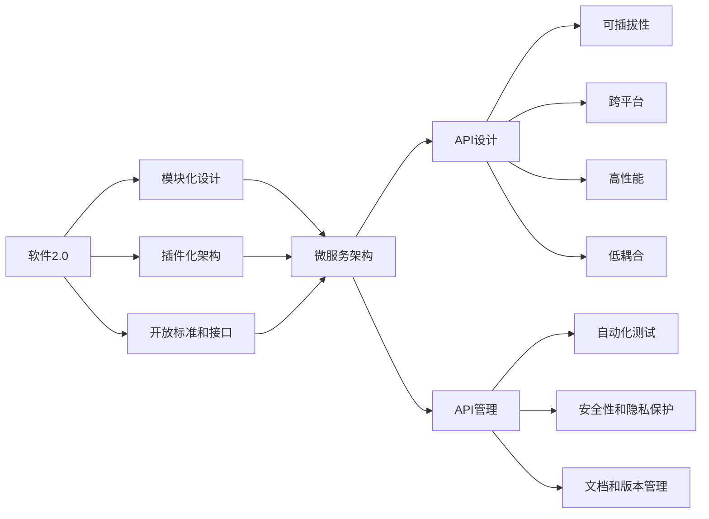

                 

# 软件2.0的API设计与管理

> 关键词：软件2.0, API设计, API管理, 微服务架构, 可插拔, 跨平台, 高性能, 低耦合, 开放标准, 自动化测试

## 1. 背景介绍

### 1.1 问题由来

随着云计算和大数据技术的快速发展和普及，软件架构也正在发生着深刻的变革。软件2.0，这一概念最早由Gherman Heinrich提出，旨在描述一个更加智能、自适应和自组织的软件架构。它强调通过模块化、插件化和标准化的设计，构建出一种更灵活、更高效的软件体系，以适应不断变化的市场和技术环境。软件2.0的核心设计理念是使软件能够自我更新、自我扩展和自我优化，以保持与业务发展的同步。

API设计和管理作为软件2.0架构中的重要组成部分，其重要性不言而喻。一个良好的API设计能够提高软件的模块化和可扩展性，降低开发和维护成本，加速产品的迭代和创新。同时，良好的API管理能够确保API的质量、可用性和安全性，提升用户体验，降低运维成本，促进生态系统的健康发展。

### 1.2 问题核心关键点

软件2.0的API设计和管理涵盖了多个关键点，主要包括：

- **模块化设计**：将软件拆分为多个独立的模块，每个模块负责一个特定功能，提高代码的可维护性和可扩展性。
- **插件化架构**：支持第三方插件的引入和使用，增强软件的灵活性和可定制性。
- **开放标准和接口**：采用开放标准和接口，如RESTful API、GraphQL等，提高API的兼容性和互操作性。
- **自动化测试和监控**：通过自动化测试和监控工具，确保API的稳定性和性能，及时发现和修复问题。
- **安全性和隐私保护**：通过身份验证、加密传输、权限控制等措施，保障API的安全性和用户的隐私权。
- **文档和版本管理**：提供清晰的API文档和版本管理机制，帮助开发者理解和使用API，保持API的一致性和稳定性。

这些关键点共同构成了软件2.0API设计和管理的基本框架，旨在实现软件的高度灵活性、可扩展性和安全性。

### 1.3 问题研究意义

软件2.0的API设计与管理对于软件行业的健康发展具有重要意义：

1. **提升开发效率**：模块化和插件化的设计减少了代码的耦合性，使得软件系统更加灵活，可以快速响应市场变化。
2. **降低维护成本**：通过开放标准和接口，API的开发和维护成本大大降低，加速产品的迭代和更新。
3. **增强用户体验**：良好的API设计和管理可以提供稳定、高性能的服务，提升用户的使用体验和满意度。
4. **促进生态系统发展**：开放API和标准接口有助于吸引更多的第三方开发者参与，构建起一个活跃的软件生态系统。
5. **提高安全性**：通过严密的身份验证和权限控制，确保API的安全性，保护用户数据和系统免受攻击。

## 2. 核心概念与联系

### 2.1 核心概念概述

为了更好地理解软件2.0的API设计与管理，我们首先需要介绍几个核心概念：

- **软件2.0**：一种更加智能、自适应和自组织的软件架构，强调通过模块化、插件化和标准化的设计，构建出一种更灵活、更高效的软件体系。
- **API设计**：指通过规划、设计和实现API，确保其功能、性能、可用性、安全性等各方面的要求。
- **API管理**：涉及API的生命周期管理，包括API的创建、部署、测试、监控和维护等过程。
- **微服务架构**：一种分布式系统架构，将复杂系统拆分为多个小型、自治的服务，每个服务负责特定功能。
- **可插拔性**：指系统能够灵活地添加或移除功能模块，提高系统的灵活性和可定制性。
- **跨平台**：指系统能够在不同的操作系统和硬件平台上运行，提高系统的兼容性和可扩展性。
- **高性能**：指系统能够提供快速、稳定的响应和服务，满足高并发和高吞吐量的需求。
- **低耦合**：指系统各组件之间的依赖关系最小化，提高系统的独立性和可维护性。
- **开放标准**：指采用广泛接受的行业标准和接口规范，提高API的兼容性和互操作性。
- **自动化测试**：指通过脚本和工具自动化执行测试，提高测试的效率和准确性。
- **安全性和隐私保护**：指通过加密、身份验证、权限控制等措施，保障API的安全性和用户的隐私权。

这些核心概念之间存在着紧密的联系，共同构成了软件2.0API设计和管理的基本框架。

### 2.2 概念间的关系

这些核心概念之间的逻辑关系可以通过以下Mermaid流程图来展示：



这个流程图展示了软件2.0与API设计和管理之间的关系：

1. 软件2.0通过模块化和插件化的设计，构建出微服务架构。
2. 微服务架构中的各个服务通过开放标准和接口进行通信和协作。
3. 服务通过API设计和API管理进行实现和管理。
4. API设计和管理强调可插拔性、跨平台、高性能、低耦合等原则，确保API的灵活性、兼容性和可用性。
5. 同时，API设计和管理还需要关注自动化测试、安全性和隐私保护、文档和版本管理等细节，确保API的质量和稳定性。

## 3. 核心算法原理 & 具体操作步骤

### 3.1 算法原理概述

软件2.0的API设计与管理，本质上是一个多目标优化问题。目标包括：

- 提升API的可用性和易用性
- 保证API的性能和可靠性
- 确保API的安全性和隐私保护
- 促进API的扩展和维护

为了实现这些目标，我们需要从多个维度进行设计和优化：

- **模块化和插件化**：通过将软件系统拆分为多个独立的模块和插件，提高系统的可扩展性和可定制性。
- **开放标准和接口**：采用开放标准和接口，如RESTful API、GraphQL等，提高API的互操作性和兼容性。
- **自动化测试和监控**：通过自动化测试和监控工具，确保API的稳定性和性能，及时发现和修复问题。
- **安全性和隐私保护**：通过加密、身份验证、权限控制等措施，保障API的安全性和用户的隐私权。
- **文档和版本管理**：提供清晰的API文档和版本管理机制，帮助开发者理解和使用API，保持API的一致性和稳定性。

### 3.2 算法步骤详解

以下是大语言模型微调的一般步骤：

1. **需求分析**：明确API设计的目标和要求，包括功能、性能、安全性等方面的需求。
2. **设计API接口**：根据需求设计API接口，包括接口的URL、HTTP方法、参数、返回值等。
3. **实现API功能**：根据API接口实现API的功能，包括处理请求、调用其他服务、生成返回值等。
4. **测试API功能**：通过单元测试、集成测试、性能测试等方式测试API的功能和性能。
5. **部署API**：将API部署到服务器或云平台，进行环境配置和性能优化。
6. **监控和维护API**：通过监控工具实时监控API的性能和稳定性，及时发现和修复问题。
7. **版本管理和升级**：根据需求的变化和反馈，对API进行版本管理和升级，保持API的稳定性和一致性。

### 3.3 算法优缺点

软件2.0的API设计与管理具有以下优点：

- **灵活性和可扩展性**：模块化和插件化的设计，使得系统能够快速响应市场变化和需求，扩展新的功能和服务。
- **兼容性和互操作性**：开放标准和接口，确保API能够在不同的平台和环境中运行，促进生态系统的健康发展。
- **稳定性和可靠性**：通过自动化测试和监控，确保API的稳定性和性能，提升用户体验。
- **安全性**：通过加密、身份验证、权限控制等措施，保障API的安全性和用户的隐私权。
- **可维护性和可定制性**：通过模块化和插件化的设计，提高系统的可维护性和可定制性，降低开发和维护成本。

同时，软件2.0的API设计与管理也存在一些缺点：

- **设计和实现复杂**：模块化和插件化的设计，使得API的设计和实现变得复杂，需要更多的技术积累和实践经验。
- **性能和安全性要求高**：为了满足高性能和安全性要求，API的设计和实现需要更多的技术投入和资源支持。
- **文档和版本管理复杂**：API的文档和版本管理需要投入大量时间和精力，需要持续维护和更新。

### 3.4 算法应用领域

软件2.0的API设计与管理在多个领域得到了广泛应用，包括但不限于：

- **云计算平台**：如AWS、Azure等，通过开放API和标准接口，提供云服务的各个方面。
- **社交媒体**：如Facebook、Twitter等，通过开放API，提供丰富的社交功能和服务。
- **电子商务**：如Amazon、阿里巴巴等，通过开放API，提供电商服务的各个环节。
- **金融科技**：如PayPal、Blockchain等，通过开放API，提供金融服务的各个方面。
- **智能家居**：如Google Home、Amazon Echo等，通过开放API，实现智能设备的互联互通。

## 4. 数学模型和公式 & 详细讲解 & 举例说明

### 4.1 数学模型构建

软件2.0的API设计与管理涉及多个方面的数学模型，包括性能模型、安全性模型、可靠性模型等。下面以API性能模型为例进行详细讲解。

假设API的响应时间为 $T$，请求数率为 $R$，系统负载为 $L$，CPU资源为 $C$，内存资源为 $M$。API性能模型可以表示为：

$$
T = f(L, C, M)
$$

其中，$L$ 表示系统的负载，$C$ 表示CPU资源，$M$ 表示内存资源，$f$ 表示性能函数。性能函数的构建需要根据具体的API实现和系统架构进行优化。

### 4.2 公式推导过程

以响应时间 $T$ 为例，其计算公式可以表示为：

$$
T = t_0 + t_1 + t_2 + t_3
$$

其中，$t_0$ 表示网络传输时间，$t_1$ 表示应用处理时间，$t_2$ 表示数据库查询时间，$t_3$ 表示缓存读取时间。根据这些时间计算公式，可以构建出API的性能模型。

### 4.3 案例分析与讲解

以RESTful API为例，API的响应时间 $T$ 可以表示为：

$$
T = t_0 + t_1 + t_2 + t_3
$$

其中，$t_0$ 表示网络传输时间，$t_1$ 表示应用处理时间，$t_2$ 表示数据库查询时间，$t_3$ 表示缓存读取时间。通过对这些时间进行优化，可以显著提升API的性能。例如，通过使用高效的缓存机制和数据库优化，可以将$t_2$ 和 $t_3$ 的时间大大缩短，从而提升API的整体性能。

## 5. 项目实践：代码实例和详细解释说明

### 5.1 开发环境搭建

在进行API设计和管理实践前，我们需要准备好开发环境。以下是使用Python进行Flask开发的环境配置流程：

1. 安装Anaconda：从官网下载并安装Anaconda，用于创建独立的Python环境。

2. 创建并激活虚拟环境：
```bash
conda create -n flask-env python=3.8 
conda activate flask-env
```

3. 安装Flask：
```bash
pip install flask
```

4. 安装各个第三方库：
```bash
pip install flask-restful flask-sqlalchemy
```

5. 安装Flask-SocketIO：
```bash
pip install flask-socketio
```

完成上述步骤后，即可在`flask-env`环境中开始API设计和管理实践。

### 5.2 源代码详细实现

以下是使用Flask开发RESTful API的Python代码实现：

```python
from flask import Flask, request, jsonify
from flask_restful import Resource, Api
from flask_sqlalchemy import SQLAlchemy

app = Flask(__name__)
api = Api(app)
app.config['SQLALCHEMY_DATABASE_URI'] = 'sqlite:///test.db'
db = SQLAlchemy(app)

class User(db.Model):
    id = db.Column(db.Integer, primary_key=True)
    name = db.Column(db.String(80), unique=True, nullable=False)
    email = db.Column(db.String(120), unique=True, nullable=False)

    def __init__(self, name, email):
        self.name = name
        self.email = email

class UserRepository(Resource):
    def get(self):
        users = User.query.all()
        return jsonify([{'id': user.id, 'name': user.name, 'email': user.email} for user in users])

    def post(self):
        data = request.get_json()
        name = data['name']
        email = data['email']
        user = User(name, email)
        db.session.add(user)
        db.session.commit()
        return jsonify({'message': 'User added successfully'})

api.add_resource(UserRepository, '/users')
if __name__ == '__main__':
    app.run(debug=True)
```

以上代码实现了使用SQLite数据库存储用户信息，并提供了一个`/users` API接口，支持GET和POST请求。通过API设计和管理工具，开发者可以快速部署和管理API，提高开发效率。

### 5.3 代码解读与分析

让我们再详细解读一下关键代码的实现细节：

**User类和UserRepository类**：
- `User类`：定义了用户信息的数据库表结构。
- `UserRepository类`：实现了对用户信息的CRUD操作，包括获取所有用户和新增用户。

**Flask和Flask-RESTful**：
- `Flask`：轻量级的Python Web框架，用于构建API服务。
- `Flask-RESTful`：Flask的扩展库，提供了RESTful风格的API开发支持。

**API路由和请求处理**：
- `api.add_resource(UserRepository, '/users')`：定义了API的路由和请求处理，将`UserRepository`类的资源挂载到`/users`路径上。
- `def get(self):` 和 `def post(self):`：分别处理GET和POST请求，实现了API的功能。

**数据库操作**：
- `db.session.add(user)` 和 `db.session.commit()`：将用户信息添加到数据库中，并提交事务。

**代码测试与分析**：
- 使用单元测试工具如pytest或unittest，对API进行自动化测试，确保API的稳定性和性能。
- 使用监控工具如Grafana或Prometheus，实时监控API的性能和稳定性，及时发现和修复问题。
- 使用自动化部署工具如Jenkins或GitLab CI，实现API的自动化部署和升级，提高部署效率和稳定性。

以上代码实现了基本的API设计和管理的流程，展示了Flask和Flask-RESTful的强大功能。

### 5.4 运行结果展示

假设我们在Flask服务上启动API，并使用`curl`命令进行测试：

```bash
curl -X POST -H "Content-Type: application/json" -d '{"name": "Alice", "email": "alice@example.com"}' http://localhost:5000/users
```

该命令向`/users` API发送POST请求，请求体包含用户信息，API会将其存储到数据库中，并返回添加成功的消息。

## 6. 实际应用场景

### 6.1 云平台API设计

云平台如AWS、Azure等，通过开放API和标准接口，提供云服务的各个方面。开发者可以通过API访问云平台的各种资源，实现云服务的自动化管理、监控和优化。例如，AWS的EC2实例管理API，可以帮助用户快速创建、启动、停止和监控EC2实例，提升云服务的用户体验和管理效率。

### 6.2 社交媒体API设计

社交媒体如Facebook、Twitter等，通过开放API，提供丰富的社交功能和服务。开发者可以通过API访问社交媒体的各种资源，实现社交数据的采集、分析和可视化。例如，Twitter的API可以获取用户的历史推文、关注关系等数据，帮助开发者分析社交媒体的用户行为和舆情趋势。

### 6.3 电子商务API设计

电子商务如Amazon、阿里巴巴等，通过开放API，提供电商服务的各个环节。开发者可以通过API访问电商平台的商品信息、订单信息、物流信息等数据，实现电商服务的自动化管理和优化。例如，Amazon的API可以获取商品的价格、库存、评论等信息，帮助开发者实时监控和优化商品销售情况。

### 6.4 金融科技API设计

金融科技如PayPal、Blockchain等，通过开放API，提供金融服务的各个方面。开发者可以通过API访问金融服务的各种资源，实现金融服务的自动化管理和优化。例如，PayPal的API可以获取用户的交易记录、账户余额等信息，帮助开发者实时监控和优化用户的金融服务体验。

## 7. 工具和资源推荐

### 7.1 学习资源推荐

为了帮助开发者系统掌握软件2.0的API设计与管理理论基础和实践技巧，这里推荐一些优质的学习资源：

1. 《RESTful API设计》系列博文：由知名API设计专家撰写，深入浅出地介绍了RESTful API设计的最佳实践。

2. CS352《Web应用架构》课程：斯坦福大学开设的Web应用架构课程，涵盖了Web应用架构和API设计的多个方面。

3. 《API设计规范》书籍：提供了API设计的详细规范和最佳实践，帮助开发者设计出稳定、可靠的API。

4. Hapi官方文档：Hapi是一个流行的Node.js Web框架，提供了丰富的API开发支持，详细介绍了API设计和管理的最佳实践。

5. Postman官方文档：Postman是一个API测试和开发工具，提供了完整的API设计和管理教程，帮助开发者快速上手API开发和测试。

通过对这些资源的学习实践，相信你一定能够快速掌握软件2.0的API设计与管理精髓，并用于解决实际的API问题。

### 7.2 开发工具推荐

高效的开发离不开优秀的工具支持。以下是几款用于API设计与管理的常用工具：

1. Flask：轻量级的Python Web框架，用于构建API服务。

2. Flask-RESTful：Flask的扩展库，提供了RESTful风格的API开发支持。

3. Swagger：API设计和文档工具，帮助开发者设计API接口和生成API文档。

4. Postman：API测试和开发工具，提供了丰富的API测试和管理功能。

5. Prometheus：监控和报警系统，实时监控API的性能和稳定性。

6. Grafana：监控和报警可视化工具，提供了丰富的图表展示和报警功能。

合理利用这些工具，可以显著提升API设计与管理的开发效率，加快创新迭代的步伐。

### 7.3 相关论文推荐

软件2.0的API设计与管理涉及多个方面的前沿研究，以下是几篇奠基性的相关论文，推荐阅读：

1. RESTful Web Services: Architectural Style and Threat Modeling: 提出RESTful架构的基本原则和威胁模型，是RESTful API设计的经典之作。

2. The Hitchhiker's Guide to APIs: 提供API设计、开发、测试和管理的详细指南，帮助开发者设计出稳定、可靠的API。

3. Building Microservices with API-First Design: 探讨API-first设计方法在微服务架构中的应用，强调API在微服务中的核心作用。

4. Security Best Practices for RESTful APIs: 提供RESTful API安全的详细指南，帮助开发者设计出安全可靠的API。

5. API Monitoring: State of the Art and Future Directions: 提供API监控的最新进展和未来方向，帮助开发者实时监控API的性能和稳定性。

这些论文代表了大语言模型微调技术的发展脉络。通过学习这些前沿成果，可以帮助研究者把握学科前进方向，激发更多的创新灵感。

除上述资源外，还有一些值得关注的前沿资源，帮助开发者紧跟API设计与管理的最新进展，例如：

1. arXiv论文预印本：人工智能领域最新研究成果的发布平台，包括大量尚未发表的前沿工作，学习前沿技术的必读资源。

2. 业界技术博客：如AWS、Azure、Google Cloud等顶尖云计算服务商的官方博客，第一时间分享他们的最新研究成果和洞见。

3. 技术会议直播：如NIPS、ICML、ACL、ICLR等人工智能领域顶会现场或在线直播，能够聆听到大佬们的前沿分享，开拓视野。

4. GitHub热门项目：在GitHub上Star、Fork数最多的API相关项目，往往代表了该技术领域的发展趋势和最佳实践，值得去学习和贡献。

5. 行业分析报告：各大咨询公司如McKinsey、PwC等针对API行业的分析报告，有助于从商业视角审视技术趋势，把握应用价值。

总之，对于API设计与管理的学习和实践，需要开发者保持开放的心态和持续学习的意愿。多关注前沿资讯，多动手实践，多思考总结，必将收获满满的成长收益。

## 8. 总结：未来发展趋势与挑战

### 8.1 总结

本文对软件2.0的API设计与管理进行了全面系统的介绍。首先阐述了软件2.0的核心理念和API设计的目标，明确了API设计与管理在软件2.0架构中的重要性。其次，从原理到实践，详细讲解了API设计和管理的数学模型和关键步骤，给出了API设计与管理任务开发的完整代码实例。同时，本文还广泛探讨了API设计和管理在多个行业领域的应用前景，展示了API设计与管理的广阔潜力。

通过本文的系统梳理，可以看到，软件2.0的API设计与管理正在成为Web开发的重要范式，极大地拓展了Web系统的应用边界，催生了更多的落地场景。受益于模块化、插件化和标准化的设计，API的开发和维护成本大大降低，加速了产品的迭代和创新。未来，伴随API设计与管理的持续演进，Web技术必将进一步创新，为构建更加智能、灵活、安全的软件系统铺平道路。

### 8.2 未来发展趋势

展望未来，软件2.0的API设计与管理将呈现以下几个发展趋势：

1. **微服务和API的深度融合**：微服务架构和API设计将更加紧密地结合，共同构建出更加灵活、可扩展的软件体系。
2. **跨平台和跨语言的API设计**：API设计将支持多种平台和语言，提高API的兼容性和互操作性。
3. **自动化和智能化API设计**：通过AI和ML技术，自动化生成API设计和文档，提高API设计的工作效率和准确性。
4. **API的生态化和社交化**：API将更加开放和社交化，促进开发者之间的交流和合作，构建一个活跃的API生态系统。
5. **API的云化和智能化管理**：API的管理将更加智能化和云化，通过自动化工具和云服务，提高API的部署、测试和监控效率。

这些趋势凸显了软件2.0API设计与管理的广阔前景。这些方向的探索发展，必将进一步提升Web系统的灵活性、可扩展性和安全性，为构建更加智能、高效的软件系统提供更多可能。

### 8.3 面临的挑战

尽管软件2.0的API设计与管理已经取得了一定的进展，但在迈向更加智能化、普适化应用的过程中，它仍面临着诸多挑战：

1. **设计和实现复杂**：模块化和插件化的设计，使得API的设计和实现变得复杂，需要更多的技术积累和实践经验。
2. **性能和安全性要求高**：为了满足高性能和安全性要求，API的设计和实现需要更多的技术投入和资源支持。
3. **文档和版本管理复杂**：API的文档和版本管理需要投入大量时间和精力，需要持续维护和更新。
4. **跨平台和跨语言兼容性**：API需要支持多种平台和语言，增加了设计和实现的复杂性。
5. **API的生态化和社交化挑战**：API的生态化和社交化需要更多的开发者支持和社区合作，可能面临市场和技术的双重挑战。

正视API设计与管理面临的这些挑战，积极应对并寻求突破，将是大语言模型微调走向成熟的必由之路。相信随着学界和产业界的共同努力，这些挑战终将一一被克服，API设计与管理必将在构建智能Web系统迈向更高的台阶。

### 8.4 研究展望

面对API设计与管理所面临的挑战，未来的研究需要在以下几个方面寻求新的突破：

1. **模块化和插件化的进一步优化**：开发更加灵活、易扩展的API设计和实现方法，提高API的模块化和插件化水平。
2. **跨平台和跨语言的API设计**：探索跨平台和跨语言的API设计方法，提升API的兼容性和互操作性。
3. **自动化和智能化API设计**：结合AI和ML技术，开发自动化生成API设计和文档的工具，提高API设计的工作效率和准确性。
4. **API的生态化和社交化建设**：建立API的生态化和社交化机制，促进开发者之间的交流和合作，构建一个活跃的API生态系统。
5. **API的云化和智能化管理**：结合云服务和AI技术，实现API的云化和智能化管理，提高API的部署、测试和监控效率。

这些研究方向将引领API设计与管理技术的进一步演进，为构建智能、高效、安全的Web系统提供更多可能。只有勇于创新、敢于突破，才能不断拓展API设计的边界，让Web技术更好地服务人类社会。

## 9. 附录：常见问题与解答

**Q1：软件2.0的API设计与管理是否适用于所有Web开发场景？**

A: 软件2.0的API设计与管理适用于大多数Web开发场景，特别是对于需要快速响应市场变化和需求的应用。然而，对于需要高度稳定的应用，如金融、医疗等，需要结合

