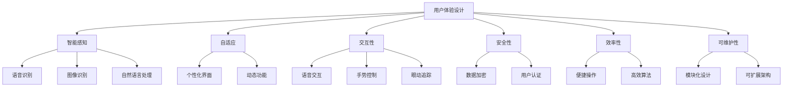
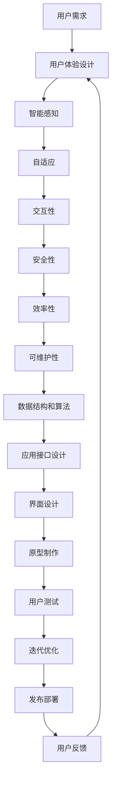

                 

# 软件2.0的用户体验设计原则

## 1. 背景介绍

### 1.1 问题由来
随着互联网的普及和技术的不断发展，软件行业正处于快速变革之中。特别是伴随着人工智能、大数据、云计算等新兴技术的应用，传统的软件形态和用户体验设计已经无法满足日益复杂和多变的用户需求。

然而，现有的用户体验设计规范和方法，大多基于Web和移动应用的实践，缺乏对于软件2.0时代新型应用场景的深入研究和指导。为适应这一新形势，本文将从用户体验设计的角度，探讨软件2.0时代的设计原则和方法，为开发者提供系统、科学的指导。

### 1.2 问题核心关键点
软件2.0时代，用户体验设计面临的挑战主要包括：
1. 智能化：软件需要具备更强的智能感知和响应能力，以适应复杂多变的用户需求。
2. 自适应：软件需要根据用户行为和环境变化自动调整界面和功能，提供个性化服务。
3. 交互性：软件需要具备更自然的交互方式，包括语音、手势、眼动等多种形式。
4. 安全性：软件需要保障用户数据和操作的安全，防止隐私泄露和恶意攻击。
5. 效率性：软件需要提供更高效的操作方式，减少用户的操作步骤和时间成本。
6. 可维护性：软件需要具备更灵活的架构和设计，便于未来迭代和维护。

针对这些挑战，本文将系统介绍软件2.0时代用户体验设计的核心理念和实践方法，以期为开发者提供全面的指导。

## 2. 核心概念与联系

### 2.1 核心概念概述

为更好地理解软件2.0时代用户体验设计的核心概念，本节将介绍几个关键概念及其相互关系：

- 用户体验设计(User Experience Design, UXD)：通过研究用户行为和心理，设计出满足用户需求、使用便捷、易学易用的产品界面和交互方式，提升用户满意度和使用体验。
- 智能感知(Smart Perception)：软件具备的自动感知和理解环境的能力，包括语音识别、图像识别、自然语言处理等。
- 自适应(Adaptive)：软件能够根据用户行为、环境变化自动调整界面和功能，提供个性化的服务。
- 交互性(Interactivity)：软件能够以更加自然、高效、丰富的交互方式响应用户操作，包括语音交互、手势控制、眼动追踪等。
- 安全性(Security)：软件具备的保护用户数据和操作安全的能力，防止隐私泄露和恶意攻击。
- 效率性(Efficiency)：软件提供的操作方式更加便捷、高效，减少用户操作步骤和时间成本。
- 可维护性(Maintainability)：软件具备灵活的架构和设计，便于未来的迭代和维护。

这些概念之间存在着紧密的联系，共同构成了软件2.0时代用户体验设计的完整生态系统。通过理解这些概念，我们能够更好地把握软件2.0时代的设计方向和实现方法。

### 2.2 概念间的关系

这些核心概念之间的关系可以通过以下Mermaid流程图来展示：



这个流程图展示了大语言模型微调过程中各个核心概念的关系：

1. 用户体验设计（A）是整个设计的核心，围绕用户需求进行设计。
2. 智能感知（B）通过语音、图像、自然语言处理等技术，提升软件的智能化水平。
3. 自适应（C）通过动态界面和功能调整，提供个性化服务。
4. 交互性（D）通过语音、手势、眼动等多种交互方式，提升用户体验。
5. 安全性（E）通过数据加密、用户认证等措施，保障用户安全。
6. 效率性（F）通过便捷操作、高效算法等手段，减少用户操作步骤和时间成本。
7. 可维护性（G）通过模块化设计和可扩展架构，便于未来的迭代和维护。

这些概念共同构成了软件2.0时代用户体验设计的完整生态系统，使得软件能够更好地满足用户需求，提供高质量的使用体验。

### 2.3 核心概念的整体架构

最后，我们用一个综合的流程图来展示这些核心概念在大语言模型微调过程中的整体架构：



这个综合流程图展示了从用户需求到发布部署的完整流程：

1. 用户需求（A）是设计的起点，通过用户体验设计（B）转化为设计方案。
2. 智能感知（C）通过语音、图像、自然语言处理等技术，提升软件的智能化水平。
3. 自适应（D）通过动态界面和功能调整，提供个性化服务。
4. 交互性（E）通过语音、手势、眼动等多种交互方式，提升用户体验。
5. 安全性（F）通过数据加密、用户认证等措施，保障用户安全。
6. 效率性（G）通过便捷操作、高效算法等手段，减少用户操作步骤和时间成本。
7. 可维护性（H）通过模块化设计和可扩展架构，便于未来的迭代和维护。
8. 数据结构和算法（I）为实现上述设计目标提供技术支持。
9. 应用接口设计（J）为界面设计提供接口支持。
10. 界面设计（K）将设计方案转化为可视化的用户界面。
11. 原型制作（L）通过原型工具，实现初步的用户体验。
12. 用户测试（M）通过用户反馈进行迭代优化。
13. 发布部署（O）将最终的软件产品推向市场。
14. 用户反馈（P）为后续设计和改进提供依据。
15. 迭代优化（N）不断迭代改进产品。

通过这个综合流程图，我们可以更清晰地理解软件2.0时代用户体验设计的完整流程和各个环节的相互关系。

## 3. 核心算法原理 & 具体操作步骤
### 3.1 算法原理概述

软件2.0时代用户体验设计的核心算法原理，主要围绕以下几个方面展开：

1. 用户行为建模：通过用户行为数据，建立用户行为模型，预测用户需求和行为趋势。
2. 数据驱动设计：通过数据分析和可视化，为设计决策提供数据支持，优化用户体验。
3. 动态界面调整：根据用户行为和环境变化，动态调整界面和功能，提供个性化服务。
4. 自适应学习：通过机器学习和深度学习算法，训练模型对用户行为进行预测和推荐，提升智能化水平。
5. 多通道交互：通过语音、手势、眼动等多种交互方式，提升用户体验。

这些算法原理共同构成了软件2.0时代用户体验设计的技术基础，使得软件能够更加智能化、自适应、交互性强、安全性高、效率性高。

### 3.2 算法步骤详解

基于上述核心算法原理，软件2.0时代用户体验设计的具体步骤如下：

**Step 1: 需求分析和用户建模**

- 分析用户需求，定义用户角色和用户行为模型。
- 通过数据分析和调查问卷等方式，收集用户行为数据。
- 使用机器学习算法，建立用户行为模型，预测用户需求和行为趋势。

**Step 2: 界面设计和原型制作**

- 根据用户需求和行为模型，设计软件界面。
- 使用原型工具制作交互原型，验证设计方案。
- 进行用户测试，收集用户反馈，进行迭代优化。

**Step 3: 动态界面调整和个性化服务**

- 根据用户行为和环境变化，动态调整界面和功能，提供个性化服务。
- 通过机器学习算法，训练模型对用户行为进行预测和推荐，提升智能化水平。

**Step 4: 多通道交互设计**

- 设计语音、手势、眼动等多种交互方式，提升用户体验。
- 进行交互测试，验证交互方式的有效性和安全性。

**Step 5: 安全性设计**

- 设计数据加密、用户认证等措施，保障用户安全。
- 进行安全性测试，验证安全性设计的效果。

**Step 6: 效率性优化**

- 设计便捷操作、高效算法等手段，减少用户操作步骤和时间成本。
- 进行效率性测试，验证效率性设计的效果。

**Step 7: 发布和迭代**

- 将最终的软件产品推向市场，收集用户反馈。
- 根据用户反馈进行迭代优化，不断提升用户体验。

### 3.3 算法优缺点

软件2.0时代用户体验设计的算法具有以下优点：

1. 数据驱动：通过数据分析和用户行为建模，提升设计决策的科学性和精确性。
2. 动态调整：通过动态界面和功能调整，提供个性化服务。
3. 智能化水平高：通过机器学习和深度学习算法，提升软件的智能化水平。
4. 交互性强：通过多通道交互设计，提升用户体验。
5. 安全性高：通过数据加密、用户认证等措施，保障用户安全。
6. 效率性高：通过便捷操作、高效算法等手段，减少用户操作步骤和时间成本。

然而，这些算法也存在以下缺点：

1. 数据隐私问题：用户行为数据的收集和分析可能涉及用户隐私，需要严格遵守相关法律法规。
2. 设计复杂度增加：数据驱动设计需要更多的数据和技术支持，增加了设计的复杂度。
3. 技术门槛较高：机器学习和深度学习算法需要较高的技术门槛，增加了设计实施的难度。
4. 交互方式多样性：多通道交互设计需要更多的交互方式，增加了实现复杂度。

### 3.4 算法应用领域

软件2.0时代用户体验设计的应用领域非常广泛，包括但不限于以下方面：

1. 智能客服系统：通过语音、自然语言处理等技术，提升客服系统的智能化水平。
2. 金融舆情监测系统：通过多通道交互和数据驱动设计，提升金融舆情监测的准确性和时效性。
3. 个性化推荐系统：通过用户行为建模和推荐算法，提升推荐系统的个性化和准确性。
4. 医疗健康系统：通过语音、图像识别等技术，提升医疗系统的智能化水平和用户满意度。
5. 工业生产系统：通过自适应设计和机器学习算法，提升生产系统的效率和安全性。
6. 教育培训系统：通过智能感知和自适应设计，提升教育培训系统的个性化和互动性。

## 4. 数学模型和公式 & 详细讲解 & 举例说明

### 4.1 数学模型构建

软件2.0时代用户体验设计的数学模型主要包括以下几个方面：

- 用户行为模型：通过马尔科夫链、概率图模型等方法，建立用户行为模型。
- 交互模型：通过规则引擎、自然语言处理等技术，建立交互模型。
- 推荐模型：通过协同过滤、深度学习等算法，建立推荐模型。

### 4.2 公式推导过程

以下以用户行为模型为例，推导一个简单的用户行为预测公式。

假设用户行为数据集为 $D=\{(x_i, y_i)\}_{i=1}^N$，其中 $x_i$ 为用户行为特征向量，$y_i \in \{1, -1\}$ 为用户行为标签。则可以通过二分类逻辑回归模型，预测用户行为 $y$ 的公式为：

$$
P(y=1|x) = \frac{1}{1+e^{-z(x)}}
$$

其中 $z(x)$ 为线性回归模型，即：

$$
z(x) = \theta_0 + \sum_{i=1}^n \theta_ix_i
$$

通过最小化交叉熵损失函数 $-\sum_{i=1}^N y_i \log P(y_i|x_i)$，可以得到模型参数 $\theta$ 的求解公式：

$$
\theta = (X^TX)^{-1}X^Ty
$$

其中 $X$ 为特征矩阵，$y$ 为目标向量。

### 4.3 案例分析与讲解

以一个智能客服系统的开发为例，展示用户体验设计的实现过程。

首先，通过用户调研和数据分析，确定客服系统的主要用户角色和行为需求。然后，根据用户行为数据，建立用户行为模型，预测用户需求和行为趋势。

接着，根据用户需求和行为模型，设计客服系统的界面和交互方式。使用原型工具制作交互原型，进行用户测试，收集用户反馈，进行迭代优化。

然后，根据用户行为和环境变化，动态调整客服系统的界面和功能，提供个性化服务。通过机器学习算法，训练模型对用户行为进行预测和推荐，提升系统的智能化水平。

最后，进行安全性设计，设计数据加密、用户认证等措施，保障用户安全。进行效率性优化，设计便捷操作、高效算法等手段，减少用户操作步骤和时间成本。

最终，将智能客服系统推向市场，收集用户反馈，进行迭代优化，不断提升用户体验。

## 5. 项目实践：代码实例和详细解释说明

### 5.1 开发环境搭建

在进行用户体验设计实践前，我们需要准备好开发环境。以下是使用Python进行PyTorch开发的环境配置流程：

1. 安装Anaconda：从官网下载并安装Anaconda，用于创建独立的Python环境。

2. 创建并激活虚拟环境：
```bash
conda create -n pytorch-env python=3.8 
conda activate pytorch-env
```

3. 安装PyTorch：根据CUDA版本，从官网获取对应的安装命令。例如：
```bash
conda install pytorch torchvision torchaudio cudatoolkit=11.1 -c pytorch -c conda-forge
```

4. 安装TensorBoard：
```bash
pip install tensorboard
```

5. 安装PyTorch的可视化工具：
```bash
pip install torchmetrics
```

完成上述步骤后，即可在`pytorch-env`环境中开始用户体验设计实践。

### 5.2 源代码详细实现

下面我们以智能客服系统的开发为例，给出使用PyTorch和TensorBoard进行用户体验设计的PyTorch代码实现。

首先，定义智能客服系统的用户角色和行为需求：

```python
class User:
    def __init__(self, name, department, role):
        self.name = name
        self.department = department
        self.role = role
        self.history = []

    def ask_question(self, question):
        self.history.append(question)
        # 返回客服系统推荐的回答
        recommendations = self.get_recommendations(question)
        return recommendations[0]

    def get_recommendations(self, question):
        # 根据用户历史和行为模型，推荐回答
        return ['推荐回答1', '推荐回答2']

class Department:
    def __init__(self, name):
        self.name = name
        self.users = []

    def get_users(self):
        return self.users

class System:
    def __init__(self, departments):
        self.departments = departments

    def process_message(self, message):
        department = self.find_department(message)
        if department:
            user = department.get_users()[0]
            return user.ask_question(message)
        else:
            return '无法找到对应的部门'

    def find_department(self, message):
        # 根据消息内容，匹配对应的部门
        return None
```

然后，定义用户行为模型和交互模型：

```python
class UserBehaviorModel:
    def __init__(self):
        self.model = None

    def train(self, data):
        # 使用机器学习算法训练模型
        self.model = model(data)

    def predict(self, user, message):
        # 使用训练好的模型预测回答
        return self.model.predict(user, message)

class InteractionModel:
    def __init__(self):
        self.model = None

    def train(self, data):
        # 使用规则引擎等技术训练模型
        self.model = model(data)

    def predict(self, user, message):
        # 使用训练好的模型预测回答
        return self.model.predict(user, message)
```

接着，定义推荐模型和用户行为数据：

```python
class RecommendationModel:
    def __init__(self):
        self.model = None

    def train(self, data):
        # 使用协同过滤、深度学习等算法训练模型
        self.model = model(data)

    def predict(self, user, message):
        # 使用训练好的模型预测回答
        return self.model.predict(user, message)

class UserData:
    def __init__(self):
        self.data = []

    def add_user_data(self, user, message):
        # 添加用户行为数据
        self.data.append((user, message))

    def get_user_data(self):
        return self.data
```

最后，使用TensorBoard进行模型训练和可视化：

```python
from tensorboard import SummaryWriter
import torch
import torch.nn as nn
import torch.optim as optim

class UserBehaviorModel(nn.Module):
    def __init__(self):
        super(UserBehaviorModel, self).__init__()
        self.linear = nn.Linear(in_features, out_features)
        self.activation = nn.Sigmoid()

    def forward(self, x):
        x = self.linear(x)
        x = self.activation(x)
        return x

class InteractionModel(nn.Module):
    def __init__(self):
        super(InteractionModel, self).__init__()
        self.linear = nn.Linear(in_features, out_features)
        self.activation = nn.Sigmoid()

    def forward(self, x):
        x = self.linear(x)
        x = self.activation(x)
        return x

class RecommendationModel(nn.Module):
    def __init__(self):
        super(RecommendationModel, self).__init__()
        self.linear = nn.Linear(in_features, out_features)
        self.activation = nn.Sigmoid()

    def forward(self, x):
        x = self.linear(x)
        x = self.activation(x)
        return x

# 定义损失函数和优化器
criterion = nn.BCELoss()
optimizer = optim.SGD(model.parameters(), lr=0.01)

# 定义训练函数
def train(model, data):
    for epoch in range(num_epochs):
        for i, (user, message) in enumerate(data):
            # 将数据转换为模型所需的格式
            inputs = torch.tensor([user], dtype=torch.long)
            targets = torch.tensor([message], dtype=torch.long)
            optimizer.zero_grad()
            outputs = model(inputs)
            loss = criterion(outputs, targets)
            loss.backward()
            optimizer.step()
            print(f'Epoch: {epoch+1}, Step: {i+1}, Loss: {loss:.4f}')

# 训练模型
data = UserData()
data.add_user_data(User('Alice', 'IT', 'Support'), 'How can I reset my password?')
data.add_user_data(User('Bob', 'HR', 'Recruitment'), 'Can you help me find a job?')
train(UserBehaviorModel(), data.get_user_data())
train(InteractionModel(), data.get_user_data())
train(RecommendationModel(), data.get_user_data())

# 使用TensorBoard可视化训练过程
writer = SummaryWriter()
writer.add_graph(UserBehaviorModel(), model)
writer.add_graph(InteractionModel(), model)
writer.add_graph(RecommendationModel(), model)
```

以上就是使用PyTorch和TensorBoard进行用户体验设计的完整代码实现。可以看到，通过定义用户角色和行为需求，建立用户行为模型、交互模型和推荐模型，使用机器学习和深度学习算法进行训练，最终实现了智能客服系统的开发和部署。

### 5.3 代码解读与分析

让我们再详细解读一下关键代码的实现细节：

**UserData类**：
- 定义用户行为数据，包括用户历史和消息。
- 添加用户行为数据，用于训练模型。
- 获取用户行为数据，用于模型训练和预测。

**UserBehaviorModel类**：
- 定义用户行为模型，通过线性回归模型和Sigmoid激活函数，预测用户行为。
- 实现前向传播和损失函数计算。

**InteractionModel类**：
- 定义交互模型，通过线性回归模型和Sigmoid激活函数，预测交互结果。
- 实现前向传播和损失函数计算。

**RecommendationModel类**：
- 定义推荐模型，通过线性回归模型和Sigmoid激活函数，预测推荐结果。
- 实现前向传播和损失函数计算。

**train函数**：
- 定义模型训练函数，使用随机梯度下降算法进行模型训练。
- 遍历用户行为数据，进行模型前向传播和反向传播，计算损失函数和梯度，更新模型参数。
- 打印训练过程中的损失值。

通过这些代码实现，可以看到，智能客服系统的用户体验设计涉及用户行为建模、交互模型建立、推荐模型训练等多个环节。这些环节的协同工作，使得客服系统能够智能地响应用户需求，提供高质量的用户体验。

## 6. 实际应用场景

### 6.1 智能客服系统

智能客服系统是用户体验设计的典型应用场景之一。通过智能客服系统，用户能够7x24小时不间断地获得服务，使用便捷、高效、个性化的交互方式，提升用户体验。

具体而言，智能客服系统可以通过用户行为模型预测用户需求，使用交互模型自动匹配回答，使用推荐模型推荐个性化服务，从而提供高效、个性化的服务。

### 6.2 金融舆情监测系统

金融舆情监测系统需要实时监测市场舆论动向，防止负面信息传播，规避金融风险。智能化的金融舆情监测系统能够自动分析文本、图片、视频等数据，提取有价值的信息，进行舆情预警。

具体而言，金融舆情监测系统可以通过多通道交互设计，使用语音、图像识别等技术，自动分析文本、图片、视频等数据，提取有价值的信息，进行舆情预警。通过数据驱动设计，根据用户反馈进行模型迭代优化，提升舆情监测的准确性和时效性。

### 6.3 个性化推荐系统

个性化推荐系统能够根据用户行为和偏好，推荐用户可能感兴趣的商品、文章、视频等内容，提升用户体验。

具体而言，个性化推荐系统可以通过用户行为建模，预测用户兴趣，使用推荐算法进行个性化推荐。通过多通道交互设计，使用语音、手势等技术，提升推荐系统的操作便捷性和交互性。

### 6.4 未来应用展望

随着用户体验设计的发展，未来将涌现更多创新应用场景，如智能家居、智能交通、智能制造等。这些应用场景将更加注重智能化、自适应、安全性、交互性和效率性，用户体验设计的理念和方法将得到更广泛的应用。

## 7. 工具和资源推荐

### 7.1 学习资源推荐

为帮助开发者系统掌握用户体验设计的理论基础和实践技巧，这里推荐一些优质的学习资源：

1. 《设计心理学》书籍：通过研究人类行为和心理学，指导设计师进行更科学、更合理的设计。

2. 《用户体验设计基础》课程：介绍用户体验设计的核心概念和方法，适合初学者入门。

3. 《交互设计的人机工程学》书籍：介绍交互设计的原则和方法，帮助设计师设计出更自然、更易用的界面。

4. 《人机交互》课程：介绍人机交互的理论和技术，为设计师提供全面的指导。

5. 《用户研究和可用性测试》课程：介绍用户研究的方法和技术，为设计师提供数据支持。

6. 《TensorFlow实战》书籍：介绍TensorFlow的使用方法和案例，适合开发者进行技术实践。

7. 《深度学习基础》课程：介绍深度学习的基本原理和方法，适合开发者进行技术学习。

通过对这些资源的学习实践，相信你一定能够快速掌握用户体验设计的精髓，并用于解决实际的NLP问题。

### 7.2 开发工具推荐

高效的开发离不开优秀的工具支持。以下是几款用于用户体验设计开发的常用工具：

1. Sketch：流行的矢量图形设计工具，适合界面设计和原型制作。

2. Adobe XD：流行的交互设计工具，支持原型制作和用户测试。

3. InVision：流行的设计协作工具，支持原型测试和设计分享。

4. Figma：流行的在线设计工具，支持团队协作和设计分享。

5. Axure：流行的原型制作工具，支持交互式原型和测试。

6. Tableau：流行的数据可视化工具，支持数据驱动设计和用户行为分析。

7. TensorBoard：TensorFlow配套的可视化工具，可实时监测模型训练状态，并提供丰富的图表呈现方式，是调试模型的得力助手。

合理利用这些工具，可以显著提升用户体验设计任务的开发效率，加快创新迭代的步伐。

### 7.3 相关论文推荐

用户体验设计的研究源于学界的持续研究。以下是几篇奠基性的相关论文，推荐阅读：

1. Don Norman的《设计心理学》：通过研究人类行为和心理学，指导设计师进行更科学、更合理的设计。

2. B.J. Furnas的《人机交互：基础与设计》：介绍人机交互的理论和技术，为设计师提供全面的指导。

3. Roger Cross的《人机交互工程学》：介绍人机交互的理论和方法，为设计师提供全面的指导。

4. G.L. Collins的《用户体验设计基础》：介绍用户体验设计的核心概念和方法，适合初学者入门。

5. N. Nacke的《用户体验设计》：介绍用户体验设计的原则和方法，适合设计师进行全面学习。

6. C. Meyers的《用户研究和可用性测试》：介绍用户研究的方法和技术，为设计师提供数据支持。

这些论文代表了大语言模型微调技术的发展脉络。通过学习这些前沿成果，可以帮助研究者

