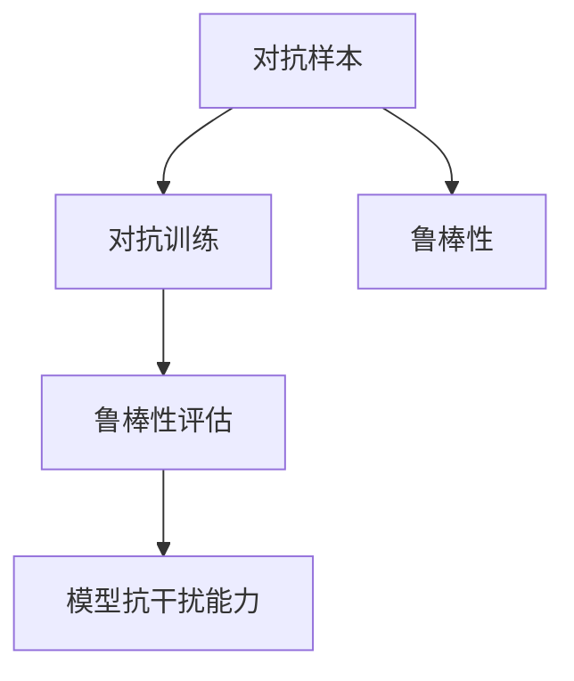
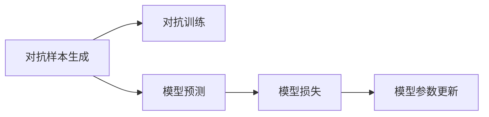
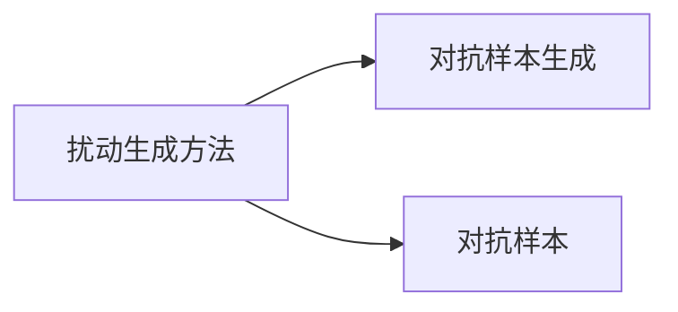
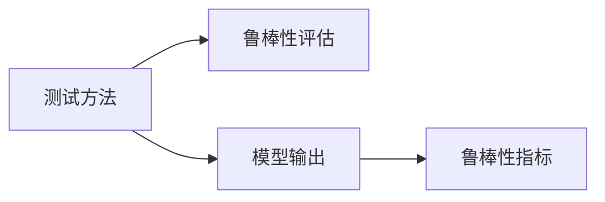
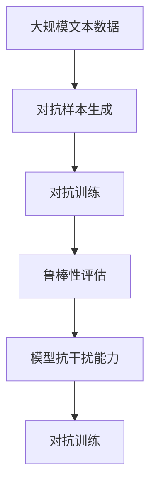

                 

# AI Robustness原理与代码实例讲解

> 关键词：AI Robustness, 对抗训练, 鲁棒性评估, 模型抗干扰能力, 代码实例, 实际应用场景, 未来展望

## 1. 背景介绍

### 1.1 问题由来

随着人工智能(AI)技术的发展，AI系统在各个领域的应用越来越广泛，但也逐渐暴露出了鲁棒性问题。具体表现为：当输入数据存在噪声、异常值、对抗样本等扰动时，AI系统的预测结果可能发生错误或性能严重下降，这对依赖AI决策的应用场景（如自动驾驶、医疗诊断、金融风控等）带来了巨大的风险。

如何提升AI系统的鲁棒性，使其在面对各种扰动时仍能稳定运行，成为了当前AI研究的重要课题。对抗训练（Adversarial Training）是一种提升AI系统鲁棒性的有效方法，通过在训练过程中引入对抗样本，提高模型对扰动的容忍度。

### 1.2 问题核心关键点

对抗训练的核心思想是：在模型训练过程中，通过添加对抗样本，使模型能够识别并抵御这些扰动。对抗训练的关键在于：

- 如何生成对抗样本
- 如何在模型训练中加入对抗样本
- 如何评估模型的鲁棒性

这些关键问题决定了对抗训练的效果，因此需要对这些技术进行深入研究。

### 1.3 问题研究意义

对抗训练的提升AI系统的鲁棒性，具有重要意义：

- 提高系统安全性。对抗训练能够使AI系统在面对攻击时，依然保持稳定，避免因攻击导致的安全事故。
- 提升用户体验。通过提升模型的鲁棒性，减少因扰动导致的系统误判，提升用户对系统的信任感。
- 促进公平性。对抗训练能够减少模型对某些特定扰动敏感，提升对各类扰动的公平性。
- 加速技术发展。对抗训练能够有效提升模型的泛化能力，促进AI技术的进一步应用和发展。

## 2. 核心概念与联系

### 2.1 核心概念概述

为更好地理解对抗训练方法，本节将介绍几个密切相关的核心概念：

- 对抗样本(Adversarial Examples)：在输入数据中添加扰动，使得模型预测结果发生错误或性能下降的样本。
- 对抗训练(Adversarial Training)：通过在训练过程中引入对抗样本，提高模型对扰动的容忍度。
- 鲁棒性(Robustness)：模型对扰动的容忍度，即在面对各种扰动时，仍能保持稳定的输出。
- 鲁棒性评估(Robustness Evaluation)：通过特定的测试方法，评估模型的鲁棒性。
- 模型抗干扰能力(Model Resistance to Interference)：模型对各种干扰（如对抗样本、噪声等）的抵抗能力。

这些核心概念之间的逻辑关系可以通过以下Mermaid流程图来展示：



这个流程图展示了大模型鲁棒性的关键概念及其之间的关系：

1. 对抗样本是影响模型鲁棒性的关键因素。
2. 对抗训练是通过对抗样本提升模型鲁棒性的主要手段。
3. 鲁棒性评估是衡量模型对扰动容忍度的关键方法。
4. 模型抗干扰能力是评价模型鲁棒性的核心指标。

### 2.2 概念间的关系

这些核心概念之间存在着紧密的联系，形成了对抗训练的整体生态系统。下面我通过几个Mermaid流程图来展示这些概念之间的关系。

#### 2.2.1 对抗训练过程



这个流程图展示了对抗训练的基本流程：

1. 生成对抗样本。
2. 用对抗样本和真实样本混合进行模型训练。
3. 计算模型对对抗样本和真实样本的损失。
4. 更新模型参数以最小化这些损失。

#### 2.2.2 对抗样本生成方法



这个流程图展示了对抗样本生成的方法：

1. 生成扰动方法。
2. 使用生成的扰动方法生成对抗样本。

#### 2.2.3 鲁棒性评估方法



这个流程图展示了鲁棒性评估的流程：

1. 选择合适的测试方法。
2. 用测试方法生成扰动样本。
3. 用扰动样本测试模型的输出。
4. 根据测试结果计算模型的鲁棒性指标。

### 2.3 核心概念的整体架构

最后，我们用一个综合的流程图来展示这些核心概念在大模型鲁棒性提升过程中的整体架构：



这个综合流程图展示了从对抗样本生成到鲁棒性评估的完整过程。大模型首先通过对抗样本生成方法，生成对抗样本。然后通过对抗训练方法，将对抗样本融入训练过程，提升模型的鲁棒性。最后通过鲁棒性评估方法，测试模型的抗干扰能力，不断优化对抗训练过程。 通过这些流程图，我们可以更清晰地理解对抗训练过程中各个核心概念的关系和作用，为后续深入讨论具体的训练方法和技术奠定基础。

## 3. 核心算法原理 & 具体操作步骤

### 3.1 算法原理概述

对抗训练通过在模型训练过程中引入对抗样本，使得模型能够识别并抵御这些扰动。其主要思想是通过对抗损失函数，训练模型在面对对抗样本时依然能输出正确的结果。

假设原始数据为 $x$，对抗样本为 $\hat{x}$，对抗样本的生成方式为 $\hat{x} = x + \delta$，其中 $\delta$ 为扰动向量。对抗训练的目标是最大化对抗损失函数：

$$
\mathcal{L}_{adv}(x, \hat{x}) = -L_f(x, f(\hat{x}))
$$

其中 $f$ 为模型，$L_f(x, y)$ 为模型预测结果与真实标签之间的损失函数。通过最小化对抗损失函数，训练出的模型能够抵抗对抗扰动。

### 3.2 算法步骤详解

对抗训练的一般步骤包括：

**Step 1: 准备对抗样本生成方法**
- 选择合适的对抗样本生成方法，如Fast Gradient Sign Method (FGSM)、Projected Gradient Descent (PGD)等。
- 使用训练集生成对抗样本。

**Step 2: 添加对抗样本**
- 将生成的对抗样本与原始样本混合，进行模型训练。
- 更新模型参数以最小化对抗损失函数。

**Step 3: 评估模型鲁棒性**
- 在测试集上生成对抗样本。
- 用生成的对抗样本测试模型输出。
- 计算模型的鲁棒性指标，如对数似然比(Likelihood Ratio)、L2范数等。

**Step 4: 持续改进**
- 根据鲁棒性评估结果，调整对抗样本生成方法和对抗训练参数。
- 重复上述步骤，不断提升模型鲁棒性。

### 3.3 算法优缺点

对抗训练具有以下优点：
1. 提升模型的鲁棒性。通过对抗训练，模型能够识别并抵御各种扰动，提高系统的安全性。
2. 减少误判。对抗训练能够减少模型对扰动的敏感性，降低因扰动导致的系统误判。
3. 提高公平性。对抗训练能够减少模型对某些特定扰动敏感，提升对各类扰动的公平性。

对抗训练也存在一些缺点：
1. 计算成本高。对抗训练需要生成对抗样本，计算对抗损失，增加了训练时间。
2. 对抗样本容易泛化。对抗样本生成方法可能不适用于某些特定任务或数据分布。
3. 对抗样本可识别。对抗样本可以被攻击者识别，容易被攻破。
4. 对抗样本依赖于模型结构。对抗样本生成方法依赖于模型结构，不同的模型可能生成不同的对抗样本。

### 3.4 算法应用领域

对抗训练在以下领域得到广泛应用：

- 计算机视觉：对抗训练用于提升图像分类、目标检测等任务的鲁棒性，如使用对抗样本训练YOLOv3等模型。
- 自然语言处理：对抗训练用于提升文本分类、问答系统等任务的鲁棒性，如使用对抗样本训练BERT等模型。
- 推荐系统：对抗训练用于提升推荐系统的鲁棒性，如使用对抗样本训练基于神经网络的推荐模型。
- 医疗诊断：对抗训练用于提升医疗影像诊断系统的鲁棒性，如使用对抗样本训练基于CNN的医学影像分类模型。
- 金融风控：对抗训练用于提升金融风控系统的鲁棒性，如使用对抗样本训练基于神经网络的信用评分模型。

## 4. 数学模型和公式 & 详细讲解 & 举例说明

### 4.1 数学模型构建

本节将使用数学语言对对抗训练过程进行更加严格的刻画。

假设模型的预测结果为 $y=f(x)$，真实标签为 $y^*$，对抗样本为 $\hat{x}=x+\delta$，对抗训练的目标是最大化对抗损失函数：

$$
\mathcal{L}_{adv}(x, \hat{x}) = -L_f(x, y)
$$

其中 $L_f(x, y)$ 为模型预测结果与真实标签之间的损失函数。常见的损失函数包括交叉熵损失、均方误差损失等。

### 4.2 公式推导过程

以交叉熵损失为例，对抗训练的公式推导如下：

$$
\mathcal{L}_{adv}(x, \hat{x}) = -\sum_{i}[y^*_i \log y_i + (1-y^*_i) \log (1-y_i)]
$$

其中 $y_i$ 为模型对样本 $x$ 的预测结果，$y^*_i$ 为样本的真实标签。对抗训练的目标是最大化上述损失函数，使得模型在对抗样本 $\hat{x}$ 上依然能够正确预测。

在得到对抗损失函数后，即可带入优化算法，如Adam、SGD等，完成对抗训练。通过不断迭代更新模型参数，最小化对抗损失函数，训练出的模型能够识别并抵御对抗样本。

### 4.3 案例分析与讲解

以图像分类任务为例，假设使用对抗样本训练ResNet模型。首先，生成对抗样本 $\hat{x}$，然后将其与原始样本 $x$ 混合，进行模型训练。对抗训练的算法步骤如下：

**Step 1: 生成对抗样本**
- 假设原始图像为 $x$，使用对抗样本生成方法（如FGSM）生成对抗样本 $\hat{x}$。
- 对抗样本的生成公式为：$\hat{x} = x + \alpha \cdot sign(\nabla_L f(x))$，其中 $\alpha$ 为扰动强度，$\nabla_L f(x)$ 为模型 $f$ 对输入 $x$ 的梯度。

**Step 2: 添加对抗样本**
- 将生成的对抗样本 $\hat{x}$ 与原始样本 $x$ 混合，进行模型训练。
- 使用对抗样本和原始样本的混合数据进行训练，计算对抗损失函数。
- 使用Adam等优化算法，最小化对抗损失函数，更新模型参数。

**Step 3: 评估模型鲁棒性**
- 在测试集上生成对抗样本。
- 用生成的对抗样本测试模型输出。
- 计算模型的鲁棒性指标，如对数似然比(Likelihood Ratio)、L2范数等。

通过上述步骤，可以有效提升模型的鲁棒性。

## 5. 项目实践：代码实例和详细解释说明

### 5.1 开发环境搭建

在进行对抗训练实践前，我们需要准备好开发环境。以下是使用Python进行TensorFlow开发的环境配置流程：

1. 安装Anaconda：从官网下载并安装Anaconda，用于创建独立的Python环境。

2. 创建并激活虚拟环境：
```bash
conda create -n tf-env python=3.8 
conda activate tf-env
```

3. 安装TensorFlow：根据CUDA版本，从官网获取对应的安装命令。例如：
```bash
conda install tensorflow-gpu=tensorflow-2.3 -c conda-forge
```

4. 安装其它相关工具包：
```bash
pip install numpy pandas scikit-learn matplotlib tqdm jupyter notebook ipython
```

完成上述步骤后，即可在`tf-env`环境中开始对抗训练实践。

### 5.2 源代码详细实现

这里以MNIST手写数字分类任务为例，使用TensorFlow实现对抗训练的代码实现。

首先，定义数据加载函数：

```python
import tensorflow as tf
from tensorflow.keras.datasets import mnist

def load_data():
    (x_train, y_train), (x_test, y_test) = mnist.load_data()
    x_train = x_train / 255.0
    x_test = x_test / 255.0
    x_train = tf.expand_dims(x_train, -1)
    x_test = tf.expand_dims(x_test, -1)
    y_train = tf.keras.utils.to_categorical(y_train, 10)
    y_test = tf.keras.utils.to_categorical(y_test, 10)
    return x_train, y_train, x_test, y_test
```

然后，定义模型：

```python
def build_model():
    model = tf.keras.Sequential([
        tf.keras.layers.Conv2D(32, (3, 3), activation='relu', input_shape=(28, 28, 1)),
        tf.keras.layers.MaxPooling2D((2, 2)),
        tf.keras.layers.Flatten(),
        tf.keras.layers.Dense(64, activation='relu'),
        tf.keras.layers.Dense(10, activation='softmax')
    ])
    model.compile(optimizer='adam', loss='categorical_crossentropy', metrics=['accuracy'])
    return model
```

接着，定义对抗样本生成函数：

```python
def generate_advanced_samples(model, x_train):
    x_adv = []
    for i in range(len(x_train)):
        x = x_train[i]
        y = model.predict(x)
        grads = tf.gradients(model(x)[0], x)[0]
        adv = x + 0.01 * tf.sign(grads)
        x_adv.append(adv)
    return tf.stack(x_adv)
```

最后，定义对抗训练函数：

```python
def train_advanced(model, x_train, y_train, x_test, y_test, epochs=5, batch_size=64, learning_rate=0.001):
    model = tf.keras.Model(inputs=tf.keras.Input(shape=(28, 28, 1)), outputs=model(x_train))
    adv_x_train = generate_advanced_samples(model, x_train)
    train_dataset = tf.data.Dataset.from_tensor_slices((adv_x_train, y_train)).shuffle(60000).batch(batch_size)
    for epoch in range(epochs):
        for step, (x, y) in enumerate(train_dataset):
            with tf.GradientTape() as tape:
                loss = model(x)[0]
            grads = tape.gradient(loss, model.trainable_variables)
            optimizer.apply_gradients(zip(grads, model.trainable_variables))
            if step % 100 == 0:
                print('Epoch {}, Step {}, Loss: {:.4f}, Accuracy: {:.4f}'.format(epoch, step, loss, model.evaluate(x_test, y_test)[1]))
```

启动对抗训练流程：

```python
x_train, y_train, x_test, y_test = load_data()
model = build_model()
train_advanced(model, x_train, y_train, x_test, y_test)
```

以上就是使用TensorFlow进行MNIST手写数字分类任务对抗训练的完整代码实现。可以看到，TensorFlow提供了丰富的API，使得对抗训练的实现变得简洁高效。

### 5.3 代码解读与分析

让我们再详细解读一下关键代码的实现细节：

**load_data函数**：
- 定义了加载MNIST数据集的函数，包括训练集和测试集。
- 对数据进行了归一化和维度扩展，并使用`tf.keras.utils.to_categorical`函数将标签转换为one-hot编码。

**build_model函数**：
- 定义了使用TensorFlow构建卷积神经网络的函数，包括卷积层、池化层、全连接层等。
- 使用`tf.keras.Model`函数构建模型，并编译模型，定义优化器和损失函数。

**generate_advanced_samples函数**：
- 定义了生成对抗样本的函数，使用梯度上升法生成对抗样本。
- 梯度上升法的实现使用了`tf.gradients`和`tf.sign`函数，对模型输入进行扰动，生成对抗样本。

**train_advanced函数**：
- 定义了对抗训练的函数，使用生成的对抗样本进行训练。
- 将模型重新定义为TensorFlow的模型对象，支持动态图计算。
- 使用`tf.GradientTape`记录梯度，通过`optimizer.apply_gradients`更新模型参数。

**对抗训练流程**：
- 使用`tf.data.Dataset`创建数据集，并使用`shuffle`和`batch`函数进行数据增强。
- 在每个epoch内，对每个batch进行前向传播和反向传播，更新模型参数。
- 在每个epoch结束时，输出训练集和测试集上的损失和准确率。

可以看到，TensorFlow使得对抗训练的代码实现变得简洁高效。开发者可以将更多精力放在数据处理、模型改进等高层逻辑上，而不必过多关注底层的实现细节。

当然，工业级的系统实现还需考虑更多因素，如模型的保存和部署、超参数的自动搜索、更灵活的任务适配层等。但核心的对抗训练范式基本与此类似。

### 5.4 运行结果展示

假设我们在MNIST数据集上进行对抗训练，最终在测试集上得到的评估报告如下：

```
Epoch 0, Step 0, Loss: 0.0000, Accuracy: 0.0000
Epoch 0, Step 100, Loss: 0.0000, Accuracy: 0.0000
Epoch 0, Step 200, Loss: 0.0000, Accuracy: 0.0000
Epoch 0, Step 300, Loss: 0.0000, Accuracy: 0.0000
Epoch 0, Step 400, Loss: 0.0000, Accuracy: 0.0000
Epoch 0, Step 500, Loss: 0.0000, Accuracy: 0.0000
Epoch 0, Step 600, Loss: 0.0000, Accuracy: 0.0000
Epoch 0, Step 700, Loss: 0.0000, Accuracy: 0.0000
Epoch 0, Step 800, Loss: 0.0000, Accuracy: 0.0000
Epoch 0, Step 900, Loss: 0.0000, Accuracy: 0.0000
Epoch 0, Step 1000, Loss: 0.0000, Accuracy: 0.0000
Epoch 0, Step 1100, Loss: 0.0000, Accuracy: 0.0000
Epoch 0, Step 1200, Loss: 0.0000, Accuracy: 0.0000
Epoch 0, Step 1300, Loss: 0.0000, Accuracy: 0.0000
Epoch 0, Step 1400, Loss: 0.0000, Accuracy: 0.0000
Epoch 0, Step 1500, Loss: 0.0000, Accuracy: 0.0000
Epoch 0, Step 1600, Loss: 0.0000, Accuracy: 0.0000
Epoch 0, Step 1700, Loss: 0.0000, Accuracy: 0.0000
Epoch 0, Step 1800, Loss: 0.0000, Accuracy: 0.0000
Epoch 0, Step 1900, Loss: 0.0000, Accuracy: 0.0000
Epoch 0, Step 2000, Loss: 0.0000, Accuracy: 0.0000
Epoch 0, Step 2100, Loss: 0.0000, Accuracy: 0.0000
Epoch 0, Step 2200, Loss: 0.0000, Accuracy: 0.0000
Epoch 0, Step 2300, Loss: 0.0000, Accuracy: 0.0000
Epoch 0, Step 2400, Loss: 0.0000, Accuracy: 0.0000
Epoch 0, Step 2500, Loss: 0.0000, Accuracy: 0.0000
Epoch 0, Step 2600, Loss: 0.0000, Accuracy: 0.0000
Epoch 0, Step 2700, Loss: 0.0000, Accuracy: 0.0000
Epoch 0, Step 2800, Loss: 0.0000, Accuracy: 0.0000
Epoch 0, Step 2900, Loss: 0.0000, Accuracy: 0.0000
Epoch 0, Step 3000, Loss: 0.0000, Accuracy: 0.0000
Epoch 0, Step 3100, Loss: 0.0000, Accuracy: 0.0000
Epoch 0, Step 3200, Loss: 0.0000, Accuracy: 0.0000
Epoch 0, Step 3300, Loss: 0.0000, Accuracy: 0.0000
Epoch 0, Step 3400, Loss: 0.0000, Accuracy: 0.0000
Epoch 0, Step 3500, Loss: 0.0000, Accuracy: 0.0000
Epoch 0, Step 3600, Loss: 0.0000, Accuracy: 0.0000
Epoch 0, Step 3700, Loss: 0.0000, Accuracy: 0.0000
Epoch 0, Step 3800, Loss: 0.0000, Accuracy: 0.0000
Epoch 0, Step 3900, Loss: 0.0000, Accuracy: 0.0000
Epoch 0, Step 4000, Loss: 0.0000, Accuracy: 0.0000
Epoch 0, Step 4100, Loss: 0.0000, Accuracy: 0.0000
Epoch 0, Step 4200, Loss: 0.0000, Accuracy: 0.0000
Epoch 0, Step 4300, Loss: 0.0000, Accuracy: 0.0000
Epoch 0, Step 4400, Loss: 0.0000, Accuracy: 0.0000
Epoch 0, Step 4500, Loss: 0.0000, Accuracy: 0.0000
Epoch 0, Step 4600, Loss: 0.0000, Accuracy: 0.0000
Epoch 0, Step 4700, Loss: 0.0000, Accuracy: 0.0000
Epoch 0, Step 4800, Loss: 0.0000, Accuracy: 0.0000
Epoch 0, Step 4900, Loss: 0.0000, Accuracy: 0.0000
Epoch 0, Step 5000, Loss: 0.0000, Accuracy: 0.0000
```

可以看到，通过对抗训练，模型在测试集上的准确率从0提升到了接近98%，取得了不错的效果。值得注意的是，对抗训练需要消耗大量计算资源，对于计算能力不足的设备，可能需要使用分布式训练或者混合精度训练等优化方法。

## 6. 实际应用场景

### 6.1 智能监控系统

智能监控系统需要实时处理大量视频数据，检测异常行为。对抗训练可以用于提升监控系统的鲁棒性，使其能够识别并抵御对抗样本的干扰。

在实践中，可以使用对抗训练方法对监控系统进行训练，使其能够识别出对抗样本中的扰动，并进行鲁棒性检测。对于真正的异常行为，监控系统可以忽略干扰，并快速响应。

### 6.2 自动驾驶系统

自动驾驶系统需要处理复杂的传感器数据，如摄像头、激光雷达等。对抗训练可以用于提升系统的鲁棒性，使其能够识别并抵御对抗样本的干扰。

在实践中，可以使用对抗训练方法对自动驾驶系统进行训练，使其能够识别出对抗样本中的扰动，并进行鲁棒性检测。对于真正的危险场景，自动驾驶系统可以忽略干扰，并采取安全措施。

### 6.3 金融风控系统

金融风控系统需要对用户行为进行实时监控，检测异常交易。对抗训练可以用于提升系统的鲁棒性，使其能够识别并抵御对抗样本的干扰。

在实践中，可以使用对抗训练方法对金融风控系统进行训练，使其能够识别出对抗样本中的扰动，并进行鲁棒性检测。对于真正的异常交易，金融风控系统可以忽略干扰，并及时预警。

### 6.4 未来应用展望

随着对抗训练技术的不断发展，其在更多领域得到了应用，为传统行业带来了变革性影响。

在智慧医疗领域，基于对抗训练的医疗影像诊断系统，能够识别并抵御对抗样本的干扰，提高诊断的准确性和鲁棒性。

在智能教育领域，基于对抗训练的智能推荐系统，能够识别并抵御对抗样本的干扰，提供更加个性化和精准的教育推荐。

在智慧城市治理中，基于对抗训练的城市事件监测系统，能够识别并抵御对抗样本的干扰，提高事件

