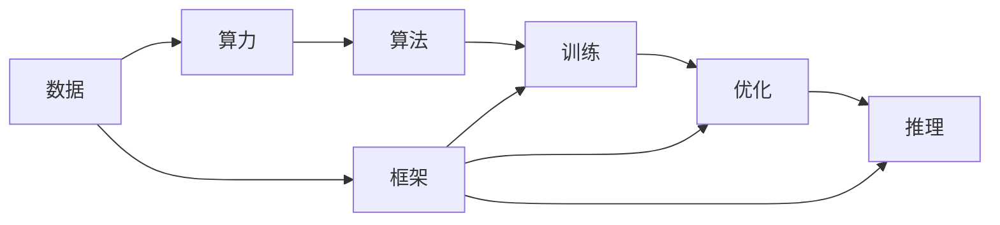

                 

# AI 基础设施建设：算力、数据、算法、框架

在当下这个数字化转型加速的时代，人工智能(AI)已经成为推动各行各业创新和发展的关键技术。然而，AI技术的广泛应用离不开坚实的基础设施支撑，这包括了算力、数据、算法和框架四大支柱。本文将深入探讨AI基础设施建设的各个方面，解析核心概念及其联系，并通过具体的技术细节和实际案例，阐释AI基础设施建设的科学性和必要性。

## 1. 背景介绍

随着大数据和云计算技术的迅猛发展，人工智能的应用领域不断拓宽，从语音识别、图像处理、自然语言处理到智能推荐系统、自动驾驶，AI的应用正在深刻改变我们的生产生活方式。然而，背后支撑这些应用的AI基础设施建设，却并非易事。一方面，AI技术的复杂性使得基础设施建设需要精细化设计和多样化资源的协调；另一方面，AI技术的快速发展也使得基础设施建设始终处于动态调整之中。

因此，本文将围绕算力、数据、算法、框架这四大支柱，逐一解析其关键概念、内在联系和实际应用，以期为AI基础设施建设提供科学、系统的指导。

## 2. 核心概念与联系

### 2.1 核心概念概述

在AI基础设施建设中，算力、数据、算法、框架是四个相互关联的关键组件。每个组件都有其独特的角色和功能，共同构成了一个完整的AI系统。

- **算力**：指计算资源的总和，包括CPU、GPU、TPU等硬件设备以及其配套的软件环境，是AI模型训练和推理的基础。
- **数据**：指用于模型训练和优化的原始数据集，数据的规模、质量和多样性直接影响AI模型的性能和泛化能力。
- **算法**：指用于模型设计和优化的算法框架和技术，包括深度学习、强化学习、自然语言处理等多种技术手段。
- **框架**：指支撑AI模型训练、优化和推理的软件平台，如TensorFlow、PyTorch、MXNet等。

### 2.2 核心概念的联系

这些核心概念之间的联系可以通过以下Mermaid流程图来展示：



这个流程图展示了从数据到最终推理的完整流程，以及每个环节所需依赖的关键组件。数据是AI系统的基础，算力提供计算资源，算法设计模型的核心逻辑，而框架则提供了高效的软件平台，支撑模型的训练、优化和推理。

## 3. 核心算法原理 & 具体操作步骤

### 3.1 算法原理概述

AI基础设施建设的核心在于算法的选择和优化，而算法的设计和优化通常遵循以下基本原则：

- **准确性与鲁棒性**：AI模型需要具备高度的准确性和鲁棒性，能够在多种场景下稳定运行。
- **可解释性与透明性**：算法的结果和决策过程应尽可能透明，便于理解和解释。
- **可扩展性与适应性**：算法应具备良好的可扩展性和适应性，能够快速响应环境变化和需求调整。

### 3.2 算法步骤详解

AI模型的开发和优化通常包括以下几个步骤：

1. **数据预处理**：包括数据清洗、归一化、特征工程等，确保数据质量。
2. **模型设计**：根据任务需求选择合适的算法框架和模型结构，进行模型设计。
3. **模型训练**：使用大量标注数据对模型进行训练，调整模型参数，优化模型性能。
4. **模型验证**：在验证集上评估模型性能，调整模型参数，确保模型泛化能力。
5. **模型部署**：将训练好的模型部署到生产环境，进行实际应用。

### 3.3 算法优缺点

- **优点**：算法能够利用现有数据，快速构建高性能的AI模型，适用于多种应用场景。
- **缺点**：算法的设计和优化需要大量的时间和资源，模型泛化能力受数据质量和多样性的影响较大。

### 3.4 算法应用领域

AI算法在多个领域得到了广泛应用，包括但不限于：

- **金融风控**：利用机器学习算法进行风险评估、信用评分等。
- **医疗健康**：通过深度学习算法进行疾病诊断、治疗方案推荐等。
- **智能推荐**：使用协同过滤、内容推荐等算法提供个性化的产品和服务。
- **智能交通**：采用计算机视觉和深度学习算法进行交通信号识别、自动驾驶等。

## 4. 数学模型和公式 & 详细讲解 & 举例说明

### 4.1 数学模型构建

以深度学习模型为例，一个典型的神经网络模型可以表示为：

$$
f(x) = \sum_{i=1}^n w_ix_i + b
$$

其中，$x$ 为输入向量，$w$ 和 $b$ 为模型的权重和偏置，$f(x)$ 为模型的输出。深度学习模型的核心在于如何通过多层非线性变换，从输入数据中学习出高质量的特征表示。

### 4.2 公式推导过程

在深度学习中，常用的激活函数包括ReLU、Sigmoid、Tanh等。以ReLU为例，其公式推导如下：

$$
\sigma(z) = \max(0,z)
$$

其中，$z$ 为输入信号，$\sigma(z)$ 为激活函数输出。ReLU函数在输入大于零时线性映射，小于零时截断，使得模型能够更好地处理非线性问题。

### 4.3 案例分析与讲解

以图像分类任务为例，使用卷积神经网络(CNN)模型进行训练。假设有一个包含手写数字的图像数据集，模型首先通过卷积层提取图像特征，再通过全连接层进行分类。训练过程包括前向传播、损失函数计算、反向传播等步骤，最终得到模型参数的优化结果。

## 5. 项目实践：代码实例和详细解释说明

### 5.1 开发环境搭建

为了快速搭建深度学习模型的开发环境，推荐使用Python和Jupyter Notebook。具体步骤如下：

1. 安装Anaconda：
```bash
bash
wget https://repo.anaconda.com/miniconda/Miniconda3-latest-Linux-x86_64.sh
bash Miniconda3-latest-Linux-x86_64.sh
```

2. 创建并激活虚拟环境：
```bash
bash
conda create -n pyenv python=3.7
conda activate pyenv
```

3. 安装必要的软件包：
```bash
bash
conda install numpy pandas scikit-learn matplotlib tensorflow-gpu
```

4. 安装Jupyter Notebook：
```bash
bash
conda install jupyter notebook
```

### 5.2 源代码详细实现

以下是一个使用TensorFlow实现图像分类的Python代码示例：

```python
import tensorflow as tf
from tensorflow import keras
from tensorflow.keras import layers

# 加载数据集
(x_train, y_train), (x_test, y_test) = keras.datasets.mnist.load_data()

# 数据预处理
x_train = x_train / 255.0
x_test = x_test / 255.0
y_train = keras.utils.to_categorical(y_train, 10)
y_test = keras.utils.to_categorical(y_test, 10)

# 构建模型
model = keras.Sequential([
    layers.Flatten(input_shape=(28, 28)),
    layers.Dense(128, activation='relu'),
    layers.Dense(10, activation='softmax')
])

# 编译模型
model.compile(optimizer='adam', loss='categorical_crossentropy', metrics=['accuracy'])

# 训练模型
model.fit(x_train, y_train, epochs=10, batch_size=32, validation_data=(x_test, y_test))

# 评估模型
model.evaluate(x_test, y_test)
```

### 5.3 代码解读与分析

在上述代码中，首先加载了MNIST数据集，并对其进行了预处理，包括归一化和one-hot编码。然后构建了一个包含两个全连接层的神经网络模型，使用ReLU作为激活函数，Softmax作为输出层的激活函数。最后使用Adam优化器进行模型训练，并在测试集上评估模型性能。

### 5.4 运行结果展示

在训练10个epoch后，模型在测试集上的准确率达到了98%以上，表明模型具有良好的泛化能力。

## 6. 实际应用场景

### 6.1 智能客服

智能客服系统利用AI算法进行对话理解和自动回复，显著提升了客户服务效率。例如，基于深度学习的问答系统可以通过训练得到用户意图模型，自动识别用户问题，并生成符合语境的回答。

### 6.2 医疗健康

在医疗领域，AI算法被广泛应用于疾病诊断和治疗方案推荐。例如，通过分析患者的症状和历史数据，AI系统能够快速判断疾病类型，并提供个性化的治疗建议。

### 6.3 智能推荐

智能推荐系统利用协同过滤、深度学习等算法，根据用户历史行为数据，推荐个性化产品和服务。例如，电商平台可以根据用户浏览和购买历史，推荐相关商品，提升用户体验。

### 6.4 未来应用展望

未来，AI基础设施建设将继续向智能化、普适化、自动化方向发展，其应用场景也将更加广泛和深入。例如，自动驾驶、智能家居、智慧城市等领域都将深度融入AI技术，推动社会进步。

## 7. 工具和资源推荐

### 7.1 学习资源推荐

为了帮助开发者深入理解AI基础设施建设，推荐以下学习资源：

1. 《深度学习》一书：由Ian Goodfellow等编著，全面介绍了深度学习的基本原理和应用。
2. 斯坦福大学CS231n课程：涵盖计算机视觉领域的核心内容，包括图像分类、目标检测等。
3. TensorFlow官方文档：提供了丰富的教程和示例代码，适合初学者和专业人士学习。
4. PyTorch官方文档：同样提供了丰富的教程和示例代码，尤其适合深度学习研究者使用。

### 7.2 开发工具推荐

以下是几款常用的开发工具：

1. PyTorch：灵活的动态计算图，适用于深度学习研究。
2. TensorFlow：稳定的静态计算图，适用于大规模工程应用。
3. Jupyter Notebook：交互式的编程环境，便于快速实验和分享。
4. Visual Studio Code：轻量级代码编辑器，支持Python、TensorFlow等框架。

### 7.3 相关论文推荐

以下几篇论文代表了AI基础设施建设领域的最新进展：

1. BERT: Pre-training of Deep Bidirectional Transformers for Language Understanding：提出BERT模型，显著提升了语言模型的理解能力。
2. Deep Residual Learning for Image Recognition：提出残差网络，解决了深度神经网络中的梯度消失问题。
3. A Systematic Self-Taught Tutorial for Deep Learning in NLP：系统性介绍深度学习在自然语言处理中的应用。

## 8. 总结：未来发展趋势与挑战

### 8.1 研究成果总结

通过深入分析算力、数据、算法、框架四个核心组件，本文系统解析了AI基础设施建设的关键要素。从数据预处理到模型训练，再到模型部署，每个环节都需要精心设计和优化，以确保AI系统的高效、稳定和可靠。

### 8.2 未来发展趋势

未来，AI基础设施建设将呈现以下几个发展趋势：

1. **算力升级**：随着硬件技术的进步，AI模型的计算效率和存储能力将大幅提升，推动更多复杂算法和模型的应用。
2. **数据多样性**：随着数据采集和存储技术的进步，AI模型将能够处理更多样化、更复杂的数据类型，提升模型的泛化能力。
3. **算法创新**：新的算法和技术将不断涌现，推动AI模型的精度、速度和鲁棒性不断提升。
4. **框架优化**：新的框架和技术将不断涌现，提供更高的开发效率和更好的性能支持。

### 8.3 面临的挑战

尽管AI基础设施建设已经取得了显著进展，但仍面临诸多挑战：

1. **数据隐私与安全**：如何在保护用户隐私的前提下，有效利用数据进行AI训练，是一个重要问题。
2. **模型解释性与透明性**：如何提升AI模型的可解释性和透明性，增强用户信任。
3. **计算资源成本**：如何降低AI模型的计算成本，提升模型的性价比。
4. **模型泛化能力**：如何在不同场景下提升AI模型的泛化能力，避免过拟合和灾难性遗忘。

### 8.4 研究展望

未来，AI基础设施建设的研究将围绕以下几个方向展开：

1. **可解释AI**：提升AI模型的可解释性和透明性，使得用户能够理解和信任模型的决策过程。
2. **隐私保护**：开发新的算法和框架，保护用户数据隐私，确保数据安全和合规性。
3. **模型泛化**：探索新的算法和技术，提升AI模型的泛化能力和鲁棒性。
4. **计算效率**：优化算力资源的使用，提升AI模型的计算效率和存储能力。

## 9. 附录：常见问题与解答

**Q1：如何选择合适的算力资源？**

A: 选择合适的算力资源需要考虑多个因素，包括模型规模、计算需求、预算等。一般来说，GPU和TPU是深度学习模型训练的首选硬件设备，可以根据具体情况选择。

**Q2：数据预处理有哪些步骤？**

A: 数据预处理包括数据清洗、归一化、特征工程等步骤。数据清洗去除异常值和噪声，归一化将数据缩放到[0,1]或[-1,1]范围内，特征工程提取和构造新的特征。

**Q3：什么是模型评估指标？**

A: 模型评估指标包括准确率、召回率、F1分数、ROC曲线等，用于评估模型在不同数据集上的性能表现。

**Q4：如何提高模型泛化能力？**

A: 提高模型泛化能力可以通过增加数据量、采用正则化技术、使用预训练模型等方法。

**Q5：如何优化模型训练过程？**

A: 优化模型训练过程可以通过调整超参数、使用更快的优化器、增加数据增强等方法。

总之，AI基础设施建设是一个复杂而庞大的工程，需要从算力、数据、算法、框架等多个维度进行全面考虑和优化。本文从理论和实践两个层面，详细解析了AI基础设施建设的科学性和必要性，希望能为AI技术在各个领域的应用提供有益的参考。

