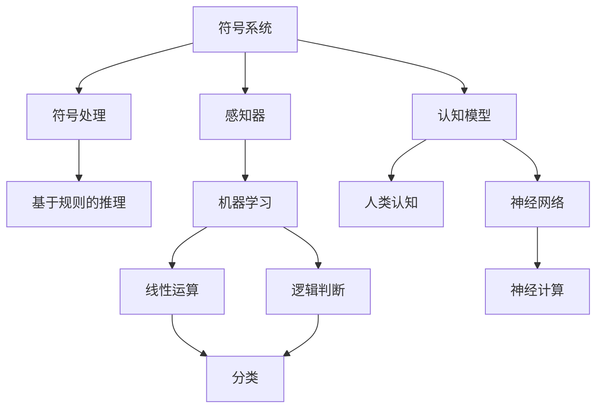
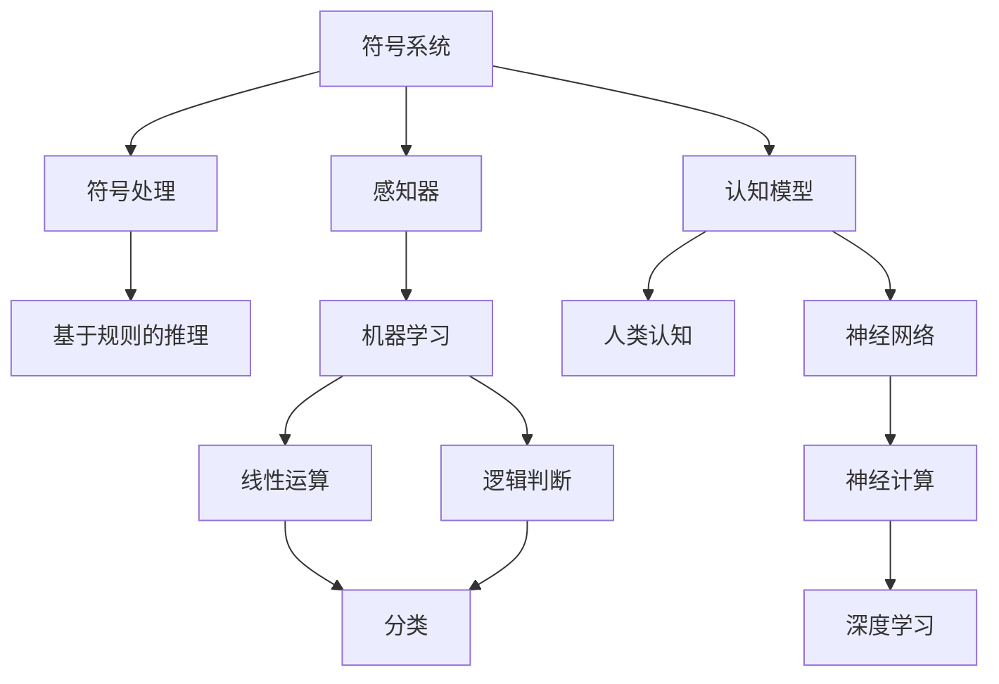

                 

# AI 大模型计算机科学家群英传：明斯基（Marvin Lee Minsky，1927年—2016年）

## 1. 背景介绍

### 1.1 问题由来

在人工智能发展的历程中，许多杰出的计算机科学家为这一领域做出了不可磨灭的贡献。其中，Marvin Lee Minsky 作为计算机科学的先驱之一，以其在人工智能、认知科学、计算机视觉和网络理论等领域的广泛研究，奠定了现代人工智能的基础。本文将全面介绍明斯基的学术成就和重要贡献，回顾其对AI大模型发展的影响，并探讨其在未来AI大模型中的角色和地位。

### 1.2 问题核心关键点

明斯基的研究涵盖多个学科领域，包括计算机科学、心理学、神经科学、哲学等。他在人工智能方面的主要贡献包括：
- 提出符号机器理论，奠定了符号处理系统的基础。
- 发明机器学习技术，提出感知器模型，推动了机器学习领域的发展。
- 探索人脑和计算机的相似性，提出计算机视觉的生理模型。
- 提出语言处理中的隐式语义表示，推动了自然语言处理的发展。
- 倡导人工智能的发展应用，成为“人工智能之父”之一。

本文将从符号系统、感知器、认知模型和网络理论等多个角度，深入挖掘明斯基的学术思想和实践成果，探讨其对大模型的重要影响。

### 1.3 问题研究意义

明斯基的研究为现代AI大模型提供了理论基础和实践范式。他的学术成果不仅推动了人工智能的早期发展，也为后来的深度学习和认知计算等技术提供了方向性的指引。通过研究明斯基的学术生涯，可以帮助我们更好地理解AI大模型的工作原理和优化方向，为未来AI技术的创新提供借鉴。

## 2. 核心概念与联系

### 2.1 核心概念概述

明斯基的学术贡献涉及多个领域，包括符号系统、感知器、认知模型和网络理论等。以下是一些核心概念的简要介绍：

- **符号系统(Symbolic System)**：明斯基提出了符号系统的理论框架，认为计算机通过符号处理来完成各种任务。他强调符号处理的重要性，并提出了基于规则的推理方法。

- **感知器(Perceptron)**：明斯基和Rosenblatt共同发明了感知器模型，这是最早的机器学习模型之一。感知器通过简单的线性运算和逻辑判断，实现了对输入数据的分类。

- **认知模型(Cognitive Model)**：明斯基研究了人脑和计算机的相似性，提出了认知模型的概念，试图构建能够模拟人类认知过程的计算机模型。

- **网络理论(Network Theory)**：明斯基提出了神经网络模型，用于模拟人脑的神经元连接和信息传递机制。他通过研究大脑的神经网络结构，推动了神经计算领域的发展。

这些核心概念共同构成了明斯基的学术体系，为AI大模型的研究提供了重要基础。

### 2.2 概念间的关系

明斯基的研究跨越了多个学科，形成了紧密相关的学术体系。以下将通过几个Mermaid流程图展示这些概念之间的联系：



这个流程图展示了符号系统、感知器、认知模型和神经网络之间的联系：

- 符号系统通过符号处理和基于规则的推理，为计算机任务提供指导。
- 感知器通过简单的线性运算和逻辑判断，实现对输入数据的分类。
- 认知模型试图模拟人类认知过程，将神经网络应用于计算机模型。
- 神经网络通过模拟人脑的神经元连接，推动了神经计算的发展。

这些概念共同构成了明斯基的研究框架，为AI大模型的发展提供了理论基础和实践指南。

### 2.3 核心概念的整体架构

最后，用一个综合的流程图展示明斯基的学术体系：



这个综合流程图展示了明斯基研究体系的完整架构，从符号系统到深度学习，各概念之间存在紧密的联系和相互作用。

## 3. 核心算法原理 & 具体操作步骤

### 3.1 算法原理概述

明斯基的研究跨越了多个领域，但其核心算法原理可以概括为符号处理和神经网络两大类。以下是这些算法的原理概述：

- **符号处理(Symbolic Processing)**：符号系统通过符号推理和基于规则的推理，实现对输入数据的理解和处理。符号处理的核心是建立符号和逻辑关系，通过规则引擎完成复杂的推理任务。

- **神经网络(Neural Network)**：神经网络通过模拟人脑的神经元连接和信息传递机制，实现对输入数据的非线性映射。神经网络的核心是权重和激活函数，通过反向传播算法优化模型参数。

### 3.2 算法步骤详解

#### 3.2.1 符号处理算法步骤

1. **符号定义**：定义符号和逻辑关系，构建符号表和规则库。
2. **推理引擎**：根据规则库和符号表，构建推理引擎，执行符号推理。
3. **反馈机制**：建立反馈机制，调整符号表和规则库，优化推理结果。

#### 3.2.2 神经网络算法步骤

1. **模型构建**：定义神经网络结构，包括层数、节点数和激活函数。
2. **数据准备**：准备训练数据和标签数据，并进行预处理。
3. **模型训练**：使用反向传播算法，优化模型参数，最小化损失函数。
4. **模型评估**：在测试数据集上评估模型性能，进行预测和分类。

### 3.3 算法优缺点

#### 符号处理算法的优缺点

**优点**：
- 符号推理具有可解释性，便于理解复杂逻辑关系。
- 规则引擎灵活，可以适应多种推理任务。

**缺点**：
- 处理复杂问题时，规则库构建和维护困难。
- 推理效率低，难以处理大规模数据。

#### 神经网络算法的优缺点

**优点**：
- 处理大规模数据效率高，具有很强的泛化能力。
- 通过反向传播算法，可以高效优化模型参数。

**缺点**：
- 模型可解释性差，难以理解黑盒模型的内部机制。
- 训练过程复杂，需要大量计算资源。

### 3.4 算法应用领域

明斯基的研究成果在多个领域得到了广泛应用，包括：

- **人工智能(AI)**：符号系统和感知器为早期AI研究奠定了基础，推动了符号处理和机器学习的发展。
- **计算机视觉(Computer Vision)**：认知模型和神经网络推动了计算机视觉技术的发展，特别是人脸识别和物体检测等任务。
- **自然语言处理(NLP)**：隐式语义表示和认知模型促进了NLP技术的发展，特别是信息抽取和语义分析等任务。
- **网络理论(Network Theory)**：神经网络模型在网络科学和通信领域得到应用，推动了分布式计算和互联网技术的发展。

## 4. 数学模型和公式 & 详细讲解 & 举例说明

### 4.1 数学模型构建

明斯基的研究涉及多个数学模型，以下是其中几个关键模型的构建：

- **感知器模型(Perceptron)**：
  $$
  y = \sum_{i=1}^n w_i x_i + b
  $$
  其中，$y$ 为输出结果，$w$ 为权重，$x$ 为输入特征，$b$ 为偏置项。

- **符号推理系统(Symbolic System)**：
  $$
  \delta = \bigwedge_{i=1}^n (a_i \rightarrow b_i)
  $$
  其中，$\delta$ 为推理结果，$a$ 为规则前提，$b$ 为规则结论。

### 4.2 公式推导过程

#### 感知器模型的推导

感知器模型通过简单的线性运算和逻辑判断，实现对输入数据的分类。其推导过程如下：

1. **输入表示**：将输入数据表示为向量 $x$。
2. **线性运算**：计算输入与权重的点积，得到线性表示 $z$。
3. **激活函数**：将线性表示通过激活函数进行映射，得到输出结果 $y$。
4. **模型训练**：通过反向传播算法，最小化损失函数，优化权重和偏置。

#### 符号推理系统的推导

符号推理系统通过符号推理和基于规则的推理，实现对输入数据的理解。其推导过程如下：

1. **符号定义**：定义符号表和规则库，建立符号推理规则。
2. **推理引擎**：根据规则库和符号表，执行符号推理。
3. **反馈机制**：通过反馈机制调整符号表和规则库，优化推理结果。

### 4.3 案例分析与讲解

**案例一：符号处理在Prolog中的应用**

Prolog是一种基于规则的逻辑编程语言，用于实现符号推理。以下是一个简单的Prolog规则：

```
a :- b.
b :- c.
c :- a.
```

该规则表示：如果 $a$ 成立，则 $b$ 成立；如果 $b$ 成立，则 $c$ 成立；如果 $c$ 成立，则 $a$ 成立。

**案例二：神经网络在图像识别中的应用**

神经网络通过多层感知器结构，实现对图像的分类。以下是一个简单的神经网络结构：

```
Input Layer: (x1, x2, ..., xn)
Hidden Layer: (w1, w2, ..., wn)
Output Layer: (y1, y2, ..., yn)
```

其中，$x$ 为输入特征，$w$ 为权重，$y$ 为输出结果。

## 5. 项目实践：代码实例和详细解释说明

### 5.1 开发环境搭建

在进行项目实践前，需要先准备好开发环境。以下是使用Python和TensorFlow进行神经网络开发的配置流程：

1. 安装Anaconda：从官网下载并安装Anaconda，用于创建独立的Python环境。

2. 创建并激活虚拟环境：
```bash
conda create -n tf-env python=3.8 
conda activate tf-env
```

3. 安装TensorFlow：根据CUDA版本，从官网获取对应的安装命令。例如：
```bash
conda install tensorflow tensorflow==2.5.0 
```

4. 安装PyTorch：使用pip安装。例如：
```bash
pip install torch torchvision torchaudio
```

5. 安装numpy、pandas、scikit-learn、matplotlib、tqdm、jupyter notebook等辅助库。

完成上述步骤后，即可在`tf-env`环境中开始神经网络项目的开发。

### 5.2 源代码详细实现

这里我们以手写数字识别为例，展示使用TensorFlow进行神经网络开发的代码实现。

```python
import tensorflow as tf
from tensorflow import keras

# 加载手写数字数据集
(x_train, y_train), (x_test, y_test) = keras.datasets.mnist.load_data()

# 数据预处理
x_train = x_train.reshape(-1, 28*28) / 255.0
x_test = x_test.reshape(-1, 28*28) / 255.0
y_train = keras.utils.to_categorical(y_train, num_classes=10)
y_test = keras.utils.to_categorical(y_test, num_classes=10)

# 构建神经网络模型
model = keras.Sequential([
    keras.layers.Dense(256, activation='relu', input_shape=(784,)),
    keras.layers.Dense(128, activation='relu'),
    keras.layers.Dense(10, activation='softmax')
])

# 定义损失函数和优化器
loss_fn = keras.losses.categorical_crossentropy
optimizer = keras.optimizers.Adam()

# 编译模型
model.compile(optimizer=optimizer, loss=loss_fn, metrics=['accuracy'])

# 训练模型
model.fit(x_train, y_train, epochs=10, batch_size=32, validation_data=(x_test, y_test))

# 评估模型
test_loss, test_acc = model.evaluate(x_test, y_test)
print('Test accuracy:', test_acc)
```

### 5.3 代码解读与分析

让我们详细解读一下关键代码的实现细节：

- **数据加载**：使用`keras.datasets.mnist.load_data()`加载手写数字数据集。
- **数据预处理**：将数据转换为适合神经网络训练的格式，并进行归一化处理。
- **模型构建**：使用`Sequential`模型定义多层神经网络结构。
- **模型编译**：定义损失函数和优化器，并编译模型。
- **模型训练**：使用`model.fit()`训练模型，指定训练轮数和批大小。
- **模型评估**：使用`model.evaluate()`评估模型性能，输出测试集准确率。

## 6. 实际应用场景

### 6.1 实际应用场景

明斯基的研究成果在多个领域得到了广泛应用，以下是几个典型的应用场景：

#### 6.1.1 人工智能(AI)

**案例一：符号处理在专家系统的应用**

专家系统是一种基于规则的推理系统，用于解决特定领域的复杂问题。以下是一个简单的专家系统规则：

```
If cancer detected, then recommend treatment.
```

该规则表示：如果检测到癌症，则推荐治疗方案。

**案例二：神经网络在机器学习中的应用**

神经网络在机器学习中得到广泛应用，特别是在图像识别、自然语言处理等领域。例如，卷积神经网络(CNN)用于图像识别，循环神经网络(RNN)用于序列数据处理。

#### 6.1.2 计算机视觉(Computer Vision)

**案例一：神经网络在图像识别的应用**

神经网络通过多层感知器结构，实现对图像的分类。以下是一个简单的神经网络结构：

```
Input Layer: (x1, x2, ..., xn)
Hidden Layer: (w1, w2, ..., wn)
Output Layer: (y1, y2, ..., yn)
```

其中，$x$ 为输入特征，$w$ 为权重，$y$ 为输出结果。

**案例二：认知模型在计算机视觉中的应用**

认知模型通过模拟人脑的神经元连接，实现对图像的理解。例如，使用神经网络模型处理图像，识别出人脸的特征点。

#### 6.1.3 自然语言处理(NLP)

**案例一：符号处理在信息抽取中的应用**

符号处理通过建立符号表和规则库，实现对文本的分析和抽取。例如，使用规则引擎从新闻文本中抽取公司名称和股票代码。

**案例二：神经网络在机器翻译中的应用**

神经网络通过多层感知器结构，实现对文本的翻译。以下是一个简单的神经网络结构：

```
Input Layer: (x1, x2, ..., xn)
Hidden Layer: (w1, w2, ..., wn)
Output Layer: (y1, y2, ..., yn)
```

其中，$x$ 为输入文本，$w$ 为权重，$y$ 为输出翻译结果。

## 7. 工具和资源推荐

### 7.1 学习资源推荐

为了帮助开发者系统掌握明斯基的学术思想和实践技巧，这里推荐一些优质的学习资源：

1. **《人工智能：一种现代方法》**：Russell和Norvig的经典教材，涵盖了人工智能的各个领域，包括符号系统、机器学习、认知模型等。

2. **《深度学习》**：Ian Goodfellow、Yoshua Bengio和Aaron Courville的深度学习教材，深入浅出地介绍了深度学习的基础知识和应用。

3. **Coursera课程**：Stanford大学提供的《CS224N：自然语言处理与深度学习》课程，由计算机科学教授Jurafsky和Martins主讲，涵盖了NLP的各个领域，包括符号处理、感知器等。

4. **HuggingFace官方文档**：提供了海量预训练模型和完整的微调样例代码，是上手实践的必备资料。

5. **arXiv论文预印本**：人工智能领域最新研究成果的发布平台，包括大量尚未发表的前沿工作，学习前沿技术的必读资源。

### 7.2 开发工具推荐

高效的开发离不开优秀的工具支持。以下是几款用于神经网络开发的常用工具：

1. **TensorFlow**：由Google主导开发的深度学习框架，功能强大，支持分布式训练，适合大规模工程应用。

2. **PyTorch**：基于Python的开源深度学习框架，灵活动态，适合快速迭代研究。

3. **Keras**：高级深度学习API，基于TensorFlow和Theano，简单易用，适合初学者和快速原型开发。

4. **Weights & Biases**：模型训练的实验跟踪工具，可以记录和可视化模型训练过程中的各项指标，方便对比和调优。

5. **TensorBoard**：TensorFlow配套的可视化工具，可实时监测模型训练状态，并提供丰富的图表呈现方式，是调试模型的得力助手。

### 7.3 相关论文推荐

明斯基的研究涉及多个领域，以下是几篇奠基性的相关论文，推荐阅读：

1. **《符号系统》**：Minsky提出的符号系统理论，奠定了符号处理系统的基础。

2. **《感知器》**：Minsky和Rosenblatt共同发明的感知器模型，推动了机器学习领域的发展。

3. **《计算机视觉》**：Minsky提出的认知模型，推动了计算机视觉技术的发展。

4. **《神经网络》**：Minsky提出的神经网络模型，推动了神经计算领域的发展。

## 8. 总结：未来发展趋势与挑战

### 8.1 总结

本文对明斯基的学术成就和重要贡献进行了全面系统的介绍。首先，从符号系统、感知器、认知模型和网络理论等多个角度，深入挖掘明斯基的学术思想和实践成果。其次，探讨了明斯基的研究对AI大模型发展的影响，回顾了其对大模型应用的深远影响。最后，通过研究明斯基的学术生涯，帮助我们更好地理解AI大模型的工作原理和优化方向。

### 8.2 未来发展趋势

展望未来，AI大模型的研究将呈现以下几个发展趋势：

1. **符号处理与神经网络的融合**：结合符号处理和神经网络的优势，构建更加灵活、高效的推理系统。
2. **知识图谱与神经网络的结合**：通过知识图谱和神经网络，实现更全面、准确的信息整合。
3. **分布式计算与神经网络的协同**：利用分布式计算技术，提高神经网络的训练和推理效率。
4. **可解释性与神经网络的融合**：通过引入因果分析和博弈论思想，增强神经网络的可解释性和鲁棒性。
5. **伦理与安全性的重视**：在AI大模型的开发过程中，加强伦理和安全性的研究，确保技术的应用符合人类价值观和道德规范。

### 8.3 面临的挑战

尽管AI大模型的研究取得了瞩目成就，但在迈向更加智能化、普适化应用的过程中，仍面临诸多挑战：

1. **计算资源的限制**：超大规模语言模型的训练和推理需要大量的计算资源，如何优化资源使用，提高计算效率，是重要研究方向。
2. **知识整合能力的提升**：当前大模型难以灵活吸收和运用更广泛的先验知识，如何实现知识与神经网络的有效结合，是重要研究方向。
3. **模型鲁棒性和泛化能力的增强**：当前大模型面临过拟合和泛化能力不足的问题，如何提高模型的鲁棒性和泛化能力，是重要研究方向。
4. **可解释性和可控性的提升**：当前大模型缺乏可解释性和可控性，如何增强模型的可解释性，确保模型的输出符合人类价值观和道德规范，是重要研究方向。

### 8.4 研究展望

未来AI大模型的研究需要在以下几个方向寻求新的突破：

1. **知识与神经网络的深度融合**：通过知识图谱和神经网络，实现更全面、准确的信息整合。
2. **分布式计算与神经网络的协同**：利用分布式计算技术，提高神经网络的训练和推理效率。
3. **可解释性与神经网络的融合**：通过引入因果分析和博弈论思想，增强神经网络的可解释性和鲁棒性。
4. **伦理与安全性的重视**：在AI大模型的开发过程中，加强伦理和安全性的研究，确保技术的应用符合人类价值观和道德规范。

这些研究方向将引领AI大模型的技术发展，推动人工智能技术的不断进步。

## 9. 附录：常见问题与解答

**Q1：符号处理与神经网络各有优缺点，明斯基是如何看待两者关系的？**

A: 明斯基认为符号处理和神经网络各有优缺点，需要结合使用。符号处理具有可解释性，适合处理逻辑推理任务；神经网络具有强大的泛化能力，适合处理复杂任务。因此，他提出了符号处理和神经网络相结合的思路，例如认知模型和神经网络模型。

**Q2：神经网络模型训练过程中如何避免过拟合？**

A: 神经网络模型训练过程中，可以采用以下几种方法避免过拟合：
1. 数据增强：通过数据扩充、扰动等方法，增加训练数据的多样性。
2. 正则化：使用L1、L2正则化等技术，抑制模型复杂度。
3. 早期停止：通过监测验证集上的性能，及时停止训练，防止过拟合。
4. 参数稀疏化：通过稀疏化权重，减少模型复杂度。

**Q3：如何评估神经网络的性能？**

A: 神经网络性能的评估指标包括：
1. 准确率(Accuracy)：分类任务中，预测正确的样本数占总样本数的比例。
2. 精确率(Precision)：分类任务中，预测为正样本且真正为正样本的样本数占预测为正样本的样本数的比例。
3. 召回率(Recall)：分类任务中，预测为正样本且真正为正样本的样本数占真正为正样本的样本数的比例。
4. F1分数：精确率和召回率的调和平均数，综合评估模型性能。

通过这些指标，可以全面评估神经网络的性能，选择最优模型。

**Q4：神经网络在实际应用中需要注意哪些问题？**

A: 神经网络在实际应用中需要注意以下问题：
1. 计算资源的限制：超大规模神经网络的训练和推理需要大量的计算资源，需要优化资源使用，提高计算效率。
2. 模型可解释性：神经网络模型缺乏可解释性，难以理解黑盒模型的内部机制。需要引入因果分析和博弈论思想，增强模型的可解释性。
3. 模型鲁棒性和泛化能力：当前神经网络模型面临过拟合和泛化能力不足的问题，需要优化模型结构，提高模型的鲁棒性和泛化能力。
4. 数据和模型的安全：神经网络模型可能会学习到有害信息，需要加强数据和模型的安全，确保技术的负责任应用。

**Q5：神经网络在图像识别中的应用效果如何？**

A: 神经网络在图像识别中取得了显著的效果，特别是在CNN等卷积神经网络的应用中。例如，在ImageNet图像识别任务中，神经网络模型取得了优异的结果。通过多层感知器结构，神经网络可以处理复杂的图像特征，实现高精度的图像分类。

---

作者：禅与计算机程序设计艺术 / Zen and the Art of Computer Programming

