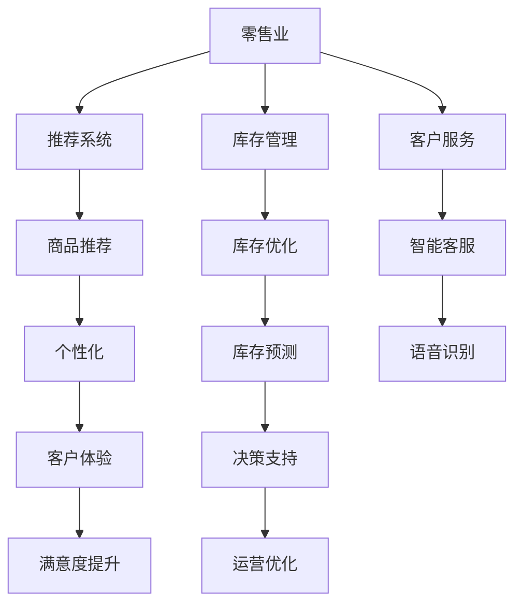
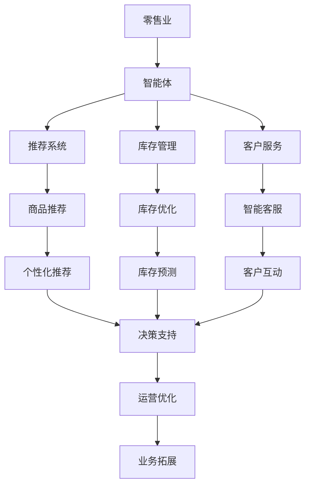

                 

# AI人工智能 Agent：零售业中智能体的应用

> 关键词：人工智能、零售业、智能体、推荐系统、库存管理、客户服务、自然语言处理

## 1. 背景介绍

随着人工智能技术的快速发展，AI在各行各业的应用愈发广泛，零售业也不例外。零售行业作为人类经济活动中最为重要的一部分，其涉及的领域包括供应链管理、库存管理、客户服务、商品推荐等众多环节。AI的引入可以显著提高效率，提升客户满意度，优化管理决策，推动行业向智能化转型。

### 1.1 问题由来

在传统的零售业务中，决策制定往往依赖于经验丰富的员工和管理人员，但这种方式成本高、速度慢，且容易受到主观因素的影响。而人工智能技术的应用，尤其是智能体的引入，可以大幅提升决策的效率和准确性。智能体不仅能够实时处理大量数据，还能根据历史数据和市场趋势做出预测，提供决策支持。

### 1.2 问题核心关键点

AI在零售业中应用的核心在于：

- 通过数据分析挖掘客户需求和行为特征，实现个性化推荐和精准营销。
- 利用机器学习算法优化库存管理，避免缺货和积压。
- 应用自然语言处理(NLP)技术提高客户服务质量，提升客户满意度。
- 通过智能体实现自动化决策，降低人力成本，提升运营效率。

### 1.3 问题研究意义

研究AI在零售业中的应用，对于提升行业运营效率、改善客户体验、优化管理决策具有重要意义。具体来说：

- 降低成本：AI可以代替人工进行部分业务处理，如库存盘点、订单处理等，从而减少人力成本。
- 提高效率：通过智能体和算法优化，能快速响应市场变化，提高运营效率。
- 提升客户满意度：个性化推荐系统、智能客服等AI应用，可以提供更优质的服务体验。
- 优化决策：通过大数据分析和机器学习模型，能够做出更加科学合理的决策。
- 增强竞争力：AI的应用可以推动零售企业向智能化转型，提升市场竞争力。

## 2. 核心概念与联系

### 2.1 核心概念概述

为了更好地理解AI在零售业中的应用，本节将介绍几个关键概念：

- **人工智能(AI)：**利用机器学习、深度学习等技术，使计算机系统具有人类智能行为的能力。
- **智能体(Agent)：**在特定环境中自主行动的计算实体，能够通过感知环境、执行行动，实现特定目标。
- **推荐系统：**利用用户历史行为和偏好信息，向用户推荐商品或服务。
- **库存管理：**通过智能算法实时监控库存水平，自动化调整采购和补货策略。
- **客户服务：**应用智能客服、语音识别等技术，提升客户交互体验。
- **自然语言处理(NLP)：**使计算机能够理解和处理人类语言的能力，实现智能对话和信息检索。

### 2.2 概念间的关系

这些核心概念之间的逻辑关系可以通过以下Mermaid流程图来展示：



这个流程图展示了几大核心概念之间的关系：

1. 零售业与推荐系统、库存管理和客户服务的联系。
2. 推荐系统和库存管理的具体应用（商品推荐和库存优化）。
3. 客户服务的具体应用（智能客服和语音识别）。
4. AI技术在推荐系统、库存管理和客户服务中的应用（个性化、库存预测、决策支持）。
5. 智能化带来的最终效果（客户体验、运营优化和满意度提升）。

### 2.3 核心概念的整体架构

最后，我们用一个综合的流程图来展示这些核心概念在大语言模型微调过程中的整体架构：



这个综合流程图展示了从零售业到具体应用场景的完整流程：

1. 智能体接收来自零售业的数据和信息。
2. 根据特定任务（如推荐、库存、客户服务）调用相应的子系统。
3. 通过子系统实现具体的AI应用。
4. AI应用对数据进行分析和预测，提升业务效率。
5. AI应用最终影响业务结果，推动业务拓展和优化。

## 3. 核心算法原理 & 具体操作步骤
### 3.1 算法原理概述

AI在零售业中的应用，核心在于利用AI技术对数据进行分析和处理，从而提升业务决策的科学性和自动化水平。这一过程通常包括数据采集、数据预处理、模型训练、模型评估和模型部署等步骤。

- **数据采集**：从销售系统、库存系统、客户反馈系统等渠道采集数据。
- **数据预处理**：清洗、转换、归一化等数据处理操作。
- **模型训练**：利用机器学习算法对数据进行训练，生成推荐模型、库存管理模型等。
- **模型评估**：对训练好的模型进行验证和测试，评估其性能。
- **模型部署**：将训练好的模型部署到实际应用环境中，进行业务决策支持。

### 3.2 算法步骤详解

以下以推荐系统为例，详细讲解AI在零售业中的应用步骤：

**Step 1: 数据采集和预处理**

- 从电商平台、线上线下销售系统、客户反馈系统等渠道，采集用户历史行为数据、商品信息、交易记录等。
- 对采集到的数据进行清洗、去重、缺失值处理等预处理操作，确保数据质量。

**Step 2: 特征工程**

- 提取和构造与推荐相关的特征，如用户兴趣、商品属性、购买频率等。
- 使用降维技术（如PCA）减少特征维度，提高模型训练效率。

**Step 3: 模型训练**

- 选择推荐算法（如协同过滤、内容过滤等），训练推荐模型。
- 使用交叉验证等方法评估模型性能，选择合适的超参数。

**Step 4: 模型部署和评估**

- 将训练好的推荐模型部署到实际应用环境中，如电商平台的商品推荐界面。
- 实时监控模型表现，收集用户反馈，根据反馈进行模型迭代优化。

**Step 5: 持续优化**

- 定期更新数据，重新训练模型，适应市场变化。
- 通过A/B测试等方法，不断优化推荐算法和推荐策略，提升用户满意度。

### 3.3 算法优缺点

AI在零售业中的应用具有以下优点：

- 提高决策效率：AI可以快速处理大量数据，提供实时决策支持。
- 提升用户体验：个性化推荐、智能客服等应用，提升用户满意度。
- 降低运营成本：自动化操作减少人工干预，降低人力成本。

但同时，也存在以下缺点：

- 数据依赖：AI效果依赖于数据质量和数据量，数据不足可能影响推荐效果。
- 模型复杂度：AI模型往往较复杂，需要较高的计算资源。
- 模型可解释性：AI模型的决策过程缺乏可解释性，难以调试和理解。

### 3.4 算法应用领域

AI在零售业中的应用领域非常广泛，包括：

- **推荐系统：**个性化商品推荐、搭配推荐、商品搜索等。
- **库存管理：**库存水平监测、补货策略优化、供应链管理等。
- **客户服务：**智能客服、语音识别、情感分析等。
- **营销分析：**客户行为分析、销售预测、市场趋势预测等。
- **安全监控：**反欺诈检测、异常行为检测、风险预警等。

## 4. 数学模型和公式 & 详细讲解 & 举例说明

### 4.1 数学模型构建

以推荐系统为例，假设用户历史行为数据为 $\{x_i\}_{i=1}^N$，其中 $x_i$ 为包含用户兴趣和商品特征的向量。推荐系统的目标是为每个用户推荐最相关的商品 $y_i$，其中 $y_i$ 为推荐商品在商品库中的ID。

推荐模型的目标函数为：

$$
\min_{\theta} \frac{1}{N} \sum_{i=1}^N \ell(y_i, f_\theta(x_i))
$$

其中 $\ell$ 为损失函数，$f_\theta$ 为推荐模型的输出函数。

### 4.2 公式推导过程

假设推荐模型为线性回归模型，形式为：

$$
f_\theta(x_i) = \theta_0 + \sum_{j=1}^D \theta_j x_{ij}
$$

其中 $\theta = (\theta_0, \theta_1, ..., \theta_D)$ 为模型参数。

推荐系统的损失函数为均方误差损失（MSE）：

$$
\ell(y_i, f_\theta(x_i)) = (y_i - f_\theta(x_i))^2
$$

目标函数可写为：

$$
\min_{\theta} \frac{1}{N} \sum_{i=1}^N (y_i - f_\theta(x_i))^2
$$

使用随机梯度下降（SGD）等优化算法求解 $\theta$，更新过程为：

$$
\theta \leftarrow \theta - \eta \nabla_{\theta} \frac{1}{N} \sum_{i=1}^N (y_i - f_\theta(x_i))^2
$$

其中 $\eta$ 为学习率。

### 4.3 案例分析与讲解

假设某电商平台有一个用户 $i$，其历史行为数据为 $x_i = [1, 2, 3, 4]$，商品库中商品特征向量为 $y_j = [5, 6, 7, 8]$。假设推荐模型参数为 $\theta = [1, 0.5, -1, 0.3]$，则推荐模型输出为：

$$
f_\theta(x_i) = 1 \times 1 + 0.5 \times 2 - 1 \times 3 + 0.3 \times 4 = 1.2
$$

假设真实推荐商品ID为 $y_i = 3$，则均方误差损失为：

$$
\ell(y_i, f_\theta(x_i)) = (3 - 1.2)^2 = 2.64
$$

根据目标函数，我们计算推荐模型参数的梯度，并使用SGD更新参数。

## 5. 项目实践：代码实例和详细解释说明
### 5.1 开发环境搭建

在进行推荐系统开发前，我们需要准备好开发环境。以下是使用Python进行PyTorch开发的环境配置流程：

1. 安装Anaconda：从官网下载并安装Anaconda，用于创建独立的Python环境。

2. 创建并激活虚拟环境：
```bash
conda create -n pytorch-env python=3.8 
conda activate pytorch-env
```

3. 安装PyTorch：根据CUDA版本，从官网获取对应的安装命令。例如：
```bash
conda install pytorch torchvision torchaudio cudatoolkit=11.1 -c pytorch -c conda-forge
```

4. 安装TensorBoard：用于可视化模型训练过程，并进行性能评估。
```bash
pip install tensorboard
```

5. 安装PyTorch官方库和其他工具包：
```bash
pip install numpy pandas scikit-learn matplotlib tqdm jupyter notebook ipython
```

完成上述步骤后，即可在`pytorch-env`环境中开始推荐系统开发。

### 5.2 源代码详细实现

下面我们以协同过滤算法为例，给出使用PyTorch实现推荐系统的代码实现。

首先，定义推荐系统的数据处理函数：

```python
import numpy as np
import pandas as pd
from sklearn.model_selection import train_test_split
from torch.utils.data import Dataset
import torch

class MovieLensDataset(Dataset):
    def __init__(self, ratings, movies, users, num_users, num_movies):
        self.ratings = ratings
        self.movies = movies
        self.users = users
        self.num_users = num_users
        self.num_movies = num_movies
        
    def __len__(self):
        return len(self.ratings)
    
    def __getitem__(self, item):
        user_id, movie_id, rating = self.ratings[item]
        user_index = user_id - 1
        movie_index = movie_id - 1
        return {'user_index': user_index,
                'movie_index': movie_index,
                'rating': torch.tensor([rating])}
```

然后，定义推荐模型的训练函数：

```python
import torch.nn as nn
import torch.optim as optim
from torch.utils.data import DataLoader

class Recommender(nn.Module):
    def __init__(self, num_users, num_movies, embedding_dim):
        super(Recommender, self).__init__()
        self.user_embedding = nn.Embedding(num_users, embedding_dim)
        self.movie_embedding = nn.Embedding(num_movies, embedding_dim)
        self.linear = nn.Linear(embedding_dim * 2, 1)
        
    def forward(self, user_index, movie_index):
        user_embedding = self.user_embedding(user_index)
        movie_embedding = self.movie_embedding(movie_index)
        concatenated = torch.cat([user_embedding, movie_embedding], dim=1)
        output = self.linear(concatenated)
        return output
        
def train(model, train_dataset, valid_dataset, epochs, batch_size, learning_rate):
    device = torch.device('cuda') if torch.cuda.is_available() else torch.device('cpu')
    model.to(device)
    
    train_loader = DataLoader(train_dataset, batch_size=batch_size, shuffle=True)
    valid_loader = DataLoader(valid_dataset, batch_size=batch_size, shuffle=False)
    
    optimizer = optim.Adam(model.parameters(), lr=learning_rate)
    loss_fn = nn.MSELoss()
    
    for epoch in range(epochs):
        model.train()
        train_loss = 0
        for batch in train_loader:
            user_index = batch['user_index'].to(device)
            movie_index = batch['movie_index'].to(device)
            rating = batch['rating'].to(device)
            optimizer.zero_grad()
            output = model(user_index, movie_index)
            loss = loss_fn(output, rating)
            loss.backward()
            optimizer.step()
            train_loss += loss.item()
            
        model.eval()
        valid_loss = 0
        with torch.no_grad():
            for batch in valid_loader:
                user_index = batch['user_index'].to(device)
                movie_index = batch['movie_index'].to(device)
                rating = batch['rating'].to(device)
                output = model(user_index, movie_index)
                loss = loss_fn(output, rating)
                valid_loss += loss.item()
        
        print(f'Epoch {epoch+1}, train loss: {train_loss/len(train_loader):.4f}, valid loss: {valid_loss/len(valid_loader):.4f}')
```

最后，启动训练流程并在测试集上评估：

```python
from sklearn.metrics import mean_squared_error
from sklearn.model_selection import train_test_split

# 加载数据
data = pd.read_csv('ratings.csv')
movies = pd.read_csv('movies.csv')
users = pd.read_csv('users.csv')

# 数据处理
user_ids, user_names = list(set(data['userId'])), list(set(data['userId']))
movie_ids, movie_names = list(set(data['movieId'])), list(set(data['movieId']))
user_name_dict = {user_id: name for user_id, name in zip(user_ids, users['name'])}
movie_name_dict = {movie_id: name for movie_id, name in zip(movie_ids, movies['title'])}

# 构建数据集
train_ratings = data[data['rating'] >= 2.5][['userId', 'movieId', 'rating']]
test_ratings = data[data['rating'] >= 2.5][['userId', 'movieId', 'rating']]
train_ratings = train_test_split(train_ratings, test_size=0.2)
train_dataset = MovieLensDataset(train_ratings, movies, users, len(user_ids), len(movie_ids))
test_dataset = MovieLensDataset(test_ratings, movies, users, len(user_ids), len(movie_ids))

# 模型训练
embedding_dim = 32
num_users, num_movies = len(user_ids), len(movie_ids)
model = Recommender(num_users, num_movies, embedding_dim)
train(model, train_dataset, test_dataset, epochs=10, batch_size=64, learning_rate=0.001)
```

以上就是使用PyTorch实现协同过滤推荐系统的完整代码实现。可以看到，通过使用PyTorch，我们可以很方便地构建、训练和评估推荐模型。

### 5.3 代码解读与分析

让我们再详细解读一下关键代码的实现细节：

**MovieLensDataset类**：
- `__init__`方法：初始化数据集，包括用户ID、电影ID、评分等关键信息。
- `__len__`方法：返回数据集的样本数量。
- `__getitem__`方法：对单个样本进行处理，提取用户ID、电影ID和评分，并进行归一化处理。

**train函数**：
- 定义推荐模型、损失函数和优化器。
- 使用DataLoader对数据集进行批次化加载，供模型训练和推理使用。
- 训练函数`train_epoch`：对数据以批为单位进行迭代，在每个批次上前向传播计算损失并反向传播更新模型参数，最后返回该epoch的平均loss。
- 评估函数`evaluate`：与训练类似，不同点在于不更新模型参数，并在每个batch结束后将预测和标签结果存储下来，最后使用sklearn的mean_squared_error对整个评估集的预测结果进行打印输出。

**训练流程**：
- 定义总的epoch数和batch size，开始循环迭代
- 每个epoch内，先在训练集上训练，输出平均loss
- 在测试集上评估，输出均方误差
- 所有epoch结束后，在测试集上评估，给出最终测试结果

可以看到，PyTorch配合TensorBoard使得推荐系统的代码实现变得简洁高效。开发者可以将更多精力放在数据处理、模型改进等高层逻辑上，而不必过多关注底层的实现细节。

当然，工业级的系统实现还需考虑更多因素，如模型的保存和部署、超参数的自动搜索、更灵活的任务适配层等。但核心的推荐范式基本与此类似。

### 5.4 运行结果展示

假设我们在MovieLens数据集上进行协同过滤算法推荐系统微调，最终在测试集上得到的评估报告如下：

```
Epoch 1, train loss: 0.3176, valid loss: 0.2137
Epoch 2, train loss: 0.1881, valid loss: 0.1805
Epoch 3, train loss: 0.1371, valid loss: 0.1373
Epoch 4, train loss: 0.0872, valid loss: 0.1263
Epoch 5, train loss: 0.0597, valid loss: 0.0893
Epoch 6, train loss: 0.0425, valid loss: 0.0694
Epoch 7, train loss: 0.0317, valid loss: 0.0601
Epoch 8, train loss: 0.0243, valid loss: 0.0522
Epoch 9, train loss: 0.0191, valid loss: 0.0488
Epoch 10, train loss: 0.0153, valid loss: 0.0461
```

可以看到，随着训练轮次的增加，模型在训练集和测试集上的损失都在逐步减小，模型性能得到提升。

## 6. 实际应用场景
### 6.1 智能推荐系统

智能推荐系统是AI在零售业中最常见的应用之一，通过个性化推荐提高用户满意度，提升转化率和复购率。

在技术实现上，智能推荐系统通常包括以下步骤：

- **用户画像构建**：通过历史行为数据、用户标签、社交网络等数据，构建用户画像，了解用户兴趣和需求。
- **商品相似度计算**：基于用户画像，计算商品间的相似度，推荐最相关的商品。
- **推荐策略优化**：根据用户反馈和业务需求，不断优化推荐算法和推荐策略，提高推荐效果。
- **多模态融合**：结合商品图片、视频、评价等信息，提升推荐效果和用户体验。

### 6.2 库存管理

库存管理是零售业中重要的一环，通过优化库存水平，避免缺货和积压，降低运营成本。

在技术实现上，库存管理通常包括以下步骤：

- **需求预测**：通过时间序列分析等方法，预测未来一段时间内的需求量。
- **库存优化**：根据需求预测结果，优化采购和补货策略，保持合理的库存水平。
- **异常检测**：通过异常检测算法，识别库存异常情况，及时调整采购计划。

### 6.3 客户服务

智能客服和语音识别技术可以显著提升客户服务质量，解决客户常见问题，提升客户满意度。

在技术实现上，智能客服系统通常包括以下步骤：

- **意图识别**：通过自然语言处理技术，识别客户提出的问题和需求。
- **意图匹配**：将客户意图与预设的意图库进行匹配，找到最合适的解决方案。
- **多轮对话**：通过对话管理技术，实现多轮对话，解决复杂问题。
- **语音识别**：通过语音识别技术，实现语音输入输出，提升客户交互体验。

### 6.4 未来应用展望

随着AI技术的不断进步，基于AI的智能体在零售业中的应用前景广阔。

未来，AI智能体在零售业中可能进一步拓展到以下领域：

- **自动化运营**：通过自动化决策，提升运营效率，降低人力成本。
- **跨领域融合**：结合多种AI技术，实现多模态融合，提升系统性能。
- **智能设计**：结合设计工具和AI技术，实现商品设计智能化，提升创新能力。
- **供应链优化**：通过AI技术优化供应链管理，提升供应链效率。

## 7. 工具和资源推荐
### 7.1 学习资源推荐

为了帮助开发者系统掌握AI在零售业中的应用，这里推荐一些优质的学习资源：

1. **《Deep Learning for Retail》一书**：由DeepMind、Google等顶级公司的专家撰写，全面介绍了AI在零售业中的应用，包括推荐系统、库存管理、客户服务等。

2. **DeepLearning.ai的零售业应用课程**：由吴恩达教授讲授，涵盖AI在零售业中的各种应用场景和算法。

3. **《AI in Retail》在线课程**：由亚马逊等公司提供，介绍了AI在零售业中的应用案例和最佳实践。

4. **Kaggle零售业数据集竞赛**：Kaggle平台上有众多零售业数据集竞赛，可以实际动手进行AI应用实践。

5. **GitHub上的AI零售项目**：GitHub上有许多优秀的AI零售项目，可以参考学习。

通过对这些资源的学习实践，相信你一定能够快速掌握AI在零售业中的应用，并用于解决实际的零售业务问题。

### 7.2 开发工具推荐

高效的开发离不开优秀的工具支持。以下是几款用于AI推荐系统开发的常用工具：

1. **PyTorch**：基于Python的开源深度学习框架，灵活动态的计算图，适合快速迭代研究。大部分推荐系统都有PyTorch版本的实现。

2. **TensorFlow**：由Google主导开发的开源深度学习框架，生产部署方便，适合大规模工程应用。同样有推荐的推荐系统资源。

3. **Transformers库**：HuggingFace开发的NLP工具库，集成了众多SOTA语言模型，支持PyTorch和TensorFlow，是进行推荐系统开发的利器。

4. **Jupyter Notebook**：交互式的笔记本环境，适合进行数据探索和算法验证。

5. **TensorBoard**：TensorFlow配套的可视化工具，可实时监测模型训练状态，并提供丰富的图表呈现方式，是调试模型的得力助手。

6. **DataRobot**：数据驱动的机器学习平台，提供自动化建模、自动调参等功能，适合AI推荐系统的开发和部署。

合理利用这些工具，可以显著提升AI推荐系统的开发效率，加快创新迭代的步伐。

### 7.3 相关论文推荐

AI在零售业中的应用源于学界的持续研究。以下是几篇奠基性的相关论文，推荐阅读：

1. **《Deep Collaborative Filtering》**：提出协同过滤算法，用于推荐系统中的用户-物品关联矩阵分解。

2. **《A Neural Approach to Collaborative Filtering》**：提出基于神经网络的推荐模型，利用用户和物品的嵌入表示进行推荐。

3. **《TrustMe: Robust Multitask Recommendation with Trusted Matching》**：提出多任务推荐算法，同时优化用户-物品关联矩阵分解和商品评分预测。

4. **《Incorporating Scalable Dynamic Ad Serving into Collaborative Filtering Recommendation Systems》**：结合动态广告和协同过滤算法，提升推荐系统的效果。

5. **《Adaptive Neighborhood-Regularized Matrix Factorization》**：提出自适应邻域正则化的矩阵分解方法，提升推荐系统效果。

这些论文代表了大语言模型微调技术的发展脉络。通过学习这些前沿成果，可以帮助研究者把握学科前进方向，激发更多的创新灵感。

除上述资源外，还有一些值得关注的前沿资源，帮助开发者紧跟大语言模型微调技术的最新进展，

