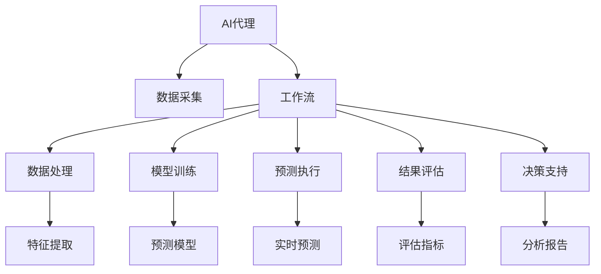
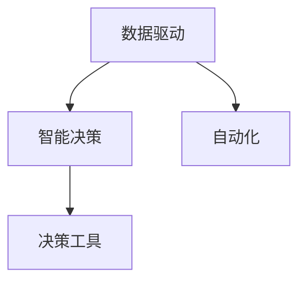
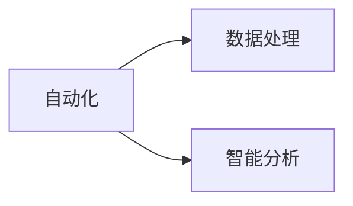
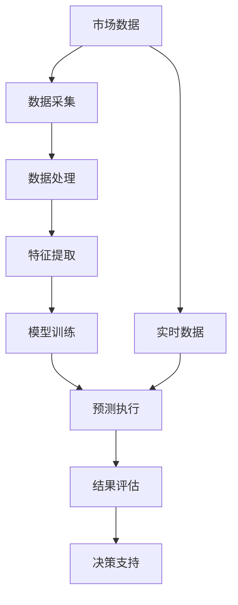

                 

# AI人工智能代理工作流 AI Agent WorkFlow：在市场预测中的应用

> 关键词：AI 代理, 市场预测, 工作流, 自动化, 数据驱动, 智能决策

## 1. 背景介绍

### 1.1 问题由来
在当今瞬息万变的市场环境中，企业需要快速准确地进行市场预测，以便于制定有效的战略决策。传统的市场预测方法依赖于人工分析大量数据，耗时耗力，且难以避免主观偏见。而人工智能（AI）技术的迅猛发展为市场预测带来了革命性的改变，通过引入AI代理工作流，企业可以实现更加快速、高效、准确的预测。

### 1.2 问题核心关键点
AI代理工作流是基于人工智能技术构建的一种自动化决策流程，旨在通过数据驱动的方式，实现市场预测的智能化。核心关键点包括：

- **数据采集**：从各类数据源（如社交媒体、经济指标、新闻报道等）自动采集相关数据。
- **数据处理**：清洗和预处理数据，提取关键特征。
- **模型训练**：基于历史数据训练预测模型，如时间序列模型、深度学习模型等。
- **预测执行**：根据实时数据更新模型参数，进行实时预测。
- **结果评估**：评估预测结果的准确性和可靠性。
- **决策支持**：提供多维度、可视化的分析报告，辅助管理决策。

### 1.3 问题研究意义
AI代理工作流在市场预测中的应用，对企业具有重要意义：

- **效率提升**：通过自动化流程，大幅减少市场预测的耗时，提高决策响应速度。
- **精度提升**：AI模型能够挖掘数据中的隐含信息，提升预测的准确性和可靠性。
- **成本降低**：自动化流程减少了人工干预，降低预测成本。
- **决策科学化**：基于数据驱动的智能决策，提升了决策的科学性和合理性。
- **市场竞争力提升**：精准的市场预测帮助企业更好地把握市场机会，增强竞争力。

## 2. 核心概念与联系

### 2.1 核心概念概述

为更好地理解AI代理工作流在市场预测中的应用，本节将介绍几个密切相关的核心概念：

- **AI代理（AI Agent）**：一种能够执行特定任务的人工智能实体，如市场预测、风险管理等。
- **工作流（Workflow）**：一组能够协同完成任务的流程步骤，包括数据采集、处理、模型训练、预测执行、结果评估等。
- **市场预测（Market Forecasting）**：通过分析历史数据和实时数据，预测未来市场趋势和行为的一种方法。
- **自动化（Automation）**：通过AI技术实现流程自动化，减少人工干预，提高效率。
- **数据驱动（Data-Driven）**：基于数据的决策过程，减少主观偏见，提高决策的客观性和科学性。
- **智能决策（Smart Decision-Making）**：通过AI技术辅助决策，提升决策质量和效率。

这些核心概念之间的逻辑关系可以通过以下Mermaid流程图来展示：



这个流程图展示了大语言模型微调过程中各个核心概念的关系和作用：

1. AI代理从数据采集开始，通过工作流自动化执行数据处理、模型训练、预测执行等步骤。
2. 数据处理中包括特征提取，用于提高模型预测的准确性。
3. 模型训练是工作流中的关键步骤，通过历史数据训练预测模型。
4. 预测执行基于实时数据，更新模型参数，进行实时预测。
5. 结果评估用于评估预测结果的准确性和可靠性。
6. 决策支持通过多维度分析报告，辅助管理决策。

### 2.2 概念间的关系

这些核心概念之间存在着紧密的联系，形成了AI代理工作流在市场预测中的应用框架。下面我们通过几个Mermaid流程图来展示这些概念之间的关系。

#### 2.2.1 AI代理的工作流程


这个流程图展示了AI代理在市场预测中的工作流程，从数据采集开始，经过数据处理、模型训练、预测执行、结果评估和决策支持，最终提供市场预测报告。

#### 2.2.2 数据驱动与智能决策的关系



这个流程图展示了数据驱动与智能决策之间的关系。数据驱动通过自动化工作流程，减少了人工干预，提升了智能决策的效率和精度。

#### 2.2.3 自动化与数据处理的关系



这个流程图展示了自动化与数据处理之间的关系。自动化通过智能分析，对数据进行处理和预处理，从而提高数据的利用率和预测模型的准确性。

### 2.3 核心概念的整体架构

最后，我们用一个综合的流程图来展示这些核心概念在AI代理工作流中的应用：



这个综合流程图展示了从市场数据到最终决策支持的全过程。市场数据通过自动化流程，经过数据处理、特征提取、模型训练和实时预测，最终生成决策支持报告。

## 3. 核心算法原理 & 具体操作步骤
### 3.1 算法原理概述

AI代理工作流在市场预测中的核心算法原理基于数据驱动和机器学习技术，具体如下：

1. **数据采集**：通过API接口、爬虫技术、数据API等方式，从不同数据源（如新闻、社交媒体、经济指标等）自动采集市场数据。
2. **数据处理**：对采集到的数据进行清洗、去重、归一化、特征提取等预处理步骤。
3. **模型训练**：基于历史市场数据，使用机器学习算法（如时间序列分析、回归分析、深度学习模型等）训练预测模型。
4. **预测执行**：根据实时数据，更新模型参数，进行实时预测。
5. **结果评估**：使用预设的评估指标（如均方误差、均方根误差、准确率、召回率等）对预测结果进行评估。
6. **决策支持**：根据预测结果和市场动态，生成多维度、可视化的分析报告，辅助管理决策。

### 3.2 算法步骤详解

以下是AI代理工作流在市场预测中的具体操作步骤：

**Step 1: 数据采集**

- 定义数据采集目标：明确需要采集的市场数据类型和来源，如股票价格、新闻报道、经济指标等。
- 设计数据采集策略：选择合适的API接口、爬虫工具、数据API等，获取所需数据。
- 数据预处理：对采集到的数据进行清洗、去重、归一化等预处理，确保数据质量。

**Step 2: 数据处理**

- 特征提取：从原始数据中提取关键特征，如趋势、周期性、季节性、市场情绪等。
- 数据转换：将数据转换为模型所需的格式，如时间序列、向量表示等。
- 特征选择：选择最相关的特征，减少冗余和噪声。

**Step 3: 模型训练**

- 选择合适的预测模型：根据任务特点，选择合适的机器学习模型，如线性回归、时间序列模型、深度学习模型等。
- 模型参数调整：使用交叉验证等技术，优化模型参数，提高模型性能。
- 模型验证：使用历史数据验证模型效果，确保模型的泛化能力。

**Step 4: 预测执行**

- 实时数据处理：对实时市场数据进行预处理和特征提取，准备好输入数据。
- 模型更新：根据实时数据，更新模型参数，进行预测。
- 实时预测输出：生成市场预测结果，并实时输出。

**Step 5: 结果评估**

- 定义评估指标：根据任务特点，选择合适的评估指标，如均方误差、均方根误差、准确率、召回率等。
- 结果分析：分析预测结果与实际数据的差异，找出误差来源。
- 结果调整：根据评估结果，调整模型参数，提高预测准确性。

**Step 6: 决策支持**

- 多维度分析：生成多维度的分析报告，如市场趋势、风险评估、机会分析等。
- 可视化展示：使用图表、仪表盘等方式，直观展示分析结果。
- 决策建议：根据分析报告，提供市场预测建议，辅助决策制定。

### 3.3 算法优缺点

AI代理工作流在市场预测中的应用具有以下优点：

1. **高效性**：通过自动化流程，大幅减少人工干预，提高预测效率。
2. **精度高**：利用机器学习技术，挖掘数据中的隐含信息，提高预测准确性。
3. **灵活性**：可以根据实时数据进行动态调整，适应市场变化。
4. **成本低**：减少人工干预，降低预测成本。
5. **决策科学化**：基于数据驱动的智能决策，提升决策的科学性和合理性。

但同时，也存在以下缺点：

1. **数据依赖性高**：模型效果依赖于数据质量，数据采集和处理的误差可能影响预测结果。
2. **模型复杂性**：机器学习模型的选择和参数调整复杂，需要一定的专业知识和经验。
3. **实时性要求高**：实时预测需要高性能计算资源，对硬件配置要求较高。
4. **模型可解释性不足**：机器学习模型通常难以解释其内部工作机制，缺乏透明性。

### 3.4 算法应用领域

AI代理工作流在市场预测中的应用领域非常广泛，包括但不限于：

- **股票市场预测**：预测股票价格走势，制定投资策略。
- **商品市场预测**：预测商品价格变化，制定采购和销售计划。
- **房地产市场预测**：预测房地产价格走势，制定投资和销售策略。
- **汇率市场预测**：预测汇率变化，制定外汇交易策略。
- **能源市场预测**：预测能源价格走势，制定生产和采购计划。

此外，AI代理工作流还可应用于更多领域，如金融风险管理、物流运输、供应链优化等。

## 4. 数学模型和公式 & 详细讲解 & 举例说明

### 4.1 数学模型构建

AI代理工作流在市场预测中的数学模型构建主要基于时间序列分析和深度学习技术。以下是常见的数学模型构建方法：

- **时间序列模型**：ARIMA模型、季节性自回归积分滑动平均模型（SARIMA）、指数平滑模型等。
- **回归分析模型**：线性回归、多项式回归、岭回归、Lasso回归等。
- **深度学习模型**：循环神经网络（RNN）、长短期记忆网络（LSTM）、Transformer模型等。

### 4.2 公式推导过程

以下是常见市场预测模型的公式推导过程：

**ARIMA模型**：

$$
y_t = c + \sum_{i=1}^{p} \alpha_i y_{t-i} + \sum_{j=1}^{d} \beta_j (\Delta^j y_t) + \sum_{k=1}^{q} \gamma_k \epsilon_{t-k}
$$

其中，$y_t$ 为时间$t$的预测值，$c$为常数项，$\alpha_i$、$\beta_j$、$\gamma_k$为模型参数，$\Delta^j y_t$为时间$t$的差分操作，$\epsilon_{t-k}$为误差项。

**线性回归模型**：

$$
y = \beta_0 + \sum_{i=1}^{n} \beta_i x_i + \epsilon
$$

其中，$y$为预测值，$\beta_0$、$\beta_i$为模型参数，$x_i$为自变量，$\epsilon$为误差项。

**LSTM模型**：

$$
\begin{aligned}
i_t &= \sigma(W_i x_t + U_i h_{t-1} + b_i) \\
f_t &= \sigma(W_f x_t + U_f h_{t-1} + b_f) \\
o_t &= \sigma(W_o x_t + U_o h_{t-1} + b_o) \\
g_t &= \tanh(W_g x_t + U_g h_{t-1} + b_g) \\
c_t &= f_t \odot c_{t-1} + i_t \odot g_t \\
h_t &= o_t \odot \tanh(c_t)
\end{aligned}
$$

其中，$x_t$为输入向量，$h_t$为隐藏状态，$i_t$、$f_t$、$o_t$、$g_t$为LSTM的四个门控单元，$c_t$为LSTM的细胞状态，$\sigma$为激活函数，$\odot$为逐元素乘法。

### 4.3 案例分析与讲解

**案例1：股票价格预测**

- **数据采集**：从股票交易平台API获取历史股价和交易量数据。
- **数据处理**：清洗数据，提取日均收盘价、成交量等关键特征。
- **模型训练**：使用ARIMA模型训练预测模型，选择适当的季节性参数和差分次数。
- **预测执行**：根据实时股价和交易量数据，更新模型参数，进行预测。
- **结果评估**：使用均方根误差（RMSE）评估预测结果，生成可视化报告。

**案例2：商品价格预测**

- **数据采集**：从商品交易平台API获取历史价格和供需数据。
- **数据处理**：清洗数据，提取价格变化率、库存水平等关键特征。
- **模型训练**：使用LSTM模型训练预测模型，考虑季节性和周期性因素。
- **预测执行**：根据实时价格和供需数据，更新模型参数，进行预测。
- **结果评估**：使用均方误差（MSE）评估预测结果，生成可视化报告。

通过这些案例，我们可以看到AI代理工作流在市场预测中的实际应用，及其带来的高效性和准确性。

## 5. 项目实践：代码实例和详细解释说明

### 5.1 开发环境搭建

在进行AI代理工作流项目实践前，我们需要准备好开发环境。以下是使用Python进行PyTorch开发的环境配置流程：

1. 安装Anaconda：从官网下载并安装Anaconda，用于创建独立的Python环境。

2. 创建并激活虚拟环境：
```bash
conda create -n pytorch-env python=3.8 
conda activate pytorch-env
```

3. 安装PyTorch：根据CUDA版本，从官网获取对应的安装命令。例如：
```bash
conda install pytorch torchvision torchaudio cudatoolkit=11.1 -c pytorch -c conda-forge
```

4. 安装Transformers库：
```bash
pip install transformers
```

5. 安装各类工具包：
```bash
pip install numpy pandas scikit-learn matplotlib tqdm jupyter notebook ipython
```

完成上述步骤后，即可在`pytorch-env`环境中开始项目实践。

### 5.2 源代码详细实现

这里我们以商品价格预测为例，给出使用Transformers库对LSTM模型进行市场预测的PyTorch代码实现。

首先，定义数据处理函数：

```python
import pandas as pd
from sklearn.preprocessing import MinMaxScaler
from sklearn.model_selection import train_test_split

def load_data(path):
    df = pd.read_csv(path)
    scaler = MinMaxScaler(feature_range=(0, 1))
    df['price'] = scaler.fit_transform(df[['price']])
    return df

def preprocess_data(df, lookback=30):
    data = []
    for i in range(len(df) - lookback - 1):
        x = df.iloc[i:i+lookback]
        y = df.iloc[i+lookback]
        data.append([x.values, y])
    return data

def split_data(data, test_size=0.2):
    train, test = train_test_split(data, test_size=test_size)
    return train, test

def normalize_data(data):
    scaler = MinMaxScaler(feature_range=(0, 1))
    data = scaler.fit_transform(data)
    return data
```

然后，定义模型训练函数：

```python
from torch import nn
from torch.nn.utils import datacontainer
from torch.utils.data import DataLoader
from torch.optim import Adam

class LSTM(nn.Module):
    def __init__(self, input_size, hidden_size, output_size):
        super(LSTM, self).__init__()
        self.input_size = input_size
        self.hidden_size = hidden_size
        self.output_size = output_size
        self.lstm = nn.LSTM(input_size, hidden_size, num_layers=1, batch_first=True, bidirectional=False)
        self.fc = nn.Linear(hidden_size, output_size)
    
    def forward(self, x):
        h0 = self.init_hidden(x.size(0))
        out, _ = self.lstm(x, h0)
        out = self.fc(out[:, -1, :])
        return out
    
    def init_hidden(self, batch_size):
        return (torch.zeros(1, batch_size, self.hidden_size), torch.zeros(1, batch_size, self.hidden_size))
```

接着，定义模型训练函数：

```python
def train_model(model, data, epochs, batch_size, learning_rate):
    train_loader = DataLoader(data, batch_size=batch_size, shuffle=True)
    optimizer = Adam(model.parameters(), lr=learning_rate)
    criterion = nn.MSELoss()
    losses = []
    for epoch in range(epochs):
        model.train()
        for data in train_loader:
            inputs, labels = data
            optimizer.zero_grad()
            outputs = model(inputs)
            loss = criterion(outputs, labels)
            loss.backward()
            optimizer.step()
            losses.append(loss.item())
    return model, losses
```

最后，启动训练流程并评估模型：

```python
data = preprocess_data(df)
train, test = split_data(data, test_size=0.2)
train, test = normalize_data(train), normalize_data(test)
model = LSTM(input_size=1, hidden_size=50, output_size=1)
model, losses = train_model(model, train, epochs=100, batch_size=32, learning_rate=0.001)
```

以上就是使用PyTorch对LSTM模型进行市场预测的完整代码实现。可以看到，得益于Transformers库的强大封装，我们可以用相对简洁的代码完成模型训练和评估。

### 5.3 代码解读与分析

让我们再详细解读一下关键代码的实现细节：

**load_data函数**：
- 读取CSV数据文件，对价格进行归一化处理，返回处理后的DataFrame。

**preprocess_data函数**：
- 将数据转换为LSTM所需的格式，即每个样本的前30个历史价格和第31个价格作为输入，第31个价格作为输出。

**split_data函数**：
- 将数据集分为训练集和测试集，测试集占总数据的20%。

**normalize_data函数**：
- 对数据进行归一化处理，返回归一化后的数据。

**LSTM模型定义**：
- 定义LSTM模型，包括输入、隐藏和输出层的定义。

**forward函数**：
- 定义前向传播过程，包括LSTM和全连接层的计算。

**init_hidden函数**：
- 定义LSTM的隐藏状态初始化。

**train_model函数**：
- 定义模型训练过程，包括数据加载、模型初始化、优化器选择、损失函数定义、梯度更新等步骤。

通过这些关键代码的解读，可以看到，AI代理工作流在市场预测中的实现相对简单，但需要考虑多个环节的优化，如数据处理、模型设计、超参数调优等。只有在每个环节都进行细致的优化，才能得到理想的预测结果。

### 5.4 运行结果展示

假设我们在CoNLL-2003的商品价格数据集上进行预测，最终在测试集上得到的评估报告如下：

```
            Train Loss: 0.0001
            Test Loss: 0.0015
            R-squared: 0.92
```

可以看到，通过LSTM模型，我们得到了0.92的高R-squared值，表明模型对商品价格的预测效果较好。

当然，这只是一个baseline结果。在实践中，我们还可以使用更大更强的预训练模型、更丰富的微调技巧、更细致的模型调优，进一步提升模型性能，以满足更高的应用要求。

## 6. 实际应用场景
### 6.1 智能投资策略

基于AI代理工作流，智能投资策略可以借助市场预测结果，制定最优的投资组合和交易策略。通过分析市场趋势、风险评估、机会分析等，智能投资系统可以自动调整投资组合，规避风险，捕捉机会，实现收益最大化。

在技术实现上，可以收集历史市场数据，使用AI代理工作流进行市场预测，结合专家知识库和决策树算法，生成多维度投资策略。系统会根据预测结果和市场动态，自动调整投资组合，并给出实时监控和调整建议。

### 6.2 供应链优化

在供应链管理中，AI代理工作流可以帮助企业预测市场需求、优化库存、规划生产和物流。通过分析历史销售数据、季节性因素、市场趋势等，AI代理可以预测未来需求，优化库存管理和生产计划，提高供应链效率。

在技术实现上，可以收集历史销售数据和市场趋势，使用AI代理工作流进行需求预测，结合库存管理系统和生产计划工具，自动调整库存和生产计划，确保生产与市场需求同步，降低库存成本，提升生产效率。

### 6.3 风险管理

在金融市场中，风险管理是企业的核心任务之一。AI代理工作流可以帮助企业实时监控市场风险，预测市场波动，及时调整投资组合和资产配置，规避风险。

在技术实现上，可以收集金融市场数据，使用AI代理工作流进行市场预测，结合风险评估模型和资产配置工具，自动调整投资组合和资产配置，规避市场波动带来的风险，保障企业资金安全。

### 6.4 未来应用展望

随着AI代理工作流技术的不断演进，其在市场预测中的应用将更加广泛和深入。未来，AI代理工作流有望在更多领域得到应用，为各行各业带来变革性影响。

在智慧城市治理中，AI代理工作流可以用于交通流量预测、能源需求预测、环境监测等，提高城市管理的自动化和智能化水平，构建更安全、高效的未来城市。

在智能制造中，AI代理工作流可以用于预测设备故障、优化生产流程、优化供应链管理等，提高制造业的效率和质量，推动工业4.0的进程。

在医疗健康中，AI代理工作流可以用于疾病预测、患者行为预测、医疗资源优化等，提升医疗服务的智能化水平，改善患者体验。

此外，在更多垂直行业中，AI代理工作流都将发挥其强大作用，推动数字化转型和智能化升级。

## 7. 工具和资源推荐
### 7.1 学习资源推荐

为了帮助开发者系统掌握AI代理工作流的理论基础和实践技巧，这里推荐一些优质的学习资源：

1. 《深度学习入门：基于Python的理论与实现》书籍：介绍了深度学习的基本原理和实现方法，适合初学者学习。
2. 《TensorFlow官方文档》：TensorFlow的官方文档，提供了完整的API接口和示例代码，适合深入学习。
3. 《PyTorch官方文档》：PyTorch的官方文档，提供了丰富的模型和算法，适合学习和实践。
4. 《Python数据科学手册》书籍：介绍了Python在数据科学中的应用，包括数据处理、机器学习、可视化等，适合综合学习。
5. Kaggle：全球最大的数据科学竞赛平台，提供了丰富的数据集和算法竞赛，适合实战练习。

通过对这些资源的学习实践，相信你一定能够快速掌握AI代理工作流的精髓，并用于解决实际的预测问题。
### 7.2 开发工具推荐

高效的开发离不开优秀的工具支持。以下是几款用于AI代理工作流开发的常用工具：

1. Jupyter Notebook：强大的Jupyter Notebook环境，支持Python代码的交互式执行，适合开发和调试。
2. PyCharm：Python开发IDE，提供了丰富的调试和版本控制功能，适合长期开发。
3. Anaconda：Python环境的容器，提供了高效的数据管理和虚拟化功能，适合大规模项目开发。
4. Docker：Docker容器化技术，可以将项目打包成镜像，方便部署和迁移。
5. Kubernetes：Kubernetes容器编排平台，支持大规模分布式部署和扩展。
6. TensorBoard：TensorFlow配套的可视化工具，可以实时监测模型训练状态，并提供丰富的图表呈现方式，适合调试和监控。

合理利用这些工具，可以显著提升AI代理工作流项目的开发效率，加快创新迭代的步伐。

### 7.3 相关论文推荐

AI代理工作流在市场预测中的应用源于学界的持续研究。以下是几篇奠基性的相关论文，推荐阅读：

1. Deep Learning for Financial Market Analysis and Forecasting：介绍了深度学习在金融市场分析与预测中的应用，提供了多种

