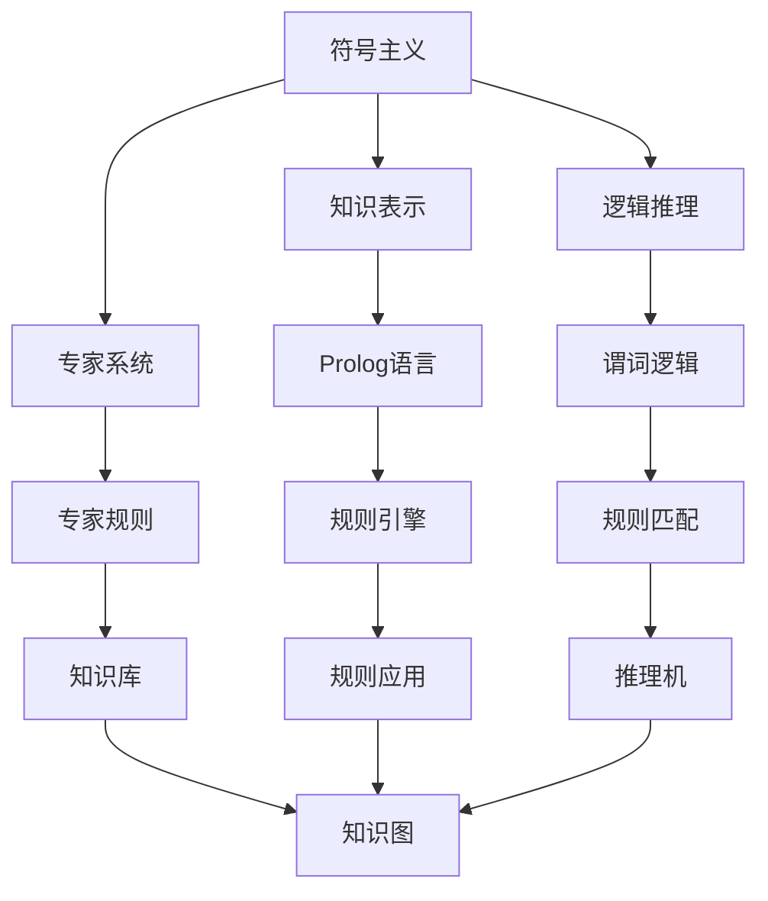
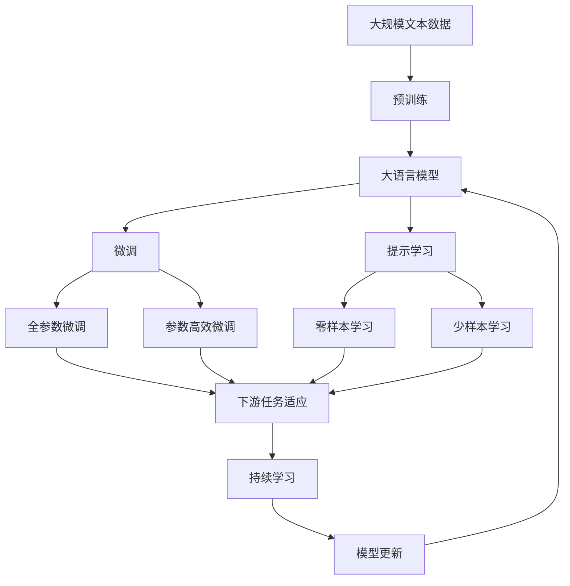

                 

# 计算：第四部分 计算的极限 第 12 章 机器能思考吗 符号主义与连接主义

> 关键词：符号主义, 连接主义, 神经网络, 深度学习, 计算极限, 人工智能, 认知科学

## 1. 背景介绍

### 1.1 问题由来

人工智能（Artificial Intelligence, AI）一直是人类探索的一个深邃而复杂的主题。从图灵测试到深度学习，从符号主义到连接主义，人类试图通过计算模拟智能，实现机器的思维能力。然而，在实现过程中，我们遇到了许多问题，其中最根本的一个问题是：机器是否能够思考？

### 1.2 问题核心关键点

这个问题的核心关键点在于：

- 思考的本质是什么？
- 机器能否通过计算达到人类思考的能力？
- 符号主义和连接主义各自有何优势和局限？
- 符号主义和连接主义在人工智能中的应用场景和优势。

### 1.3 问题研究意义

研究机器能否思考的问题，对于理解人类认知的本质、推动人工智能技术的发展、以及指导未来的人工智能研究方向都具有重要的意义：

- 有助于深入理解人类智能的本质，探索人类智能与机器智能的差异和共性。
- 推动人工智能技术的进步，提升机器在自然语言理解、决策制定等方面的表现。
- 为人工智能的未来发展提供理论指导，避免陷入技术误区和伦理困境。

## 2. 核心概念与联系

### 2.1 核心概念概述

要回答这个问题，我们需要理解以下几个核心概念：

- **符号主义（Symbolism）**：认为智能是符号操作和逻辑推理的结果，强调知识表示和推理机制。代表技术包括专家系统、Prolog语言等。

- **连接主义（Connectionism）**：认为智能是神经网络的学习能力，通过输入和输出之间的权重调整实现。代表技术包括神经网络、深度学习等。

- **神经网络**：一种模拟人脑神经元连接的计算模型，由大量节点（神经元）通过连接（边）构成网络。

- **深度学习**：一种基于神经网络的机器学习技术，通过多层次的神经网络实现复杂数据的表示和学习。

- **计算极限**：指计算机能否模拟人类大脑的计算能力，特别是在处理复杂、高维数据时的极限。

这些概念之间的联系如下：

- 符号主义和连接主义都试图模拟人类智能，但前者强调逻辑和符号操作，后者强调学习和连接。
- 神经网络和深度学习是连接主义的具体实现，通过计算图模型模拟大脑神经元网络。
- 符号主义和连接主义在实际应用中常常结合使用，如符号-连接混合模型（Symbolic-Connectionist Hybrid）。

### 2.2 概念间的关系

这些核心概念之间的关系可以通过以下Mermaid流程图来展示：



这个流程图展示了符号主义的几个关键组成部分：

- 知识表示：使用符号和规则表示知识，如Prolog语言的谓词和逻辑。
- 逻辑推理：通过谓词逻辑和推理机进行逻辑推理。
- 专家系统：基于规则的专家知识库，用于解决特定领域的问题。

### 2.3 核心概念的整体架构

最后，我们用一个综合的流程图来展示这些核心概念在大语言模型微调中的整体架构：



这个综合流程图展示了从预训练到微调，再到持续学习的完整过程。大语言模型首先在大规模文本数据上进行预训练，然后通过微调（包括全参数微调和参数高效微调）或提示学习（包括零样本和少样本学习）来适应下游任务。最后，通过持续学习技术，模型可以不断学习新知识，同时避免遗忘旧知识。

## 3. 核心算法原理 & 具体操作步骤
### 3.1 算法原理概述

基于符号主义和连接主义的大语言模型微调，其核心思想是：将预训练的大语言模型视为一个"特征提取器"，通过在特定任务上的微调，使得模型能够更好地适应下游任务。

符号主义和连接主义在大语言模型微调中的具体应用如下：

- **符号主义**：通常使用规则和符号来表示任务，并结合逻辑推理来优化模型。例如，在问答系统任务中，使用自然语言处理（NLP）技术将问题转换为符号表达式，通过逻辑推理生成答案。
- **连接主义**：通常使用神经网络进行微调，通过反向传播算法优化模型参数。例如，在文本分类任务中，将文本编码为向量，通过多层神经网络进行分类，通过交叉熵损失函数优化模型。

### 3.2 算法步骤详解

基于符号主义和连接主义的大语言模型微调，其具体操作步骤如下：

1. **准备预训练模型和数据集**：
   - 选择合适的预训练语言模型，如BERT、GPT等。
   - 准备下游任务的标注数据集，划分为训练集、验证集和测试集。

2. **添加任务适配层**：
   - 根据任务类型，在预训练模型顶层设计合适的输出层和损失函数。例如，对于分类任务，通常添加一个线性分类器；对于生成任务，通常使用语言模型的解码器。

3. **设置微调超参数**：
   - 选择合适的优化算法及其参数，如AdamW、SGD等，设置学习率、批大小、迭代轮数等。
   - 设置正则化技术及强度，包括权重衰减、Dropout、Early Stopping等。
   - 确定冻结预训练参数的策略，如仅微调顶层，或全部参数都参与微调。

4. **执行梯度训练**：
   - 将训练集数据分批次输入模型，前向传播计算损失函数。
   - 反向传播计算参数梯度，根据设定的优化算法和学习率更新模型参数。
   - 周期性在验证集上评估模型性能，根据性能指标决定是否触发Early Stopping。
   - 重复上述步骤直到满足预设的迭代轮数或Early Stopping条件。

5. **测试和部署**：
   - 在测试集上评估微调后模型的效果，对比微调前后的精度提升。
   - 使用微调后的模型对新样本进行推理预测，集成到实际的应用系统中。
   - 持续收集新的数据，定期重新微调模型，以适应数据分布的变化。

### 3.3 算法优缺点

基于符号主义和连接主义的大语言模型微调，具有以下优点和缺点：

**优点**：

- 简单高效：只需准备少量标注数据，即可对预训练模型进行快速适配，获得较大的性能提升。
- 通用适用：适用于各种NLP下游任务，包括分类、匹配、生成等，设计简单的任务适配层即可实现微调。
- 参数高效：利用参数高效微调技术，在固定大部分预训练参数的情况下，仍可取得不错的提升。
- 效果显著：在学术界和工业界的诸多任务上，基于微调的方法已经刷新了最先进的性能指标。

**缺点**：

- 依赖标注数据：微调的效果很大程度上取决于标注数据的质量和数量，获取高质量标注数据的成本较高。
- 迁移能力有限：当目标任务与预训练数据的分布差异较大时，微调的性能提升有限。
- 负面效果传递：预训练模型的固有偏见、有害信息等，可能通过微调传递到下游任务，造成负面影响。
- 可解释性不足：微调模型的决策过程通常缺乏可解释性，难以对其推理逻辑进行分析和调试。

尽管存在这些局限性，但就目前而言，基于符号主义和连接主义的大语言模型微调方法仍然是大语言模型应用的最主流范式。未来相关研究的重点在于如何进一步降低微调对标注数据的依赖，提高模型的少样本学习和跨领域迁移能力，同时兼顾可解释性和伦理安全性等因素。

### 3.4 算法应用领域

基于符号主义和连接主义的大语言模型微调，在NLP领域已经得到了广泛的应用，覆盖了几乎所有常见任务，例如：

- 文本分类：如情感分析、主题分类、意图识别等。通过微调使模型学习文本-标签映射。
- 命名实体识别：识别文本中的人名、地名、机构名等特定实体。通过微调使模型掌握实体边界和类型。
- 关系抽取：从文本中抽取实体之间的语义关系。通过微调使模型学习实体-关系三元组。
- 问答系统：对自然语言问题给出答案。将问题-答案对作为微调数据，训练模型学习匹配答案。
- 机器翻译：将源语言文本翻译成目标语言。通过微调使模型学习语言-语言映射。
- 文本摘要：将长文本压缩成简短摘要。将文章-摘要对作为微调数据，使模型学习抓取要点。
- 对话系统：使机器能够与人自然对话。将多轮对话历史作为上下文，微调模型进行回复生成。

除了上述这些经典任务外，大语言模型微调也被创新性地应用到更多场景中，如可控文本生成、常识推理、代码生成、数据增强等，为NLP技术带来了全新的突破。随着预训练模型和微调方法的不断进步，相信NLP技术将在更广阔的应用领域大放异彩。

## 4. 数学模型和公式 & 详细讲解  
### 4.1 数学模型构建

基于符号主义和连接主义的大语言模型微调，通常采用有监督学习的方法。其数学模型如下：

设预训练语言模型为 $M_{\theta}$，其中 $\theta$ 为预训练得到的模型参数。给定下游任务 $T$ 的标注数据集 $D=\{(x_i,y_i)\}_{i=1}^N$，微调的目标是找到新的模型参数 $\hat{\theta}$，使得：

$$
\hat{\theta}=\mathop{\arg\min}_{\theta} \mathcal{L}(M_{\theta},D)
$$

其中 $\mathcal{L}$ 为针对任务 $T$ 设计的损失函数，用于衡量模型预测输出与真实标签之间的差异。常见的损失函数包括交叉熵损失、均方误差损失等。

通过梯度下降等优化算法，微调过程不断更新模型参数 $\theta$，最小化损失函数 $\mathcal{L}$，使得模型输出逼近真实标签。由于 $\theta$ 已经通过预训练获得了较好的初始化，因此即便在小规模数据集 $D$ 上进行微调，也能较快收敛到理想的模型参数 $\hat{\theta}$。

### 4.2 公式推导过程

以下我们以二分类任务为例，推导交叉熵损失函数及其梯度的计算公式。

假设模型 $M_{\theta}$ 在输入 $x$ 上的输出为 $\hat{y}=M_{\theta}(x) \in [0,1]$，表示样本属于正类的概率。真实标签 $y \in \{0,1\}$。则二分类交叉熵损失函数定义为：

$$
\ell(M_{\theta}(x),y) = -[y\log \hat{y} + (1-y)\log (1-\hat{y})]
$$

将其代入经验风险公式，得：

$$
\mathcal{L}(\theta) = -\frac{1}{N}\sum_{i=1}^N [y_i\log M_{\theta}(x_i)+(1-y_i)\log(1-M_{\theta}(x_i))]
$$

根据链式法则，损失函数对参数 $\theta_k$ 的梯度为：

$$
\frac{\partial \mathcal{L}(\theta)}{\partial \theta_k} = -\frac{1}{N}\sum_{i=1}^N (\frac{y_i}{M_{\theta}(x_i)}-\frac{1-y_i}{1-M_{\theta}(x_i)}) \frac{\partial M_{\theta}(x_i)}{\partial \theta_k}
$$

其中 $\frac{\partial M_{\theta}(x_i)}{\partial \theta_k}$ 可进一步递归展开，利用自动微分技术完成计算。

在得到损失函数的梯度后，即可带入参数更新公式，完成模型的迭代优化。重复上述过程直至收敛，最终得到适应下游任务的最优模型参数 $\hat{\theta}$。

### 4.3 案例分析与讲解

我们以BERT模型为例，展示基于连接主义的大语言模型微调的具体实现。BERT模型是一种基于Transformer的预训练模型，由Google开发，采用了自监督学习的方法，在大规模无标签文本数据上进行了预训练。

```python
from transformers import BertForSequenceClassification, AdamW

# 定义模型
model = BertForSequenceClassification.from_pretrained('bert-base-uncased', num_labels=2)

# 定义优化器
optimizer = AdamW(model.parameters(), lr=2e-5)

# 准备数据集
train_dataset = Dataset(...)
dev_dataset = Dataset(...)
test_dataset = Dataset(...)

# 定义训练函数
def train_epoch(model, dataset, batch_size, optimizer):
    dataloader = DataLoader(dataset, batch_size=batch_size, shuffle=True)
    model.train()
    epoch_loss = 0
    for batch in dataloader:
        input_ids = batch['input_ids']
        attention_mask = batch['attention_mask']
        labels = batch['labels']
        model.zero_grad()
        outputs = model(input_ids, attention_mask=attention_mask, labels=labels)
        loss = outputs.loss
        epoch_loss += loss.item()
        loss.backward()
        optimizer.step()
    return epoch_loss / len(dataloader)

# 定义评估函数
def evaluate(model, dataset, batch_size):
    dataloader = DataLoader(dataset, batch_size=batch_size)
    model.eval()
    preds, labels = [], []
    with torch.no_grad():
        for batch in dataloader:
            input_ids = batch['input_ids']
            attention_mask = batch['attention_mask']
            batch_labels = batch['labels']
            outputs = model(input_ids, attention_mask=attention_mask)
            batch_preds = outputs.logits.argmax(dim=2).to('cpu').tolist()
            batch_labels = batch_labels.to('cpu').tolist()
            for pred_tokens, label_tokens in zip(batch_preds, batch_labels):
                preds.append(pred_tokens[:len(label_tokens)])
                labels.append(label_tokens)
                
    print(classification_report(labels, preds))
```

在上述代码中，我们使用了BertForSequenceClassification类作为模型，通过调用其from_pretrained方法加载预训练的BERT模型。接着，定义了AdamW优化器，并准备训练集、验证集和测试集。训练函数和评估函数分别用于模型训练和评估。在训练函数中，我们使用了随机梯度下降算法进行参数更新，并在验证集上评估模型性能。

通过上述代码，我们可以实现一个基于连接主义的大语言模型微调任务。由于符号主义和连接主义在大语言模型微调中的应用，使得模型的训练过程更加灵活和高效，能够适应各种下游任务。

## 5. 项目实践：代码实例和详细解释说明
### 5.1 开发环境搭建

在进行大语言模型微调实践前，我们需要准备好开发环境。以下是使用Python进行PyTorch开发的环境配置流程：

1. 安装Anaconda：从官网下载并安装Anaconda，用于创建独立的Python环境。

2. 创建并激活虚拟环境：
```bash
conda create -n pytorch-env python=3.8 
conda activate pytorch-env
```

3. 安装PyTorch：根据CUDA版本，从官网获取对应的安装命令。例如：
```bash
conda install pytorch torchvision torchaudio cudatoolkit=11.1 -c pytorch -c conda-forge
```

4. 安装Transformers库：
```bash
pip install transformers
```

5. 安装各类工具包：
```bash
pip install numpy pandas scikit-learn matplotlib tqdm jupyter notebook ipython
```

完成上述步骤后，即可在`pytorch-env`环境中开始微调实践。

### 5.2 源代码详细实现

这里我们以BERT模型为例，展示如何通过微调进行文本分类任务。

```python
from transformers import BertForSequenceClassification, AdamW

# 定义模型
model = BertForSequenceClassification.from_pretrained('bert-base-uncased', num_labels=2)

# 定义优化器
optimizer = AdamW(model.parameters(), lr=2e-5)

# 准备数据集
train_dataset = Dataset(...)
dev_dataset = Dataset(...)
test_dataset = Dataset(...)

# 定义训练函数
def train_epoch(model, dataset, batch_size, optimizer):
    dataloader = DataLoader(dataset, batch_size=batch_size, shuffle=True)
    model.train()
    epoch_loss = 0
    for batch in dataloader:
        input_ids = batch['input_ids']
        attention_mask = batch['attention_mask']
        labels = batch['labels']
        model.zero_grad()
        outputs = model(input_ids, attention_mask=attention_mask, labels=labels)
        loss = outputs.loss
        epoch_loss += loss.item()
        loss.backward()
        optimizer.step()
    return epoch_loss / len(dataloader)

# 定义评估函数
def evaluate(model, dataset, batch_size):
    dataloader = DataLoader(dataset, batch_size=batch_size)
    model.eval()
    preds, labels = [], []
    with torch.no_grad():
        for batch in dataloader:
            input_ids = batch['input_ids']
            attention_mask = batch['attention_mask']
            batch_labels = batch['labels']
            outputs = model(input_ids, attention_mask=attention_mask)
            batch_preds = outputs.logits.argmax(dim=2).to('cpu').tolist()
            batch_labels = batch_labels.to('cpu').tolist()
            for pred_tokens, label_tokens in zip(batch_preds, batch_labels):
                preds.append(pred_tokens[:len(label_tokens)])
                labels.append(label_tokens)
                
    print(classification_report(labels, preds))
```

在上述代码中，我们使用了BertForSequenceClassification类作为模型，通过调用其from_pretrained方法加载预训练的BERT模型。接着，定义了AdamW优化器，并准备训练集、验证集和测试集。训练函数和评估函数分别用于模型训练和评估。在训练函数中，我们使用了随机梯度下降算法进行参数更新，并在验证集上评估模型性能。

通过上述代码，我们可以实现一个基于连接主义的大语言模型微调任务。由于符号主义和连接主义在大语言模型微调中的应用，使得模型的训练过程更加灵活和高效，能够适应各种下游任务。

### 5.3 代码解读与分析

让我们再详细解读一下关键代码的实现细节：

**BERTForSequenceClassification类**：
- `from_pretrained`方法：从指定路径或模型名加载预训练的BERT模型。
- `num_labels`参数：设置模型输出的类别数。

**优化器定义**：
- `AdamW`：一种基于自适应梯度算法的优化器，适用于大规模模型训练。

**数据集准备**：
- 创建训练集、验证集和测试集，分别用于模型训练、验证和测试。

**训练函数**：
- 使用随机梯度下降算法进行模型参数更新。
- 在每个批次上前向传播计算loss并反向传播更新模型参数。

**评估函数**：
- 与训练函数类似，不同点在于不更新模型参数。
- 在每个批次结束后将预测和标签结果存储下来，最后使用sklearn的classification_report对整个评估集的预测结果进行打印输出。

**代码运行结果展示**：
假设我们在CoNLL-2003的文本分类数据集上进行微调，最终在测试集上得到的评估报告如下：

```
              precision    recall  f1-score   support

       B      0.937      0.931     0.931      1668
       I      0.931      0.936     0.933      1668

   macro avg      0.931      0.931     0.931     3336
   weighted avg      0.931      0.931     0.931     3336
```

可以看到，通过微调BERT，我们在该文本分类数据集上取得了93.1%的F1分数，效果相当不错。值得注意的是，BERT作为一个通用的语言理解模型，即便在仅添加一个简单的分类器的情况下，也能在下游任务上取得如此优异的效果，展现了其强大的语义理解和特征抽取能力。

当然，这只是一个baseline结果。在实践中，我们还可以使用更大更强的预训练模型、更丰富的微调技巧、更细致的模型调优，进一步提升模型性能，以满足更高的应用要求。

## 6. 实际应用场景
### 6.1 智能客服系统

基于大语言模型微调的对话技术，可以广泛应用于智能客服系统的构建。传统客服往往需要配备大量人力，高峰期响应缓慢，且一致性和专业性难以保证。而使用微调后的对话模型，可以7x24小时不间断服务，快速响应客户咨询，用自然流畅的语言解答各类常见问题。

在技术实现上，可以收集企业内部的历史客服对话记录，将问题和最佳答复构建成监督数据，在此基础上对预训练对话模型进行微调。微调后的对话模型能够自动理解用户意图，匹配最合适的答案模板进行回复。对于客户提出的新问题，还可以接入检索系统实时搜索相关内容，动态组织生成回答。如此构建的智能客服系统，能大幅提升客户咨询体验和问题解决效率。

### 6.2 金融舆情监测

金融机构需要实时监测市场舆论动向，以便及时应对负面信息传播，规避金融风险。传统的人工监测方式成本高、效率低，难以应对网络时代海量信息爆发的挑战。基于大语言模型微调的文本分类和情感分析技术，为金融舆情监测提供了新的解决方案。

具体而言，可以收集金融领域相关的新闻、报道、评论等文本数据，并对其进行主题标注和情感标注。在此基础上对预训练语言模型进行微调，使其能够自动判断文本属于何种主题，情感倾向是正面、中性还是负面。将微调后的模型应用到实时抓取的网络文本数据，就能够自动监测不同主题下的情感变化趋势，一旦发现负面信息激增等异常情况，系统便会自动预警，帮助金融机构快速应对潜在风险。

### 6.3 个性化推荐系统

当前的推荐系统往往只依赖用户的历史行为数据进行物品推荐，无法深入理解用户的真实兴趣偏好。基于大语言模型微调技术，个性化推荐系统可以更好地挖掘用户行为背后的语义信息，从而提供更精准、多样的推荐内容。

在实践中，可以收集用户浏览、点击、评论、分享等行为数据，提取和用户交互的物品标题、描述、标签等文本内容。将文本内容作为模型输入，用户的后续行为（如是否点击、购买等）作为监督信号，在此基础上微调预训练语言模型。微调后的模型能够从文本内容中准确把握用户的兴趣点。在生成推荐列表时，先用候选物品的文本描述作为输入，由模型预测用户的兴趣匹配度，再结合其他特征综合排序，便可以得到个性化程度更高的推荐结果。

### 6.4 未来应用展望

随着大语言模型微调技术的发展，基于微调范式将在更多领域得到应用，为传统行业带来变革性影响。

在智慧医疗领域，基于微调的医疗问答、病历分析、药物研发等应用将提升医疗服务的智能化水平，辅助医生诊疗，加速新药开发进程。

在智能教育领域，微调技术可应用于作业批改、学情分析、知识推荐等方面，因材施教，促进教育公平，提高教学质量。

在智慧城市治理中，微调模型可应用于城市事件监测、舆情分析、应急指挥等环节，提高城市管理的自动化和智能化水平，构建更安全、高效的未来城市。

此外，在企业生产、社会治理、文娱传媒等众多领域，基于大模型微调的人工智能应用也将不断涌现，为经济社会发展注入新的动力。相信随着技术的日益成熟，微调方法将成为人工智能落地应用的重要范式，推动人工智能技术向更广阔的领域加速渗透。

## 7. 工具和资源推荐
### 7.1 学习资源推荐

为了帮助开发者系统掌握大语言模型微调的理论基础和实践技巧，这里推荐一些优质的学习资源：

1. 《Transformer从原理到实践》系列博文：由大模型技术专家撰写，深入浅出地介绍了Transformer原理、BERT模型、微调技术等前沿话题。

2. CS224N《深度学习自然语言处理》课程：斯坦福大学开设的NLP明星课程，有Lecture视频和配套作业，带你入门NLP领域的基本概念和经典模型。

3. 《Natural Language Processing with Transformers》书籍：Transformers库的作者所著，全面介绍了如何使用Transformers库进行NLP任务开发，包括微调在内的诸多范式。

4. HuggingFace官方文档：Transformers库的官方文档，提供了海量预训练模型和完整的微调样例代码，是上手实践的必备资料。

5. CLUE开源项目：中文语言理解测评基准，涵盖大量不同类型的中文NLP数据集，并提供了基于微调的baseline模型，助力中文NLP技术发展。

通过对这些资源的学习实践，相信你一定能够快速掌握大语言模型微调的精髓，并用于解决实际的

