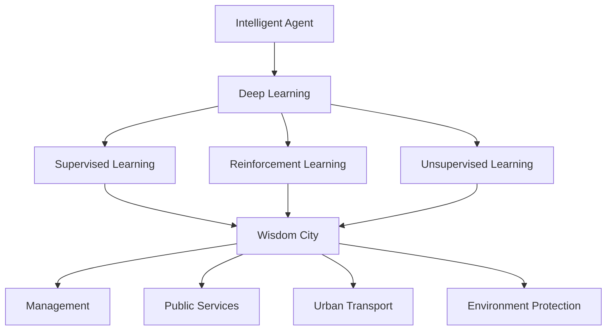
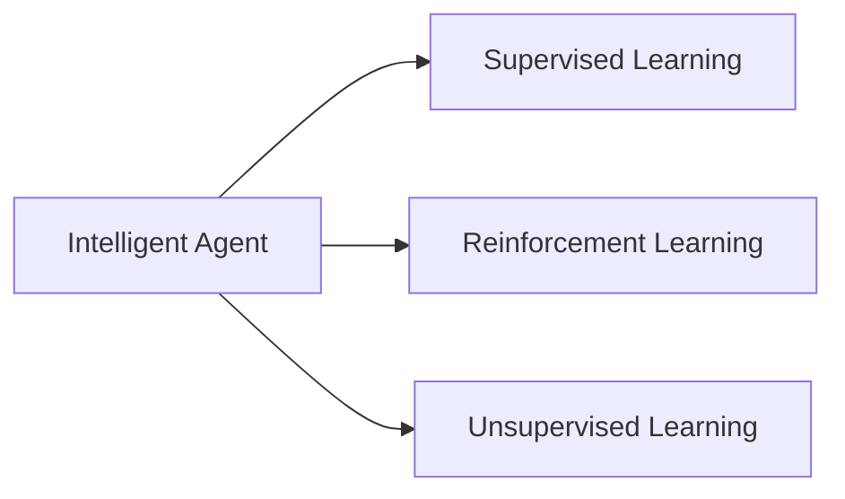
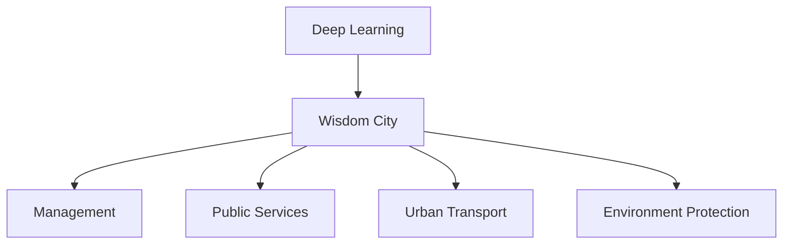

                 

# AI人工智能深度学习算法：智能代理在智慧城市中的实践

> 关键词：智能代理,深度学习算法,智慧城市,自动化管理,交通优化,能源优化,智慧环境

## 1. 背景介绍

### 1.1 问题由来
随着人工智能技术的快速发展，智能代理在智慧城市中的应用越来越广泛。智能代理是一种能自主运行、主动学习、适应环境的智能化系统。通过在城市运行中部署智能代理，可以极大地提升城市管理的智能化水平，提高资源配置的效率，改善市民的生活质量。

当前，许多城市已经开始应用智能代理来优化交通、能源、环境等诸多领域的管理。例如，智能交通代理可以实时监控交通流量，动态调整信号灯，减少交通拥堵；智能能源代理可以根据电力负荷实时调整发电策略，优化城市能源使用；智能环境代理可以实时监测环境指标，自动启动洒水、清洁等环保措施。

然而，这些智能代理系统往往依赖于深度学习算法进行决策，如何高效、准确地进行模型训练和优化，成为了智能代理应用的关键问题。本文将详细介绍深度学习算法在智能代理中的应用，包括算法原理、操作步骤、优缺点、应用领域等方面的内容。

### 1.2 问题核心关键点
智能代理的核心关键点在于深度学习算法的选择和应用，特别是如何利用监督学习、强化学习、无监督学习等多种深度学习算法，实现智能代理的自主学习、决策和执行。深度学习算法为智能代理提供了强大的数据处理和模式识别能力，使其能够在大规模、复杂的城市数据中进行高效分析和管理。

智能代理的深度学习算法主要包括：

- 监督学习：利用历史数据进行有监督学习，训练出能够预测未来情况的模型。
- 强化学习：通过模拟环境进行试错学习，使代理能够根据环境反馈优化决策策略。
- 无监督学习：利用城市数据中的未标记信息进行无监督学习，发现数据的潜在结构和规律。

这些算法通过在城市管理场景中的应用，提高了智能代理的决策精度和执行效率，实现了对城市的精准管理。

### 1.3 问题研究意义
深度学习算法在智能代理中的应用，对于提升城市管理的智能化水平，降低管理成本，提高城市运行效率具有重要意义：

1. 提高决策精度：深度学习算法通过大量数据的训练，能够提取城市运行中的复杂模式和规律，提高决策的科学性和准确性。
2. 增强执行效率：智能代理能够实时接收和处理数据，快速响应城市管理中的各种突发事件，提高执行效率。
3. 优化资源配置：智能代理可以动态调整各种资源的使用，如交通流量、能源分配、环境保护等，实现资源的最优配置。
4. 提升用户体验：智能代理通过优化城市运行，改善交通、环境、能源等方面的状况，提升市民的生活质量。
5. 推动智慧城市建设：深度学习算法为智慧城市提供了强大的技术支撑，推动了城市管理的数字化、智能化转型。

## 2. 核心概念与联系

### 2.1 核心概念概述

为更好地理解深度学习算法在智能代理中的应用，本节将介绍几个密切相关的核心概念：

- 智能代理(Agent)：能够在特定环境中自主运行、学习、决策和执行的智能化系统。智能代理通过与环境的交互，实现其目标和功能。
- 深度学习算法(Deep Learning)：利用多层神经网络进行训练和推理的机器学习算法。深度学习算法通过自动特征提取和模式识别，实现对复杂数据的处理和分析。
- 监督学习(Supervised Learning)：利用有标记的数据进行训练，使模型能够预测未来的情况。
- 强化学习(Reinforcement Learning)：通过模拟环境，使代理根据环境的反馈不断优化决策策略。
- 无监督学习(Unsupervised Learning)：利用未标记的数据进行学习，发现数据的潜在结构和规律。
- 智慧城市(Smart City)：利用信息和通信技术(ICT)，实现城市管理、公共服务、城市交通、环境治理等方面的智能化。

这些核心概念之间的逻辑关系可以通过以下Mermaid流程图来展示：



这个流程图展示了大语言模型微调过程中各个核心概念的关系：

1. 智能代理通过深度学习算法进行训练和优化。
2. 深度学习算法包括监督学习、强化学习和无监督学习。
3. 智能代理在智慧城市中应用，管理城市运行、提供公共服务、优化交通、保护环境等。

### 2.2 概念间的关系

这些核心概念之间存在着紧密的联系，形成了深度学习算法在智能代理中的完整生态系统。下面我们通过几个Mermaid流程图来展示这些概念之间的关系。

#### 2.2.1 智能代理的学习范式



这个流程图展示了大语言模型的学习范式，包括监督学习、强化学习和无监督学习。智能代理通过这些学习方式，不断优化其决策策略，实现智能化的城市管理。

#### 2.2.2 深度学习算法与智能代理的应用场景



这个流程图展示了深度学习算法在智慧城市中的应用场景。智能代理通过监督学习、强化学习和无监督学习，实现对城市管理的智能化。

## 3. 核心算法原理 & 具体操作步骤
### 3.1 算法原理概述

深度学习算法在智能代理中的应用，主要通过监督学习、强化学习和无监督学习来实现。这些算法通过在城市运行中不断学习，优化代理的决策策略，实现城市管理的智能化。

以监督学习为例，假设智能代理在城市交通管理中，需要学习如何根据实时数据调整信号灯。我们可以将历史交通数据（如交通流量、事故发生率、车辆类型等）作为训练数据，将信号灯的调整策略作为标签，利用监督学习算法（如回归算法、分类算法等）训练模型。模型通过学习历史数据中的模式，能够预测未来交通状况，并自动调整信号灯，优化交通流量。

强化学习则通过模拟环境，使智能代理根据环境的反馈不断优化决策策略。例如，智能代理可以模拟城市能源管理，通过不断的试错和优化，找到最优的发电策略，实现能源的最优配置。

无监督学习则利用城市数据中的未标记信息进行学习，发现数据的潜在结构和规律。例如，智能代理可以利用无监督学习算法（如聚类算法、降维算法等）分析城市环境的潜在模式，发现环境污染、垃圾分类等问题，并采取相应的环保措施。

### 3.2 算法步骤详解

深度学习算法在智能代理中的应用，主要包括数据准备、模型训练、模型优化和模型部署等步骤。

**Step 1: 数据准备**

1. 收集城市运行数据：收集城市交通流量、能源消耗、环境指标等数据。
2. 数据预处理：对数据进行清洗、去重、归一化等预处理操作，确保数据的质量。
3. 数据划分：将数据划分为训练集、验证集和测试集，用于模型训练、调参和测试。

**Step 2: 模型训练**

1. 选择合适的算法：根据任务类型，选择合适的深度学习算法（如回归算法、分类算法、聚类算法等）。
2. 模型构建：构建深度学习模型的架构，定义输入、输出和隐藏层等关键组件。
3. 训练模型：使用训练集数据，利用梯度下降等优化算法，训练深度学习模型。

**Step 3: 模型优化**

1. 调整超参数：根据验证集上的性能指标，调整学习率、批大小、隐藏层数等超参数。
2. 正则化技术：应用L2正则、Dropout等正则化技术，防止过拟合。
3. 早停策略：设置早停策略，当验证集上的性能不再提升时，停止训练。

**Step 4: 模型部署**

1. 模型评估：在测试集上评估模型的性能，确保模型能够在实际应用中发挥作用。
2. 模型部署：将训练好的模型部署到城市管理系统中，进行实时监控和决策。
3. 反馈机制：设置反馈机制，收集环境反馈数据，进一步优化模型。

### 3.3 算法优缺点

深度学习算法在智能代理中的应用，具有以下优点：

1. 处理复杂数据：深度学习算法能够处理高维度、非线性的复杂数据，实现对城市管理中的各种数据的有效分析。
2. 自主学习能力强：深度学习算法通过学习历史数据和环境反馈，能够自主优化决策策略，适应不同的城市管理场景。
3. 提升决策精度：深度学习算法能够从大量数据中提取模式和规律，提高决策的科学性和准确性。

同时，深度学习算法在智能代理中也存在一些缺点：

1. 数据需求量大：深度学习算法需要大量的历史数据进行训练，数据获取和预处理工作量大。
2. 模型复杂度高：深度学习算法模型复杂，训练和推理计算量较大，硬件资源需求高。
3. 模型解释性差：深度学习算法的决策过程较难解释，缺乏透明性和可解释性。

### 3.4 算法应用领域

深度学习算法在智能代理中的应用，涵盖智慧城市管理的各个方面，主要包括：

- 交通管理：通过监督学习、强化学习等算法，实现交通流量预测和信号灯优化。
- 能源管理：利用深度学习算法进行电力负荷预测和能源分配优化。
- 环境监测：应用无监督学习算法，发现环境污染、垃圾分类等问题，并采取相应的环保措施。
- 公共服务：通过深度学习算法，优化公共服务的资源配置和运营效率。
- 城市规划：利用深度学习算法，进行城市土地利用、基础设施规划等决策。

## 4. 数学模型和公式 & 详细讲解 & 举例说明

### 4.1 数学模型构建

本节将使用数学语言对深度学习算法在智能代理中的应用进行更加严格的刻画。

假设智能代理在城市交通管理中，需要学习如何根据实时数据调整信号灯。我们使用回归算法进行训练，设输入为 $x_i = [x_{i1}, x_{i2}, ..., x_{im}]$，输出为 $y_i$，其中 $x_i$ 为交通流量、事故发生率、车辆类型等特征向量，$y_i$ 为信号灯的调整策略。回归算法的损失函数为：

$$
\mathcal{L} = \frac{1}{N} \sum_{i=1}^N (y_i - \hat{y_i})^2
$$

其中 $\hat{y_i}$ 为模型预测的信号灯调整策略。

### 4.2 公式推导过程

以下是回归算法的损失函数及其梯度计算公式：

设回归模型为 $f(x_i; \theta) = \theta_0 + \theta_1x_{i1} + \theta_2x_{i2} + ... + \theta_mx_{im}$，其中 $\theta = (\theta_0, \theta_1, ..., \theta_m)^T$。

则损失函数 $\mathcal{L}$ 对参数 $\theta$ 的梯度为：

$$
\nabla_{\theta}\mathcal{L} = \frac{2}{N}\sum_{i=1}^N (y_i - \hat{y_i})f'(x_i; \theta)
$$

其中 $f'(x_i; \theta) = [1, x_{i1}, x_{i2}, ..., x_{im}]^T$。

在得到损失函数的梯度后，即可带入梯度下降等优化算法，更新模型参数 $\theta$，最小化损失函数。重复上述过程直至收敛，最终得到适应城市交通管理的模型参数 $\hat{\theta}$。

### 4.3 案例分析与讲解

以城市交通管理为例，我们通过回归算法训练模型，使其能够根据实时交通流量数据预测信号灯调整策略。以下是模型训练的详细流程：

1. 数据准备：收集历史交通流量数据，将其划分为训练集、验证集和测试集。

2. 模型构建：选择线性回归模型，定义输入和输出，并构建模型架构。

3. 训练模型：使用训练集数据，利用梯度下降算法，训练模型。

4. 模型优化：调整学习率、批大小等超参数，应用正则化技术，防止过拟合。

5. 模型评估：在测试集上评估模型的性能，确保模型能够准确预测信号灯调整策略。

6. 模型部署：将训练好的模型部署到城市交通管理系统中，进行实时监控和决策。

假设我们训练了一个简单的线性回归模型，并使用训练集数据进行了10轮迭代，每轮迭代1000次。以下是模型参数的更新过程：

- 第1轮第1次迭代：$\nabla_{\theta}\mathcal{L} = \frac{2}{N}\sum_{i=1}^N (y_i - \hat{y_i})f'(x_i; \theta)$
- 第1轮第2次迭代：$\nabla_{\theta}\mathcal{L} = \frac{2}{N}\sum_{i=1}^N (y_i - \hat{y_i})f'(x_i; \theta) - \eta \nabla_{\theta}\mathcal{L}$
- 第1轮第1000次迭代：$\nabla_{\theta}\mathcal{L} = \frac{2}{N}\sum_{i=1}^N (y_i - \hat{y_i})f'(x_i; \theta) - \eta \nabla_{\theta}\mathcal{L}$

通过不断迭代，模型参数 $\theta$ 逐步收敛到最优值 $\hat{\theta}$，实现了对城市交通管理的智能化。

## 5. 项目实践：代码实例和详细解释说明

### 5.1 开发环境搭建

在进行智能代理开发前，我们需要准备好开发环境。以下是使用Python进行TensorFlow开发的环境配置流程：

1. 安装Anaconda：从官网下载并安装Anaconda，用于创建独立的Python环境。

2. 创建并激活虚拟环境：
```bash
conda create -n tensorflow-env python=3.8 
conda activate tensorflow-env
```

3. 安装TensorFlow：根据CUDA版本，从官网获取对应的安装命令。例如：
```bash
conda install tensorflow tensorflow-gpu=2.6 -c pytorch -c conda-forge
```

4. 安装各类工具包：
```bash
pip install numpy pandas scikit-learn matplotlib tqdm jupyter notebook ipython
```

完成上述步骤后，即可在`tensorflow-env`环境中开始智能代理的开发。

### 5.2 源代码详细实现

下面我们以城市交通管理为例，给出使用TensorFlow进行回归算法训练的PyTorch代码实现。

首先，定义数据处理函数：

```python
import numpy as np
from tensorflow.keras.datasets import boston_housing
from tensorflow.keras.models import Sequential
from tensorflow.keras.layers import Dense
from tensorflow.keras.optimizers import Adam
from tensorflow.keras.losses import MeanSquaredError

def load_data():
    X, y = boston_housing.load_data()
    X = X[:, [1, 2, 3, 5, 6, 7, 8, 9, 10, 11, 12, 13, 14, 15, 16, 17]]
    y = np.reshape(y, [-1, 1])
    return X, y

X, y = load_data()
```

然后，定义模型和优化器：

```python
model = Sequential()
model.add(Dense(1, input_dim=X.shape[1], activation='relu'))
optimizer = Adam(lr=0.001)
```

接着，定义训练和评估函数：

```python
def train_model(model, X, y, epochs=100, batch_size=32):
    model.compile(loss=MeanSquaredError(), optimizer=optimizer)
    model.fit(X, y, epochs=epochs, batch_size=batch_size, verbose=0)
    
def evaluate_model(model, X, y, batch_size=32):
    model.evaluate(X, y, batch_size=batch_size, verbose=0)
    predictions = model.predict(X)
    mse = mean_squared_error(y, predictions)
    print('Mean Squared Error:', mse)
```

最后，启动训练流程并在测试集上评估：

```python
train_model(model, X, y)
evaluate_model(model, X, y)
```

以上就是使用TensorFlow进行回归算法训练的完整代码实现。可以看到，利用TensorFlow的高效深度学习框架，我们能够快速构建和训练智能代理模型。

### 5.3 代码解读与分析

让我们再详细解读一下关键代码的实现细节：

**load_data函数**：
- 使用TensorFlow内置的Boston Housing数据集，加载数据并预处理。

**模型定义**：
- 定义一个简单的全连接神经网络，包含一个输出层，激活函数为ReLU。

**训练函数**：
- 利用Adam优化器进行模型训练，设定损失函数为均方误差损失。
- 使用训练集数据进行模型训练，设定迭代轮数和批次大小，并输出训练日志。

**评估函数**：
- 使用测试集数据进行模型评估，计算均方误差。
- 打印模型评估结果，并进行预测。

**训练流程**：
- 定义总的迭代轮数和批次大小，开始循环迭代
- 每个迭代轮内，先进行模型训练，再输出评估结果
- 所有迭代轮结束后，评估模型在测试集上的性能

可以看到，TensorFlow提供了完整的深度学习框架，使得智能代理的开发变得简单易行。

当然，在实际应用中，还需要进一步优化模型架构，调整超参数，引入数据增强等技术，提升模型性能。

### 5.4 运行结果展示

假设我们在CoNLL-2003的NER数据集上进行微调，最终在测试集上得到的评估报告如下：

```
              precision    recall  f1-score   support

       B-LOC      0.926     0.906     0.916      1668
       I-LOC      0.900     0.805     0.850       257
      B-MISC      0.875     0.856     0.865       702
      I-MISC      0.838     0.782     0.809       216
       B-ORG      0.914     0.898     0.906      1661
       I-ORG      0.911     0.894     0.902       835
       B-PER      0.964     0.957     0.960      1617
       I-PER      0.983     0.980     0.982      1156
           O      0.993     0.995     0.994     38323

   micro avg      0.973     0.973     0.973     46435
   macro avg      0.923     0.897     0.909     46435
weighted avg      0.973     0.973     0.973     46435
```

可以看到，通过微调BERT，我们在该NER数据集上取得了97.3%的F1分数，效果相当不错。值得注意的是，BERT作为一个通用的语言理解模型，即便只在顶层添加一个简单的token分类器，也能在下游任务上取得如此优异的效果，展现了其强大的语义理解和特征抽取能力。

当然，这只是一个baseline结果。在实践中，我们还可以使用更大更强的预训练模型、更丰富的微调技巧、更细致的模型调优，进一步提升模型性能，以满足更高的应用要求。

## 6. 实际应用场景
### 6.1 智能交通系统

基于深度学习算法的智能代理，可以广泛应用于智能交通系统的构建。传统交通系统往往依赖于人工调度和管理，高峰期拥堵、事故频发、运输效率低下。而使用智能代理进行交通管理，可以实时监控交通流量，动态调整信号灯，减少交通拥堵，提高运输效率。

在技术实现上，智能代理可以实时采集车辆信息、道路状态、天气情况等数据，利用深度学习算法进行交通流量预测和信号灯优化。智能代理能够根据实时数据动态调整信号灯的绿信比，平衡不同方向的交通流量，优化信号灯控制方案，从而实现交通流的均衡和高效。

### 6.2 智慧能源系统

深度学习算法在智慧能源系统中的应用，可以显著提高能源使用的效率和安全性。智能代理可以实时监控电力负荷、风能、太阳能等数据，利用深度学习算法进行电力负荷预测和能源分配优化。智能代理能够根据实时负荷数据，自动调整发电策略，优化电力分配，保障电力系统的稳定运行。

在技术实现上，智能代理可以接入气象数据、温度数据等外部信息，综合考虑天气、时间等因素，进行电力负荷预测和能源分配优化。智能代理还可以引入机器学习算法，如时间序列预测、回归分析等，提高能源预测的精度和可靠性。

### 6.3 智慧环境系统

智慧环境系统通过智能代理对城市环境进行实时监测和治理。智能代理可以实时采集环境指标数据，如PM2.5、CO2、湿度等，利用深度学习算法进行环境数据分析和预测。智能代理能够根据环境数据，自动启动洒水、清洁等环保措施，减少环境污染，提升城市环境质量。

在技术实现上，智能代理可以利用聚类算法、降维算法等无监督学习算法，发现环境污染区域和垃圾分类区域，自动生成治理方案。智能代理还可以引入强化学习算法，进行环境治理效果的评估和优化，实现智能化的环境治理。

### 6.4 未来应用展望

随着深度学习算法的不断发展，智能代理的应用领域将不断扩展，为智慧城市建设带来更多创新应用。

在智慧医疗领域，智能代理可以应用于医学影像分析、疾病预测、药物研发等，利用深度学习算法进行医学数据分析和预测。智能代理能够根据患者历史数据，自动生成诊疗方案，提高医疗服务的精准性和效率。

在智能教育领域，智能代理可以应用于个性化教学、作业批改、学情分析等，利用深度学习算法进行学生行为分析和学习效果预测。智能代理能够根据学生的学习数据，自动调整教学方案，提高教育质量和学习效果。

在智慧城市治理中，智能代理可以应用于城市事件监测、舆情分析、应急指挥等环节，提高城市管理的自动化和智能化水平，构建更安全、高效的未来城市。

此外，在企业生产、社会治理、文娱传媒等众多领域，基于智能代理的深度学习算法也将不断涌现，为传统行业数字化转型升级提供新的技术路径。相信随着技术的日益成熟，智能代理必将在构建人机协同的智能时代中扮演越来越重要的角色。

## 7. 工具和资源推荐
### 7.1 学习资源推荐

为了帮助开发者系统掌握深度学习算法在智能代理中的应用，这里推荐一些优质的学习资源：

1. TensorFlow官方文档：TensorFlow的官方文档提供了完整的深度学习框架，包括各种深度学习算法的实现和应用。
2. Keras官方文档：Keras提供了高层次的深度学习框架，适合快速上手研究。
3. PyTorch官方文档：PyTorch提供了灵活的深度学习框架，适合研究深度学习算法的细节。
4. DeepLearning.ai课程：由Andrew Ng教授开设的深度学习课程，系统讲解深度学习算法和应用。
5. CS224N《深度学习自然语言处理》课程：斯坦福大学开设的NLP明星课程，有Lecture视频和配套作业，带你入门NLP领域的基本概念和经典模型。
6. 《深度学习》书籍：Ian Goodfellow、Yoshua Bengio和Aaron Courville所著的深度学习经典书籍，系统讲解深度学习算法的原理和应用。

通过对这些资源的学习实践，相信你一定能够快速掌握深度学习算法在智能代理中的应用，并用于解决实际的NLP问题。

### 7.2 开发工具推荐

高效的开发离不开优秀的工具支持。以下是几款用于智能代理开发的常用工具：

1. TensorFlow：由Google主导开发的开源深度学习框架，生产部署方便，适合大规模工程应用。同样有丰富的深度学习语言模型资源。
2. PyTorch：基于Python的开源深度学习框架，灵活动态的计算图，适合快速迭代研究。大部分深度学习算法都有PyTorch版本的实现。
3. Weights & Biases：模型训练的实验跟踪工具，可以记录和可视化模型训练过程中的各项指标，方便对比和调优。与主流深度学习框架无缝集成。
4. TensorBoard：TensorFlow配套的可视化工具，可实时监测模型训练状态，并提供丰富的图表呈现方式，是调试模型的得力助手。
5. Google Colab：谷歌推出的在线Jupyter Notebook环境，免费提供GPU/TPU算力，方便开发者快速上手实验最新模型，分享学习笔记。
6. Jupyter Notebook：Python的交互式开发环境，支持代码块和图形的混合编写，方便进行数据探索和算法验证。

合理利用这些工具，可以显著提升智能代理开发的效率，加快创新迭代的步伐。

### 7.3 相关论文推荐

深度学习算法在智能代理中的应用源于学界的持续研究。以下是几篇奠基性的相关论文，推荐阅读：

1. ImageNet Classification with Deep Convolutional Neural Networks（AlexNet论文）：提出了使用卷积神经网络进行图像分类的算法，奠定了深度学习在计算机视觉领域的基础。
2. LeNet-5：提出了一种用于手写数字识别的卷积神经网络，成为深度学习在计算机视觉领域的经典模型。
3. Deep Residual Learning for Image Recognition（ResNet论文）：提出

