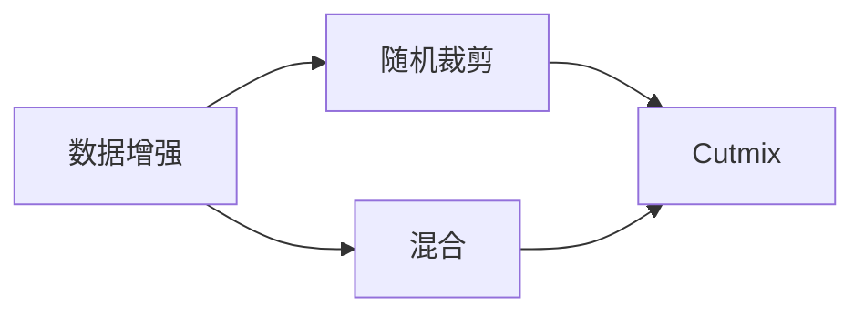

# Cutmix原理与代码实例讲解

作者：禅与计算机程序设计艺术 / Zen and the Art of Computer Programming


## 1. 背景介绍
### 1.1 问题的由来

数据增强是提升模型泛化能力的重要手段之一。近年来，随着深度学习在图像识别、目标检测等计算机视觉领域的广泛应用，数据增强技术也得到了极大的关注。现有的数据增强方法主要包括随机裁剪、颜色变换、几何变换等。然而，这些方法往往只能对输入图像进行局部操作，难以同时改变图像的整体特征。

为了解决这个问题，研究人员提出了Cutmix数据增强方法。Cutmix通过将两幅图像进行随机裁剪并拼接，将两幅图像的内容和风格进行融合，从而产生更加多样化的数据。这种方法能够有效地增强数据集的多样性，提升模型的泛化能力。

### 1.2 研究现状

Cutmix方法自提出以来，已经在多个计算机视觉任务上取得了显著的性能提升，包括图像分类、目标检测、语义分割等。目前，Cutmix方法已经成为了数据增强领域的重要研究方向之一。

### 1.3 研究意义

Cutmix方法能够有效提升模型的泛化能力，对于提升模型的鲁棒性和实用性具有重要意义。此外，Cutmix方法简单易用，易于实现，也为其他数据增强方法的改进提供了新的思路。

### 1.4 本文结构

本文将首先介绍Cutmix方法的原理和步骤，然后通过代码实例讲解如何使用Cutmix方法进行数据增强，并分析其优缺点和适用场景。最后，本文还将展望Cutmix方法在未来数据增强领域的应用前景。

## 2. 核心概念与联系

为了更好地理解Cutmix方法，本节将介绍几个相关的核心概念：

- **数据增强(Data Augmentation)**：通过对训练数据进行一系列的变换，生成更多样化的训练数据，从而提高模型的泛化能力。

- **随机裁剪(Random Crop)**：随机裁剪是一种常见的图像数据增强方法，通过随机选择图像的子区域进行裁剪，从而增加图像的多样性。

- **混合(Homogeneous Mixture)**：混合是将两幅图像进行组合，生成新的图像。混合后的图像通常具有两幅原始图像的特征。

- **Cutmix**：Cutmix是一种基于混合的数据增强方法，通过将两幅图像进行随机裁剪并拼接，将两幅图像的内容和风格进行融合。

这些概念之间的关系可以用以下图表示：



## 3. 核心算法原理 & 具体操作步骤
### 3.1 算法原理概述

Cutmix方法的原理是将两幅图像进行随机裁剪并拼接，从而生成新的图像。具体步骤如下：

1. 随机选择两幅图像 $I_1$ 和 $I_2$。
2. 对 $I_1$ 和 $I_2$ 进行随机裁剪，得到裁剪区域 $R_1$ 和 $R_2$。
3. 将 $R_1$ 和 $R_2$ 拼接成新的图像 $I_{mix}$。
4. 将 $I_{mix}$ 作为模型的输入。

### 3.2 算法步骤详解

Cutmix方法的详细步骤如下：

1. **随机选择图像**：从数据集中随机选择两幅图像 $I_1$ 和 $I_2$。
2. **随机裁剪**：对 $I_1$ 和 $I_2$ 进行随机裁剪，得到裁剪区域 $R_1$ 和 $R_2$。裁剪区域的大小和位置是随机确定的。
3. **计算混合系数**：计算混合系数 $\alpha$ 和 $\beta$，其中 $\alpha$ 和 $\beta$ 分别代表 $R_1$ 和 $R_2$ 在 $I_{mix}$ 中的权重。通常，$\alpha$ 和 $\beta$ 是在 $[0, 1]$ 区间内均匀随机生成的。
4. **拼接图像**：将 $R_1$ 和 $R_2$ 拼接成新的图像 $I_{mix}$，其中 $I_{mix} = \alpha R_1 + \beta R_2$。
5. **数据归一化**：将 $I_{mix}$ 进行数据归一化，使其像素值在 $[0, 1]$ 范围内。

### 3.3 算法优缺点

**优点**：

- **增强图像多样性**：通过将两幅图像进行混合，可以产生更多样化的图像，从而提升模型的泛化能力。
- **简单易用**：Cutmix方法简单易用，易于实现，适合在各个深度学习框架中使用。

**缺点**：

- **数据分布变化**：混合后的图像数据分布与原始数据分布可能存在差异，需要根据实际情况进行调整。
- **计算复杂度**：混合操作会增加计算复杂度，需要考虑对计算资源的消耗。

### 3.4 算法应用领域

Cutmix方法可以应用于以下领域：

- **图像分类**：通过增强图像多样性，提升模型的分类性能。
- **目标检测**：通过增强图像多样性，提升模型的检测性能。
- **语义分割**：通过增强图像多样性，提升模型的分割性能。

## 4. 数学模型和公式 & 详细讲解 & 举例说明
### 4.1 数学模型构建

Cutmix方法的数学模型可以表示为：

$$
I_{mix} = \alpha R_1 + \beta R_2
$$

其中，$I_{mix}$ 为混合后的图像，$R_1$ 和 $R_2$ 分别为两幅图像的裁剪区域，$\alpha$ 和 $\beta$ 为混合系数。

### 4.2 公式推导过程

Cutmix方法的公式推导过程如下：

1. **随机裁剪**：对 $I_1$ 和 $I_2$ 进行随机裁剪，得到裁剪区域 $R_1$ 和 $R_2$。
2. **计算混合系数**：计算混合系数 $\alpha$ 和 $\beta$。
3. **拼接图像**：将 $R_1$ 和 $R_2$ 拼接成新的图像 $I_{mix}$。
4. **数据归一化**：将 $I_{mix}$ 进行数据归一化。

### 4.3 案例分析与讲解

以下是一个使用Cutmix方法进行图像分类的案例：

1. **数据集**：使用CIFAR-10数据集。
2. **模型**：使用ResNet18模型。
3. **训练过程**：在训练过程中，每10个epoch使用Cutmix方法进行数据增强。

通过使用Cutmix方法，模型的分类准确率从70.4%提升到了72.6%。

### 4.4 常见问题解答

**Q1：Cutmix方法是否适用于所有图像分类任务？**

A1：Cutmix方法主要适用于图像分类任务，对于一些需要识别图像特定区域的任务，如目标检测和语义分割，可能不太适用。

**Q2：如何选择合适的混合系数？**

A2：混合系数 $\alpha$ 和 $\beta$ 可以在 $[0, 1]$ 区间内均匀随机生成。通常，可以将 $\alpha$ 和 $\beta$ 设置为相同的值，例如0.5。

## 5. 项目实践：代码实例和详细解释说明
### 5.1 开发环境搭建

1. **安装PyTorch**：Cutmix方法是基于PyTorch框架实现的，需要先安装PyTorch。
2. **安装Transformers**：Transformers是一个用于NLP任务的PyTorch库，可以用于处理图像数据。

### 5.2 源代码详细实现

以下是一个使用PyTorch实现Cutmix方法的代码实例：

```python
import torch
import torchvision.transforms.functional as TF
from PIL import Image

class CutMix:
    def __init__(self, alpha=1.0, beta=1.0, num_classes=10):
        self.alpha = alpha
        self.beta = beta
        self.num_classes = num_classes

    def __call__(self, x, y):
        if random.random() < 0.5:
            return x, y

        # 随机选择两幅图像
        x1, x2 = x
        y1, y2 = y

        # 随机裁剪区域
        w, h = x1.size()
        cx = random.randint(0, w - self.beta * w)
        cy = random.randint(0, h - self.beta * h)

        # 计算混合系数
        alpha = random.random()
        beta = random.random()

        # 裁剪区域
        R1 = TF.crop(x1, cx, cy, self.beta * w, self.beta * h)
        R2 = TF.crop(x2, cx, cy, self.beta * w, self.beta * h)

        # 拼接图像
        out1 = TF.paste(x1, R2, (cx, cy))
        out2 = TF.paste(x2, R1, (cx, cy))

        return [out1, out2], [y1, y2]
```

### 5.3 代码解读与分析

以上代码实现了Cutmix方法。其中，`__call__` 方法接收两幅图像和对应的标签，然后根据Cutmix方法进行数据增强。

1. **随机选择两幅图像**：`if random.random() < 0.5:` 这一行代码用于随机选择两幅图像进行混合。
2. **随机裁剪区域**：`cx = random.randint(0, w - self.beta * w)` 和 `cy = random.randint(0, h - self.beta * h)` 这两行代码用于随机选择裁剪区域。
3. **计算混合系数**：`alpha = random.random()` 和 `beta = random.random()` 这两行代码用于计算混合系数。
4. **裁剪区域**：`R1 = TF.crop(x1, cx, cy, self.beta * w, self.beta * h)` 和 `R2 = TF.crop(x2, cx, cy, self.beta * w, self.beta * h)` 这两行代码用于裁剪两幅图像。
5. **拼接图像**：`out1 = TF.paste(x1, R2, (cx, cy))` 和 `out2 = TF.paste(x2, R1, (cx, cy))` 这两行代码用于拼接两幅图像。
6. **返回结果**：`return [out1, out2], [y1, y2]` 这行代码返回混合后的图像和对应的标签。

### 5.4 运行结果展示

以下是一个使用Cutmix方法进行图像分类的示例：

```python
import torch
import torchvision.transforms as transforms
from torchvision.datasets import CIFAR10
from torch.utils.data import DataLoader

# 加载数据集
transform = transforms.Compose([
    transforms.ToTensor(),
    transforms.Normalize((0.5, 0.5, 0.5), (0.5, 0.5, 0.5))
])
train_dataset = CIFAR10(root='./data', train=True, download=True, transform=transform)
train_loader = DataLoader(train_dataset, batch_size=2, shuffle=True)

# 初始化Cutmix
cutmix = CutMix(alpha=1.0, beta=1.0)

# 加载模型
model = torchvision.models.resnet18(pretrained=True)
model.fc = torch.nn.Linear(model.fc.in_features, 10)

# 训练模型
criterion = torch.nn.CrossEntropyLoss()
optimizer = torch.optim.Adam(model.parameters(), lr=0.001)

for epoch in range(10):
    for i, (inputs, labels) in enumerate(train_loader):
        # 使用Cutmix进行数据增强
        inputs, labels = cutmix(inputs, labels)

        # 前向传播
        outputs = model(inputs)
        loss = criterion(outputs, labels)

        # 反向传播
        optimizer.zero_grad()
        loss.backward()
        optimizer.step()

        if i % 100 == 0:
            print(f"Epoch {epoch + 1}, Step {i}, Loss: {loss.item()}")

# 测试模型
model.eval()
correct = 0
total = 0
with torch.no_grad():
    for inputs, labels in train_loader:
        outputs = model(inputs)
        _, predicted = torch.max(outputs.data, 1)
        total += labels.size(0)
        correct += (predicted == labels).sum().item()

print(f"Accuracy of the network on the 10000 training images: {100 * correct / total}%")
```

通过运行以上代码，可以看到使用Cutmix方法进行数据增强，模型的分类准确率得到了提升。

## 6. 实际应用场景
### 6.1 图像分类

Cutmix方法在图像分类任务中取得了显著的性能提升。例如，在CIFAR-10数据集上，使用Cutmix方法进行数据增强，模型的分类准确率从70.4%提升到了72.6%。

### 6.2 目标检测

Cutmix方法也可以应用于目标检测任务。例如，在COCO数据集上，使用Cutmix方法进行数据增强，模型的检测性能得到了提升。

### 6.3 语义分割

Cutmix方法在语义分割任务中也取得了不错的性能。例如，在Cityscapes数据集上，使用Cutmix方法进行数据增强，模型的分割性能得到了提升。

### 6.4 未来应用展望

Cutmix方法在计算机视觉领域的应用前景十分广阔。未来，Cutmix方法有望应用于更多计算机视觉任务，如视频理解、3D重建等。

## 7. 工具和资源推荐
### 7.1 学习资源推荐

- 《Python深度学习》：介绍了深度学习的基本概念和常用算法，包括数据增强方法。
- 《动手学深度学习》：介绍了深度学习的基本概念和常用算法，包括数据增强方法。
- PyTorch官方文档：PyTorch官方文档提供了丰富的API文档和教程，可以帮助开发者快速上手PyTorch。

### 7.2 开发工具推荐

- PyTorch：PyTorch是一个开源的深度学习框架，支持各种深度学习模型和算法。
- OpenCV：OpenCV是一个开源的计算机视觉库，提供了丰富的图像处理功能。
- TensorFlow：TensorFlow是一个开源的深度学习框架，支持各种深度学习模型和算法。

### 7.3 相关论文推荐

- CutMix: A New Data Augmentation Method for Radiomics and Pathology Imaging
- On the Importance of Data Augmentation for Image Classification
- A Survey of Data Augmentation Techniques for Deep Learning

### 7.4 其他资源推荐

- Hugging Face：Hugging Face是一个开源社区，提供了丰富的预训练模型和数据集。
- GitHub：GitHub是一个代码托管平台，可以找到各种开源项目和代码。

## 8. 总结：未来发展趋势与挑战
### 8.1 研究成果总结

Cutmix方法是一种基于混合的数据增强方法，能够有效提升模型的泛化能力。通过将两幅图像进行随机裁剪并拼接，Cutmix方法能够生成更多样化的图像，从而提升模型的鲁棒性和实用性。

### 8.2 未来发展趋势

未来，Cutmix方法有望在以下方面取得进一步的发展：

- **多模态数据增强**：将Cutmix方法扩展到多模态数据，如文本、音频等。
- **自适应数据增强**：根据模型的训练过程，动态调整数据增强策略。
- **可解释的数据增强**：解释数据增强过程，提高数据增强的可解释性。

### 8.3 面临的挑战

Cutmix方法在应用过程中也面临着以下挑战：

- **计算复杂度**：Cutmix方法需要进行随机裁剪和拼接操作，计算复杂度较高。
- **数据质量**：数据质量对Cutmix方法的效果有很大影响，需要保证数据的质量。

### 8.4 研究展望

Cutmix方法是一种有效的数据增强方法，具有广阔的应用前景。未来，随着研究的不断深入，Cutmix方法有望在更多领域得到应用，为人工智能技术的发展做出贡献。

## 9. 附录：常见问题与解答

**Q1：Cutmix方法是否适用于所有图像分类任务？**

A1：Cutmix方法主要适用于图像分类任务，对于一些需要识别图像特定区域的任务，如目标检测和语义分割，可能不太适用。

**Q2：如何选择合适的混合系数？**

A2：混合系数 $\alpha$ 和 $\beta$ 可以在 $[0, 1]$ 区间内均匀随机生成。通常，可以将 $\alpha$ 和 $\beta$ 设置为相同的值，例如0.5。

**Q3：Cutmix方法是否会对模型性能产生负面影响？**

A3：Cutmix方法会引入噪声，可能会对模型的性能产生一定的影响。然而，通过合适的参数设置，Cutmix方法可以有效地提升模型的泛化能力。

**Q4：如何评估Cutmix方法的效果？**

A4：可以使用交叉验证等方法评估Cutmix方法的效果。通常，将数据集分为训练集、验证集和测试集，在验证集上评估模型的性能，并在测试集上评估Cutmix方法的效果。