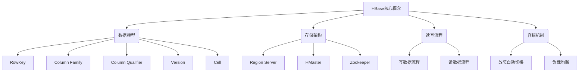
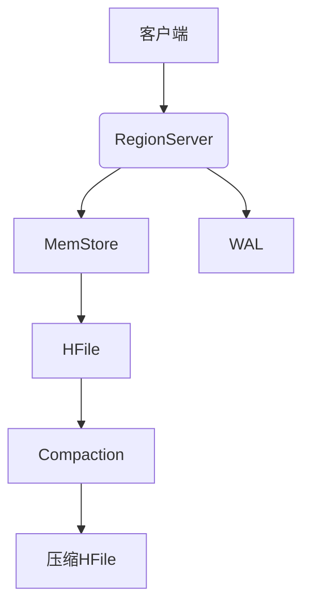
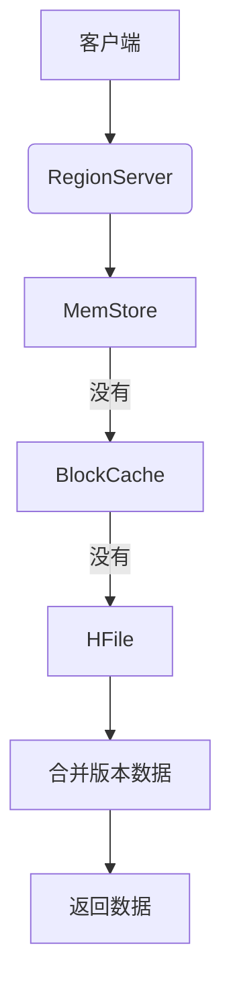
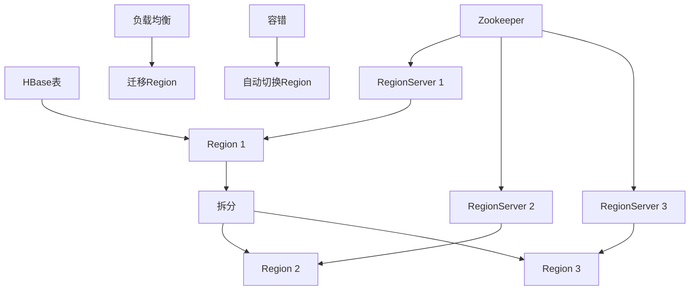

# HBase原理与代码实例讲解

## 1. 背景介绍

### 1.1 问题的由来

在当今大数据时代，数据量的快速增长对传统的关系型数据库系统带来了巨大的挑战。随着海量数据的不断涌现,单机存储和计算能力已无法满足需求。这促使分布式存储和计算框架应运而生,以解决大规模数据集的管理和分析问题。

Apache HBase 作为 Hadoop 生态系统中的重要组成部分,是一个高可靠性、高性能、面向列、可伸缩的分布式数据库。它基于 Google 的 Bigtable 论文,为大数据场景下的海量结构化数据提供了一种高效的存储和访问方式。

### 1.2 研究现状

近年来,HBase 在许多领域得到了广泛应用,例如物联网、金融风控、推荐系统等。它能够轻松地处理数据量级达到数十亿行的超大规模数据集,并提供毫秒级的数据查询响应。与此同时,HBase 也面临着一些挑战,例如数据压缩、热点数据处理、集群扩展等问题。

业界和学术界对 HBase 的原理和实践进行了大量研究。一些优化方案被提出,如行键设计优化、预分区策略、内存管理优化等,以提高 HBase 的性能和可靠性。

### 1.3 研究意义

深入理解 HBase 的原理和实现细节,对于高效利用这一强大的分布式数据库系统至关重要。本文将全面阐述 HBase 的核心概念、架构设计、算法原理,并通过代码示例和实践案例,帮助读者掌握 HBase 的使用方法和优化策略。

### 1.4 本文结构

本文首先介绍 HBase 的核心概念和架构设计,然后深入探讨其关键算法原理,包括数据模型、存储机制、读写流程等。接下来,通过数学模型和公式,对 HBase 的核心机制进行理论分析。

在项目实践部分,我们将提供完整的代码示例,并对其进行详细解释,帮助读者掌握 HBase 的开发和使用技巧。最后,本文将分享 HBase 在实际应用场景中的实践经验,并推荐相关的学习资源和工具。

## 2. 核心概念与联系

HBase 是一个分布式、面向列的数据库,其核心概念包括:

1. **数据模型**:
   - **RowKey**: 用于唯一标识数据行,按字典序排序。
   - **Column Family**: 列簇,表示数据的不同类型或特征。
   - **Column Qualifier**: 列限定符,用于在列簿内唯一标识一列。
   - **Version**: 每个单元格可以存储多个版本的数据。
   - **Cell**: 由 RowKey、Column Family、Column Qualifier、Version 和值组成。

2. **存储架构**:
   - **Region Server**: 负责存储和管理 HBase 表的数据。
   - **HMaster**: 管理和协调 Region Server,负责表的元数据管理。
   - **Zookeeper**: 用于协调 HMaster 和 Region Server 的通信。

3. **读写流程**:
   - **写数据流程**: 客户端将数据写入 HBase,经过 MemStore、WAL、HFile 等步骤。
   - **读数据流程**: 客户端从 MemStore、BlockCache 和 HFile 中读取数据。

4. **容错机制**:
   - **故障自动切换**: 当 Region Server 发生故障时,其托管的 Region 会自动迁移到其他节点。
   - **负载均衡**: 通过自动分割和迁移 Region,实现集群负载均衡。

这些核心概念相互关联,共同构建了 HBase 的分布式存储和计算架构。

## 3. 核心算法原理 & 具体操作步骤

### 3.1 算法原理概述

HBase 的核心算法原理包括以下几个方面:

1. **LSM (Log-Structured Merge-Tree) 存储引擎**:
   - 将数据先写入内存中的 MemStore,定期刷写到磁盘上的 HFile。
   - 通过后台合并压缩 HFile,减少磁盘空间占用。

2. **Region 管理**:
   - 将表横向划分为多个 Region,每个 Region 由一个 Region Server 管理。
   - 通过自动拆分和迁移 Region,实现负载均衡和容错。

3. **版本控制和数据压缩**:
   - 每个 Cell 可以保存多个版本的数据,按时间戳排序。
   - 支持多种数据压缩算法,节省存储空间。

4. **读写流程优化**:
   - 写流程利用 MemStore 和 WAL 实现高效写入。
   - 读流程通过 BlockCache 和 Bloom Filter 加速数据查询。

5. **容错和高可用**:
   - 基于 Zookeeper 实现 HMaster 和 Region Server 的协调。
   - 故障自动切换和负载均衡机制,确保数据可靠性和系统稳定性。

### 3.2 算法步骤详解

#### 3.2.1 写数据流程

1. 客户端向 RegionServer 发送写请求。
2. RegionServer 将数据写入内存中的 MemStore。
3. 同时,数据也被写入磁盘上的 Write-Ahead Log (WAL)文件,用于故障恢复。
4. 当 MemStore 达到一定大小时,将被刷写到磁盘上的 HFile 中。
5. 定期对 HFile 进行合并和压缩,以减少磁盘空间占用。

#### 3.2.2 读数据流程

1. 客户端向 RegionServer 发送读请求。
2. RegionServer 首先从内存中的 MemStore 查找数据。
3. 如果 MemStore 中没有,则从 BlockCache 中查找。
4. 如果 BlockCache 中也没有,则从磁盘上的 HFile 中读取数据。
5. 如果需要,可以合并多个版本的数据。

#### 3.2.3 Region 管理

1. 表初始时只有一个 Region,随着数据的增长,会自动拆分为多个 Region。
2. 每个 Region 由一个 RegionServer 管理,RegionServer 之间通过 Zookeeper 协调。
3. 当 Region 过大时,会自动拆分为两个子 Region。
4. 当 RegionServer 负载过高时,会将部分 Region 迁移到其他节点,实现负载均衡。
5. 当 RegionServer 发生故障时,其托管的 Region 会自动迁移到其他节点。

### 3.3 算法优缺点

**优点**:

1. **高性能**: 通过内存缓存和数据压缩,提供毫秒级的数据查询响应。
2. **高可靠性**: 基于 WAL 和自动故障切换机制,确保数据不丢失。
3. **可伸缩性**: 通过自动拆分和迁移 Region,实现线性扩展。
4. **高并发**: 支持大量并发读写操作。

**缺点**:

1. **热点数据问题**: 对于热点数据,可能导致单个 Region 过载。
2. **数据压缩overhead**: 频繁的数据压缩操作会增加系统开销。
3. **元数据管理复杂**: 需要管理大量的 Region 元数据。
4. **实时查询延迟**: 由于需要合并多个 HFile,实时查询可能会有一定延迟。

### 3.4 算法应用领域

HBase 广泛应用于以下领域:

1. **物联网(IoT)**: 存储和处理海量的传感器数据。
2. **日志数据分析**: 收集和分析大规模的日志数据。
3. **内容存储**: 存储和管理大量的非结构化数据,如文件、图片等。
4. **实时查询**: 提供毫秒级的数据查询响应,支持实时查询场景。
5. **推荐系统**: 存储和处理用户行为数据,为推荐系统提供支持。
6. **金融风控**: 存储和分析金融交易数据,用于风险控制和反欺诈。

## 4. 数学模型和公式 & 详细讲解 & 举例说明

### 4.1 数学模型构建

为了更好地理解和优化 HBase 的性能,我们可以构建数学模型对其进行分析。

假设 HBase 集群中有 $N$ 个 RegionServer,每个 RegionServer 管理 $M$ 个 Region。我们定义以下符号:

- $R_i$: 第 $i$ 个 Region 的大小
- $C_j$: 第 $j$ 个 RegionServer 的计算能力
- $L_j$: 第 $j$ 个 RegionServer 的负载

我们的目标是最小化集群中所有 RegionServer 的最大负载,即:

$$\min \max_{1 \leq j \leq N} L_j$$

其中,每个 RegionServer 的负载可以表示为:

$$L_j = \sum_{i \in R_j} \frac{R_i}{C_j}$$

这是一个典型的负载均衡问题,可以通过优化 Region 的分布来实现。

### 4.2 公式推导过程

为了解决上述优化问题,我们可以将其转化为一个整数线性规划问题。引入决策变量 $x_{ij}$,表示第 $i$ 个 Region 是否分配给第 $j$ 个 RegionServer:

$$
x_{ij} = \begin{cases}
1, & \text{if Region $i$ is assigned to RegionServer $j$} \
0, & \text{otherwise}
\end{cases}
$$

我们的目标函数可以表示为:

$$\min z$$
$$\text{s.t. } \sum_{i=1}^{M} \frac{R_i}{C_j} x_{ij} \leq z, \quad \forall j \in \{1, 2, \ldots, N\}$$
$$\sum_{j=1}^{N} x_{ij} = 1, \quad \forall i \in \{1, 2, \ldots, M\}$$
$$x_{ij} \in \{0, 1\}, \quad \forall i \in \{1, 2, \ldots, M\}, \forall j \in \{1, 2, \ldots, N\}$$

其中,第一个约束条件确保每个 RegionServer 的负载不超过目标值 $z$,第二个约束条件确保每个 Region 只分配给一个 RegionServer。

通过求解上述整数线性规划问题,我们可以得到最优的 Region 分配方案,从而实现集群的负载均衡。

### 4.3 案例分析与讲解

假设我们有一个 HBase 集群,包含 3 个 RegionServer,每个 RegionServer 的计算能力分别为 $C_1 = 10$, $C_2 = 8$, $C_3 = 6$。集群中有 5 个 Region,大小分别为 $R_1 = 2$, $R_2 = 3$, $R_3 = 4$, $R_4 = 5$, $R_5 = 6$。我们希望找到一种最优的