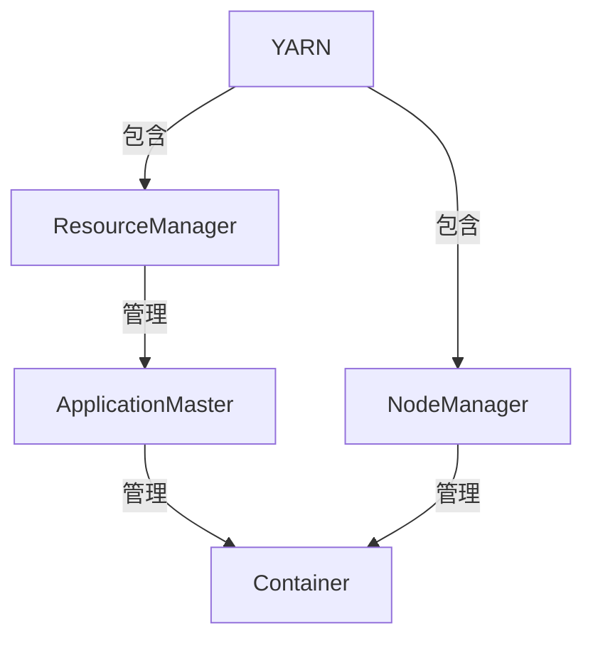
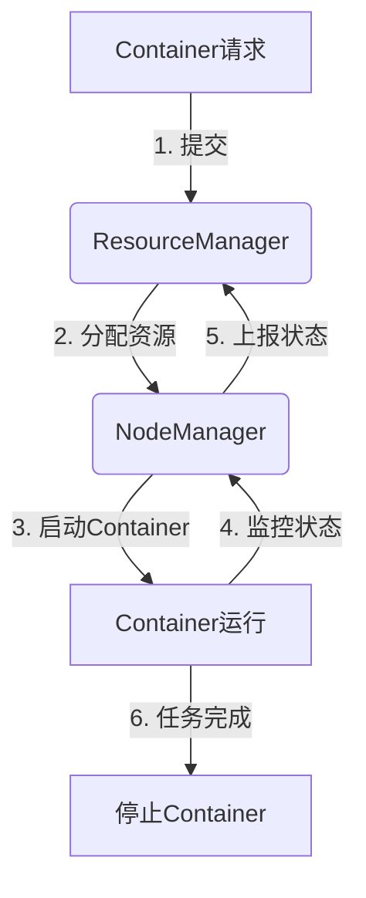
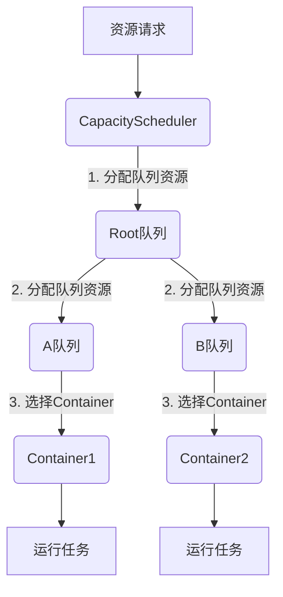

# YARN Container原理与代码实例讲解

## 1. 背景介绍

### 1.1 问题的由来

在大数据时代,海量数据的存储和计算成为了一个巨大的挑战。Apache Hadoop作为一个分布式系统基础架构,旨在可靠、高效地处理大规模数据。YARN(Yet Another Resource Negotiator)作为Hadoop的资源管理和任务调度组件,为运行在集群上的应用程序动态分配资源,是实现高效资源利用和任务调度的关键。

### 1.2 研究现状

YARN的设计目标是将资源管理与应用程序逻辑解耦,使得不同类型的分布式应用程序都可以在Hadoop集群上高效运行。传统的Hadoop MapReduce作为YARN上运行的一种应用程序,不再承担资源管理的职责。YARN提供了一个统一的资源管理和调度平台,为集群中运行的所有应用程序提供服务。

### 1.3 研究意义

深入理解YARN的原理和实现对于构建高效、可扩展的大数据处理系统至关重要。YARN的核心组件之一是Container,它是YARN中资源抽象和分配的基本单位。掌握Container的工作原理和实现细节,有助于更好地利用集群资源,优化任务调度,提高系统整体性能。

### 1.4 本文结构

本文将从以下几个方面全面介绍YARN Container:

1. 核心概念与联系,阐述Container在YARN架构中的地位和作用。
2. 核心算法原理与具体操作步骤,解析Container生命周期管理和资源分配算法。
3. 数学模型和公式,建立资源模型并推导相关公式。
4. 项目实践,提供Container相关代码实例并进行详细解释。
5. 实际应用场景,探讨Container在不同场景下的应用。
6. 工具和资源推荐,为读者提供学习和开发资源。
7. 总结未来发展趋势与挑战。
8. 附录常见问题与解答。

## 2. 核心概念与联系



YARN的核心组件包括ResourceManager(RM)、NodeManager(NM)和ApplicationMaster(AM)。

- ResourceManager是全局资源管理器,负责资源分配和调度。
- NodeManager运行在每个节点上,负责容器的启动、监控和停止。
- ApplicationMaster是应用程序的"大脑",负责向RM申请资源,并启动相应的Container运行任务。

Container是YARN中资源抽象和分配的基本单位,包含CPU、内存等资源。AM根据需求向RM申请Container,NM接收指令在本节点上启动和管理Container。因此,Container是连接YARN各组件的纽带,是实现资源统一管理和调度的关键所在。

## 3. 核心算法原理 & 具体操作步骤

### 3.1 算法原理概述

Container生命周期管理和资源分配是YARN核心算法。其中:

- **生命周期管理**确保Container可靠运行,涉及创建、启动、监控和终止等步骤。
- **资源分配**则负责根据应用需求和集群状态,合理分配CPU、内存等资源给Container。

这两个算法的高效实现对YARN的整体性能至关重要。

### 3.2 算法步骤详解

1. **生命周期管理算法**



具体步骤:

1. AM向RM提交Container请求,包括资源需求等信息。
2. RM根据集群资源状况,选择合适的节点并通知NM分配资源。
3. NM在本节点上启动Container,为其分配独立的运行环境。
4. NM持续监控Container运行状态。
5. NM将监控数据上报给RM,RM据此调整资源分配策略。
6. 任务完成后,Container被终止并释放资源。

2. **资源分配算法**

YARN采用容量调度器CapacityScheduler进行多维度资源分配。



算法流程:

1. 应用提交资源请求。
2. 根队列将资源分配给子队列,如A队列和B队列。
3. 各子队列根据内部策略选择合适的Container运行任务。
4. 分配的Container用于运行具体任务。

### 3.3 算法优缺点

**优点**:

- 生命周期管理保证Container可靠运行。
- 资源分配算法实现多队列、多维度资源分配。
- 算法设计使YARN具有高扩展性和通用性。

**缺点**:

- 资源分配策略相对静态,无法动态调整。
- 容易出现资源fragment化,导致资源浪费。
- 调度器设计较为复杂,存在单点故障风险。

### 3.4 算法应用领域

YARN的资源管理和任务调度能力使其可广泛应用于:

- 大数据计算框架:Apache Spark、Flink等在YARN上运行。
- 机器学习和深度学习:TensorFlow、Pytorch等可在YARN集群上并行训练模型。
- 流处理系统:Apache Kafka、Storm等可利用YARN进行资源分配。
- 科学计算:生物信息学、天体物理等科学计算可在YARN上高效运行。

## 4. 数学模型和公式 & 详细讲解 & 举例说明

### 4.1 数学模型构建

为了精确描述和优化资源分配,我们需要建立数学资源模型。令:

- $R$为集群总资源,包括CPU和内存两个维度,即$R = (R_{\text{cpu}}, R_{\text{mem}})$。
- $Q$为队列集合,每个队列$q \in Q$有配额$q.quota$。
- $U$为用户集合,每个用户$u \in U$在队列$q$中有配额$u.quota_q$。
- $A$为应用集合,每个应用$a \in A$对资源有需求$a.request$。

则资源分配需满足如下约束条件:

$$
\begin{align}
\sum_{q \in Q} q.quota &\le 1 \
\sum_{u \in U} u.quota_q &\le 1 \quad \forall q \in Q\
\sum_{a \in A} a.request &\le R
\end{align}
$$

### 4.2 公式推导过程

令$x_{a,r}$为分配给应用$a$的资源$r$的数量,则资源分配可建模为优化问题:

$$\max \sum_{a \in A} f(x_{a,cpu}, x_{a,mem})$$

其中,目标函数$f$可设为应用运行时间的负值,从而最小化任务运行时间。

在上述约束条件下,该优化问题可使用线性规划或其他运筹学方法求解。

### 4.3 案例分析与讲解

假设集群资源$R = (100, 1000)$,有两个队列$q_1,q_2$,配额分别为$0.6,0.4$。$q_1$中有两个用户$u_1,u_2$,配额分别为$0.7,0.3$。现有三个应用$a_1,a_2,a_3$,资源需求分别为$(10,100),(20,200),(15,150)$。

求如何为三个应用合理分配资源?

**解**:根据公式,可列出线性规划问题:

$$
\begin{align}
\max & -\left(10x_{a_1,cpu} + 100x_{a_1,mem} + 20x_{a_2,cpu} + 200x_{a_2,mem} + 15x_{a_3,cpu} + 150x_{a_3,mem}\right) \
\text{s.t. } & x_{a_1,cpu} + x_{a_2,cpu} + x_{a_3,cpu} \le 100 \
           & x_{a_1,mem} + x_{a_2,mem} + x_{a_3,mem} \le 1000 \
           & 0.7(x_{a_1,cpu} + x_{a_2,cpu}) + 0.3x_{a_3,cpu} \le 60 \
           & 0.7(x_{a_1,mem} + x_{a_2,mem}) + 0.3x_{a_3,mem} \le 600 \
           & x_{a_1,cpu} \le 10, x_{a_1,mem} \le 100\
           & x_{a_2,cpu} \le 20, x_{a_2,mem} \le 200\
           & x_{a_3,cpu} \le 15, x_{a_3,mem} \le 150\
           & x \ge 0
\end{align}
$$

使用求解器可得最优解$(x_{a_1,cpu}, x_{a_1,mem}) = (10, 100), (x_{a_2,cpu}, x_{a_2,mem}) = (20, 200), (x_{a_3,cpu}, x_{a_3,mem}) = (15, 150)$。

这样可以最小化三个应用的运行时间,并满足队列和用户的资源配额约束。

### 4.4 常见问题解答

**Q:** 为什么需要队列和用户的资源配额限制?

**A:** 这些限制是为了防止某些应用或用户占用过多资源,导致其他应用无资源可用。通过设置合理的配额,可实现资源的公平分配。

**Q:** 是否可以动态调整队列和用户的资源配额?

**A:** 是的,YARN支持动态调整配额。管理员可根据实际需求,在运行时修改队列和用户的资源配额。

**Q:** 如何处理资源fragment化问题?

**A:** YARN提供了预留和回收机制。当有新的资源请求到来时,如果当前无法分配所需的整块资源,YARN会尝试将之前分配的资源回收并重新整合,以满足新请求。此外,也可通过优化应用的资源请求模式来减少fragment化。

## 5. 项目实践:代码实例和详细解释说明

### 5.1 开发环境搭建

要运行YARN相关代码,首先需要搭建Hadoop开发环境。可以在单机或伪分布式模式下进行开发和测试。具体步骤如下:

1. 安装Java 8或更高版本。
2. 下载并解压Hadoop发行版。
3. 配置Hadoop环境变量。
4. 启动Hadoop守护进程,包括NameNode、DataNode、ResourceManager和NodeManager。

### 5.2 源代码详细实现

以下是YARN Container相关的核心代码实现,位于`org.apache.hadoop.yarn.server.nodemanager`包中。

**ContainerExecutor**

```java
public class ContainerExecutor {
    // 启动Container
    public void startContainer(Container container) {
        // 设置Container运行环境
        setupContainerEnv(container);

        // 启动Container进程
        startContainerProcess(container);
    }

    // 监控Container状态
    public void monitorContainer(Container container) {
        // 获取Container进程状态
        ContainerStatus status = getContainerStatus(container);

        // 上报状态给ResourceManager
        reportStatus(container, status);
    }

    // 停止Container
    public void stopContainer(Container container) {
        // 终止Container进程
        terminateContainerProcess(container);

        // 清理Container环境
        cleanupContainerEnv(container);
    }
}
```

**ContainerManager**

```java
public class ContainerManager {
    private final ContainerExecutor executor;

    // 启动Container
    public void startContainer(Container container) {
        executor.startContainer(container);
    }

    // 监控Container状态
    public void monitorContainer(Container container) {
        executor.monitorContainer(container);
    }

    // 停止Container
    public void stopContainer(Container container) {
        executor.stopContainer(container);
    }
}
```

上述代码实现了Container的启动、监控和停止功能。具体来说:

1. `ContainerExecutor`负责与操作系统交互,启动Container进程、获取状态并终止进程。
2. `ContainerManager`则是对`ContainerExecutor`的进一步封装,提供更高层次的Container生命周期管理接口。

### 5.3 代码