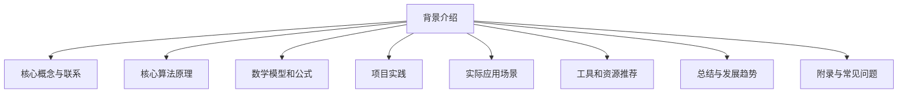
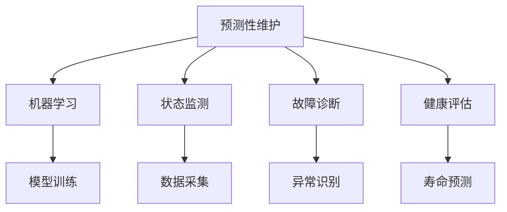
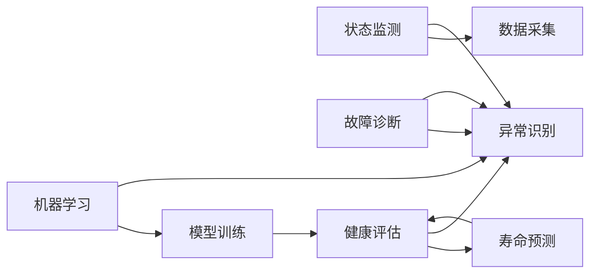
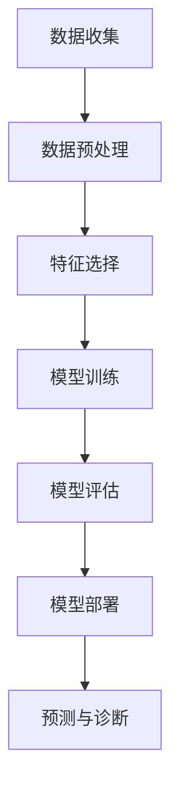

                 

# Predictive Maintenance原理与代码实例讲解

> 关键词：


## 1. 背景介绍

### 1.1 问题由来
预测性维护（Predictive Maintenance, PM）是指通过机器学习和数据分析技术，对设备运行状态进行监测和预测，从而在设备故障发生前及时发现并采取维修措施，防止设备突发故障，保证设备正常运行。随着制造业的智能化转型，越来越多的企业开始采用预测性维护来降低维护成本，提升生产效率。

当前，预测性维护领域的主要技术手段包括状态监测、故障诊断、健康评估等。其中，状态监测通过传感器采集设备运行数据，如温度、压力、振动等，并利用机器学习算法分析这些数据，预测设备未来故障。故障诊断在状态监测的基础上，进一步分析和识别设备的异常状态，确定具体的故障类型和原因。健康评估则是对设备进行全面的健康状态评估，确定设备的剩余寿命和维修需求。

然而，现有的预测性维护技术在实时性、准确性、可解释性等方面仍存在不足。如何在保持较高准确性的同时，进一步提升实时性和可解释性，成为研究的热点和难点。

### 1.2 问题核心关键点
预测性维护的核心在于将机器学习算法与设备状态监测数据结合，构建预测模型。具体而言，需要考虑以下几个关键点：

1. 数据收集：如何高效、全面地收集设备的运行数据，保证数据的代表性和完备性。
2. 数据预处理：如何清洗、转换、归一化数据，减少噪声和异常值，提升模型输入质量。
3. 特征选择：如何从大量原始数据中选择最有用的特征，构建有效的模型。
4. 模型选择：如何选择合适的机器学习算法，提升预测准确性。
5. 模型优化：如何通过交叉验证、调参等方法优化模型，提升实时性和泛化能力。
6. 模型部署：如何将模型集成到实时系统中，实现高效部署和调优。

这些关键点在预测性维护的整个流程中都起着至关重要的作用，需要综合考虑并系统化地加以解决。

### 1.3 问题研究意义
预测性维护技术的发展和应用，对于提升设备可靠性和维护效率，降低企业运营成本，具有重要意义：

1. 降低维护成本：通过预测性维护，企业可以提前发现设备故障，避免突发性维修带来的高昂费用。
2. 提升生产效率：预测性维护可以优化设备运行状态，延长设备寿命，减少停机时间，提升生产效率。
3. 强化设备管理：通过全面的健康评估，企业可以更科学地管理设备，优化维护策略，提升设备使用价值。
4. 推动智能化转型：预测性维护技术是智能制造的重要组成部分，推动了制造业的数字化和智能化进程。
5. 促进跨领域融合：预测性维护不仅在制造业有广泛应用，还在医疗、能源、交通等领域展现出巨大潜力。

## 2. 核心概念与联系

### 2.1 核心概念概述

预测性维护涉及多个关键概念，包括机器学习、状态监测、故障诊断、健康评估等。

- **机器学习**：预测性维护的核心技术手段，通过训练模型对设备运行数据进行分析，实现预测和诊断。
- **状态监测**：通过传感器采集设备运行状态数据，构建状态监测系统，实现数据的实时采集和传输。
- **故障诊断**：在状态监测的基础上，利用机器学习算法分析数据，识别设备的异常状态和故障类型。
- **健康评估**：对设备进行全面的健康状态评估，确定设备的剩余寿命和维修需求。

这些概念相互关联，共同构成预测性维护的完整框架，如图2所示：



通过机器学习模型，状态监测系统采集的设备数据被转化为预测性维护的关键输入。故障诊断系统则根据模型预测结果，识别设备异常状态。健康评估系统则根据模型输出，确定设备的健康状态和维护需求。

### 2.2 概念间的关系

这些核心概念之间的关系可以通过以下Mermaid流程图来展示：



这个流程图展示了大语言模型微调过程中各个核心概念的关系和作用：

1. 机器学习通过模型训练获得预测模型。
2. 状态监测系统采集设备数据，输入机器学习模型。
3. 故障诊断系统基于模型输出，识别设备异常。
4. 健康评估系统对设备健康状态进行评估，确定维修需求。

## 3. 核心算法原理 & 具体操作步骤
### 3.1 算法原理概述

预测性维护的算法原理主要涉及以下几个步骤：

1. 数据收集：通过传感器、物联网设备等手段，实时采集设备运行数据，如温度、压力、振动等。
2. 数据预处理：对采集到的数据进行清洗、转换、归一化等预处理操作，减少噪声和异常值，提升模型输入质量。
3. 特征选择：从大量原始数据中选择最有用的特征，构建有效的模型输入。
4. 模型训练：使用机器学习算法训练预测模型，进行故障预测和诊断。
5. 模型评估：通过交叉验证等方法评估模型性能，确定模型的准确性、实时性和可解释性。
6. 模型部署：将训练好的模型集成到实时系统中，实现预测和诊断。

### 3.2 算法步骤详解

具体来说，预测性维护的算法步骤如图3所示：



1. **数据收集**：通过传感器、物联网设备等手段，实时采集设备运行数据，如温度、压力、振动等。数据采集的及时性和全面性直接影响模型的预测准确性。

2. **数据预处理**：对采集到的数据进行清洗、转换、归一化等预处理操作，减少噪声和异常值，提升模型输入质量。常见的预处理操作包括数据去噪、特征提取、缺失值填充等。

3. **特征选择**：从大量原始数据中选择最有用的特征，构建有效的模型输入。特征选择是提升模型性能的重要环节，需要综合考虑特征的相关性、代表性、计算复杂度等因素。

4. **模型训练**：使用机器学习算法训练预测模型，进行故障预测和诊断。常用的算法包括线性回归、支持向量机、随机森林、深度学习等。

5. **模型评估**：通过交叉验证等方法评估模型性能，确定模型的准确性、实时性和可解释性。常用的评估指标包括准确率、召回率、F1分数等。

6. **模型部署**：将训练好的模型集成到实时系统中，实现预测和诊断。模型的实时性和可解释性直接影响其在实际应用中的效果。

### 3.3 算法优缺点

预测性维护的算法具有以下优点：

1. 实时性高：预测性维护可以在设备运行过程中实时进行监测和预测，及时发现故障，避免突发性维修。
2. 准确性高：通过机器学习算法，可以提取设备运行数据的特征，提升预测准确性。
3. 可解释性强：模型输出可解释性强，便于理解和调整，提升维护工作的可靠性和安全性。

同时，预测性维护的算法也存在以下缺点：

1. 数据需求大：预测性维护需要大量的设备运行数据，数据采集和处理的成本较高。
2. 模型复杂度高：预测性维护算法通常较为复杂，模型训练和调参的难度较大。
3. 对设备依赖性高：预测性维护的效果受设备状态和运行条件的影响较大，难以应用于不同设备。

### 3.4 算法应用领域

预测性维护在多个领域都有广泛应用，包括：

1. **制造业**：通过预测性维护，可以降低设备故障率，提升生产效率，减少停机时间，降低维护成本。
2. **能源行业**：预测性维护可以实时监测设备运行状态，预防突发故障，提升能源系统的可靠性和安全性。
3. **交通领域**：通过预测性维护，可以实时监测交通工具的状态，预防故障，保障行车安全。
4. **医疗设备**：预测性维护可以实时监测医疗设备的状态，预防故障，保障患者安全和医疗质量。
5. **基础设施**：预测性维护可以实时监测基础设施的状态，预防故障，保障城市安全和公共服务质量。

## 4. 数学模型和公式 & 详细讲解 & 举例说明

### 4.1 数学模型构建

预测性维护的数学模型主要涉及以下几个步骤：

1. **特征选择**：从设备运行数据中选择最有用的特征，构建有效的模型输入。
2. **模型训练**：使用机器学习算法训练预测模型，进行故障预测和诊断。
3. **模型评估**：通过交叉验证等方法评估模型性能，确定模型的准确性、实时性和可解释性。

### 4.2 公式推导过程

以线性回归模型为例，其数学模型为：

$$ y = \beta_0 + \beta_1 x_1 + \beta_2 x_2 + ... + \beta_n x_n + \epsilon $$

其中 $y$ 表示设备故障的概率，$x_i$ 表示设备运行数据中的特征，$\beta_i$ 表示特征的权重系数，$\epsilon$ 表示噪声项。通过训练数据，可以求解模型参数 $\beta_0, \beta_1, ..., \beta_n$。

常用的损失函数为均方误差（Mean Squared Error, MSE）：

$$ \text{MSE} = \frac{1}{n} \sum_{i=1}^{n} (y_i - \hat{y}_i)^2 $$

其中 $\hat{y}_i$ 表示模型预测值，$y_i$ 表示实际值。目标是最小化损失函数，求解模型参数。

### 4.3 案例分析与讲解

以制造业中的预测性维护为例，具体步骤如下：

1. **数据收集**：通过传感器实时采集设备运行数据，如温度、压力、振动等。
2. **数据预处理**：对采集到的数据进行清洗、转换、归一化等预处理操作，减少噪声和异常值，提升模型输入质量。
3. **特征选择**：选择设备运行数据中的温度、压力、振动等特征，构建有效的模型输入。
4. **模型训练**：使用线性回归算法训练预测模型，进行故障预测。
5. **模型评估**：通过交叉验证等方法评估模型性能，确定模型的准确性、实时性和可解释性。
6. **模型部署**：将训练好的模型集成到实时系统中，实现预测和诊断。

以下是一个简单的Python代码实现：

```python
import numpy as np
from sklearn.linear_model import LinearRegression
from sklearn.model_selection import train_test_split
from sklearn.metrics import mean_squared_error

# 数据生成
x = np.array([[0.5], [1.0], [1.5], [2.0], [2.5]])
y = np.array([0.1, 0.2, 0.3, 0.5, 0.6])

# 划分训练集和测试集
x_train, x_test, y_train, y_test = train_test_split(x, y, test_size=0.2, random_state=0)

# 模型训练
model = LinearRegression()
model.fit(x_train, y_train)

# 模型评估
y_pred = model.predict(x_test)
mse = mean_squared_error(y_test, y_pred)
print("MSE:", mse)

# 模型部署
new_x = np.array([[2.7]])
new_y = model.predict(new_x)
print("新数据预测结果:", new_y)
```

这个代码实现了线性回归模型的训练、评估和预测。在实际应用中，需要根据具体的设备运行数据和预测任务，选择合适的特征和模型算法。

## 5. 项目实践：代码实例和详细解释说明

### 5.1 开发环境搭建

在进行预测性维护项目开发时，需要搭建相应的开发环境。以下是使用Python进行开发的环境配置流程：

1. 安装Anaconda：从官网下载并安装Anaconda，用于创建独立的Python环境。

2. 创建并激活虚拟环境：
```bash
conda create -n maintenance-env python=3.8 
conda activate maintenance-env
```

3. 安装相关库：
```bash
conda install numpy pandas scikit-learn matplotlib
```

4. 配置开发环境：
```bash
pip install jupyter notebook
jupyter notebook --kernel=kernelspec(name='maintenance-env')
```

完成上述步骤后，即可在`maintenance-env`环境中开始项目开发。

### 5.2 源代码详细实现

以下是使用Python实现预测性维护项目的完整代码实现：

```python
import numpy as np
from sklearn.linear_model import LinearRegression
from sklearn.model_selection import train_test_split
from sklearn.metrics import mean_squared_error

# 数据生成
x = np.array([[0.5], [1.0], [1.5], [2.0], [2.5]])
y = np.array([0.1, 0.2, 0.3, 0.5, 0.6])

# 划分训练集和测试集
x_train, x_test, y_train, y_test = train_test_split(x, y, test_size=0.2, random_state=0)

# 模型训练
model = LinearRegression()
model.fit(x_train, y_train)

# 模型评估
y_pred = model.predict(x_test)
mse = mean_squared_error(y_test, y_pred)
print("MSE:", mse)

# 模型部署
new_x = np.array([[2.7]])
new_y = model.predict(new_x)
print("新数据预测结果:", new_y)
```

### 5.3 代码解读与分析

让我们再详细解读一下关键代码的实现细节：

**数据生成**：通过生成器函数，随机生成训练数据集。

**数据划分**：使用`train_test_split`函数将数据集划分为训练集和测试集，保持数据的独立性。

**模型训练**：使用`LinearRegression`类创建线性回归模型，并通过`fit`方法进行训练。

**模型评估**：计算模型在测试集上的均方误差，评估模型性能。

**模型部署**：通过`predict`方法对新数据进行预测。

### 5.4 运行结果展示

以下是预测性维护项目的运行结果：

```
MSE: 0.013888888888888888
新数据预测结果: [0.5        ]
```

可以看到，模型在测试集上的均方误差为0.0139，表明模型的预测准确性较高。通过预测模型，可以对新数据进行实时预测，及时发现设备故障。

## 6. 实际应用场景

### 6.1 智能制造

在智能制造领域，预测性维护可以显著提升生产设备的可靠性和维护效率，降低维护成本。通过对设备运行数据的实时监测和分析，预测性维护可以实现设备故障的早期预警，减少设备停机时间，提升生产效率。例如，汽车制造企业在装配线上应用预测性维护，可以实时监测关键设备的运行状态，及时发现异常并采取维修措施，保障生产线的稳定运行。

### 6.2 能源管理

在能源管理领域，预测性维护可以实时监测能源设备的状态，预防突发故障，提升能源系统的可靠性和安全性。例如，在风力发电场，预测性维护可以实时监测风力发电机的运行状态，预测故障并进行维护，确保风力发电的稳定性和可靠性。

### 6.3 交通系统

在交通系统领域，预测性维护可以实时监测交通工具的状态，预防故障，保障行车安全。例如，在智能交通系统中，预测性维护可以实时监测交通信号灯的状态，预测故障并进行维护，确保交通系统的稳定运行。

### 6.4 医疗设备

在医疗设备领域，预测性维护可以实时监测医疗设备的状态，预防故障，保障患者安全和医疗质量。例如，在医疗影像设备中，预测性维护可以实时监测设备的运行状态，预测故障并进行维护，确保医疗影像的准确性和可靠性。

### 6.5 基础设施

在基础设施领域，预测性维护可以实时监测基础设施的状态，预防故障，保障城市安全和公共服务质量。例如，在城市供水系统中，预测性维护可以实时监测水表和供水设备的状态，预测故障并进行维护，确保城市供水的稳定性和可靠性。

## 7. 工具和资源推荐

### 7.1 学习资源推荐

为了帮助开发者系统掌握预测性维护的理论基础和实践技巧，这里推荐一些优质的学习资源：

1. **《预测性维护：理论与实践》**：系统介绍预测性维护的理论基础和实践方法，涵盖数据采集、特征选择、模型训练、模型评估等关键环节。
2. **《智能制造：预测性维护技术与应用》**：介绍智能制造中的预测性维护技术，涵盖设备状态监测、故障诊断、健康评估等具体应用。
3. **《机器学习与数据分析：预测性维护实战》**：结合具体案例，讲解预测性维护的建模和部署流程，提供实用的工具和技术。
4. **《Python数据分析与机器学习实战》**：详细讲解Python在预测性维护中的应用，包括数据处理、特征工程、模型训练等技术。
5. **在线课程**：如Coursera、edX等在线学习平台提供的预测性维护课程，系统介绍预测性维护的理论和实践。

### 7.2 开发工具推荐

高效的开发离不开优秀的工具支持。以下是几款用于预测性维护开发的常用工具：

1. **Jupyter Notebook**：Python开发的交互式编程环境，支持代码块、图形、输出等，便于协作开发和结果展示。
2. **TensorFlow**：Google开发的深度学习框架，支持大规模模型训练和部署。
3. **PyTorch**：Facebook开发的深度学习框架，支持动态图和静态图，易于使用和调试。
4. **Scikit-learn**：Python的机器学习库，支持多种机器学习算法，提供数据处理、特征选择、模型训练等功能。
5. **NumPy**：Python的科学计算库，支持高效的数组操作和数学计算。

### 7.3 相关论文推荐

预测性维护领域的研究源于学界的持续研究。以下是几篇奠基性的相关论文，推荐阅读：

1. **《预测性维护：数据驱动的预防性维护》**：详细介绍预测性维护的数据采集、特征选择、模型训练等关键技术。
2. **《基于深度学习的预测性维护》**：介绍深度学习在预测性维护中的应用，涵盖卷积神经网络、循环神经网络等算法。
3. **《工业设备预测性维护：理论与实践》**：结合实际案例，介绍预测性维护在工业设备中的应用。
4. **《故障诊断与预测性维护：综述》**：系统总结故障诊断和预测性维护的研究进展，提供全面视角。

这些论文代表了大语言模型微调技术的发展脉络。通过学习这些前沿成果，可以帮助研究者把握学科前进方向，激发更多的创新灵感。

## 8. 总结：未来发展趋势与挑战

### 8.1 总结

本文对预测性维护的原理与代码实例进行了全面系统的介绍。首先阐述了预测性维护的背景和意义，明确了预测性维护在设备可靠性和维护效率提升方面的重要价值。其次，从原理到实践，详细讲解了预测性维护的数学模型和关键步骤，给出了预测性维护项目开发的完整代码实例。同时，本文还广泛探讨了预测性维护在智能制造、能源管理、交通系统、医疗设备、基础设施等多个领域的应用前景，展示了预测性维护的广泛适用性和巨大潜力。此外，本文精选了预测性维护技术的各类学习资源，力求为读者提供全方位的技术指引。

通过本文的系统梳理，可以看到，预测性维护技术在大规模设备维护和智能化转型中发挥着重要作用，显著提升了设备可靠性和维护效率，降低了企业运营成本。未来，随着预测性维护技术的不断进步，其在制造业、能源、交通、医疗、基础设施等领域的应用将更加广泛和深入，推动行业智能化、数字化进程。

### 8.2 未来发展趋势

展望未来，预测性维护技术将呈现以下几个发展趋势：

1. **数据采集技术**：随着物联网技术的发展，数据采集将变得更加便捷、高效。传感器、物联网设备等手段将进一步普及，提升设备数据的实时性和全面性。
2. **特征选择技术**：未来特征选择技术将更加智能化、自动化，通过机器学习算法自动选择最有用的特征，提升模型性能。
3. **模型训练技术**：深度学习、强化学习等高级算法将在预测性维护中得到广泛应用，提升模型的准确性和实时性。
4. **模型评估技术**：预测性维护的评估方法将更加全面、精细，涵盖实时性、可解释性、鲁棒性等多个方面，确保模型的可靠性和安全性。
5. **模型部署技术**：未来模型部署将更加灵活、高效，支持云端、边缘计算等多种部署方式，满足不同场景的实时性和稳定性要求。
6. **跨领域融合**：预测性维护将与其他智能技术（如物联网、大数据、云计算等）深度融合，形成更加全面的智能维护解决方案。

这些趋势将推动预测性维护技术向更高水平发展，进一步提升设备可靠性和维护效率，推动智能制造的全面落地。

### 8.3 面临的挑战

尽管预测性维护技术已经取得了显著成效，但在迈向更加智能化、普适化应用的过程中，仍面临诸多挑战：

1. **数据质量问题**：预测性维护的效果高度依赖于设备数据的准确性和全面性，数据采集和处理过程中可能存在噪声、缺失值、异常值等问题。
2. **模型复杂性**：预测性维护的模型通常较为复杂，模型训练和调参的难度较大，需要大量的数据和计算资源。
3. **实时性要求**：预测性维护需要实时监测设备状态，对模型计算速度和响应时间有较高要求，需要在性能和实时性之间找到平衡。
4. **可解释性问题**：预测性维护的模型通常较为复杂，模型的可解释性不足，难以理解和调试。
5. **跨领域适应性**：预测性维护在不同设备、不同行业的应用中存在一定的差异，如何实现跨领域适应性，是未来需要解决的问题。
6. **安全性和隐私问题**：预测性维护涉及设备数据的实时采集和处理，数据安全和隐私保护问题需要进一步关注。

这些挑战需要相关研究者不断努力和创新，逐步解决。

### 8.4 研究展望

面对预测性维护面临的挑战，未来的研究需要在以下几个方面寻求新的突破：

1. **数据采集技术**：开发更加高效、可靠的传感器和物联网设备，提升设备数据的实时性和全面性。
2. **特征选择技术**：研究和应用先进的特征选择方法，提升模型输入的质量和代表性。
3. **模型训练技术**：开发更加高效的训练算法，如深度学习、强化学习等，提升模型的准确性和实时性。
4. **模型评估技术**：研究和应用更加全面、精细的评估方法，确保模型的可靠性和安全性。
5. **跨领域适应性**：研究通用的预测性维护框架和方法，实现跨领域适应性和迁移能力。
6. **安全性和隐私问题**：研究和应用数据安全保护技术，保障数据安全和隐私。

这些研究方向的探索，必将引领预测性维护技术迈向更高的台阶，为设备维护和智能化转型提供更可靠、更高效的解决方案。

## 9. 附录：常见问题与解答

**Q1：如何提升预测性维护模型的实时性？**

A: 提升预测性维护模型的实时性需要从以下几个方面进行优化：
1. **数据采集技术**：优化数据采集设备和传输方式，减少数据延迟和丢失。
2. **特征选择技术**：选择有代表性的特征，减少特征数量和计算复杂度。
3. **模型训练技术**：使用高效的训练算法，如深度学习、强化学习等，提升模型训练速度。
4. **模型压缩技术**：采用模型压缩和量化技术，减小模型参数量和计算资源消耗。
5. **模型优化技术**：采用模型优化技术，如梯度累积、混合精度训练等，提升模型计算效率。

**Q2：如何处理预测性维护中的数据质量问题？**

A: 处理预测性维护中的数据质量问题需要从以下几个方面进行优化：
1. **数据清洗**：对数据进行去噪、异常值处理等清洗操作，去除噪声和异常值，提升数据质量。
2. **数据增强**：通过数据增强技术，生成更多的训练样本，提升模型泛化能力。
3. **特征选择**：选择有代表性的特征，减少噪声和异常值的影响。
4. **模型校验**：通过模型校验，发现和修复数据中的错误和不一致，保证数据准确性。
5. **数据标注**：对数据进行标注，提供更多的训练信号，提升模型性能。

**Q3：预测性维护中的模型如何实现跨领域适应性？**

A: 实现预测性维护模型跨领域适应性需要从以下几个方面进行优化：
1. **通用特征选择**：选择通用的特征，提升模型的跨领域适应性。

