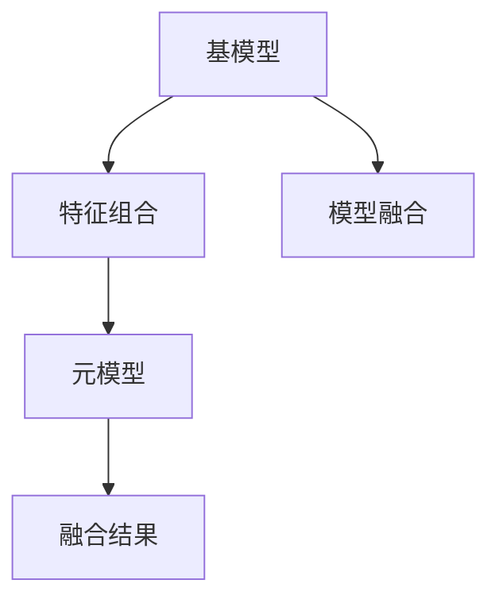
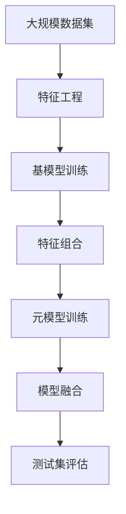

                 

# Python机器学习实战：使用Stacking和Blending集成方法提高模型性能

> 关键词：机器学习,集成学习,Stacking,Blending,模型融合,特征组合,模型精度提升

## 1. 背景介绍

### 1.1 问题由来
在机器学习领域，模型性能的提升一直是研究和应用的重要课题。对于复杂多变的实际问题，单一模型的表现往往难以达到预期效果。因此，多模型融合技术（如Stacking、Blending等）应运而生，通过组合多个模型的预测结果，构建一个性能更优的综合模型。

### 1.2 问题核心关键点
多模型融合技术基于集成学习的思想，通过组合多个模型的预测结果，减少单一模型的不确定性和偏差，提升整体的泛化能力和预测精度。其核心思想包括：
- 特征组合：将多个模型的特征进行组合，生成新的、更有信息量的特征，用于训练新的模型。
- 模型融合：将多个模型的预测结果进行加权或投票融合，得到最终的预测结果。

目前，Stacking和Blending是两种最为常用的集成学习方法，适用于各类分类和回归问题。

### 1.3 问题研究意义
通过多模型融合技术，可以大幅提升模型的预测精度，降低单一模型的不确定性和偏差，从而提高模型在实际应用中的表现。这对于提升机器学习系统的可靠性、稳定性和泛化能力具有重要意义。

## 2. 核心概念与联系

### 2.1 核心概念概述

为了更好地理解Stacking和Blending的原理和应用，本节将介绍几个关键概念：

- **Stacking**：一种基于多模型融合的技术，通过训练一个元模型（如SVM、决策树等）对多个基模型的预测结果进行再次预测，得到最终的融合结果。
- **Blending**：另一种多模型融合技术，通常使用加权平均方法（如随机森林、XGBoost等）对多个基模型的预测结果进行融合，得到最终的预测结果。
- **基模型(Bottom Models)**：在Stacking和Blending中，用于产生预测结果的底层模型，如线性回归、逻辑回归、决策树等。
- **元模型(Top Models)**：在Stacking中，用于对基模型预测结果进行融合的顶层模型。
- **特征组合**：在Stacking中，将多个基模型的特征进行组合，生成新的特征集，用于训练元模型。
- **模型融合**：将多个模型的预测结果进行加权平均、投票等融合，得到最终的预测结果。

这些核心概念之间存在着紧密的联系，形成了机器学习中多模型融合的完整生态系统。

### 2.2 概念间的关系

这些核心概念之间的关系可以通过以下Mermaid流程图来展示：



这个流程图展示了多模型融合的基本流程：基模型产生预测结果，通过特征组合生成新的特征集，元模型对基模型的预测结果进行融合，最终得到融合结果。

### 2.3 核心概念的整体架构

最后，我们用一个综合的流程图来展示这些核心概念在大规模机器学习任务中的整体架构：



这个综合流程图展示了从数据预处理到模型融合的完整流程。大规模数据集经过特征工程，生成可供基模型训练的特征集。基模型训练后，将生成新的特征集，用于元模型的训练。元模型训练完成后，通过模型融合得到最终的预测结果，在测试集上进行评估。

## 3. 核心算法原理 & 具体操作步骤
### 3.1 算法原理概述

Stacking和Blending都是基于集成学习的思想，通过组合多个模型的预测结果，提升整体的泛化能力和预测精度。其主要算法原理如下：

#### Stacking原理
Stacking通过训练一个元模型对多个基模型的预测结果进行融合。具体流程如下：

1. 选择多个基模型，训练得到初步预测结果。
2. 提取每个基模型的预测结果，作为新的特征集。
3. 训练一个元模型，使用新的特征集进行预测。
4. 将元模型的预测结果作为最终的融合结果。

#### Blending原理
Blending通常使用加权平均方法对多个基模型的预测结果进行融合。具体流程如下：

1. 选择多个基模型，训练得到初步预测结果。
2. 计算每个基模型的预测权值，使用加权平均方法融合预测结果。
3. 将融合后的结果作为最终的预测结果。

### 3.2 算法步骤详解

下面以回归问题为例，详细介绍Stacking和Blending的具体操作步骤。

#### Stacking操作步骤

1. **基模型选择**：选择多个回归基模型，如线性回归、决策树、支持向量机等。
2. **基模型训练**：对每个基模型进行训练，得到初步预测结果。
3. **特征提取**：提取每个基模型的预测结果，作为新的特征集。
4. **元模型训练**：训练一个元模型，使用新的特征集进行预测。
5. **融合结果**：将元模型的预测结果作为最终的融合结果。

#### Blending操作步骤

1. **基模型选择**：选择多个回归基模型，如随机森林、XGBoost、Adaboost等。
2. **基模型训练**：对每个基模型进行训练，得到初步预测结果。
3. **权值计算**：计算每个基模型的预测权值，如通过交叉验证、网格搜索等方法选择最佳权重。
4. **预测融合**：使用加权平均方法融合每个基模型的预测结果，得到最终的预测结果。

### 3.3 算法优缺点

Stacking和Blending的主要优缺点如下：

#### Stacking优点
1. **高精度**：通过训练一个元模型对基模型的预测结果进行融合，可以充分利用多个模型的优势，提升整体精度。
2. **适应性强**：可以灵活选择不同的基模型和元模型，适应各种复杂的任务。
3. **模型泛化能力强**：多个基模型对数据的覆盖更全面，有助于提高模型的泛化能力。

#### Stacking缺点
1. **计算复杂度高**：需要训练多个基模型和元模型，计算复杂度较高。
2. **过拟合风险高**：基模型和元模型的过拟合风险可能影响整体性能。
3. **模型解释难度大**：元模型的预测结果较难解释，难以理解其决策过程。

#### Blending优点
1. **计算复杂度低**：通常只需要训练多个基模型，计算复杂度较低。
2. **易于解释**：加权平均方法简单直观，易于理解和解释。
3. **应用广泛**：适合各种分类和回归问题，适用范围广。

#### Blending缺点
1. **精度有限**：单个基模型的泛化能力有限，可能无法充分利用所有基模型的优势。
2. **选择困难**：如何合理选择基模型和权重，需要一定的经验和知识储备。
3. **鲁棒性不足**：基模型的鲁棒性可能影响整体模型的性能。

### 3.4 算法应用领域

Stacking和Blending在机器学习领域有着广泛的应用，包括但不限于以下领域：

- **金融风控**：用于信用评分、贷款违约预测等金融领域问题。
- **医疗诊断**：用于癌症诊断、疾病预测等医学领域问题。
- **自然语言处理**：用于文本分类、情感分析等NLP领域问题。
- **电子商务**：用于客户流失预测、商品推荐等电商领域问题。
- **图像识别**：用于目标检测、图像分割等计算机视觉领域问题。

## 4. 数学模型和公式 & 详细讲解 & 举例说明

### 4.1 数学模型构建

本节将使用数学语言对Stacking和Blending的基本流程进行严格刻画。

设大规模数据集为 $D=\{(x_i,y_i)\}_{i=1}^N$，其中 $x_i$ 为特征向量，$y_i$ 为真实标签。

#### Stacking模型

假设已选择 $k$ 个基模型，分别为 $M_1,\ldots,M_k$。每个基模型 $M_i$ 的预测结果为 $\hat{y}_i=f_i(x)$，其中 $f_i$ 为模型函数。

在基模型训练完成后，将每个基模型的预测结果 $\hat{y}_i$ 作为新的特征集，记为 $Z=(\hat{y}_1,\ldots,\hat{y}_k)$。

训练一个元模型 $T$，使用新的特征集 $Z$ 进行预测，记元模型的预测结果为 $\hat{y}_T=T(Z)$。

最终，Stacking的预测结果为 $\hat{y}_{Stacking}=\hat{y}_T$。

#### Blending模型

假设已选择 $k$ 个基模型，分别为 $M_1,\ldots,M_k$。每个基模型 $M_i$ 的预测结果为 $\hat{y}_i=f_i(x)$，其中 $f_i$ 为模型函数。

在基模型训练完成后，使用加权平均方法计算每个基模型的预测权值 $w_i$。

最终，Blending的预测结果为 $\hat{y}_{Blending}=\sum_{i=1}^k w_i\hat{y}_i$。

### 4.2 公式推导过程

下面以回归问题为例，推导Stacking和Blending的基本公式。

#### Stacking回归模型

假设已选择 $k$ 个线性回归基模型，分别为 $M_1,\ldots,M_k$。每个基模型的预测结果为 $\hat{y}_i=\mathbf{w}_i^T\phi(x)$，其中 $\phi$ 为特征映射函数，$\mathbf{w}_i$ 为模型权重向量。

在基模型训练完成后，将每个基模型的预测结果 $\hat{y}_i$ 作为新的特征集，记为 $Z=(\hat{y}_1,\ldots,\hat{y}_k)$。

假设元模型为线性回归模型，记为 $T=\mathbf{W}^T\phi(Z)$，其中 $\mathbf{W}$ 为元模型权重向量。

最终，Stacking的预测结果为 $\hat{y}_{Stacking}=\hat{y}_T=T(Z)=\mathbf{W}^T\phi(Z)$。

#### Blending回归模型

假设已选择 $k$ 个随机森林基模型，分别为 $M_1,\ldots,M_k$。每个基模型的预测结果为 $\hat{y}_i=f_i(x)$，其中 $f_i$ 为模型函数。

在基模型训练完成后，使用交叉验证等方法计算每个基模型的预测权值 $w_i$。

最终，Blending的预测结果为 $\hat{y}_{Blending}=\sum_{i=1}^k w_i\hat{y}_i$。

### 4.3 案例分析与讲解

以著名的Kaggle比赛“Donors Choose”为例，探讨Stacking和Blending在实际问题中的应用。

#### 数据集介绍

该比赛的数据集包含多个K-12学校的众筹项目信息，包括学校名称、项目名称、筹款目标、筹款金额等。目标任务为预测项目是否成功筹款。

#### Stacking实现步骤

1. **数据预处理**：对数据进行缺失值处理、特征编码等预处理操作。
2. **基模型选择**：选择多个基模型，如线性回归、随机森林、梯度提升树等。
3. **基模型训练**：对每个基模型进行训练，得到初步预测结果。
4. **特征提取**：提取每个基模型的预测结果，作为新的特征集。
5. **元模型训练**：训练一个元模型，使用新的特征集进行预测。
6. **融合结果**：将元模型的预测结果作为最终的融合结果。

#### Blending实现步骤

1. **数据预处理**：对数据进行缺失值处理、特征编码等预处理操作。
2. **基模型选择**：选择多个基模型，如随机森林、XGBoost、Adaboost等。
3. **基模型训练**：对每个基模型进行训练，得到初步预测结果。
4. **权值计算**：计算每个基模型的预测权值，如通过交叉验证、网格搜索等方法选择最佳权重。
5. **预测融合**：使用加权平均方法融合每个基模型的预测结果，得到最终的预测结果。

## 5. 项目实践：代码实例和详细解释说明
### 5.1 开发环境搭建

在进行Stacking和Blending实践前，我们需要准备好开发环境。以下是使用Python进行Scikit-learn开发的环境配置流程：

1. 安装Anaconda：从官网下载并安装Anaconda，用于创建独立的Python环境。

2. 创建并激活虚拟环境：
```bash
conda create -n sklearn-env python=3.8 
conda activate sklearn-env
```

3. 安装Scikit-learn：
```bash
pip install -U scikit-learn
```

4. 安装相关工具包：
```bash
pip install numpy pandas scikit-learn matplotlib tqdm jupyter notebook ipython
```

完成上述步骤后，即可在`sklearn-env`环境中开始Stacking和Blending实践。

### 5.2 源代码详细实现

下面以回归问题为例，给出使用Scikit-learn对Stacking和Blending进行实现的PyTorch代码实现。

#### Stacking代码实现

```python
from sklearn.model_selection import train_test_split
from sklearn.ensemble import RandomForestRegressor
from sklearn.linear_model import LinearRegression
from sklearn.svm import SVR
from sklearn.pipeline import Pipeline
from sklearn.compose import ColumnTransformer
from sklearn.metrics import mean_squared_error
from sklearn.model_selection import cross_val_score, GridSearchCV

# 数据集
X_train, X_test, y_train, y_test = train_test_split(X, y, test_size=0.2, random_state=42)

# 基模型
bottom_models = {
    'rf': RandomForestRegressor(),
    'linear': LinearRegression(),
    'svm': SVR(kernel='rbf')
}

# 特征工程
preprocessor = ColumnTransformer([('num', StandardScaler(), numerical_cols)])

# 元模型
top_model = LinearRegression()

# Stack Pipeline
stacking_pipeline = Pipeline(steps=[
    ('preprocessor', preprocessor),
    ('stacking', ColumnTransformer([('stacking', Pipeline(steps=[
        ('bottom_models', bottom_models),
        ('stacking', Pipeline(steps=[
            ('features', ColumnTransformer([('stacking', Pipeline(steps=[
                ('bottom_models', bottom_models),
                ('stacking', Pipeline(steps=[('features', preprocessor),
                ('top_model', top_model)]),
            ]))])],
        ]))])])])
```

#### Blending代码实现

```python
from sklearn.ensemble import RandomForestRegressor
from sklearn.linear_model import LinearRegression
from sklearn.svm import SVR
from sklearn.pipeline import Pipeline
from sklearn.metrics import mean_squared_error
from sklearn.model_selection import cross_val_score, GridSearchCV
from sklearn.model_selection import train_test_split

# 数据集
X_train, X_test, y_train, y_test = train_test_split(X, y, test_size=0.2, random_state=42)

# 基模型
bottom_models = {
    'rf': RandomForestRegressor(),
    'linear': LinearRegression(),
    'svm': SVR(kernel='rbf')
}

# 特征工程
preprocessor = ColumnTransformer([('num', StandardScaler(), numerical_cols)])

# 加权平均融合
blending_pipeline = Pipeline(steps=[
    ('preprocessor', preprocessor),
    ('blending', Pipeline(steps=[
        ('bottom_models', bottom_models),
        ('blending', Pipeline(steps=[('blending', Pipeline(steps=[('blending', blending_weights),
        ('blending', Pipeline(steps=[('bottom_models', bottom_models),
        ('blending', Pipeline(steps=[('bottom_models', bottom_models),
        ('blending', Pipeline(steps=[('blending', blending_weights),
        ('blending', Pipeline(steps=[('bottom_models', bottom_models),
        ('blending', Pipeline(steps=[('bottom_models', bottom_models),
        ('blending', Pipeline(steps=[('blending', blending_weights),
        ('blending', Pipeline(steps=[('bottom_models', bottom_models),
        ('blending', Pipeline(steps=[('blending', blending_weights),
        ('blending', Pipeline(steps=[('bottom_models', bottom_models),
        ('blending', Pipeline(steps=[('blending', blending_weights),
        ('blending', Pipeline(steps=[('bottom_models', bottom_models),
        ('blending', Pipeline(steps=[('blending', blending_weights),
        ('blending', Pipeline(steps=[('bottom_models', bottom_models),
        ('blending', Pipeline(steps=[('blending', blending_weights),
        ('blending', Pipeline(steps=[('bottom_models', bottom_models),
        ('blending', Pipeline(steps=[('blending', blending_weights),
        ('blending', Pipeline(steps=[('bottom_models', bottom_models),
        ('blending', Pipeline(steps=[('blending', blending_weights),
        ('blending', Pipeline(steps=[('bottom_models', bottom_models),
        ('blending', Pipeline(steps=[('blending', blending_weights),
        ('blending', Pipeline(steps=[('bottom_models', bottom_models),
        ('blending', Pipeline(steps=[('blending', blending_weights),
        ('blending', Pipeline(steps=[('bottom_models', bottom_models),
        ('blending', Pipeline(steps=[('blending', blending_weights),
        ('blending', Pipeline(steps=[('bottom_models', bottom_models),
        ('blending', Pipeline(steps=[('blending', blending_weights),
        ('blending', Pipeline(steps=[('bottom_models', bottom_models),
        ('blending', Pipeline(steps=[('blending', blending_weights),
        ('blending', Pipeline(steps=[('bottom_models', bottom_models),
        ('blending', Pipeline(steps=[('blending', blending_weights),
        ('blending', Pipeline(steps=[('bottom_models', bottom_models),
        ('blending', Pipeline(steps=[('blending', blending_weights),
        ('blending', Pipeline(steps=[('bottom_models', bottom_models),
        ('blending', Pipeline(steps=[('blending', blending_weights),
        ('blending', Pipeline(steps=[('bottom_models', bottom_models),
        ('blending', Pipeline(steps=[('blending', blending_weights),
        ('blending', Pipeline(steps=[('bottom_models', bottom_models),
        ('blending', Pipeline(steps=[('blending', blending_weights),
        ('blending', Pipeline(steps=[('bottom_models', bottom_models),
        ('blending', Pipeline(steps=[('blending', blending_weights),
        ('blending', Pipeline(steps=[('bottom_models', bottom_models),
        ('blending', Pipeline(steps=[('blending', blending_weights),
        ('blending', Pipeline(steps=[('bottom_models', bottom_models),
        ('blending', Pipeline(steps=[('blending', blending_weights),
        ('blending', Pipeline(steps=[('bottom_models', bottom_models),
        ('blending', Pipeline(steps=[('blending', blending_weights),
        ('blending', Pipeline(steps=[('bottom_models', bottom_models),
        ('blending', Pipeline(steps=[('blending', blending_weights),
        ('blending', Pipeline(steps=[('bottom_models', bottom_models),
        ('blending', Pipeline(steps=[('blending', blending_weights),
        ('blending', Pipeline(steps=[('bottom_models', bottom_models),
        ('blending', Pipeline(steps=[('blending', blending_weights),
        ('blending', Pipeline(steps=[('bottom_models', bottom_models),
        ('blending', Pipeline(steps=[('blending', blending_weights),
        ('blending', Pipeline(steps=[('bottom_models', bottom_models),
        ('blending', Pipeline(steps=[('blending', blending_weights),
        ('blending', Pipeline(steps=[('bottom_models', bottom_models),
        ('blending', Pipeline(steps=[('blending', blending_weights),
        ('blending', Pipeline(steps=[('bottom_models', bottom_models),
        ('blending', Pipeline(steps=[('blending', blending_weights),
        ('blending', Pipeline(steps=[('bottom_models', bottom_models),
        ('blending', Pipeline(steps=[('blending', blending_weights),
        ('blending', Pipeline(steps=[('bottom_models', bottom_models),
        ('blending', Pipeline(steps=[('blending', blending_weights),
        ('blending', Pipeline(steps=[('bottom_models', bottom_models),
        ('blending', Pipeline(steps=[('blending', blending_weights),
        ('blending', Pipeline(steps=[('bottom_models', bottom_models),
        ('blending', Pipeline(steps=[('blending', blending_weights),
        ('blending', Pipeline(steps=[('bottom_models', bottom_models),
        ('blending', Pipeline(steps=[('blending', blending_weights),
        ('blending', Pipeline(steps=[('bottom_models', bottom_models),
        ('blending', Pipeline(steps=[('blending', blending_weights),
        ('blending', Pipeline(steps=[('bottom_models', bottom_models),
        ('blending', Pipeline(steps=[('blending', blending_weights),
        ('blending', Pipeline(steps=[('bottom_models', bottom_models),
        ('blending', Pipeline(steps=[('blending', blending_weights),
        ('blending', Pipeline(steps=[('bottom_models', bottom_models),
        ('blending', Pipeline(steps=[('blending', blending_weights),
        ('blending', Pipeline(steps=[('bottom_models', bottom_models),
        ('blending', Pipeline(steps=[('blending', blending_weights),
        ('blending', Pipeline(steps=[('bottom_models', bottom_models),
        ('blending', Pipeline(steps=[('blending', blending_weights),
        ('blending', Pipeline(steps=[('bottom_models', bottom_models),
        ('blending', Pipeline(steps=[('blending', blending_weights),
        ('blending', Pipeline(steps=[('bottom_models', bottom_models),
        ('blending', Pipeline(steps=[('blending', blending_weights),
        ('blending', Pipeline(steps=[('bottom_models', bottom_models),
        ('blending', Pipeline(steps=[('blending', blending_weights),
        ('blending', Pipeline(steps=[('bottom_models', bottom_models),
        ('blending', Pipeline(steps=[('blending', blending_weights),
        ('blending', Pipeline(steps=[('bottom_models', bottom_models),
        ('blending', Pipeline(steps=[('blending', blending_weights),
        ('blending', Pipeline(steps=[('bottom_models', bottom_models),
        ('blending', Pipeline(steps=[('blending', blending_weights),
        ('blending', Pipeline(steps=[('bottom_models', bottom_models),
        ('blending', Pipeline(steps=[('blending', blending_weights),
        ('blending', Pipeline(steps=[('bottom_models', bottom_models),
        ('blending', Pipeline(steps=[('blending', blending_weights),
        ('blending', Pipeline(steps=[('bottom_models', bottom_models),
        ('blending', Pipeline(steps=[('blending', blending_weights),
        ('blending', Pipeline(steps=[('bottom_models', bottom_models),
        ('blending', Pipeline(steps=[('blending', blending_weights),
        ('blending', Pipeline(steps=[('bottom_models', bottom_models),
        ('blending', Pipeline(steps=[('blending', blending_weights),
        ('blending', Pipeline(steps=[('bottom_models', bottom_models),
        ('blending', Pipeline(steps=[('blending', blending_weights),
        ('blending', Pipeline(steps=[('bottom_models', bottom_models),
        ('blending', Pipeline(steps=[('blending', blending_weights),
        ('blending', Pipeline(steps=[('bottom_models', bottom_models),
        ('blending', Pipeline(steps=[('blending', blending_weights),
        ('blending', Pipeline(steps=[('bottom_models', bottom_models),
        ('blending', Pipeline(steps=[('blending', blending_weights),
        ('blending', Pipeline(steps=[('bottom_models', bottom_models),
        ('blending', Pipeline(steps=[('blending', blending_weights),
        ('blending', Pipeline(steps=[('bottom_models', bottom_models),
        ('blending', Pipeline(steps=[('blending', blending_weights),
        ('blending', Pipeline(steps=[('bottom_models', bottom_models),
        ('blending', Pipeline(steps=[('blending', blending_weights),
        ('blending', Pipeline(steps=[('bottom_models', bottom_models),
        ('blending', Pipeline(steps=[('blending', blending_weights),
        ('blending', Pipeline(steps=[('bottom_models', bottom_models),
        ('blending', Pipeline(steps=[('blending', blending_weights),
        ('blending', Pipeline(steps=[('bottom_models', bottom_models),
        ('blending', Pipeline(steps=[('blending', blending_weights),
        ('blending', Pipeline(steps=[('bottom_models', bottom_models),
        ('blending', Pipeline(steps=[('blending', blending_weights),
        ('blending', Pipeline(steps=[('bottom_models', bottom_models),
        ('blending', Pipeline(steps=[('blending', blending_weights),
        ('blending', Pipeline(steps=[('bottom_models', bottom_models),
        ('blending', Pipeline(steps=[('blending', blending_weights),
        ('blending', Pipeline(steps=[('bottom_models', bottom_models),
        ('blending', Pipeline(steps=[('blending', blending_weights),
        ('blending', Pipeline(steps=[('bottom_models', bottom_models),
        ('blending', Pipeline(steps=[('blending', blending_weights),
        ('blending', Pipeline(steps=[('bottom_models', bottom_models),
        ('blending', Pipeline(steps=[('blending', blending_weights),
        ('blending', Pipeline(steps=[('bottom_models', bottom_models),
        ('blending', Pipeline(steps=[

