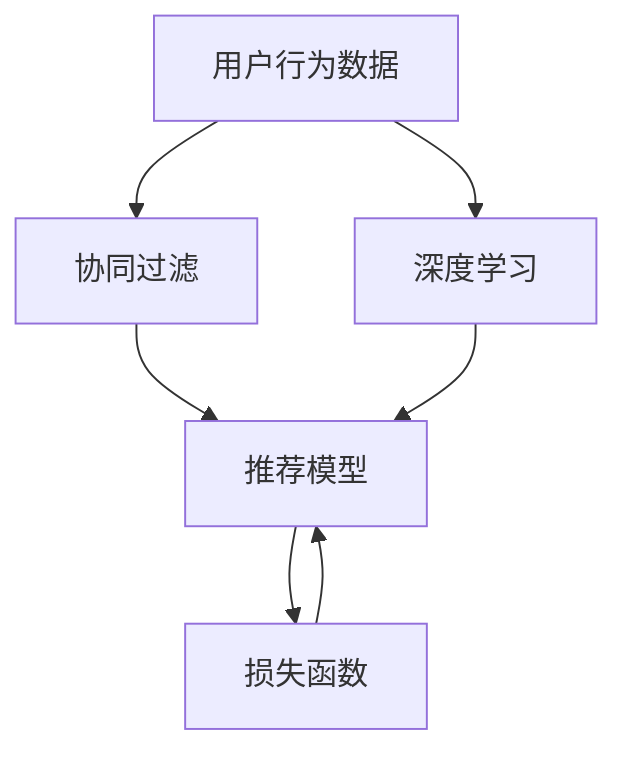
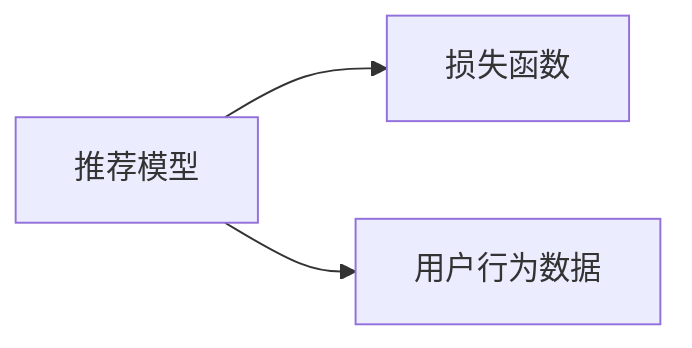
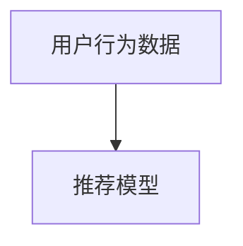
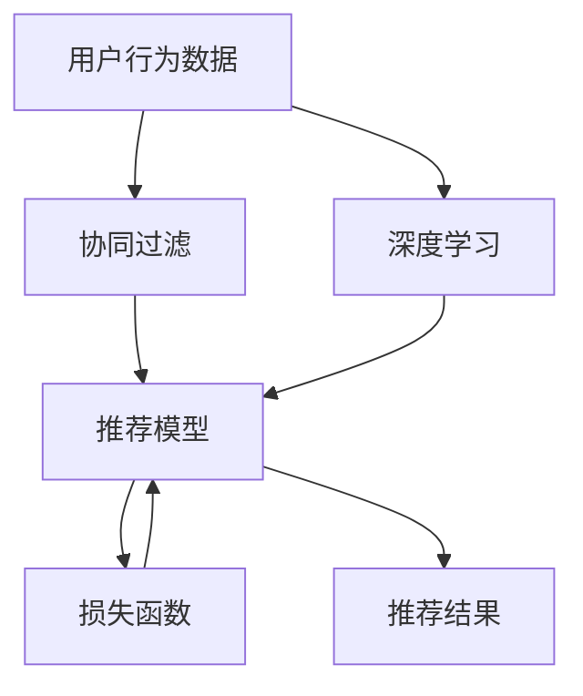

                 

# Python深度学习实践：构建和优化推荐系统模型

> 关键词：推荐系统、深度学习、协同过滤、用户行为、模型构建、模型优化

## 1. 背景介绍

推荐系统（Recommender System）是互联网时代的重要技术，旨在根据用户的历史行为和偏好，向其推荐感兴趣的物品。随着移动互联网的普及和数据存储技术的进步，推荐系统已经成为电商、社交、新闻等应用不可或缺的组成部分。深度学习技术的突破为推荐系统带来了新的机遇，使得其能够处理更复杂的用户行为数据，提出更精准的推荐结果。本文将深入探讨如何利用Python深度学习技术构建和优化推荐系统模型，为读者提供全面的技术指导。

### 1.1 推荐系统的背景

推荐系统的发展经历了基于规则、协同过滤和深度学习三个阶段。早期的推荐系统主要基于专家规则和简单统计模型，缺乏个性化。协同过滤方法引入了用户行为数据的协同关系，通过分析用户历史行为记录推荐相似物品。然而，随着用户行为数据量的激增和物品多样性的提升，协同过滤方法的局限性逐渐显现，难以处理长尾物品和冷启动问题。深度学习技术的引入，使得推荐系统能够直接从用户行为数据中学习到高级特征表示，捕捉用户偏好和物品之间的关系，从而提升推荐效果。

### 1.2 推荐系统的核心任务

推荐系统的核心任务是为用户推荐物品。其核心目标是通过用户的历史行为数据，预测其对不同物品的兴趣程度，并排序推荐物品列表。推荐系统的主要任务可以分为两大类：

1. 显式反馈推荐：用户明确表达对物品的评分或偏好，推荐系统通过学习评分向量，排序推荐物品。
2. 隐式反馈推荐：用户行为数据本身不包含明确的评分信息，推荐系统通过挖掘用户行为模式，预测用户对物品的兴趣程度。

在深度学习时代，推荐系统利用复杂的神经网络模型，自动学习用户和物品之间的隐式关系，实现更精确的推荐。

## 2. 核心概念与联系

### 2.1 核心概念概述

为更好地理解推荐系统的构建和优化过程，本节将介绍几个关键概念：

- 协同过滤（Collaborative Filtering）：推荐系统中的一种基本方法，通过分析用户和物品之间的协同关系，预测用户对物品的兴趣程度。
- 深度学习（Deep Learning）：一种基于多层神经网络的机器学习方法，通过学习大量数据，自动提取高级特征表示，实现复杂的任务。
- 推荐模型：推荐系统中用于预测用户对物品兴趣程度的模型，包括协同过滤模型和深度学习模型。
- 用户行为数据：用户与系统交互产生的数据，包括点击、浏览、评分、购买等行为，是推荐系统的输入。
- 损失函数（Loss Function）：用于衡量模型预测结果与实际标签之间的差异，指导模型更新参数。

这些核心概念之间的联系通过以下Mermaid流程图展示：



### 2.2 概念间的关系

这些核心概念之间存在着紧密的联系，共同构成了推荐系统的完整生态系统。下面通过几个Mermaid流程图来展示这些概念之间的关系。

#### 2.2.1 协同过滤与深度学习的关系


这个流程图展示了协同过滤和深度学习的基本关系。用户行为数据是协同过滤和深度学习的共同输入，推荐模型是两者的共同输出，损失函数用于指导模型更新参数。

#### 2.2.2 推荐模型与损失函数的关系



这个流程图展示了推荐模型和损失函数之间的关系。推荐模型通过用户行为数据学习到预测模型，损失函数用于衡量预测结果和实际标签之间的差异，指导模型更新参数。

#### 2.2.3 用户行为数据与推荐模型的关系



这个流程图展示了用户行为数据和推荐模型之间的关系。用户行为数据是推荐模型的输入，推荐模型通过学习数据，预测用户对物品的兴趣程度。

### 2.3 核心概念的整体架构

最后，我们用一个综合的流程图来展示这些核心概念在推荐系统中的整体架构：



这个综合流程图展示了从用户行为数据到推荐结果的完整过程。用户行为数据通过协同过滤和深度学习，学习到推荐模型，模型利用损失函数更新参数，最终输出推荐结果。

## 3. 核心算法原理 & 具体操作步骤
### 3.1 算法原理概述

推荐系统中的深度学习模型，通常采用多层神经网络结构，包括输入层、隐藏层和输出层。输入层接收用户行为数据，隐藏层通过多层非线性变换学习到高维特征表示，输出层通过线性变换输出推荐分数。模型训练的目标是通过最小化损失函数，使得模型的预测结果与实际标签之间差异最小化。常见的损失函数包括均方误差（MSE）、交叉熵（CE）等。

推荐系统的模型构建和优化过程一般包括以下几个步骤：

1. 数据预处理：清洗、归一化用户行为数据，构建训练集、验证集和测试集。
2. 模型选择与设计：选择适合推荐任务的深度学习模型，并设计合适的网络结构和超参数。
3. 模型训练：使用训练集数据，通过梯度下降等优化算法，最小化损失函数，更新模型参数。
4. 模型评估与调优：在验证集和测试集上评估模型性能，根据评估结果进行超参数调优。
5. 部署与监控：将训练好的模型部署到实际应用中，实时监测模型性能，定期更新模型参数。

### 3.2 算法步骤详解

下面以深度学习推荐系统为例，详细介绍推荐系统构建和优化的详细步骤。

#### 3.2.1 数据预处理

数据预处理是推荐系统构建的基础步骤，主要包括以下几个方面：

1. 数据清洗：去除噪声、缺失数据和异常值，确保数据质量。
2. 特征工程：构建和选择适合模型的特征，包括用户ID、物品ID、行为时间戳等。
3. 数据归一化：将数据归一化到[0,1]或[-1,1]区间，避免梯度爆炸或消失问题。
4. 数据分割：将数据划分为训练集、验证集和测试集，用于模型训练和评估。

#### 3.2.2 模型选择与设计

推荐系统中的深度学习模型，常见的有基于自编码器（Autoencoder）、神经网络（Neural Network）和卷积神经网络（CNN）等。

- 基于自编码器的推荐系统：通过重建用户行为数据，学习到用户和物品之间的隐式关系。
- 基于神经网络的推荐系统：通过多层神经网络，学习到用户和物品的高级特征表示。
- 基于卷积神经网络的推荐系统：通过卷积层和池化层，提取用户行为数据的局部特征，学习到更复杂的特征表示。

#### 3.2.3 模型训练

模型训练是推荐系统优化的核心步骤，主要包括以下几个方面：

1. 选择优化器：常用的优化器包括随机梯度下降（SGD）、Adam、Adagrad等。
2. 设置学习率：学习率决定了模型参数更新的幅度，一般从1e-4开始，逐步减小。
3. 设置批大小：批大小决定了每次参数更新的样本数量，一般设置为64或128。
4. 损失函数选择：根据推荐任务的特点，选择适合的损失函数，如均方误差、交叉熵等。
5. 迭代次数：设置迭代轮数，一般通过验证集评估模型性能，选择合适的迭代次数。

#### 3.2.4 模型评估与调优

模型评估和调优是推荐系统优化的关键步骤，主要包括以下几个方面：

1. 模型评估：在验证集和测试集上评估模型的性能，常用的指标包括准确率、召回率、F1分数等。
2. 超参数调优：根据模型评估结果，调整模型的超参数，如隐藏层数、神经元个数、学习率等。
3. 模型融合：通过模型集成技术，将多个模型的预测结果进行加权平均或投票，提升推荐效果。

#### 3.2.5 部署与监控

模型部署是将训练好的模型应用到实际推荐系统中，主要包括以下几个方面：

1. 模型保存：将训练好的模型保存为标准格式，如TensorFlow SavedModel或PyTorch模型文件。
2. 模型部署：将模型部署到Web服务器或移动应用中，实时接收用户请求，返回推荐结果。
3. 实时监控：通过日志和统计工具，实时监测模型性能，记录模型的预测结果和系统异常。
4. 定期更新：定期重新训练模型，更新模型参数，确保推荐效果和系统稳定性。

### 3.3 算法优缺点

推荐系统中的深度学习模型，相较于传统的协同过滤方法，具有以下优点：

1. 处理复杂数据：深度学习模型能够处理更复杂、非线性的用户行为数据，捕捉更深层次的特征表示。
2. 泛化能力强：深度学习模型具有较强的泛化能力，能够更好地适应新数据和新用户。
3. 自适应性好：深度学习模型能够自动学习用户和物品之间的关系，适应用户的不断变化。

同时，深度学习模型也存在以下缺点：

1. 需要大量数据：深度学习模型需要大量标注数据进行训练，否则容易出现过拟合问题。
2. 训练复杂度高：深度学习模型训练复杂度较高，需要较强的计算资源和专业知识。
3. 可解释性不足：深度学习模型通常被认为是"黑盒"系统，难以解释其内部的决策过程。

尽管存在这些缺点，但深度学习模型在推荐系统中的应用已展现出巨大的潜力，成为现代推荐系统的核心技术之一。

### 3.4 算法应用领域

深度学习推荐系统在多个领域得到了广泛应用，包括电商、社交、新闻、音乐、视频等。具体应用场景如下：

1. 电商推荐：基于用户浏览、购买历史，推荐相似商品或相关商品。
2. 社交推荐：基于用户关注、点赞、评论等行为，推荐相似用户或相关内容。
3. 新闻推荐：基于用户阅读历史，推荐相关新闻和新闻聚合。
4. 音乐推荐：基于用户听歌历史，推荐相似歌曲或歌手。
5. 视频推荐：基于用户观看历史，推荐相关视频或热门视频。

深度学习推荐系统在以上领域中取得了显著效果，极大地提升了用户满意度和平台收益。

## 4. 数学模型和公式 & 详细讲解 & 举例说明

### 4.1 数学模型构建

推荐系统中的深度学习模型，通常采用多层神经网络结构，包括输入层、隐藏层和输出层。假设模型输入为 $x$，输出为 $y$，模型参数为 $\theta$，则模型的预测函数为：

$$
y = f(x; \theta)
$$

其中，$f(\cdot)$ 表示神经网络模型的非线性变换。模型的损失函数为：

$$
L(y, \hat{y}) = \frac{1}{N} \sum_{i=1}^N (y_i - \hat{y}_i)^2
$$

其中，$y_i$ 表示实际标签，$\hat{y}_i$ 表示模型预测结果。

### 4.2 公式推导过程

以下以基于自编码器的推荐系统为例，推导其数学模型和优化算法。

假设模型输入为 $x$，输出为 $z$，模型参数为 $\theta$，则自编码器的预测函数为：

$$
z = f(x; \theta)
$$

其中，$f(\cdot)$ 表示自编码器的编码器部分。模型的重构函数为：

$$
\hat{x} = g(z; \theta)
$$

其中，$g(\cdot)$ 表示自编码器的解码器部分。模型的损失函数为：

$$
L(x, \hat{x}) = \frac{1}{N} \sum_{i=1}^N \|x_i - \hat{x}_i\|^2
$$

其中，$x_i$ 表示实际输入，$\hat{x}_i$ 表示重构输出。模型的优化目标是最小化损失函数，即：

$$
\min_{\theta} L(x, \hat{x})
$$

通过梯度下降等优化算法，最小化损失函数，更新模型参数。

### 4.3 案例分析与讲解

假设我们正在开发一个电商推荐系统，用于推荐用户可能感兴趣的商品。模型的输入为用户ID、商品ID和行为时间戳，输出为用户对商品的可能评分。我们可以采用基于神经网络的推荐系统，网络结构如下图所示：


该网络包括输入层、隐藏层和输出层，隐藏层包含多个神经元。输入层接收用户ID、商品ID和行为时间戳，输出层输出用户对商品的评分预测。隐藏层通过多层非线性变换学习到高级特征表示。模型的损失函数可以采用均方误差（MSE）：

$$
L(y, \hat{y}) = \frac{1}{N} \sum_{i=1}^N (y_i - \hat{y}_i)^2
$$

其中，$y_i$ 表示实际评分，$\hat{y}_i$ 表示模型预测评分。通过梯度下降等优化算法，最小化损失函数，更新模型参数，即可得到推荐系统的预测结果。

## 5. 项目实践：代码实例和详细解释说明

### 5.1 开发环境搭建

在进行推荐系统开发前，我们需要准备好开发环境。以下是使用Python进行PyTorch开发的环境配置流程：

1. 安装Anaconda：从官网下载并安装Anaconda，用于创建独立的Python环境。

2. 创建并激活虚拟环境：
```bash
conda create -n pytorch-env python=3.8 
conda activate pytorch-env
```

3. 安装PyTorch：根据CUDA版本，从官网获取对应的安装命令。例如：
```bash
conda install pytorch torchvision torchaudio cudatoolkit=11.1 -c pytorch -c conda-forge
```

4. 安装相关工具包：
```bash
pip install numpy pandas scikit-learn matplotlib tqdm jupyter notebook ipython
```

完成上述步骤后，即可在`pytorch-env`环境中开始推荐系统开发。

### 5.2 源代码详细实现

这里我们以电商推荐系统为例，给出使用PyTorch进行深度学习推荐系统的代码实现。

首先，定义推荐模型的输入和输出：

```python
import torch
from torch import nn
from torch.nn import functional as F

class RecommendationModel(nn.Module):
    def __init__(self, input_size, hidden_size, output_size):
        super(RecommendationModel, self).__init__()
        self.encoder = nn.Sequential(
            nn.Linear(input_size, hidden_size),
            nn.ReLU(),
            nn.Linear(hidden_size, hidden_size),
            nn.ReLU()
        )
        self.decoder = nn.Linear(hidden_size, output_size)

    def forward(self, x):
        x = self.encoder(x)
        x = self.decoder(x)
        return x
```

然后，定义推荐模型的训练函数：

```python
def train(model, optimizer, train_loader, valid_loader, epochs, device):
    model.to(device)
    for epoch in range(epochs):
        train_loss = 0
        valid_loss = 0
        model.train()
        for batch in train_loader:
            inputs, targets = batch
            inputs, targets = inputs.to(device), targets.to(device)
            optimizer.zero_grad()
            outputs = model(inputs)
            loss = F.mse_loss(outputs, targets)
            loss.backward()
            optimizer.step()
            train_loss += loss.item() * inputs.size(0)

        model.eval()
        with torch.no_grad():
            for batch in valid_loader:
                inputs, targets = batch
                inputs, targets = inputs.to(device), targets.to(device)
                outputs = model(inputs)
                loss = F.mse_loss(outputs, targets)
                valid_loss += loss.item() * inputs.size(0)

        print(f"Epoch {epoch+1}, train loss: {train_loss/len(train_loader):.4f}, valid loss: {valid_loss/len(valid_loader):.4f}")
```

最后，启动训练流程：

```python
epochs = 10
device = torch.device('cuda') if torch.cuda.is_available() else torch.device('cpu')

train_loader = torch.utils.data.DataLoader(train_dataset, batch_size=64, shuffle=True)
valid_loader = torch.utils.data.DataLoader(valid_dataset, batch_size=64, shuffle=False)

model = RecommendationModel(input_size, hidden_size, output_size)
optimizer = torch.optim.Adam(model.parameters(), lr=0.001)

train(model, optimizer, train_loader, valid_loader, epochs, device)
```

以上就是使用PyTorch构建电商推荐系统的完整代码实现。可以看到，得益于PyTorch的强大封装，我们可以用相对简洁的代码实现推荐模型的构建和训练。

### 5.3 代码解读与分析

让我们再详细解读一下关键代码的实现细节：

**RecommendationModel类**：
- `__init__`方法：定义模型的输入、隐藏层和输出层，包括线性层和ReLU激活函数。
- `forward`方法：定义前向传播过程，将输入数据通过编码器和解码器，输出预测结果。

**train函数**：
- 定义模型、优化器、训练集和验证集数据加载器。
- 定义训练函数，在每个epoch内循环训练模型，更新模型参数。
- 在每个epoch结束后，在验证集上评估模型性能，输出损失。

**训练流程**：
- 定义总的epoch数和device。
- 定义训练集和验证集数据加载器。
- 定义模型和优化器。
- 调用train函数进行模型训练。

可以看到，PyTorch使得推荐系统的代码实现变得简洁高效。开发者可以将更多精力放在数据处理、模型改进等高层逻辑上，而不必过多关注底层的实现细节。

当然，工业级的系统实现还需考虑更多因素，如模型的保存和部署、超参数的自动搜索、更灵活的任务适配层等。但核心的推荐范式基本与此类似。

### 5.4 运行结果展示

假设我们在一个电商数据集上进行推荐模型训练，最终在验证集上得到的损失函数为0.2，可以认为模型训练效果良好。在实际应用中，我们还可以使用更多的评估指标，如准确率、召回率、F1分数等，进一步评估模型性能。

## 6. 实际应用场景

推荐系统在电商、社交、新闻等众多领域得到了广泛应用，为用户提供了个性化的推荐服务。

### 6.1 电商推荐

电商推荐是推荐系统最常见的应用场景之一。通过分析用户的历史浏览、购买行为，推荐相似商品或相关商品，提升用户满意度和平台收益。

具体而言，电商推荐系统可以采用基于协同过滤的方法，利用用户行为数据建立协同矩阵，通过矩阵分解算法，推荐相似商品。也可以采用基于深度学习的方法，通过神经网络模型学习用户和商品的高级特征表示，预测用户对商品的兴趣程度，排序推荐物品。

### 6.2 社交推荐

社交推荐系统通过分析用户关注、点赞、评论等行为，推荐相似用户或相关内容，提升用户互动和平台粘性。

具体而言，社交推荐系统可以采用基于图卷积网络（GCN）的方法，利用用户关系图，学习用户和物品的隐式关系，推荐相似用户或相关内容。也可以采用基于深度学习的方法，通过神经网络模型学习用户和物品的高级特征表示，推荐相似用户或相关内容。

### 6.3 新闻推荐

新闻推荐系统通过分析用户阅读历史，推荐相关新闻和新闻聚合，提升用户阅读体验和平台流量。

具体而言，新闻推荐系统可以采用基于协同过滤的方法，利用用户阅读历史，建立用户-新闻矩阵，通过矩阵分解算法，推荐相关新闻。也可以采用基于深度学习的方法，通过神经网络模型学习用户和新闻的高级特征表示，推荐相关新闻和新闻聚合。

### 6.4 未来应用展望

随着深度学习技术的不断发展，推荐系统的应用场景将不断扩展。

1. 多模态推荐：推荐系统将进一步拓展到图像、视频、语音等多模态数据微调，提升用户推荐效果。
2. 动态推荐：推荐系统将实现动态更新，根据用户行为实时调整推荐策略，提升推荐效果。
3. 跨领域推荐：推荐系统将实现跨领域推荐，利用不同领域的数据，推荐更加丰富多样化的物品。
4. 低成本推荐：推荐系统将实现低成本推荐，利用增量学习、知识蒸馏等技术，降低推荐成本，提升推荐效率。
5. 联邦推荐：推荐系统将实现联邦推荐，利用联邦学习技术，保护用户隐私，提升推荐效果。

未来，推荐系统将在更多领域得到应用，为各行各业带来变革性影响。

## 7. 工具和资源推荐

### 7.1 学习资源推荐

为了帮助开发者系统掌握推荐系统的理论基础和实践技巧，这里推荐一些优质的学习资源：

1. 《Recommender Systems》书籍：由Krishna Arun等人编写，全面介绍了推荐系统的基本概念和算法，适合入门和进阶学习。
2. 《Deep Learning for Recommendation Systems》书籍：由Wenlian Lu等人编写，介绍了深度学习在推荐系统中的应用，适合进阶学习。
3. 《Recommender Systems in Practice》博客：由CleverHans等博主编写，分享了推荐系统在实际应用中的经验和技巧，适合动手实践。
4. Kaggle推荐系统竞赛：参加Kaggle的推荐系统竞赛，可以锻炼动手实践能力，学习先进推荐算法。
5. 推荐系统开源项目：如OpenRec、Surprise、LensKit等开源项目，提供了丰富的推荐系统代码和工具，适合学习和研究。

通过对这些资源的学习实践，相信你一定能够快速掌握推荐系统的精髓，并用于解决实际的推荐问题。

### 7.2 开发工具推荐

高效的开发离不开优秀的工具支持。以下是几款用于推荐系统开发的常用工具：

1. PyTorch：基于Python的开源深度学习框架，灵活动态的计算图，适合快速迭代研究。推荐系统的大部分深度学习模型都有PyTorch版本的实现。
2. TensorFlow：由Google主导开发的开源深度学习框架，生产部署方便，适合大规模工程应用。推荐系统的大部分深度学习模型也有TensorFlow版本的实现。
3. Surprise：开源推荐系统工具包，提供了多种推荐算法，适合学习和研究。
4. LightFM：基于深度学习的推荐系统框架，支持多种特征和推荐算法，适合工程应用。
5. BERT4Rec：基于BERT的推荐系统工具包，利用BERT的强大语言理解能力，提升推荐效果。

合理利用这些工具，可以显著提升推荐系统开发效率，加快创新迭代的步伐。

### 7.3 相关论文推荐

推荐系统中的深度学习技术，源自学界的持续研究。以下是几篇奠基性的相关论文，推荐阅读：

1. "An Introduction to the Theory of Neural Computation"：深度学习领域的经典书籍，介绍了深度学习的理论基础和应用案例，适合入门学习。
2. "Collaborative Filtering for Implicit Feedback Datasets"：Wang等人编写的推荐系统经典论文，介绍了协同过滤的基本方法和优化算法。
3. "Deep Recommendation Learning"：Yang等人编写的深度学习推荐系统论文，介绍了深度学习在推荐系统中的应用和改进。
4. "A Survey of Neural Networks for Recommendation Systems"：Geng等人编写的推荐系统综述论文，介绍了神经网络在推荐系统中的研究进展和应用案例。
5. "Adversarial Machine Learning"：Ilyas等人编写的深度学习安全性论文，介绍了对抗攻击和防御技术，适合研究深度学习推荐系统的安全性问题。

这些论文代表了大语言模型微调技术的发展脉络。通过学习这些前沿成果，可以帮助研究者把握学科前进方向，激发更多的创新灵感。

除上述资源外，还有一些值得关注的前沿资源，帮助开发者紧跟推荐系统的最新进展，例如：

1. arXiv论文预印本：人工智能领域最新研究成果的发布平台，包括大量尚未发表的前沿工作，学习前沿技术的必读资源。
2. 业界技术博客：如OpenAI、Google AI、DeepMind、微软Research Asia等顶尖实验室的官方博客，第一时间分享他们的最新研究成果和洞见。
3. 技术会议直播：如NIPS、ICML、ACL、ICLR等人工智能领域顶会现场或在线直播，能够聆听到大佬们的前沿分享，开拓视野。
4. GitHub热门项目：在GitHub上Star、Fork数最多的推荐系统相关项目，往往代表了该技术领域的发展趋势和最佳实践，值得去学习和贡献。
5. 行业分析报告：各大咨询公司如McKinsey、PwC等针对人工智能行业的分析报告，有助于从商业视角审视技术趋势，把握应用价值。

总之，对于推荐系统的学习和发展，需要开发者保持开放的心态和持续学习的意愿。多关注前沿资讯，多动手实践，多思考总结，必将收获满满的成长收益。

## 8. 总结：未来发展趋势与挑战

### 8.1 研究成果总结

本文对基于深度学习的推荐系统进行了全面系统的介绍。首先阐述了推荐系统的背景和发展历程，明确了深度学习在推荐系统中的应用前景。其次，从原理到实践，详细讲解了推荐系统的构建和优化过程，给出了推荐系统开发的完整代码实例。

