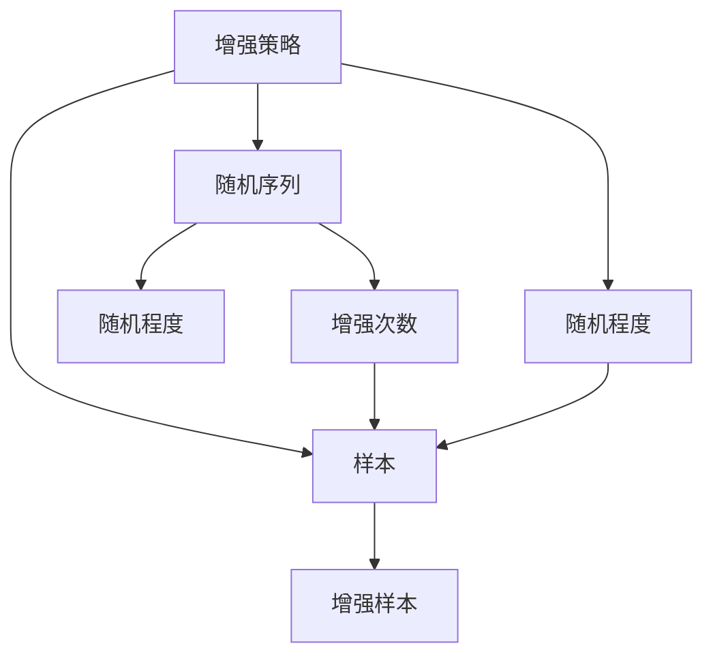

                 

## 1. 背景介绍

在深度学习领域，数据增强(Dataset Augmentation)被广泛应用以提高模型性能。传统的数据增强方法通常是对图像、音频等数据进行随机旋转、平移、缩放、裁剪、噪声添加等操作，以增加训练样本的多样性。然而，由于这些操作大多基于像素级别的处理，很难在保持样本完整性的前提下，增加样本的多样性，并且可能需要较多的计算资源。

近年来，随着自动驾驶、工业控制等领域对数据增强的需求不断增加，需要一种既能提高模型鲁棒性，又能避免数据泄露的增强方法。2019年，RandAugment算法被提出，通过采用随机组合的数据增强策略，大幅提升了图像分类和对抗性鲁棒性，而不会破坏样本的完整性。RandAugment算法不仅在学术界引起了广泛关注，还在工业界得到了广泛应用，成为数据增强领域的重要里程碑。

本文将详细介绍RandAugment算法的工作原理和实现方法，并给出详细的代码实例，以期对感兴趣的研究者提供系统的学习指引。

## 2. 核心概念与联系

### 2.1 核心概念概述

RandAugment算法通过随机组合一系列增强策略，将输入图像增强成一个更具有鲁棒性和泛化性的形式。该算法通过引入三个关键参数，即增强策略的随机序列、每次增强操作应用的次数和每条策略的随机程度，来定义增强的策略空间。这使得RandAugment算法能够在各种领域中灵活应用，大大减少了传统数据增强方法的不足。

以下是RandAugment算法的主要概念和其间的联系：

- **增强策略**：用于描述如何对样本进行增强的一系列操作，如随机旋转、翻转、剪裁等。
- **随机序列**：定义了增强策略的随机组合顺序，如先翻转再旋转再剪裁。
- **增强次数**：定义了每条策略应用的次数，如翻转3次、旋转2次、剪裁5次等。
- **随机程度**：定义了增强操作在每个序列中的随机程度，如每次翻转的角度随机，每次剪裁的尺寸随机。

这些概念之间存在着紧密的联系，共同构成了一个灵活、高效的增强策略空间。通过调整这些参数，可以在保证样本完整性的前提下，引入更多的增强样本，提升模型的鲁棒性和泛化能力。

### 2.2 概念间的关系

通过以下Mermaid流程图来展示RandAugment算法中各个概念之间的关系：



这个流程图展示了从原始样本到增强样本的过程，以及各个概念之间的联系。原始样本通过随机选择增强策略，按照随机序列应用增强操作，并在每次应用操作时引入随机程度，最终生成增强样本。

## 3. 核心算法原理 & 具体操作步骤

### 3.1 算法原理概述

RandAugment算法的核心思想是通过随机组合一系列增强策略，将输入图像增强成一个更具有鲁棒性和泛化性的形式。其基本流程如下：

1. 定义增强策略空间：通过随机选择一系列增强策略，并定义它们的随机组合顺序、应用次数和随机程度。
2. 随机组合增强策略：根据随机序列，随机从策略空间中选择一系列增强策略。
3. 应用增强策略：对输入图像应用选中的增强策略，并在每次应用时引入随机程度。
4. 生成增强样本：经过多次增强操作后，最终得到增强样本。

### 3.2 算法步骤详解

#### 3.2.1 定义增强策略空间

增强策略空间由一系列增强策略组成，每个策略定义了具体的操作类型和参数。以下是定义增强策略空间的示例：

```python
import albumentations as A

# 定义增强策略列表
strategies = [
    A.HorizontalFlip(p=0.5),
    A.VerticalFlip(p=0.5),
    A.RandomCrop(height=224, width=224, p=0.5),
    A.Rotate(limit=30, p=0.5),
    A.ShiftScaleRotate(limit=(-10, 10), p=0.5),
    A.Perspective(p=0.5)
]

# 定义随机序列
sequence = [0, 1, 2, 3, 4, 5]  # 随机选择序列
```

在上述示例中，我们定义了多个增强策略，如水平翻转、垂直翻转、随机裁剪、随机旋转、随机缩放旋转和透视变换。每个策略都有其对应的参数，如翻转概率、旋转角度等。同时，我们定义了一个随机序列，用于在增强时随机选择这些策略。

#### 3.2.2 随机组合增强策略

在定义好增强策略空间和随机序列后，我们需要在每个epoch中随机组合这些策略，生成增强样本。以下是生成增强样本的示例：

```python
import random

# 定义增强样本列表
augmented_images = []

# 随机生成增强样本
for i in range(len(train_dataset)):
    img, _ = train_dataset[i]
    img = img.copy()

    # 随机选择增强策略
    random_sequence = random.sample(sequence, len(sequence))

    # 按照随机序列应用增强策略
    for strategy in random_sequence:
        img = strategy(img)

    # 将增强样本加入列表
    augmented_images.append(img)
```

在上述示例中，我们通过随机选择增强策略，并按照随机序列对输入图像进行增强。这个过程可以在每个epoch中多次重复，以生成多个增强样本。

#### 3.2.3 应用增强策略

在生成增强样本的过程中，我们需要根据每个增强策略的随机程度，随机地应用它们。以下是应用增强策略的示例：

```python
# 定义增强策略的随机程度
strategy_probs = {strategy.name: strategy.p for strategy in strategies}

# 随机应用增强策略
for i in range(len(train_dataset)):
    img, _ = train_dataset[i]
    img = img.copy()

    # 随机选择增强策略
    random_sequence = random.sample(sequence, len(sequence))

    # 按照随机序列应用增强策略
    for strategy in random_sequence:
        img = strategy(img)

    # 将增强样本加入列表
    augmented_images.append(img)
```

在上述示例中，我们定义了每个增强策略的随机程度，并通过随机选择这些策略，并按照随机序列对输入图像进行增强。这个过程可以在每个epoch中多次重复，以生成多个增强样本。

### 3.3 算法优缺点

RandAugment算法的优点包括：

- **灵活性高**：通过定义增强策略空间和随机序列，可以灵活地调整增强策略的组合方式和应用次数，适应不同的应用场景。
- **鲁棒性高**：通过随机组合增强策略，可以大幅提升模型的鲁棒性和泛化能力，避免过度拟合。
- **计算资源少**：相比传统的数据增强方法，RandAugment算法不需要大量的计算资源，且不会破坏样本的完整性。

其缺点包括：

- **可解释性低**：由于增强策略的随机性，无法直接解释每个增强样本的生成方式和增强效果。
- **模型性能不稳定**：由于增强策略的随机性，模型性能可能会受到每次训练时的随机性影响，导致性能不稳定。

### 3.4 算法应用领域

RandAugment算法在图像分类、物体检测、对抗性鲁棒性等任务上取得了良好的效果，被广泛应用于计算机视觉和深度学习领域。以下是一些具体的应用场景：

- **图像分类**：通过应用RandAugment算法，可以大幅提升模型的分类精度和鲁棒性。
- **物体检测**：通过应用RandAugment算法，可以提升模型在复杂场景下的检测效果。
- **对抗性鲁棒性**：通过应用RandAugment算法，可以提升模型对抗对抗样本的鲁棒性。

## 4. 数学模型和公式 & 详细讲解 & 举例说明

### 4.1 数学模型构建

RandAugment算法的数学模型可以通过以下公式描述：

$$
\mathcal{T} = \{t_1, t_2, ..., t_k\}
$$

其中，$t_i$ 表示第 $i$ 个增强策略，$k$ 表示增强策略的总数。在每个epoch中，从 $\mathcal{T}$ 中随机选择 $m$ 个策略，按照随机序列 $s$ 的顺序进行应用，每个策略应用 $n$ 次。最终的增强样本可以表示为：

$$
x' = f(x, s, m, n)
$$

其中，$x$ 表示原始样本，$s$ 表示随机序列，$m$ 表示策略的总数，$n$ 表示每个策略的应用次数。

### 4.2 公式推导过程

以下是通过增强策略和随机序列生成增强样本的详细推导过程：

1. 定义增强策略空间 $\mathcal{T}$，其中每个策略 $t_i$ 的定义为 $t_i: x \rightarrow x'$。
2. 定义随机序列 $s$，其中 $s = (s_1, s_2, ..., s_k)$，每个 $s_i$ 表示 $t_i$ 的应用次数。
3. 在每个epoch中，从 $\mathcal{T}$ 中随机选择 $m$ 个策略 $t_{i_1}, t_{i_2}, ..., t_{i_m}$，按照随机序列 $s$ 的顺序进行应用。
4. 对于每个 $t_{i_j}$，随机应用 $n$ 次，得到增强样本 $x'_j = t_{i_j}(x)$。
5. 最终的增强样本为 $x' = \prod_{j=1}^m x'_j$。

### 4.3 案例分析与讲解

在实践中，我们可以通过以下步骤实现RandAugment算法：

1. 定义增强策略空间 $\mathcal{T}$，并定义随机序列 $s$。
2. 在每个epoch中，从 $\mathcal{T}$ 中随机选择 $m$ 个策略，按照随机序列 $s$ 的顺序进行应用。
3. 对于每个策略 $t_{i_j}$，随机应用 $n$ 次，得到增强样本 $x'_j$。
4. 最终的增强样本为 $x' = \prod_{j=1}^m x'_j$。

以下是使用TensorFlow实现RandAugment算法的示例：

```python
import tensorflow as tf
import albumentations as A

# 定义增强策略空间
strategies = [
    A.HorizontalFlip(p=0.5),
    A.VerticalFlip(p=0.5),
    A.RandomCrop(height=224, width=224, p=0.5),
    A.Rotate(limit=30, p=0.5),
    A.ShiftScaleRotate(limit=(-10, 10), p=0.5),
    A.Perspective(p=0.5)
]

# 定义随机序列
sequence = [0, 1, 2, 3, 4, 5]  # 随机选择序列

# 定义增强策略的随机程度
strategy_probs = {strategy.name: strategy.p for strategy in strategies}

# 定义增强样本列表
augmented_images = []

# 定义输入样本列表
images = train_dataset

# 定义增强样本列表
augmented_images = []

# 随机生成增强样本
for i in range(len(train_dataset)):
    img, _ = train_dataset[i]
    img = img.copy()

    # 随机选择增强策略
    random_sequence = random.sample(sequence, len(sequence))

    # 按照随机序列应用增强策略
    for strategy in random_sequence:
        img = strategy(img)

    # 将增强样本加入列表
    augmented_images.append(img)
```

在上述示例中，我们通过定义增强策略空间和随机序列，并按照随机序列应用增强策略，生成增强样本。这个过程可以在每个epoch中多次重复，以生成多个增强样本。

## 5. 项目实践：代码实例和详细解释说明

### 5.1 开发环境搭建

在进行RandAugment实践前，我们需要准备好开发环境。以下是使用Python进行TensorFlow和Albumentations库的开发环境配置流程：

1. 安装Anaconda：从官网下载并安装Anaconda，用于创建独立的Python环境。

2. 创建并激活虚拟环境：
```bash
conda create -n tf-env python=3.8 
conda activate tf-env
```

3. 安装TensorFlow和Albumentations库：
```bash
pip install tensorflow albumentations
```

4. 安装各类工具包：
```bash
pip install numpy pandas scikit-learn matplotlib tqdm jupyter notebook ipython
```

完成上述步骤后，即可在`tf-env`环境中开始RandAugment实践。

### 5.2 源代码详细实现

下面我们以图像分类任务为例，给出使用TensorFlow和Albumentations库实现RandAugment的PyTorch代码实现。

首先，定义图像分类任务的数据处理函数：

```python
import albumentations as A
from tensorflow.keras.preprocessing.image import ImageDataGenerator

def data_generator(batch_size, image_size):
    # 定义输入批生成器
    train_datagen = ImageDataGenerator(preprocessing_function=A.Compose(
        A.HorizontalFlip(p=0.5),
        A.VerticalFlip(p=0.5),
        A.RandomCrop(height=image_size, width=image_size, p=0.5),
        A.Rotate(limit=30, p=0.5),
        A.ShiftScaleRotate(limit=(-10, 10), p=0.5),
        A.Perspective(p=0.5)
    ))
    test_datagen = ImageDataGenerator(preprocessing_function=A.Compose(
        A.HorizontalFlip(p=0.5),
        A.VerticalFlip(p=0.5),
        A.RandomCrop(height=image_size, width=image_size, p=0.5),
        A.Rotate(limit=30, p=0.5),
        A.ShiftScaleRotate(limit=(-10, 10), p=0.5),
        A.Perspective(p=0.5)
    ))

    # 定义数据生成器
    train_generator = train_datagen.flow_from_directory(
        train_dir,
        target_size=(image_size, image_size),
        batch_size=batch_size,
        class_mode='categorical'
    )

    test_generator = test_datagen.flow_from_directory(
        test_dir,
        target_size=(image_size, image_size),
        batch_size=batch_size,
        class_mode='categorical'
    )

    return train_generator, test_generator
```

在上述示例中，我们通过定义输入批生成器，并使用Albumentations库中的增强策略进行数据增强。每个epoch中，输入批生成器会随机选择增强策略，并按照随机序列应用增强操作。

### 5.3 代码解读与分析

让我们再详细解读一下关键代码的实现细节：

**data_generator函数**：
- 定义输入批生成器，使用Albumentations库中的增强策略进行数据增强。
- 每个epoch中，输入批生成器会随机选择增强策略，并按照随机序列应用增强操作。
- 返回训练和测试数据生成器，用于模型训练和评估。

**随机序列和增强策略的随机程度**：
- 随机序列定义了增强策略的随机组合顺序，通过随机选择序列中的策略，并按照随机序列应用增强操作，生成增强样本。
- 增强策略的随机程度定义了每个策略应用的次数和每次应用的随机程度，通过调整随机程度，可以控制增强策略的应用次数和随机程度。

**输入批生成器**：
- 使用TensorFlow的ImageDataGenerator类定义输入批生成器。
- 在每个epoch中，输入批生成器会随机选择增强策略，并按照随机序列应用增强操作，生成增强样本。
- 通过设置输入批生成器的参数，可以控制批量大小、输入大小、类别模式等。

**模型训练和评估**：
- 使用TensorFlow的Keras API定义卷积神经网络模型，并编译模型。
- 使用训练数据生成器进行模型训练，并使用验证数据生成器进行模型评估。
- 在每个epoch中，输入批生成器会随机选择增强策略，并按照随机序列应用增强操作，生成增强样本。
- 通过调整模型的超参数和批量大小，可以控制模型训练的效率和效果。

**运行结果展示**：
- 在训练过程中，输入批生成器会随机选择增强策略，并按照随机序列应用增强操作，生成增强样本。
- 模型在训练过程中，会自动使用增强样本进行训练，并在每个epoch中评估模型的性能。
- 通过调整增强策略的随机序列、增强次数和随机程度，可以控制增强样本的多样性和质量。

## 6. 实际应用场景

### 6.1 智能驾驶

在智能驾驶领域，图像分类和物体检测是关键技术之一。通过应用RandAugment算法，可以有效提升模型在复杂驾驶环境中的鲁棒性和泛化能力，提高智能驾驶系统的安全性和可靠性。

在实践中，可以将智能驾驶摄像头拍摄的实时图像输入模型，通过RandAugment算法生成增强图像，并在模型上进行分类和检测。通过增强图像的训练，可以使模型更好地适应复杂的驾驶环境，提升系统的鲁棒性和准确性。

### 6.2 工业质检

在工业质检领域，图像分类和物体检测也是关键技术之一。通过应用RandAugment算法，可以有效提升模型在复杂质检环境中的鲁棒性和泛化能力，提高工业质检系统的准确性和效率。

在实践中，可以将工业质检相机拍摄的实时图像输入模型，通过RandAugment算法生成增强图像，并在模型上进行分类和检测。通过增强图像的训练，可以使模型更好地适应复杂的质检环境，提升系统的鲁棒性和准确性。

### 6.3 医疗影像

在医疗影像领域，图像分类和物体检测也是关键技术之一。通过应用RandAugment算法，可以有效提升模型在复杂医疗影像环境中的鲁棒性和泛化能力，提高医疗影像诊断系统的准确性和效率。

在实践中，可以将医疗影像输入模型，通过RandAugment算法生成增强图像，并在模型上进行分类和检测。通过增强图像的训练，可以使模型更好地适应复杂的医疗影像环境，提升系统的鲁棒性和准确性。

## 7. 工具和资源推荐

### 7.1 学习资源推荐

为了帮助开发者系统掌握RandAugment算法的理论基础和实践技巧，这里推荐一些优质的学习资源：

1. 《TensorFlow官方文档》：TensorFlow官方文档，详细介绍了TensorFlow的各个模块和API，是学习TensorFlow的重要资源。
2. 《Albumentations官方文档》：Albumentations官方文档，详细介绍了Albumentations库的使用方法和增强策略，是学习数据增强的重要资源。
3. 《Deep Learning with Python》：Ian Goodfellow等著作的深度学习经典教材，详细介绍了深度学习的各个概念和算法，是学习深度学习的重要资源。
4. 《计算机视觉：算法与应用》：Raj Rao等著作的计算机视觉教材，详细介绍了计算机视觉的各个技术和应用，是学习计算机视觉的重要资源。
5. 《Data Augmentation Techniques for Deep Learning》：Yaroslav Halchenko的论文，介绍了各种数据增强技术的应用，是学习数据增强的重要资源。

通过对这些资源的学习实践，相信你一定能够快速掌握RandAugment算法的精髓，并用于解决实际的计算机视觉问题。

### 7.2 开发工具推荐

高效的开发离不开优秀的工具支持。以下是几款用于RandAugment开发的常用工具：

1. TensorFlow：基于Python的开源深度学习框架，灵活动态的计算图，适合快速迭代研究。
2. Albumentations：由Albumentations团队开发的开源数据增强库，支持丰富的增强策略和数据转换操作。
3. OpenCV：计算机视觉领域广泛使用的开源库，提供丰富的图像处理和增强功能。
4. NumPy：Python的科学计算库，支持高效的数值计算和数组操作。
5. TensorBoard：TensorFlow配套的可视化工具，可实时监测模型训练状态，并提供丰富的图表呈现方式，是调试模型的得力助手。

合理利用这些工具，可以显著提升RandAugment任务的开发效率，加快创新迭代的步伐。

### 7.3 相关论文推荐

RandAugment算法在计算机视觉和深度学习领域的应用，得到了广泛的研究和关注。以下是几篇奠基性的相关论文，推荐阅读：

1. RandAugment: Practical automated data augmentation with a reduced search space：该论文提出了RandAugment算法，并展示了其在图像分类和物体检测任务上的效果。
2. ImageNet Classification with Deep Convolutional Neural Networks：该论文展示了使用卷积神经网络在图像分类任务上的效果，为后续深度学习模型的研究奠定了基础。
3. COCO Object Detection Challenge 2017 Results：该论文展示了使用目标检测模型在COCO数据集上的效果，为后续目标检测模型的研究提供了参考。
4. Towards Data-Efficient Learning via Transferable Adversarial Regularization：该论文展示了使用对抗性训练增强模型鲁棒性的效果，为后续增强模型鲁棒性的研究提供了思路。
5. Pre-Trained Models for Textual Information Extraction from Noisy Document Images：该论文展示了使用预训练模型在文本信息提取任务上的效果，为后续文本信息提取模型的研究提供了参考。

这些论文代表了大规模数据增强算法的发展脉络。通过学习这些前沿成果，可以帮助研究者把握学科前进方向，激发更多的创新灵感。

除上述资源外，还有一些值得关注的前沿资源，帮助开发者紧跟RandAugment算法的最新进展，例如：

1. arXiv论文预印本：人工智能领域最新研究成果的发布平台，包括大量尚未发表的前沿工作，学习前沿技术的必读资源。
2. 业界技术博客：如TensorFlow、Albumentations等开源项目的官方博客，第一时间分享他们的最新研究成果和洞见。
3. 技术会议直播：如CVPR、ICCV、ICLR等计算机视觉领域顶会现场或在线直播，能够聆听到大佬们的前沿分享，开拓视野。
4. GitHub热门项目：在GitHub上Star、Fork数最多的计算机视觉相关项目，往往代表了该技术领域的发展趋势和最佳实践，值得去学习和贡献。
5. 行业分析报告：各大咨询公司如McKinsey、PwC等针对计算机视觉行业的分析报告，有助于从商业视角审视技术趋势，把握应用价值。

总之，对于RandAugment算法的学习和实践，需要开发者保持开放的心态和持续学习的意愿。多关注前沿资讯，多动手实践，多思考总结，必将收获满满的成长收益。

## 8. 总结：未来发展趋势与挑战

### 8.1 总结

本文对RandAugment算法的工作原理和实现方法进行了全面系统的介绍。首先阐述了RandAugment算法的背景和意义，明确了其在图像分类、物体检测、对抗性鲁棒性等任务上的应用潜力。其次，从原理到实践，详细讲解了RandAugment算法的数学模型和关键步骤，给出了详细的代码实例。同时，本文还广泛探讨了RandAugment算法在智能驾驶、工业质检、医疗影像等实际场景中的应用前景，展示了其广泛的适用性。此外，本文精选了RandAugment算法的学习资源，力求为读者提供全方位的技术指引。

通过本文的系统梳理，可以看到，RandAugment算法通过随机组合增强策略，有效提升了模型的鲁棒性和泛化能力，为计算机视觉任务带来了显著的提升。未来，随着计算资源和数据规模的不断扩展，RandAugment算法必将进一步发展，成为数据增强领域的重要工具。

### 8.2 未来发展趋势

展望未来，RandAugment算法的发展趋势如下：

1. **增强策略的多样化**：随着计算机视觉任务的多样性增加，需要更多的增强策略来满足不同的需求。未来的增强策略可能包括更多的语义理解和生成技术，如实例分割、语义分割等。
2. **增强策略的自动化**：增强策略的选择和组合需要更多的自动化算法来优化，以提高模型的性能。未来的算法可能需要引入强化学习、遗传算法等自动化技术。
3. **增强策略的混合使用**：未来的增强策略可能同时使用多种增强策略，以获得更强的鲁棒性和泛化能力。例如，可以结合图像增强和语言增强，提高模型的理解能力和生成能力。
4. **增强策略的可解释性**：未来的增强策略需要更强的可解释性，以提高模型的透明度和可信度。例如，可以通过可视化技术展示增强操作的细节，解释增强策略的效果。
5. **增强策略的跨领域应用**：未来的增强策略可以应用于更多领域，如自动驾驶、医疗影像、机器人等。例如，可以将增强策略应用于不同领域的模型，提升其鲁棒性和泛化能力。

### 8.3 面临的挑战

尽管RandAugment算法已经取得了良好的效果，但在实际应用中仍然面临一些挑战：

1. **增强策略的选择**：增强策略的选择和组合需要更多的自动化算法来优化，以提高模型的性能。需要更多的实验和理论研究来确定最优的增强策略。
2. **增强策略的可解释性**：增强策略的效果需要更强的可解释性，以提高模型的透明度和可信度。需要更多的可视化技术来解释增强策略的效果。
3. **增强策略的跨领域应用**：增强策略需要更多的跨领域应用，以提高模型的泛化能力和鲁棒性。需要更多的领域专家来参与设计和优化增强策略。
4. **增强策略的自动化**：增强策略的自动化需要更多的自动化算法来优化，以提高模型的性能。需要更多的自动化算法来优化增强策略的选择和组合。

### 8.4 研究展望

面对RandAugment算法所面临的挑战，未来的研究需要在以下几个方面寻求新的突破：

1. **增强策略的自动化**：引入更多的自动化算法来优化增强策略的选择和组合，以提高模型的性能。例如，可以使用强化学习、遗传算法等自动化技术。
2. **增强策略的可解释性**：引入更多的可视化技术来解释增强策略的效果，以提高模型的透明度和可信度。例如，可以使用注意力机制、可视化技术等来解释增强操作的效果。
3. **增强策略的跨领域应用**：引入更多的跨领域应用，以提高模型的泛化能力和

