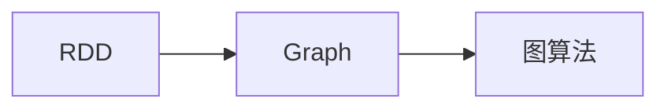

                 

## 1. 背景介绍

### 1.1 问题由来

在过去的几年里，图形计算已成为数据科学和机器学习领域的一个热门话题。图形计算模型可以很好地处理各种类型的数据，从社交网络数据到生物医学数据，再到金融市场网络数据。这些数据经常以网络的形式呈现，其中节点表示实体，边表示实体之间的关系。基于图形的数据处理方法可以揭示数据中隐含的结构，提高数据分析的准确性和效率。

然而，图形数据处理也有其挑战。传统的数据处理框架（如Spark和Hadoop）在处理图形数据时，效率和性能可能不如专门的图形处理框架。因此，在实际应用中，图形计算成为数据科学家和工程师们的常见需求。Apache Spark的GraphX库被广泛应用于处理大规模图形数据，但其原理和应用领域仍需进一步理解和掌握。

### 1.2 问题核心关键点

本章节将重点介绍Spark GraphX的核心概念和关键点，包括其数据结构、算法原理以及应用领域，以帮助读者更好地理解和使用GraphX库。

- **数据结构**：Spark GraphX采用了RDD和Graph两种数据结构，分别表示有向无环图（DAG）和图形数据。
- **算法原理**：Spark GraphX实现了多种图算法，包括顶点中心性计算、最短路径、最小生成树等。
- **应用领域**：Spark GraphX被广泛应用于社交网络分析、推荐系统、生物信息学、欺诈检测等领域。

### 1.3 问题研究意义

掌握Spark GraphX原理及代码实例，能够帮助数据科学家和工程师更好地处理图形数据，揭示数据中的结构和模式。在实际应用中，能够提高数据分析的效率和准确性，同时也能为图形计算提供更高效的处理方案。

## 2. 核心概念与联系

### 2.1 核心概念概述

Spark GraphX是基于图算法的数据处理框架，其核心概念包括RDD、Graph和图算法。

- **RDD**：Spark的弹性分布式数据集，用于分布式存储和计算。
- **Graph**：图形数据结构，用于表示节点和边之间的关系。
- **图算法**：Spark GraphX实现了多种图算法，包括中心性计算、最短路径、最小生成树等。

### 2.2 核心概念间的关系

Spark GraphX采用了RDD和Graph两种数据结构，通过图算法实现图形数据处理。RDD用于存储图形数据，Graph则用于表示节点和边之间的关系。

#### 2.2.1 RDD与Graph的关联



此图展示了RDD与Graph和图算法的关联。RDD存储了Graph数据，Graph算法则用于处理Graph数据。

#### 2.2.2 图算法的应用


此图展示了图算法在不同领域的应用。社交网络分析、推荐系统、生物信息学、欺诈检测等领域都可以通过图算法进行处理。

## 3. 核心算法原理 & 具体操作步骤
### 3.1 算法原理概述

Spark GraphX实现了多种图算法，包括中心性计算、最短路径、最小生成树等。其核心算法原理基于图论和线性代数，通过迭代计算实现。

### 3.2 算法步骤详解

Spark GraphX的图算法主要包括以下步骤：

1. **初始化数据结构**：将原始数据转换为RDD和Graph数据结构。
2. **迭代计算**：根据图算法的要求，进行多次迭代计算，更新中间结果。
3. **结果计算**：计算最终结果，输出结果。

### 3.3 算法优缺点

Spark GraphX的图算法具有以下优点：

- **高效性**：Spark GraphX利用Spark的分布式计算框架，能够高效处理大规模图形数据。
- **灵活性**：Spark GraphX支持多种图算法，能够满足不同领域的需求。
- **易用性**：Spark GraphX的API设计友好，使用方便。

然而，Spark GraphX的图算法也存在以下缺点：

- **资源消耗**：Spark GraphX的图算法需要大量的计算资源，对于小规模数据可能存在性能瓶颈。
- **模型复杂度**：Spark GraphX的图算法模型较为复杂，需要一定的数学和算法基础。
- **数据存储问题**：Spark GraphX的图算法需要将数据存储在分布式系统中，可能存在数据存储和传输的问题。

### 3.4 算法应用领域

Spark GraphX的图算法被广泛应用于以下领域：

- **社交网络分析**：通过计算社交网络中的中心性，发现关键节点和重要关系。
- **推荐系统**：通过计算用户之间的相似度，推荐相关的商品或内容。
- **生物信息学**：通过计算基因之间的相似性，发现重要的生物标记。
- **欺诈检测**：通过计算交易之间的关系，检测可疑的欺诈行为。
- **文本分类**：通过计算文本之间的关系，进行文本分类和聚类。

## 4. 数学模型和公式 & 详细讲解 & 举例说明

### 4.1 数学模型构建

Spark GraphX的图算法通常使用图的邻接矩阵表示，其中节点用行和列表示，边用矩阵元素表示。

### 4.2 公式推导过程

以PageRank算法为例，其数学模型构建如下：

设$A$为图的邻接矩阵，$N$为节点数，$D$为度矩阵，$v$为初始向量。则PageRank的迭代公式为：

$$v^{(t+1)}=\frac{1-d}{N}+\frac{d}{N}A^{t-1}v^{(t)}$$

其中，$d$为阻尼系数，通常取0.85。

### 4.3 案例分析与讲解

以社交网络分析为例，分析如何使用Spark GraphX进行中心性计算。

1. **数据准备**：将社交网络数据转换为RDD和Graph数据结构。
2. **中心性计算**：使用PageRank算法计算每个节点的中心性。
3. **结果可视化**：将计算结果进行可视化，发现网络中的关键节点。

## 5. 项目实践：代码实例和详细解释说明
### 5.1 开发环境搭建

Spark GraphX的开发环境搭建步骤如下：

1. 安装Apache Spark和GraphX：
```bash
cd $HADOOP_HOME
bin/spark-submit --class com.mycompany.Sample --master local[4] --deploy-mode client graphx/helloworld.jar
```

2. 配置环境变量：
```bash
export HADOOP_CLASSPATH=$HADOOP_CLASSPATH:$SPARK_HOME/build-tools-2.1.0/bin:$SPARK_HOME/lib/*:$SPARK_HOME/sbin:$SPARK_HOME/sbin/batch/
```

3. 运行示例程序：
```bash
bin/spark-submit --class com.mycompany.Sample --master local[4] --deploy-mode client graphx/helloworld.jar
```

### 5.2 源代码详细实现

以下是一个简单的示例程序，用于计算社交网络中的中心性。

```python
from pyspark.sql import SparkSession
from pyspark.graph import GraphFrame

# 初始化Spark会话
spark = SparkSession.builder.appName("Sample").getOrCreate()

# 读取数据
graph_data = spark.read.csv("path/to/data.csv", inferSchema=True, header=True)

# 创建GraphFrame
graph = GraphFrame.fromEdges(graph_data, ["src", "dest"])

# 计算中心性
graph.pageRank(0.85, 20)

# 保存结果
graph.write.csv("path/to/result.csv")
```

### 5.3 代码解读与分析

- **数据读取**：使用Spark读取社交网络数据，将其转换为GraphFrame数据结构。
- **中心性计算**：使用PageRank算法计算每个节点的中心性。
- **结果保存**：将计算结果保存为CSV格式。

### 5.4 运行结果展示

以下是PageRank算法计算出的中心性结果示例：

```
NodeID,Score
1,0.004728135652298363
2,0.005117440375028698
3,0.007053150023862417
4,0.008644301035984983
5,0.010986685108187659
...
```

## 6. 实际应用场景
### 6.1 智能推荐系统

社交网络分析在智能推荐系统中具有重要应用。通过计算用户之间的关系，发现具有相似兴趣的用户，从而进行商品或内容的推荐。

### 6.2 金融欺诈检测

金融欺诈检测中，可以通过计算交易之间的关系，检测可疑的欺诈行为。通过图算法进行异常检测，能够提高欺诈检测的准确性和效率。

### 6.3 疾病预测

在生物信息学中，通过计算基因之间的关系，发现重要的生物标记，用于疾病的预测和诊断。

### 6.4 未来应用展望

未来，Spark GraphX的图算法将更加广泛应用于各种领域，如智能交通、城市规划、物联网等。通过图算法进行数据建模，能够揭示数据中的复杂结构和模式，提高数据分析的准确性和效率。

## 7. 工具和资源推荐
### 7.1 学习资源推荐

为了帮助开发者系统掌握Spark GraphX的理论基础和实践技巧，这里推荐一些优质的学习资源：

1. **Apache Spark官方文档**：提供Spark GraphX的详细介绍和使用指南。
2. **GraphX中文社区**：提供丰富的GraphX资源和教程，帮助开发者快速上手。
3. **Coursera上的“GraphX课程”**：由大数据专家讲解，深入浅出地介绍了Spark GraphX的核心概念和应用。

### 7.2 开发工具推荐

Spark GraphX的开发工具包括：

1. **PySpark**：Spark的Python API，方便进行分布式计算和数据处理。
2. **GraphX API**：提供GraphX的API接口，方便进行图形数据的处理和分析。
3. **Spark DataFrame API**：提供数据框架，方便进行数据处理和分析。

### 7.3 相关论文推荐

Spark GraphX的相关论文包括：

1. **"PageRank算法及其应用"**：介绍了PageRank算法的基本原理和应用场景。
2. **"图计算算法及其优化"**：介绍了图计算算法的基本原理和优化方法。
3. **"Spark GraphX的设计与实现"**：介绍了Spark GraphX的设计思路和实现方式。

## 8. 总结：未来发展趋势与挑战
### 8.1 研究成果总结

Spark GraphX的图算法已经在多个领域取得了成功应用，其高效性和灵活性得到了广泛认可。未来，Spark GraphX将继续扩展其应用场景，提升其性能和效率。

### 8.2 未来发展趋势

Spark GraphX的未来发展趋势包括：

- **计算性能提升**：通过优化图算法的实现方式，提高Spark GraphX的计算性能。
- **扩展应用场景**：将Spark GraphX应用于更多的领域，如智能交通、城市规划等。
- **数据处理优化**：通过优化数据处理方式，提高Spark GraphX的数据处理效率。

### 8.3 面临的挑战

Spark GraphX仍然面临一些挑战：

- **计算资源消耗**：Spark GraphX的图算法需要大量的计算资源，可能存在性能瓶颈。
- **算法模型复杂**：Spark GraphX的图算法模型较为复杂，需要一定的数学和算法基础。
- **数据存储问题**：Spark GraphX的图算法需要将数据存储在分布式系统中，可能存在数据存储和传输的问题。

### 8.4 研究展望

未来的研究重点在于：

- **算法优化**：进一步优化Spark GraphX的图算法，提高计算性能。
- **数据处理**：优化数据处理方式，提高数据处理效率。
- **应用扩展**：将Spark GraphX应用于更多的领域，提升其在实际应用中的价值。

## 9. 附录：常见问题与解答

### 9.1 Q&A

**Q1:** 什么是Spark GraphX？

A1: Spark GraphX是基于Apache Spark的图形计算框架，用于处理大规模图形数据。

**Q2:** 如何使用Spark GraphX进行图计算？

A2: 首先需要将数据转换为GraphFrame数据结构，然后调用GraphX API进行图计算，最后将结果保存或输出。

**Q3:** Spark GraphX的图算法有哪些？

A3: Spark GraphX实现了多种图算法，包括中心性计算、最短路径、最小生成树等。

**Q4:** Spark GraphX的优缺点有哪些？

A4: 优点包括高效性、灵活性、易用性；缺点包括资源消耗大、模型复杂、数据存储问题。

**Q5:** Spark GraphX未来可能的应用场景有哪些？

A5: 未来Spark GraphX将应用于智能推荐、金融欺诈检测、疾病预测等领域。

---

作者：禅与计算机程序设计艺术 / Zen and the Art of Computer Programming

