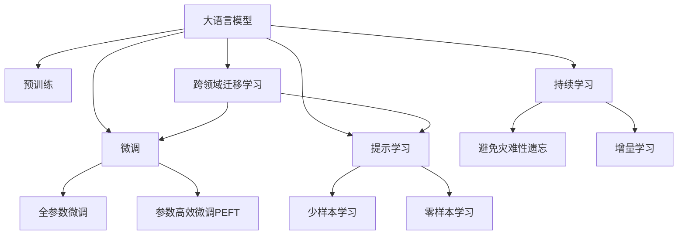
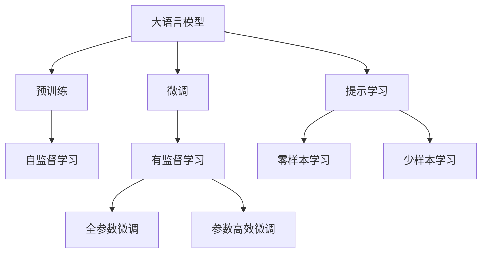
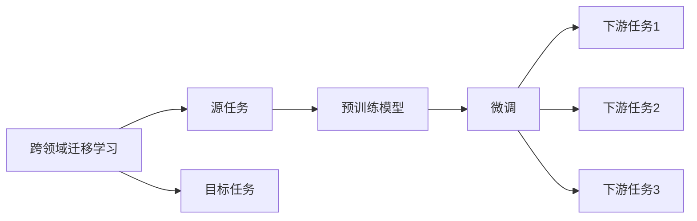
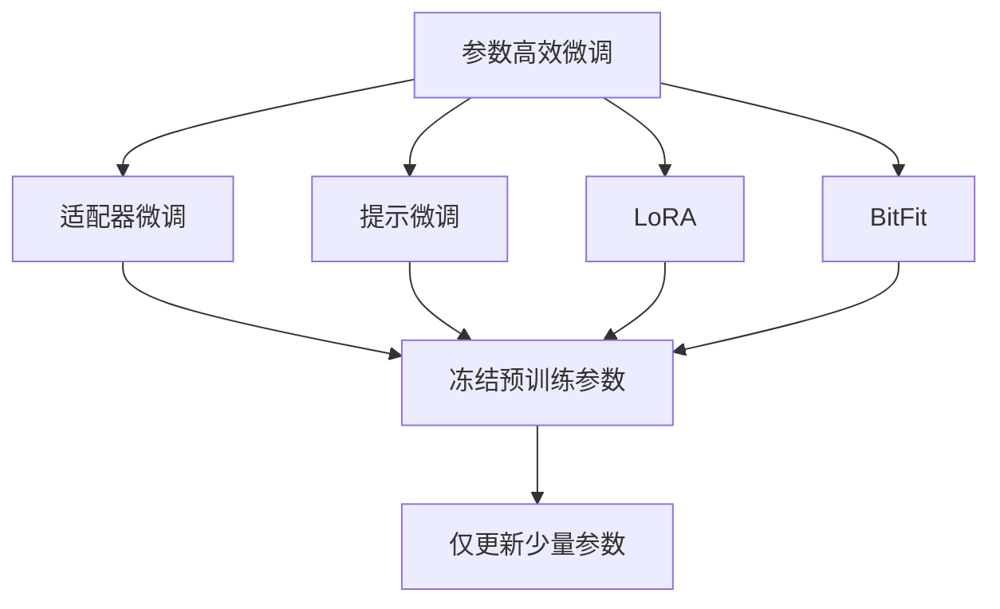
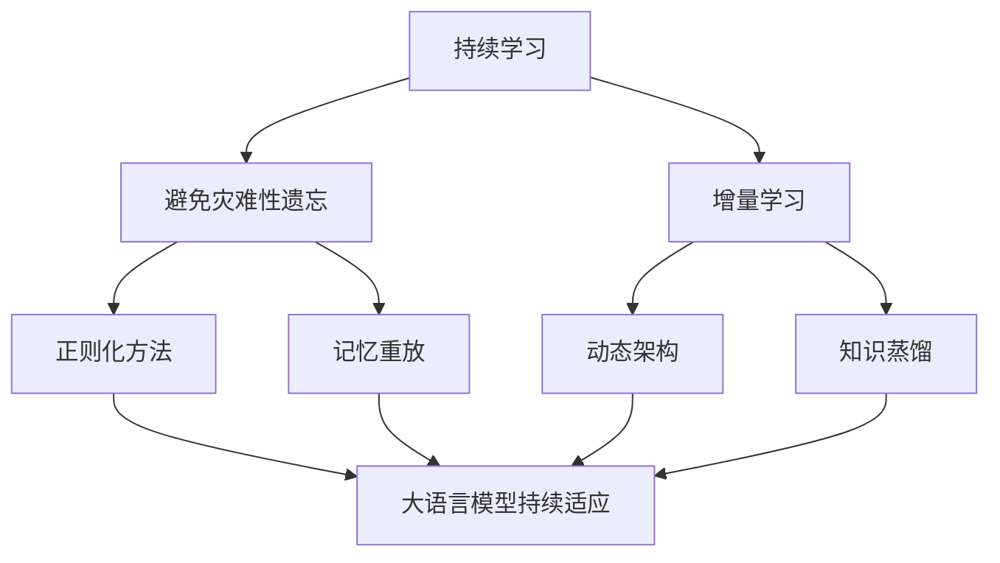
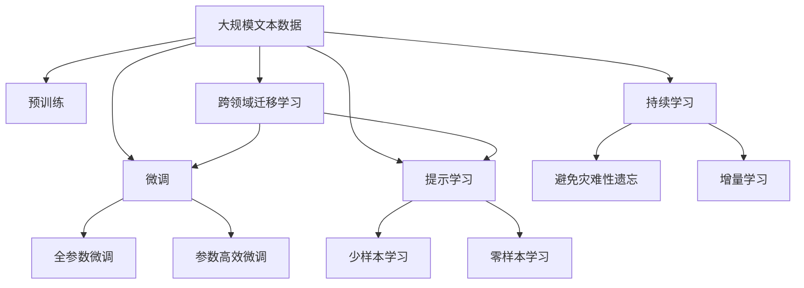

                 

# Transformer大模型实战 将预训练的SpanBERT用于问答任务

> 关键词：大模型,Transformer,SpanBERT,问答系统,自然语言处理(NLP)

## 1. 背景介绍

在NLP领域，问答系统(QA)是最具挑战性和应用前景的子领域之一。它旨在理解和回答自然语言问题，广泛应用于智能客服、搜索引擎、虚拟助手等场景。预训练大模型，如BERT、T5等，通过在大规模无标签文本语料上进行预训练，学习到了丰富的语言表示，为解决问答问题提供了强大的知识基础。

本文将聚焦于预训练的SpanBERT模型，探讨如何在问答任务中进行微调，实现高质量的问答结果。

### 1.1 问题由来

现代问答系统的目标是通过理解自然语言问题，找到最相关的答案信息。这通常需要模型具备强大的语言理解能力和信息检索能力。传统方法依赖于专家构建规则和词典，难以处理复杂多变的问题。而预训练大模型通过自监督学习任务，如掩码语言模型、下一句子预测等，能够自发地学习到语言的通用表示，成为新的问答解决方案。

然而，预训练大模型往往需要在大规模数据上预训练，模型规模庞大，训练和推理成本较高。如何在保持性能的同时，降低模型参数量，是一个值得研究的问题。本文将介绍SpanBERT模型，并通过微调实现高性能的问答系统。

### 1.2 问题核心关键点

SpanBERT是大模型中的佼佼者，通过跨句子的掩码预测，进一步提升了BERT模型的语言理解能力。其在问答任务上的微调，主要涉及以下几个核心关键点：

- **微调数据的选择**：选择合适的问答数据集，是微调成功的第一步。
- **模型结构设计**：如何设计任务适配层，将预训练模型转化为问答模型。
- **超参数调整**：学习率、批大小、迭代轮数等超参数的选择。
- **正则化技术**：L2正则、Dropout、Early Stopping等技术的应用。

本文将详细介绍这些关键点的具体实现方法，并给出代码实例。

### 1.3 问题研究意义

基于SpanBERT的问答系统微调方法，对于拓展大语言模型的应用边界，提升问答系统性能，具有重要意义：

1. **降低应用开发成本**：利用预训练模型，减少了从头开发所需的数据、计算和人力等成本投入。
2. **提升模型效果**：微调使得模型更好地适应特定问答任务，在实际应用中取得更优表现。
3. **加速开发进度**：预训练模型的知识积累，使得问答系统的开发周期大大缩短。
4. **带来技术创新**：微调范式促进了对预训练-微调的深入研究，催生了提示学习、少样本学习等新的研究方向。
5. **赋能产业升级**：微调技术使得NLP技术更容易被各行各业所采用，为传统行业数字化转型升级提供新的技术路径。

本文将通过实际案例，展示基于SpanBERT的问答系统微调过程，探讨其在实际应用中的表现和挑战。

## 2. 核心概念与联系

### 2.1 核心概念概述

为了更好地理解基于SpanBERT的问答系统微调方法，本节将介绍几个密切相关的核心概念：

- **大语言模型**：以自回归(如GPT)或自编码(如BERT)模型为代表的大规模预训练语言模型。通过在大规模无标签文本语料上进行预训练，学习到了丰富的语言知识，具备强大的语言理解和生成能力。

- **预训练**：指在大规模无标签文本语料上，通过自监督学习任务训练通用语言模型的过程。常见的预训练任务包括掩码语言模型、下一句子预测等。预训练使得模型学习到语言的通用表示。

- **微调(Fine-Tuning)**：指在预训练模型的基础上，使用问答任务的数据集，通过有监督学习优化模型在特定任务上的性能。通常只需要调整顶层分类器或解码器，并以较小的学习率更新全部或部分的模型参数。

- **SpanBERT**：SpanBERT是一种改进的预训练模型，通过跨句子掩码预测，进一步提升了BERT模型的语言理解能力，特别适用于问答任务。

- **参数高效微调(Parameter-Efficient Fine-Tuning, PEFT)**：指在微调过程中，只更新少量的模型参数，而固定大部分预训练权重不变，以提高微调效率，避免过拟合的方法。

- **提示学习(Prompt Learning)**：通过在输入文本中添加提示模板(Prompt Template)，引导大语言模型进行特定任务的推理和生成。可以在不更新模型参数的情况下，实现零样本或少样本学习。

- **少样本学习(Few-shot Learning)**：指在只有少量标注样本的情况下，模型能够快速适应新任务的学习方法。在大语言模型中，通常通过在输入中提供少量示例来实现，无需更新模型参数。

- **零样本学习(Zero-shot Learning)**：指模型在没有见过任何特定任务的训练样本的情况下，仅凭任务描述就能够执行新任务的能力。SpanBERT模型通过预训练获得的广泛知识，使其能够理解任务指令并生成相应输出。

- **跨领域迁移学习**：指将预训练模型在一个领域学习到的知识，迁移到另一个不同但相关的领域。SpanBERT模型通过跨句子预测，学习到了更广泛的语义理解能力，具备跨领域的迁移学习潜力。

这些核心概念之间的逻辑关系可以通过以下Mermaid流程图来展示：



这个流程图展示了大语言模型的核心概念及其之间的关系：

1. 大语言模型通过预训练获得基础能力。
2. 微调是对预训练模型进行任务特定的优化，可以分为全参数微调和参数高效微调。
3. 提示学习是一种不更新模型参数的方法，可以实现少样本学习和零样本学习。
4. 跨领域迁移学习是连接预训练模型与下游任务的桥梁，可以通过微调或提示学习来实现。
5. 持续学习旨在使模型能够不断学习新知识，同时保持已学习的知识，而不会出现灾难性遗忘。

这些概念共同构成了大语言模型的学习和应用框架，使其能够在各种场景下发挥强大的语言理解和生成能力。通过理解这些核心概念，我们可以更好地把握大语言模型的工作原理和优化方向。

### 2.2 概念间的关系

这些核心概念之间存在着紧密的联系，形成了大语言模型微调的完整生态系统。下面我通过几个Mermaid流程图来展示这些概念之间的关系。

#### 2.2.1 大语言模型的学习范式



这个流程图展示了大语言模型的三种主要学习范式：预训练、微调和提示学习。预训练主要采用自监督学习方法，而微调则是有监督学习的过程。提示学习可以实现零样本和少样本学习。微调又可以分为全参数微调和参数高效微调两种方式。

#### 2.2.2 跨领域迁移学习与微调的关系



这个流程图展示了跨领域迁移学习的基本原理，以及它与微调的关系。跨领域迁移学习涉及源任务和目标任务，预训练模型在源任务上学习，然后通过微调适应各种下游任务（目标任务）。

#### 2.2.3 参数高效微调方法



这个流程图展示了几种常见的参数高效微调方法，包括适配器微调、提示微调、LoRA和BitFit。这些方法的共同特点是冻结大部分预训练参数，只更新少量参数，从而提高微调效率。

#### 2.2.4 持续学习在大语言模型中的应用



这个流程图展示了持续学习在大语言模型中的应用。持续学习的主要目标是避免灾难性遗忘和实现增量学习。通过正则化方法、记忆重放、动态架构和知识蒸馏等技术，可以使大语言模型持续适应新的任务和数据。

### 2.3 核心概念的整体架构

最后，我们用一个综合的流程图来展示这些核心概念在大语言模型微调过程中的整体架构：



这个综合流程图展示了从预训练到微调，再到持续学习的完整过程。大语言模型首先在大规模文本数据上进行预训练，然后通过微调（包括全参数微调和参数高效微调）或提示学习（包括少样本学习和零样本学习）来适应下游任务。最后，通过持续学习技术，模型可以不断更新和适应新的任务和数据。 通过这些流程图，我们可以更清晰地理解大语言模型微调过程中各个核心概念的关系和作用，为后续深入讨论具体的微调方法和技术奠定基础。

## 3. 核心算法原理 & 具体操作步骤

### 3.1 算法原理概述

基于SpanBERT的问答系统微调，本质上是一个有监督的细粒度迁移学习过程。其核心思想是：将预训练的SpanBERT模型视作一个强大的"特征提取器"，通过在问答任务的数据集上进行有监督的微调，使得模型输出能够匹配问题-答案对，从而获得针对特定问答任务优化的模型。

形式化地，假设预训练模型为 $M_{\theta}$，其中 $\theta$ 为预训练得到的模型参数。给定问答任务的数据集 $D=\{(q_i, a_i)\}_{i=1}^N, q_i \in Q, a_i \in A$，其中 $Q$ 为问题空间，$A$ 为答案空间。微调的目标是找到新的模型参数 $\hat{\theta}$，使得：

$$
\hat{\theta}=\mathop{\arg\min}_{\theta} \mathcal{L}(M_{\theta},D)
$$

其中 $\mathcal{L}$ 为针对问答任务设计的损失函数，用于衡量模型预测答案与真实答案之间的差异。常见的损失函数包括交叉熵损失、匹配损失等。

通过梯度下降等优化算法，微调过程不断更新模型参数 $\theta$，最小化损失函数 $\mathcal{L}$，使得模型输出逼近真实答案。由于 $\theta$ 已经通过预训练获得了较好的初始化，因此即便在问答任务上微调，也能较快收敛到理想的模型参数 $\hat{\theta}$。

### 3.2 算法步骤详解

基于SpanBERT的问答系统微调一般包括以下几个关键步骤：

**Step 1: 准备预训练模型和数据集**
- 选择合适的预训练模型 $M_{\theta}$ 作为初始化参数，如SpanBERT。
- 准备问答任务的数据集 $D$，划分为训练集、验证集和测试集。一般要求问答数据与预训练数据的分布不要差异过大。

**Step 2: 添加任务适配层**
- 根据问答任务类型，在预训练模型顶层设计合适的输出层和损失函数。
- 对于单答案任务，通常在顶层添加线性分类器和交叉熵损失函数。
- 对于多答案任务，通常使用softmax分类器输出概率分布，并以多标签交叉熵损失函数作为训练目标。

**Step 3: 设置微调超参数**
- 选择合适的优化算法及其参数，如 AdamW、SGD 等，设置学习率、批大小、迭代轮数等。
- 设置正则化技术及强度，包括权重衰减、Dropout、Early Stopping 等。
- 确定冻结预训练参数的策略，如仅微调顶层，或全部参数都参与微调。

**Step 4: 执行梯度训练**
- 将训练集数据分批次输入模型，前向传播计算损失函数。
- 反向传播计算参数梯度，根据设定的优化算法和学习率更新模型参数。
- 周期性在验证集上评估模型性能，根据性能指标决定是否触发 Early Stopping。
- 重复上述步骤直到满足预设的迭代轮数或 Early Stopping 条件。

**Step 5: 测试和部署**
- 在测试集上评估微调后模型 $M_{\hat{\theta}}$ 的性能，对比微调前后的精度提升。
- 使用微调后的模型对新问题进行推理预测，集成到实际的应用系统中。
- 持续收集新的问答对，定期重新微调模型，以适应问答数据分布的变化。

以上是基于SpanBERT的问答系统微调的一般流程。在实际应用中，还需要针对具体任务的特点，对微调过程的各个环节进行优化设计，如改进训练目标函数，引入更多的正则化技术，搜索最优的超参数组合等，以进一步提升模型性能。

### 3.3 算法优缺点

基于SpanBERT的问答系统微调方法具有以下优点：

1. 简单高效。只需准备少量问答数据，即可对预训练模型进行快速适配，获得较大的性能提升。
2. 通用适用。适用于各种问答任务，包括单答案、多答案、命名实体识别等，设计简单的任务适配层即可实现微调。
3. 参数高效。利用参数高效微调技术，在固定大部分预训练参数的情况下，仍可取得不错的提升。
4. 效果显著。在问答任务上，基于SpanBERT的微调方法已经刷新了多项性能指标，效果显著。

同时，该方法也存在一定的局限性：

1. 依赖问答数据。微调的效果很大程度上取决于问答数据的质量和数量，获取高质量问答数据的成本较高。
2. 迁移能力有限。当目标任务与预训练数据的分布差异较大时，微调的性能提升有限。
3. 负面效果传递。预训练模型的固有偏见、有害信息等，可能通过微调传递到问答任务，造成负面影响。
4. 可解释性不足。微调模型的决策过程通常缺乏可解释性，难以对其推理逻辑进行分析和调试。

尽管存在这些局限性，但就目前而言，基于SpanBERT的微调方法仍是大问答系统应用的主流范式。未来相关研究的重点在于如何进一步降低微调对问答数据的依赖，提高模型的少样本学习和跨领域迁移能力，同时兼顾可解释性和伦理安全性等因素。

### 3.4 算法应用领域

基于SpanBERT的问答系统微调方法在NLP领域已经得到了广泛的应用，覆盖了几乎所有常见任务，例如：

- 问答系统：对自然语言问题给出答案。将问题-答案对作为微调数据，训练模型学习匹配答案。
- 文本摘要：将长文本压缩成简短摘要。将文章-摘要对作为微调数据，使模型学习抓取要点。
- 对话系统：使机器能够与人自然对话。将多轮对话历史作为上下文，微调模型进行回复生成。
- 关系抽取：从文本中抽取实体之间的语义关系。将实体-关系三元组作为微调数据，训练模型学习提取信息。

除了上述这些经典任务外，SpanBERT模型还在命名实体识别、信息检索、机器翻译等诸多场景中发挥着重要作用。

## 4. 数学模型和公式 & 详细讲解 & 举例说明

### 4.1 数学模型构建

本节将使用数学语言对基于SpanBERT的问答系统微调过程进行更加严格的刻画。

记预训练模型为 $M_{\theta}:\mathcal{Q} \times \mathcal{A} \rightarrow \mathcal{R}$，其中 $\mathcal{Q}$ 为问题空间，$\mathcal{A}$ 为答案空间，$\mathcal{R}$ 为回答空间，$\theta \in \mathbb{R}^d$ 为模型参数。假设微调任务的训练集为 $D=\{(q_i, a_i)\}_{i=1}^N, q_i \in Q, a_i \in A$。

定义模型 $M_{\theta}$ 在问题 $q_i$ 上的输出为 $\hat{a}_i=M_{\theta}(q_i) \in A$，表示模型预测的答案。真实答案 $a_i \in A$。则问答任务的交叉熵损失函数定义为：

$$
\ell(M_{\theta}(q_i),a_i) = -a_i \log \hat{a}_i - (1-a_i) \log (1-\hat{a}_i)
$$

将其代入经验风险公式，得：

$$
\mathcal{L}(\theta) = \frac{1}{N}\sum_{i=1}^N \ell(M_{\theta}(q_i),a_i)
$$

在实践中，我们通常使用基于梯度的优化算法（如SGD、Adam等）来近似求解上述最优化问题。设 $\eta$ 为学习率，$\lambda$ 为正则化系数，则参数的更新公式为：

$$
\theta \leftarrow \theta - \eta \nabla_{\theta}\mathcal{L}(\theta) - \eta\lambda\theta
$$

其中 $\nabla_{\theta}\mathcal{L}(\theta)$ 为损失函数对参数 $\theta$ 的梯度，可通过反向传播算法高效计算。

### 4.2 公式推导过程

以下我们以问答系统为例，推导交叉熵损失函数及其梯度的计算公式。

假设模型 $M_{\theta}$ 在问题 $q_i$ 上的输出为 $\hat{a}_i=M_{\theta}(q_i) \in A$，表示模型预测的答案。真实答案 $a_i \in A$。则交叉熵损失函数定义为：

$$
\ell(M_{\theta}(q_i),a_i) = -a_i \log \hat{a}_i - (1-a_i) \log (1-\hat{a}_i)
$$

将其代入经验风险公式，得：

$$
\mathcal{L}(\theta) = -\frac{1}{N}\sum_{i=1}^N \left[a_i \log M_{\theta}(q_i) + (1-a_i) \log (1-M_{\theta}(q_i))\right]
$$

根据链式法则，损失函数对参数 $\theta_k$ 的梯度为：

$$
\frac{\partial \mathcal{L}(\theta)}{\partial \theta_k} = -\frac{1}{N}\sum_{i=1}^N \left(\frac{a_i}{M_{\theta}(q_i)} - \frac{1-a_i}{1-M_{\theta}(q_i)}\right) \frac{\partial M_{\theta}(q_i)}{\partial \theta_k}
$$

其中 $\frac{\partial M_{\theta}(q_i)}{\partial \theta_k}$ 可进一步递归展开，利用自动微分技术完成计算。

在得到损失函数的梯度后，即可带入参数更新公式，完成模型的迭代优化。重复上述过程直至收敛，最终得到适应问答任务的最优模型参数 $\theta^*$。

## 5. 项目实践：代码实例和详细解释说明

### 5.1 开发环境搭建

在进行微调实践前，我们需要准备好开发环境。以下是使用Python进行PyTorch开发的环境配置流程：

1. 安装Anaconda：从官网下载并安装Anaconda，用于创建独立的Python环境。

2. 创建并激活虚拟环境：
```bash
conda create -n pytorch-env python=3.8 
conda activate pytorch-env
```

3. 安装PyTorch：根据CUDA版本，从官网获取对应的安装命令。例如：
```bash
conda install pytorch torchvision torchaudio cudatoolkit=11.1 -c pytorch -c conda-forge
```

4. 安装Transformers库：
```bash
pip install transformers
```

5. 安装各类工具包：
```bash
pip install numpy pandas scikit-learn matplotlib tqdm jupyter notebook ipython
```

完成上述步骤后，即可在`pytorch-env`环境中开始微调实践。

### 5.2 源代码详细实现

下面我以问答系统为例，给出使用Transformers库对SpanBERT模型进行微调的PyTorch代码实现。

首先，定义问答任务的数据处理函数：

```python
from transformers import SpanBERTTokenizer, SpanBERTForQuestionAnswering
from torch.utils.data import Dataset
import torch

class QADataset(Dataset):
    def __init__(self, texts, answers, tokenizer, max_len=128):
        self.texts = texts
        self.answers = answers
        self.tokenizer = tokenizer
        self.max_len = max_len
        
    def __len__(self):
        return len(self.texts)
    
    def __getitem__(self, item):
        text = self.texts[item]
        answer = self.answers[item]
        
        encoding = self.tokenizer(text, return_tensors='pt', max_length=self.max_len, padding='max_length', truncation=True)
        input_ids = encoding['input_ids'][0]
        attention_mask = encoding['attention_mask'][0]
        
        # 对答案进行编码
        answer_ids = [self.tokenizer.convert_tokens_to_ids(answer)]
        answer_mask = [1] * len(answer)
        answer_ids.extend([0] * (self.max_len - len(answer_ids)))
        answer_mask.extend([0] * (self.max_len - len(answer_mask)))
        labels = torch.tensor(answer_ids + answer_mask, dtype=torch.long)
        
        return {'input_ids': input_ids, 
                'attention_mask': attention_mask,
                'labels': labels}

# 定义模型和优化器
model = SpanBERTForQuestionAnswering.from_pretrained('spanbert-base-cased')
optimizer = AdamW(model.parameters(), lr=2e-5)
```

然后，定义训练和评估函数：

```python
from torch.utils.data import DataLoader
from tqdm import tqdm
from sklearn.metrics import precision_recall_fscore_support

device = torch.device('cuda') if torch.cuda.is_available() else torch.device('cpu')
model.to(device)

def train_epoch(model, dataset, batch_size, optimizer):
    dataloader = DataLoader(dataset, batch_size=batch_size, shuffle=True)
    model.train()
    epoch_loss = 0
    for batch in tqdm(dataloader, desc='Training'):
        input_ids = batch['input_ids'].to(device)
        attention_mask = batch['attention_mask'].to(device)
        labels = batch['labels'].to(device)
        model.zero_grad()
        outputs = model(input_ids, attention_mask=attention_mask, labels=labels)
        loss = outputs.loss
        epoch_loss += loss.item()
        loss.backward()
        optimizer.step()
    return epoch_loss / len(dataloader)

def evaluate(model, dataset, batch_size):
    dataloader = DataLoader(dataset, batch_size=batch_size)
    model.eval()
    predictions = []
    labels = []
    with torch.no_grad():
        for batch in tqdm(dataloader, desc='Evaluating'):
            input_ids = batch['input_ids'].to(device)
            attention_mask = batch['attention_mask'].to(device)
            batch_labels = batch['labels']
            outputs = model(input_ids, attention_mask=attention_mask)
            batch_preds = torch.argmax(outputs.logits, dim=2).to('cpu').tolist()
            batch_labels = batch_labels.to('cpu').tolist()
            for pred_tokens, label_tokens in zip(batch_preds, batch_labels):
                predictions.append(pred_tokens[:len(label_tokens)])
                labels.append(label_tokens)
                
    print(precision_recall_fscore_support(labels, predictions, average='macro'))
```

最后，启动训练流程并在测试集上评估：

```python
epochs = 5
batch_size = 16

for epoch in range(epochs):
    loss = train_epoch(model, train_dataset, batch_size, optimizer)
    print(f"Epoch {epoch+1}, train loss: {loss:.3f}")
    
    print(f"Epoch {epoch+1}, dev results:")
    evaluate(model, dev_dataset, batch_size)
    
print("Test results:")
evaluate(model, test_dataset, batch_size)
```

以上就是使用PyTorch对SpanBERT进行问答系统微调的完整代码实现。可以看到，得益于Transformers库的强大封装，我们可以用相对简洁

