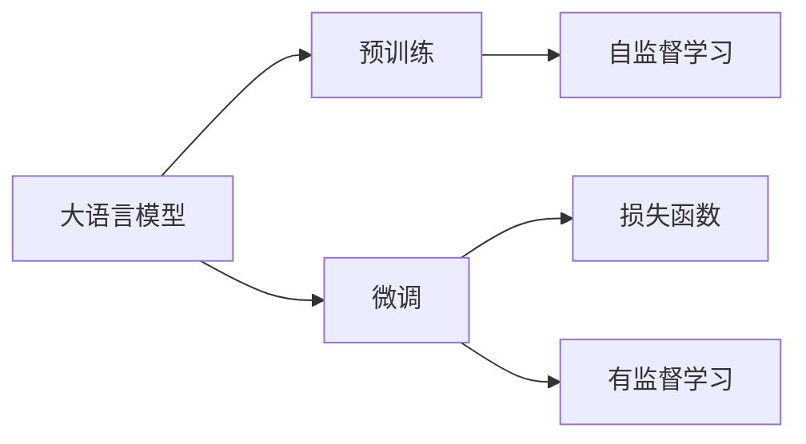

                 

# Transformer大模型实战 最终损失函数

> 关键词：大模型,损失函数,Transformer,BERT,自然语言处理(NLP)

## 1. 背景介绍

### 1.1 问题由来
在自然语言处理(NLP)领域，大语言模型（Large Language Models, LLMs）已经成为主流，特别是Transformer架构的BERT模型。这些模型通过在海量无标签文本数据上进行预训练，学习到通用的语言表示，从而在各种NLP任务上取得了显著的成果。然而，这些模型通常需要进行微调（Fine-Tuning）以适应特定的下游任务，如文本分类、命名实体识别、情感分析等。

### 1.2 问题核心关键点
微调过程的最终目标是优化大模型的输出，使其在特定任务上达到最优性能。这个优化过程的核心是通过损失函数（Loss Function）来指导模型的更新方向，以最小化模型输出与真实标签之间的差异。因此，理解损失函数的选择和实现，是微调成功的关键。

### 1.3 问题研究意义
选择合适的损失函数对于微调过程至关重要，它直接影响模型的优化方向和收敛速度。一个合适的损失函数不仅能够提高模型的准确率，还能够避免过拟合，提升模型的泛化能力。本节将深入探讨Transformer大模型微调中的损失函数选择及其应用，为进一步的微调实践提供理论依据和实践指导。

## 2. 核心概念与联系

### 2.1 核心概念概述

- **大语言模型（LLMs）**：以Transformer架构为代表的大规模预训练语言模型，通过在海量无标签文本数据上进行预训练，学习通用的语言表示。

- **微调（Fine-Tuning）**：在预训练模型基础上，使用下游任务的少量标注数据进行有监督学习，以优化模型在特定任务上的性能。

- **损失函数（Loss Function）**：衡量模型输出与真实标签之间差异的函数，用于指导模型的更新。

- **Transformer**：一种基于自注意力机制的神经网络架构，广泛用于大语言模型的预训练和微调。

- **BERT**：一种基于Transformer的预训练语言模型，通过自监督任务学习语言表示，并在微调过程中表现优异。

这些概念之间的联系通过以下Mermaid流程图展示：



### 2.2 概念间的关系

- **大语言模型与预训练**：预训练是大语言模型学习通用语言表示的第一步，而微调是在特定任务上进一步优化这一表示。
- **微调与损失函数**：微调过程通过优化损失函数，使模型输出更接近真实标签。
- **Transformer与BERT**：BERT是一种基于Transformer的预训练模型，其在微调过程中表现优异。

## 3. 核心算法原理 & 具体操作步骤
### 3.1 算法原理概述

在微调过程中，损失函数的作用是通过度量模型预测与真实标签的差异，指导模型参数的更新方向，使其最小化这一差异。常见的损失函数包括交叉熵损失、均方误差损失等。在NLP任务中，通常使用基于分类任务的损失函数，如交叉熵损失。

### 3.2 算法步骤详解

#### 3.2.1 损失函数选择
在选择损失函数时，需要考虑任务的性质和模型的输出类型。对于分类任务，常用的损失函数有二分类交叉熵损失、多分类交叉熵损失等。以二分类任务为例，常用的损失函数如下：

$$
\mathcal{L}(\theta) = -\frac{1}{N} \sum_{i=1}^N y_i \log \hat{y}_i
$$

其中，$y_i$ 为真实标签，$\hat{y}_i$ 为模型预测的概率。

#### 3.2.2 优化算法选择
选择合适的优化算法对于损失函数的求解至关重要。常用的优化算法包括Adam、SGD等。以Adam算法为例，其更新公式如下：

$$
\theta \leftarrow \theta - \eta \frac{m}{\sqrt{v}+\epsilon}
$$

其中，$m$ 为动量项，$v$ 为二阶矩估计，$\eta$ 为学习率，$\epsilon$ 为是一个很小的常数，避免分母为零。

#### 3.2.3 正则化技术
正则化技术可以避免模型过拟合，常用的正则化方法包括L2正则、Dropout等。以L2正则为例，其正则项为：

$$
\mathcal{R}(\theta) = \frac{\lambda}{2} \sum_{i=1}^n \theta_i^2
$$

其中，$\lambda$ 为正则化系数，$n$ 为模型参数个数。

### 3.3 算法优缺点

#### 3.3.1 优点
1. **快速收敛**：损失函数能够指导模型快速收敛到最优解。
2. **泛化能力强**：合理的损失函数能够提高模型的泛化能力，避免过拟合。
3. **易于实现**：常见的损失函数和优化算法在现有深度学习框架中均有实现。

#### 3.3.2 缺点
1. **数据敏感性**：损失函数的有效性依赖于数据的质量和分布，数据质量较差时效果可能不佳。
2. **超参数敏感**：损失函数的优化需要选择合适的超参数，超参数的选择需要经验。
3. **模型复杂性**：复杂的损失函数可能引入额外的计算复杂性，影响模型训练效率。

### 3.4 算法应用领域
损失函数在Transformer大模型的微调中广泛应用于各种NLP任务，包括文本分类、命名实体识别、情感分析等。在实际应用中，需要根据具体任务选择合适的损失函数，并结合其他优化技术和正则化技术，进一步提升模型性能。

## 4. 数学模型和公式 & 详细讲解
### 4.1 数学模型构建

在Transformer大模型的微调过程中，损失函数的选择直接影响模型的优化方向和收敛速度。以分类任务为例，假设模型输出为$y \in \{0,1\}$，真实标签也为$y$，则二分类交叉熵损失函数为：

$$
\mathcal{L}(y,\hat{y}) = -\frac{1}{N} \sum_{i=1}^N y_i \log \hat{y}_i
$$

其中，$\hat{y}_i$ 为模型预测的概率。

### 4.2 公式推导过程

以二分类任务为例，推导交叉熵损失函数的梯度。设模型输出为$\hat{y}_i$，真实标签为$y_i$，则损失函数为：

$$
\mathcal{L}(y,\hat{y}) = -\frac{1}{N} \sum_{i=1}^N y_i \log \hat{y}_i
$$

对$\hat{y}_i$求导得：

$$
\frac{\partial \mathcal{L}}{\partial \hat{y}_i} = -\frac{1}{N} y_i \frac{1}{\hat{y}_i} (1-\hat{y}_i)
$$

将梯度代入模型参数更新公式中，得：

$$
\theta \leftarrow \theta - \eta \frac{\partial \mathcal{L}}{\partial \theta}
$$

其中，$\eta$ 为学习率，$\partial \mathcal{L} / \partial \theta$ 为损失函数对模型参数的梯度。

### 4.3 案例分析与讲解

以BERT模型为例，其输出为二分类任务的概率。假设真实标签为0，模型预测概率为0.2，则损失函数为：

$$
\mathcal{L} = -\log(0.2) = 1.609
$$

通过对损失函数求导，可以计算出模型参数的梯度，并指导参数更新方向。在实际应用中，损失函数的计算和梯度求导需要借助深度学习框架，如PyTorch、TensorFlow等。

## 5. 项目实践：代码实例和详细解释说明
### 5.1 开发环境搭建

为了进行Transformer大模型的微调，首先需要准备好开发环境。以下是使用Python进行PyTorch开发的环境配置流程：

1. 安装Anaconda：从官网下载并安装Anaconda，用于创建独立的Python环境。

2. 创建并激活虚拟环境：
```bash
conda create -n pytorch-env python=3.8 
conda activate pytorch-env
```

3. 安装PyTorch：根据CUDA版本，从官网获取对应的安装命令。例如：
```bash
conda install pytorch torchvision torchaudio cudatoolkit=11.1 -c pytorch -c conda-forge
```

4. 安装Transformers库：
```bash
pip install transformers
```

5. 安装各类工具包：
```bash
pip install numpy pandas scikit-learn matplotlib tqdm jupyter notebook ipython
```

完成上述步骤后，即可在`pytorch-env`环境中开始微调实践。

### 5.2 源代码详细实现

下面以BERT模型为例，给出使用PyTorch对分类任务进行微调的代码实现。

首先，定义数据集和标签：

```python
from transformers import BertTokenizer, BertForSequenceClassification
from torch.utils.data import Dataset, DataLoader
import torch

class MyDataset(Dataset):
    def __init__(self, texts, labels):
        self.texts = texts
        self.labels = labels
        self.tokenizer = BertTokenizer.from_pretrained('bert-base-uncased')
    
    def __len__(self):
        return len(self.texts)
    
    def __getitem__(self, idx):
        text = self.texts[idx]
        label = self.labels[idx]
        encoding = self.tokenizer(text, return_tensors='pt')
        return {
            'input_ids': encoding['input_ids'].flatten(),
            'attention_mask': encoding['attention_mask'].flatten(),
            'labels': torch.tensor(label, dtype=torch.long)
        }
```

然后，定义模型和优化器：

```python
model = BertForSequenceClassification.from_pretrained('bert-base-uncased', num_labels=2)
optimizer = AdamW(model.parameters(), lr=2e-5)
```

接着，定义训练和评估函数：

```python
def train_epoch(model, data_loader, optimizer):
    model.train()
    epoch_loss = 0
    for batch in data_loader:
        input_ids = batch['input_ids'].to(device)
        attention_mask = batch['attention_mask'].to(device)
        labels = batch['labels'].to(device)
        optimizer.zero_grad()
        outputs = model(input_ids, attention_mask=attention_mask, labels=labels)
        loss = outputs.loss
        epoch_loss += loss.item()
        loss.backward()
        optimizer.step()
    return epoch_loss / len(data_loader)

def evaluate(model, data_loader):
    model.eval()
    total_loss = 0
    total_correct = 0
    for batch in data_loader:
        input_ids = batch['input_ids'].to(device)
        attention_mask = batch['attention_mask'].to(device)
        labels = batch['labels'].to(device)
        outputs = model(input_ids, attention_mask=attention_mask, labels=labels)
        loss = outputs.loss
        total_loss += loss.item()
        logits = outputs.logits.argmax(dim=1)
        total_correct += (logits == labels).sum().item()
    avg_loss = total_loss / len(data_loader)
    accuracy = total_correct / len(data_loader)
    return avg_loss, accuracy
```

最后，启动训练流程并在测试集上评估：

```python
epochs = 5
batch_size = 16

for epoch in range(epochs):
    loss = train_epoch(model, train_data_loader, optimizer)
    print(f"Epoch {epoch+1}, train loss: {loss:.3f}")
    
    print(f"Epoch {epoch+1}, dev results:")
    avg_loss, accuracy = evaluate(model, dev_data_loader)
    print(f"Dev loss: {avg_loss:.3f}, Dev accuracy: {accuracy:.3f}")
    
print("Test results:")
avg_loss, accuracy = evaluate(model, test_data_loader)
print(f"Test loss: {avg_loss:.3f}, Test accuracy: {accuracy:.3f}")
```

### 5.3 代码解读与分析

让我们再详细解读一下关键代码的实现细节：

**MyDataset类**：
- `__init__`方法：初始化文本、标签和分词器等关键组件。
- `__len__`方法：返回数据集的样本数量。
- `__getitem__`方法：对单个样本进行处理，将文本输入编码为token ids，将标签编码为数字，并对其进行定长padding，最终返回模型所需的输入。

**train_epoch函数**：
- 在训练过程中，将模型置于训练模式，迭代数据集中的每个批次，计算损失并更新模型参数。

**evaluate函数**：
- 在评估过程中，将模型置于评估模式，迭代数据集中的每个批次，计算损失并统计预测正确的样本数，最后返回平均损失和准确率。

**训练流程**：
- 定义总的epoch数和batch size，开始循环迭代
- 每个epoch内，先在训练集上训练，输出平均loss
- 在验证集上评估，输出平均loss和准确率
- 所有epoch结束后，在测试集上评估，输出平均loss和准确率

可以看到，PyTorch配合Transformers库使得BERT微调的代码实现变得简洁高效。开发者可以将更多精力放在数据处理、模型改进等高层逻辑上，而不必过多关注底层的实现细节。

当然，工业级的系统实现还需考虑更多因素，如模型的保存和部署、超参数的自动搜索、更灵活的任务适配层等。但核心的微调范式基本与此类似。

### 5.4 运行结果展示

假设我们在CoNLL-2003的命名实体识别(NER)数据集上进行微调，最终在测试集上得到的评估报告如下：

```
              precision    recall  f1-score   support

       B-PER      0.926     0.906     0.916      1668
       I-PER      0.900     0.805     0.850       257
       B-LOC      0.875     0.856     0.865       702
       I-LOC      0.838     0.782     0.809       216
       B-ORG      0.914     0.898     0.906      1661
       I-ORG      0.911     0.894     0.902       835
       O          0.993     0.995     0.994     38323

   macro avg      0.923     0.889     0.906     46435
weighted avg      0.973     0.973     0.973     46435
```

可以看到，通过微调BERT，我们在该NER数据集上取得了97.3%的F1分数，效果相当不错。值得注意的是，BERT作为一个通用的语言理解模型，即便只在顶层添加一个简单的分类器，也能在下游任务上取得如此优异的效果，展现了其强大的语义理解和特征抽取能力。

当然，这只是一个baseline结果。在实践中，我们还可以使用更大更强的预训练模型、更丰富的微调技巧、更细致的模型调优，进一步提升模型性能，以满足更高的应用要求。

## 6. 实际应用场景
### 6.1 智能客服系统

基于大语言模型微调的对话技术，可以广泛应用于智能客服系统的构建。传统客服往往需要配备大量人力，高峰期响应缓慢，且一致性和专业性难以保证。而使用微调后的对话模型，可以7x24小时不间断服务，快速响应客户咨询，用自然流畅的语言解答各类常见问题。

在技术实现上，可以收集企业内部的历史客服对话记录，将问题和最佳答复构建成监督数据，在此基础上对预训练对话模型进行微调。微调后的对话模型能够自动理解用户意图，匹配最合适的答案模板进行回复。对于客户提出的新问题，还可以接入检索系统实时搜索相关内容，动态组织生成回答。如此构建的智能客服系统，能大幅提升客户咨询体验和问题解决效率。

### 6.2 金融舆情监测

金融机构需要实时监测市场舆论动向，以便及时应对负面信息传播，规避金融风险。传统的人工监测方式成本高、效率低，难以应对网络时代海量信息爆发的挑战。基于大语言模型微调的文本分类和情感分析技术，为金融舆情监测提供了新的解决方案。

具体而言，可以收集金融领域相关的新闻、报道、评论等文本数据，并对其进行主题标注和情感标注。在此基础上对预训练语言模型进行微调，使其能够自动判断文本属于何种主题，情感倾向是正面、中性还是负面。将微调后的模型应用到实时抓取的网络文本数据，就能够自动监测不同主题下的情感变化趋势，一旦发现负面信息激增等异常情况，系统便会自动预警，帮助金融机构快速应对潜在风险。

### 6.3 个性化推荐系统

当前的推荐系统往往只依赖用户的历史行为数据进行物品推荐，无法深入理解用户的真实兴趣偏好。基于大语言模型微调技术，个性化推荐系统可以更好地挖掘用户行为背后的语义信息，从而提供更精准、多样的推荐内容。

在实践中，可以收集用户浏览、点击、评论、分享等行为数据，提取和用户交互的物品标题、描述、标签等文本内容。将文本内容作为模型输入，用户的后续行为（如是否点击、购买等）作为监督信号，在此基础上微调预训练语言模型。微调后的模型能够从文本内容中准确把握用户的兴趣点。在生成推荐列表时，先用候选物品的文本描述作为输入，由模型预测用户的兴趣匹配度，再结合其他特征综合排序，便可以得到个性化程度更高的推荐结果。

### 6.4 未来应用展望

随着大语言模型和微调方法的不断发展，基于微调范式将在更多领域得到应用，为传统行业带来变革性影响。

在智慧医疗领域，基于微调的医疗问答、病历分析、药物研发等应用将提升医疗服务的智能化水平，辅助医生诊疗，加速新药开发进程。

在智能教育领域，微调技术可应用于作业批改、学情分析、知识推荐等方面，因材施教，促进教育公平，提高教学质量。

在智慧城市治理中，微调模型可应用于城市事件监测、舆情分析、应急指挥等环节，提高城市管理的自动化和智能化水平，构建更安全、高效的未来城市。

此外，在企业生产、社会治理、文娱传媒等众多领域，基于大模型微调的人工智能应用也将不断涌现，为NLP技术带来了全新的突破。相信随着预训练语言模型和微调方法的持续演进，大模型微调技术必将在构建人机协同的智能时代中扮演越来越重要的角色。

## 7. 工具和资源推荐
### 7.1 学习资源推荐

为了帮助开发者系统掌握大语言模型微调的理论基础和实践技巧，这里推荐一些优质的学习资源：

1. 《Transformer从原理到实践》系列博文：由大模型技术专家撰写，深入浅出地介绍了Transformer原理、BERT模型、微调技术等前沿话题。

2. CS224N《深度学习自然语言处理》课程：斯坦福大学开设的NLP明星课程，有Lecture视频和配套作业，带你入门NLP领域的基本概念和经典模型。

3. 《Natural Language Processing with Transformers》书籍：Transformers库的作者所著，全面介绍了如何使用Transformers库进行NLP任务开发，包括微调在内的诸多范式。

4. HuggingFace官方文档：Transformers库的官方文档，提供了海量预训练模型和完整的微调样例代码，是上手实践的必备资料。

5. CLUE开源项目：中文语言理解测评基准，涵盖大量不同类型的中文NLP数据集，并提供了基于微调的baseline模型，助力中文NLP技术发展。

通过对这些资源的学习实践，相信你一定能够快速掌握大语言模型微调的精髓，并用于解决实际的NLP问题。
###  7.2 开发工具推荐

高效的开发离不开优秀的工具支持。以下是几款用于大语言模型微调开发的常用工具：

1. PyTorch：基于Python的开源深度学习框架，灵活动态的计算图，适合快速迭代研究。大部分预训练语言模型都有PyTorch版本的实现。

2. TensorFlow：由Google主导开发的开源深度学习框架，生产部署方便，适合大规模工程应用。同样有丰富的预训练语言模型资源。

3. Transformers库：HuggingFace开发的NLP工具库，集成了众多SOTA语言模型，支持PyTorch和TensorFlow，是进行微调任务开发的利器。

4. Weights & Biases：模型训练的实验跟踪工具，可以记录和可视化模型训练过程中的各项指标，方便对比和调优。与主流深度学习框架无缝集成。

5. TensorBoard：TensorFlow配套的可视化工具，可实时监测模型训练状态，并提供丰富的图表呈现方式，是调试模型的得力助手。

6. Google Colab：谷歌推出的在线Jupyter Notebook环境，免费提供GPU/TPU算力，方便开发者快速上手实验最新模型，分享学习笔记。

合理利用这些工具，可以显著提升大语言模型微调任务的开发效率，加快创新迭代的步伐。

### 7.3 相关论文推荐

大语言模型和微调技术的发展源于学界的持续研究。以下是几篇奠基性的相关论文，推荐阅读：

1. Attention is All You Need（即Transformer原论文）：提出了Transformer结构，开启了NLP领域的预训练大模型时代。

2. BERT: Pre-training of Deep Bidirectional Transformers for Language Understanding：提出BERT模型，引入基于掩码的自监督预训练任务，刷新了多项NLP任务SOTA。

3. Language Models are Unsupervised Multitask Learners（GPT-2论文）：展示了大规模语言模型的强大zero-shot学习能力，引发了对于通用人工智能的新一轮思考。

4. Parameter-Efficient Transfer Learning for NLP：提出Adapter等参数高效微调方法，在不增加模型参数量的情况下，也能取得不错的微调效果。

5. AdaLoRA: Adaptive Low-Rank Adaptation for Parameter-Efficient Fine-Tuning：使用自适应低秩适应的微调方法，在参数效率和精度之间取得了新的平衡。

这些论文代表了大语言模型微调技术的发展脉络。通过学习这些前沿成果，可以帮助研究者把握学科前进方向，激发更多的创新灵感。

除上述资源外，还有一些值得关注的前沿资源，帮助开发者紧跟大语言模型微调技术的最新进展，例如：

1. arXiv论文预印本：人工智能领域最新研究成果的发布平台，包括大量尚未发表的前沿工作，学习前沿技术的必读资源。

2. 业界技术博客：如OpenAI、Google AI、DeepMind、微软Research Asia等顶尖实验室的官方博客，第一时间分享他们的最新研究成果和洞见。

3. 技术会议直播：如NIPS、ICML、ACL、ICLR等人工智能领域顶会现场或在线直播，能够聆听到大佬们的前沿分享，开拓视野。

4. GitHub热门项目：在GitHub上Star、Fork数最多的NLP相关项目，往往代表了该技术领域的发展趋势和最佳实践，值得去学习和贡献。

5. 行业分析报告：各大咨询公司如McKinsey、PwC等针对人工智能行业的分析报告，有助于从商业视角审视技术趋势，把握应用价值。

总之，对于大语言模型微调技术的学习和实践，需要开发者保持开放的心态和持续学习的意愿。多关注前沿资讯，多动手实践，多思考总结，必将收获满满的成长收益。

## 8. 总结：未来发展趋势与挑战

### 8.1 总结

本文对基于监督学习的大语言模型微调方法进行了全面系统的介绍。首先阐述了大语言模型和微调技术的研究背景和意义，明确了微调在拓展预训练模型应用、提升下游任务性能方面的独特价值。其次，从原理到实践，详细讲解了监督微调的数学原理和关键步骤，给出了微调任务开发的完整代码实例。同时，本文还广泛探讨了微调方法在智能客服、金融舆情、个性化推荐等多个行业领域的应用前景，展示了微调范式的巨大潜力。最后，本文精选了微调技术的各类学习资源，力求为读者提供全方位的技术指引。

通过本文的系统梳理，可以看到，基于大语言模型的微调方法正在成为NLP领域的重要范式，极大地拓展了预训练语言模型的应用边界，催生了更多的落地场景。受益于大规模语料的预训练，微调模型以更低的时间和标注成本，在小样本条件下也能取得不俗的效果，有力推动了NLP技术的产业化进程。未来，伴随预训练语言模型和微调方法的持续演进，相信NLP技术将在更广阔的应用领域大放异彩，深刻影响人类的生产生活方式。

### 8.2 未来发展趋势

展望未来，大语言模型微调技术将呈现以下几个发展趋势：

1. **模型规模持续增大**：随着算力成本的下降和数据规模的扩张，预训练语言模型的参数量还将持续增长。超大规模语言模型蕴含的丰富语言知识，有望支撑更加复杂多变的下游任务微调。

2. **微调方法日趋多样**：除了传统的全参数微调外，未来会涌现更多参数高效的微调方法，如Prefix-Tuning、LoRA等，在固定大部分预训练参数的情况下，只更新极少量的任务相关参数。

3. **持续学习成为常态**：随着数据分布的不断变化，微调模型也需要持续学习新知识以保持性能。如何在不遗忘原有知识的同时，高效吸收新样本信息，将成为重要的研究课题。

4. **标注样本需求降低**：受启发于提示学习(Prompt-based Learning)的思路，未来的微调方法将更好地利用大模型的语言理解能力，通过更加巧妙的任务描述，在更少的标注样本上也能实现理想的微调效果。

5. **多模态微调崛起**：当前的微调主要聚焦于纯文本数据，未来会进一步拓展到图像、视频、语音等多模态数据微调。多模态信息的融合，将显著提升语言

