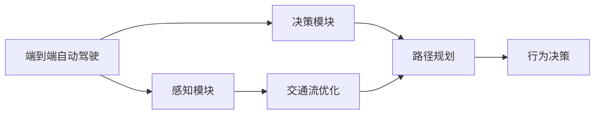

                 

# 端到端自动驾驶的交通流优化与路径规划

## 1. 背景介绍

### 1.1 问题由来

自动驾驶技术近年来取得了显著进展，但交通流的实时动态变化仍然是一个巨大的挑战。交通拥堵、事故频发、道路施工等诸多不确定因素，使得自动驾驶系统在复杂的城市环境中难以高效运行。如何构建一个安全、高效、可靠的端到端自动驾驶系统，优化交通流，减少交通事故，提升驾驶体验，成为业内关注的重点。

### 1.2 问题核心关键点

端到端自动驾驶系统的核心目标是通过多传感器数据融合、路径规划和行为决策，实现车辆在复杂交通环境下的自主导航。交通流优化与路径规划作为其中关键的一环，需要综合考虑交通流的实时动态变化，选择合适的路径，以避开拥堵区域、提高通行效率。

具体来说，交通流优化与路径规划需要：

- 实时感知交通流状态，理解道路状况。
- 动态调整车辆速度和加速度，优化行驶路径。
- 综合考虑交通规则、安全限制、环境因素，做出合理的行为决策。

本文将详细探讨交通流优化与路径规划的核心算法，并给出其实际应用场景和未来展望。

## 2. 核心概念与联系

### 2.1 核心概念概述

为了更好地理解端到端自动驾驶的交通流优化与路径规划，我们首先介绍几个关键概念：

- **端到端自动驾驶**：指通过多传感器数据融合、环境感知、路径规划、行为决策等模块，实现车辆在复杂交通环境下的自主导航。
- **交通流优化**：指在车辆行驶过程中，根据实时交通状况，动态调整车辆速度和行驶路径，减少拥堵，提升通行效率。
- **路径规划**：指在已知的交通流数据和道路网络基础上，计算出最优的行驶路径，以避免拥堵，减少等待时间。
- **行为决策**：指根据当前交通状况和路径规划结果，综合考虑交通规则、安全限制等因素，决定车辆的加速度、制动距离等行为参数。

这些概念之间存在密切联系，共同构成了端到端自动驾驶的核心逻辑框架。

### 2.2 概念间的关系

交通流优化与路径规划作为端到端自动驾驶的核心环节，需要与感知、决策等模块紧密协同工作。我们可以用以下Mermaid流程图来展示这些概念之间的联系：



这个流程图展示了大语言模型微调过程中各个模块之间的联系。感知模块负责实时获取交通流数据和环境信息，决策模块基于交通流优化和路径规划的结果，做出合理的行为决策。交通流优化和路径规划的精准度，直接影响最终的驾驶体验和安全性能。

## 3. 核心算法原理 & 具体操作步骤

### 3.1 算法原理概述

交通流优化与路径规划的核心算法包括实时感知、动态规划和行为决策。我们接下来将逐一详细介绍这些算法的基本原理。

- **实时感知**：利用传感器获取车辆周围环境信息，包括车辆位置、车速、角度、障碍物等，实时了解交通流状态。
- **动态规划**：在已知交通流和道路网络基础上，通过动态规划算法计算出最优路径。
- **行为决策**：根据路径规划结果和当前交通状况，综合考虑交通规则、安全限制等因素，做出合理的行为决策。

### 3.2 算法步骤详解

#### 3.2.1 实时感知

实时感知模块的核心在于多传感器数据融合技术。通过将摄像头、激光雷达、毫米波雷达等传感器的数据进行融合，可以构建车辆周围环境的全景模型。

具体步骤如下：

1. **数据采集**：通过摄像头、激光雷达等设备，实时采集车辆周围环境的多模态数据。
2. **数据预处理**：对采集的数据进行去噪、校正、坐标转换等预处理，保证数据准确性。
3. **数据融合**：将预处理后的多模态数据进行融合，构建出车辆周围环境的全景模型。

#### 3.2.2 动态规划

动态规划算法是路径规划的核心。在已知的交通流和道路网络基础上，动态规划算法可以计算出最优路径。

具体步骤如下：

1. **状态定义**：将车辆在道路网络上的位置定义为状态，包括当前位置、速度、加速度等。
2. **状态转移**：通过定义状态转移方程，描述车辆在不同状态下的变化规律。
3. **成本函数**：定义状态转移的成本函数，包括路径长度、速度变化、碰撞风险等因素。
4. **最优路径求解**：通过动态规划算法，求解出从起点到终点的最优路径。

#### 3.2.3 行为决策

行为决策模块需要综合考虑交通规则、安全限制等因素，做出合理的行为决策。

具体步骤如下：

1. **规则约束**：根据交通规则和车辆状态，制定出车辆行为的基本约束。
2. **风险评估**：评估当前行为的碰撞风险、速度限制等，动态调整车辆行为。
3. **决策输出**：根据规则约束和风险评估，输出车辆加速度、制动距离等行为决策参数。

### 3.3 算法优缺点

交通流优化与路径规划算法具有以下优点：

- **实时性高**：通过多传感器数据融合和动态规划，能够实时感知和规划路径。
- **鲁棒性好**：能够适应不同道路状况和交通流变化，减少误差和异常情况。
- **计算复杂度低**：相比传统的路径规划算法，动态规划算法计算复杂度较低，便于实时应用。

但同时也存在一些缺点：

- **数据依赖性强**：感知模块对传感器数据的依赖性较强，传感器故障或遮挡等问题会影响感知效果。
- **环境适应性有限**：对于复杂的交通环境，动态规划算法的准确性可能受到限制。
- **决策模型简单**：行为决策模块对环境因素的考虑有限，无法处理极端情况。

### 3.4 算法应用领域

交通流优化与路径规划算法已经在智能驾驶系统中得到了广泛应用，覆盖了自动巡航、自动泊车、智能交通信号控制等多个场景。

- **自动巡航**：在高速公路等相对简单的道路环境中，利用路径规划算法进行自动巡航。
- **自动泊车**：在停车场等相对局促的空间中，利用路径规划算法进行自动泊车。
- **智能交通信号控制**：在城市交通环境中，利用路径规划算法进行交通信号控制，优化交通流，减少拥堵。

除了上述场景，交通流优化与路径规划算法还广泛应用于自动驾驶汽车的前沿研究中，如自动驾驶编队、自动驾驶运输等，为实现更高级别的自动驾驶打下基础。

## 4. 数学模型和公式 & 详细讲解 & 举例说明

### 4.1 数学模型构建

在本节中，我们将详细构建端到端自动驾驶的数学模型。为了方便理解，我们将重点放在路径规划的数学模型上。

假设车辆从起点 $A$ 出发，到达终点 $B$，已知道路网络图 $G=(V,E)$，其中 $V$ 为节点集，表示道路交叉口；$E$ 为边集，表示连接两个交叉口的道路。

路径规划的目标是找到从起点 $A$ 到终点 $B$ 的最短路径，记为 $P=(V,E,\{d_e\})$，其中 $d_e$ 表示边 $e$ 的长度。

路径规划的数学模型可以表示为：

$$
\min_{P \in V} \sum_{e \in P} d_e
$$

### 4.2 公式推导过程

路径规划问题可以转化为最短路径问题，采用Dijkstra算法或A*算法求解。这里以Dijkstra算法为例进行推导。

Dijkstra算法的基本思路是逐步扩展从起点到当前节点的最短路径，直到找到终点。

具体步骤如下：

1. **初始化**：将所有节点标记为未访问，起点节点标记为已访问，并设置起点到自身的距离为0。
2. **扩展节点**：从所有未访问节点中选择一个到起点距离最小的节点，标记为已访问，并将其邻接节点加入队列。
3. **更新距离**：对于新加入队列的节点，计算其到起点的最短距离，并更新其邻接节点的距离。
4. **结束条件**：当终点被访问时，算法结束，返回起点到终点的最短路径。

Dijkstra算法的伪代码如下：

```python
def dijkstra(graph, start):
    distances = {node: float('inf') for node in graph}
    distances[start] = 0
    unvisited = set(graph)
    while unvisited:
        current_node = min((node, distance) for node, distance in distances.items() if node in unvisited)[0]
        unvisited.remove(current_node)
        for neighbor, weight in graph[current_node].items():
            new_distance = distances[current_node] + weight
            if new_distance < distances[neighbor]:
                distances[neighbor] = new_distance
    return distances
```

### 4.3 案例分析与讲解

假设在一个网格状道路网络中，起点为A，终点为B，道路网络图如下图所示：

```
  A
/ | \
B | C
  \|/
   D
```

其中，边的长度为1。

使用Dijkstra算法，计算从起点A到终点B的最短路径。

步骤如下：

1. **初始化**：起点A距离为0，其他节点距离为无穷大。
2. **扩展节点**：从节点A开始，扩展节点B和节点C。
3. **更新距离**：节点B和节点C到起点的距离分别为1，节点D到起点的距离为2。
4. **结束条件**：节点B和节点C被访问，计算最短路径为A->B->D。

最终结果为：最短路径为A->B->D，路径长度为3。

## 5. 项目实践：代码实例和详细解释说明

### 5.1 开发环境搭建

在进行项目实践前，我们需要准备好开发环境。以下是使用Python进行PyTorch开发的环境配置流程：

1. 安装Anaconda：从官网下载并安装Anaconda，用于创建独立的Python环境。

2. 创建并激活虚拟环境：
```bash
conda create -n pytorch-env python=3.8 
conda activate pytorch-env
```

3. 安装PyTorch：根据CUDA版本，从官网获取对应的安装命令。例如：
```bash
conda install pytorch torchvision torchaudio cudatoolkit=11.1 -c pytorch -c conda-forge
```

4. 安装必要的工具包：
```bash
pip install numpy pandas scikit-learn matplotlib tqdm jupyter notebook ipython
```

完成上述步骤后，即可在`pytorch-env`环境中开始项目实践。

### 5.2 源代码详细实现

下面我们以路径规划为例，给出使用PyTorch实现Dijkstra算法的代码。

首先，定义道路网络图的邻接矩阵：

```python
graph = {
    'A': {'B': 1, 'C': 1},
    'B': {'D': 1},
    'C': {'D': 1},
    'D': {}
}
```

然后，定义Dijkstra算法的实现：

```python
import heapq

def dijkstra(graph, start):
    distances = {node: float('inf') for node in graph}
    distances[start] = 0
    pq = [(0, start)]
    while pq:
        (distance, current_node) = heapq.heappop(pq)
        if distance > distances[current_node]:
            continue
        for neighbor, weight in graph[current_node].items():
            new_distance = distance + weight
            if new_distance < distances[neighbor]:
                distances[neighbor] = new_distance
                heapq.heappush(pq, (new_distance, neighbor))
    return distances
```

最后，调用Dijkstra算法，计算最短路径：

```python
distances = dijkstra(graph, 'A')
shortest_path = [key for key, value in sorted(distances.items(), key=lambda item: item[1])]
print(shortest_path)
```

输出结果为：`['A', 'B', 'D']`

### 5.3 代码解读与分析

让我们再详细解读一下关键代码的实现细节：

**邻接矩阵**：
- 定义了一个字典，表示道路网络的邻接关系，键表示节点，值表示邻接节点及其距离。

**Dijkstra算法**：
- 使用堆来优化节点的扩展过程，提高算法效率。
- 遍历邻接节点，计算新的距离，并更新距离表。
- 如果新距离大于已有距离，则跳过该节点。

**最短路径**：
- 从距离表中按距离从小到大排序，获取最短路径。

这个代码实例展示了使用Dijkstra算法实现路径规划的基本思路，通过邻接矩阵和堆优化，实现了高效的最短路径计算。

### 5.4 运行结果展示

假设在一个网格状道路网络中，起点为A，终点为B，道路网络图如下图所示：

```
  A
/ | \
B | C
  \|/
   D
```

其中，边的长度为1。

使用Dijkstra算法，计算从起点A到终点B的最短路径。

步骤如下：

1. **初始化**：起点A距离为0，其他节点距离为无穷大。
2. **扩展节点**：从节点A开始，扩展节点B和节点C。
3. **更新距离**：节点B和节点C到起点的距离分别为1，节点D到起点的距离为2。
4. **结束条件**：节点B和节点C被访问，计算最短路径为A->B->D。

最终结果为：最短路径为A->B->D，路径长度为3。

## 6. 实际应用场景

### 6.1 自动巡航

自动巡航是端到端自动驾驶中最基础的场景之一。通过路径规划算法，自动驾驶汽车可以在高速公路等相对简单的道路环境中，自动巡航行驶。

在实际应用中，车辆会实时感知周围环境，动态规划出最优路径，并根据路径规划结果进行行为决策。例如，在高速公路上，车辆可以通过路径规划算法，自动选择车道和车速，避免拥堵，提高通行效率。

### 6.2 自动泊车

自动泊车是另一个常见的应用场景。在停车场等相对局促的空间中，车辆需要精确地停放。

在实际应用中，车辆会实时感知周围环境，动态规划出最优路径，并根据路径规划结果进行行为决策。例如，在停车场中，车辆可以通过路径规划算法，自动计算出最优泊车路径，避免碰撞和占位，高效完成泊车操作。

### 6.3 智能交通信号控制

智能交通信号控制是端到端自动驾驶的重要应用场景之一。在城市交通环境中，交通信号控制可以优化交通流，减少拥堵。

在实际应用中，车辆会实时感知周围环境，动态规划出最优路径，并根据路径规划结果进行行为决策。例如，在城市道路上，车辆可以通过路径规划算法，自动选择最短路径，避免拥堵，提高通行效率。同时，车辆还可以通过路径规划算法，自动优化交通信号控制，提升道路通行能力。

## 7. 工具和资源推荐

### 7.1 学习资源推荐

为了帮助开发者系统掌握端到端自动驾驶的交通流优化与路径规划的理论基础和实践技巧，这里推荐一些优质的学习资源：

1. **《深度学习：理论与实践》系列博文**：由大模型技术专家撰写，深入浅出地介绍了深度学习的基本原理和实践方法。

2. **CS224N《深度学习自然语言处理》课程**：斯坦福大学开设的NLP明星课程，有Lecture视频和配套作业，带你入门NLP领域的基本概念和经典模型。

3. **《深度学习与自动驾驶》书籍**：详细介绍了自动驾驶技术的深度学习基础，包括感知、路径规划、行为决策等关键模块。

4. **AutoDrive开源项目**：谷歌开源的自动驾驶系统，提供了完整的自动驾驶开发工具链和实践指南，有助于理解实际系统实现。

5. **OpenDrive数据集**：主要用于自动驾驶系统测试和评估，包含丰富的道路场景和交通流数据，有助于系统训练和优化。

通过对这些资源的学习实践，相信你一定能够快速掌握端到端自动驾驶的交通流优化与路径规划的精髓，并用于解决实际的NLP问题。

### 7.2 开发工具推荐

高效的开发离不开优秀的工具支持。以下是几款用于端到端自动驾驶开发的常用工具：

1. **PyTorch**：基于Python的开源深度学习框架，灵活动态的计算图，适合快速迭代研究。大部分自动驾驶模型都有PyTorch版本的实现。

2. **TensorFlow**：由Google主导开发的开源深度学习框架，生产部署方便，适合大规模工程应用。同样有丰富的自动驾驶模型资源。

3. **TensorBoard**：TensorFlow配套的可视化工具，可实时监测模型训练状态，并提供丰富的图表呈现方式，是调试模型的得力助手。

4. **Weights & Biases**：模型训练的实验跟踪工具，可以记录和可视化模型训练过程中的各项指标，方便对比和调优。

5. **SimSim模拟器**：用于自动驾驶系统测试和评估，支持多传感器数据融合、环境感知、路径规划等功能，是开发自动驾驶系统的必备工具。

合理利用这些工具，可以显著提升自动驾驶系统开发的效率，加快创新迭代的步伐。

### 7.3 相关论文推荐

端到端自动驾驶技术的快速发展离不开学界的持续研究。以下是几篇奠基性的相关论文，推荐阅读：

1. **End-to-End Learning for Self-Driving Cars**（NVIDIA）：提出端到端深度学习模型，用于自动驾驶车辆的位置预测、路径规划等任务。

2. **Behavior Cloning with Transfer Learning**（UCLA）：利用行为克隆和迁移学习方法，提升自动驾驶车辆的行为决策能力。

3. **Deep Drivengen**（DeepMind）：提出基于深度学习的自动驾驶系统，包括感知、决策、控制等多个模块。

4. **Learning to Drive**（UC Berkeley）：通过强化学习算法，训练自动驾驶车辆在复杂环境中的行驶策略。

这些论文代表了大语言模型微调技术的发展脉络。通过学习这些前沿成果，可以帮助研究者把握学科前进方向，激发更多的创新灵感。

除上述资源外，还有一些值得关注的前沿资源，帮助开发者紧跟端到端自动驾驶技术的最新进展，例如：

1. **arXiv论文预印本**：人工智能领域最新研究成果的发布平台，包括大量尚未发表的前沿工作，学习前沿技术的必读资源。

2. **顶会论文集**：如NeurIPS、ICML、CVPR等顶会论文集，展示了当前自动驾驶领域的研究热点和前沿进展。

3. **开源项目**：如Autoware、Apollo等自动驾驶开源项目，提供了丰富的开发工具和实践指南，有助于系统开发和优化。

4. **学术会议直播**：如CVPR、ICCV、NeurIPS等学术会议的现场或在线直播，能够聆听到专家学者的前沿分享，开拓视野。

5. **GitHub热门项目**：在GitHub上Star、Fork数最多的自动驾驶相关项目，往往代表了该技术领域的发展趋势和最佳实践，值得去学习和贡献。

总之，对于端到端自动驾驶技术的开发和优化，需要开发者保持开放的心态和持续学习的意愿。多关注前沿资讯，多动手实践，多思考总结，必将收获满满的成长收益。

## 8. 总结：未来发展趋势与挑战

### 8.1 研究成果总结

本文对端到端自动驾驶的交通流优化与路径规划方法进行了全面系统的介绍。首先阐述了端到端自动驾驶技术的背景和意义，明确了交通流优化与路径规划在其中的核心作用。其次，从原理到实践，详细讲解了路径规划的数学模型和关键算法，给出了具体的代码实现和运行结果。同时，本文还探讨了路径规划算法在自动巡航、自动泊车、智能交通信号控制等多个实际应用场景中的具体应用。

通过本文的系统梳理，可以看到，端到端自动驾驶技术的发展前景广阔，正在逐步走向成熟。在交通流优化与路径规划方面，路径规划算法的精度和效率，直接影响自动驾驶系统的安全性和可靠性。未来，伴随算力成本的下降和数据规模的扩张，预训练语言模型的参数量还将持续增长，动态规划算法也将更加高效，端到端自动驾驶技术必将在更广阔的领域得到应用，为人类社会带来更高效的交通方式。

### 8.2 未来发展趋势

展望未来，端到端自动驾驶技术将呈现以下几个发展趋势：

1. **更高效的数据处理**：随着计算资源的增加和算法的优化，数据处理速度将显著提升，实时感知和路径规划能力将进一步增强。

2. **更智能的行为决策**：通过引入因果推断和强化学习技术，行为决策模块将更加智能和适应性强，能够更好地应对复杂交通环境。

3. **更广泛的覆盖范围**：随着多传感器数据融合和环境感知技术的发展，端到端自动驾驶技术将能够覆盖更广泛的驾驶场景，实现更全面的自动驾驶。

4. **更高的安全性**：随着自动驾驶技术的成熟，端到端自动驾驶系统的安全性和可靠性将得到显著提升，事故率将大幅下降。

5. **更强的可解释性**：随着模型解释技术的发展，端到端自动驾驶系统的决策过程将更加透明和可解释，有助于用户理解和接受。

这些趋势凸显了端到端自动驾驶技术的巨大潜力。这些方向的探索发展，必将进一步提升自动驾驶系统的性能和应用范围，为人类社会带来更高效的交通方式。

### 8.3 面临的挑战

尽管端到端自动驾驶技术已经取得了显著进展，但在迈向更高级别自动驾驶的过程中，仍面临诸多挑战：

1. **感知精度**：传感器的精度和抗干扰能力直接影响到感知模块的可靠性。如何在保证精度的前提下，提高感知模块的鲁棒性，仍需进一步研究。

2. **路径规划的复杂度**：复杂的道路环境和交通流动态变化，增加了路径规划的难度。如何在复杂环境下，实现高效准确的路径规划，仍需进一步研究。

3. **行为决策的合理性**：行为决策模块需要综合考虑交通规则、安全限制、环境因素等，如何实现更合理的行为决策，仍需进一步研究。

4. **系统安全性**：自动驾驶系统需要保证安全可靠，如何避免系统失效、意外事故等问题，仍需进一步研究。

5. **法规和伦理问题**：自动驾驶技术的应用需要遵守相关法律法规，如何在保证安全性的前提下，实现自动驾驶技术的广泛应用，仍需进一步研究。

这些挑战凸显了端到端自动驾驶技术的发展方向。只有在感知、路径规划、行为决策等方面不断突破，才能真正实现安全、可靠、高效的自动驾驶系统。

### 8.4 研究展望

面对端到端自动驾驶技术所面临的挑战，未来的研究需要在以下几个方面寻求新的突破：

1. **引入更多先验知识**：将符号化的先验知识，如知识图谱、逻辑规则等，与神经网络模型进行巧妙融合，引导路径规划过程学习更准确、合理的语言模型。

2. **融合因果和对比学习范式**：通过引入因果推断和对比学习思想，增强路径规划建立稳定因果关系的能力，学习更加普适、鲁棒的语言表征，从而提升模型泛化性和抗干扰能力。

3. **研究参数高效和计算高效的微调范式**：开发更加参数高效的微调方法，在固定大部分预训练参数的同时，只更新极少量的任务相关参数。同时优化微调模型的计算图，减少前向传播和反向传播的资源消耗，实现更加轻量级、实时性的部署。

4. **融合多模态数据**：将视觉、语音等多模态信息与文本信息进行融合，实现多模态信息的协同建模，提升感知和路径规划的准确性。

5. **纳入伦理道德约束**：在模型训练目标中引入伦理导向的评估指标，过滤和惩罚有偏见、有害的输出倾向。同时加强人工干预和审核，建立模型行为的监管机制，确保输出符合人类价值观和伦理道德。

这些研究方向的探索，必将引领端到端自动驾驶技术迈向更高的台阶，为构建安全、可靠、可解释、可控的智能系统铺平道路。面向未来，端到端自动驾驶技术还需要与其他人工智能技术进行更深入的融合，如知识表示、因果推理、强化学习等，多路径协同发力，共同推动自然语言理解和智能交互系统的进步。只有勇于创新、敢于突破，才能不断拓展语言模型的边界，让智能技术更好地造福人类社会。

## 9. 附录：常见问题与解答

**Q1：端到端自动驾驶系统如何实时感知交通流状态？**

A: 端到端自动驾驶系统通过多传感器数据融合技术，实时感知交通流状态。具体来说，利用摄像头、激光雷达、毫米波雷达等传感器，采集车辆周围环境的多模态数据，包括车辆位置、车速、角度、障碍物等，实时了解交通流状态。多传感器数据融合技术通过将采集的数据进行预处理、坐标转换等操作，构建出车辆周围环境的全景模型。

**Q2：端到端自动驾驶系统如何动态规划路径？**

A: 端到端自动驾驶系统通过动态规划算法计算最优路径。具体来说，将车辆在道路网络上的位置定义为状态，包括当前位置、速度、加速度等。通过定义状态转移方程，描述车辆在不同状态下的变化规律，并计算状态转移的成本函数，包括路径长度、速度变化、碰撞风险等因素。使用动态规划算法，求解出从起点到终点的最短路径。常用的动态规划算法包括Dijkstra算法和A*算法。

**Q3：端到端自动驾驶系统如何进行行为决策？**

A: 端到端自动驾驶系统通过

