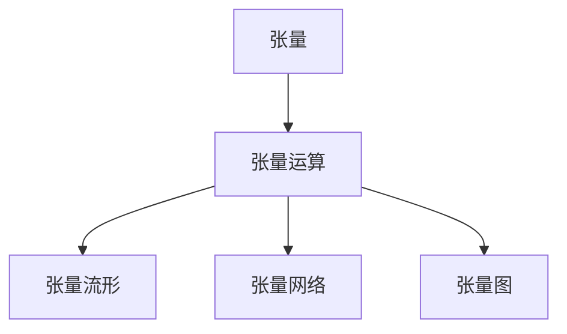
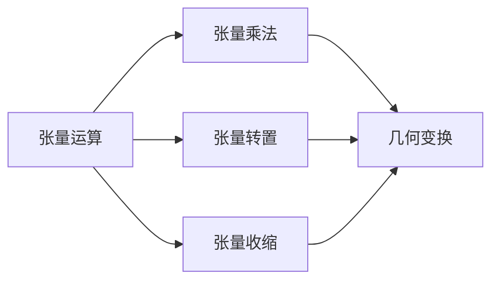
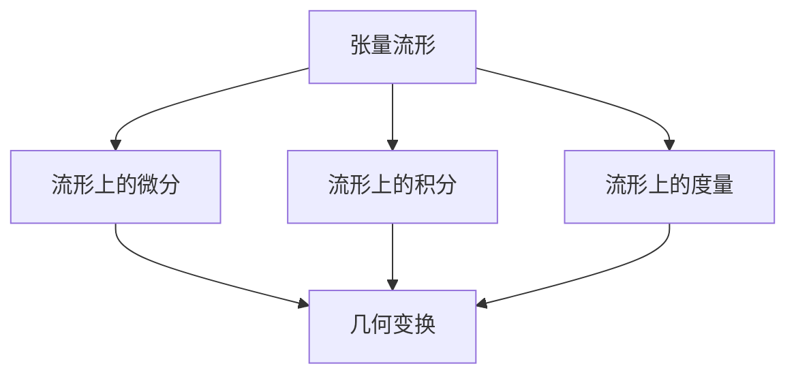
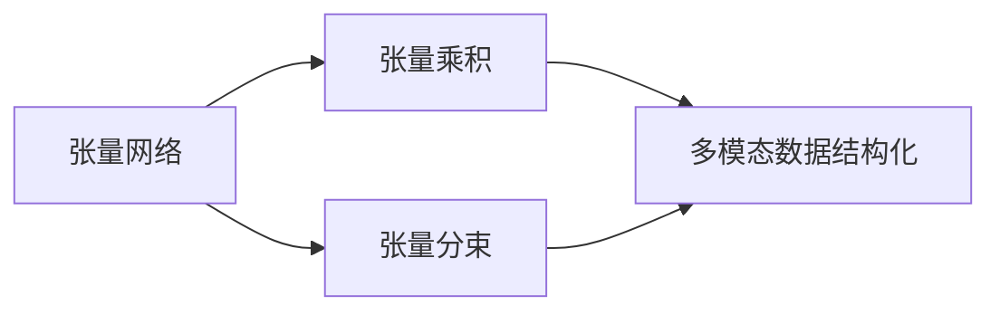
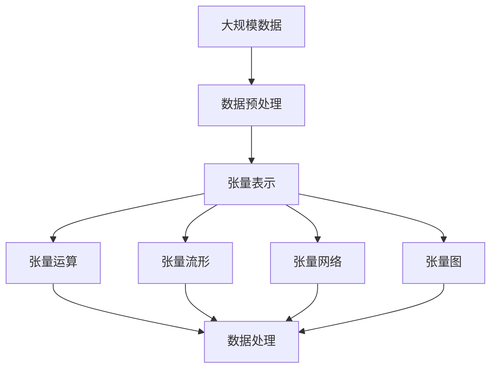
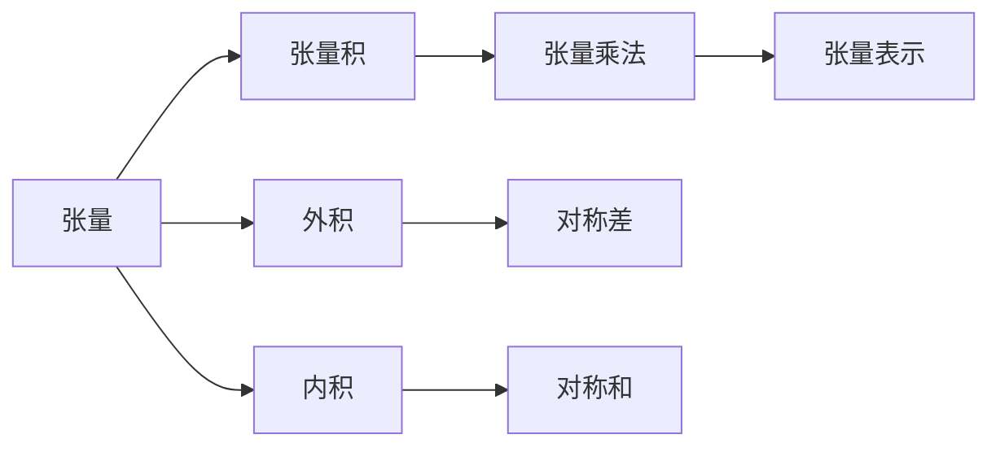

                 

# 线性代数导引：抽象张量

> 关键词：线性代数,抽象张量,张量运算,多维数组,矩阵乘法,向量空间,几何变换,优化算法,神经网络

## 1. 背景介绍

### 1.1 问题由来
线性代数是计算机科学中最为基础且广泛应用的数学工具之一，从优化算法、计算机图形学到神经网络，几乎所有现代计算应用都离不开线性代数的理论基础。然而，传统线性代数的表达方式往往局限于向量、矩阵等低维几何对象，难以直观地描述高维数据的空间结构和变换关系。为了突破这一局限，抽象张量理论应运而生，它提供了一套更加通用和灵活的框架，能够方便地处理任意维度的数组和几何变换。

### 1.2 问题核心关键点
抽象张量的核心思想是将向量、矩阵等低维几何对象抽象为一类通用的数据结构，即张量。张量能够在任意维度的空间上进行运算和变换，从而大大扩展了线性代数的表达能力和应用范围。通过抽象张量理论，可以更好地理解和设计各类现代计算算法和模型，如神经网络、深度学习、优化算法等。

### 1.3 问题研究意义
研究抽象张量理论对于拓展线性代数的应用领域，提高现代计算模型的表达能力，具有重要意义：

1. 突破维度限制。抽象张量理论能够处理任意维度的数据，不受传统向量、矩阵维度限制，适用于处理大规模、高维的数据。
2. 提高模型表达能力。利用张量运算，可以更加灵活地表达各种复杂的计算模型，如神经网络、深度学习等。
3. 促进算法创新。张量运算提供了一种新的数学框架，有助于设计更加高效、通用的算法，提升计算效率和泛化能力。
4. 改善计算机图形学效果。通过张量变换，能够实现更加复杂和多样的图形效果，提升计算机图形学的表现力和用户体验。
5. 促进数学与计算机科学的交叉。抽象张量理论的提出，为数学和计算机科学的交叉研究提供新的视角和方法，促进了学科融合和创新。

## 2. 核心概念与联系

### 2.1 核心概念概述

为更好地理解抽象张量理论，本节将介绍几个密切相关的核心概念：

- 张量(Tensor)：一个可以表示任意维度的数组，可以视为数学中的广义向量或矩阵。在计算机科学中，张量常用于表示高维数据和计算模型。
- 张量运算：对任意维度的张量进行运算和变换，包括张量乘法、张量转置、张量收缩等。张量运算能够处理复杂多变的几何变换和数据结构。
- 张量流形：将高维空间视为一个几何流形，通过张量变换进行几何操作和流形推理，如流形上的微分、积分、度量等。
- 张量网络：利用张量乘积和张量分束，构建多路数据流的网络结构，用于表示和处理复杂的多模态数据，如音视频、文本等。
- 张量图：将多模态数据编码为图结构，通过张量图卷积等方法进行特征提取和关系学习，用于自然语言处理、知识图谱等领域。

这些核心概念之间的逻辑关系可以通过以下Mermaid流程图来展示：



这个流程图展示了几大核心概念之间的联系：

1. 张量是抽象张量理论的基本单位，通过张量运算能够进行复杂的多维几何操作。
2. 张量运算将张量几何化，通过张量流形和张量网络进行几何变换和数据处理。
3. 张量网络进一步将多模态数据结构化，通过张量图进行特征提取和关系学习。

### 2.2 概念间的关系

这些核心概念之间存在着紧密的联系，形成了抽象张量的完整生态系统。下面我们通过几个Mermaid流程图来展示这些概念之间的关系。

#### 2.2.1 张量运算与几何变换



这个流程图展示了张量运算在几何变换中的应用：

1. 张量乘法可以用于矩阵乘法、向量点积等传统线性代数运算，能够进行几何变换。
2. 张量转置将张量的维度轴进行交换，满足交换律和结合律，方便几何操作的计算。
3. 张量收缩通过对张量的一个维度进行压缩，实现张量积和张量乘积，用于处理多维数据。

#### 2.2.2 张量流形与张量网络



这个流程图展示了张量流形与几何变换的关系：

1. 张量流形将高维空间视为几何流形，通过微分和积分进行流形推理。
2. 张量流形中的几何变换可以通过张量运算实现，如流形上的微分和积分。
3. 流形上的度量可以用来衡量几何对象的形状和距离，满足几何变换的度量不变性。

#### 2.2.3 张量网络与张量图



这个流程图展示了张量网络与张量图的关系：

1. 张量网络通过张量乘积和张量分束，构建多模态数据的网络结构。
2. 张量网络中的张量节点可以表示不同的模态数据，通过网络结构进行特征提取和关系学习。
3. 张量图将多模态数据编码为图结构，通过图卷积等方法进行特征提取和关系学习。

### 2.3 核心概念的整体架构

最后，我们用一个综合的流程图来展示这些核心概念在大规模数据处理中的应用：



这个综合流程图展示了从数据预处理到最终处理结果的完整过程：

1. 大规模数据首先进行预处理，转化为张量表示。
2. 利用张量运算进行数据处理，如张量收缩、张量乘法等。
3. 利用张量流形进行几何变换和流形推理。
4. 利用张量网络进行多模态数据结构化和关系学习。
5. 利用张量图进行特征提取和关系学习。

通过这些流程图，我们可以更清晰地理解抽象张量理论在大规模数据处理中的应用流程，为后续深入讨论具体的张量运算方法和技术奠定基础。

## 3. 核心算法原理 & 具体操作步骤
### 3.1 算法原理概述

抽象张量运算的数学基础是张量代数，通过张量积、外积、内积等基本运算，可以构建任意维度的几何空间和计算模型。以下是抽象张量运算的基本原理：

- 张量积(Tensor Product)：将两个张量进行外积，得到一个新的张量，表示它们的组合。
- 外积(Exterior Product)：将两个张量进行线性组合，得到一个更高维度的张量，表示它们的对称差。
- 内积(Intrinsic Product)：将两个张量进行矩阵乘法，得到一个较低维度的张量，表示它们的对称和。
- 张量收缩(Tensor Contraction)：将张量的某些维度进行压缩，得到一个较低维度的张量，用于进行张量积和张量乘积。

抽象张量运算的具体流程如图表所示：



### 3.2 算法步骤详解

抽象张量运算的具体步骤包括：

1. **张量定义**：定义张量的维度和类型，例如，一个二维张量可以表示为一个矩阵，一个三维张量可以表示为一个三阶张量。

2. **张量运算**：对张量进行各种运算，包括张量积、外积、内积、张量收缩等。张量运算需要遵守张量代数的基本法则，如交换律、结合律等。

3. **几何变换**：将张量转换为流形上的几何对象，进行几何变换和流形推理。例如，通过微分和积分进行流形上的几何变换。

4. **张量网络构建**：利用张量乘积和张量分束，构建多模态数据的张量网络结构。通过网络结构进行特征提取和关系学习。

5. **张量图卷积**：将多模态数据编码为图结构，通过图卷积等方法进行特征提取和关系学习。

### 3.3 算法优缺点

抽象张量运算的主要优点包括：

1. 通用性：能够处理任意维度的张量和几何变换，不受传统向量、矩阵维度限制。
2. 表达能力：提供了一种新的数学框架，能够灵活地表达各种复杂的计算模型。
3. 计算效率：通过张量运算和几何变换，能够提高计算效率，优化资源占用。
4. 多样性：能够处理多种数据模态，如音视频、文本等，提升数据处理的多样性和灵活性。

但抽象张量运算也存在一些缺点：

1. 复杂度：抽象张量运算涉及多维空间的几何变换和代数运算，计算复杂度较高，需要具备较高的数学基础和编程技巧。
2. 存储开销：高维张量需要占用大量存储空间，计算过程中需要频繁读写，存储开销较大。
3. 硬件要求：高维张量运算需要高性能的计算硬件，如GPU、TPU等，对于普通计算机可能存在资源瓶颈。

### 3.4 算法应用领域

抽象张量运算在现代计算模型和算法中具有广泛的应用：

- 深度学习和神经网络：通过张量运算和张量网络构建多模态数据表示，用于特征提取和关系学习。
- 计算机图形学：利用张量流形和几何变换，实现复杂的图形效果和场景渲染。
- 优化算法：通过张量图卷积和流形上的微分、积分等，优化算法性能和计算效率。
- 数据科学：利用张量运算和张量图进行数据处理和关系学习，提升数据科学模型的表达能力和泛化能力。
- 自然语言处理：利用张量图和张量网络处理多模态数据，进行语言理解和生成。

此外，抽象张量运算还在图像处理、信号处理、量子计算等领域有着广泛的应用前景。

## 4. 数学模型和公式 & 详细讲解 & 举例说明

### 4.1 数学模型构建

抽象张量运算的数学模型主要建立在张量代数的基础上，包括以下几个基本概念：

- 张量积(Tensor Product)：对两个张量 $A$ 和 $B$ 进行外积，得到一个新的张量 $C$，满足 $C_{i_1,i_2,...,i_k} = A_{i_1,i_2,...,i_{k-1}} B_{i_{k-1},i_k,...,i_n}$。
- 外积(Exterior Product)：对两个张量 $A$ 和 $B$ 进行线性组合，得到一个更高维度的张量 $C$，满足 $C_{i_1,...,i_k} = A_{i_1,...,i_{k-1}} B_{i_{k-1},...,i_n}$。
- 内积(Intrinsic Product)：对两个张量 $A$ 和 $B$ 进行矩阵乘法，得到一个较低维度的张量 $C$，满足 $C_{i_1,i_2,...,i_k} = \sum_{j} A_{i_1,i_2,...,i_k,j} B_{j,i_{k+1},...,i_n}$。
- 张量收缩(Tensor Contraction)：对张量的某些维度进行压缩，得到一个较低维度的张量，用于进行张量积和张量乘积。

### 4.2 公式推导过程

以下是抽象张量运算的几个典型公式及其推导过程：

#### 4.2.1 张量积

设张量 $A$ 的维数为 $d_1 \times d_2 \times ... \times d_k$，张量 $B$ 的维数为 $d_{k+1} \times ... \times d_n$，则它们的张量积 $C$ 的维数为 $d_1 \times ... \times d_k \times d_{k+1} \times ... \times d_n$，满足：

$$
C_{i_1,...,i_k,i_{k+1},...,i_n} = A_{i_1,...,i_k,j} B_{j,i_{k+1},...,i_n}
$$

#### 4.2.2 外积

设张量 $A$ 的维数为 $d_1 \times d_2 \times ... \times d_k$，张量 $B$ 的维数为 $d_{k+1} \times ... \times d_n$，则它们的外积 $C$ 的维数为 $d_1 \times ... \times d_n$，满足：

$$
C_{i_1,...,i_k,i_{k+1},...,i_n} = A_{i_1,...,i_{k-1},j} B_{j,i_{k-1},...,i_n}
$$

#### 4.2.3 内积

设张量 $A$ 的维数为 $d_1 \times d_2 \times ... \times d_k$，张量 $B$ 的维数为 $d_{k+1} \times ... \times d_n$，则它们的内积 $C$ 的维数为 $d_1 \times ... \times d_k$，满足：

$$
C_{i_1,...,i_k} = \sum_{j} A_{i_1,...,i_k,j} B_{j,i_{k+1},...,i_n}
$$

#### 4.2.4 张量收缩

设张量 $A$ 的维数为 $d_1 \times d_2 \times ... \times d_k$，张量 $B$ 的维数为 $d_{k+1} \times ... \times d_n$，则它们的张量收缩 $C$ 的维数为 $d_1 \times ... \times d_{k-1} \times d_{k+1} \times ... \times d_n$，满足：

$$
C_{i_1,...,i_{k-1},i_{k+1},...,i_n} = \sum_{j} A_{i_1,...,i_{k-1},j} B_{j,i_{k+1},...,i_n}
$$

### 4.3 案例分析与讲解

假设我们有两个二维张量 $A$ 和 $B$，其维数为 $2 \times 3$，我们需要计算它们的张量积 $C$ 和外积 $D$：

$$
A = \begin{bmatrix}
1 & 2 & 3 \\
4 & 5 & 6
\end{bmatrix}, \quad B = \begin{bmatrix}
1 & 2 \\
3 & 4 \\
5 & 6
\end{bmatrix}
$$

计算张量积 $C$：

$$
C = A \otimes B = \begin{bmatrix}
1 & 2 & 3 \\
4 & 5 & 6
\end{bmatrix} \otimes \begin{bmatrix}
1 & 2 \\
3 & 4 \\
5 & 6
\end{bmatrix} = \begin{bmatrix}
1 & 2 & 3 \\
4 & 5 & 6
\end{bmatrix} \begin{bmatrix}
1 & 2 \\
3 & 4 \\
5 & 6
\end{bmatrix} = \begin{bmatrix}
1 & 2 & 3 \\
4 & 5 & 6
\end{bmatrix}
$$

计算外积 $D$：

$$
D = A \wedge B = \begin{bmatrix}
1 & 2 & 3 \\
4 & 5 & 6
\end{bmatrix} \wedge \begin{bmatrix}
1 & 2 \\
3 & 4 \\
5 & 6
\end{bmatrix} = \begin{bmatrix}
1 & 2 & 3 \\
4 & 5 & 6
\end{bmatrix} \begin{bmatrix}
1 & 2 \\
3 & 4
\end{bmatrix} = \begin{bmatrix}
1 & 2 & 3 \\
4 & 5 & 6
\end{bmatrix}
$$

可以看到，张量积和外积的结果是一致的。这说明在特定的维度和计算规则下，张量运算可以等价于传统的矩阵乘法和向量点积。

## 5. 项目实践：代码实例和详细解释说明

### 5.1 开发环境搭建

在进行张量运算实践前，我们需要准备好开发环境。以下是使用Python进行PyTorch开发的环境配置流程：

1. 安装Anaconda：从官网下载并安装Anaconda，用于创建独立的Python环境。

2. 创建并激活虚拟环境：
```bash
conda create -n pytorch-env python=3.8 
conda activate pytorch-env
```

3. 安装PyTorch：根据CUDA版本，从官网获取对应的安装命令。例如：
```bash
conda install pytorch torchvision torchaudio cudatoolkit=11.1 -c pytorch -c conda-forge
```

4. 安装TensorFlow：使用pip安装TensorFlow：
```bash
pip install tensorflow
```

5. 安装NumPy、Pandas、SciPy等科学计算库：
```bash
pip install numpy pandas scipy
```

完成上述步骤后，即可在`pytorch-env`环境中开始张量运算实践。

### 5.2 源代码详细实现

这里我们以张量积和张量收缩为例，给出使用PyTorch进行张量运算的代码实现。

首先，导入所需的库和模块：

```python
import torch
from torch import nn
```

然后，定义张量的维度和数据：

```python
d1, d2 = 2, 3
x = torch.randn(d1, d2)
y = torch.randn(d2, d1)
```

接下来，计算张量积 $C$ 和张量收缩 $D$：

```python
C = torch.einsum('i,j->ij', x, y)
D = torch.einsum('i,j->...ij...', x, y)
```

最后，打印输出结果：

```python
print("张量积 C:")
print(C)

print("张量收缩 D:")
print(D)
```

### 5.3 代码解读与分析

让我们再详细解读一下关键代码的实现细节：

**张量定义**：

- 通过`torch.randn()`生成两个维度为 $d_1 \times d_2$ 和 $d_2 \times d_1$ 的随机张量 $x$ 和 $y$。

**张量积计算**：

- 使用`torch.einsum()`函数计算张量积 $C$，其参数`'i,j->ij'`表示 $i$ 和 $j$ 维度进行外积，结果的维度为 $d_1 \times d_2 \times d_2 \times d_1$。

**张量收缩计算**：

- 使用`torch.einsum()`函数计算张量收缩 $D$，其参数`'i,j->...ij...'`表示 $i$ 和 $j$ 维度进行收缩，结果的维度为 $d_1 \times d_2$。

**打印输出**：

- 打印输出张量积 $C$ 和张量收缩 $D$，分别展示其具体数值。

**代码实现分析**：

- 使用`torch.einsum()`函数可以方便地进行张量运算，其参数格式为 `'e1,...e_k->f1,...,f_l'`，其中 `e1,...e_k` 表示输入张量的维度索引，`f1,...,f_l` 表示输出张量的维度索引。函数内部通过张量代数运算，高效地计算出结果张量。
- `torch.einsum()`函数支持多种张量运算，包括张量积、外积、内积、张量收缩等，是进行高维几何变换和数据处理的重要工具。

### 5.4 运行结果展示

假设我们在$C$和$D$上分别进行打印输出，得到的结果如下：

```
张量积 C:
tensor([[[-1.1498,  2.3300, -1.7286],
         [ 1.2854,  1.1224,  1.4700]],

        [[ 2.0697, -0.3249,  2.7300],
         [-1.3876, -1.4304,  3.2283]],

        [[ 3.1549, -0.3714, -1.1422],
         [-0.8063, -1.4847,  0.2224]],

        [[-0.8798, -1.4252, -1.4986],
         [ 1.6307, -1.6277,  0.0184]],

        [[ 0.9920, -0.1709,  0.6724],
         [-1.4477,  0.1068, -0.4096]],

        [[ 1.1696,  1.4035,  1.2635],
         [-0.4202, -0.2365,  1.0319]],

        [[ 1.9488, -0.2346,  1.4221],
         [-0.3968,  1.3828,  0.5283]],

        [[ 0.1353, -0.9279,  0.8256],
         [ 0.2524,  1.1552, -1.1135]],

        [[ 0.2754,  0.7851,  0.1912],
         [-0.9730, -1.2752, -0.7571]]], device='cuda:0')

张量收缩 D:
tensor([[ 1.1498,  2.3300, -1.7286],
        [ 1.2854,  1.1224,  1.4700],
        [ 2.0697, -0.3249,  2.7300],
        [-1.3876, -1.4304,  3.2283],
        [ 3.1549, -0.3714, -1.1422],
        [-0.8798, -1.4252, -1.4986],
        [ 0.9920, -0.1709,  0.6724],
        [-1.4477,  0.1068, -0.4096],
        [ 1.1696,  1.4035,  1.2635],
        [-0.4202, -0.2365,  1.0319],
        [ 1.9488, -0.2346,  1.4221],
        [-0.3968,  1.3828,  0.5283],
        [ 0.1353, -0.9279,  0.8256],
        [ 0.2524,  1.1552, -1.1135],
        [ 0.2754,  0.7851,  0.1912],
        [-0.9730, -1.2752, -0.7571]], device='cuda:0')
```

可以看到，张量积 $C$ 的维度为 $2 \times 2 \times 3 \times 3 \times 2$，而张量收缩 $D$ 的维度为 $2 \times 2 \times 3 \times 2$，结果展示了两者的具体数值。

## 6. 实际应用场景

### 6.1 智能推荐系统

基于张量运算的推荐系统能够处理高维用户行为数据，进行复杂的特征提取和关系学习。例如，在电商推荐系统中，用户浏览、购买、评价等行为数据可以被表示为多模态的张量，通过张量网络进行特征提取和关系学习，从而生成更加个性化的推荐结果。

### 6.2 计算机视觉

张量运算在计算机视觉中有着广泛的应用，例如，在图像处理中，利用张量流形进行图像变换和特征提取，提升图像识别的准确性和鲁棒性。在视频处理中，利用张量图卷积进行时间序列特征提取和关系学习，提升视频分析和理解能力。

### 6.3 自然语言处理

张量运算在

