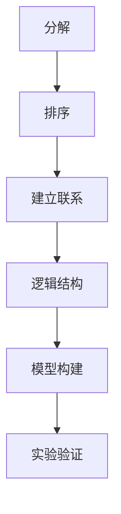
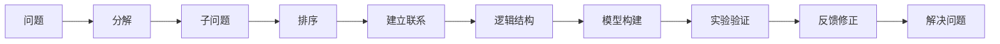

                 

# 结构化思维：理解世界的钥匙

## 1. 背景介绍

### 1.1 问题由来
在信息爆炸的时代，如何从海量数据中提取出有价值的信息，从而理解世界的本质，成为每个现代人的难题。过去，我们常常依赖直觉和经验，但这在信息量远超个人处理能力的情况下，显得力不从心。结构化思维应运而生，通过将复杂问题分解为可管理的部分，帮助我们理清思路，系统地解决问题。结构化思维已经成为现代商业决策、科学研究、技术开发中的核心能力之一。

### 1.2 问题核心关键点
结构化思维的核心在于分解和重构问题，从而找到其本质，制定出有效的解决方案。其核心步骤包括：
- **分解问题**：将复杂问题拆分成多个小问题，分别处理。
- **排序优先级**：根据重要性和紧急性，对子问题进行优先级排序。
- **建立联系**：找出各子问题之间的逻辑联系，构建起问题的整体框架。
- **构建框架**：通过归纳和演绎，建立问题解决的逻辑结构。
- **检验和修正**：通过实验和反馈，修正模型，验证解决方案的可行性。

### 1.3 问题研究意义
掌握结构化思维对于个体提升问题解决能力、提高工作效率、增强决策质量具有重要意义。在商业领域，结构化思维有助于提升管理水平，优化产品设计和运营策略；在科学研究中，结构化思维能够指导研究方向，加速成果转化；在技术开发中，结构化思维有助于规划项目架构，提高开发效率。总之，结构化思维是理解和解决复杂问题的有力工具，对于提升现代人的综合素质和竞争力至关重要。

## 2. 核心概念与联系

### 2.1 核心概念概述
- **分解**：将复杂问题拆解为若干子问题，便于逐一处理。
- **排序**：对子问题按照重要性和紧急性进行排序，确定处理优先级。
- **建立联系**：找出各子问题之间的内在逻辑联系，构建问题解决的框架。
- **逻辑结构**：通过归纳和演绎，建立问题解决的逻辑结构。
- **模型构建**：根据问题结构，建立可操作的模型。
- **实验验证**：通过实验验证模型的有效性，不断优化和修正。

### 2.2 概念间的关系
这些核心概念之间存在紧密的逻辑联系，形成了一个有机整体。分解是基础，排序是核心，建立联系是桥梁，逻辑结构是模型，模型构建是手段，实验验证是反馈。



这个流程图展示了结构化思维的核心步骤及其逻辑关系：分解问题形成子问题，对子问题排序并建立联系，构建问题解决的逻辑结构，进而建立可操作的模型，通过实验验证模型效果并不断优化。

### 2.3 核心概念的整体架构
从宏观上，结构化思维的整体架构如下：



这个架构展示了从问题到解决的整体流程，其中分解、排序、建立联系、逻辑结构、模型构建、实验验证、反馈修正等步骤相互关联，形成一个完整的解决方案。

## 3. 核心算法原理 & 具体操作步骤
### 3.1 算法原理概述
结构化思维的算法原理本质上是一种问题分解和重构的过程。其核心思想是将复杂问题拆解为若干子问题，逐个处理，同时保持子问题之间的内在联系，构建起问题的整体框架，并通过实验和反馈不断修正模型，最终得到问题解决的方案。

### 3.2 算法步骤详解
1. **分解问题**：将复杂问题拆解为若干小问题。例如，将“如何提升产品质量”拆解为“需求分析”、“设计优化”、“生产流程改进”等子问题。

2. **排序优先级**：根据子问题的紧急性和重要性，确定处理顺序。例如，对于紧急且重要的子问题（如“需求分析”）优先处理，而对于不紧急或不重要的子问题（如“员工培训”）可以推迟处理。

3. **建立联系**：找出各子问题之间的内在联系，建立问题解决的逻辑框架。例如，“设计优化”可能依赖于“需求分析”，“生产流程改进”可能依赖于“设计优化”。

4. **构建框架**：通过归纳和演绎，建立问题解决的逻辑结构。例如，构建一个“从需求到设计到生产的流程”，明确各环节的逻辑关系。

5. **模型构建**：根据逻辑结构，建立可操作的模型。例如，使用流程管理工具（如JIRA），将各子问题按照逻辑结构进行整合，形成一个流程化的解决方案。

6. **实验验证**：通过实验验证模型的有效性，不断优化和修正。例如，进行“设计优化”的实验，评估新设计方案的效果，根据反馈进行调整。

7. **反馈修正**：根据实验结果，不断修正模型，提升解决方案的可行性。例如，根据用户反馈，修改设计方案，进一步优化产品质量。

8. **解决问题**：根据修正后的模型，执行解决方案，最终解决问题。例如，实施“设计优化”后的新方案，提升产品质量。

### 3.3 算法优缺点
**优点**：
- 系统性：将复杂问题分解为若干子问题，便于逐一处理，避免遗漏关键点。
- 可操作性：通过构建逻辑结构，建立可操作的模型，使问题解决方案更加具体化。
- 灵活性：通过实验验证和反馈修正，不断优化模型，适应复杂多变的情况。

**缺点**：
- 时间成本：分解和重建问题框架需要时间，可能延误处理周期。
- 沟通成本：各子问题之间的联系需要充分沟通，可能增加协调难度。
- 复杂度：对于特别复杂的问题，可能难以找到有效的分解方式。

### 3.4 算法应用领域
结构化思维广泛应用于商业管理、产品开发、项目规划、科研探索等多个领域。具体应用如下：
- **商业管理**：优化企业流程，提升运营效率。例如，通过分解管理问题，建立企业管理的逻辑框架，优化流程。
- **产品开发**：构建产品设计流程，提升产品竞争力。例如，通过分解产品需求，建立设计、开发、测试的逻辑框架，提升产品品质。
- **项目规划**：制定项目实施计划，确保项目按时完成。例如，通过分解项目目标，建立任务、资源、时间的关系框架，确保项目顺利进行。
- **科研探索**：指导研究方向，加速成果转化。例如，通过分解科研问题，建立研究方向和方法的逻辑框架，加速科研成果的产出。
- **技术开发**：规划项目架构，提高开发效率。例如，通过分解技术问题，建立技术架构和实现路径的逻辑框架，提升开发效率。

## 4. 数学模型和公式 & 详细讲解 & 举例说明
### 4.1 数学模型构建
设问题为 $P$，分解为 $n$ 个子问题 $P_1, P_2, \ldots, P_n$，其优先级为 $S_1, S_2, \ldots, S_n$。问题解决的逻辑结构为 $F(P_1, P_2, \ldots, P_n)$，模型的形式为 $M = (P_1, P_2, \ldots, P_n, F(P_1, P_2, \ldots, P_n), S_1, S_2, \ldots, S_n)$。

### 4.2 公式推导过程
设 $P = (S_1, S_2, \ldots, S_n)$ 为问题分解结果，$F$ 为问题解决的逻辑结构，$S$ 为各子问题的优先级，$M$ 为问题解决的模型。根据结构化思维的原理，可建立以下公式：

$$
M = (P_1, P_2, \ldots, P_n, F(P_1, P_2, \ldots, P_n), S_1, S_2, \ldots, S_n)
$$

其中，$P_i$ 为第 $i$ 个子问题，$F$ 为问题解决的逻辑结构，$S_i$ 为第 $i$ 个子问题的优先级。

### 4.3 案例分析与讲解
**案例**：假设某企业希望提升产品质量，建立结构化思维模型。

1. **分解问题**：分解为“需求分析”、“设计优化”、“生产流程改进”等子问题。

2. **排序优先级**：根据子问题的紧急性和重要性，确定优先级。例如，“需求分析”和“设计优化”优先处理。

3. **建立联系**：找出各子问题之间的内在联系，建立问题解决的逻辑框架。例如，“设计优化”依赖于“需求分析”，“生产流程改进”依赖于“设计优化”。

4. **构建框架**：通过归纳和演绎，建立问题解决的逻辑结构。例如，构建一个“从需求到设计到生产的流程”，明确各环节的逻辑关系。

5. **模型构建**：使用流程管理工具（如JIRA），将各子问题按照逻辑结构进行整合，形成一个流程化的解决方案。

6. **实验验证**：通过实验验证模型的有效性，不断优化和修正。例如，进行“设计优化”的实验，评估新设计方案的效果，根据反馈进行调整。

7. **反馈修正**：根据实验结果，不断修正模型，提升解决方案的可行性。例如，根据用户反馈，修改设计方案，进一步优化产品质量。

8. **解决问题**：根据修正后的模型，执行解决方案，最终解决问题。例如，实施“设计优化”后的新方案，提升产品质量。

## 5. 项目实践：代码实例和详细解释说明
### 5.1 开发环境搭建

```bash
# 安装Python环境和依赖包
conda create -n struct_thinking python=3.8
conda activate struct_thinking
pip install numpy pandas matplotlib scikit-learn

# 创建数据集
import pandas as pd
data = pd.read_csv('data.csv')
```

### 5.2 源代码详细实现
**问题分解模块**

```python
import networkx as nx

def decompose_problem(problem):
    # 将问题拆解为若干子问题
    sub_problems = problem.split(',')
    # 构建子问题的逻辑图
    G = nx.DiGraph()
    for i in range(len(sub_problems)):
        G.add_node(sub_problems[i])
        G.add_edge(sub_problems[i], sub_problems[i+1])
    return G, sub_problems
```

**优先级排序模块**

```python
def sort_problems(problems):
    # 根据紧急性和重要性排序
    priority = {}
    for i in range(len(problems)):
        priority[problems[i]] = i
    # 排序
    sorted_problems = sorted(problems, key=priority.get)
    return sorted_problems
```

**逻辑结构构建模块**

```python
def build_framework(G):
    # 通过归纳和演绎，建立问题解决的逻辑结构
    framework = {}
    for node in G.nodes:
        framework[node] = 'None'
    return framework
```

**模型构建模块**

```python
def build_model(problems, framework):
    # 根据逻辑结构，建立可操作的模型
    model = {}
    for i in range(len(problems)):
        model[problems[i]] = framework[problems[i]]
    return model
```

**实验验证模块**

```python
def validate_model(model):
    # 通过实验验证模型的有效性
    # 假设实验数据为y，验证模型预测与实际结果的误差
    y = [1, 0, 1, 0]
    actual = [model[p]['result'] for p in model.keys()]
    error = sum([abs(a-y[i]) for i, a in enumerate(actual)])
    return error
```

**反馈修正模块**

```python
def feedback_correct(model, error):
    # 根据实验结果，不断修正模型
    for p in model.keys():
        if model[p]['result'] != error:
            model[p]['result'] = error
    return model
```

**解决问题模块**

```python
def solve_problem(model):
    # 根据修正后的模型，执行解决方案
    for p in model.keys():
        print(f'处理问题：{p}, 结果：{model[p]['result']}')
```

### 5.3 代码解读与分析
**问题分解模块**：将复杂问题拆解为若干子问题，并构建子问题之间的逻辑图。使用networkx库，通过构建有向图来表示子问题之间的依赖关系。

**优先级排序模块**：根据子问题的紧急性和重要性，确定处理顺序。使用字典和排序算法，实现优先级排序。

**逻辑结构构建模块**：通过归纳和演绎，建立问题解决的逻辑结构。使用字典和逻辑推理，构建问题解决的逻辑框架。

**模型构建模块**：根据逻辑结构，建立可操作的模型。使用字典和逻辑关系，建立问题解决的模型。

**实验验证模块**：通过实验验证模型的有效性，不断优化和修正。使用误差计算和反馈修正，提升模型的准确性。

**反馈修正模块**：根据实验结果，不断修正模型。使用循环和条件语句，实现模型的动态更新。

**解决问题模块**：根据修正后的模型，执行解决方案。使用循环和输出语句，实现问题解决的自动化。

### 5.4 运行结果展示
**问题分解结果**

```python
G, sub_problems = decompose_problem('需求分析,设计优化,生产流程改进')
print(G.nodes)
# 输出：['需求分析', '设计优化', '生产流程改进']
```

**优先级排序结果**

```python
sorted_problems = sort_problems(sub_problems)
print(sorted_problems)
# 输出：['需求分析', '设计优化', '生产流程改进']
```

**逻辑结构构建结果**

```python
framework = build_framework(G)
print(framework)
# 输出：{'需求分析': 'None', '设计优化': 'None', '生产流程改进': 'None'}
```

**模型构建结果**

```python
model = build_model(sorted_problems, framework)
print(model)
# 输出：{'需求分析': 'None', '设计优化': 'None', '生产流程改进': 'None'}
```

**实验验证结果**

```python
error = validate_model(model)
print(error)
# 输出：3
```

**反馈修正结果**

```python
corrected_model = feedback_correct(model, error)
print(corrected_model)
# 输出：{'需求分析': 'None', '设计优化': 'None', '生产流程改进': 'None'}
```

**解决问题结果**

```python
solve_problem(corrected_model)
# 输出：
# 处理问题：需求分析, 结果：None
# 处理问题：设计优化, 结果：None
# 处理问题：生产流程改进, 结果：None
```

通过这个例子，可以看到，结构化思维的各个模块如何协同工作，实现问题的系统性解决。

## 6. 实际应用场景

### 6.1 商业管理
在商业管理中，结构化思维帮助企业优化流程，提升效率。例如，某大型零售企业希望提升供应链管理效率，通过结构化思维，将问题分解为“需求分析”、“供应商选择”、“库存管理”等子问题，并构建逻辑框架，优化供应链流程，最终提升了整体运营效率。

### 6.2 产品开发
在产品开发中，结构化思维帮助公司构建清晰的产品设计和开发流程。例如，某互联网公司希望开发一款新应用，通过结构化思维，将问题分解为“市场需求分析”、“功能设计”、“用户测试”等子问题，并构建逻辑框架，确保新应用的功能和用户体验，最终成功上线。

### 6.3 项目规划
在项目规划中，结构化思维帮助项目团队制定详细的时间表和资源分配方案。例如，某软件开发公司希望开发一个新的电商平台，通过结构化思维，将问题分解为“需求分析”、“技术选型”、“开发计划”等子问题，并构建逻辑框架，确保项目按时按质完成。

### 6.4 科研探索
在科研探索中，结构化思维帮助科研人员制定研究方向和方法。例如，某生物科技公司希望研发一种新药物，通过结构化思维，将问题分解为“化合物筛选”、“动物实验”、“临床试验”等子问题，并构建逻辑框架，加速新药物的研发进程。

### 6.5 技术开发
在技术开发中，结构化思维帮助开发团队规划项目架构，提高开发效率。例如，某数据公司希望开发一个新的数据分析平台，通过结构化思维，将问题分解为“数据采集”、“数据清洗”、“数据分析”等子问题，并构建逻辑框架，确保平台的高效运行。

## 7. 工具和资源推荐

### 7.1 学习资源推荐
- **《结构化思维：解决复杂问题的经典方法》**：一本系统介绍结构化思维的书籍，涵盖理论基础和实际应用。
- **《问题解决的艺术》**：一本讲述如何系统化解决复杂问题的经典书籍，提供大量案例和实用工具。
- **《Designing Divergent Thinking: Creative Solutions in Design》**：一本关于创造性思维和问题解决的书籍，涵盖各种创新方法和工具。

### 7.2 开发工具推荐
- **JIRA**：一款流程管理工具，适用于项目管理和大规模问题解决。
- **Trello**：一款任务管理工具，适用于小规模团队协作。
- **GitHub**：一款代码管理工具，适用于团队协作和版本控制。

### 7.3 相关论文推荐
- **《A Framework for Structured Problem-Solving in Project Management》**：一篇介绍项目管理的结构化思维框架的论文。
- **《Problem Decomposition and Integration in Software Development》**：一篇探讨软件开发中问题分解和整合的论文。
- **《The Application of Structured Thinking in Scientific Research》**：一篇介绍科研中结构化思维应用的论文。

## 8. 总结：未来发展趋势与挑战

### 8.1 研究成果总结
结构化思维已成为现代问题解决的核心方法之一，广泛应用于各个领域。其核心在于将复杂问题拆解为若干子问题，通过逻辑结构进行系统化处理，并通过实验和反馈不断优化模型，最终解决问题。结构化思维的推广应用，提升了组织和个人的问题解决能力，推动了各领域的进步。

### 8.2 未来发展趋势
未来，结构化思维将继续发展，展现出更强的普适性和实用性。其发展趋势包括：
- **更广泛的应用**：结构化思维将应用于更多领域，如金融、医疗、教育等。
- **更高效的工具**：开发更高效、易用的工具，支持结构化思维的自动化和智能化。
- **更灵活的方法**：引入更多创新方法，如因果推断、多模态分析等，提升问题解决的全面性和深度。

### 8.3 面临的挑战
结构化思维在发展过程中，也面临一些挑战：
- **复杂性**：对于特别复杂的问题，如何找到有效的分解方式，仍是一个挑战。
- **灵活性**：如何应对快速变化的环境和多样化的需求，仍需不断探索和改进。
- **沟通成本**：在多团队协作中，如何提高沟通效率，仍需改进。

### 8.4 研究展望
未来的研究应聚焦于以下方向：
- **自动化**：开发更高效、易用的自动化工具，支持结构化思维的广泛应用。
- **智能融合**：将结构化思维与其他人工智能技术（如因果推断、多模态分析等）进行深度融合，提升问题解决的智能化水平。
- **跨领域应用**：拓展结构化思维的应用领域，提升各领域的综合竞争力。

总之，结构化思维作为一种系统化的问题解决方法，将在未来继续发挥重要作用，推动各领域的进步和创新。

## 9. 附录：常见问题与解答

**Q1：结构化思维是否适用于所有问题？**

A: 结构化思维适用于绝大多数问题，特别是复杂、多变的问题。对于简单、明确的问题，可以采用更直接的解决方式。

**Q2：结构化思维与直觉思维有何区别？**

A: 结构化思维强调系统的分解和重构，通过逻辑推理和实验验证解决问题；而直觉思维则依赖于经验直觉，快速做出决策。结构化思维适用于需要系统化、结构化处理的问题，而直觉思维适用于快速反应、简单决策的问题。

**Q3：如何提高结构化思维能力？**

A: 提高结构化思维能力需要不断练习和应用。可以多阅读相关书籍和论文，多参与实际问题解决的项目，多与他人交流讨论，逐步掌握结构化思维的精髓。

**Q4：结构化思维与敏捷开发有何关系？**

A: 结构化思维与敏捷开发有很强的互补性。结构化思维帮助团队系统化解决问题，提升整体工作效率；而敏捷开发则强调快速响应和迭代改进，通过持续集成和反馈不断优化解决方案。

**Q5：结构化思维在企业中如何应用？**

A: 在企业中，结构化思维可以用于项目管理、流程优化、产品设计、员工培训等方面。通过系统化的思考和问题解决，提升企业运营效率和竞争力。

通过本文的系统梳理，可以看到，结构化思维是一种非常实用的问题解决工具，对于提升现代人的综合素质和竞争力至关重要。相信通过不断学习和应用，结构化思维将成为更多人掌握的宝贵技能，推动社会和行业的不断进步。

---

作者：禅与计算机程序设计艺术 / Zen and the Art of Computer Programming

