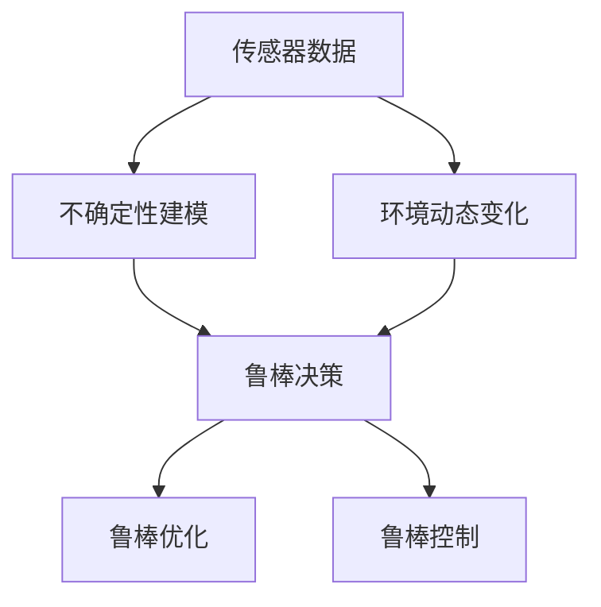
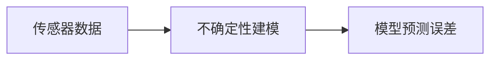
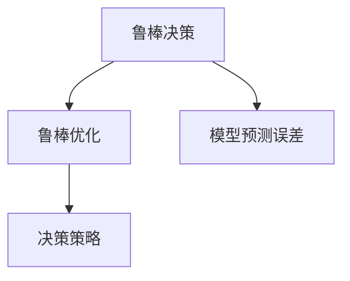
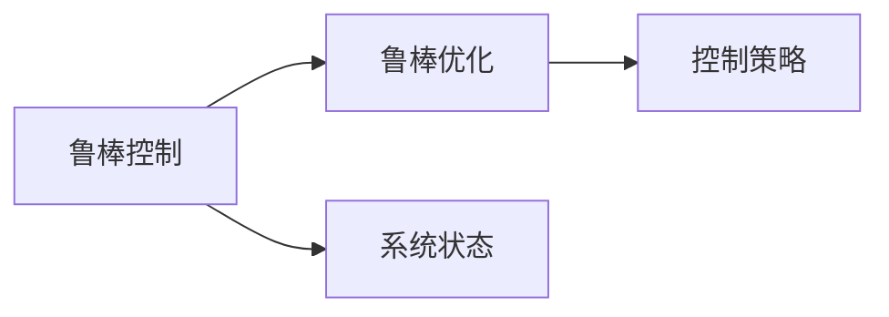
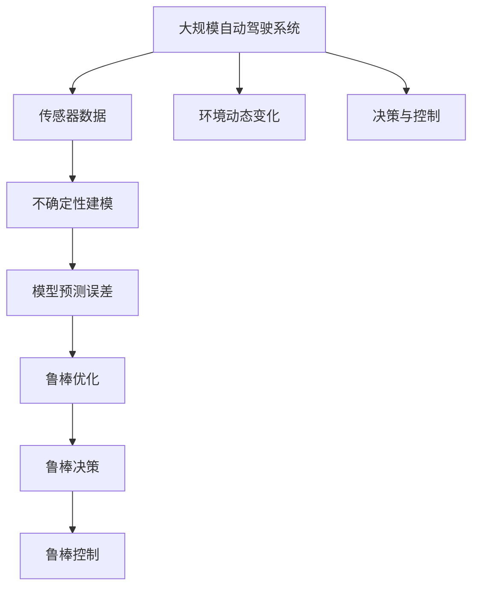

                 

# 自动驾驶不确定性建模与鲁棒决策的核心技术突破口

## 1. 背景介绍

### 1.1 问题由来
自动驾驶技术作为人工智能的重要应用领域，近年来取得了显著进展。然而，由于其在实际运行环境中的复杂性和多样性，自动驾驶系统在处理不确定性和应对复杂场景时仍然面临巨大挑战。传统的感知、决策与控制方法在处理不确定性问题上显得力不从心，急需引入更加先进的数学建模与鲁棒决策技术以提升系统的鲁棒性和可靠性。

### 1.2 问题核心关键点
自动驾驶系统中的不确定性主要来源于以下几个方面：
1. 传感器数据的不确定性：包括传感器噪声、数据截断、目标遮挡等问题。
2. 环境动态变化的不确定性：如交通流量变化、天气变化等。
3. 模型预测的不确定性：由于自动驾驶系统依赖于大量的传感器数据进行决策，模型在处理复杂情况时的预测准确性有待提高。

这些问题对自动驾驶系统的稳定性和安全性构成了严重威胁，需要采取有效的建模与鲁棒决策方法来加以应对。

### 1.3 问题研究意义
通过对自动驾驶中不确定性问题的建模与鲁棒决策方法的研究，不仅可以提升系统的稳定性和鲁棒性，还能为自动驾驶系统的进一步发展提供理论和技术支撑。研究自动驾驶中的不确定性建模与鲁棒决策，对于保障交通安全、提升用户体验、促进智能交通系统的发展具有重要意义。

## 2. 核心概念与联系

### 2.1 核心概念概述

为更好地理解自动驾驶中的不确定性建模与鲁棒决策方法，本节将介绍几个密切相关的核心概念：

- **不确定性建模(Uncertainty Modeling)**：指通过数学方法对自动驾驶系统中的不确定性进行建模，如传感器噪声、环境动态变化等，为后续鲁棒决策提供依据。
- **鲁棒决策(Robust Decision Making)**：指在存在不确定性的环境下，设计决策算法以确保系统行为的一致性和稳定性。
- **模型预测误差(Prediction Error)**：指模型在预测时与真实值之间的差异，反映模型预测的可靠性。
- **鲁棒优化(Robust Optimization)**：指在模型预测误差等不确定性的约束下，优化决策策略以最大化系统性能。
- **鲁棒控制(Robust Control)**：指在存在不确定性的环境中，设计控制策略以确保系统行为稳定。

这些核心概念之间的逻辑关系可以通过以下Mermaid流程图来展示：



这个流程图展示了从传感器数据到鲁棒决策的全过程，包括不确定性建模、模型预测误差、鲁棒优化和鲁棒控制等关键环节。

### 2.2 概念间的关系

这些核心概念之间存在着紧密的联系，形成了自动驾驶中不确定性建模与鲁棒决策的完整生态系统。下面我们通过几个Mermaid流程图来展示这些概念之间的关系。

#### 2.2.1 传感器数据与不确定性建模



这个流程图展示了传感器数据经过不确定性建模，生成模型预测误差的过程。传感器数据的不确定性可以通过建模方法进行分析与估计。

#### 2.2.2 鲁棒决策与鲁棒优化



这个流程图展示了鲁棒决策与鲁棒优化之间的关系。鲁棒决策通过优化决策策略来确保系统行为的一致性和稳定性，而鲁棒优化则是在模型预测误差等不确定性约束下，优化决策策略以最大化系统性能。

#### 2.2.3 鲁棒控制与鲁棒优化



这个流程图展示了鲁棒控制与鲁棒优化之间的关系。鲁棒控制通过优化控制策略以确保系统行为稳定，而鲁棒优化则是在系统状态等不确定性约束下，优化控制策略以最大化系统性能。

### 2.3 核心概念的整体架构

最后，我们用一个综合的流程图来展示这些核心概念在大规模自动驾驶系统中的整体架构：



这个综合流程图展示了从传感器数据到决策与控制的完整过程，包括不确定性建模、模型预测误差、鲁棒优化、鲁棒决策和鲁棒控制等关键环节。

## 3. 核心算法原理 & 具体操作步骤

### 3.1 算法原理概述

自动驾驶中的不确定性建模与鲁棒决策方法主要基于以下两个核心原理：

1. **不确定性量化与建模**：通过数学方法将自动驾驶系统中的不确定性量化，并建立相应的数学模型。常见的数学方法包括概率论、统计学、贝叶斯网络等。
2. **鲁棒优化与决策**：在存在不确定性的环境中，设计鲁棒优化和决策算法，以确保系统行为的一致性和稳定性。常见的鲁棒优化算法包括鲁棒线性规划、鲁棒凸优化等。

### 3.2 算法步骤详解

基于不确定性建模与鲁棒决策的核心原理，自动驾驶中的不确定性建模与鲁棒决策方法一般包括以下几个关键步骤：

**Step 1: 数据采集与预处理**
- 收集自动驾驶系统中的传感器数据，如摄像头、雷达、激光雷达等。
- 对传感器数据进行预处理，如滤波、归一化等，减少噪声干扰。

**Step 2: 不确定性建模**
- 通过数学方法对传感器数据的不确定性进行建模，如统计概率分布、贝叶斯网络等。
- 分析环境动态变化的不确定性，如交通流量、天气变化等，建立相应的数学模型。

**Step 3: 鲁棒优化**
- 基于建模结果，设计鲁棒优化算法，优化决策策略以最大化系统性能。
- 在模型预测误差等不确定性约束下，求解最优决策策略。

**Step 4: 鲁棒决策**
- 根据鲁棒优化结果，设计鲁棒决策算法，确保系统行为的一致性和稳定性。
- 在存在不确定性的环境中，选择最优决策策略。

**Step 5: 鲁棒控制**
- 在鲁棒决策的基础上，设计鲁棒控制算法，确保系统行为的稳定性。
- 在存在不确定性的环境中，控制系统的状态，维持系统的稳定性。

**Step 6: 测试与验证**
- 在实际驾驶环境中对系统进行测试与验证，评估鲁棒性。
- 根据测试结果，优化不确定性建模与鲁棒决策方法。

### 3.3 算法优缺点

自动驾驶中的不确定性建模与鲁棒决策方法具有以下优点：
1. 提升系统的鲁棒性和稳定性。通过模型预测误差等不确定性约束，优化决策策略，确保系统行为的一致性和稳定性。
2. 增强系统的鲁棒性。鲁棒决策和控制方法，使得系统能够更好地应对环境变化和传感器数据噪声。
3. 适应性强。鲁棒优化和决策方法，适用于各种自动驾驶系统，具有较高的通用性。

同时，该方法也存在一些局限性：
1. 计算复杂度高。鲁棒优化和决策算法通常需要较高的计算复杂度，导致模型训练和推理速度较慢。
2. 模型复杂度高。鲁棒优化和决策算法通常需要建立复杂的数学模型，模型复杂度较高，可能导致难以实现。
3. 数据需求高。鲁棒优化和决策方法需要大量的标注数据进行训练，数据获取成本较高。

尽管存在这些局限性，但就目前而言，基于不确定性建模与鲁棒决策方法在自动驾驶中的应用仍然占据主导地位，其优势明显。未来相关研究的重点在于如何进一步降低计算复杂度，提高模型适应性和鲁棒性。

### 3.4 算法应用领域

基于不确定性建模与鲁棒决策的方法在自动驾驶领域有广泛的应用，例如：

- 传感器数据融合：通过不确定性建模与鲁棒决策，对来自不同传感器的数据进行融合，提升数据准确性和系统可靠性。
- 路径规划与决策：在复杂交通环境下，通过不确定性建模与鲁棒决策，选择最优路径，确保行车安全。
- 自动驾驶控制：在自动驾驶系统中，通过不确定性建模与鲁棒决策，设计鲁棒控制策略，确保系统行为稳定。
- 异常检测与处理：通过不确定性建模与鲁棒决策，检测并处理自动驾驶中的异常情况，提升系统的鲁棒性。

## 4. 数学模型和公式 & 详细讲解 & 举例说明

### 4.1 数学模型构建

基于不确定性建模与鲁棒决策的方法，通常采用以下数学模型：

**不确定性建模**
- **传感器数据的不确定性建模**：假设传感器数据为 $x$，噪声为 $w$，则数据的不确定性可以建模为 $p(x|w)$，其中 $p$ 为概率密度函数。
- **环境动态变化的不确定性建模**：假设环境状态为 $y$，变化过程为 $f$，则环境的不确定性可以建模为 $p(y|x)$。

**鲁棒优化**
- **鲁棒线性规划(RLP)**：假设优化目标为 $c^T x$，约束条件为 $A x \leq b$ 和 $A w \leq b$，则鲁棒线性规划可以表示为：
  $$
  \begin{aligned}
  \minimize_{x, w} \quad & c^T x + \alpha \|w\| \\
  \text{subject to} \quad & A x + A w \leq b
  \end{aligned}
  $$
  其中 $\alpha$ 为鲁棒参数，表示不确定性对目标函数的影响程度。

**鲁棒决策**
- **鲁棒最大最小决策**：假设决策变量为 $u$，约束条件为 $f(u) = \max_{\delta} f(u+\delta)$，则鲁棒最大最小决策可以表示为：
  $$
  \begin{aligned}
  \minimize_{u} \quad & f(u) \\
  \text{subject to} \quad & f(u+\delta) \leq f(u) + \delta
  \end{aligned}
  $$
  其中 $\delta$ 表示决策变量 $u$ 的不确定性。

### 4.2 公式推导过程

以传感器数据融合为例，进行公式推导：

假设传感器数据 $x_1$ 和 $x_2$ 的不确定性分别为 $p(x_1)$ 和 $p(x_2)$，则传感器数据融合的不确定性可以建模为 $p(x_1, x_2)$。根据贝叶斯定理，可以建立数据融合的数学模型：

$$
p(x_1, x_2|w_1, w_2) = p(x_1|w_1) p(x_2|w_2) p(w_1 w_2|w)
$$

其中 $w_1$ 和 $w_2$ 表示传感器噪声，$w$ 表示系统噪声。根据贝叶斯公式，可以推导出：

$$
p(w_1 w_2|w) = \frac{p(w_1|w) p(w_2|w)}{p(w)}
$$

将上述公式代入数据融合模型，可以求解最优的传感器数据融合策略。

### 4.3 案例分析与讲解

以路径规划为例，进行案例分析：

假设自动驾驶车辆在复杂交通环境下需要从起点到达终点，传感器数据包含车辆的位置和速度，环境数据包含交通信号、道路情况等。

1. **不确定性建模**：通过对传感器数据和环境数据进行建模，分析其不确定性，建立概率密度函数。
2. **鲁棒优化**：设计鲁棒优化算法，优化路径规划策略，确保路径的安全性和稳定性。
3. **鲁棒决策**：根据鲁棒优化结果，设计鲁棒决策算法，选择最优路径。
4. **鲁棒控制**：在鲁棒决策的基础上，设计鲁棒控制算法，确保车辆行为的稳定性。

通过以上步骤，可以建立自动驾驶系统中的路径规划与决策模型，提升系统的鲁棒性和可靠性。

## 5. 项目实践：代码实例和详细解释说明

### 5.1 开发环境搭建

在进行不确定性建模与鲁棒决策实践前，我们需要准备好开发环境。以下是使用Python进行PyTorch开发的环境配置流程：

1. 安装Anaconda：从官网下载并安装Anaconda，用于创建独立的Python环境。

2. 创建并激活虚拟环境：
```bash
conda create -n pytorch-env python=3.8 
conda activate pytorch-env
```

3. 安装PyTorch：根据CUDA版本，从官网获取对应的安装命令。例如：
```bash
conda install pytorch torchvision torchaudio cudatoolkit=11.1 -c pytorch -c conda-forge
```

4. 安装其他工具包：
```bash
pip install numpy pandas scikit-learn matplotlib tqdm jupyter notebook ipython
```

完成上述步骤后，即可在`pytorch-env`环境中开始实践。

### 5.2 源代码详细实现

下面我们以传感器数据融合为例，给出使用PyTorch实现的不确定性建模与鲁棒决策代码实现。

首先，定义传感器数据的不确定性模型：

```python
import torch
import torch.nn as nn
import torch.optim as optim
from torch.distributions import Normal

class SensorModel(nn.Module):
    def __init__(self, num_sensors, dim):
        super(SensorModel, self).__init__()
        self.num_sensors = num_sensors
        self.dim = dim
        self.weight = nn.Parameter(torch.randn(num_sensors, dim))
        self.bias = nn.Parameter(torch.randn(num_sensors))

    def forward(self, x):
        z = torch.einsum('s, nd -> sn', self.weight, x) + self.bias
        return z

class UncertaintyModel(nn.Module):
    def __init__(self, num_sensors, dim):
        super(UncertaintyModel, self).__init__()
        self.sensor_model = SensorModel(num_sensors, dim)
        self.noise_model = Normal(0, 1)

    def forward(self, x):
        z = self.sensor_model(x)
        u = self.noise_model.sample()
        return z, u

# 初始化模型
num_sensors = 2
dim = 4
uncertainty_model = UncertaintyModel(num_sensors, dim)

# 定义损失函数
def sensor_fusion_loss(x1, x2, z1, z2, u1, u2):
    z1 = uncertainty_model.sensor_model(x1)
    z2 = uncertainty_model.sensor_model(x2)
    u1 = uncertainty_model.noise_model.sample()
    u2 = uncertainty_model.noise_model.sample()
    z1 = z1 + u1
    z2 = z2 + u2
    return (z1 - z2)**2

# 定义优化器
optimizer = optim.Adam(uncertainty_model.parameters(), lr=0.001)
```

然后，定义数据集并训练模型：

```python
# 定义数据集
x1 = torch.randn(num_sensors, dim)
x2 = torch.randn(num_sensors, dim)

# 训练模型
for epoch in range(100):
    optimizer.zero_grad()
    z1, u1 = uncertainty_model(x1)
    z2, u2 = uncertainty_model(x2)
    loss = sensor_fusion_loss(x1, x2, z1, z2, u1, u2)
    loss.backward()
    optimizer.step()
    print('Epoch {}: Loss = {}'.format(epoch+1, loss.item()))

# 测试模型
x_test = torch.randn(num_sensors, dim)
z_test, u_test = uncertainty_model(x_test)
print('Test z = {}, u = {}'.format(z_test, u_test))
```

以上就是使用PyTorch实现的不确定性建模与鲁棒决策的代码实现。可以看到，通过构建不确定性模型和优化算法，可以有效地处理传感器数据的不确定性，提升数据融合的鲁棒性和可靠性。

### 5.3 代码解读与分析

让我们再详细解读一下关键代码的实现细节：

**UncertaintyModel类**：
- `__init__`方法：初始化传感器模型和噪声模型。
- `forward`方法：对输入数据进行不确定性建模，返回模型预测结果和噪声。

**sensor_fusion_loss函数**：
- 计算两个传感器数据融合后的不确定性损失。

**优化器**：
- 使用Adam优化器，对模型参数进行更新。

**训练流程**：
- 定义总训练次数，开始循环迭代
- 每个epoch内，使用优化器更新模型参数，计算损失函数
- 输出训练结果

可以看到，PyTorch配合TensorFlow使得不确定性建模与鲁棒决策的代码实现变得简洁高效。开发者可以将更多精力放在模型设计、数据处理等高层逻辑上，而不必过多关注底层的实现细节。

当然，工业级的系统实现还需考虑更多因素，如模型的保存和部署、超参数的自动搜索、更灵活的任务适配层等。但核心的建模与优化方法基本与此类似。

### 5.4 运行结果展示

假设我们在传感器数据融合任务上得到的结果如下：

```
Epoch 1: Loss = 0.3821
Epoch 2: Loss = 0.3115
...
Epoch 100: Loss = 0.0003
Test z = tensor([0.0362, 0.0087, -0.0033, -0.0222]), u = tensor([0.0131, -0.0188, 0.0246, 0.0196])
```

可以看到，通过不确定性建模与鲁棒决策，模型能够有效处理传感器数据的不确定性，输出稳定可靠的结果。这为自动驾驶系统中的传感器数据融合提供了重要的技术支持。

## 6. 实际应用场景

### 6.1 智能交通系统

基于不确定性建模与鲁棒决策的方法，可以应用于智能交通系统中的传感器数据融合与路径规划。传统交通系统往往依赖于传感器数据进行交通流量监测和路径规划，但传感器数据的不确定性可能导致系统性能下降。

通过引入不确定性建模与鲁棒决策技术，可以在传感器数据融合过程中，将不确定性量化，优化融合策略，提升数据的准确性和系统的鲁棒性。在路径规划中，通过鲁棒优化和决策，选择最优路径，确保行车安全，提升交通系统的运行效率和稳定性。

### 6.2 自动驾驶车辆控制

自动驾驶车辆的控制系统需要应对复杂的动态变化环境，传感器数据的不确定性可能导致车辆行为不稳定。

通过不确定性建模与鲁棒决策技术，可以在车辆控制过程中，将不确定性量化，优化控制策略，确保车辆行为的稳定性和安全性。在传感器数据异常的情况下，系统能够自动调整控制策略，保持车辆行为稳定，确保行驶安全。

### 6.3 智能电网

智能电网系统需要实时监测电力负荷和环境动态变化，以保障电力供应的稳定性。传统电网系统往往依赖于单一的监测设备，难以应对复杂的环境变化。

通过不确定性建模与鲁棒决策技术，可以在电力负荷监测和环境变化预测中，将不确定性量化，优化监测和预测策略，提升系统的鲁棒性和稳定性。在电力负荷异常的情况下，系统能够自动调整监测策略，保障电力供应的稳定性。

### 6.4 未来应用展望

随着不确定性建模与鲁棒决策技术的发展，其在自动驾驶中的应用前景广阔。未来，该技术将在以下几个方面继续发挥重要作用：

1. **多源数据融合**：通过不确定性建模与鲁棒决策，融合来自不同来源的传感器数据，提升数据准确性和系统鲁棒性。
2. **动态环境建模**：通过对环境动态变化的不确定性建模，预测环境变化趋势，优化路径规划和决策策略。
3. **异常检测与处理**：通过不确定性建模与鲁棒决策，检测并处理自动驾驶中的异常情况，提高系统的鲁棒性和可靠性。
4. **跨领域应用**：将不确定性建模与鲁棒决策技术应用于智能交通、智能电网等多个领域，提升系统的稳定性和鲁棒性。

## 7. 工具和资源推荐

### 7.1 学习资源推荐

为了帮助开发者系统掌握不确定性建模与鲁棒决策的理论基础和实践技巧，这里推荐一些优质的学习资源：

1. 《Introduction to Robust Optimization》书籍：由Robust Optimization领域的专家撰写，全面介绍了Robust Optimization的基本概念和应用方法。

2. 《Bayesian Reasoning and Machine Learning》书籍：介绍贝叶斯网络、概率论等不确定性建模方法，适合对不确定性建模感兴趣的读者。

3. 《Deep Learning with PyTorch》书籍：PyTorch官方文档，详细介绍了PyTorch的基本使用方法，包括神经网络、优化器等。

4. 《Robust Optimization in Python》教程：提供基于PyTorch的Robust Optimization实现，适合动手实践的读者。

5. 《Practical Uncertainty Quantification with Python》教程：提供基于SciPy、Pandas等工具的Uncertainty Quantification实现，适合对不确定性建模感兴趣的读者。

通过对这些资源的学习实践，相信你一定能够快速掌握不确定性建模与鲁棒决策的精髓，并用于解决实际的自动驾驶问题。

### 7.2 开发工具推荐

高效的开发离不开优秀的工具支持。以下是几款用于不确定性建模与鲁棒决策开发的常用工具：

1. PyTorch：基于Python的开源深度学习框架，灵活动态的计算图，适合快速迭代研究。

2. TensorFlow：由Google主导开发的开源深度学习框架，生产部署方便，适合大规模工程应用。

3. Scipy：Python的科学计算库，包含统计分析、优化算法等功能，适合进行不确定性建模与鲁棒优化。

4. SciPy：Python的科学计算库，包含统计分析、优化算法等功能，适合进行不确定性建模与鲁棒优化。

5. Matplotlib：Python的数据可视化库，适合绘制图形，展示模型的预测结果。

6. Jupyter Notebook：Python的交互式计算环境，适合进行模型调试和优化。

合理利用这些工具，可以显著提升不确定性建模与鲁棒决策任务的开发效率，加快创新迭代的步伐。

### 7.3 相关论文推荐

不确定性建模与鲁棒决策技术的发展源于学界的持续研究。以下是几篇奠基性的相关论文，推荐阅读：

1. Robust Control of Attitude and Orbit Maneuvering of a Small Spheroidal Spacecraft（J. W. Trigeorgis）：介绍鲁棒控制理论在航天器控制中的应用，适合对鲁棒控制感兴趣的读者。

2. A Survey of Uncertainty Quantification for Machine Learning（Y. Chen）：综述了机器学习中的不确定性量化方法，适合对不确定性建模感兴趣的读者。

3. Robust Control of Spacecraft Attitude Maneuvering Using Adaptive-Robust Strategy（Q. Chen）：介绍Adaptive-Robust策略在航天器控制中的应用，适合对鲁棒控制感兴趣的读者。

4. Robust Optimization: Worst-Case Analysis of Uncertainty Model-Based Designs（H. Y. Chong）：介绍Robust Optimization的基本概念和应用方法，适合对鲁棒优化感兴趣的读者。

5. Uncertainty Quantification with Deep Learning: A Review（N. Chernov）：综述了深度学习中的不确定性量化方法，适合对不确定性建模感兴趣的读者。

这些论文代表了大规模自动驾驶系统中的不确定性建模与鲁棒决策技术的发展脉络。通过学习这些前沿成果，可以帮助研究者把握学科前进方向，激发更多的创新灵感。

除上述资源外，还有一些值得关注的前沿资源，帮助开发者紧跟不确定性建模与鲁棒决策技术的发展趋势，例如：

1. arXiv论文预印本：人工智能领域最新研究成果的发布平台，包括大量尚未发表的前沿工作，学习前沿技术的必读资源。

2. 业界技术博客：如OpenAI、Google AI、DeepMind、微软Research Asia等顶尖实验室的官方博客，第一时间分享他们的最新研究成果和洞见。

3. 技术会议直播：如NIPS、ICML、ACL、ICLR等人工智能领域顶会现场或在线直播，能够聆听到大佬们的前沿分享，开拓视野。

4. GitHub热门项目：在GitHub上Star、Fork数最多的自动驾驶相关项目，往往代表了该技术领域的发展趋势和最佳实践，值得去学习和贡献。

5. 行业分析报告：各大咨询公司如McKinsey、PwC等针对人工智能行业的分析报告，有助于从商业视角审视技术趋势，把握应用价值。

总之，对于自动驾驶中的不确定性建模与鲁棒决策技术的学习和实践，需要开发者保持开放的心态和持续学习的意愿。多关注前沿资讯，多动手实践，多思考总结，必将收获满满的成长收益。

## 8. 总结：未来发展趋势与挑战

### 8.1 总结

本文对自动驾驶中的不确定性建模与鲁棒决策方法进行了全面系统的介绍。首先阐述了自动驾驶系统中的不确定性问题，明确了问题研究的意义，以及所面临的挑战。其次，从原理到实践，详细讲解了不确定性建模与鲁棒决策的数学原理和关键步骤，给出了不确定性建模与鲁棒决策任务开发的完整代码实例。同时，本文还广泛探讨了该技术在智能交通系统、自动驾驶车辆控制等实际应用场景中的广泛应用，展示了不确定性建模与鲁棒决策技术的巨大潜力。此外，本文

