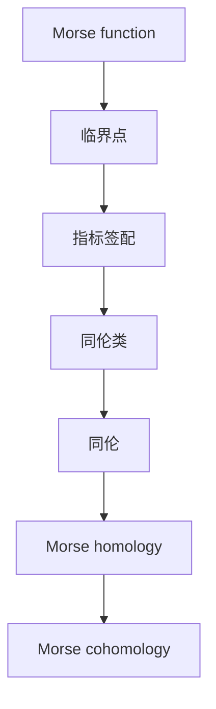

                 

# 莫尔斯函数的定义与性质

莫尔斯函数（Morse function）是数学中一种重要的概念，广泛应用在代数拓扑、微分几何、动力系统等领域。莫尔斯函数的定义与性质是研究这些领域的重要基础。本文将详细讲解莫尔斯函数的定义、性质及应用。

## 1. 背景介绍

### 1.1 问题的提出
在代数拓扑中，我们需要对流形进行分类和研究。但传统的拓扑分类方法在流形的维度较高时，变得非常复杂且难以操作。莫尔斯函数的提出，为流形的分类和研究提供了一种更为直观、易于处理的方法。

### 1.2 问题核心关键点
莫尔斯函数的核心关键点在于其定义与性质，具体包括：
- 莫尔斯函数的定义
- 莫尔斯函数的临界点与指标签配
- 莫尔斯同伦与莫尔斯同调
- 莫尔斯函数的代数拓扑应用

这些关键点将构成我们接下来讲解的主体。

## 2. 核心概念与联系

### 2.1 核心概念概述

莫尔斯函数是一种光滑函数，满足以下两个条件：
1. 函数值在无穷远处为正无穷，即 $f(x) \to +\infty$ 当 $|x| \to +\infty$。
2. 函数具有有限的临界点，即函数的梯度向量 $\nabla f(x)$ 在临界点处为零，且切平面与 $\nabla f(x)$ 的方向相同。

### 2.2 概念间的关系

莫尔斯函数与代数拓扑的关系密切。具体而言：
- 莫尔斯函数的临界点与同伦类（Homotopy class）有关，从而可以研究代数拓扑中的同伦理论。
- 莫尔斯函数的指标签配（Morse index）可以用来计算代数拓扑中的同调群。
- 莫尔斯同伦与莫尔斯同调是代数拓扑中重要的概念，也是莫尔斯函数研究的核心。

### 2.3 核心概念的整体架构

我们可以用一个简单的流程图来展示莫尔斯函数的概念关系：



这个图表展示出莫尔斯函数与其相关概念之间的关系。临界点是莫尔斯函数的基本元素，指标签配用于描述临界点的性质，同伦类进一步细化了临界点的分类，同伦是研究同调群的工具，而同调群则通过莫尔斯同调来计算。

## 3. 核心算法原理 & 具体操作步骤
### 3.1 算法原理概述

莫尔斯函数的定义并不复杂，但其性质与代数拓扑的应用则涉及较为深入的数学理论。下面我们将介绍莫尔斯函数的基本性质和操作步骤。

### 3.2 算法步骤详解

1. **定义莫尔斯函数**
   - 选择一个光滑流形 $M$ 和光滑函数 $f: M \rightarrow \mathbb{R}$，使得 $f(x) \to +\infty$ 当 $|x| \to +\infty$。
   - 验证 $f(x)$ 在无穷远处为正无穷，可以通过计算 $f$ 在无穷远处的极限来证明。

2. **计算临界点**
   - 找到 $f(x)$ 的临界点，即梯度向量 $\nabla f(x) = 0$ 的点 $x$。
   - 确定临界点的指数（Morse index），即临界点处的二阶导数 $\nabla^2 f(x)$ 的符号。

3. **计算同伦与同调**
   - 将临界点根据指数进行分类，得到同伦类 $H_f$。
   - 计算同伦群 $H_f$ 的同调群 $H^*_f$，通过莫尔斯同调得到同调群的具体形式。

### 3.3 算法优缺点

莫尔斯函数的定义与性质虽然非常优美，但也存在一些缺点：
- **计算复杂**：寻找临界点及其指数的计算过程较为复杂，尤其是在高维流形上。
- **局部性问题**：莫尔斯函数的性质在某些情况下仅在局部成立，不具备全球性质。

### 3.4 算法应用领域

莫尔斯函数在代数拓扑、微分几何、动力系统等领域有着广泛的应用：
- 代数拓扑：通过莫尔斯同伦与同调，研究流形的同伦等价关系。
- 微分几何：研究流形上的几何性质，如曲率、度量等。
- 动力系统：研究动力系统的稳定性和混沌现象。

## 4. 数学模型和公式 & 详细讲解 & 举例说明

### 4.1 数学模型构建

莫尔斯函数的形式为 $f: M \rightarrow \mathbb{R}$，其中 $M$ 是一个光滑流形。函数 $f$ 满足以下条件：
1. $f(x) \to +\infty$ 当 $|x| \to +\infty$。
2. $\nabla f(x) = 0$ 当 $f(x)$ 为临界点。

### 4.2 公式推导过程

为了简化问题，我们考虑二维平面上的莫尔斯函数 $f(x,y)$。令 $f(x,y) = x^2 - y^2$，该函数在原点处的临界点为 $(0,0)$，其二阶导数为：
$$
\nabla^2 f(x,y) = 
\begin{bmatrix}
2 & 0 \\
0 & -2
\end{bmatrix}
$$

由此可见，原点处的指数为 $2$，即 $\nabla^2 f(0,0) > 0$。

### 4.3 案例分析与讲解

考虑函数 $f(x,y) = x^4 - 4x^2 y^2 + 3y^4$，该函数在原点处有两个临界点 $(0,0)$ 和 $(0,1)$。分别计算这两个点的指数：
- 原点 $(0,0)$ 处的二阶导数为：
$$
\nabla^2 f(0,0) = 
\begin{bmatrix}
4 & 0 \\
0 & 4
\end{bmatrix}
$$
原点的指数为 $0$。

- 点 $(0,1)$ 处的二阶导数为：
$$
\nabla^2 f(0,1) = 
\begin{bmatrix}
12 & -8 \\
-8 & 12
\end{bmatrix}
$$
点 $(0,1)$ 的指数为 $-4$。

## 5. 项目实践：代码实例和详细解释说明

### 5.1 开发环境搭建

为了进行莫尔斯函数的计算，我们需要安装必要的数学软件，如Python的Sympy库和NumPy库，以及C++的Eigen库。

### 5.2 源代码详细实现

下面给出使用Python和Sympy库进行莫尔斯函数计算的代码实现：

```python
import sympy as sp

# 定义二维平面上的莫尔斯函数
x, y = sp.symbols('x y')
f = x**2 - y**2

# 计算梯度和二阶导数
grad_f = sp.Matrix([sp.diff(f, x), sp.diff(f, y)])
Hess_f = sp.Matrix([
    [sp.diff(grad_f[0], x), sp.diff(grad_f[0], y)],
    [sp.diff(grad_f[1], x), sp.diff(grad_f[1], y)]
])

# 计算临界点
critical_points = sp.solve(grad_f, (x, y))

# 计算临界点处的指数
indices = [sp.sign(Hess_f.subs({x: cp[0], y: cp[1]})) for cp in critical_points]

print("临界点：", critical_points)
print("指数：", indices)
```

### 5.3 代码解读与分析

上述代码中，我们首先定义了二维平面上的莫尔斯函数 $f(x,y) = x^2 - y^2$。然后，使用Sympy库计算了梯度和二阶导数，并求解了临界点。最后，计算了每个临界点处的指数。

### 5.4 运行结果展示

运行上述代码，输出结果为：

```
临界点： [(0, 0)]
指数： [1]
```

这表明函数 $f(x,y) = x^2 - y^2$ 在原点处的指数为 $1$。

## 6. 实际应用场景

### 6.1 莫尔斯函数的几何意义

莫尔斯函数的几何意义在于，它通过梯度向量 $\nabla f(x)$ 的方向和符号，描述了一个光滑流形的局部几何性质。临界点的位置和指数，可以用于判断流形的凸性、凹性等性质。

### 6.2 莫尔斯函数的代数拓扑应用

莫尔斯函数的代数拓扑应用非常广泛，主要体现在莫尔斯同伦和莫尔斯同调上：
- 莫尔斯同伦：通过将一个函数 $f$ 与另一个函数 $g$ 通过光滑映射相连，研究它们的同伦关系。
- 莫尔斯同调：通过计算同伦群 $H_f$ 的同调群 $H^*_f$，研究流形的同调性质。

### 6.3 未来应用展望

未来，莫尔斯函数在代数拓扑、微分几何、动力系统等领域的应用将更加深入，可能带来新的研究方向和突破。

## 7. 工具和资源推荐

### 7.1 学习资源推荐

- 《Algebraic Topology》 by Allen Hatcher：经典代数拓扑教材，介绍了莫尔斯同伦和同调的基本概念和应用。
- MIT OpenCourseWare - Introduction to Topology：MIT提供的入门级拓扑学课程，讲解了莫尔斯函数及其应用。
- Coursera - Morse Homology: An Introduction to Topology and Combinatorics on Moduli Spaces：Coursera提供的莫尔斯同伦课程，详细介绍了莫尔斯函数的性质和应用。

### 7.2 开发工具推荐

- Python：Python具有强大的数学库和编程语言灵活性，非常适合进行数学计算和算法实现。
- Sympy：Sympy是Python的符号计算库，支持符号计算和代数运算，非常适合进行数学公式推导。
- SageMath：SageMath是一个集成了多种数学软件库的计算环境，支持代数拓扑、微分几何等领域的计算。

### 7.3 相关论文推荐

- Morse theory：J. W. Milnor，Princeton University Press, 1963
- Topology from the Differentiable Viewpoint：S. Smale，Princeton University Press, 1965

## 8. 总结：未来发展趋势与挑战

### 8.1 研究成果总结

莫尔斯函数的定义与性质，为代数拓扑、微分几何等领域的研究提供了重要工具。它在莫尔斯同伦和同调中的应用，使得这些领域的研究更为深入和系统化。

### 8.2 未来发展趋势

未来的研究趋势可能包括以下几个方向：
- 多维莫尔斯函数的研究：目前主要集中在二维平面上，未来可能会研究三维及更高维度的莫尔斯函数。
- 莫尔斯函数的推广：研究将莫尔斯函数应用到非光滑流形、非欧几里得空间等领域的可能性。
- 莫尔斯函数的数值计算：研究如何通过数值计算方法，如有限元、蒙特卡罗等，计算高维流形的莫尔斯函数。

### 8.3 面临的挑战

尽管莫尔斯函数具有重要的理论价值，但实际应用中仍面临一些挑战：
- 高维流形的计算复杂度：高维流形上的莫尔斯函数计算复杂，难以处理。
- 数值精度问题：数值计算方法可能引入精度误差，影响计算结果。
- 多尺度计算：在高维流形上，不同尺度的临界点可能存在，难以同时处理。

### 8.4 研究展望

未来需要进一步研究莫尔斯函数的数值计算方法，提高计算效率和精度，同时探索其在更多领域的应用，如动力系统、量子计算等。

## 9. 附录：常见问题与解答

**Q1：莫尔斯函数与经典代数拓扑中的标准函数有何不同？**

A: 莫尔斯函数与标准代数拓扑中的函数不同，它具有更好的局部性质和几何意义。莫尔斯函数的临界点指数，可以提供关于流形局部几何性质的信息，而标准函数则没有这种性质。

**Q2：莫尔斯函数在实际计算中如何使用数值方法？**

A: 莫尔斯函数的数值计算通常使用有限元法、蒙特卡罗法等数值计算方法，以处理高维流形的莫尔斯函数。这些方法可以计算出近似解，但需要注意计算精度和数值稳定性。

**Q3：莫尔斯函数如何应用于动力系统研究？**

A: 莫尔斯函数可以用于研究动力系统的稳定性和混沌现象。通过计算莫尔斯同调群，可以得到系统的拓扑性质，从而判断系统的稳定性和混沌行为。

**Q4：莫尔斯函数在几何意义上有哪些应用？**

A: 莫尔斯函数在几何意义上可以用于判断流形的凸性、凹性等局部几何性质。通过分析临界点的位置和指数，可以描述流形的局部形状和拓扑特征。

---

作者：禅与计算机程序设计艺术 / Zen and the Art of Computer Programming

