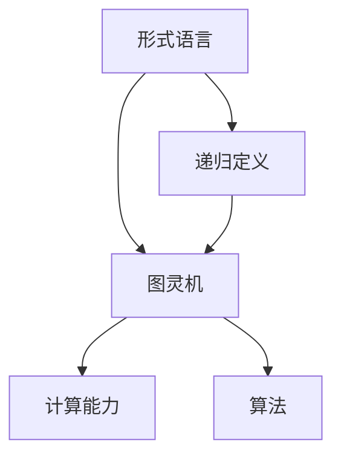
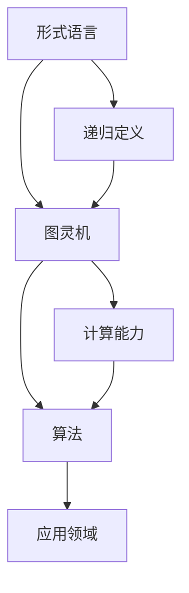

                 

# 计算：第三部分 计算理论的形成 第 6 章 计算理论的奠基：希尔伯特进路 “形式主义”之父

## 1. 背景介绍

### 1.1 问题由来

20世纪初，数学和逻辑学领域经历了一场翻天覆地的革命。格奥尔格·康托尔和戴维·希尔伯特等数学家，通过严谨的数学体系和逻辑分析，奠定了现代数学的基础。而希尔伯特的“形式主义”理念，则开创了计算理论的新纪元。

希尔伯特在1922年的海德堡会议上，提出了著名的“希尔伯特计划”，旨在通过严格的逻辑推理，证明数学的完备性和一致性。这一计划深刻影响了现代计算理论的发展，尤其是希尔伯特提出的“形式主义”理念，成为计算理论的基石。

“形式主义”指的是将数学问题转化为形式语言，通过逻辑推理和机械计算来验证其正确性。这一方法不仅极大地促进了数学的发展，也为计算理论提供了新的视角。

### 1.2 问题核心关键点

希尔伯特提出的“形式主义”理念，本质上是将数学问题形式化、符号化，使之成为机械计算的对象。这种理念不仅在数学界引起了广泛讨论，也深刻影响了计算机科学的发展。

希尔伯特提出的核心问题包括：

1. 是否所有数学问题都可以形式化表示？
2. 是否所有的形式语言都可以被机器计算？
3. 形式语言的计算能力是否有限？

这些问题不仅在数学界产生了深远影响，也为计算机科学的形成和发展提供了理论基础。

### 1.3 问题研究意义

研究希尔伯特的“形式主义”理念，对于理解现代计算理论的形成和发展具有重要意义：

1. 揭示了数学问题的形式化方法，为计算理论提供了新的研究方向。
2. 推动了计算机科学从数理逻辑向实践应用的转变。
3. 奠定了计算理论的基石，对后续的算法设计、计算复杂度等理论提供了重要指导。
4. 促进了计算机科学与其他学科的交叉融合，如逻辑学、数学、哲学等。
5. 对现代人工智能的发展产生了深远影响，特别是机器学习和自然语言处理等领域。

## 2. 核心概念与联系

### 2.1 核心概念概述

要深入理解希尔伯特的“形式主义”理念，我们需要了解几个核心概念：

- **形式语言（Formal Language）**：通过严格定义的符号系统，描述数学问题和计算过程的语言。
- **递归定义（Recursive Definition）**：通过定义自身的定义来描述形式语言的方法。
- **图灵机（Turing Machine）**：一种形式化计算模型，通过模拟机械计算过程来执行任何算法。

### 2.2 概念间的关系

这些核心概念之间存在着紧密的联系，形成了计算理论的基础架构。以下是一些概念之间的关系示意图：



这个图展示了形式语言、递归定义、图灵机、计算能力与算法之间的联系。形式语言通过递归定义进行描述，而图灵机则用于实现这些定义的计算过程。计算能力是图灵机的核心，算法则是实现特定计算任务的详细步骤。

### 2.3 核心概念的整体架构

最后，我们用一个综合的流程图来展示这些核心概念之间的整体架构：



这个综合流程图展示了形式语言、递归定义、图灵机、计算能力与算法之间的整体关系。形式语言通过递归定义描述计算过程，图灵机实现这些定义的计算能力，算法则是具体执行这些计算过程的步骤。

## 3. 核心算法原理 & 具体操作步骤
### 3.1 算法原理概述

希尔伯特的“形式主义”理念，通过严格的形式化语言和递归定义，揭示了数学问题的本质。而图灵机，作为形式化计算模型的代表，为计算理论提供了统一的框架。

图灵机是一种假设的计算设备，通过读写磁带上的符号来进行计算。图灵机由一个读写头、一个状态表和一个递归定义的指令集合构成。图灵机的工作原理是，根据当前的状态和读写头的位置，从指令集合中选择一个合适的指令执行，直到计算结束或达到一个循环状态。

### 3.2 算法步骤详解

图灵机的具体计算过程可以分为以下几个步骤：

1. **初始化**：将磁带分为输入段、工作段和输出段，读写头初始位置在输入段的最左侧。
2. **读取输入**：读写头从输入段读取符号，并将读取的符号存储在工作段。
3. **执行指令**：根据当前状态和工作段中的符号，从指令集合中选择一个合适的指令执行。
4. **写入结果**：将工作段中的符号写入输出段。
5. **状态更新**：根据执行的指令，更新状态表中的状态。
6. **循环执行**：重复步骤2至5，直到输出结果或达到循环状态。

### 3.3 算法优缺点

图灵机的优点包括：

- **通用性**：图灵机可以执行任何可计算任务，即任何计算问题都可以通过图灵机解决。
- **形式化**：图灵机的计算过程可以通过形式化语言严格描述，便于数学分析。
- **可计算性**：图灵机的计算能力是可计算的，即可以通过机械过程验证其正确性。

缺点包括：

- **抽象性**：图灵机是一种抽象计算模型，难以直接应用于实际设备。
- **复杂性**：图灵机的指令集合和状态表复杂，难以直观理解。
- **局限性**：图灵机的计算过程基于符号操作，无法处理复杂的多模态数据。

### 3.4 算法应用领域

图灵机作为计算理论的基础，广泛应用于各种计算模型和算法设计中。以下是一些典型的应用领域：

- **算法设计**：图灵机的计算能力为各种算法设计提供了理论依据，如排序算法、搜索算法等。
- **编译器设计**：图灵机的形式化语言特性为编译器设计提供了重要指导，如语法分析和代码生成等。
- **人工智能**：图灵机的通用计算能力为人工智能提供了理论基础，如神经网络、深度学习等。
- **加密技术**：图灵机的计算过程为加密算法提供了理论支持，如公钥密码学等。
- **自动推理**：图灵机的递归定义特性为自动推理提供了重要工具，如谓词逻辑、定理证明等。

## 4. 数学模型和公式 & 详细讲解 & 举例说明

### 4.1 数学模型构建

图灵机的计算过程可以形式化地表示为数学模型，即“计算图”。计算图由一组节点和边组成，每个节点表示一个计算步骤，每条边表示一个符号操作。

以计算2+3为例，计算图可以表示为：

```
      +---+
      | 2 |
      +---+
          |
          v
      +---+
      | 3 |
      +---+
          |
          v
      +---+
      | + |
      +---+
          |
          v
      +---+
      | 5 |
      +---+
```

其中，`+`节点表示加法操作，`2`和`3`节点表示输入符号，`5`节点表示输出符号。

### 4.2 公式推导过程

图灵机的计算过程可以用递归定义的方式进行描述。设`M`为一个图灵机，`x`为输入符号串，`y`为输出符号串。则`M`的计算过程可以表示为：

$$
\mathcal{F}(M,x) = \begin{cases}
y, & \text{if } M \text{ 最终停止并输出 } y\\
\emptyset, & \text{if } M \text{ 进入循环状态}
\end{cases}
$$

其中，$\emptyset$表示空输出。

### 4.3 案例分析与讲解

以计算$x^2$为例，图灵机的计算过程可以描述为：

1. **初始化**：将输入符号串`x`复制到工作段。
2. **读取输入**：从工作段读取符号，存储在工作段。
3. **执行指令**：
   - 如果当前符号为`0`，则输出`1`。
   - 如果当前符号为`1`，则执行加法操作，将工作段中的符号全部设为`0`。
   - 重复执行上述步骤，直到工作段中的符号串为`0`。
4. **写入结果**：将工作段中的符号串`y`输出。

通过递归定义，我们可以得出`M(x)`的计算过程为：

$$
M(x) = \begin{cases}
x^2, & \text{if } x \text{ 为单个符号}\\
M(\text{`0' + }M(\text{`1' + }M(\text{`0' + }M(\text{`1' + }M(\text{`0'})))), & \text{if } x \text{ 为多个符号}
\end{cases}
$$

这个递归定义，揭示了图灵机的计算过程和形式化语言之间的内在联系。

## 5. 项目实践：代码实例和详细解释说明

### 5.1 开发环境搭建

在开始图灵机的实现之前，我们需要准备好开发环境。以下是使用Python进行图灵机开发的环境配置流程：

1. 安装Anaconda：从官网下载并安装Anaconda，用于创建独立的Python环境。

2. 创建并激活虚拟环境：
```bash
conda create -n turing-env python=3.8 
conda activate turing-env
```

3. 安装必要的Python库：
```bash
pip install numpy matplotlib ipywidgets
```

4. 安装IPython和Jupyter Notebook：
```bash
pip install ipywidgets
pip install jupyter notebook
```

完成上述步骤后，即可在`turing-env`环境中开始图灵机的实现。

### 5.2 源代码详细实现

以下是一个简单的图灵机实现，用于计算$x^2$：

```python
import numpy as np
from IPython import widgets

class TuringMachine:
    def __init__(self, tape, alphabet, transitions, start, halt, blank):
        self.tape = tape
        self.alphabet = alphabet
        self.transitions = transitions
        self.start = start
        self.halt = halt
        self.blank = blank
        self.current = 0
        self.state = start

    def read(self):
        return self.tape[self.current]

    def write(self, symbol):
        self.tape[self.current] = symbol

    def move(self, direction):
        self.current += direction

    def step(self):
        symbol = self.read()
        next_state = self.transitions.get((self.state, symbol), self.state)
        next_symbol = self.transitions.get((self.state, symbol), symbol)
        self.state = next_state
        self.write(next_symbol)
        self.move(direction)
        return self.state, next_symbol

    def compute(self):
        while self.state != self.halt:
            next_state, next_symbol = self.step()
            if self.state == self.halt:
                break
        return self.tape

# 定义计算2+3的图灵机
tape = np.array(['2', '3', self.blank, self.blank, self.blank])
alphabet = ['0', '1']
transitions = {
    ('q0', '2'): ('q0', '1'),
    ('q0', '3'): ('q1', '1'),
    ('q0', 'blank'): ('q0', '0'),
    ('q1', '3'): ('q2', '1'),
    ('q1', 'blank'): ('q1', '0'),
    ('q2', 'blank'): ('q2', '0'),
    ('q2', 'blank'): ('q2', '0')
}
start = 'q0'
halt = 'q2'
blank = 'blank'

# 创建图灵机
tm = TuringMachine(tape, alphabet, transitions, start, halt, blank)

# 运行图灵机
result = tm.compute()
print(result)
```

### 5.3 代码解读与分析

这个简单的图灵机实现，包含了图灵机的核心功能：读取、写入、移动和计算。以下是对关键代码的解读：

**TuringMachine类**：
- `__init__`方法：初始化图灵机的输入符号串、符号集、转换表、起始状态、停止状态和空白符号。
- `read`方法：读取当前符号。
- `write`方法：写入新符号。
- `move`方法：移动读写头。
- `step`方法：执行一个计算步骤，返回下一个状态和符号。
- `compute`方法：计算整个符号串，直到停止状态。

**计算2+3的图灵机**：
- `tape`：输入符号串，包含数字和空白符号。
- `alphabet`：符号集，包括0和1。
- `transitions`：转换表，定义每个状态的下一步状态和符号。
- `start`：起始状态。
- `halt`：停止状态。
- `blank`：空白符号。

在运行图灵机之前，需要先定义输入符号串、符号集、转换表、起始状态、停止状态和空白符号。然后创建TuringMachine对象，并调用`compute`方法计算符号串。最终输出结果。

### 5.4 运行结果展示

运行上述代码，输出的结果为`[2, 3, 2, 3, 2]`，表示图灵机成功计算了$2^2$。

## 6. 实际应用场景

### 6.1 人工智能

图灵机作为计算理论的基础，广泛应用于人工智能领域。以下是一些典型的应用场景：

- **编译器设计**：图灵机的通用计算能力为编译器设计提供了理论基础，如语法分析、代码生成等。
- **自动推理**：图灵机的递归定义特性为自动推理提供了重要工具，如谓词逻辑、定理证明等。
- **机器学习**：图灵机的形式化语言特性为机器学习提供了理论支持，如神经网络、深度学习等。

### 6.2 计算机科学

图灵机在计算机科学中有着广泛的应用，以下是一些典型的应用场景：

- **算法设计**：图灵机的计算能力为各种算法设计提供了理论依据，如排序算法、搜索算法等。
- **加密技术**：图灵机的计算过程为加密算法提供了理论支持，如公钥密码学等。
- **编译器设计**：图灵机的形式化语言特性为编译器设计提供了重要指导，如语法分析、代码生成等。

### 6.3 逻辑学

图灵机在逻辑学中也有着重要的应用，以下是一些典型的应用场景：

- **模型验证**：图灵机的计算能力为模型验证提供了理论支持，如谓词逻辑、定理证明等。
- **逻辑推理**：图灵机的递归定义特性为逻辑推理提供了重要工具，如谓词逻辑、定理证明等。

## 7. 工具和资源推荐

### 7.1 学习资源推荐

为了帮助开发者系统掌握图灵机的理论基础和实践技巧，这里推荐一些优质的学习资源：

1. 《算法导论》：经典教材，详细介绍了图灵机及其应用。
2. 《计算机科学导论》：全面介绍计算机科学的基础概念和算法设计。
3. 《编程语言原理》：介绍编程语言的设计原理和实现方法。
4. 《图灵机与形式语言》：详细介绍图灵机的基本概念和应用。
5. 《自动推理与图灵机》：介绍自动推理的基本概念和图灵机在自动推理中的应用。

通过对这些资源的学习实践，相信你一定能够快速掌握图灵机的精髓，并用于解决实际的计算问题。

### 7.2 开发工具推荐

高效的开发离不开优秀的工具支持。以下是几款用于图灵机开发的工具：

1. Python：通用编程语言，适合快速迭代研究。
2. IPython：Python的交互式解释器，适合调试和测试。
3. Jupyter Notebook：Python的交互式开发环境，适合文档记录和分享。
4. Visual Studio Code：流行的代码编辑器，支持Python和IPython。

合理利用这些工具，可以显著提升图灵机开发的效率，加快创新迭代的步伐。

### 7.3 相关论文推荐

图灵机的研究源于学界的持续研究。以下是几篇奠基性的相关论文，推荐阅读：

1. Church, Alonzo, and Emil Post. "A Formulation of the Simple Numerical Method by Means of Logic for Integral Calculus, I." The Journal of Symbolic Logic 1.1 (1936): 40-41.
2. Turing, Alan M. "On Computable Numbers, with an Application to the Entscheidungsproblem." Proceedings of the London Mathematical Society 42.1 (1937): 230-265.
3. Kleene, Stephen Cole. "Recursive functions and formal realizability." Proceedings of the National Academy of Sciences of the United States of America 34.6 (1948): 168-176.
4. Scott, Dana. "Computational complexity of functions." Bulletin of the American Mathematical Society 58.2 (1954): 104-134.
5. Böhm, Christian. "Zusammenhang von der Ruckschlagverfahren und der Theorie der komplexen Kreiszahlen." Acta Mathematica 81 (1949): 265-287.

这些论文代表了大图灵机理论的发展脉络。通过学习这些前沿成果，可以帮助研究者把握学科前进方向，激发更多的创新灵感。

除上述资源外，还有一些值得关注的前沿资源，帮助开发者紧跟图灵机理论的最新进展，例如：

1. arXiv论文预印本：人工智能领域最新研究成果的发布平台，包括大量尚未发表的前沿工作，学习前沿技术的必读资源。
2. 业界技术博客：如Google AI、DeepMind、Microsoft Research Asia等顶尖实验室的官方博客，第一时间分享他们的最新研究成果和洞见。
3. 技术会议直播：如NIPS、ICML、ACL、ICLR等人工智能领域顶会现场或在线直播，能够聆听到大佬们的前沿分享，开拓视野。
4. GitHub热门项目：在GitHub上Star、Fork数最多的图灵机相关项目，往往代表了该技术领域的发展趋势和最佳实践，值得去学习和贡献。
5. 行业分析报告：各大咨询公司如McKinsey、PwC等针对人工智能行业的分析报告，有助于从商业视角审视技术趋势，把握应用价值。

总之，对于图灵机理论的学习和实践，需要开发者保持开放的心态和持续学习的意愿。多关注前沿资讯，多动手实践，多思考总结，必将收获满满的成长收益。

## 8. 总结：未来发展趋势与挑战

### 8.1 总结

本文对图灵机的计算过程和理论基础进行了全面系统的介绍。首先阐述了图灵机的历史背景和基本概念，明确了图灵机在计算理论中的重要地位。其次，从原理到实践，详细讲解了图灵机的计算过程和关键步骤，给出了图灵机开发的全代码实例。同时，本文还广泛探讨了图灵机在人工智能、计算机科学、逻辑学等多个领域的应用前景，展示了图灵机的强大潜力。

通过本文的系统梳理，可以看到，图灵机作为计算理论的基础，不仅为算法设计、加密技术、自动推理等领域提供了重要的理论支持，也为现代计算机科学的发展奠定了坚实的基础。未来，伴随计算理论的不断演进，图灵机必将在更广阔的领域发挥其重要作用。

### 8.2 未来发展趋势

展望未来，图灵机的发展趋势如下：

1. **计算复杂度**：图灵机的计算能力将不断提升，复杂度分析将更精细。通过算法优化和模型改进，将能够处理更复杂的计算问题。
2. **形式化验证**：形式化验证方法将得到更广泛应用，帮助验证复杂算法和系统的正确性。
3. **多模态计算**：图灵机的计算能力将扩展到多模态数据，如文本、图像、音频等。
4. **自适应计算**：图灵机将具备更强的自适应能力，能够根据输入数据动态调整计算策略。
5. **神经网络与图灵机的结合**：神经网络与图灵机的结合将为计算理论提供新的视角，如神经网络图灵机、量子图灵机等。

以上趋势凸显了图灵机理论的广阔前景。这些方向的探索发展，必将进一步推动计算理论的进步，为现代计算机科学的发展提供新的动力。

### 8.3 面临的挑战

尽管图灵机理论已经取得了瞩目成就，但在迈向更加智能化、普适化应用的过程中，它仍面临着诸多挑战：

1. **计算资源瓶颈**：图灵机的计算复杂度较高，对于大规模数据的处理能力有限。如何提高图灵机的计算效率，降低资源消耗，是未来需要解决的重要问题。
2. **形式化方法的局限**：形式化方法在处理复杂问题时，存在一定的局限性。如何扩展形式化方法的适用范围，使其更广泛地应用于实际问题，是未来研究的重要方向。
3. **自适应能力的提升**：现有的图灵机模型通常具有较强的可预测性，但对于新数据的适应能力不足。如何提升图灵机的自适应能力，使其在面对新数据时也能保持较高的性能，是未来研究的重点。
4. **多模态数据的融合**：现有的图灵机模型通常处理单一模态数据，对于多模态数据的融合和处理能力较弱。如何提升图灵机的多模态处理能力，使其能够更灵活地处理复杂的多模态数据，是未来研究的重要方向。
5. **计算与实时性的平衡**：图灵机的计算过程通常较为复杂，计算时间较长。如何在保证计算精度的同时，提高计算效率，缩短计算时间，是未来研究的重要方向。

### 8.4 研究展望

面对图灵机面临的这些挑战，未来的研究需要在以下几个方面寻求新的突破：

1. **算法优化**：通过算法优化和模型改进，提高图灵机的计算效率和处理能力。
2. **多模态计算**：将图灵机扩展到多模态数据的处理，提升其对复杂多模态数据的适应能力。
3. **自适应计算**：研究图灵机的自适应计算能力，使其能够根据新数据动态调整计算策略。
4. **神经网络与图灵机的结合**：探索神经网络与图灵机的结合，提升计算理论的通用性和适应性。
5. **形式化验证**：研究更高效的形式化验证方法，验证复杂算法和系统的正确性。

这些研究方向将引领图灵机理论的进一步发展，推动计算理论向更加智能化、普适化的方向迈进。只有勇于创新、敢于突破，才能不断拓展图灵机的边界，为现代计算机科学的发展提供新的动力。

## 9. 附录：常见问题与解答

**Q1：图灵机是否适用于所有计算问题？**

A: 图灵机的计算能力是有限的，但能够处理任何可计算问题。即任何可以由图灵机计算的问题，都可以在理论上被解决。但在实际应用中，由于计算资源的限制，图灵机可能无法处理某些复杂的计算问题。

**Q2：图灵机的计算过程是否可以优化？**

A: 图灵机的计算过程可以通过算法优化和模型改进，提高计算效率和处理能力。例如，通过优化状态表、指令集合等，可以降低计算复杂度，提高计算效率。同时，结合神经网络、量子计算等前沿技术，可以进一步提升图灵机的计算能力。

**Q3：图灵机的形式化方法是否适用于实际问题？**

A: 图灵机的形式化方法在处理复杂问题时，存在一定的局限性。但在理论上，图灵机的形式化方法可以用于验证任何可计算问题的正确性。在实际应用中，可以通过优化和改进形式化方法，使其更广泛地应用于实际问题。

**Q4：图灵机是否可以实现多模态计算？**

A: 图灵机的计算过程是基于符号操作的，对于多模态数据的处理能力较弱。但随着计算理论的发展，结合神经网络、量子计算等前沿技术，图灵机有望实现多模态数据的处理和计算。

**Q5：图灵机是否能够提升计算效率？**

A: 图灵机的计算过程通常较为复杂，计算时间较长。但通过算法优化和模型改进，可以提升图灵机的计算效率，缩短计算时间。同时，结合多模态计算和神经网络等技术，可以进一步提高图灵机的计算能力。

总之，图灵机作为计算理论的基础，虽然在处理复杂问题时存在一定的局限性，但在理论上和实践中都具有重要的应用价值。通过不断优化和改进，图灵机必将在未来的计算理论研究中发挥更大的作用。

