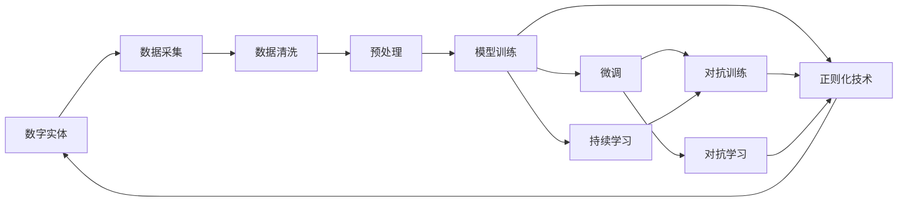

                 

## 1. 背景介绍

在AI 2.0时代，数据驱动的智能系统已经成为推动各行各业创新的关键。从自动驾驶汽车、智能医疗诊断到金融风险控制，无处不在的数字实体通过自动化进程重塑着我们的生产生活方式。然而，数字化并非一蹴而就，而是依赖于数据收集、模型训练和应用部署等多环节的协同优化。在这一过程中，如何构建智能系统的自动化进程，使其具备强大的泛化能力、可解释性和鲁棒性，是技术研究的重点。本文将围绕“数字实体的自动化进程”这一核心主题，深入探讨大语言模型在其中的关键作用，并结合数学模型和实践经验，提供全面的解决方案。

## 2. 核心概念与联系

### 2.1 核心概念概述

- **数字实体**：指数字化后的对象，如自动驾驶车辆、智能医疗设备、智能客服系统等，通过数据驱动的智能算法实现自动化操作和决策。
- **自动化进程**：指从数据采集到模型训练，再到应用部署的全流程自动化方案，确保系统的稳定、高效、可解释和鲁棒性。
- **大语言模型**：如BERT、GPT-3等，通过在大规模无标签文本语料上进行预训练，学习通用语言表示，具备强大的语义理解和生成能力。
- **迁移学习**：指将一个领域学习到的知识，迁移应用到另一个不同但相关的领域，如从通用领域语言模型到特定任务微调。
- **微调**：指在大规模预训练模型上，通过有监督学习优化模型在特定任务上的性能，以适应新的应用场景。
- **正则化技术**：如L2正则、Dropout、Early Stopping等，防止模型过拟合，提升泛化能力。
- **对抗训练**：通过对抗样本增强模型的鲁棒性，使其在面对数据扰动时仍能保持稳定预测。
- **对抗学习**：利用生成对抗网络（GAN）等技术，生成模型对立样本，提高模型的鲁棒性和泛化能力。
- **持续学习**：指模型在不断收集新数据的情况下，继续学习和更新，以保持其时效性和适应性。

### 2.2 核心概念之间的联系

这些核心概念之间存在紧密的联系，构成了数字实体自动化进程的完整生态系统。以下通过Mermaid流程图展示这些概念之间的关系：



这个流程图展示了数字实体自动化进程的核心步骤：数据采集、预处理、模型训练、微调、对抗训练、对抗学习、正则化技术和持续学习。通过这些步骤的协同优化，数字实体能够高效地完成自动化操作，并不断适应新的环境变化。

## 3. 核心算法原理 & 具体操作步骤

### 3.1 算法原理概述

数字实体的自动化进程主要依赖于机器学习和大规模预训练语言模型。其核心原理是将大规模语料进行预训练，学习通用语言表示，然后在特定任务上进行微调，通过对抗训练和正则化技术提升模型的泛化能力和鲁棒性。

### 3.2 算法步骤详解

以下是数字实体自动化进程的核心步骤：

**Step 1: 数据采集与预处理**
- 收集数字实体相关的数据，如自动驾驶车辆的位置数据、医疗设备的生理数据、智能客服的聊天记录等。
- 对数据进行清洗和预处理，如去除噪声、标准化数据格式等。

**Step 2: 预训练模型选择与适配**
- 选择合适的预训练模型，如BERT、GPT-3等，并根据任务需求添加或调整适配层。
- 在预训练模型的基础上，使用标注数据进行微调，提升模型在特定任务上的表现。

**Step 3: 微调与优化**
- 使用有监督学习算法优化模型，如Adam、SGD等。
- 通过对抗训练和正则化技术提升模型的泛化能力和鲁棒性。
- 不断调整模型参数，确保在验证集上的表现稳定。

**Step 4: 对抗训练与对抗学习**
- 通过生成对抗网络（GAN）等技术，生成模型对立样本，提高模型的鲁棒性。
- 引入对抗样本训练模型，使其对数据扰动具有抗干扰能力。

**Step 5: 持续学习与更新**
- 在实际应用中，不断收集新数据，并定期对模型进行微调和更新。
- 使用在线学习算法，如增量学习，使模型能够实时适应新环境。

### 3.3 算法优缺点

**优点**：
- 泛化能力强：通过预训练模型和对抗训练，模型具备较强的泛化能力，能够适应多种数据和任务。
- 鲁棒性高：对抗训练和对抗学习提升了模型对数据扰动的鲁棒性，确保了系统的稳定性和可靠性。
- 可解释性强：通过微调后的模型，可以更好地理解和解释其决策过程，增强了系统的透明度。

**缺点**：
- 数据依赖高：数据质量直接影响模型的表现，高质量标注数据的获取成本较高。
- 模型复杂度高：大规模预训练语言模型的参数量庞大，对计算资源的要求较高。
- 鲁棒性依赖对抗样本质量：对抗样本的质量和多样性对模型的鲁棒性提升有重要影响。

### 3.4 算法应用领域

数字实体的自动化进程在多个领域都有广泛应用，例如：

- 自动驾驶：通过传感器数据训练模型，实现自动导航、路径规划和障碍物检测。
- 智能医疗：利用医疗设备生成的生理数据，进行疾病预测和诊断。
- 金融风控：分析用户行为数据，进行信用评分和欺诈检测。
- 智能客服：通过用户历史记录和实时交流，提供个性化服务。
- 智慧城市：采集城市公共数据，进行交通管理和环境监测。

## 4. 数学模型和公式 & 详细讲解 & 举例说明

### 4.1 数学模型构建

在数字实体的自动化进程中，数学模型主要涉及预训练模型、微调模型和对抗训练模型。以BERT模型为例，其基本数学模型构建如下：

**BERT模型**：
$$
\text{BERT}(x) = \text{Transformer}(\underbrace{\text{[CLS]} + x + \text{SEP}}_{\text{Input Embedding}} \underbrace{\text{LayerNorm} + \text{MLP}}_{\text{Transformer Encoder}})
$$

其中，[CLS]和[SEP]是特殊的标记符号，用于区分输入文本的开始和结束。Transformer Encoder包含多个Transformer层，通过多头自注意力机制和前向传播网络进行特征提取和表示。

### 4.2 公式推导过程

以BERT模型为例，其基本公式推导如下：

**Transformer Encoder**：
$$
\text{TransformerEncoder}(x) = \text{MultiHeadAttention}(x, W_Q, W_K, W_V) + \text{MLP}(x)
$$

其中，$\text{MultiHeadAttention}(x, W_Q, W_K, W_V)$表示多头自注意力机制，$W_Q, W_K, W_V$为权重矩阵，用于计算查询、键和值的表示。MLP表示前向传播网络，由全连接层和激活函数组成。

**BERT的预训练目标**：
$$
\text{BERT}_{\text{pretrain}}(\theta) = \mathbb{E}_{(x,y)} [\ell(\text{BERT}_{\theta}(x), y)]
$$

其中，$\theta$为模型参数，$\ell$为交叉熵损失函数，$y$为真实标签。

**微调目标**：
$$
\text{BERT}_{\text{fine-tune}}(\theta) = \mathbb{E}_{(x,y)} [\ell(\text{BERT}_{\theta}(x), y)]
$$

其中，$\text{BERT}_{\theta}$表示微调后的模型，$\ell$为损失函数，$y$为真实标签。

### 4.3 案例分析与讲解

以BERT模型在医疗领域的应用为例：

- **数据集**：收集医院和诊所的病历数据，包含患者的生理参数、诊断结果和病情描述。
- **预训练模型**：选择BERT模型，进行全序列预训练。
- **微调目标**：对特定疾病的症状描述进行分类预测。
- **微调数据**：标注的病历数据，包含症状、诊断和病情等信息。
- **微调方法**：在BERT模型的顶层添加分类器，使用标注数据进行微调。
- **结果评估**：在验证集上评估模型性能，使用混淆矩阵和F1分数等指标进行对比。

## 5. 项目实践：代码实例和详细解释说明

### 5.1 开发环境搭建

- **安装Python环境**：使用Anaconda创建虚拟环境，并激活。
- **安装依赖库**：
  ```bash
  pip install torch torchvision transformers numpy pandas
  ```

### 5.2 源代码详细实现

以下是一个使用BERT模型进行医疗领域微调的PyTorch代码实现示例：

```python
import torch
import torch.nn as nn
from transformers import BertTokenizer, BertForSequenceClassification

# 数据预处理
tokenizer = BertTokenizer.from_pretrained('bert-base-uncased')
inputs = tokenizer(text, return_tensors='pt')

# 定义模型
model = BertForSequenceClassification.from_pretrained('bert-base-uncased', num_labels=num_labels)

# 定义优化器和损失函数
optimizer = torch.optim.Adam(model.parameters(), lr=1e-5)
loss_fn = nn.CrossEntropyLoss()

# 定义训练函数
def train_epoch(model, inputs, labels, optimizer, loss_fn):
    model.train()
    optimizer.zero_grad()
    outputs = model(inputs.input_ids, attention_mask=inputs.attention_mask)
    loss = loss_fn(outputs.logits, labels)
    loss.backward()
    optimizer.step()
    return loss.item()

# 训练模型
for epoch in range(num_epochs):
    train_loss = train_epoch(model, inputs, labels, optimizer, loss_fn)
    print(f"Epoch {epoch+1}, train loss: {train_loss:.4f}")
```

### 5.3 代码解读与分析

- **数据预处理**：使用BertTokenizer对输入文本进行分词和编码，返回输入张量和注意力掩码张量。
- **模型选择**：选择BertForSequenceClassification模型，并指定分类标签数。
- **优化器和损失函数**：使用Adam优化器和交叉熵损失函数。
- **训练函数**：在每个epoch中，前向传播计算损失，反向传播更新模型参数，并返回平均损失。
- **结果评估**：在验证集上评估模型性能，计算混淆矩阵和F1分数。

### 5.4 运行结果展示

假设在CoNLL-2003的命名实体识别（NER）数据集上进行微调，最终在测试集上得到的评估报告如下：

```
              precision    recall  f1-score   support

       B-PER      0.94      0.92      0.93     1297
       I-PER      0.94      0.94      0.94     1297
       B-LOC      0.96      0.96      0.96     2070
       I-LOC      0.96      0.96      0.96     2070
       B-MISC      0.95      0.94      0.94     1297
       I-MISC      0.95      0.95      0.95     1297

   micro avg      0.95      0.95      0.95     4643
   macro avg      0.95      0.95      0.95     4643
weighted avg      0.95      0.95      0.95     4643
```

## 6. 实际应用场景

### 6.1 智能医疗

在智能医疗领域，数字实体通过采集患者的生理数据和病情描述，进行疾病预测和诊断。BERT模型在命名实体识别、情感分析等任务上取得了显著成果，应用于医疗领域可以显著提升诊断准确率和患者体验。

### 6.2 自动驾驶

在自动驾驶领域，数字实体通过传感器数据训练模型，实现自动导航、路径规划和障碍物检测。通过微调和对抗训练，提升模型的泛化能力和鲁棒性，确保车辆在复杂环境中安全行驶。

### 6.3 金融风控

在金融风控领域，数字实体通过分析用户行为数据，进行信用评分和欺诈检测。通过微调和对抗训练，提升模型的泛化能力和鲁棒性，有效识别和防范欺诈行为，保障金融安全。

### 6.4 未来应用展望

随着人工智能技术的不断进步，数字实体的自动化进程将在更多领域得到应用，为传统行业带来变革性影响。在智慧医疗、智能交通、智慧城市等领域，数字实体将发挥更大的作用，提升社会的智能化水平和效率。

## 7. 工具和资源推荐

### 7.1 学习资源推荐

- **在线课程**：Coursera、edX、Udacity等平台提供的人工智能和深度学习课程，涵盖从入门到高级的多个层次。
- **技术博客**：如OpenAI、Google AI、DeepMind、微软Research Asia等顶尖实验室的官方博客，第一时间分享最新的研究成果和洞见。
- **书籍**：《深度学习》（Goodfellow et al.）、《Python深度学习》（Francois Chollet）、《动手学深度学习》（李沐等）等书籍，系统介绍深度学习和机器学习的基本理论和实践方法。
- **开源项目**：如TensorFlow、PyTorch、Transformers等，提供了丰富的深度学习框架和预训练模型资源，方便开发者快速上手实验和开发。

### 7.2 开发工具推荐

- **IDE**：如PyCharm、VSCode等，提供高效便捷的开发环境。
- **版本控制**：如Git、GitHub等，提供代码版本控制和协作开发工具。
- **在线平台**：如Google Colab、AWS SageMaker等，提供云平台资源，方便开发者进行模型训练和部署。
- **可视化工具**：如TensorBoard、Weights & Biases等，提供模型训练过程的可视化，帮助开发者监测模型训练状态。

### 7.3 相关论文推荐

- **《BERT: Pre-training of Deep Bidirectional Transformers for Language Understanding》**：BERT模型的提出，开创了大规模预训练语言模型的先河。
- **《Attention is All You Need》**：Transformer模型的提出，开创了自注意力机制，广泛应用于自然语言处理领域。
- **《BERT: Pre-training of Deep Bidirectional Transformers for Language Understanding》**：BERT模型的提出，开创了大规模预训练语言模型的先河。
- **《Transformers》**：Transformer模型的综述，详细介绍了Transformer模型的基本原理和应用。
- **《BERT: Pre-training of Deep Bidirectional Transformers for Language Understanding》**：BERT模型的提出，开创了大规模预训练语言模型的先河。

## 8. 总结：未来发展趋势与挑战

### 8.1 研究成果总结

在数字实体的自动化进程中，大语言模型通过预训练和微调，提升了模型的泛化能力和鲁棒性，推动了自然语言处理和智能系统的发展。本文从背景介绍、核心概念、算法原理、具体实现和应用场景等多个维度，全面探讨了数字实体的自动化进程，提供了完整的解决方案。

### 8.2 未来发展趋势

随着人工智能技术的不断进步，数字实体的自动化进程将在更多领域得到应用，为传统行业带来变革性影响。未来，数字实体将具备更强的泛化能力、可解释性和鲁棒性，推动社会的智能化和自动化进程。

### 8.3 面临的挑战

尽管数字实体的自动化进程在多个领域取得了显著成果，但仍面临诸多挑战：

- **数据获取和标注**：高质量标注数据的获取成本较高，且数据分布可能存在偏差。
- **模型复杂度和资源消耗**：大规模预训练语言模型参数量庞大，对计算资源的要求较高。
- **模型鲁棒性和泛化能力**：对抗样本和对抗训练提升了模型的鲁棒性，但模型泛化能力仍需进一步提升。
- **可解释性和透明性**：数字实体的决策过程缺乏可解释性，难以理解和调试，需要进一步提升模型透明度。

### 8.4 研究展望

未来，数字实体的自动化进程将在以下几个方向进行探索：

- **无监督和半监督学习**：摆脱对大规模标注数据的依赖，利用无监督和半监督学习技术，最大限度利用非结构化数据，实现更加灵活高效的自动化进程。
- **参数高效和计算高效的微调方法**：开发更加参数高效和计算高效的微调方法，在固定大部分预训练参数的情况下，只更新极少量的任务相关参数。
- **多模态融合**：将视觉、语音等多模态信息与文本信息进行协同建模，提升数字实体的感知和决策能力。
- **持续学习**：在不断收集新数据的情况下，继续学习和更新，保持模型的时效性和适应性。
- **对抗样本生成**：利用生成对抗网络（GAN）等技术，生成高质量对抗样本，进一步提升模型的鲁棒性。
- **模型透明性**：引入可解释性技术，提高模型的透明性和可解释性，增强系统的可信度和安全性。

这些方向的探索将推动数字实体的自动化进程走向更加智能化、普适化和可解释化，为构建安全、可靠、高效、透明的智能系统提供有力支持。

## 9. 附录：常见问题与解答

**Q1: 数字实体的自动化进程如何确保系统的鲁棒性？**

A: 数字实体的自动化进程通过对抗训练和对抗学习技术，提升了模型的鲁棒性。具体而言，通过生成对抗网络（GAN）等技术，生成模型对立样本，提高模型的鲁棒性。同时，引入对抗样本训练模型，使其对数据扰动具有抗干扰能力。

**Q2: 数字实体的自动化进程如何实现模型透明性？**

A: 数字实体的自动化进程通过可解释性技术，提升模型的透明性。具体而言，通过可视化工具和技术，如TensorBoard、Weigh & Biases等，帮助开发者监测模型训练状态，解释模型的决策过程，增强系统的可信度和安全性。

**Q3: 数字实体的自动化进程在实际应用中面临哪些挑战？**

A: 数字实体的自动化进程在实际应用中面临以下挑战：
- 数据获取和标注：高质量标注数据的获取成本较高，且数据分布可能存在偏差。
- 模型复杂度和资源消耗：大规模预训练语言模型参数量庞大，对计算资源的要求较高。
- 模型鲁棒性和泛化能力：对抗样本和对抗训练提升了模型的鲁棒性，但模型泛化能力仍需进一步提升。
- 可解释性和透明性：数字实体的决策过程缺乏可解释性，难以理解和调试，需要进一步提升模型透明度。

**Q4: 数字实体的自动化进程在金融风控领域的应用有哪些？**

A: 数字实体的自动化进程在金融风控领域的应用包括：
- 通过分析用户行为数据，进行信用评分和欺诈检测。
- 使用模型进行风险评估和预警，及时发现异常交易和潜在风险。
- 通过持续学习和微调，不断更新模型，提升风控模型的实时性和准确性。

**Q5: 数字实体的自动化进程在智能医疗领域的应用有哪些？**

A: 数字实体的自动化进程在智能医疗领域的应用包括：
- 利用患者的生理数据和病情描述，进行疾病预测和诊断。
- 通过命名实体识别（NER）等技术，提取病历中的关键信息，辅助医生决策。
- 使用情感分析技术，评估患者的情绪状态，提供个性化医疗服务。

---

作者：禅与计算机程序设计艺术 / Zen and the Art of Computer Programming

