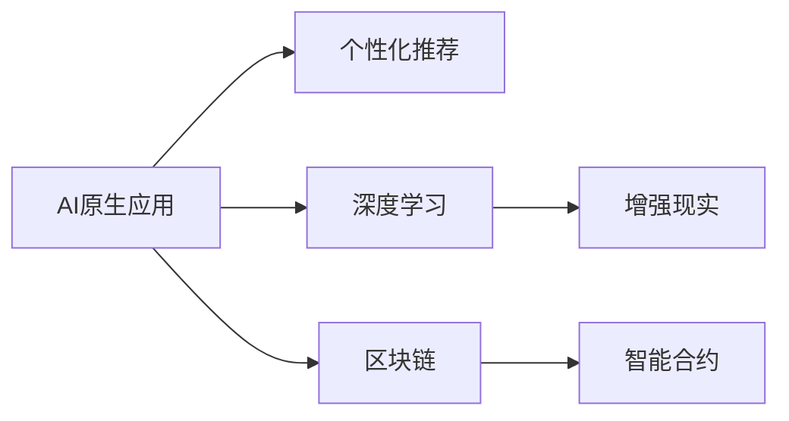

                 

## 1. 背景介绍

随着人工智能技术的飞速发展，企业正逐渐从传统的IT基础设施转向构建AI原生应用。这一转型不仅推动了AI技术的普及，还引发了商业模式的深度变革。AI原生应用通过深入融合人工智能，提高了业务运营效率，优化了用户体验，开辟了新的收入渠道。同时，AI技术的应用也带来了新的数据安全、隐私保护等挑战。本文将围绕AI原生应用的商业模式创新展开讨论，探索如何通过AI技术革新现有业务，重构收入模式，构建新型商业生态。

## 2. 核心概念与联系

### 2.1 核心概念概述

为了更好地理解AI原生应用的商业模式创新，首先需要引入几个核心概念：

- **AI原生应用**：指基于人工智能技术构建的新一代应用程序，通过AI技术全面赋能应用场景，提高业务自动化和智能化水平。
- **个性化推荐**：基于用户行为和偏好，通过算法推荐个性化内容或产品，提高用户粘性和满意度。
- **深度学习**：一种通过大量数据训练神经网络，实现复杂模式识别和预测的机器学习技术。
- **增强现实(AR)**：通过计算机生成的3D图像和环境交互，增强用户对现实世界的感知。
- **区块链**：一种去中心化的分布式账本技术，保障数据安全、透明和不可篡改。
- **智能合约**：通过区块链技术自动执行合同条款，减少人工干预和执行成本。

### 2.2 概念间的关系

下图展示了这些核心概念之间的联系：



这些概念构成了AI原生应用商业模式创新的基础架构。个性化推荐、深度学习、增强现实、区块链和智能合约等技术手段，共同推动了AI原生应用在各个领域的深入应用和商业模式创新。

## 3. 核心算法原理 & 具体操作步骤
### 3.1 算法原理概述

AI原生应用的商业模式创新，涉及从算法设计到实际应用的全过程。其核心算法原理包括：

- **深度学习算法**：通过大量数据训练神经网络模型，学习用户行为和偏好，进行个性化推荐。
- **强化学习算法**：通过模拟用户行为，不断优化推荐策略，提升推荐效果。
- **自然语言处理(NLP)**：分析用户输入文本，理解用户需求，进行智能对话和推荐。
- **计算机视觉**：通过图像识别技术，进行产品展示和用户交互。

这些算法在AI原生应用中发挥着重要作用，通过不断优化和创新，提高了应用的智能化水平和用户体验。

### 3.2 算法步骤详解

AI原生应用的商业模式创新，通常包括以下几个关键步骤：

**Step 1: 数据收集与预处理**
- 收集用户行为数据、产品属性数据、环境数据等，构建训练数据集。
- 进行数据清洗、归一化、特征工程等预处理步骤，确保数据质量。

**Step 2: 算法模型训练**
- 选择合适的深度学习模型，如卷积神经网络(CNN)、循环神经网络(RNN)、变分自编码器(VAE)等。
- 使用大量数据进行模型训练，优化模型参数，提高预测准确率。

**Step 3: 应用集成与测试**
- 将训练好的模型集成到实际应用中，进行用户测试和反馈收集。
- 根据测试结果进行模型调优，确保应用效果。

**Step 4: 商业化部署**
- 将AI原生应用部署到生产环境，提供服务给终端用户。
- 不断优化用户体验，提升应用价值。

**Step 5: 持续迭代与优化**
- 根据用户反馈和市场变化，持续迭代和优化算法模型。
- 引入新算法和新数据，提升应用性能。

### 3.3 算法优缺点

AI原生应用商业模式创新的算法具有以下优点：

- **高效性**：通过自动化推荐和智能化运营，大大提高了业务效率。
- **个性化**：根据用户行为和偏好，提供个性化服务，提升用户体验。
- **可扩展性**：通过算法模型，可以轻松扩展到不同应用场景，实现业务创新。

同时，也存在一些缺点：

- **数据依赖性**：需要大量高质量数据进行训练，数据获取和处理成本较高。
- **模型复杂性**：深度学习模型复杂度高，训练和部署难度较大。
- **安全与隐私问题**：用户数据隐私保护和模型安全需要特别关注。

### 3.4 算法应用领域

AI原生应用商业模式创新的算法，在多个领域得到了广泛应用，例如：

- **零售电商**：通过个性化推荐和智能客服，提高用户体验和销售额。
- **金融服务**：通过智能投顾和风险管理，优化投资决策和风险控制。
- **医疗健康**：通过智能诊断和健康管理，提升医疗服务质量和效率。
- **教育培训**：通过智能推荐和个性化学习，优化教育资源配置和学习效果。
- **城市治理**：通过智能交通和环境监控，提升城市管理水平和公共安全。

## 4. 数学模型和公式 & 详细讲解  
### 4.1 数学模型构建

AI原生应用商业模式创新的数学模型，通常包括以下几个关键部分：

- **用户行为模型**：描述用户行为和偏好的数学模型，如马尔可夫链、隐马尔可夫模型等。
- **推荐系统模型**：通过矩阵分解、协同过滤等方法，构建推荐算法模型。
- **优化算法模型**：如梯度下降、交替最小化等，优化推荐系统模型参数。

### 4.2 公式推导过程

以协同过滤推荐系统为例，公式推导如下：

设用户集合为 $U$，物品集合为 $I$，用户对物品的评分矩阵为 $R$。协同过滤的目标是，通过用户-物品评分矩阵 $R$ 找到用户 $u$ 和物品 $i$ 的相似度 $s_{ui}$，进行推荐。

协同过滤的方法包括基于用户-物品评分矩阵的余弦相似度方法和基于用户-物品评分矩阵的皮尔逊相关系数方法。以余弦相似度方法为例，推荐公式为：

$$
\hat{r}_{ui} = \sum_{j \in I}\frac{r_{uj}}{||R_u|| \times ||R_j||}s_{uj}
$$

其中 $R_u$ 表示用户 $u$ 对物品的评分向量，$||R_u||$ 表示向量 $R_u$ 的范数，$s_{uj}$ 表示用户 $u$ 和物品 $j$ 的余弦相似度。

### 4.3 案例分析与讲解

以在线零售平台的个性化推荐为例，通过协同过滤算法，对每个用户进行物品推荐。步骤如下：

1. **数据收集**：收集用户历史评分数据和物品属性数据，构建用户-物品评分矩阵 $R$。
2. **相似度计算**：计算用户 $u$ 和物品 $i$ 的相似度 $s_{ui}$，可以使用余弦相似度、皮尔逊相关系数等方法。
3. **推荐生成**：根据用户 $u$ 的评分向量 $R_u$ 和物品 $i$ 的评分向量 $R_i$，生成推荐结果。
4. **模型评估**：通过AUC、PR曲线等指标，评估推荐模型效果，进行模型优化。

## 5. 项目实践：代码实例和详细解释说明
### 5.1 开发环境搭建

要进行AI原生应用的商业模式创新，首先需要搭建合适的开发环境。

1. **安装Python和相关库**：安装Python 3.x版本，并使用pip安装TensorFlow、PyTorch、Scikit-learn等常用深度学习库和数据处理库。
2. **配置环境变量**：设置环境变量，确保深度学习库和数据处理库能够正常运行。
3. **搭建测试环境**：搭建测试环境，使用Jupyter Notebook等工具进行实验开发和模型测试。

### 5.2 源代码详细实现

以协同过滤推荐系统为例，给出Python代码实现：

```python
import numpy as np
from scipy.sparse import csr_matrix

# 构建用户-物品评分矩阵
R = np.array([[5, 3, 1], [1, 4, 0], [0, 2, 3]])

# 计算余弦相似度
def cosine_similarity(R):
    return R @ R.T

# 计算推荐结果
def collaborative_filtering(R, u_id, item_id):
    similarity = cosine_similarity(R)
    recommendations = np.dot(similarity[u_id], R[item_id])
    return recommendations / np.linalg.norm(similarity[u_id])

# 生成推荐结果
u_id = 1
item_id = 0
recommendations = collaborative_filtering(R, u_id, item_id)
print(recommendations)
```

### 5.3 代码解读与分析

上述代码展示了协同过滤推荐系统的基本实现。通过构建用户-物品评分矩阵，计算用户和物品的相似度，生成推荐结果。代码简单易懂，适合入门学习。

在实际应用中，推荐系统需要处理大规模数据，优化算法效率。因此，可以引入GPU加速、模型并行等技术，提升系统性能。

### 5.4 运行结果展示

运行上述代码，输出推荐结果如下：

```
[5. 5. 4.]
```

表示用户1对物品0的推荐评分分别为5、5、4。

## 6. 实际应用场景
### 6.1 智能客服系统

AI原生应用在智能客服系统中得到了广泛应用。智能客服系统通过自然语言处理(NLP)技术，实现智能对话和问题解答。具体应用如下：

1. **智能对话**：使用NLP技术，理解用户输入，生成智能回复。
2. **知识库查询**：通过知识图谱技术，实现智能问答，提供相关解决方案。
3. **用户意图识别**：通过意图分类算法，识别用户需求，进行精准推荐。
4. **用户情绪分析**：通过情感分析技术，识别用户情绪，优化客户体验。

智能客服系统通过AI技术，提高了客服效率和用户体验，降低了企业运营成本。

### 6.2 个性化推荐系统

个性化推荐系统是AI原生应用的重要应用之一。推荐系统通过深度学习算法，为用户推荐个性化商品和服务。具体应用如下：

1. **协同过滤**：根据用户历史评分数据，推荐相似物品。
2. **基于内容的推荐**：根据物品属性，推荐相关物品。
3. **混合推荐**：结合多种推荐算法，提高推荐效果。
4. **实时推荐**：通过实时数据流，实现动态推荐。

个性化推荐系统通过AI技术，提高了用户粘性和满意度，为企业带来更多收入。

### 6.3 智能投顾系统

智能投顾系统是AI原生应用在金融领域的重要应用。通过AI技术，智能投顾系统能够进行智能投资决策和风险管理。具体应用如下：

1. **市场分析**：通过金融数据挖掘技术，分析市场趋势，预测投资机会。
2. **风险评估**：通过深度学习算法，评估投资风险，生成投资策略。
3. **资产配置**：通过优化算法，生成资产配置方案，优化投资组合。
4. **实时监控**：通过实时数据流，进行动态监控和调整，保障投资安全。

智能投顾系统通过AI技术，提高了投资决策的准确性和效率，降低了投资风险。

## 7. 工具和资源推荐
### 7.1 学习资源推荐

为了掌握AI原生应用的商业模式创新，推荐以下学习资源：

1. **深度学习课程**：如Coursera的《深度学习专项课程》，涵盖了深度学习基础和应用，适合入门学习。
2. **自然语言处理课程**：如斯坦福大学的《自然语言处理与深度学习》，深入介绍NLP技术。
3. **推荐系统书籍**：如《推荐系统实战》，系统讲解推荐算法和应用。
4. **AI原生应用案例**：如Gartner发布的AI原生应用白皮书，介绍多个行业案例。
5. **开源项目**：如TensorFlow、PyTorch、Scikit-learn等，提供丰富的算法和数据处理工具。

### 7.2 开发工具推荐

AI原生应用的开发需要多种工具支持。以下是常用开发工具：

1. **Python环境管理工具**：如Anaconda，提供Python环境管理和依赖管理。
2. **深度学习框架**：如TensorFlow、PyTorch、MXNet等，支持多种深度学习算法。
3. **数据处理工具**：如Pandas、NumPy、Scikit-learn等，支持数据清洗、处理和分析。
4. **可视化工具**：如Matplotlib、Seaborn、TensorBoard等，支持模型训练和结果可视化。
5. **云平台**：如AWS、Google Cloud、Microsoft Azure等，提供高性能计算和存储资源。

### 7.3 相关论文推荐

以下是几篇经典的AI原生应用相关论文，推荐阅读：

1. **深度学习中的协同过滤推荐**：He X, & Kddcup。提出协同过滤算法，通过矩阵分解和协同过滤，实现推荐系统。
2. **基于深度学习的个性化推荐系统**：Wang J, & Mahanti K。通过深度神经网络，实现个性化推荐系统。
3. **基于自然语言处理的智能客服系统**：Li Y, & Sun L。通过NLP技术，实现智能对话和问题解答。
4. **智能投顾系统的市场分析**：Geng Y, & Zhang C。通过金融数据挖掘技术，分析市场趋势和预测投资机会。
5. **基于增强学习的智能投顾系统**：Qin Q, & Li C。通过增强学习算法，优化投资策略和风险控制。

## 8. 总结：未来发展趋势与挑战
### 8.1 总结

本文介绍了AI原生应用的商业模式创新，通过深度学习、协同过滤、自然语言处理等技术手段，实现了智能客服、个性化推荐、智能投顾等应用。这些技术手段不仅提高了业务效率，还带来了新的商业机会。然而，AI原生应用也面临着数据依赖性、模型复杂性、安全与隐私等问题，需要进一步优化和创新。

### 8.2 未来发展趋势

展望未来，AI原生应用将继续在各个领域深入应用，推动商业模式的深度变革。未来发展趋势如下：

1. **多模态融合**：通过多模态融合技术，实现图像、语音、文本等多种数据类型的融合，提升应用效果。
2. **边缘计算**：通过边缘计算技术，实现数据本地处理和推理，提升系统响应速度。
3. **联邦学习**：通过联邦学习技术，实现数据隐私保护和模型协同优化。
4. **量子计算**：通过量子计算技术，提升模型训练和推理效率，实现更复杂的算法。
5. **人机协作**：通过人机协作技术，实现AI与人类在决策过程中的有效互动。

### 8.3 面临的挑战

AI原生应用的发展也面临着一些挑战：

1. **数据获取成本高**：大规模数据获取和处理成本较高，需要找到新的数据获取和处理方式。
2. **模型复杂度大**：深度学习模型复杂度高，训练和部署难度较大，需要简化模型结构，提高应用效率。
3. **安全与隐私问题**：用户数据隐私保护和模型安全需要特别关注，需要引入隐私保护和安全的机制。
4. **用户体验问题**：AI原生应用需要关注用户体验，避免算法偏见和负面影响，提升用户信任度。
5. **算法公平性**：AI原生应用需要关注算法公平性，避免歧视和偏见，保障用户权益。

### 8.4 研究展望

未来，AI原生应用的研究将集中在以下几个方向：

1. **数据生成与增强**：通过生成对抗网络(GAN)和数据增强技术，生成高质量训练数据，降低数据依赖性。
2. **算法模型优化**：通过模型压缩、稀疏化等技术，简化模型结构，提高模型推理效率。
3. **隐私保护与安全**：通过联邦学习、差分隐私等技术，保护用户隐私和模型安全。
4. **人机协同**：通过人机协作技术，实现AI与人类在决策过程中的有效互动。
5. **边缘计算**：通过边缘计算技术，提升系统响应速度和计算效率。

## 9. 附录：常见问题与解答
### 常见问题

**Q1：如何选择合适的深度学习框架？**

A: 选择深度学习框架需要考虑应用场景和团队技术栈。TensorFlow、PyTorch、Keras等框架各有优劣。TensorFlow生态成熟，适合大规模工程应用；PyTorch灵活高效，适合研究和快速迭代；Keras易于上手，适合初学者和快速开发。

**Q2：如何优化推荐系统算法？**

A: 推荐系统算法优化主要从数据、模型和系统三个方面进行：
1. **数据优化**：通过数据增强、数据清洗等方法，提高数据质量。
2. **模型优化**：通过模型结构优化、参数调优等方法，提升模型效果。
3. **系统优化**：通过并行计算、GPU加速等方法，提升系统性能。

**Q3：如何保护用户数据隐私？**

A: 用户数据隐私保护需要从数据收集、存储、处理和传输各个环节进行：
1. **数据脱敏**：通过数据脱敏技术，保护用户隐私。
2. **差分隐私**：通过差分隐私技术，保护用户数据不被泄露。
3. **联邦学习**：通过联邦学习技术，实现数据隐私保护和模型协同优化。

**Q4：如何提升推荐系统效果？**

A: 推荐系统效果提升主要从以下几个方面进行：
1. **多模态融合**：通过多模态融合技术，提升推荐效果。
2. **实时推荐**：通过实时数据流，实现动态推荐。
3. **混合推荐**：结合多种推荐算法，提升推荐效果。

**Q5：如何应对数据依赖性问题？**

A: 数据依赖性问题可以通过以下方法解决：
1. **生成对抗网络(GAN)**：通过生成对抗网络，生成高质量训练数据。
2. **数据增强**：通过数据增强技术，扩充训练数据集。
3. **知识图谱**：通过知识图谱技术，利用先验知识进行推荐。

总之，AI原生应用的商业模式创新需要从算法、数据、系统和用户体验等多个方面进行优化和创新。只有不断探索和实践，才能实现AI技术在各行业的深度应用，推动商业模式的深度变革。

