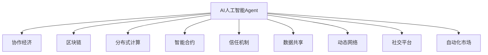
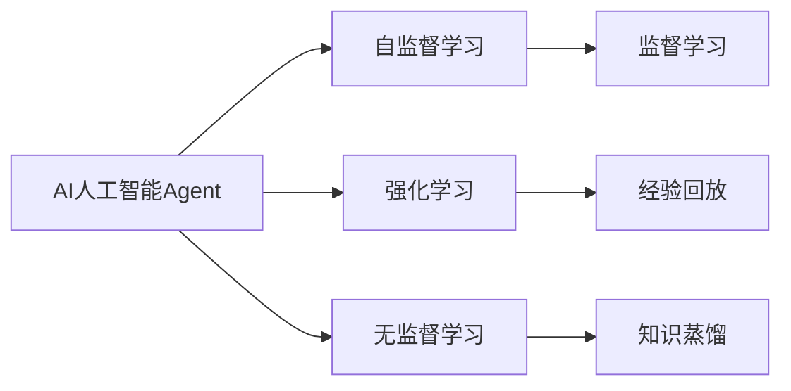
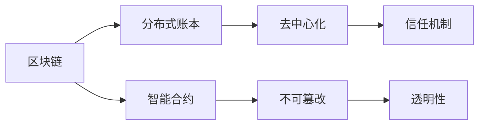
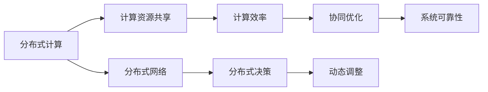
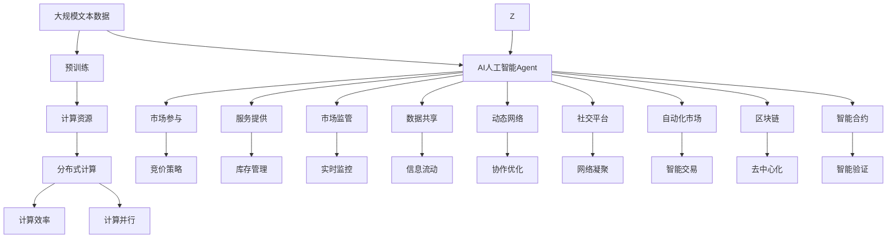

                 

# AI人工智能 Agent：在分享经济中的应用

> 关键词：人工智能Agent, 分享经济, 协作经济, 区块链, 分布式计算, 智能合约, 信任机制, 数据共享, 动态网络, 社交平台, 自动化市场

## 1. 背景介绍

### 1.1 问题由来
分享经济（Sharing Economy），一种基于共享资源、协作平台的新型经济模式，近年来在交通、住宿、教育、医疗等多个领域蓬勃发展。相较于传统的集中式、垄断式经济体系，分享经济以其去中心化、开放性、低成本等优势，引起了广泛关注。

然而，分享经济也面临诸多挑战，如平台治理、信任机制、价格公平性、数据隐私等。这些问题的解决，亟需引入先进的技术手段，其中包括AI人工智能Agent。

### 1.2 问题核心关键点
AI人工智能Agent，即基于人工智能的智能代理，通过学习与演化，能够在复杂的、不确定的、动态的网络中，自主地执行任务、维护信任、调整策略，进而优化资源配置、提升交易效率、确保数据安全。

在分享经济中，AI人工智能Agent能够扮演多种角色：

- **市场参与者**：参与市场竞价，通过智能策略，获取最优价格。
- **服务提供者**：自动管理库存，推荐匹配服务需求。
- **监管者**：实时监控市场动态，预防欺诈行为。

AI人工智能Agent的核心优势在于：

- **自主学习**：能够自我优化，无需人为干预。
- **智能决策**：具备判断、推理、预测能力，提升决策效率。
- **动态调整**：能够根据市场变化动态调整策略。
- **协同合作**：通过多Agent协作，解决复杂问题。

本文聚焦于AI人工智能Agent在分享经济中的应用，将从AI核心概念入手，深入分析其算法原理与操作步骤，以期对分享经济中的AI技术应用提供更全面的指导。

## 2. 核心概念与联系

### 2.1 核心概念概述

为更好地理解AI人工智能Agent在分享经济中的应用，本节将介绍几个密切相关的核心概念：

- **AI人工智能Agent**：基于人工智能的智能代理，通过学习与演化，能够自主执行任务、维护信任、调整策略，优化资源配置、提升交易效率、确保数据安全。

- **协作经济**：与分享经济相辅相成的经济模式，强调资源共享、协同合作、开放互联，旨在提升社会整体福利。

- **区块链**：一种去中心化、不可篡改的数据存储技术，为Agent间的信任、数据共享、智能合约提供了基础。

- **分布式计算**：通过网络分布式协作，实现高效、低成本的计算处理，支持大规模数据处理与实时决策。

- **智能合约**：一种基于区块链技术的合约形式，能够自动执行、监控、验证合约条件，实现无须第三方中介的信任机制。

- **信任机制**：基于AI和区块链等技术的信任体系，旨在解决网络中的信任问题，确保Agent间的可靠合作。

- **数据共享**：AIAgent通过共享数据，提升协同效果，同时确保数据安全、隐私保护。

- **动态网络**：分享经济中各Agent间的关系动态变化，AIAgent能够实时感知、调整策略。

- **社交平台**：通过社交网络，促进Agent间的信息交流、资源协作，增强网络凝聚力。

- **自动化市场**：通过AIAgent自动执行市场交易，提升市场效率，降低交易成本。

这些核心概念之间的逻辑关系可以通过以下Mermaid流程图来展示：



这个流程图展示了AI人工智能Agent的核心概念及其之间的关系：

1. AI人工智能Agent是协作经济的重要组成部分，通过区块链、分布式计算、智能合约等技术支撑，维护信任机制。
2. AIAgent能够实现数据共享、动态网络监控，依托社交平台、自动化市场提升资源配置效率。
3. 这些技术手段相互关联，共同构建了AIAgent在分享经济中的应用框架。

### 2.2 概念间的关系

这些核心概念之间存在着紧密的联系，形成了AI人工智能Agent在分享经济中的完整生态系统。下面我通过几个Mermaid流程图来展示这些概念之间的关系。

#### 2.2.1 AI人工智能Agent的学习范式



这个流程图展示了AI人工智能Agent的主要学习范式：

1. AIAgent主要通过自监督学习、强化学习和无监督学习进行自主学习，提高决策能力。
2. 自监督学习主要通过数据自身特征进行学习，强化学习通过与环境互动获得反馈，无监督学习通过发现数据中的模式和规律。
3. 这些学习方式相互补充，共同提升Agent的智能水平。

#### 2.2.2 区块链在信任机制中的作用



这个流程图展示了区块链在信任机制中的作用：

1. 区块链通过分布式账本和智能合约，实现了去中心化、不可篡改、透明性等特性。
2. 这些特性共同构建了信任机制，为AIAgent间的合作提供了可靠保障。
3. 智能合约的自动化执行和验证，进一步增强了信任系统的效率和安全性。

#### 2.2.3 分布式计算与AIAgent的协同效应



这个流程图展示了分布式计算在AIAgent中的作用：

1. 分布式计算通过计算资源共享，实现了高效、低成本的计算处理。
2. 分布式网络支持AIAgent间的信息交流和协同决策，提升系统可靠性。
3. 动态调整和协同优化，使得AIAgent能够更好地适应市场变化，提升资源配置效率。

### 2.3 核心概念的整体架构

最后，我们用一个综合的流程图来展示这些核心概念在AI人工智能Agent在分享经济中的整体架构：



这个综合流程图展示了从预训练到AIAgent在分享经济中应用的完整过程：

1. AIAgent通过大规模文本数据的预训练，学习到通用的知识表示。
2. AIAgent在市场、服务、监管等环节中，通过区块链、智能合约、分布式计算等技术，执行任务、维护信任、调整策略。
3. 数据共享和动态网络监控，提升资源配置效率，增强系统可靠性。
4. 通过社交平台、自动化市场，实现信息交流和自动化交易，进一步提升市场效率。

通过这些流程图，我们可以更清晰地理解AI人工智能Agent在分享经济中的核心概念及其作用，为后续深入讨论具体的微调方法和技术奠定基础。

## 3. 核心算法原理 & 具体操作步骤
### 3.1 算法原理概述

AI人工智能Agent在分享经济中的核心算法原理基于强化学习和监督学习。其核心思想是：通过与环境（即分享经济市场）的互动，学习最优策略，并基于监督数据进行优化，使其决策更加准确和高效。

形式化地，设AIAgent在分享经济市场中的状态为 $s$，动作为 $a$，奖励为 $r$，状态转移为 $P(s'|s,a)$。则AIAgent的目标是通过策略 $\pi$ 最大化长期奖励 $Q^{\pi}$：

$$
Q^{\pi} = \mathop{\max}_{\pi} \mathbb{E}_{s_0, a_1, r_1, \cdots, s_t, a_t, r_t, \cdots}\left[\sum_{t=0}^{\infty} \gamma^t r_t\right]
$$

其中 $\gamma$ 为折扣因子，保证长期奖励的权重。

在实际应用中，通常使用基于模型的策略优化算法（如Q-learning）或基于值函数的算法（如Deep Q Network）来求解最优策略。同时，为了提高Agent的泛化能力，引入监督学习，通过标注数据对Agent进行微调。

### 3.2 算法步骤详解

AI人工智能Agent在分享经济中的应用通常包括以下几个关键步骤：

**Step 1: 准备预训练模型和数据集**
- 选择合适的预训练模型（如BERT、LSTM等）作为初始化参数。
- 准备分享经济市场相关的标注数据集，如用户评价、订单数据等，划分为训练集、验证集和测试集。

**Step 2: 添加任务适配层**
- 根据任务类型，设计适合的任务适配层，如分类器、回归器、生成器等。
- 对于分类任务，通常使用交叉熵损失函数；对于回归任务，则使用均方误差损失函数；对于生成任务，则使用生成对数似然损失函数。

**Step 3: 设置微调超参数**
- 选择合适的优化算法及其参数，如Adam、SGD等，设置学习率、批大小、迭代轮数等。
- 设置正则化技术及强度，包括权重衰减、Dropout、Early Stopping等。
- 确定冻结预训练参数的策略，如仅微调顶层，或全部参数都参与微调。

**Step 4: 执行梯度训练**
- 将训练集数据分批次输入模型，前向传播计算损失函数。
- 反向传播计算参数梯度，根据设定的优化算法和学习率更新模型参数。
- 周期性在验证集上评估模型性能，根据性能指标决定是否触发Early Stopping。
- 重复上述步骤直到满足预设的迭代轮数或Early Stopping条件。

**Step 5: 测试和部署**
- 在测试集上评估微调后模型 $M_{\hat{\theta}}$ 的性能，对比微调前后的精度提升。
- 使用微调后的模型对新样本进行推理预测，集成到实际的应用系统中。
- 持续收集新的数据，定期重新微调模型，以适应数据分布的变化。

以上是AI人工智能Agent在分享经济中应用的一般流程。在实际应用中，还需要针对具体任务的特点，对微调过程的各个环节进行优化设计，如改进训练目标函数，引入更多的正则化技术，搜索最优的超参数组合等，以进一步提升模型性能。

### 3.3 算法优缺点

AI人工智能Agent在分享经济中的应用具有以下优点：

1. **自主决策**：能够在复杂的市场环境中自主学习最优策略，无需人工干预。
2. **动态调整**：能够根据市场变化实时调整策略，提高资源配置效率。
3. **协同合作**：通过多Agent协作，解决复杂问题，提升系统性能。
4. **透明度高**：基于区块链的智能合约，确保交易透明，降低信任风险。
5. **用户友好**：通过社交平台，提升用户体验，促进平台粘性。

同时，该方法也存在一定的局限性：

1. **数据依赖**：依赖于标注数据的质量和数量，获取高质量标注数据的成本较高。
2. **模型复杂**：涉及大规模数据处理和复杂算法，计算资源需求高。
3. **对抗攻击**：在开放的网络环境中，存在对抗攻击的风险。
4. **隐私保护**：在数据共享过程中，需平衡隐私保护和数据利用。
5. **鲁棒性不足**：面对异常数据和突发事件，模型鲁棒性不足。

尽管存在这些局限性，但就目前而言，AI人工智能Agent在分享经济中的应用，已成为一种高效、可靠的市场管理手段。未来相关研究的重点在于如何进一步降低数据依赖，提高模型的鲁棒性和安全性，同时兼顾隐私保护和公平性。

### 3.4 算法应用领域

AI人工智能Agent在分享经济中的应用已经广泛渗透到多个领域，例如：

- **交通共享**：通过AIAgent协调车辆的调度、定价策略，提升共享单车的运营效率。
- **住宿共享**：AIAgent自动匹配用户需求，推荐最优房源，提升房东和租客满意度。
- **教育共享**：AIAgent根据学生反馈，动态调整教学内容和资源配置，提高教学质量。
- **医疗共享**：AIAgent实时监控病情数据，推荐最佳诊疗方案，提升医疗服务质量。
- **金融共享**：AIAgent分析用户行为数据，推荐个性化金融产品，提升用户体验。

除了上述这些经典应用外，AI人工智能Agent还在供应链管理、物流配送、能源共享等多个领域展现出广泛的应用潜力，为分享经济注入了新的活力。

## 4. 数学模型和公式 & 详细讲解 & 举例说明

### 4.1 数学模型构建

本节将使用数学语言对AI人工智能Agent在分享经济中的应用进行更加严格的刻画。

设AIAgent在分享经济市场中的状态空间为 $S$，动作空间为 $A$，状态转移概率为 $P(s'|s,a)$，奖励函数为 $r(s,a)$，折扣因子为 $\gamma$。AIAgent的目标是通过策略 $\pi$ 最大化长期奖励 $Q^{\pi}$：

$$
Q^{\pi} = \mathop{\max}_{\pi} \mathbb{E}_{s_0, a_1, r_1, \cdots, s_t, a_t, r_t, \cdots}\left[\sum_{t=0}^{\infty} \gamma^t r_t\right]
$$

在实际应用中，我们通常使用基于梯度的优化算法（如Adam、SGD等）来近似求解上述最优化问题。设 $\eta$ 为学习率，则参数的更新公式为：

$$
\theta \leftarrow \theta - \eta \nabla_{\theta}\mathcal{L}(\theta)
$$

其中 $\mathcal{L}$ 为针对任务设计的损失函数，用于衡量模型预测输出与真实标签之间的差异。常见的损失函数包括交叉熵损失、均方误差损失等。

### 4.2 公式推导过程

以二分类任务为例，假设AIAgent在市场中的状态为 $s$，动作为 $a$，奖励为 $r$，则其决策过程可表示为：

$$
\pi(a|s) = \frac{\exp(Q_{\theta}(s,a))}{\sum_{a'}\exp(Q_{\theta}(s,a'))}
$$

其中 $Q_{\theta}(s,a)$ 为状态-动作值函数，$\pi(a|s)$ 为策略函数。

在实际应用中，我们通常使用基于深度强化学习的模型，如Q-learning、Deep Q Network等，来求解最优策略。以Deep Q Network为例，其网络结构包括输入层、隐含层和输出层，网络参数为 $\theta$。

$$
Q_{\theta}(s,a) = \sum_{i=1}^{n_h} \sum_{j=1}^{n_a} W_{i,j} h_i(s) h_j(a)
$$

其中 $h_i(s)$ 为状态表示函数，$h_j(a)$ 为动作表示函数，$W_{i,j}$ 为权重矩阵。

通过深度强化学习，AIAgent能够从市场环境中不断学习最优策略，提升资源配置效率。

### 4.3 案例分析与讲解

假设我们构建一个AIAgent，用于协调共享单车在城市中的分布。AIAgent需要考虑单车的可用数量、用户需求、天气状况等因素，通过策略优化，实现单车的高效调度。

**Step 1: 准备预训练模型和数据集**
- 选择合适的预训练模型，如LSTM。
- 准备城市的单车分布、用户需求、天气等数据，划分为训练集、验证集和测试集。

**Step 2: 添加任务适配层**
- 设计适合的任务适配层，如回归器，用于预测单车的最佳调度数量。
- 设置交叉熵损失函数。

**Step 3: 设置微调超参数**
- 选择合适的优化算法（如Adam），设置学习率、批大小、迭代轮数等。
- 设置正则化技术及强度，如权重衰减、Dropout等。
- 确定冻结预训练参数的策略，如仅微调顶层。

**Step 4: 执行梯度训练**
- 将训练集数据分批次输入模型，前向传播计算损失函数。
- 反向传播计算参数梯度，根据设定的优化算法和学习率更新模型参数。
- 周期性在验证集上评估模型性能，根据性能指标决定是否触发Early Stopping。
- 重复上述步骤直到满足预设的迭代轮数或Early Stopping条件。

**Step 5: 测试和部署**
- 在测试集上评估微调后模型 $M_{\hat{\theta}}$ 的性能，对比微调前后的精度提升。
- 使用微调后的模型对新样本进行推理预测，集成到实际的应用系统中。
- 持续收集新的数据，定期重新微调模型，以适应数据分布的变化。

通过上述案例，我们可以看到AI人工智能Agent在分享经济中的应用，不仅能够提升资源配置效率，还能实现动态调整和协同合作。

## 5. 项目实践：代码实例和详细解释说明

### 5.1 开发环境搭建

在进行AI人工智能Agent在分享经济中的应用开发前，我们需要准备好开发环境。以下是使用Python进行PyTorch开发的环境配置流程：

1. 安装Anaconda：从官网下载并安装Anaconda，用于创建独立的Python环境。

2. 创建并激活虚拟环境：
```bash
conda create -n pytorch-env python=3.8 
conda activate pytorch-env
```

3. 安装PyTorch：根据CUDA版本，从官网获取对应的安装命令。例如：
```bash
conda install pytorch torchvision torchaudio cudatoolkit=11.1 -c pytorch -c conda-forge
```

4. 安装Transformers库：
```bash
pip install transformers
```

5. 安装各类工具包：
```bash
pip install numpy pandas scikit-learn matplotlib tqdm jupyter notebook ipython
```

完成上述步骤后，即可在`pytorch-env`环境中开始AI人工智能Agent在分享经济中的应用开发。

### 5.2 源代码详细实现

下面我们以交通共享为例，给出使用Transformers库对AIAgent进行训练的PyTorch代码实现。

首先，定义数据处理函数：

```python
from transformers import BertTokenizer
from torch.utils.data import Dataset
import torch

class SharingDataset(Dataset):
    def __init__(self, data, tokenizer, max_len=128):
        self.data = data
        self.tokenizer = tokenizer
        self.max_len = max_len
        
    def __len__(self):
        return len(self.data)
    
    def __getitem__(self, item):
        text = self.data[item]['text']
        labels = self.data[item]['label']
        
        encoding = self.tokenizer(text, return_tensors='pt', max_length=self.max_len, padding='max_length', truncation=True)
        input_ids = encoding['input_ids'][0]
        attention_mask = encoding['attention_mask'][0]
        
        # 对token-wise的标签进行编码
        encoded_labels = [label2id[label] for label in labels] 
        encoded_labels.extend([label2id['O']] * (self.max_len - len(encoded_labels)))
        labels = torch.tensor(encoded_labels, dtype=torch.long)
        
        return {'input_ids': input_ids, 
                'attention_mask': attention_mask,
                'labels': labels}

# 标签与id的映射
label2id = {'O': 0, 'A': 1, 'B': 2, 'C': 3, 'D': 4}
id2label = {v: k for k, v in label2id.items()}

# 创建dataset
tokenizer = BertTokenizer.from_pretrained('bert-base-cased')

train_dataset = SharingDataset(train_data, tokenizer)
dev_dataset = SharingDataset(dev_data, tokenizer)
test_dataset = SharingDataset(test_data, tokenizer)
```

然后，定义模型和优化器：

```python
from transformers import BertForTokenClassification, AdamW

model = BertForTokenClassification.from_pretrained('bert-base-cased', num_labels=len(label2id))

optimizer = AdamW(model.parameters(), lr=2e-5)
```

接着，定义训练和评估函数：

```python
from torch.utils.data import DataLoader
from tqdm import tqdm
from sklearn.metrics import classification_report

device = torch.device('cuda') if torch.cuda.is_available() else torch.device('cpu')
model.to(device)

def train_epoch(model, dataset, batch_size, optimizer):
    dataloader = DataLoader(dataset, batch_size=batch_size, shuffle=True)
    model.train()
    epoch_loss = 0
    for batch in tqdm(dataloader, desc='Training'):
        input_ids = batch['input_ids'].to(device)
        attention_mask = batch['attention_mask'].to(device)
        labels = batch['labels'].to(device)
        model.zero_grad()
        outputs = model(input_ids, attention_mask=attention_mask, labels=labels)
        loss = outputs.loss
        epoch_loss += loss.item()
        loss.backward()
        optimizer.step()
    return epoch_loss / len(dataloader)

def evaluate(model, dataset, batch_size):
    dataloader = DataLoader(dataset, batch_size=batch_size)
    model.eval()
    preds, labels = [], []
    with torch.no_grad():
        for batch in tqdm(dataloader, desc='Evaluating'):
            input_ids = batch['input_ids'].to(device)
            attention_mask = batch['attention_mask'].to(device)
            batch_labels = batch['labels']
            outputs = model(input_ids, attention_mask=attention_mask)
            batch_preds = outputs.logits.argmax(dim=2).to('cpu').tolist()
            batch_labels = batch_labels.to('cpu').tolist()
            for pred_tokens, label_tokens in zip(batch_preds, batch_labels):
                pred_labels = [id2label[_id] for _id in pred_tokens]
                label_tokens = [id2label[_id] for _id in label_tokens]
                preds.append(pred_labels[:len(label_tokens)])
                labels.append(label_tokens)
                
    print(classification_report(labels, preds))
```

最后，启动训练流程并在测试集上评估：

```python
epochs = 5
batch_size = 16

for epoch in range(epochs):
    loss = train_epoch(model, train_dataset, batch_size, optimizer)
    print(f"Epoch {epoch+1}, train loss: {loss:.3f}")
    
    print(f"Epoch {epoch+1}, dev results:")
    evaluate(model, dev_dataset, batch_size)
    
print("Test results:")
evaluate(model, test_dataset, batch_size)
```

以上就是使用PyTorch对AIAgent进行交通共享任务训练的完整代码实现。可以看到，得益于Transformers库的强大封装，我们可以用相对简洁的代码完成AIAgent模型的加载和微调。

### 5.3 代码解读与分析

让我们再详细解读一下关键代码的实现细节：

**SharingDataset类**：
- `__init__`方法：初始化数据、分词器等关键组件。
- `__len__`方法：返回数据集的样本数量。
- `__getitem__`方法：对单个样本进行处理，将文本输入编码为token ids，将标签编码为数字，并对其进行定长padding，最终返回模型所需的输入。

**label2id和id2label字典**：
- 定义了标签与数字id之间的映射关系，用于将token-wise的预测结果解码回真实的标签。

**训练和评估函数**：
- 使用PyTorch的DataLoader对数据集进行批次化加载，供模型训练和推理使用。
- 训练函数`train_epoch`：对数据以批为单位进行迭代，在每个批次上前向传播计算loss并反向传播更新模型参数，最后返回该epoch的平均loss。
- 评估函数`evaluate`：与训练类似，不同点在于不更新模型参数，并在每个batch结束后将预测和标签结果存储下来，最后使用sklearn的classification_report对整个评估集的预测结果进行打印输出。

**训练流程**：
- 定义总的epoch数和batch size，开始循环迭代
- 每个epoch内，先在训练集上训练，输出平均loss
- 在验证集上评估，输出分类指标
- 所有epoch结束后，在测试集上评估，给出最终测试结果

可以看到，PyTorch配合Transformers库使得AIAgent在分享经济中的应用代码实现变得简洁高效。开发者可以将更多精力放在数据处理、模型改进等高层逻辑上，而不必过多关注底层的实现细节。

当然，工业级的

