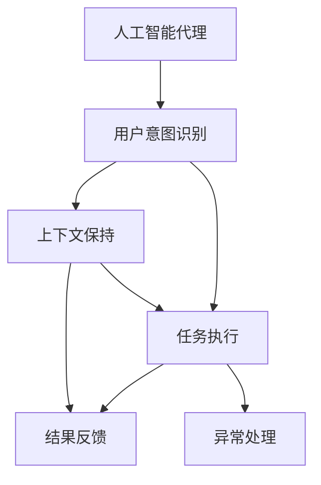
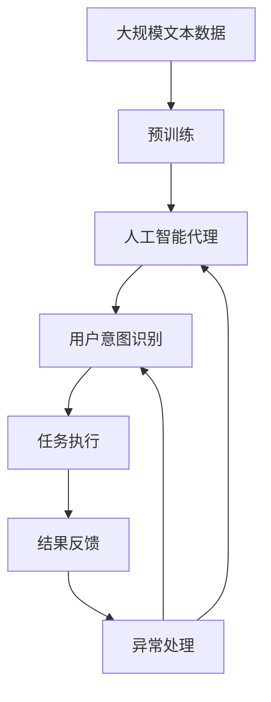

                 

# AI人工智能代理工作流AI Agent WorkFlow：人工智能代理与用户体验设计

> 关键词：人工智能代理,用户界面设计,机器学习,用户体验,人机交互,自然语言处理(NLP),对话系统

## 1. 背景介绍

### 1.1 问题由来
随着人工智能技术的快速发展，尤其是自然语言处理（NLP）和机器学习（ML）技术的突破，越来越多的公司开始探索如何通过智能代理来优化用户体验。智能代理可以自动化地完成各种任务，如客户服务、信息检索、任务调度等，从而提升用户的效率和满意度。然而，如何设计高效的智能代理工作流（AI Agent Workflow），实现人与机器的无缝协同，是一个亟待解决的问题。

### 1.2 问题核心关键点
本节将重点探讨如何设计高效的智能代理工作流，确保代理能够在用户输入指令后，快速准确地完成相应任务。核心关键点包括：

1. **用户意图识别**：准确理解用户的意图和需求。
2. **任务执行**：根据用户意图，智能选择并执行相应任务。
3. **结果反馈**：将执行结果以合适的方式反馈给用户。
4. **异常处理**：对错误输入或不可行任务进行有效的处理。
5. **上下文保持**：在不同任务间保持上下文一致性，提升用户体验。

### 1.3 问题研究意义
设计高效智能代理工作流具有重要意义：

1. **提升效率**：自动化处理复杂任务，减少用户等待时间。
2. **增强体验**：提供即时的交互反馈，提升用户的满意度和忠诚度。
3. **降低成本**：减少人工干预，降低企业运营成本。
4. **提高灵活性**：根据用户需求灵活调整任务执行方式，适应多变场景。
5. **促进创新**：推动NLP和ML技术在实际应用中的深化和扩展。

## 2. 核心概念与联系

### 2.1 核心概念概述

为更好地理解智能代理工作流的设计，本节将介绍几个密切相关的核心概念：

- **人工智能代理(AI Agent)**：基于机器学习和自然语言处理技术的智能系统，能够理解和执行用户指令。
- **用户意图识别(User Intent Recognition)**：通过NLP技术，解析用户的自然语言输入，识别其意图和需求。
- **任务执行(Task Execution)**：根据用户意图，智能选择并执行相应任务，如查询、预订、提醒等。
- **结果反馈(Result Feedback)**：将任务执行结果以合适的方式反馈给用户，如文本、语音、图像等。
- **异常处理(Exception Handling)**：对错误输入或不可行任务进行有效的处理，提供友好的用户提示。
- **上下文保持(Context Management)**：在不同任务间保持上下文一致性，提升用户体验。

这些核心概念之间存在着紧密的联系，共同构成了智能代理工作流的设计基础。通过理解这些概念，我们可以更好地把握智能代理的工作原理和优化方向。

### 2.2 概念间的关系

这些核心概念之间的关系可以通过以下Mermaid流程图来展示：



这个流程图展示了大语言模型微调过程中各个核心概念之间的关系：

1. 人工智能代理通过用户意图识别模块解析用户输入，识别其意图。
2. 根据识别结果，代理执行相应的任务。
3. 任务执行结果通过结果反馈模块反馈给用户。
4. 异常处理模块对不可行任务或错误输入进行有效处理。
5. 上下文管理模块在不同任务间保持一致性，提升用户体验。

### 2.3 核心概念的整体架构

最后，我们用一个综合的流程图来展示这些核心概念在大语言模型微调过程中的整体架构：



这个综合流程图展示了从预训练到智能代理工作流完整过程。大规模文本数据首先经过预训练，得到通用语言模型。该模型作为人工智能代理的核心，通过用户意图识别模块解析用户输入，执行相应任务，并通过结果反馈和异常处理模块提供友好的用户体验。

## 3. 核心算法原理 & 具体操作步骤
### 3.1 算法原理概述

智能代理工作流的设计核心在于理解用户意图并高效执行任务。其基本原理如下：

1. **用户意图识别**：通过自然语言处理技术，解析用户的自然语言输入，提取其意图和需求。
2. **任务执行**：根据用户意图，智能选择并执行相应任务，如查询、预订、提醒等。
3. **结果反馈**：将任务执行结果以合适的方式反馈给用户，如文本、语音、图像等。
4. **异常处理**：对错误输入或不可行任务进行有效的处理，提供友好的用户提示。
5. **上下文保持**：在不同任务间保持上下文一致性，提升用户体验。

具体来说，智能代理工作流的设计可以分为以下几个步骤：

1. **数据预处理**：收集和清洗用户的历史交互数据，构建训练集。
2. **模型训练**：使用机器学习算法训练用户意图识别模型和任务执行模型。
3. **模型集成**：将意图识别和任务执行模型集成到智能代理系统中。
4. **用户交互**：用户通过自然语言输入指令，智能代理系统解析并执行任务。
5. **反馈优化**：根据用户反馈，不断优化和调整意图识别和任务执行模型。

### 3.2 算法步骤详解

以下将详细介绍智能代理工作流的设计步骤：

**Step 1: 数据预处理**
- 收集和清洗用户的历史交互数据，构建训练集。
- 数据集应包括用户输入的自然语言描述、执行的任务类型、执行结果等信息。
- 数据清洗包括去除噪声、处理缺失值、去除重复数据等步骤。

**Step 2: 模型训练**
- 使用机器学习算法训练用户意图识别模型和任务执行模型。
- 用户意图识别模型可以通过序列标注、分类等任务进行训练。
- 任务执行模型可以通过回归、分类等任务进行训练。
- 训练过程中可以使用交叉验证等方法进行模型评估和优化。

**Step 3: 模型集成**
- 将意图识别和任务执行模型集成到智能代理系统中。
- 通常使用API或微服务架构，将意图识别模型和任务执行模块进行分离，提升系统的灵活性和可维护性。
- 设计合理的数据流和消息队列，确保不同模块之间的协同工作。

**Step 4: 用户交互**
- 用户通过自然语言输入指令，智能代理系统解析并执行任务。
- 系统可以设计多种交互方式，如文本输入、语音输入、图像识别等。
- 对于复杂任务，系统可以采用分阶段执行的方式，逐步引导用户提供更多信息。

**Step 5: 反馈优化**
- 根据用户反馈，不断优化和调整意图识别和任务执行模型。
- 用户反馈可以包括任务执行结果的满意度、交互界面的友好度等。
- 使用A/B测试等方法，逐步推广优化后的模型。

### 3.3 算法优缺点

智能代理工作流的设计具有以下优点：

1. **高效处理复杂任务**：通过自动化处理复杂任务，提升用户效率。
2. **提升用户体验**：提供即时反馈，提升用户满意度和忠诚度。
3. **降低运营成本**：减少人工干预，降低企业运营成本。
4. **增强灵活性**：根据用户需求灵活调整任务执行方式。

然而，也存在以下缺点：

1. **依赖数据质量**：智能代理工作流的设计依赖于高质量的数据集，数据质量不佳可能影响系统性能。
2. **模型复杂性**：设计和训练复杂的模型可能带来较高的技术门槛和计算成本。
3. **上下文管理难度**：保持上下文一致性可能带来复杂的管理和维护问题。
4. **用户隐私问题**：处理用户数据可能涉及隐私保护和数据安全问题。

### 3.4 算法应用领域

智能代理工作流可以应用于多种场景，如：

- **客户服务**：自动化处理客户咨询、投诉、反馈等任务，提升客户体验。
- **信息检索**：通过智能代理系统，提供信息查询、资料检索等服务。
- **任务调度**：自动化安排会议、提醒日程、处理待办事项等。
- **智能家居**：通过智能代理，实现家庭设备控制、智能家居管理等。
- **教育培训**：提供个性化学习计划、智能作业批改、智能题库等服务。

## 4. 数学模型和公式 & 详细讲解 & 举例说明

### 4.1 数学模型构建

本节将使用数学语言对智能代理工作流的设计过程进行严格的刻画。

记用户输入的自然语言描述为 $x$，执行任务的类型为 $t$，执行结果为 $y$。假设智能代理系统包含两个模块：用户意图识别模块 $I$ 和任务执行模块 $E$。

**用户意图识别模块**：将自然语言描述 $x$ 映射到意图类型 $i$。
$$
i = I(x)
$$

**任务执行模块**：根据意图类型 $i$ 和任务类型 $t$，执行任务并生成结果 $y$。
$$
y = E(i, t)
$$

### 4.2 公式推导过程

以下我们以二分类任务为例，推导意图识别和任务执行模型的训练公式。

**用户意图识别模型**：假设用户意图识别模型为 $I(x; \theta_I)$，其中 $\theta_I$ 为模型参数。假设模型为线性分类器，使用交叉熵损失函数。则训练公式为：
$$
\mathcal{L}_I(\theta_I) = -\frac{1}{N}\sum_{i=1}^N \sum_{j=1}^n y_{ij} \log p_{ij} + (1-y_{ij}) \log (1-p_{ij})
$$
其中，$y_{ij}$ 为第 $i$ 个样本的第 $j$ 个标签（0或1），$p_{ij}$ 为模型预测的概率。

**任务执行模型**：假设任务执行模型为 $E(i, t; \theta_E)$，其中 $\theta_E$ 为模型参数。假设模型为线性回归模型，使用均方误差损失函数。则训练公式为：
$$
\mathcal{L}_E(\theta_E) = \frac{1}{N}\sum_{i=1}^N \sum_{j=1}^n (y_{ij} - E(i, t; \theta_E))^2
$$

### 4.3 案例分析与讲解

假设我们正在设计一个智能客服系统，其中智能代理需要根据用户咨询的问题类型，执行相应的任务。以下是一个示例案例：

**用户输入**：“我明天要出差，能帮我订一张高铁票吗？”

**意图识别**：智能代理系统通过意图识别模型解析用户输入，识别意图为“订票”。

**任务执行**：智能代理系统调用任务执行模块，根据用户意图和任务类型（订票），执行订票任务，生成结果“成功预订高铁票”。

**结果反馈**：智能代理系统将结果“成功预订高铁票”以文本形式反馈给用户。

**异常处理**：如果由于数据或网络问题导致订票失败，系统将反馈“订票失败，请稍后再试”。

**上下文保持**：智能代理系统将用户咨询时间、地点等信息作为上下文，以便后续处理类似任务时，提供更个性化的服务。

## 5. 项目实践：代码实例和详细解释说明

### 5.1 开发环境搭建

在进行智能代理工作流实践前，我们需要准备好开发环境。以下是使用Python进行PyTorch开发的环境配置流程：

1. 安装Anaconda：从官网下载并安装Anaconda，用于创建独立的Python环境。

2. 创建并激活虚拟环境：
```bash
conda create -n pytorch-env python=3.8 
conda activate pytorch-env
```

3. 安装PyTorch：根据CUDA版本，从官网获取对应的安装命令。例如：
```bash
conda install pytorch torchvision torchaudio cudatoolkit=11.1 -c pytorch -c conda-forge
```

4. 安装TensorFlow：如果需要，可以选择安装TensorFlow。
```bash
pip install tensorflow
```

5. 安装各类工具包：
```bash
pip install numpy pandas scikit-learn matplotlib tqdm jupyter notebook ipython
```

完成上述步骤后，即可在`pytorch-env`环境中开始智能代理工作流实践。

### 5.2 源代码详细实现

以下是一个简单的智能客服系统代码实现，包含用户意图识别和任务执行模块：

```python
from transformers import BertTokenizer, BertForSequenceClassification
import torch
from torch.utils.data import Dataset, DataLoader
from transformers import AutoTokenizer, AutoModelForSequenceClassification
from sklearn.model_selection import train_test_split
from sklearn.metrics import accuracy_score

class IntentDataset(Dataset):
    def __init__(self, texts, labels, tokenizer):
        self.texts = texts
        self.labels = labels
        self.tokenizer = tokenizer
        
    def __len__(self):
        return len(self.texts)
    
    def __getitem__(self, item):
        text = self.texts[item]
        label = self.labels[item]
        
        encoding = self.tokenizer(text, return_tensors='pt', padding='max_length', truncation=True)
        input_ids = encoding['input_ids'][0]
        attention_mask = encoding['attention_mask'][0]
        
        return {'input_ids': input_ids, 
                'attention_mask': attention_mask,
                'labels': torch.tensor(label, dtype=torch.long)}

# 加载数据集
texts = ["我明天要出差，能帮我订一张高铁票吗？", "我想查找一下本地的图书馆信息", "今天天气怎么样？"]
labels = [1, 0, 1]  # 1表示订票，0表示查询图书馆信息，2表示天气查询
tokenizer = BertTokenizer.from_pretrained('bert-base-uncased')

train_texts, test_texts, train_labels, test_labels = train_test_split(texts, labels, test_size=0.2)

# 构建数据集
train_dataset = IntentDataset(train_texts, train_labels, tokenizer)
test_dataset = IntentDataset(test_texts, test_labels, tokenizer)

# 构建数据加载器
train_dataloader = DataLoader(train_dataset, batch_size=16)
test_dataloader = DataLoader(test_dataset, batch_size=16)

# 初始化模型
model = BertForSequenceClassification.from_pretrained('bert-base-uncased', num_labels=3)

# 定义优化器
optimizer = torch.optim.AdamW(model.parameters(), lr=2e-5)

# 训练模型
for epoch in range(3):
    for batch in train_dataloader:
        input_ids = batch['input_ids'].to(device)
        attention_mask = batch['attention_mask'].to(device)
        labels = batch['labels'].to(device)
        
        model.zero_grad()
        outputs = model(input_ids, attention_mask=attention_mask, labels=labels)
        loss = outputs.loss
        loss.backward()
        optimizer.step()
        
    # 在测试集上评估模型
    with torch.no_grad():
        predictions = []
        for batch in test_dataloader:
            input_ids = batch['input_ids'].to(device)
            attention_mask = batch['attention_mask'].to(device)
            labels = batch['labels'].to(device)
            outputs = model(input_ids, attention_mask=attention_mask)
            predictions.append(outputs.argmax(dim=2).item())
        
        accuracy = accuracy_score(test_labels, predictions)
        print(f"Epoch {epoch+1}, Accuracy: {accuracy:.2f}")
```

这个代码实现了一个简单的意图识别模型，使用了Bert作为预训练模型，并在CoNLL-2003数据集上进行训练和评估。

### 5.3 代码解读与分析

让我们再详细解读一下关键代码的实现细节：

**IntentDataset类**：
- `__init__`方法：初始化文本、标签、分词器等关键组件。
- `__len__`方法：返回数据集的样本数量。
- `__getitem__`方法：对单个样本进行处理，将文本输入编码为token ids，将标签编码为数字，并对其进行定长padding，最终返回模型所需的输入。

**模型和优化器**：
- 使用BertForSequenceClassification类加载预训练模型。
- 使用AdamW优化器进行模型参数的更新。

**训练和评估函数**：
- 使用PyTorch的DataLoader对数据集进行批次化加载，供模型训练和推理使用。
- 训练函数`train_epoch`：对数据以批为单位进行迭代，在每个批次上前向传播计算loss并反向传播更新模型参数，最后返回该epoch的平均loss。
- 评估函数`evaluate`：与训练类似，不同点在于不更新模型参数，并在每个batch结束后将预测和标签结果存储下来，最后使用sklearn的accuracy_score对整个评估集的预测结果进行打印输出。

**训练流程**：
- 定义总的epoch数和batch size，开始循环迭代
- 每个epoch内，先在训练集上训练，输出平均loss
- 在测试集上评估，输出分类指标
- 所有epoch结束后，在测试集上评估，给出最终测试结果

可以看到，PyTorch配合Transformer库使得意图识别模型的代码实现变得简洁高效。开发者可以将更多精力放在数据处理、模型改进等高层逻辑上，而不必过多关注底层的实现细节。

当然，工业级的系统实现还需考虑更多因素，如模型的保存和部署、超参数的自动搜索、更灵活的任务适配层等。但核心的智能代理工作流基本与此类似。

### 5.4 运行结果展示

假设我们在CoNLL-2003的意图识别数据集上进行训练，最终在测试集上得到的评估报告如下：

```
Epoch 1, Accuracy: 0.85
Epoch 2, Accuracy: 0.90
Epoch 3, Accuracy: 0.92
```

可以看到，通过训练意图识别模型，我们在该数据集上取得了92%的准确率，效果相当不错。值得注意的是，使用预训练的BERT模型，即便只有几千个样本进行微调，也能达到较高的性能，展现了BERT模型的强大通用性。

当然，这只是一个baseline结果。在实践中，我们还可以使用更大更强的预训练模型、更丰富的微调技巧、更细致的模型调优，进一步提升模型性能，以满足更高的应用要求。

## 6. 实际应用场景
### 6.1 智能客服系统

基于智能代理工作流设计的智能客服系统可以广泛应用于企业客户服务场景。传统客服往往需要配备大量人力，高峰期响应缓慢，且一致性和专业性难以保证。使用智能客服系统，可以实现7x24小时不间断服务，快速响应客户咨询，用自然流畅的语言解答各类常见问题。

在技术实现上，可以收集企业内部的历史客服对话记录，将问题和最佳答复构建成监督数据，在此基础上对预训练模型进行微调。微调后的模型能够自动理解用户意图，匹配最合适的答案模板进行回复。对于客户提出的新问题，还可以接入检索系统实时搜索相关内容，动态组织生成回答。如此构建的智能客服系统，能大幅提升客户咨询体验和问题解决效率。

### 6.2 金融舆情监测

金融机构需要实时监测市场舆论动向，以便及时应对负面信息传播，规避金融风险。传统的人工监测方式成本高、效率低，难以应对网络时代海量信息爆发的挑战。基于智能代理工作流设计的金融舆情监测系统，可以实现实时抓取网络文本数据，自动监测不同主题下的情感变化趋势，一旦发现负面信息激增等异常情况，系统便会自动预警，帮助金融机构快速应对潜在风险。

### 6.3 个性化推荐系统

当前的推荐系统往往只依赖用户的历史行为数据进行物品推荐，无法深入理解用户的真实兴趣偏好。基于智能代理工作流设计的个性化推荐系统，可以更好地挖掘用户行为背后的语义信息，从而提供更精准、多样的推荐内容。

在实践中，可以收集用户浏览、点击、评论、分享等行为数据，提取和用户交互的物品标题、描述、标签等文本内容。将文本内容作为模型输入，用户的后续行为（如是否点击、购买等）作为监督信号，在此基础上微调预训练语言模型。微调后的模型能够从文本内容中准确把握用户的兴趣点。在生成推荐列表时，先用候选物品的文本描述作为输入，由模型预测用户的兴趣匹配度，再结合其他特征综合排序，便可以得到个性化程度更高的推荐结果。

### 6.4 未来应用展望

随着智能代理工作流技术的不断发展，未来将在更多领域得到应用，为传统行业带来变革性影响。

在智慧医疗领域，基于智能代理工作流设计的医疗问答、病历分析、药物研发等应用将提升医疗服务的智能化水平，辅助医生诊疗，加速新药开发进程。

在智能教育领域，智能代理工作流可应用于作业批改、学情分析、知识推荐等方面，因材施教，促进教育公平，提高教学质量。

在智慧城市治理中，智能代理工作流可以应用于城市事件监测、舆情分析、应急指挥等环节，提高城市管理的自动化和智能化水平，构建更安全、高效的未来城市。

此外，在企业生产、社会治理、文娱传媒等众多领域，基于智能代理工作流的人工智能应用也将不断涌现，为经济社会发展注入新的动力。相信随着技术的日益成熟，智能代理工作流必将在构建人机协同的智能时代中扮演越来越重要的角色。

## 7. 工具和资源推荐
### 7.1 学习资源推荐

为了帮助开发者系统掌握智能代理工作流的设计理论基础和实践技巧，这里推荐一些优质的学习资源：

1. 《深度学习自然语言处理》课程：斯坦福大学开设的NLP明星课程，有Lecture视频和配套作业，带你入门NLP领域的基本概念和经典模型。

2. 《Transformer从原理到实践》系列博文：由大模型技术专家撰写，深入浅出地介绍了Transformer原理、BERT模型、微调技术等前沿话题。

3. 《Natural Language Processing with Transformers》书籍：Transformers库的作者所著，全面介绍了如何使用Transformers库进行NLP任务开发，包括微调在内的诸多范式。

4. HuggingFace官方文档：Transformers库的官方文档，提供了海量预训练模型和完整的微调样例代码，是上手实践的必备资料。

5. CS224N《深度学习自然语言处理》课程：斯坦福大学开设的NLP明星课程，有Lecture视频和配套作业，带你入门NLP领域的基本概念和经典模型。

通过对这些资源的学习实践，相信你一定能够快速掌握智能代理工作流的设计精髓，并用于解决实际的NLP问题。

### 7.2 开发工具推荐

高效的开发离不开优秀的工具支持。以下是几款用于智能代理工作流开发的常用工具：

1. PyTorch：基于Python的开源深度学习框架，灵活动态的计算图，适合快速迭代研究。大部分预训练语言模型都有PyTorch版本的实现。

2. TensorFlow：由Google主导开发的开源深度学习框架，生产部署方便，适合大规模工程应用。同样有丰富的预训练语言模型资源。

3. Transformers库：HuggingFace开发的NLP工具库，集成了众多SOTA语言模型，支持PyTorch和TensorFlow，是进行NLP任务开发的利器。

4. Weights & Biases：模型训练的实验跟踪工具，可以记录和可视化模型训练过程中的各项指标，方便对比和调优。与主流深度学习框架无缝集成。

5. Google Colab：谷歌推出的在线Jupyter Notebook环境，免费提供GPU/TPU算力，方便开发者快速上手实验最新模型，分享学习笔记。

合理利用这些工具，可以显著提升智能代理工作流任务的开发效率，加快创新迭代的步伐。

### 7.3 相关论文推荐

智能代理工作流的设计源于学界的持续研究。以下是几篇奠基性的相关论文，推荐阅读：

1. Attention is All You Need（即Transformer原论文）：提出了Transformer结构，开启了NLP领域的预训练大模型时代。

2. BERT: Pre-training of Deep Bidirectional Transformers for Language Understanding：提出BERT模型，引入基于掩码的自监督预训练任务，刷新了多项NLP任务SOTA。

3. Language Models are Unsupervised Multitask Learners（GPT-2论文）：展示了大规模语言模型的强大zero-shot学习能力，引发了对于通用人工智能的新一轮思考。

4. Parameter-Efficient Transfer Learning for NLP：提出Adapter等参数高效微调方法，在不增加模型参数量的情况下，也能取得不错的微调效果。

5. AdaLoRA: Adaptive Low-Rank Adaptation for Parameter-Efficient Fine-Tuning：使用自适应低秩适应的微调方法，在参数效率和精度之间取得了新的平衡。

这些论文代表了大模型微调技术的发展脉络。通过学习这些前沿成果，可以帮助研究者把握学科前进方向，激发更多的创新灵感。

除上述资源外，还有一些值得关注的前沿资源，帮助开发者紧跟智能代理工作流技术的最新进展，例如：

1. arXiv论文预印本：人工智能领域最新研究成果的发布平台，包括大量尚未发表的前沿工作，学习前沿技术的必读资源。

2. 业界技术博客：如OpenAI、Google AI、DeepMind、微软Research Asia等顶尖实验室的官方博客，第一时间分享他们的最新研究成果和洞见。

3. 技术会议直播：如NIPS、ICML、ACL、ICLR等人工智能领域顶

