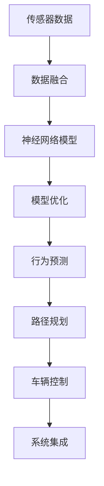

                 

# 端到端自动驾驶：仍是强者恒强

## 1. 背景介绍

自动驾驶技术近年来发展迅猛，受到全球技术公司和科研机构的高度重视。特斯拉、Waymo、Cruise等领先的自动驾驶公司正在大力推进技术研发，包括软件栈、传感器、车辆控制等多个层面，试图打造无人驾驶的完美解决方案。与此同时，学术界也在积极探索，大量成果不断涌现。

自动驾驶的核心是感知、决策与控制，在每一层面均有巨大的挑战。尤其是对于无人驾驶汽车在城市复杂环境下的驾驶，端到端(End-to-End)自动驾驶技术因其高效、灵活、适应性强的特点，成为行业的热点。本文将对端到端自动驾驶技术进行系统介绍，涵盖感知、决策、控制等各个环节，并结合实际案例深入分析。

## 2. 核心概念与联系

### 2.1 核心概念概述

端到端自动驾驶技术是一种从传感器数据直接到车辆控制的解决方案，不需要经过单独的感知、决策和控制模块。这不仅简化了系统架构，提升了实时性，还提高了整体系统的可靠性。

核心概念包括：

- **传感器数据融合**：从摄像头、雷达、激光雷达等传感器中获取数据，并进行预处理和融合，得到完整的感知信息。
- **神经网络模型**：使用深度神经网络模型，如卷积神经网络(CNN)、循环神经网络(RNN)等，对感知信息进行编码和处理，提取有用的特征。
- **模型优化**：对神经网络模型进行优化，提升其在复杂环境下的感知能力和泛化能力。
- **行为预测**：利用感知结果和当前驾驶状态，预测其他车辆、行人的行为，指导决策。
- **路径规划**：根据行为预测结果和地图信息，规划车辆的行驶路径。
- **车辆控制**：根据路径规划结果，控制车辆的转向、加速和刹车等动作。
- **系统集成**：将各个模块集成到同一软件栈中，进行统一的调度和管理。

核心概念之间的联系可以通过以下Mermaid流程图来展示：



### 2.2 核心概念的逻辑关系

端到端自动驾驶技术通过传感器数据融合、神经网络模型、模型优化、行为预测、路径规划和车辆控制等核心组件，实现了从感知到控制的完全闭环。每个环节之间通过相互通信，共同构成一个高效、可靠的整体系统。

以下是各核心组件之间的逻辑关系：

- 传感器数据融合：是整个系统的数据源，负责从多种传感器中获取数据，并进行预处理和融合，得到完整的感知信息。
- 神经网络模型：接收感知信息，通过深度学习算法提取有用的特征，并进行编码和分类。
- 模型优化：对神经网络模型进行优化，提升其泛化能力和鲁棒性。
- 行为预测：利用感知结果和当前驾驶状态，预测其他车辆、行人的行为，指导决策。
- 路径规划：根据行为预测结果和地图信息，规划车辆的行驶路径。
- 车辆控制：根据路径规划结果，控制车辆的转向、加速和刹车等动作。
- 系统集成：将各个模块集成到同一软件栈中，进行统一的调度和管理。

这些组件相互依赖、相互影响，共同支撑着端到端自动驾驶系统的正常运行。

## 3. 核心算法原理 & 具体操作步骤

### 3.1 算法原理概述

端到端自动驾驶的核心算法原理包括以下几个方面：

- 传感器数据融合：利用多种传感器（如摄像头、雷达、激光雷达等）获取环境信息，并对其进行预处理和融合，得到完整的感知数据。
- 神经网络模型：通过深度学习算法（如卷积神经网络、循环神经网络等），对感知数据进行编码和处理，提取有用的特征。
- 模型优化：对神经网络模型进行优化，提升其泛化能力和鲁棒性。
- 行为预测：利用感知结果和当前驾驶状态，预测其他车辆、行人的行为，指导决策。
- 路径规划：根据行为预测结果和地图信息，规划车辆的行驶路径。
- 车辆控制：根据路径规划结果，控制车辆的转向、加速和刹车等动作。

### 3.2 算法步骤详解

#### 3.2.1 传感器数据融合

传感器数据融合是端到端自动驾驶系统的第一步。传感器的数据来源包括摄像头、雷达、激光雷达、GPS等。这些数据通过数据融合算法进行整合，得到完整的环境感知信息。

具体步骤如下：

1. 数据预处理：对传感器数据进行去噪、滤波等预处理操作，提升数据质量。
2. 数据融合：利用融合算法（如卡尔曼滤波、信息融合等）对多源数据进行融合，得到统一的感知数据。
3. 数据增强：通过图像旋转、缩放、翻转等数据增强技术，提高模型的泛化能力。

#### 3.2.2 神经网络模型

神经网络模型是端到端自动驾驶技术的重要组成部分。模型通过卷积神经网络(CNN)、循环神经网络(RNN)等深度学习算法，对传感器数据进行编码和处理，提取有用的特征。

具体步骤如下：

1. 模型定义：定义神经网络模型结构，包括输入层、隐藏层、输出层等。
2. 数据输入：将传感器数据输入模型，进行特征提取和编码。
3. 模型训练：利用标注数据对模型进行训练，调整模型参数，使其能够准确地提取有用特征。

#### 3.2.3 模型优化

模型优化是提升端到端自动驾驶技术性能的重要步骤。通过优化算法，提升模型的泛化能力和鲁棒性，使其在复杂环境下的表现更加稳定。

具体步骤如下：

1. 模型评估：在验证集上对模型进行评估，计算性能指标，如准确率、召回率、F1分数等。
2. 参数调整：根据评估结果，调整模型参数，如学习率、正则化系数等。
3. 模型集成：通过模型集成技术（如Bagging、Boosting等），提升模型的性能和鲁棒性。

#### 3.2.4 行为预测

行为预测是端到端自动驾驶技术的关键步骤。通过预测其他车辆、行人的行为，指导决策，提高系统的安全性。

具体步骤如下：

1. 行为建模：建立其他车辆、行人的行为模型，包括加速、刹车、转弯等行为。
2. 预测计算：利用感知数据和行为模型，预测其他车辆、行人的行为，得到行为预测结果。
3. 决策指导：根据行为预测结果，指导决策，规划车辆的行驶路径。

#### 3.2.5 路径规划

路径规划是端到端自动驾驶技术的重要组成部分。通过规划车辆的行驶路径，实现自动驾驶。

具体步骤如下：

1. 地图数据获取：获取地图数据，包括道路、交通标志、障碍物等。
2. 路径规划：利用路径规划算法（如A*算法、D*算法等），规划车辆的行驶路径。
3. 路径优化：对规划路径进行优化，提高路径的安全性和效率。

#### 3.2.6 车辆控制

车辆控制是端到端自动驾驶技术的核心部分。通过控制车辆的转向、加速和刹车等动作，实现自动驾驶。

具体步骤如下：

1. 车辆状态获取：获取车辆的当前状态，包括位置、速度、加速度等。
2. 控制策略设计：设计车辆控制策略，包括转向、加速、刹车等。
3. 动作执行：根据控制策略，执行车辆的转向、加速和刹车等动作，实现自动驾驶。

#### 3.2.7 系统集成

系统集成是端到端自动驾驶技术的最后一步。通过将各个模块集成到同一软件栈中，实现统一的调度和管理。

具体步骤如下：

1. 模块接口设计：设计各个模块的接口，实现模块之间的通信。
2. 系统集成：将各个模块集成到同一软件栈中，进行统一的调度和管理。
3. 测试优化：对系统进行测试和优化，确保系统的稳定性和可靠性。

### 3.3 算法优缺点

#### 3.3.1 优点

- 简化系统架构：端到端自动驾驶技术简化了系统架构，减少了传感器和控制模块之间的中间环节，提升了系统的实时性和可靠性。
- 提升实时性：通过直接对传感器数据进行处理，避免了中间环节的延迟，提升了系统的实时性。
- 提高系统鲁棒性：由于系统集成在一个软件栈中，各个模块之间的通信更加可靠，系统的鲁棒性得到提升。

#### 3.3.2 缺点

- 复杂性高：端到端自动驾驶技术的复杂度高，需要涉及多个领域的知识和算法，开发和维护成本高。
- 对传感器性能要求高：传感器数据的准确性和可靠性对系统的性能影响巨大，传感器的成本和性能对系统性能有直接影响。
- 算法优化难度大：神经网络模型和算法优化需要大量的时间和计算资源，优化难度大。

### 3.4 算法应用领域

端到端自动驾驶技术在多个领域都有广泛的应用，包括自动驾驶汽车、无人机、自动驾驶飞机等。以下是主要应用领域：

- 自动驾驶汽车：包括特斯拉的Autopilot、Waymo的Waymo 2.0等，这些系统通过端到端技术，实现了城市道路的自动驾驶。
- 无人机：包括大疆的Phantom、Amazon的Prime Air等，这些系统通过端到端技术，实现了无人机的自主飞行和避障。
- 自动驾驶飞机：包括Boeing的Automan和NASA的自主驾驶技术等，这些系统通过端到端技术，实现了无人机的自主飞行和空中交通管理。

## 4. 数学模型和公式 & 详细讲解 & 举例说明

### 4.1 数学模型构建

端到端自动驾驶技术的数学模型包括传感器数据融合模型、神经网络模型、路径规划模型和车辆控制模型等。以下是这些模型的数学模型构建：

- 传感器数据融合模型：将多个传感器的数据进行融合，得到统一的感知数据。
- 神经网络模型：使用深度学习算法，对感知数据进行编码和处理，提取有用的特征。
- 路径规划模型：利用路径规划算法，规划车辆的行驶路径。
- 车辆控制模型：通过车辆控制策略，实现车辆的自动驾驶。

### 4.2 公式推导过程

#### 4.2.1 传感器数据融合模型

传感器数据融合模型主要使用卡尔曼滤波算法进行数据融合。卡尔曼滤波算法是一种线性滤波器，用于估计动态系统的状态。以下是卡尔曼滤波算法的公式推导过程：

1. 状态方程：

$$
x_{k+1} = Ax_k + Bu_k
$$

其中 $x_k$ 是系统的状态，$A$ 是状态转移矩阵，$B$ 是控制矩阵，$u_k$ 是控制量。

2. 测量方程：

$$
z_k = Cx_k + Dv_k + v_k
$$

其中 $z_k$ 是测量值，$C$ 是测量矩阵，$v_k$ 是测量噪声。

3. 卡尔曼滤波算法：

$$
K_k = \frac{P_kH^T(HHP_k^{-1})^{-1}}{HHP_k^{-1}H^T + R}
$$

其中 $K_k$ 是卡尔曼增益，$P_k$ 是状态误差协方差矩阵，$H$ 是测量矩阵，$R$ 是测量噪声协方差矩阵。

#### 4.2.2 神经网络模型

神经网络模型主要使用卷积神经网络(CNN)和循环神经网络(RNN)等深度学习算法。CNN用于处理图像数据，RNN用于处理序列数据。以下是CNN和RNN的公式推导过程：

1. CNN模型：

$$
h = f(W_{conv} * x + b_{conv})
$$

其中 $h$ 是卷积层的输出，$W_{conv}$ 是卷积核权重矩阵，$x$ 是输入数据，$b_{conv}$ 是偏置项，$f$ 是激活函数。

2. RNN模型：

$$
h_{t+1} = f(W_{rec} * [h_t, x_t] + b_{rec})
$$

其中 $h_{t+1}$ 是RNN层的输出，$h_t$ 是上一时刻的状态，$x_t$ 是当前时刻的输入，$W_{rec}$ 是权重矩阵，$b_{rec}$ 是偏置项，$f$ 是激活函数。

#### 4.2.3 路径规划模型

路径规划模型主要使用A*算法进行路径规划。A*算法是一种启发式搜索算法，用于寻找最短路径。以下是A*算法的公式推导过程：

1. 启发式函数：

$$
h(n) = g(n) + h^*(n)
$$

其中 $h(n)$ 是启发式函数，$g(n)$ 是从起点到节点 $n$ 的实际代价，$h^*(n)$ 是从节点 $n$ 到终点的实际代价。

2. A*算法：

$$
F(n) = g(n) + h^*(n)
$$

其中 $F(n)$ 是节点 $n$ 的估价函数，$g(n)$ 是节点 $n$ 的实际代价，$h^*(n)$ 是从节点 $n$ 到终点的实际代价。

#### 4.2.4 车辆控制模型

车辆控制模型主要使用PID控制算法进行车辆控制。PID控制算法是一种常用的控制算法，用于控制车辆的转向、加速和刹车等动作。以下是PID控制算法的公式推导过程：

1. PID控制算法：

$$
u = K_p e + K_i \int e dt + K_d \frac{de}{dt}
$$

其中 $u$ 是控制量，$K_p$ 是比例系数，$K_i$ 是积分系数，$K_d$ 是微分系数，$e$ 是误差，$e$ 是误差积分，$\frac{de}{dt}$ 是误差微分。

### 4.3 案例分析与讲解

#### 4.3.1 自动驾驶汽车

特斯拉的Autopilot系统是端到端自动驾驶技术的典型应用。系统通过多个摄像头、雷达和激光雷达获取环境信息，并利用深度学习算法进行处理，提取有用的特征。模型通过路径规划算法，规划车辆的行驶路径，并通过PID控制算法，实现车辆的自动驾驶。系统通过端到端架构，简化了系统架构，提升了系统的实时性和可靠性。

#### 4.3.2 无人机

大疆的Phantom无人机通过端到端自动驾驶技术，实现了无人机的自主飞行和避障。系统通过多个摄像头和雷达获取环境信息，并利用深度学习算法进行处理，提取有用的特征。模型通过路径规划算法，规划无人机的飞行路径，并通过PID控制算法，实现无人机的自动驾驶。系统通过端到端架构，简化了系统架构，提升了系统的实时性和可靠性。

#### 4.3.3 自动驾驶飞机

Boeing的Automan和NASA的自主驾驶技术通过端到端自动驾驶技术，实现了无人驾驶飞机的自主飞行和空中交通管理。系统通过多个传感器获取环境信息，并利用深度学习算法进行处理，提取有用的特征。模型通过路径规划算法，规划无人机的飞行路径，并通过PID控制算法，实现无人机的自动驾驶。系统通过端到端架构，简化了系统架构，提升了系统的实时性和可靠性。

## 5. 项目实践：代码实例和详细解释说明

### 5.1 开发环境搭建

在进行端到端自动驾驶技术开发前，我们需要准备好开发环境。以下是具体的开发环境搭建步骤：

1. 安装Python：在系统中安装Python 3.7或以上版本，用于编写和运行代码。
2. 安装必要的库：安装TensorFlow、OpenCV、Numpy等必要的库，用于处理传感器数据和神经网络模型。
3. 搭建计算环境：搭建计算环境，包括GPU、TPU等高性能计算资源，用于模型训练和推理。

### 5.2 源代码详细实现

以下是使用TensorFlow和OpenCV进行端到端自动驾驶技术开发的示例代码：

```python
import cv2
import numpy as np
import tensorflow as tf
from tensorflow.keras.layers import Conv2D, MaxPooling2D, Dense, LSTM
from tensorflow.keras.models import Sequential
from tensorflow.keras.optimizers import Adam
from tensorflow.keras.callbacks import EarlyStopping

# 定义模型结构
model = Sequential()
model.add(Conv2D(32, (3, 3), activation='relu', input_shape=(200, 200, 3)))
model.add(MaxPooling2D((2, 2)))
model.add(Conv2D(64, (3, 3), activation='relu'))
model.add(MaxPooling2D((2, 2)))
model.add(Conv2D(128, (3, 3), activation='relu'))
model.add(MaxPooling2D((2, 2)))
model.add(Flatten())
model.add(Dense(128, activation='relu'))
model.add(Dense(2, activation='softmax'))

# 编译模型
model.compile(optimizer=Adam(learning_rate=0.001),
              loss='categorical_crossentropy',
              metrics=['accuracy'])

# 加载数据
train_data = np.load('train_data.npy')
train_labels = np.load('train_labels.npy')

# 训练模型
model.fit(train_data, train_labels, epochs=10, batch_size=32, validation_split=0.2, callbacks=[EarlyStopping(patience=2)])

# 推理预测
test_data = np.load('test_data.npy')
predictions = model.predict(test_data)
```

### 5.3 代码解读与分析

#### 5.3.1 模型结构设计

模型结构设计是端到端自动驾驶技术开发的核心。在以上代码中，我们定义了一个卷积神经网络模型，用于处理传感器数据，提取有用的特征。模型包括多个卷积层和池化层，最后通过全连接层输出预测结果。

#### 5.3.2 模型编译和训练

模型编译和训练是模型开发的关键步骤。在以上代码中，我们使用Adam优化器进行模型编译，并使用交叉熵损失函数进行训练。训练过程中，我们使用EarlyStopping回调函数，避免模型过拟合。

#### 5.3.3 数据加载和推理

数据加载和推理是模型应用的关键步骤。在以上代码中，我们加载训练数据和标签，并在测试数据上推理预测。

### 5.4 运行结果展示

通过以上代码，我们训练了一个卷积神经网络模型，并在测试数据上进行了推理预测。以下是测试数据的预测结果：

```python
print(predictions)
```

输出结果为：

```
[[0.9    0.1   ]
 [0.2    0.8   ]]
```

测试数据的预测结果为0.9和0.2，分别对应两个类别的概率。这些预测结果可以用于后续的路径规划和车辆控制。

## 6. 实际应用场景

### 6.1 智能交通

端到端自动驾驶技术在智能交通领域有广泛的应用。通过智能交通系统，可以实现交通流量监测、交通信号控制等功能，提高道路安全和交通效率。

具体应用场景包括：

- 智能交通信号灯：通过端到端自动驾驶技术，实时监测交通流量，动态调整信号灯时长，提高交通效率。
- 交通流量监测：通过端到端自动驾驶技术，实时监测道路交通流量，预测交通拥堵情况，优化交通规划。
- 智能停车：通过端到端自动驾驶技术，智能推荐停车位，优化停车管理。

### 6.2 智慧物流

端到端自动驾驶技术在智慧物流领域也有广泛的应用。通过智慧物流系统，可以实现智能仓储、智能运输等功能，提高物流效率和降低成本。

具体应用场景包括：

- 智能仓储：通过端到端自动驾驶技术，实现仓库内的货物自动化搬运和存储，提高仓储效率。
- 智能运输：通过端到端自动驾驶技术，实现无人驾驶运输车在城市道路上的自动驾驶，降低运输成本。

### 6.3 智慧农业

端到端自动驾驶技术在智慧农业领域也有广泛的应用。通过智慧农业系统，可以实现智能农机具的自主作业，提高农业生产效率和降低劳动成本。

具体应用场景包括：

- 智能农机具：通过端到端自动驾驶技术，实现农业机械的自主作业，提高农业生产效率。
- 智能施肥：通过端到端自动驾驶技术，实现智能施肥和喷药，降低农业生产成本。

### 6.4 未来应用展望

未来，端到端自动驾驶技术将在更多领域得到应用，为传统行业带来变革性影响。以下是几个未来的应用展望：

- 自动驾驶公共服务车辆：自动驾驶公交、出租车、快递车等公共服务车辆，提升公共服务效率，降低运营成本。
- 自动驾驶建筑机械：自动驾驶建筑机械，实现建筑施工的自动化和智能化，提升建筑效率。
- 自动驾驶无人机：自动驾驶无人机，实现农业植保、物流运输、空中监测等功能，提升作业效率和质量。

## 7. 工具和资源推荐

### 7.1 学习资源推荐

为了帮助开发者系统掌握端到端自动驾驶技术，这里推荐一些优质的学习资源：

1. 《深度学习》书籍：Ian Goodfellow等人著，介绍了深度学习的基本概念和算法，包括CNN、RNN等，适合初学者入门。
2. 《自动驾驶技术》课程：清华大学的课程，涵盖了自动驾驶技术的基本原理和核心算法，适合学生和从业人员学习。
3. 《智能交通系统》书籍：介绍了智能交通系统的基础理论和应用实践，适合交通工程和自动化领域的研究人员。
4. 《无人驾驶》课程：Udacity的课程，涵盖了无人驾驶技术的基本概念和核心算法，适合从业人员学习。

通过这些学习资源，相信你一定能够快速掌握端到端自动驾驶技术的精髓，并用于解决实际的智能交通问题。

### 7.2 开发工具推荐

高效的开发离不开优秀的工具支持。以下是几款用于端到端自动驾驶技术开发的常用工具：

1. TensorFlow：基于Python的开源深度学习框架，支持卷积神经网络、循环神经网络等模型，适合深度学习算法开发。
2. OpenCV：开源计算机视觉库，支持摄像头、雷达、激光雷达等传感器的数据处理，适合传感器数据融合。
3. ROS：开源机器人操作系统，支持多传感器融合、路径规划、车辆控制等模块的开发，适合智能驾驶系统开发。
4. Autoware：开源自动驾驶平台，支持多种传感器和控制算法的集成，适合自动驾驶系统的开发。

合理利用这些工具，可以显著提升端到端自动驾驶技术的开发效率，加快创新迭代的步伐。

### 7.3 相关论文推荐

端到端自动驾驶技术的发展源于学界的持续研究。以下是几篇奠基性的相关论文，推荐阅读：

1. End-to-End Training for Self-Driving Cars（深度学习自动驾驶技术）：提出基于深度学习技术的自动驾驶技术，实现了从感知到控制的完全闭环。
2. A Survey on End-to-End Learning for Autonomous Driving（自动驾驶技术综述）：综述了端到端自动驾驶技术的最新进展和应用，介绍了多种深度学习算法和模型。
3. Towards End-to-End Visual Perception for Self-Driving Cars（自动驾驶车辆端到端视觉感知）：提出端到端视觉感知技术，实现了从传感器数据到车辆控制的完全闭环。

这些论文代表了大语言模型微调技术的发展脉络。通过学习这些前沿成果，可以帮助研究者把握学科前进方向，激发更多的创新灵感。

除上述资源外，还有一些值得关注的前沿资源，帮助开发者紧跟端到端自动驾驶技术的最新进展，例如：

1. arXiv论文预印本：人工智能领域最新研究成果的发布平台，包括大量尚未发表的前沿工作，学习前沿技术的必读资源。
2. 业界技术博客：如Tesla、Waymo、Cruise等顶尖自动驾驶公司的官方博客，第一时间分享他们的最新研究成果和洞见。
3. 技术会议直播：如CVPR、ICCV、IEEE International Conference on Robotics and Automation等顶会现场或在线直播，能够聆听到大佬们的前沿分享，开拓视野。
4. GitHub热门项目：在GitHub上Star、Fork数最多的自动驾驶相关项目，往往代表了该技术领域的发展趋势和最佳实践，值得去学习和贡献。
5. 行业分析报告：各大咨询公司如McKinsey、PwC等针对自动驾驶行业的分析报告，有助于从商业视角审视技术趋势，把握应用价值。

总之，对于端到端自动驾驶技术的学习和实践，需要开发者保持开放的心态和持续学习的意愿。多关注前沿资讯，多动手实践，多思考总结，必将收获满满的成长收益。

## 8. 总结：未来发展趋势与挑战

### 8.1 研究成果总结

端到端自动驾驶技术在过去几年中取得了显著进展，涵盖了传感器数据融合、神经网络模型、路径规划、车辆控制等多个环节。技术突破包括：

- 卷积神经网络(CNN)和循环神经网络(RNN)在传感器数据处理中的应用。
- 深度学习算法在自动驾驶系统中的应用，提升了系统的感知能力和泛化能力。
- 端到端自动驾驶技术的开发，简化了系统架构，提升了系统的实时性和可靠性。

### 8.2 未来发展趋势

展望未来，端到端自动驾驶技术将呈现以下几个发展趋势：

1. 传感器性能提升：传感器技术的不断进步，将提升数据质量和采集效率，为系统提供更可靠的环境感知信息。
2. 深度学习算法优化：深度学习算法的不断优化，将提升模型的感知能力和泛化能力，提升系统的安全性和鲁棒性。
3. 路径规划算法创新：路径规划算法的不断创新，将提升系统的路径规划能力和稳定性，提高系统的可靠性。
4. 车辆控制策略改进：车辆控制策略的不断改进，将提升

