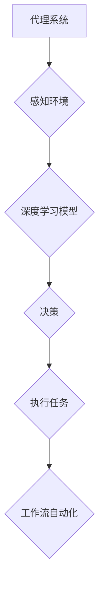

## AI人工智能代理工作流AI Agent WorkFlow：深度学习技术加强代理决策流程

> 关键词：人工智能代理、工作流自动化、深度学习、决策流程、强化学习、自然语言处理

## 1. 背景介绍

随着人工智能技术的飞速发展，代理系统逐渐成为解决复杂问题、自动化流程的关键技术。代理系统是指能够自主执行任务、与环境交互、并根据目标做出决策的智能体。传统的代理系统主要依赖规则和专家知识，但随着任务复杂度的增加，规则难以覆盖所有场景，专家知识的获取和维护也变得越来越困难。

深度学习技术的出现为代理系统带来了新的机遇。深度学习算法能够从海量数据中学习复杂的模式和关系，从而提高代理系统的决策能力和适应性。将深度学习技术应用于代理系统，可以构建更智能、更灵活、更强大的代理工作流。

## 2. 核心概念与联系

### 2.1 代理系统

代理系统是一个能够自主执行任务的软件程序或智能体。它通常具有以下特征：

* **自主性:** 代理系统能够独立地执行任务，无需人工干预。
* **感知能力:** 代理系统能够感知环境的变化，并获取相关信息。
* **决策能力:** 代理系统能够根据感知到的信息和预设的目标，做出决策并执行相应的行动。
* **学习能力:** 一些代理系统能够从经验中学习，并不断改进决策策略。

### 2.2 工作流自动化

工作流自动化是指通过软件工具自动执行一系列预定义的任务流程。它可以提高工作效率、减少人工错误，并释放人力资源用于更具价值的工作。

### 2.3 深度学习

深度学习是一种机器学习的子领域，它利用多层神经网络来模拟人类大脑的学习过程。深度学习算法能够从海量数据中学习复杂的模式和关系，从而实现图像识别、自然语言处理、语音识别等各种任务。

### 2.4 核心概念联系

深度学习技术可以增强代理系统的决策能力，使其能够更智能地执行工作流任务。

**Mermaid 流程图:**



## 3. 核心算法原理 & 具体操作步骤

### 3.1 算法原理概述

深度学习算法可以用于代理系统决策流程的优化。常用的深度学习算法包括：

* **强化学习:** 强化学习算法通过奖励机制来训练代理系统，使其在与环境交互的过程中不断学习最优策略。
* **深度神经网络:** 深度神经网络可以学习复杂的决策规则，并根据输入数据做出预测。
* **自然语言处理:** 自然语言处理技术可以帮助代理系统理解和处理自然语言文本，从而更好地感知环境信息。

### 3.2 算法步骤详解

**强化学习算法步骤:**

1. **环境建模:** 建立代理系统与环境交互的模型。
2. **状态空间定义:** 定义代理系统可能处于的所有状态。
3. **动作空间定义:** 定义代理系统可以执行的所有动作。
4. **奖励函数设计:** 设计一个奖励函数，用于评估代理系统在不同状态下执行不同动作的结果。
5. **策略学习:** 使用强化学习算法，例如 Q-学习或深度 Q-网络，训练代理系统学习最优策略。
6. **策略评估:** 使用训练好的策略评估代理系统在不同环境下的性能。

**深度神经网络算法步骤:**

1. **数据预处理:** 对输入数据进行预处理，例如归一化、特征提取等。
2. **网络结构设计:** 设计一个合适的深度神经网络结构，例如卷积神经网络或循环神经网络。
3. **模型训练:** 使用训练数据训练深度神经网络模型。
4. **模型评估:** 使用测试数据评估模型的性能。
5. **模型部署:** 将训练好的模型部署到实际应用场景中。

### 3.3 算法优缺点

**强化学习算法:**

* **优点:** 可以学习复杂的决策策略，并适应动态变化的环境。
* **缺点:** 训练过程可能需要大量的时间和资源，并且需要精心设计奖励函数。

**深度神经网络算法:**

* **优点:** 可以学习复杂的模式和关系，并实现高精度预测。
* **缺点:** 需要大量的数据进行训练，并且模型解释性较差。

### 3.4 算法应用领域

* **机器人控制:** 深度学习算法可以用于训练机器人执行复杂的任务，例如导航、抓取、识别等。
* **自动驾驶:** 深度学习算法可以用于训练自动驾驶系统，例如感知环境、规划路径、控制车辆等。
* **金融交易:** 深度学习算法可以用于预测股票价格、识别欺诈交易等。
* **医疗诊断:** 深度学习算法可以用于辅助医生诊断疾病、预测患者风险等。

## 4. 数学模型和公式 & 详细讲解 & 举例说明

### 4.1 数学模型构建

强化学习算法的核心是构建一个状态-动作-奖励的数学模型。

* **状态 (State):** 代理系统在环境中可能处于的各种状态。
* **动作 (Action):** 代理系统可以执行的各种动作。
* **奖励 (Reward):** 代理系统在执行某个动作后获得的奖励值。

### 4.2 公式推导过程

**Q-学习算法:**

Q-学习算法的目标是学习一个 Q 函数，该函数将每个状态-动作对映射到一个期望奖励值。

$$Q(s, a) = Q(s, a) + \alpha [r + \gamma \max_{a'} Q(s', a') - Q(s, a)]$$

其中:

* $Q(s, a)$ 是状态 $s$ 下执行动作 $a$ 的期望奖励值。
* $\alpha$ 是学习率，控制着学习速度。
* $r$ 是执行动作 $a$ 后获得的奖励值。
* $\gamma$ 是折扣因子，控制着未来奖励的权重。
* $s'$ 是执行动作 $a$ 后进入的下一个状态。
* $a'$ 是在下一个状态 $s'$ 中执行的动作。

### 4.3 案例分析与讲解

假设一个代理系统需要学习玩一个简单的游戏，例如贪吃蛇。

* **状态:** 游戏中的蛇的位置和方向。
* **动作:** 向上、向下、向左、向右移动。
* **奖励:** 吃到食物获得奖励，撞到墙壁或自身则获得惩罚。

使用 Q-学习算法，代理系统可以学习到在不同状态下执行不同动作的期望奖励值。通过不断地玩游戏并更新 Q 函数，代理系统最终可以学习到最优策略，即在任何状态下都能获得最高的奖励。

## 5. 项目实践：代码实例和详细解释说明

### 5.1 开发环境搭建

* Python 3.x
* TensorFlow 或 PyTorch 深度学习框架
* NumPy 科学计算库
* Matplotlib 数据可视化库

### 5.2 源代码详细实现

```python
import tensorflow as tf

# 定义 Q 函数网络
model = tf.keras.Sequential([
    tf.keras.layers.Dense(64, activation='relu', input_shape=(state_size,)),
    tf.keras.layers.Dense(64, activation='relu'),
    tf.keras.layers.Dense(action_size)
])

# 定义损失函数和优化器
optimizer = tf.keras.optimizers.Adam()
loss_fn = tf.keras.losses.MeanSquaredError()

# 训练循环
for episode in range(num_episodes):
    state = env.reset()
    done = False
    while not done:
        # 选择动作
        action = tf.argmax(model(tf.expand_dims(state, axis=0))).numpy()[0]

        # 执行动作并获取奖励和下一个状态
        next_state, reward, done, _ = env.step(action)

        # 更新 Q 函数
        with tf.GradientTape() as tape:
            q_values = model(tf.expand_dims(state, axis=0))
            target_q_value = reward + gamma * tf.reduce_max(model(tf.expand_dims(next_state, axis=0)))
            loss = loss_fn(target_q_value, q_values[0, action])

        # 反向传播并更新模型参数
        gradients = tape.gradient(loss, model.trainable_variables)
        optimizer.apply_gradients(zip(gradients, model.trainable_variables))

        state = next_state

# 保存训练好的模型
model.save('trained_model.h5')
```

### 5.3 代码解读与分析

* 代码首先定义了一个 Q 函数网络，该网络使用深度神经网络来学习状态-动作对的期望奖励值。
* 然后定义了损失函数和优化器，用于训练 Q 函数网络。
* 训练循环中，代理系统会与环境交互，执行动作并获取奖励和下一个状态。
* 根据得到的奖励和下一个状态，代理系统会更新 Q 函数网络的参数。
* 训练完成后，保存训练好的模型。

### 5.4 运行结果展示

训练好的模型可以用于控制代理系统执行任务。例如，在贪吃蛇游戏中，训练好的模型可以使代理系统能够有效地躲避障碍物，并尽可能地吃下食物。

## 6. 实际应用场景

### 6.1 自动化客服

深度学习技术可以用于训练聊天机器人，使其能够理解用户问题并提供准确的回复。

### 6.2 智能推荐系统

深度学习算法可以分析用户行为数据，并推荐用户可能感兴趣的商品或服务。

### 6.3 个性化教育

深度学习技术可以根据学生的学习进度和能力，提供个性化的学习内容和辅导。

### 6.4 未来应用展望

随着深度学习技术的不断发展，人工智能代理工作流将在更多领域得到应用，例如：

* **医疗保健:** 智能诊断、个性化治疗方案。
* **金融服务:** 风险评估、欺诈检测。
* **制造业:** 自动化生产、设备维护。
* **交通运输:** 自动驾驶、交通流量优化。

## 7. 工具和资源推荐

### 7.1 学习资源推荐

* **书籍:**
    * 深度学习
    * 强化学习
* **在线课程:**
    * Coursera: 深度学习
    * Udacity: 强化学习
* **博客和论坛:**
    * TensorFlow Blog
    * PyTorch Blog
    * Reddit: r/MachineLearning

### 7.2 开发工具推荐

* **TensorFlow:** 开源深度学习框架。
* **PyTorch:** 开源深度学习框架。
* **OpenAI Gym:** 强化学习环境库。

### 7.3 相关论文推荐

* Deep Reinforcement Learning: An Overview
* Proximal Policy Optimization Algorithms
* Attention Is All You Need

## 8. 总结：未来发展趋势与挑战

### 8.1 研究成果总结

深度学习技术为人工智能代理工作流带来了新的机遇，使得代理系统能够更智能地执行任务。强化学习算法和深度神经网络算法是构建智能代理系统的关键技术。

### 8.2 未来发展趋势

* **更强大的模型:** 研究更强大的深度学习模型，例如 Transformer 和 Generative Adversarial Networks (GANs)，以提高代理系统的决策能力和适应性。
* **更有效的训练方法:** 研究更有效的训练方法，例如 Transfer Learning 和 Federated Learning，以降低训练成本和时间。
* **更安全的代理系统:** 研究更安全的代理系统，以防止代理系统被恶意攻击或滥用。

### 8.3 面临的挑战

* **数据获取和标注:** 深度学习算法需要大量的数据进行训练，而获取和标注高质量的数据仍然是一个挑战。
* **模型解释性:** 深度学习模型的决策过程通常是不可解释的，这使得代理系统的行为难以理解和信任。
* **伦理问题:** 随着人工智能代理系统的应用越来越广泛，其伦理问题也