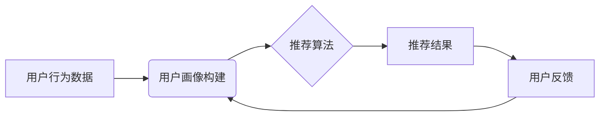

## AI在产品推荐系统中的应用

> 关键词：人工智能、推荐系统、协同过滤、内容过滤、深度学习、用户画像、个性化推荐

## 1. 背景介绍

在信息爆炸的时代，海量商品和服务充斥着我们的生活，用户在面对如此多的选择时，往往感到困惑和无所适从。产品推荐系统应运而生，旨在根据用户的历史行为、偏好和兴趣，智能地推荐他们可能感兴趣的产品或服务，从而提升用户体验，提高转化率。

传统的产品推荐系统主要依赖于基于规则的推荐和基于内容的推荐。然而，这些方法往往缺乏灵活性，难以捕捉用户复杂的个性化需求。随着人工智能技术的快速发展，特别是深度学习的兴起，AI在产品推荐系统中的应用取得了突破性进展，为用户提供更加精准、个性化的推荐体验。

## 2. 核心概念与联系

**2.1 核心概念**

* **推荐系统:**  旨在根据用户的历史行为、偏好和兴趣，预测用户对特定产品的喜好，并提供个性化的产品推荐。
* **用户画像:** 通过分析用户的行为数据、偏好信息等，构建用户个性化的特征描述，以便更好地理解用户的需求和兴趣。
* **协同过滤:**  基于用户的相似性或物品的相似性进行推荐。
* **内容过滤:**  根据物品的特征和用户对特征的偏好进行推荐。
* **深度学习:**  利用多层神经网络，从海量数据中学习复杂的特征和模式，实现更精准的推荐。

**2.2 架构图**



## 3. 核心算法原理 & 具体操作步骤

**3.1 算法原理概述**

推荐算法是推荐系统的核心，其目的是根据用户的历史行为和物品的特征，预测用户对特定物品的喜好。常见的推荐算法包括协同过滤、内容过滤和基于深度学习的推荐算法。

* **协同过滤:**  基于用户的相似性或物品的相似性进行推荐。
    * **用户-基于协同过滤:**  推荐与用户兴趣相似的其他用户的喜欢的物品。
    * **物品-基于协同过滤:**  推荐与用户之前喜欢的物品相似的其他物品。
* **内容过滤:**  根据物品的特征和用户对特征的偏好进行推荐。例如，如果用户喜欢阅读科幻小说，则推荐其他科幻小说。
* **深度学习推荐算法:**  利用深度神经网络从海量数据中学习复杂的特征和模式，实现更精准的推荐。例如，基于用户的历史行为、浏览记录、购买记录等数据，构建用户画像，并利用深度神经网络进行推荐。

**3.2 算法步骤详解**

以协同过滤算法为例，其具体操作步骤如下：

1. **数据收集:**  收集用户行为数据，例如用户对物品的评分、购买记录、浏览记录等。
2. **数据预处理:**  对收集到的数据进行清洗、转换和处理，例如去除缺失值、处理文本数据等。
3. **相似性计算:**  计算用户之间的相似度或物品之间的相似度。常用的相似度计算方法包括余弦相似度、皮尔逊相关系数等。
4. **推荐生成:**  根据用户与其他用户的相似度或用户与物品的相似度，生成推荐列表。
5. **结果评估:**  评估推荐算法的性能，常用的评估指标包括准确率、召回率、F1-score等。

**3.3 算法优缺点**

* **协同过滤:**
    * **优点:**  能够捕捉用户之间的隐性关系，推荐结果更精准。
    * **缺点:**  数据稀疏性问题，当用户对物品评分较少时，难以计算出准确的相似度。
* **内容过滤:**
    * **优点:**  能够解释推荐理由，用户更容易理解推荐结果。
    * **缺点:**  难以捕捉用户之间的隐性关系，推荐结果可能不够个性化。
* **深度学习推荐算法:**
    * **优点:**  能够学习复杂的特征和模式，推荐结果更精准。
    * **缺点:**  需要大量的训练数据，训练成本较高。

**3.4 算法应用领域**

推荐算法广泛应用于各个领域，例如：

* **电子商务:**  商品推荐、个性化营销
* **社交媒体:**  好友推荐、内容推荐
* **音乐流媒体:**  歌曲推荐、音乐播放列表推荐
* **视频网站:**  视频推荐、用户个性化内容推荐
* **新闻资讯:**  新闻推荐、个性化新闻订阅

## 4. 数学模型和公式 & 详细讲解 & 举例说明

**4.1 数学模型构建**

协同过滤算法的核心是计算用户之间的相似度或物品之间的相似度。常用的相似度计算方法包括余弦相似度和皮尔逊相关系数。

* **余弦相似度:**  衡量两个向量的夹角大小，值范围在-1到1之间，其中1表示完全相似，-1表示完全相反，0表示不相关。

$$
\text{余弦相似度}(u,v) = \frac{u \cdot v}{||u|| ||v||}
$$

其中，u和v是两个用户或物品的特征向量，u·v表示两个向量的点积，||u||和||v||表示两个向量的模长。

* **皮尔逊相关系数:**  衡量两个变量之间的线性相关性，值范围在-1到1之间，其中1表示完全正相关，-1表示完全负相关，0表示不相关。

$$
\text{皮尔逊相关系数}(u,v) = \frac{\sum_{i=1}^{n}(u_i - \bar{u})(v_i - \bar{v})}{\sqrt{\sum_{i=1}^{n}(u_i - \bar{u})^2} \sqrt{\sum_{i=1}^{n}(v_i - \bar{v})^2}}
$$

其中，u和v是两个用户或物品的评分向量，$\bar{u}$和$\bar{v}$分别是u和v的平均评分。

**4.2 公式推导过程**

余弦相似度的推导过程如下：

1. 两个向量的点积表示两个向量在同一方向上的投影长度。
2. 两个向量的模长表示两个向量的长度。
3. 余弦相似度等于两个向量的点积除以两个向量的模长乘积，即两个向量在同一方向上的投影长度与两个向量长度的比值。

**4.3 案例分析与讲解**

假设有两个用户A和B，他们的评分向量分别为：

* A = [5, 4, 3, 2, 1]
* B = [4, 3, 2, 1, 5]

我们可以使用余弦相似度计算A和B之间的相似度：

1. 计算A和B的点积：5*4 + 4*3 + 3*2 + 2*1 + 1*5 = 40

2. 计算A和B的模长：

* ||A|| = √(5^2 + 4^2 + 3^2 + 2^2 + 1^2) = √55
* ||B|| = √(4^2 + 3^2 + 2^2 + 1^2 + 5^2) = √55

3. 计算余弦相似度：

$$
\text{余弦相似度}(A,B) = \frac{40}{\sqrt{55} \sqrt{55}} = \frac{40}{55} \approx 0.73
$$

因此，A和B之间的余弦相似度约为0.73，表示他们有一定的相似性。

## 5. 项目实践：代码实例和详细解释说明

**5.1 开发环境搭建**

* Python 3.x
* scikit-learn
* pandas
* numpy

**5.2 源代码详细实现**

```python
import pandas as pd
from sklearn.metrics.pairwise import cosine_similarity

# 加载用户评分数据
ratings_data = pd.read_csv('ratings.csv')

# 计算用户之间的余弦相似度
user_similarity = cosine_similarity(ratings_data)

# 获取用户ID
user_id = 'user1'

# 获取与用户ID相似的用户
similar_users = user_similarity[ratings_data.index.get_loc(user_id)].argsort()[:-6:-1]

# 获取相似用户喜欢的物品
similar_items = ratings_data.loc[similar_users].mean().sort_values(ascending=False)

# 打印推荐结果
print(f'推荐给用户 {user_id} 的物品：')
print(similar_items)
```

**5.3 代码解读与分析**

1. 加载用户评分数据，数据格式为用户ID、物品ID、评分。
2. 使用scikit-learn库中的cosine_similarity函数计算用户之间的余弦相似度。
3. 获取用户ID，并使用相似度矩阵找到与该用户相似的用户。
4. 获取相似用户喜欢的物品，并计算平均评分。
5. 打印推荐结果，显示出与用户ID相似的用户喜欢的物品。

**5.4 运行结果展示**

运行代码后，将输出与用户ID相似的用户喜欢的物品，并按照评分排序。

## 6. 实际应用场景

**6.1 电子商务**

* **商品推荐:**  根据用户的浏览历史、购买记录、收藏列表等数据，推荐用户可能感兴趣的商品。
* **个性化营销:**  根据用户的兴趣爱好、购买偏好等数据，推送个性化的广告和促销信息。

**6.2 社交媒体**

* **好友推荐:**  根据用户的兴趣爱好、社交关系等数据，推荐可能成为朋友的人。
* **内容推荐:**  根据用户的浏览历史、点赞记录、评论内容等数据，推荐用户可能感兴趣的内容。

**6.3 音乐流媒体**

* **歌曲推荐:**  根据用户的播放历史、收藏列表、喜欢的歌手等数据，推荐用户可能喜欢的歌曲。
* **音乐播放列表推荐:**  根据用户的播放历史、喜欢的音乐风格等数据，推荐用户可能喜欢的音乐播放列表。

**6.4 视频网站**

* **视频推荐:**  根据用户的观看历史、点赞记录、评论内容等数据，推荐用户可能感兴趣的视频。
* **用户个性化内容推荐:**  根据用户的兴趣爱好、观看习惯等数据，推荐用户可能喜欢的视频类型、频道等。

**6.5 新闻资讯**

* **新闻推荐:**  根据用户的阅读历史、关注的主题等数据，推荐用户可能感兴趣的新闻。
* **个性化新闻订阅:**  根据用户的兴趣爱好、阅读习惯等数据，推荐用户可能喜欢的新闻订阅服务。

**6.6 未来应用展望**

随着人工智能技术的不断发展，AI在产品推荐系统中的应用将更加广泛和深入。例如：

* **更精准的推荐:**  利用深度学习等先进算法，从海量数据中学习用户的复杂需求，实现更精准的推荐。
* **个性化体验:**  根据用户的个性化需求，提供更加个性化的推荐体验，例如推荐个性化商品组合、定制化音乐播放列表等。
* **跨平台推荐:**  将用户数据整合到不同的平台，实现跨平台的个性化推荐。
* **推荐解释性:**  解释推荐结果背后的逻辑，帮助用户理解推荐的原因，提升用户信任度。

## 7. 工具和资源推荐

**7.1 学习资源推荐**

* **书籍:**
    * 《推荐系统实践》
    * 《深度学习》
* **在线课程:**
    * Coursera: Recommender Systems
    * Udacity: Deep Learning Nanodegree
* **博客:**
    * Recommender Systems Blog
    * Towards Data Science

**7.2 开发工具推荐**

* **Python:**  广泛应用于推荐系统开发，拥有丰富的库和工具。
* **scikit-learn:**  机器学习库，提供各种推荐算法实现。
* **TensorFlow/PyTorch:**  深度学习框架，用于构建更复杂的推荐模型。
* **Spark:**  大数据