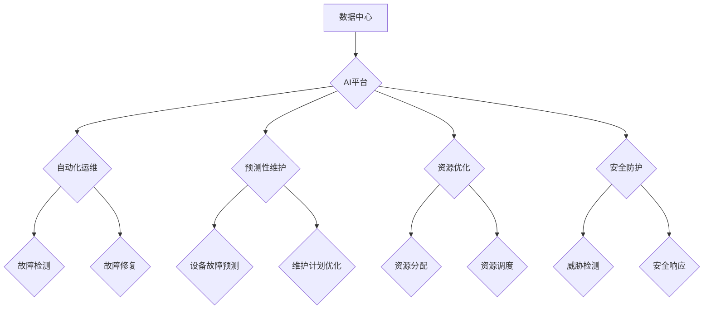

## AI在数字基础设施中的实际应用

> 关键词：人工智能、数字基础设施、机器学习、自动化运维、预测性维护、云计算、数据中心

## 1. 背景介绍

随着数字经济的蓬勃发展，数字基础设施作为经济社会运行的基石，承担着越来越重要的责任。传统数字基础设施面临着日益增长的挑战，例如：

* **复杂性不断增加:** 数字基础设施规模庞大，包含各种硬件、软件和网络设备，管理和维护难度不断提高。
* **资源利用率低:**  传统基础设施往往存在资源闲置和浪费的情况，难以满足快速变化的业务需求。
* **安全风险高:**  网络攻击和数据泄露等安全风险日益突出，对基础设施安全性和可靠性提出了更高的要求。

人工智能（AI）技术的快速发展为解决这些挑战提供了新的思路和方法。AI能够通过学习和分析海量数据，自动识别模式、预测趋势和做出决策，从而提高数字基础设施的效率、安全性、可靠性和可扩展性。

## 2. 核心概念与联系

**2.1 数字基础设施**

数字基础设施是指支撑数字经济运行的硬件、软件、网络和数据等基础资源，包括数据中心、网络设备、云计算平台、数据库等。

**2.2 人工智能**

人工智能是指模拟人类智能行为的计算机系统，包括机器学习、深度学习、自然语言处理等技术。

**2.3 AI在数字基础设施中的应用**

AI技术可以应用于数字基础设施的各个环节，例如：

* **自动化运维:**  AI可以自动监控基础设施状态、识别故障、执行修复操作，提高运维效率和自动化程度。
* **预测性维护:**  AI可以分析设备运行数据，预测潜在故障，提前进行维护，降低故障率和维护成本。
* **资源优化:**  AI可以根据业务需求动态分配资源，提高资源利用率和整体效率。
* **安全防护:**  AI可以识别网络攻击和恶意行为，及时采取防御措施，保障基础设施安全。

**2.4 架构图**



## 3. 核心算法原理 & 具体操作步骤

### 3.1 算法原理概述

AI在数字基础设施中的应用主要依赖于以下核心算法：

* **机器学习:**  通过训练模型，使模型能够从数据中学习规律，并对新数据进行预测或分类。
* **深度学习:**  一种更高级的机器学习方法，利用多层神经网络模拟人类大脑的学习过程，能够处理更复杂的数据和任务。
* **自然语言处理:**  使计算机能够理解和处理人类语言，例如文本分析、语音识别等。

### 3.2 算法步骤详解

以自动化运维为例，其核心算法步骤如下：

1. **数据采集:**  从基础设施设备收集各种运行数据，例如CPU使用率、内存占用、网络流量等。
2. **数据预处理:**  对采集到的数据进行清洗、转换和格式化，使其适合模型训练。
3. **模型训练:**  利用机器学习算法，训练模型以识别正常运行状态和异常情况。
4. **模型部署:**  将训练好的模型部署到生产环境中，用于实时监控基础设施状态。
5. **异常检测:**  模型对实时数据进行分析，识别潜在故障或异常情况。
6. **告警处理:**  当模型检测到异常情况时，触发告警机制，通知运维人员进行处理。
7. **故障修复:**  根据模型的分析结果和运维人员的判断，执行相应的故障修复操作。

### 3.3 算法优缺点

**优点:**

* **自动化程度高:**  可以自动完成许多重复性任务，提高运维效率。
* **响应速度快:**  可以实时监控基础设施状态，及时发现和处理故障。
* **准确性高:**  基于机器学习算法，能够识别出传统方法难以发现的异常情况。

**缺点:**

* **数据依赖性强:**  模型的性能取决于训练数据的质量和数量。
* **解释性差:**  一些深度学习模型的决策过程难以解释，难以进行故障诊断。
* **安全风险:**  模型本身可能存在漏洞，被攻击者利用进行恶意操作。

### 3.4 算法应用领域

* **自动化运维:**  监控基础设施状态、识别故障、执行修复操作。
* **预测性维护:**  预测设备故障，提前进行维护。
* **资源优化:**  根据业务需求动态分配资源，提高资源利用率。
* **安全防护:**  识别网络攻击和恶意行为，及时采取防御措施。

## 4. 数学模型和公式 & 详细讲解 & 举例说明

### 4.1 数学模型构建

在AI驱动的数字基础设施中，常用的数学模型包括：

* **线性回归:**  用于预测连续变量，例如设备性能指标。
* **逻辑回归:**  用于分类问题，例如识别正常运行状态和异常情况。
* **支持向量机:**  用于分类和回归问题，能够处理高维数据。
* **神经网络:**  用于更复杂的任务，例如图像识别、自然语言处理。

### 4.2 公式推导过程

以线性回归为例，其目标是找到一条直线，使得预测值与实际值之间的误差最小。

**公式:**

$$y = mx + c$$

其中：

* $y$ 是预测值
* $x$ 是输入特征
* $m$ 是斜率
* $c$ 是截距

**损失函数:**

$$Loss = \sum_{i=1}^{n}(y_i - \hat{y}_i)^2$$

其中：

* $n$ 是样本数量
* $y_i$ 是实际值
* $\hat{y}_i$ 是预测值

**梯度下降算法:**

通过迭代更新 $m$ 和 $c$ 的值，使得损失函数最小化。

### 4.3 案例分析与讲解

假设我们要预测服务器的CPU使用率。我们可以收集服务器的历史CPU使用率数据，以及相关特征数据，例如时间、负载等。

利用线性回归模型，我们可以训练出一个模型，将CPU使用率与相关特征进行映射。

然后，我们可以将新的数据输入到模型中，预测服务器的CPU使用率。

## 5. 项目实践：代码实例和详细解释说明

### 5.1 开发环境搭建

* 操作系统：Ubuntu 20.04
* Python 版本：3.8
* 必要的库：pandas, numpy, scikit-learn

### 5.2 源代码详细实现

```python
import pandas as pd
from sklearn.linear_model import LinearRegression

# 加载数据
data = pd.read_csv('server_data.csv')

# 选择特征和目标变量
features = ['time', 'load']
target = 'cpu_usage'

# 训练模型
model = LinearRegression()
model.fit(data[features], data[target])

# 预测CPU使用率
new_data = pd.DataFrame({'time': [16, 17, 18], 'load': [2.5, 3.0, 3.5]})
predicted_cpu_usage = model.predict(new_data)

# 打印预测结果
print(predicted_cpu_usage)
```

### 5.3 代码解读与分析

* 首先，我们加载数据并选择特征和目标变量。
* 然后，我们使用线性回归模型训练模型。
* 训练完成后，我们可以使用模型预测新的数据。
* 最后，我们打印预测结果。

### 5.4 运行结果展示

运行代码后，会输出预测的CPU使用率值。

## 6. 实际应用场景

### 6.1 自动化运维

AI可以自动监控基础设施状态，识别故障，执行修复操作，提高运维效率和自动化程度。例如，可以利用AI识别服务器CPU使用率过高的情况，并自动启动虚拟机迁移操作，避免服务器宕机。

### 6.2 预测性维护

AI可以分析设备运行数据，预测潜在故障，提前进行维护，降低故障率和维护成本。例如，可以利用AI预测硬盘即将失效的情况，并提前更换硬盘，避免数据丢失。

### 6.3 资源优化

AI可以根据业务需求动态分配资源，提高资源利用率和整体效率。例如，可以利用AI根据用户访问流量变化，动态调整服务器资源分配，提高资源利用率。

### 6.4 未来应用展望

随着AI技术的不断发展，其在数字基础设施中的应用将更加广泛和深入。例如：

* **智能化运维:**  AI可以实现更智能化的运维，例如自动诊断故障、自动修复故障、自动优化资源配置。
* **自愈式基础设施:**  AI可以使基础设施具备自愈能力，例如自动识别和修复故障，无需人工干预。
* **个性化服务:**  AI可以根据用户的需求，提供个性化的基础设施服务，例如自动调整服务器性能、自动优化网络带宽。

## 7. 工具和资源推荐

### 7.1 学习资源推荐

* **书籍:**
    * 《深度学习》
    * 《机器学习实战》
* **在线课程:**
    * Coursera: 深度学习
    * edX: 机器学习
* **博客和网站:**
    * TensorFlow Blog
    * PyTorch Blog

### 7.2 开发工具推荐

* **TensorFlow:**  开源深度学习框架
* **PyTorch:**  开源深度学习框架
* **Scikit-learn:**  机器学习库

### 7.3 相关论文推荐

* **Attention Is All You Need:**  Transformer模型的论文
* **BERT: Pre-training of Deep Bidirectional Transformers for Language Understanding:**  BERT模型的论文

## 8. 总结：未来发展趋势与挑战

### 8.1 研究成果总结

AI技术在数字基础设施领域的应用取得了显著成果，例如自动化运维、预测性维护、资源优化等。

### 8.2 未来发展趋势

* **更智能化的运维:**  AI将实现更智能化的运维，例如自动诊断故障、自动修复故障、自动优化资源配置。
* **自愈式基础设施:**  AI将使基础设施具备自愈能力，例如自动识别和修复故障，无需人工干预。
* **个性化服务:**  AI将根据用户的需求，提供个性化的基础设施服务，例如自动调整服务器性能、自动优化网络带宽。

### 8.3 面临的挑战

* **数据质量:**  AI模型的性能取决于训练数据的质量和数量。
* **模型解释性:**  一些深度学习模型的决策过程难以解释，难以进行故障诊断。
* **安全风险:**  模型本身可能存在漏洞，被攻击者利用进行恶意操作。

### 8.4 研究展望

未来，我们需要继续研究如何提高AI模型的准确性、解释性和安全性，以及如何将AI技术应用于更广泛的数字基础设施场景。


## 9. 附录：常见问题与解答

**Q1: AI在数字基础设施中的应用有哪些？**

**A1:** AI可以应用于数字基础设施的各个环节，例如自动化运维、预测性维护、资源优化、安全防护等。

**Q2: AI模型的训练需要哪些数据？**

**A2:** AI模型的训练需要大量的相关数据，例如服务器运行数据、网络流量数据、安全事件数据等。

**Q3: 如何保证AI模型的安全性？**

**A3:**  可以通过多种方法保证AI模型的安全性，例如数据加密、模型安全审计、攻击检测等。


作者：禅与计算机程序设计艺术 / Zen and the Art of Computer Programming 
