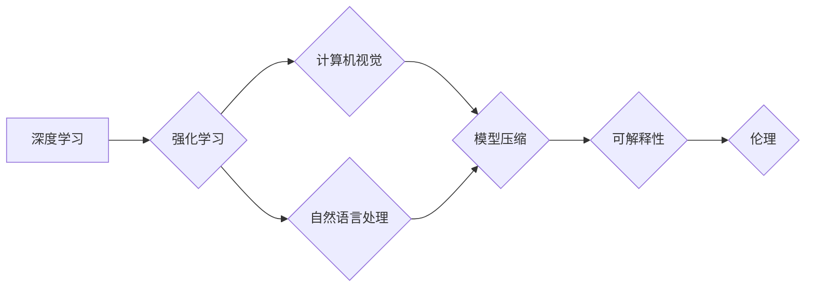

## Andrej Karpathy：人工智能的未来发展策略

> 关键词：人工智能、深度学习、强化学习、计算机视觉、自然语言处理、模型压缩、可解释性、伦理

### 1. 背景介绍

人工智能（AI）正以惊人的速度发展，从自动驾驶到医疗诊断，AI技术正在改变着我们生活的方方面面。作为AI领域的领军人物，Andrej Karpathy 始终关注着AI技术的未来发展方向，并提出了许多具有前瞻性的观点。本文将探讨Karpathy先生关于AI未来发展策略的一些关键思想，并结合当前的技术趋势进行分析和展望。

### 2. 核心概念与联系

Karpathy先生认为，AI未来的发展将围绕以下几个核心概念展开：

* **深度学习:** 深度学习是目前AI领域最成功的技术之一，它能够从海量数据中学习复杂的模式和特征。
* **强化学习:** 强化学习是一种基于奖励机制的学习方法，它能够使AI系统在与环境交互的过程中不断优化行为策略。
* **计算机视觉:** 计算机视觉是让计算机“看”世界的能力，它在图像识别、物体检测、视频分析等领域有着广泛的应用。
* **自然语言处理:** 自然语言处理是让计算机理解和生成人类语言的能力，它在机器翻译、文本摘要、对话系统等领域有着重要的应用价值。
* **模型压缩:** 模型压缩是指将大型AI模型压缩成更小的规模，以便于部署在资源有限的设备上。
* **可解释性:** 可解释性是指能够理解AI模型的决策过程，以便于人类对其进行信任和监管。
* **伦理:** 随着AI技术的不断发展，其伦理问题也日益凸显，例如算法偏见、数据隐私等问题需要得到妥善解决。

这些核心概念相互关联，共同推动着AI技术的进步。

**Mermaid 流程图:**



### 3. 核心算法原理 & 具体操作步骤

#### 3.1  算法原理概述

深度学习算法的核心是多层神经网络，它能够通过学习数据中的特征表示来完成各种任务。

* **感知器:** 最基本的深度学习单元，它接收输入信号，并通过加权求和和激活函数输出结果。
* **神经网络层:** 由多个感知器组成，它们之间通过连接权重进行信息传递。
* **卷积神经网络 (CNN):** 特别适用于图像处理任务，它利用卷积操作来提取图像特征。
* **循环神经网络 (RNN):** 特别适用于序列数据处理任务，例如自然语言处理，它能够捕获序列中的时间依赖关系。

#### 3.2  算法步骤详解

1. **数据预处理:** 将原始数据转换为深度学习算法可以理解的格式，例如归一化、编码等。
2. **网络结构设计:** 根据任务需求设计神经网络的层数、节点数、激活函数等参数。
3. **参数初始化:** 为神经网络中的连接权重赋予初始值。
4. **前向传播:** 将输入数据通过神经网络传递，计算输出结果。
5. **反向传播:** 计算输出结果与真实值的误差，并根据误差调整连接权重。
6. **优化算法:** 使用梯度下降等优化算法来更新连接权重，使得模型的输出结果越来越接近真实值。
7. **模型评估:** 使用测试数据评估模型的性能，例如准确率、召回率等指标。

#### 3.3  算法优缺点

**优点:**

* 能够学习复杂的非线性关系。
* 性能优于传统机器学习算法。
* 可应用于多种任务，例如图像识别、自然语言处理等。

**缺点:**

* 需要海量数据进行训练。
* 计算资源消耗大。
* 模型可解释性差。

#### 3.4  算法应用领域

深度学习算法已广泛应用于以下领域:

* **计算机视觉:** 图像识别、物体检测、图像分割、视频分析等。
* **自然语言处理:** 机器翻译、文本摘要、情感分析、对话系统等。
* **语音识别:** 语音转文本、语音合成等。
* **推荐系统:** 商品推荐、内容推荐等。
* **医疗诊断:** 疾病诊断、影像分析等。

### 4. 数学模型和公式 & 详细讲解 & 举例说明

#### 4.1  数学模型构建

深度学习算法的核心是神经网络，它可以看作是一个复杂的数学模型。神经网络的输入层接收原始数据，经过多个隐藏层处理后输出最终结果。每个隐藏层由多个神经元组成，每个神经元接收来自上一层的输入信号，并通过加权求和和激活函数进行处理。

#### 4.2  公式推导过程

* **加权求和:** 每个神经元接收来自上一层神经元的输入信号，并将其与相应的权重相乘，然后将所有乘积相加。

$$
z = w_1x_1 + w_2x_2 +... + w_nx_n + b
$$

其中：

* $z$ 是神经元的输出值。
* $w_i$ 是连接第 $i$ 个输入神经元和当前神经元的权重。
* $x_i$ 是第 $i$ 个输入神经元的输出值。
* $b$ 是神经元的偏置项。

* **激活函数:** 激活函数将加权求和后的值映射到输出区间，例如 sigmoid 函数、ReLU 函数等。

$$
a = f(z)
$$

其中：

* $a$ 是神经元的输出值。
* $f(z)$ 是激活函数。

#### 4.3  案例分析与讲解

例如，在图像识别任务中，CNN 可以学习图像特征。卷积层通过卷积操作提取图像局部特征，池化层则对特征进行降维，最终输出图像的全局特征表示。

### 5. 项目实践：代码实例和详细解释说明

#### 5.1  开发环境搭建

使用 Python 作为编程语言，并安装必要的深度学习库，例如 TensorFlow、PyTorch 等。

#### 5.2  源代码详细实现

以下是一个简单的 CNN 代码示例，用于图像分类任务：

```python
import tensorflow as tf

# 定义模型结构
model = tf.keras.models.Sequential([
    tf.keras.layers.Conv2D(32, (3, 3), activation='relu', input_shape=(28, 28, 1)),
    tf.keras.layers.MaxPooling2D((2, 2)),
    tf.keras.layers.Conv2D(64, (3, 3), activation='relu'),
    tf.keras.layers.MaxPooling2D((2, 2)),
    tf.keras.layers.Flatten(),
    tf.keras.layers.Dense(10, activation='softmax')
])

# 编译模型
model.compile(optimizer='adam',
              loss='sparse_categorical_crossentropy',
              metrics=['accuracy'])

# 训练模型
model.fit(x_train, y_train, epochs=10)

# 评估模型
loss, accuracy = model.evaluate(x_test, y_test)
print('Test loss:', loss)
print('Test accuracy:', accuracy)
```

#### 5.3  代码解读与分析

* **模型结构:** 该模型包含两层卷积层、两层池化层、一层全连接层和一层输出层。
* **激活函数:** 使用 ReLU 函数作为激活函数，可以提高模型的训练效率。
* **损失函数:** 使用 sparse_categorical_crossentropy 作为损失函数，适用于多分类任务。
* **优化器:** 使用 Adam 优化器，可以快速收敛到局部最优解。

#### 5.4  运行结果展示

训练完成后，可以评估模型的性能，例如在测试集上的准确率。

### 6. 实际应用场景

深度学习算法已广泛应用于以下实际场景:

* **自动驾驶:** 用于识别道路标志、车辆、行人等，辅助驾驶决策。
* **医疗诊断:** 用于分析医学影像，辅助医生诊断疾病。
* **金融风险控制:** 用于识别欺诈交易、评估信用风险等。
* **个性化推荐:** 用于推荐商品、内容、服务等，提高用户体验。

### 6.4  未来应用展望

未来，深度学习算法将应用于更多领域，例如:

* **科学研究:** 用于加速药物研发、材料设计等。
* **教育:** 用于个性化教学、智能辅导等。
* **艺术创作:** 用于生成音乐、绘画、文字等。

### 7. 工具和资源推荐

#### 7.1  学习资源推荐

* **书籍:**
    * Deep Learning by Ian Goodfellow, Yoshua Bengio, and Aaron Courville
    * Hands-On Machine Learning with Scikit-Learn, Keras & TensorFlow by Aurélien Géron
* **在线课程:**
    * Deep Learning Specialization by Andrew Ng (Coursera)
    * Fast.ai
* **博客和网站:**
    * Andrej Karpathy's Blog
    * OpenAI Blog
    * Google AI Blog

#### 7.2  开发工具推荐

* **TensorFlow:** 开源深度学习框架，支持多种硬件平台。
* **PyTorch:** 开源深度学习框架，以其灵活性和易用性而闻名。
* **Keras:** 高级深度学习API，可以运行在 TensorFlow、Theano 或 CNTK 后端。

#### 7.3  相关论文推荐

* **ImageNet Classification with Deep Convolutional Neural Networks** by Alex Krizhevsky, Ilya Sutskever, and Geoffrey E. Hinton
* **Attention Is All You Need** by Ashish Vaswani, Noam Shazeer, Niki Parmar, Jakob Uszkoreit, Llion Jones, Aidan N. Gomez, Łukasz Kaiser, and Illia Polosukhin

### 8. 总结：未来发展趋势与挑战

#### 8.1  研究成果总结

近年来，深度学习取得了令人瞩目的成就，在图像识别、自然语言处理等领域取得了突破性进展。

#### 8.2  未来发展趋势

* **模型规模和效率:** 研究更大型、更高效的深度学习模型，例如 Transformer、BERT 等。
* **可解释性:** 研究如何提高深度学习模型的可解释性，以便于人类理解其决策过程。
* **安全性和鲁棒性:** 研究如何提高深度学习模型的安全性和鲁棒性，使其能够应对对抗攻击和噪声数据。
* **跨模态学习:** 研究如何让深度学习模型能够处理多种模态数据，例如图像、文本、音频等。

#### 8.3  面临的挑战

* **数据获取和标注:** 深度学习算法需要海量数据进行训练，数据获取和标注成本高昂。
* **计算资源:** 训练大型深度学习模型需要大量的计算资源，例如 GPU、TPU 等。
* **伦理问题:** 深度学习算法可能存在偏见、歧视等伦理问题，需要得到妥善解决。

#### 8.4  研究展望

未来，深度学习研究将继续朝着更强大、更安全、更可解释的方向发展，并应用于更多领域，改变我们的生活方式。

### 9. 附录：常见问题与解答

* **什么是深度学习？**

深度学习是一种机器学习的子领域，它使用多层神经网络来学习数据中的复杂模式和特征。

* **深度学习算法有哪些？**

常见的深度学习算法包括卷积神经网络 (CNN)、循环神经网络 (RNN)、Transformer 等。

* **深度学习算法的应用领域有哪些？**

深度学习算法已广泛应用于图像识别、自然语言处理、语音识别、推荐系统等领域。

* **如何学习深度学习？**

可以通过阅读书籍、在线课程、博客等方式学习深度学习。

* **如何部署深度学习模型？**

可以使用 TensorFlow Serving、TorchServe 等工具将深度学习模型部署到生产环境中。


