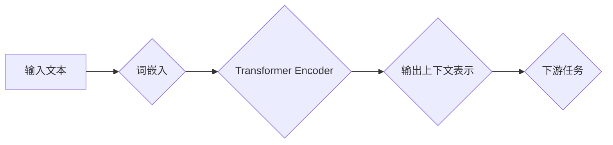

## BERT原理与代码实例讲解

> 关键词：BERT, Transformer, 自然语言处理, 预训练语言模型, 文本理解, 代码实例

## 1. 背景介绍

近年来，深度学习在自然语言处理 (NLP) 领域取得了显著进展。其中，预训练语言模型 (Pretrained Language Model，PLM) 作为一种强大的工具，在各种 NLP 任务中展现出令人瞩目的性能。BERT (Bidirectional Encoder Representations from Transformers) 是 Google AI 团队于 2018 年提出的一个基于 Transformer 架构的 PLM，凭借其强大的文本理解能力和优异的性能，迅速成为 NLP 领域的研究热点和应用主流。

传统的 NLP 模型通常采用单向编码方式，只考虑词语的前后上下文信息，而 BERT 则采用双向编码方式，同时考虑词语前后上下文信息，从而更全面地理解词语的语义。此外，BERT 还利用了大量的文本数据进行预训练，学习了丰富的语言知识，为下游任务提供了强大的基础。

## 2. 核心概念与联系

BERT 的核心概念包括 Transformer、BERT 架构、Masked Language Modeling (MLM) 和 Next Sentence Prediction (NSP)。

**2.1 Transformer**

Transformer 是 BERT 的基础架构，是一种新型的序列到序列模型，其特点是并行计算能力强，能够有效处理长序列数据。Transformer 的核心组件包括：

* **自注意力机制 (Self-Attention)**：能够捕捉词语之间的上下文关系，理解词语之间的依赖性。
* **多头注意力机制 (Multi-Head Attention)**：通过多个注意力头，从不同的角度捕捉词语之间的关系，提高模型的表达能力。
* **前馈神经网络 (Feed-Forward Network)**：对每个词语的表示进行非线性变换，进一步提取语义特征。

**2.2 BERT 架构**

BERT 的架构由多个 Transformer encoder 层组成，每个 encoder 层包含多个自注意力层和前馈神经网络层。BERT 的输入是词嵌入向量，经过 Transformer encoder 层的处理后，输出每个词语的上下文表示向量。

**2.3 Masked Language Modeling (MLM)**

MLM 是 BERT 的预训练任务之一，其目标是预测被掩盖的词语。在训练过程中，BERT 会随机掩盖输入文本中的部分词语，然后根据上下文信息预测被掩盖的词语。

**2.4 Next Sentence Prediction (NSP)**

NSP 是 BERT 的另一个预训练任务，其目标是判断两个句子是否连续。BERT 会将两个句子作为输入，然后预测这两个句子是否相邻。

**2.5 BERT 流程图**



## 3. 核心算法原理 & 具体操作步骤

### 3.1 算法原理概述

BERT 的核心算法原理是基于 Transformer 架构的双向编码和预训练策略。

* **双向编码**: BERT 采用双向编码方式，同时考虑词语前后上下文信息，从而更全面地理解词语的语义。
* **预训练**: BERT 在大量的文本数据上进行预训练，学习了丰富的语言知识，为下游任务提供了强大的基础。

### 3.2 算法步骤详解

BERT 的训练过程可以分为以下几个步骤：

1. **词嵌入**: 将输入文本中的每个词语转换为词嵌入向量。
2. **Transformer Encoder**: 将词嵌入向量输入 Transformer encoder 层，经过多个自注意力层和前馈神经网络层的处理，得到每个词语的上下文表示向量。
3. **Masked Language Modeling (MLM)**: 在训练过程中，随机掩盖输入文本中的部分词语，然后根据上下文信息预测被掩盖的词语。
4. **Next Sentence Prediction (NSP)**: 将两个句子作为输入，然后预测这两个句子是否相邻。
5. **参数更新**: 根据 MLM 和 NSP 的损失函数，更新 BERT 的模型参数。

### 3.3 算法优缺点

**优点**:

* **强大的文本理解能力**: BERT 能够捕捉词语之间的上下文关系，理解词语的语义。
* **预训练策略**: BERT 在大量的文本数据上进行预训练，学习了丰富的语言知识，为下游任务提供了强大的基础。
* **开源**: BERT 的代码和预训练模型是开源的，方便研究和应用。

**缺点**:

* **计算资源要求高**: BERT 的训练过程需要大量的计算资源。
* **参数量大**: BERT 的参数量较大，需要较大的内存空间进行存储和计算。

### 3.4 算法应用领域

BERT 在各种 NLP 任务中取得了优异的性能，例如：

* **文本分类**: 识别文本的类别，例如情感分析、主题分类等。
* **问答系统**: 回答用户提出的问题。
* **机器翻译**: 将文本从一种语言翻译成另一种语言。
* **文本摘要**: 生成文本的简短摘要。
* **文本生成**: 生成新的文本内容。

## 4. 数学模型和公式 & 详细讲解 & 举例说明

### 4.1 数学模型构建

BERT 的数学模型主要基于 Transformer 架构，其核心组件是自注意力机制和前馈神经网络。

**4.1.1 自注意力机制**

自注意力机制能够捕捉词语之间的上下文关系，理解词语之间的依赖性。其计算公式如下：

$$
Attention(Q, K, V) = \frac{exp(Q \cdot K^T / \sqrt{d_k})}{exp(Q \cdot K^T / \sqrt{d_k})} \cdot V
$$

其中：

* $Q$：查询矩阵
* $K$：键矩阵
* $V$：值矩阵
* $d_k$：键向量的维度

**4.1.2 前馈神经网络**

前馈神经网络对每个词语的表示进行非线性变换，进一步提取语义特征。其结构通常为两层全连接神经网络，中间使用 ReLU 激活函数。

### 4.2 公式推导过程

自注意力机制的计算公式可以推导如下：

1. 将查询矩阵 $Q$、键矩阵 $K$ 和值矩阵 $V$ 进行矩阵乘法，得到一个分数矩阵。
2. 对分数矩阵进行 softmax 操作，得到一个归一化分数矩阵。
3. 将归一化分数矩阵与值矩阵 $V$ 进行矩阵乘法，得到最终的注意力输出。

### 4.3 案例分析与讲解

假设我们有一个句子 "The cat sat on the mat"，其词嵌入向量分别为：

* The: [0.1, 0.2, 0.3]
* cat: [0.4, 0.5, 0.6]
* sat: [0.7, 0.8, 0.9]
* on: [1.0, 1.1, 1.2]
* the: [0.1, 0.2, 0.3]
* mat: [1.3, 1.4, 1.5]

我们可以使用自注意力机制计算每个词语与其他词语之间的注意力权重，从而理解词语之间的关系。例如，我们可以计算 "cat" 与 "sat" 之间的注意力权重，发现它们之间的关系较强，因为 "cat" 经常与 "sat" 一起出现。

## 5. 项目实践：代码实例和详细解释说明

### 5.1 开发环境搭建

为了实现 BERT 的代码实例，我们需要搭建一个 Python 开发环境，并安装必要的库，例如：

* TensorFlow 或 PyTorch
* HuggingFace Transformers

### 5.2 源代码详细实现

以下是一个使用 HuggingFace Transformers 库加载预训练的 BERT 模型并进行文本分类的代码实例：

```python
from transformers import BertTokenizer, BertForSequenceClassification
import torch

# 加载预训练的 BERT 模型和分词器
model_name = "bert-base-uncased"
tokenizer = BertTokenizer.from_pretrained(model_name)
model = BertForSequenceClassification.from_pretrained(model_name, num_labels=2)

# 定义输入文本
text = "This is a positive sentence."

# 将文本转换为输入格式
inputs = tokenizer(text, return_tensors="pt")

# 将输入数据送入模型进行预测
outputs = model(**inputs)

# 获取预测结果
predicted_class = torch.argmax(outputs.logits).item()

# 打印预测结果
print(f"Predicted class: {predicted_class}")
```

### 5.3 代码解读与分析

* **加载预训练模型和分词器**: 使用 HuggingFace Transformers 库加载预训练的 BERT 模型和分词器。
* **定义输入文本**: 定义需要进行分类的文本。
* **文本预处理**: 使用分词器将文本转换为模型输入格式。
* **模型预测**: 将预处理后的文本数据送入模型进行预测。
* **结果输出**: 获取模型预测的结果，并打印输出。

### 5.4 运行结果展示

运行上述代码后，会输出预测结果，例如：

```
Predicted class: 1
```

其中，1 表示正向类别。

## 6. 实际应用场景

BERT 在各种实际应用场景中取得了成功，例如：

* **搜索引擎**: BERT 可以用于理解用户搜索意图，提高搜索结果的准确性。
* **聊天机器人**: BERT 可以用于训练更智能的聊天机器人，能够更好地理解用户对话内容。
* **问答系统**: BERT 可以用于构建更准确的问答系统，能够更好地回答用户提出的问题。
* **文本摘要**: BERT 可以用于生成更准确的文本摘要，能够更好地概括文本内容。

### 6.4 未来应用展望

BERT 的未来应用前景广阔，例如：

* **多语言理解**: 将 BERT 应用于多语言文本理解，实现跨语言的文本分析和生成。
* **知识图谱构建**: 利用 BERT 的文本理解能力，构建更完善的知识图谱。
* **代码生成**: 利用 BERT 的文本生成能力，实现代码自动生成。

## 7. 工具和资源推荐

### 7.1 学习资源推荐

* **BERT 官方论文**: https://arxiv.org/abs/1810.04805
* **HuggingFace Transformers 库**: https://huggingface.co/transformers/
* **Google AI Blog**: https://ai.googleblog.com/

### 7.2 开发工具推荐

* **TensorFlow**: https://www.tensorflow.org/
* **PyTorch**: https://pytorch.org/
* **Jupyter Notebook**: https://jupyter.org/

### 7.3 相关论文推荐

* **RoBERTa**: https://arxiv.org/abs/1907.11692
* **XLNet**: https://arxiv.org/abs/1906.08237
* **GPT-3**: https://openai.com/blog/gpt-3/

## 8. 总结：未来发展趋势与挑战

### 8.1 研究成果总结

BERT 的提出和应用推动了 NLP 领域的发展，其强大的文本理解能力和预训练策略为各种下游任务提供了强大的基础。

### 8.2 未来发展趋势

* **模型规模**: 预训练模型的规模将继续扩大，从而提升模型的性能。
* **多模态理解**: 将 BERT 与其他模态数据（例如图像、音频）结合，实现多模态理解。
* **可解释性**: 研究 BERT 的内部机制，提高模型的可解释性。

### 8.3 面临的挑战

* **计算资源**: 训练大型预训练模型需要大量的计算资源，这对于资源有限的机构或个人来说是一个挑战。
* **数据偏见**: 预训练模型可能受到训练数据中的偏见影响，需要采取措施缓解数据偏见问题。
* **伦理问题**: 预训练模型的应用可能带来一些伦理问题，例如信息操纵、隐私泄露等，需要谨慎考虑和应对。

### 8.4 研究展望

未来，BERT 和类似的预训练语言模型将继续在 NLP 领域发挥重要作用，并推动人工智能技术的进一步发展。


## 9. 附录：常见问题与解答

### 9.1 BERT 与其他语言模型的比较

BERT 与其他