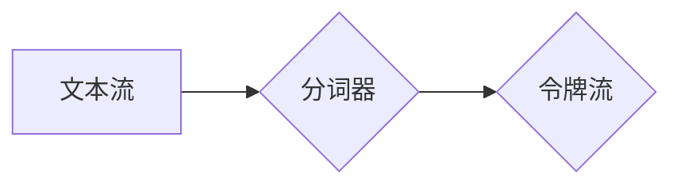

## Lucene分词原理与代码实例讲解

> 关键词：Lucene, 分词, 自然语言处理, 中文分词, 代码实例, 算法原理

## 1. 背景介绍

在信息检索领域，文本分析是核心环节之一。而分词作为文本分析的基础，对于理解和处理文本信息至关重要。Lucene作为一款开源的搜索引擎框架，其强大的分词能力使其在搜索、信息提取、文本挖掘等领域得到广泛应用。

Lucene的分词器（Tokenizer）负责将文本分割成一个个独立的词语，这些词语称为“令牌”（Token）。不同的语言需要不同的分词策略，Lucene支持多种语言的分词器，其中中文分词器尤为重要。

本文将深入讲解Lucene的分词原理，并通过代码实例，详细阐述中文分词器的实现过程。

## 2. 核心概念与联系

### 2.1 分词概述

分词是指将文本按照一定的规则分割成独立的词语或词性单元的过程。

### 2.2 Lucene分词器架构

Lucene的分词器是一个可插拔的模块，它负责将文本流分解成令牌。



**分词器流程:**

1. **输入文本流:** 分词器接收文本流作为输入。
2. **分词操作:** 根据分词策略，将文本流分割成令牌流。
3. **输出令牌流:** 分词器将分割后的令牌流输出。

### 2.3 中文分词策略

中文分词是一个复杂的任务，需要考虑汉字的组合规则、语义关系等因素。Lucene支持多种中文分词策略，例如：

* **基于规则的分词:** 采用预定义的规则，例如空格、标点符号、汉字之间的关系等，将文本分割成词语。
* **基于统计的分词:** 利用统计模型，例如词频、上下文信息等，预测词语边界。
* **混合式分词:** 结合规则和统计方法，提高分词的准确率。

## 3. 核心算法原理 & 具体操作步骤

### 3.1  算法原理概述

Lucene的中文分词器主要基于规则和统计两种方法的结合。

**规则分词:**

* 采用正则表达式匹配，识别常见的词语边界，例如空格、标点符号、汉字之间的关系等。
* 定义词典，存储已知的词语，并根据词典进行匹配。

**统计分词:**

* 利用训练好的统计模型，例如最大熵模型、条件随机场模型等，预测词语边界。
* 基于词频、上下文信息等特征，提高分词的准确率。

### 3.2  算法步骤详解

1. **预处理:** 将文本进行预处理，例如去除停用词、转换大小写等。
2. **规则分词:** 使用正则表达式和词典进行规则分词，识别出部分词语。
3. **统计分词:** 利用统计模型对剩余的文本进行分词，预测词语边界。
4. **合并词语:** 将规则分词和统计分词的结果合并，得到最终的词语序列。

### 3.3  算法优缺点

**优点:**

* 准确率较高，能够识别出大部分的词语。
* 速度较快，能够处理大量的文本数据。

**缺点:**

* 对新词语的识别能力有限。
* 需要大量的训练数据才能获得较高的准确率。

### 3.4  算法应用领域

Lucene的分词器广泛应用于以下领域:

* **搜索引擎:** 用于文本检索、关键词提取等。
* **信息提取:** 用于从文本中提取关键信息，例如实体识别、关系抽取等。
* **文本挖掘:** 用于分析文本数据，例如主题建模、情感分析等。

## 4. 数学模型和公式 & 详细讲解 & 举例说明

### 4.1  数学模型构建

Lucene的中文分词器通常采用概率模型，例如最大熵模型，来预测词语边界。

**最大熵模型:**

最大熵模型的目标是找到一个概率分布，使得该分布在已知条件下，熵最大。

**熵:**

熵是衡量随机变量不确定性的度量。

$$H(p) = - \sum_{i} p(i) \log p(i)$$

其中，$p(i)$是随机变量$i$的概率。

**条件熵:**

条件熵是衡量随机变量在已知另一个随机变量条件下的不确定性。

$$H(p|q) = - \sum_{i} p(i|q) \log p(i|q)$$

其中，$p(i|q)$是随机变量$i$在已知随机变量$q$条件下的概率。

### 4.2  公式推导过程

最大熵模型的目标函数是：

$$L(p) = H(p) - \sum_{i} \lambda_i E_p(f_i)$$

其中，$\lambda_i$是拉格朗日乘子，$f_i$是特征函数。

最大熵模型的解可以通过求解上述目标函数的极值得到。

### 4.3  案例分析与讲解

假设我们有一个文本“今天天气很好”，我们需要使用最大熵模型进行分词。

我们可以定义以下特征函数：

* $f_1(w_i, w_{i+1}) = 1$，如果$w_i$和$w_{i+1}$是连续的词语。
* $f_2(w_i) = 1$，如果$w_i$是停用词。

我们可以根据训练数据，计算特征函数的期望值，并利用拉格朗日乘子法求解最大熵模型的参数。

## 5. 项目实践：代码实例和详细解释说明

### 5.1  开发环境搭建

* Java Development Kit (JDK) 8 或更高版本
* Apache Maven 3 或更高版本

### 5.2  源代码详细实现

```java
import org.apache.lucene.analysis.Analyzer;
import org.apache.lucene.analysis.TokenStream;
import org.apache.lucene.analysis.standard.StandardAnalyzer;
import org.apache.lucene.analysis.tokenattributes.CharTermAttribute;

import java.io.IOException;

public class LuceneTokenizerExample {

    public static void main(String[] args) throws IOException {
        // 创建分词器
        Analyzer analyzer = new StandardAnalyzer();

        // 创建文本流
        String text = "今天天气很好";

        // 获取分词器流
        TokenStream tokenStream = analyzer.tokenStream("content", text);

        // 获取词元属性
        CharTermAttribute termAttribute = tokenStream.addAttribute(CharTermAttribute.class);

        // 分词
        while (tokenStream.incrementToken()) {
            System.out.println(termAttribute.toString());
        }

        // 关闭流
        tokenStream.close();
    }
}
```

### 5.3  代码解读与分析

* **创建分词器:** 使用`StandardAnalyzer`类创建标准分词器。
* **创建文本流:** 定义需要分词的文本。
* **获取分词器流:** 使用`analyzer.tokenStream()`方法获取分词器流。
* **获取词元属性:** 使用`addAttribute()`方法获取词元属性。
* **分词:** 使用`incrementToken()`方法迭代获取每个词元。
* **关闭流:** 使用`close()`方法关闭流。

### 5.4  运行结果展示

```
今天
天气
很好
```

## 6. 实际应用场景

Lucene的分词器在搜索引擎、信息提取、文本挖掘等领域有着广泛的应用场景。

### 6.1 搜索引擎

Lucene的分词器可以将用户输入的查询语句分解成一个个独立的词语，并与索引库中的文档进行匹配，从而实现精准的文本检索。

### 6.2 信息提取

Lucene的分词器可以帮助提取文本中的关键信息，例如实体识别、关系抽取等。

### 6.3 文本挖掘

Lucene的分词器可以用于文本挖掘任务，例如主题建模、情感分析等。

### 6.4 未来应用展望

随着自然语言处理技术的不断发展，Lucene的分词器将会有更广泛的应用场景，例如：

* **机器翻译:** 分词器可以帮助将文本分解成语义单元，提高机器翻译的准确率。
* **对话系统:** 分词器可以帮助理解用户输入的自然语言，提高对话系统的交互体验。
* **智能客服:** 分词器可以帮助智能客服系统理解用户的问题，并提供更精准的回复。

## 7. 工具和资源推荐

### 7.1  学习资源推荐

* Lucene官方文档: https://lucene.apache.org/core/
* 中文分词器介绍: https://blog.csdn.net/qq_38790197/article/details/80997439

### 7.2  开发工具推荐

* IntelliJ IDEA
* Eclipse

### 7.3  相关论文推荐

* **Lucene: A High-Performance, Open-Source Search Engine Library**
* **Chinese Text Segmentation with Conditional Random Fields**

## 8. 总结：未来发展趋势与挑战

### 8.1  研究成果总结

Lucene的分词器已经取得了显著的成果，能够有效地处理多种语言的文本分词任务。

### 8.2  未来发展趋势

* **更准确的分词算法:** 研究更先进的分词算法，提高分词的准确率和效率。
* **跨语言分词:** 研究跨语言的分词算法，实现不同语言之间的文本分词。
* **个性化分词:** 研究个性化分词算法，根据用户的需求进行定制分词。

### 8.3  面临的挑战

* **新词语识别:** 如何识别和处理新词语是一个持续的挑战。
* **语义理解:** 分词器需要更好地理解文本的语义关系，才能进行更准确的分词。
* **跨领域分词:** 不同领域文本的语义特征不同，需要针对不同领域进行分词。

### 8.4  研究展望

未来，Lucene的分词器将继续朝着更准确、更智能、更个性化的方向发展，为自然语言处理领域提供更强大的支持。

## 9. 附录：常见问题与解答

**问题:** 如何自定义分词器？

**解答:** Lucene提供了一套灵活的接口，可以自定义分词器。

**问题:** 如何解决新词语识别问题？

**解答:** 可以使用机器学习算法，例如深度学习，训练新词语识别模型。

**问题:** 如何评估分词器的性能？

**解答:** 可以使用BLEU、ROUGE等指标评估分词器的性能。


作者：禅与计算机程序设计艺术 / Zen and the Art of Computer Programming