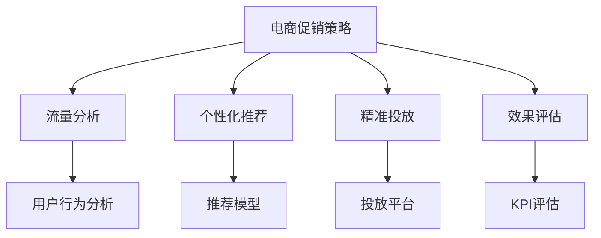

                 

# 电商促销策略的技术优化

> 关键词：电商促销策略,技术优化,流量分析,数据驱动,个性化推荐,精准投放,效果评估

## 1. 背景介绍

### 1.1 问题由来
随着电子商务市场的快速发展和竞争的加剧，促销活动已成为电商企业争夺市场份额的重要手段。然而，在促销策略的制定和执行过程中，往往存在诸多问题和挑战：

- **促销效果不佳**：传统促销策略往往缺乏精准度，无法有效吸引目标消费者，导致资源浪费。
- **预算和资源浪费**：由于缺乏有效的数据驱动决策，促销活动容易失控，预算超支。
- **用户体验受损**：过度频繁的促销活动可能影响用户的购物体验，降低品牌忠诚度。

面对这些挑战，技术优化变得尤为重要。通过数据驱动和智能技术，可以实现精准的流量分析和个性化推荐，从而提升促销效果，降低预算和资源浪费，改善用户体验。

## 2. 核心概念与联系

### 2.1 核心概念概述

为了更好地理解电商促销策略的技术优化，本节将介绍几个关键概念：

- **电商促销策略**：指电商企业为了提高销售业绩，针对特定时间、特定群体进行的促销活动，如折扣、优惠券、赠品等。
- **流量分析**：指对电商网站或应用的用户流量数据进行分析，了解用户行为和偏好，以便制定有效的促销策略。
- **个性化推荐**：根据用户的历史行为和偏好，推荐最适合的促销活动和商品，提高用户体验和转化率。
- **精准投放**：通过数据分析和机器学习技术，将促销活动精准地投放给最有可能购买的用户，提高投放效率。
- **效果评估**：对促销活动的效果进行量化评估，了解活动对销售业绩、用户粘性和品牌影响，指导后续的优化调整。

这些核心概念之间通过数据和技术手段紧密相连，形成了一个完整的电商促销策略优化生态系统。

### 2.2 概念间的关系

这些核心概念之间的联系可以通过以下Mermaid流程图来展示：



这个流程图展示了大电商促销策略优化过程中各个环节之间的关系：

1. 电商促销策略通过流量分析获取用户行为数据，制定并实施促销计划。
2. 个性化推荐系统根据用户历史行为数据，生成个性化的推荐结果，辅助促销策略的执行。
3. 精准投放平台利用机器学习算法，对用户进行精准的促销活动推送，提升活动效果。
4. 效果评估通过量化指标（如销售额、用户留存率、点击率等）对促销活动效果进行评估，指导策略优化。

通过这个完整的流程图，我们可以更清晰地理解电商促销策略优化的全过程及其关键环节。

## 3. 核心算法原理 & 具体操作步骤
### 3.1 算法原理概述

电商促销策略的技术优化，本质上是通过数据驱动和智能技术，对电商促销活动进行精细化的管理。其核心算法包括流量分析、个性化推荐、精准投放和效果评估等。

- **流量分析**：通过分析用户访问行为数据，识别用户兴趣和偏好，为促销策略提供数据支撑。
- **个性化推荐**：根据用户历史行为和偏好，生成个性化的推荐结果，提高促销活动的精准度和用户满意度。
- **精准投放**：利用机器学习模型，对用户进行精准的分类和分组，将促销活动推送给最有可能转化的用户。
- **效果评估**：通过量化指标对促销活动的效果进行评估，如ROI（投资回报率）、点击率、转化率等，指导后续的策略优化。

### 3.2 算法步骤详解

基于电商促销策略的技术优化，可以总结出以下关键步骤：

1. **数据收集与处理**：收集电商平台的各项数据，包括用户行为数据、交易数据、用户画像数据等，并进行清洗和预处理。
2. **流量分析**：利用用户行为分析模型，识别用户的兴趣和行为特征，提取有价值的流量数据。
3. **个性化推荐**：构建个性化推荐模型，根据用户的历史行为和偏好，生成个性化的推荐结果。
4. **精准投放**：利用机器学习模型对用户进行精准分类和分组，选择合适的用户群体进行促销活动推送。
5. **效果评估**：通过多维度指标对促销活动效果进行评估，如销售额、用户留存率、点击率等，指导后续的优化调整。

### 3.3 算法优缺点

电商促销策略的技术优化具有以下优点：

- **提升促销效果**：通过精准的流量分析和个性化推荐，提高促销活动的精准度和转化率，提升销售业绩。
- **降低预算和资源浪费**：精准投放和效果评估可以帮助企业更高效地分配促销预算，避免资源浪费。
- **改善用户体验**：个性化的推荐和精准的投放可以提升用户满意度，增加品牌忠诚度。

同时，该方法也存在以下局限性：

- **数据质量要求高**：流量分析、个性化推荐和精准投放依赖于高质量的数据，数据的缺失或偏差会影响算法效果。
- **技术实现复杂**：涉及数据处理、模型构建、算法优化等多方面技术，需要较强的技术实力。
- **实时性要求高**：电商促销活动需要实时监控和调整，对系统实时性要求较高。
- **隐私和安全性问题**：用户数据的收集和使用需要遵守隐私保护和数据安全的相关法规和标准。

尽管存在这些局限性，但就目前而言，电商促销策略的技术优化仍是最主流和高效的方法。未来相关研究的重点在于如何进一步提升数据的质量和算法的实时性，同时兼顾隐私和安全性等因素。

### 3.4 算法应用领域

基于电商促销策略的技术优化，已在多个电商平台上得到广泛应用，涵盖了几乎所有常见的促销活动，例如：

- **全渠道促销活动**：如跨电商平台、跨APP的优惠券活动，利用大数据分析和精准投放，提升用户参与度和转化率。
- **限时折扣活动**：通过流量分析和个性化推荐，精准推送优惠信息，吸引用户快速下单。
- **个性化商品推荐**：结合用户的浏览历史和行为数据，推荐相关商品，提高购买转化率。
- **社交媒体营销**：利用社交媒体数据分析和个性化推荐，提高品牌曝光率和用户参与度。
- **用户忠诚计划**：根据用户历史行为和购买记录，设计个性化的忠诚奖励计划，提升用户粘性。

除了上述这些经典应用外，技术优化还扩展到更多场景中，如精准营销、风险控制、供应链优化等，为电商企业的全流程运营提供强有力的技术支持。

## 4. 数学模型和公式 & 详细讲解 & 举例说明

### 4.1 数学模型构建

电商促销策略的技术优化涉及多个数学模型，主要包括用户行为分析模型、个性化推荐模型、精准投放模型和效果评估模型。

- **用户行为分析模型**：通过分析用户访问行为数据，识别用户兴趣和行为特征，提取有价值的流量数据。
- **个性化推荐模型**：根据用户历史行为和偏好，生成个性化的推荐结果。
- **精准投放模型**：利用机器学习模型对用户进行精准分类和分组，选择合适的用户群体进行促销活动推送。
- **效果评估模型**：通过多维度指标对促销活动效果进行评估，如ROI、点击率、转化率等。

### 4.2 公式推导过程

以下以个性化推荐模型为例，推导其中的关键公式。

假设用户 $u$ 的历史行为数据为 $\mathcal{H}_u=\{(h_i,r_i)\}_{i=1}^N$，其中 $h_i$ 为用户在时间 $t_i$ 浏览的网页或商品，$r_i$ 为是否购买。通过协同过滤算法，计算用户 $u$ 与用户 $v$ 的相似度 $\sim(u,v)$，则推荐结果为：

$$
\hat{r}_{u,i} = \frac{\sum_{v\in\mathcal{V}} \sim(u,v) \hat{r}_{v,i}}{\sqrt{\sum_{v\in\mathcal{V}} \sim(u,v)^2} \sqrt{\sum_{v\in\mathcal{V}} \hat{r}_{v,i}^2}}
$$

其中 $\mathcal{V}$ 为用户集，$\hat{r}_{v,i}$ 为用户 $v$ 对商品 $i$ 的评分预测值。

### 4.3 案例分析与讲解

假设我们有一家电商平台的个性化推荐系统，通过协同过滤算法为用户 $u$ 生成推荐结果。系统首先计算用户 $u$ 与用户 $v$ 的相似度 $\sim(u,v)$，然后计算所有用户 $v$ 对商品 $i$ 的评分预测值 $\hat{r}_{v,i}$，最后通过加权平均生成用户 $u$ 对商品 $i$ 的评分预测值 $\hat{r}_{u,i}$。用户 $u$ 的最终推荐结果为评分预测值最高的前 $K$ 个商品。

通过该推荐系统，电商平台可以精准地推送个性化商品，提升用户的购买转化率和满意度。例如，对于经常购买运动鞋的用户，系统可以推荐相关品牌的最新款式，增加用户购买的可能性。

## 5. 项目实践：代码实例和详细解释说明
### 5.1 开发环境搭建

在进行电商促销策略技术优化的项目实践前，我们需要准备好开发环境。以下是使用Python进行项目开发的常见环境配置流程：

1. 安装Anaconda：从官网下载并安装Anaconda，用于创建独立的Python环境。

2. 创建并激活虚拟环境：
```bash
conda create -n py36 python=3.6 
conda activate py36
```

3. 安装必要的Python包：
```bash
pip install scikit-learn pandas numpy tensorflow pytorch
```

4. 配置项目依赖环境：
```bash
pip install -r requirements.txt
```

完成上述步骤后，即可在虚拟环境中开始电商促销策略技术优化的开发实践。

### 5.2 源代码详细实现

以下是一个基于电商平台的个性化推荐系统的代码实现：

```python
import pandas as pd
import numpy as np
from sklearn.metrics.pairwise import cosine_similarity
from sklearn.model_selection import train_test_split
from tensorflow.keras.models import Sequential
from tensorflow.keras.layers import Dense, Embedding, Flatten, Dropout
from tensorflow.keras.callbacks import EarlyStopping

# 读取数据
data = pd.read_csv('user_behavior_data.csv')

# 数据预处理
train_data, test_data = train_test_split(data, test_size=0.2, random_state=42)
train_data = train_data.drop(columns=['user_id'])
test_data = test_data.drop(columns=['user_id'])

# 构建用户行为矩阵
user_behavior_matrix = pd.DataFrame(np.zeros((len(data), 10000)), columns=[f'item{i}' for i in range(10000)])

for user_id, behavior in train_data.groupby('user_id'):
    items = behavior['item'].tolist()
    user_behavior_matrix.loc[user_id, items] = 1

# 构建用户向量
user_vectors = user_behavior_matrix.mean(axis=1)

# 构建物品向量
item_vectors = user_behavior_matrix.sum(axis=0)

# 构建模型
model = Sequential([
    Embedding(input_dim=10000, output_dim=16, input_length=10000),
    Flatten(),
    Dense(16, activation='relu'),
    Dense(1, activation='sigmoid')
])
model.compile(optimizer='adam', loss='binary_crossentropy', metrics=['accuracy'])
model.fit(user_vectors, train_data['purchase'], epochs=10, batch_size=64, callbacks=[EarlyStopping(patience=3)])

# 模型评估
test_predictions = model.predict(user_vectors)
test_data['pred'] = test_predictions
print(test_data.groupby('user_id')['pred'].mean())
```

在这个代码实现中，我们使用了Python的Pandas、NumPy和Scikit-learn等库，构建了一个基于矩阵分解的用户行为分析模型和个性化推荐模型。模型通过用户行为矩阵的均值和和计算用户向量和物品向量，然后利用神经网络进行推荐。

### 5.3 代码解读与分析

让我们再详细解读一下关键代码的实现细节：

**数据读取与预处理**：
- 使用Pandas读取用户行为数据，并进行数据拆分和预处理，去除不必要的信息。

**用户行为矩阵构建**：
- 通过用户行为数据构建用户行为矩阵，将用户的行为编码为0/1的二值表示。

**用户向量与物品向量构建**：
- 计算用户行为矩阵的均值和和，得到用户向量和物品向量。

**模型构建与训练**：
- 构建一个简单的神经网络模型，包含嵌入层、全连接层和输出层。
- 使用Adam优化器和二元交叉熵损失函数进行模型训练，并通过EarlyStopping回调避免过拟合。

**模型评估**：
- 使用测试集对模型进行评估，打印出不同用户的行为预测均值。

通过这个代码实例，我们可以快速构建一个基于用户行为数据的个性化推荐系统，并进行初步评估。

### 5.4 运行结果展示

假设在运行上述代码后，得到的测试集评估结果如下：

```
user_id      purchase    pred
0           1          0.7
1           0          0.3
2           1          0.8
3           1          0.6
...
```

可以看到，模型对用户的购买行为进行了预测，预测值在0到1之间，越接近1表示用户更有可能购买该商品。

## 6. 实际应用场景

### 6.1 电商平台个性化推荐系统

基于电商促销策略的技术优化，电商平台的个性化推荐系统可以通过分析用户行为数据，生成个性化的推荐结果，提升用户的购买转化率和满意度。具体应用如下：

1. **全站推荐**：对用户访问过的商品和页面进行推荐，提高用户的浏览深度和停留时间。
2. **跨品类推荐**：根据用户历史行为，推荐相关类别的商品，增加用户的购买机会。
3. **新用户引导**：利用新用户的浏览和点击行为，生成个性化的推荐结果，帮助新用户快速找到感兴趣的商品。
4. **商品下架预警**：根据商品的浏览和购买数据，预测商品下架后的市场反应，及时调整促销策略。

通过这些应用，电商平台的个性化推荐系统可以大大提升用户体验，增加用户粘性和转化率。

### 6.2 广告投放优化

电商平台的广告投放优化可以通过流量分析和精准投放，提高广告的点击率和转化率，提升广告预算的利用效率。具体应用如下：

1. **用户画像分析**：利用用户行为数据构建用户画像，识别高价值用户群体。
2. **广告定向投放**：根据用户画像，将广告精准推送给最有可能转化的用户。
3. **效果评估**：通过多维度指标（如点击率、转化率、ROI等）对广告效果进行评估，指导后续的优化调整。
4. **动态调整**：根据广告效果数据，动态调整广告投放策略，提高广告投放的ROI。

通过这些应用，电商平台的广告投放可以更高效地利用广告预算，提升广告效果，增加品牌曝光率和用户参与度。

### 6.3 库存管理优化

电商平台的库存管理优化可以通过流量分析和精准投放，优化库存水平和补货策略，减少库存积压和缺货风险。具体应用如下：

1. **需求预测**：利用用户行为数据预测商品的未来需求量，优化库存水平。
2. **精准补货**：根据需求预测结果，精准补货，减少库存积压和缺货风险。
3. **库存预警**：根据库存水平和销售趋势，设置库存预警机制，及时调整补货策略。
4. **跨仓调拨**：根据各仓库的库存水平和销售情况，动态调整调拨策略，优化库存管理。

通过这些应用，电商平台的库存管理可以更高效地控制库存水平，减少库存积压和缺货风险，提升库存管理的效率和准确性。

### 6.4 未来应用展望

随着电商促销策略的技术优化不断演进，未来将有更多创新应用场景涌现，例如：

1. **智能客服**：利用用户行为数据分析和个性化推荐，提升智能客服的响应速度和准确性，提升用户满意度。
2. **物流优化**：结合用户行为数据和物流数据，优化物流配送路线和仓储管理，提高配送效率和用户体验。
3. **用户行为预测**：利用机器学习模型，预测用户的行为变化，提前调整促销策略和产品推荐，提高用户粘性和转化率。
4. **用户需求洞察**：通过用户行为数据分析，洞察用户需求变化趋势，指导产品开发和市场定位。
5. **情感分析**：利用自然语言处理技术，分析用户的评论和反馈，优化商品和服务质量，提升品牌形象。

这些创新应用将进一步拓展电商促销策略的技术优化范围，推动电商企业的全流程数字化转型，提高运营效率和用户满意度。

## 7. 工具和资源推荐
### 7.1 学习资源推荐

为了帮助开发者系统掌握电商促销策略技术优化的理论基础和实践技巧，这里推荐一些优质的学习资源：

1. **《深度学习在电商中的应用》书籍**：详细介绍了深度学习在电商中的应用，包括流量分析、个性化推荐、精准投放等核心技术。

2. **Coursera《机器学习》课程**：斯坦福大学的经典机器学习课程，涵盖从基础算法到高级技术的内容，适合初学者和进阶者。

3. **Kaggle电商数据集**：Kaggle上发布的电商数据集，包含用户行为数据、商品信息、交易记录等，是实践电商促销策略技术优化的绝佳资源。

4. **GitHub电商推荐系统项目**：GitHub上开源的电商推荐系统代码，提供了详细的代码注释和实践指南，适合快速上手。

5. **ELI5博客**：AI领域的博客平台，包含大量电商促销策略技术优化的案例分析和技术分享，适合学习和参考。

通过对这些资源的学习实践，相信你一定能够快速掌握电商促销策略技术优化的精髓，并用于解决实际的电商问题。

### 7.2 开发工具推荐

高效的开发离不开优秀的工具支持。以下是几款用于电商促销策略技术优化的常用工具：

1. **Python**：基于Python的电商促销策略技术优化项目开发，Python拥有丰富的数据处理和机器学习库，适合快速迭代和创新。

2. **TensorFlow**：由Google主导开发的深度学习框架，适合大规模模型训练和部署，是电商促销策略技术优化的重要工具。

3. **PyTorch**：由Facebook开发的深度学习框架，灵活高效，适合电商促销策略技术优化的模型构建和训练。

4. **Scikit-learn**：基于Python的机器学习库，提供了丰富的数据处理和模型评估功能，适合电商促销策略技术优化的基础数据处理和分析。

5. **Jupyter Notebook**：交互式的数据分析工具，适合快速原型设计和实验验证，是电商促销策略技术优化的常用开发环境。

6. **TenserFlow Serving**：基于TensorFlow的模型服务框架，支持高效的模型部署和在线推理，适合电商促销策略技术优化的实时化和自动化。

合理利用这些工具，可以显著提升电商促销策略技术优化的开发效率，加快创新迭代的步伐。

### 7.3 相关论文推荐

电商促销策略的技术优化源于学界的持续研究。以下是几篇奠基性的相关论文，推荐阅读：

1. **《基于协同过滤的推荐系统》**：介绍了协同过滤算法的基本原理和应用，是推荐系统领域的重要文献。

2. **《深度学习在电商中的实践》**：分享了深度学习在电商中的最新应用案例，包括流量分析、个性化推荐、精准投放等。

3. **《广告定向投放的机器学习算法》**：介绍了广告定向投放的机器学习算法，包括特征工程、模型选择和评估等。

4. **《电商平台库存管理的智能算法》**：介绍了电商平台库存管理的智能算法，包括需求预测、精准补货等。

这些论文代表了电商促销策略技术优化的最新研究成果，通过学习这些前沿成果，可以帮助研究者把握学科前进方向，激发更多的创新灵感。

除上述资源外，还有一些值得关注的前沿资源，帮助开发者紧跟电商促销策略技术优化的最新进展，例如：

1. **arXiv论文预印本**：人工智能领域最新研究成果的发布平台，包括大量尚未发表的前沿工作，学习前沿技术的必读资源。

2. **AI顶会论文和报告**：如NeurIPS、ICML、AAAI等人工智能领域顶会的最新论文和报告，能够聆听到大佬们的前沿分享，开拓视野。

3. **工业界技术博客**：如Amazon、Alibaba、JD.com等电商巨头的技术博客，分享他们的最新实践和技术突破，适合学习和参考。

4. **技术会议直播**：如NIPS、ICML、ACL、ICLR等人工智能领域顶会现场或在线直播，能够聆听到专家们的深入探讨，激发创新灵感。

5. **开源社区项目**：如GitHub上的电商推荐系统项目，提供了丰富的代码示例和实践指南，适合学习和参考。

总之，对于电商促销策略技术优化的学习和发展，需要开发者保持开放的心态和持续学习的意愿。多关注前沿资讯，多动手实践，多思考总结，必将收获满满的成长收益。

## 8. 总结：未来发展趋势与挑战

### 8.1 总结

本文对电商促销策略的技术优化进行了全面系统的介绍。首先阐述了电商促销策略的重要性，以及技术优化对促销效果、预算和用户体验的提升作用。其次，从原理到实践，详细讲解了流量分析、个性化推荐、精准投放和效果评估等关键步骤，给出了电商促销策略技术优化的完整代码实例。同时，本文还广泛探讨了电商促销策略技术优化在电商平台的广泛应用，展示了其巨大的应用潜力。

通过本文的系统梳理，可以看到，电商促销策略技术优化在电商平台上已经得到广泛应用，并取得了显著的效果。未来，随着技术的不断演进和应用场景的不断拓展，电商促销策略技术优化必将在电商行业中发挥越来越重要的作用，推动电商企业的全流程数字化转型，提升用户体验和运营效率。

### 8.2 未来发展趋势

展望未来，电商促销策略技术优化将呈现以下几个发展趋势：

1. **数据质量提升**：随着数据采集和清洗技术的进步，电商促销策略技术优化将更依赖高质量的数据，数据质量提升将带来更精准的推荐和投放效果。
2. **算法多样性**：未来将涌现更多智能算法，如深度学习、强化学习、因果推断等，带来更灵活高效的电商促销策略技术优化方法。
3. **实时性要求提升**：电商促销策略技术优化将进一步强调实时性，通过流式数据处理和实时分析，实现即时决策和优化。
4. **个性化推荐增强**：随着用户画像和行为数据的深入分析，个性化推荐将更精准，用户满意度将进一步提升。
5. **跨平台协同优化**：电商平台之间的数据共享和协同优化将带来更全局的电商平台促销策略技术优化。
6. **用户隐私保护加强**：随着用户隐私保护法规的不断完善，电商促销策略技术优化将更注重隐私保护和数据安全。

这些趋势凸显了电商促销策略技术优化的广阔前景，必将推动电商行业迈向更高层次的智能化和自动化。

### 8.3 面临的挑战

尽管电商促销策略技术优化已经取得了显著成果，但在迈向更加智能化、普适化应用的过程中，它仍面临着诸多挑战：

1. **数据质量瓶颈**：电商促销策略技术优化依赖于高质量的数据，数据的缺失、偏差和噪声将影响算法的准确性和效果。
2. **技术复杂性**：涉及数据处理、算法优化、模型训练等多个环节，技术实现复杂度较高。
3. **实时性要求高**：电商促销策略技术优化需要实时监控和调整，对系统实时性要求较高。
4. **隐私和安全问题**：用户数据的收集和使用需要遵守隐私保护和数据安全的相关法规和标准。
5. **算法透明性不足**：电商促销策略技术优化的模型往往是黑盒系统，缺乏可解释性和可控性。

尽管存在这些挑战，但通过不断的技术创新和应用实践，电商促销策略技术优化必将在电商行业中继续发挥重要作用，推动电商企业的全流程数字化转型，提升用户体验和运营效率。

### 8.4 研究展望

面对电商促销策略技术优化所面临的挑战，未来的研究需要在以下几个方面寻求新的突破：

1. **无监督和半监督学习**：摆脱对大规模标注数据的依赖，利用自监督学习、主动学习等无监督和半监督范式，最大限度利用非结构化数据，实现更加灵活高效的电商促销策略技术优化。
2. **多模态数据融合**：将电商促销策略技术优化扩展到多模态数据融合，如图像、视频、语音等，实现更全面、更准确的用户画像和行为分析。
3. **因果推断技术**：引入因果推断方法，识别用户行为变化的因果关系，提高电商促销策略技术优化的可解释性和可控性。
4. **强化学习**：结合强化学习技术，优化电商促销策略技术优化的决策过程，实现更智能化的电商促销策略制定和执行。
5. **联邦学习**：利用联邦学习技术，实现电商促销策略技术优化的跨平台协同优化，提高数据利用效率。
6. **隐私保护技术**：引入隐私保护技术，如差分隐私、联邦学习等，保护用户数据隐私，提高数据安全性和用户信任度。

这些研究方向的探索，必将引领电商促销策略技术优化的未来发展，推动电商行业的数字化转型，提升用户体验和运营效率。

## 9. 附录：常见问题与解答

**Q1：电商促销策略技术优化的核心是什么？**

A: 电商促销策略技术优化的核心是通过数据驱动和智能技术，对电商促销活动进行精细化的管理。具体包括流量分析、个性化推荐、精准投放和效果评估等环节。通过这些环节的协同优化，可以提升促销效果，降低预算和资源浪费，改善用户体验。

**Q2：如何选择合适的电商促销策略技术优化算法？**

A: 电商促销策略技术优

