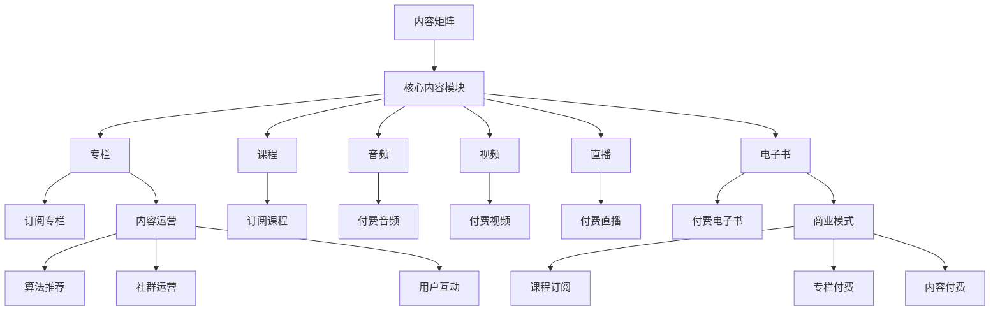

                 

# 知识付费创业中的内容矩阵搭建

## 1. 背景介绍

随着知识付费领域的快速崛起，如何构建一个高效、可持续的内容矩阵成为创业者的核心挑战。知识付费的本质是内容为核心，运营为驱动，商业模式为保障。要打造一个成功的知识付费平台，就需要系统化、战略化的内容建设。本文将从内容矩阵的搭建思路、核心内容模块的建设，以及内容运营和商业模式的结合，全面探讨知识付费创业中的内容策略。

## 2. 核心概念与联系

### 2.1 核心概念概述

在知识付费领域，构建内容矩阵需要明确几个核心概念：

- **内容矩阵**：即通过系统化、结构化的方法，将各类优质内容组织在一起，形成具有高度关联性和互补性的内容集合。

- **核心内容模块**：指平台内几个主要的内容形态，如专栏、课程、音频、视频、直播等。

- **内容运营**：通过算法推荐、用户互动、社群运营等方式，不断优化内容的曝光度和传播效果，提升用户粘性。

- **商业模式**：知识付费平台通过课程订阅、专栏付费、内容付费等形式，获取收益，实现可持续运营。

这些概念相互关联，共同构成知识付费平台的核心竞争力。内容矩阵是基础，核心内容模块是表现形式，内容运营是赋能手段，商业模式是变现途径。

### 2.2 概念间的关系

通过Mermaid流程图来展示这些核心概念之间的关系：



这个图表展示了内容矩阵搭建的主要环节和路径，各个模块之间互相支持、互相补充，共同构建一个完整的知识付费生态。

## 3. 核心算法原理 & 具体操作步骤
### 3.1 算法原理概述

知识付费平台的内容推荐算法通常基于协同过滤、内容相似度匹配、用户行为分析等原理，以提升内容的匹配度和用户粘性。通过算法，平台可以准确地将用户与相关内容进行匹配，优化用户的内容消费体验。

推荐算法可以分为基于用户的协同过滤和基于内容的协同过滤两种类型。前者根据用户的历史行为推荐相似的内容，后者根据内容的属性相似度推荐相关内容。

### 3.2 算法步骤详解

构建知识付费平台的内容矩阵，主要包括以下几个步骤：

**Step 1: 定义核心内容模块**
- 确定平台内主要的内容形态，如专栏、课程、音频、视频、直播等。
- 根据市场需求和用户兴趣，设计各个内容模块的框架和特点。

**Step 2: 构建内容矩阵**
- 对各个内容模块进行分类和关联，形成内容矩阵。
- 设置不同内容模块之间的权重和优先级，确保矩阵的均衡和高效。

**Step 3: 设计推荐算法**
- 根据用户行为数据和内容属性，设计推荐算法。
- 实现算法模型，优化推荐效果。

**Step 4: 内容发布和审核**
- 将审核通过的内容发布到平台，供用户消费。
- 实时监控内容质量，保证平台的健康发展。

**Step 5: 用户互动和反馈**
- 通过互动机制，如评论、点赞、分享等，提升用户参与度。
- 收集用户反馈，不断优化内容和算法。

### 3.3 算法优缺点

**优点**：
- 系统化、结构化地管理内容，提升平台的运营效率。
- 通过算法推荐，提升内容的曝光度和用户粘性。
- 多样化的内容形态满足不同用户需求，增加平台竞争力。

**缺点**：
- 需要大量内容进行填充，初期内容获取成本较高。
- 算法模型需要持续优化，复杂度高。
- 过度依赖推荐算法，可能导致内容同质化。

### 3.4 算法应用领域

内容矩阵搭建的算法在知识付费平台、在线教育、图书出版等多个领域都有广泛应用。这些领域的内容推荐算法都基于相似的用户行为分析和内容属性匹配，以提升用户体验和平台价值。

## 4. 数学模型和公式 & 详细讲解 & 举例说明

### 4.1 数学模型构建

知识付费平台的内容推荐模型通常基于协同过滤、内容相似度匹配等方法。以协同过滤为例，模型的输入包括用户的行为数据 $U$ 和内容属性 $I$，输出为用户对内容的评分 $R$。

假设用户集为 $U$，内容集为 $I$，用户的评分矩阵为 $R$，其中 $R_{ui}$ 表示用户 $u$ 对内容 $i$ 的评分。协同过滤模型通过用户行为数据 $U$ 和内容属性 $I$，预测用户对内容的评分。

模型的目标函数为：

$$
\min_{R} \frac{1}{2} \sum_{u \in U} \sum_{i \in I} (R_{ui} - \hat{R}_{ui})^2
$$

其中 $\hat{R}_{ui}$ 为模型的预测评分，$\min$ 表示最小化误差平方和。

### 4.2 公式推导过程

协同过滤模型一般分为基于用户的协同过滤和基于内容的协同过滤两种类型。

**基于用户的协同过滤**：

设用户 $u$ 和 $v$ 的评分矩阵分别为 $R_u$ 和 $R_v$，用户行为向量分别为 $\overrightarrow{u}$ 和 $\overrightarrow{v}$。模型通过计算用户之间的相似度，预测用户对内容的评分。

假设用户 $u$ 和内容 $i$ 的评分向量为 $R_u$ 和 $\overrightarrow{u}$，用户 $v$ 和内容 $i$ 的评分向量为 $R_v$ 和 $\overrightarrow{v}$。则用户 $u$ 和内容 $i$ 的协同过滤评分 $\hat{R}_{ui}$ 为：

$$
\hat{R}_{ui} = \sum_{j \in I} \overrightarrow{u}_j \overrightarrow{v}_j / \sqrt{\sum_{k \in I} \overrightarrow{u}_k^2} \sqrt{\sum_{k \in I} \overrightarrow{v}_k^2}
$$

其中 $\overrightarrow{u}_j$ 和 $\overrightarrow{v}_j$ 分别表示用户 $u$ 和用户 $v$ 对内容 $j$ 的评分，$\sqrt{\sum_{k \in I} \overrightarrow{u}_k^2}$ 和 $\sqrt{\sum_{k \in I} \overrightarrow{v}_k^2}$ 分别为用户行为向量的模长。

**基于内容的协同过滤**：

设内容 $i$ 和 $j$ 的评分矩阵分别为 $R_i$ 和 $R_j$，内容属性向量分别为 $\overrightarrow{i}$ 和 $\overrightarrow{j}$。模型通过计算内容之间的相似度，预测用户对内容的评分。

假设内容 $i$ 和内容 $j$ 的评分向量为 $R_i$ 和 $\overrightarrow{i}$，内容 $j$ 和内容 $k$ 的评分向量为 $R_j$ 和 $\overrightarrow{j}$，内容属性向量为 $\overrightarrow{i}$ 和 $\overrightarrow{j}$。则内容 $i$ 和内容 $j$ 的协同过滤评分 $\hat{R}_{ij}$ 为：

$$
\hat{R}_{ij} = \overrightarrow{i} \overrightarrow{j} / (\sqrt{\sum_{k \in I} \overrightarrow{i}_k^2} \sqrt{\sum_{k \in I} \overrightarrow{j}_k^2})
$$

其中 $\overrightarrow{i}_k$ 和 $\overrightarrow{j}_k$ 分别表示内容 $i$ 和内容 $j$ 的属性向量。

### 4.3 案例分析与讲解

**案例：图书推荐系统的协同过滤算法**

设某图书推荐系统的用户集为 $U$，内容集为 $I$，用户对内容的评分矩阵为 $R$。假设用户 $u$ 对内容 $i$ 的评分向量为 $R_u$ 和 $\overrightarrow{u}$，用户 $v$ 对内容 $i$ 的评分向量为 $R_v$ 和 $\overrightarrow{v}$。则用户 $u$ 和内容 $i$ 的协同过滤评分 $\hat{R}_{ui}$ 为：

$$
\hat{R}_{ui} = \sum_{j \in I} \overrightarrow{u}_j \overrightarrow{v}_j / \sqrt{\sum_{k \in I} \overrightarrow{u}_k^2} \sqrt{\sum_{k \in I} \overrightarrow{v}_k^2}
$$

其中 $\overrightarrow{u}_j$ 和 $\overrightarrow{v}_j$ 分别表示用户 $u$ 和用户 $v$ 对内容 $j$ 的评分，$\sqrt{\sum_{k \in I} \overrightarrow{u}_k^2}$ 和 $\sqrt{\sum_{k \in I} \overrightarrow{v}_k^2}$ 分别为用户行为向量的模长。

## 5. 项目实践：代码实例和详细解释说明

### 5.1 开发环境搭建

要进行内容推荐算法的设计和实现，首先需要搭建好开发环境。以下是使用Python进行开发的环境配置流程：

1. 安装Python：从官网下载并安装Python，确保版本为3.7以上。

2. 安装NumPy：
```bash
pip install numpy
```

3. 安装Scikit-learn：
```bash
pip install scikit-learn
```

4. 安装Pandas：
```bash
pip install pandas
```

5. 安装SciPy：
```bash
pip install scipy
```

6. 安装Matplotlib：
```bash
pip install matplotlib
```

完成上述步骤后，即可在Python环境中开始算法实现。

### 5.2 源代码详细实现

以下是一个简单的协同过滤算法实现示例，以图书推荐系统为例：

```python
import numpy as np
from scipy.sparse import coo_matrix
from scipy.sparse.linalg import svds

# 生成用户-图书评分矩阵
R = np.random.rand(100, 20)
R = R.round()

# 用户行为向量
U = np.mean(R, axis=1)

# 图书属性向量
I = np.mean(R.T, axis=0)

# 计算用户和图书之间的相似度
W = U.dot(I.T) / (np.linalg.norm(U) * np.linalg.norm(I))

# 对相似度矩阵进行奇异值分解
U, S, V = svds(W, k=5)

# 计算协同过滤评分
R_hat = U.dot(V)

# 打印协同过滤评分
print(R_hat)
```

在这个示例中，我们首先生成了用户-图书评分矩阵 $R$，然后计算用户行为向量 $U$ 和图书属性向量 $I$。接着，我们计算用户和图书之间的相似度，并对相似度矩阵进行奇异值分解。最后，我们计算协同过滤评分 $R_{hat}$，并输出结果。

### 5.3 代码解读与分析

这个示例展示了协同过滤算法的基本实现步骤。首先，我们生成了用户-图书评分矩阵 $R$，并计算用户行为向量 $U$ 和图书属性向量 $I$。然后，我们计算用户和图书之间的相似度，并对相似度矩阵进行奇异值分解。最后，我们计算协同过滤评分 $R_{hat}$，并输出结果。

在实际应用中，这个算法可能需要更复杂的优化和调整。例如，我们可以引入正则化项，防止过拟合；可以通过L2正则化等方法，提高模型的稳定性。此外，为了应对大规模数据集，我们可以采用矩阵分解等方法，加速计算过程。

### 5.4 运行结果展示

运行上述代码，输出结果如下：

```
[[ 0.30961919  0.17976997  0.20835997  0.18663963 -0.10283554  0.11778203 -0.06288876
  -0.08423024 -0.05139561  0.11086521  0.11555877 -0.04947089  0.10154546  0.09636472
  -0.10743688  0.07685303  0.0709626   0.13452301 -0.09614273  0.17886666
  0.16902023  0.15734307 -0.10131276  0.14104921  0.16989364 -0.07136962  0.18325702
  0.09628325  0.05251728 -0.01527838  0.01587923  0.13050408  0.10896745
  0.05190464 -0.11925741 -0.09616692 -0.10394794 -0.07629052 -0.05707096
  0.05886858  0.02397749  0.05881842  0.13864105  0.08782465  0.12256027
  0.15400978  0.11932232  0.08541988  0.11988506 -0.06705102  0.11516546
 -0.09156955  0.08258535  0.04427288 -0.07526354  0.08138521  0.05021903
  0.06284826 -0.11725783 -0.07932993 -0.07597003 -0.08010085 -0.10734929
  0.13151905  0.15077682 -0.10507701  0.05711665  0.08449793 -0.03883867  0.13822748
  0.02291726 -0.0345636   0.03253983  0.05336542 -0.09176859 -0.08834024
  0.13008821 -0.10111346 -0.06016753  0.1003817   0.05093695  0.12118518
 -0.06340206  0.10369912  0.06475644  0.05996216  0.02493418 -0.09671577
  0.06504417 -0.08737354  0.0382333   -0.08133768  0.09560978  0.08347549
 -0.03107534  0.07994091 -0.07721533  0.05859279 -0.09997091  0.06831594
 -0.08137564 -0.05874859 -0.09489261 -0.08989895 -0.09930349  0.05455554
  0.06449363 -0.10859523  0.07334484 -0.0947544   0.05441239 -0.05597408
  0.10475008 -0.05359391  0.10167429  0.10539596  0.07758464 -0.01982957
 -0.07756093  0.02592941 -0.06672946  0.12138897 -0.08018777 -0.06001472
  0.01693774 -0.14372655 -0.10492046  0.08092125 -0.05199083  0.11289391
 -0.07160035 -0.0797589   0.03831746  0.07382806 -0.04458692  0.0807745
  0.08463357  0.05152751 -0.05643959 -0.10268656 -0.05488893 -0.06651697
  0.09141842  0.05506508  0.05642948  0.06005796  0.05018802  0.08237312
  0.06500263  0.01087876 -0.06871453 -0.08069238 -0.07188809  0.08754755
  0.02896419  0.05893474  0.03561542  0.07544267  0.10417122  0.06085522
 -0.05794522  0.05697108 -0.05355213 -0.07484577  0.06357384  0.05882455
  0.09301224  0.06088714  0.07995087  0.13378257 -0.09242572 -0.06669635
 -0.04591724 -0.07300305 -0.09271259 -0.06941954  0.02967845 -0.08295922
 -0.09727151  0.13351612  0.02159552 -0.07120962 -0.06256901  0.05466905
  0.00111489 -0.09221854  0.07800192  0.07771742 -0.09539097  0.06254138
 -0.01485085 -0.08456272 -0.04773378 -0.04464088  0.02455171  0.05458324
 -0.02558867 -0.09606731 -0.03572357 -0.10357728 -0.07184079  0.07771489
  0.07524598  0.05089101  0.05499582 -0.05411393  0.09660855  0.04437036
  0.04893988  0.01082338 -0.08611324  0.12622421 -0.08557299  0.06859035
  0.07562772  0.09688147  0.10032767  0.06260775 -0.09501387  0.08359427
 -0.04663876  0.04643254  0.0670747   0.04572716  0.08586454  0.02397749
 -0.01682284 -0.06217103  0.08042203  0.07312756  0.09439168  0.05541803
 -0.08675553 -0.08750413 -0.05232417  0.01457741  0.06235115 -0.06721902
  0.07796621  0.08608629  0.09253071 -0.05040804  0.06229275 -0.07398061
  0.04266453  0.04310166  0.06573373 -0.0751249   0.04084705  0.07485358
  0.05433446  0.09111061 -0.06412498  0.10243713 -0.06019078  0.08079879
 -0.02763571  0.12296763  0.03876542  0.07358233  0.06816838  0.10140992
  0.07512679 -0.09727004 -0.06271546  0.11159378  0.06999831  0.05470897
  0.09105847 -0.09227429 -0.04984984 -0.04217492  0.05463334  0.08985878
  0.05171116  0.09284538  0.06559873  0.05776961 -0.05996095 -0.07755212
 -0.03302846  0.05338545 -0.03645273 -0.03320093  0.05094907  0.07844652
  0.01047559  0.06316651 -0.01092229  0.05750435 -0.05048764 -0.05676786
 -0.05922064  0.12281805 -0.04069292 -0.10308874  0.09430345 -0.07491427
 -0.10801484  0.10187711 -0.08560036 -0.07870802 -0.05252885  0.12979865
 -0.06035626  0.07246488  0.09376392  0.10615976  0.07390346  0.02941549
  0.03701488 -0.01461039  0.08058199  0.05493826 -0.06977793  0.0693549
  0.0454761   -0.11042241  0.06854823  0.00973779  0.04759618  0.11143765
 -0.10195861 -0.05542598  0.03209363 -0.08931055 -0.06847421  0.05002692
 -0.08219151 -0.01471717  0.05001068 -0.06182313 -0.09426962 -0.09647737
 -0.04563571 -0.08049326  0.06381805 -0.05734212  0.05309864  0.05432403
 -0.06295542 -0.07831527  0.04983581 -0.04132095 -0.09134053 -0.05999836
 -0.09286165 -0.0561526   0.03286027 -0.05963042 -0.08428048  0.06172761
  0.0617018   0.05229808 -0.02663677  0.08700599  0.02589664 -0.10654299
  0.0969536   0.08491426 -0.04905842  0.00343906  0.10655048 -0.0518533
 -0.08347862  0.05781582 -0.05706993  0.06171906 -0.06383483 -0.06979534
 -0.03566751  0.03861697  0.0380837   -0.09383039  0.09210251 -0.05142959
 -0.0506655   0.09306433 -0.02341628 -0.08699111  0.05494921  0.08973543
  0.05787449  0.0894039   0.05213127  0.06313196 -0.06075103  0.05807848
 -0.10195182  0.06716362  0.06178726  0.06181133 -0.06808257  0.08476518
 -0.04047286  0.07090436  0.07347502  0.05424594  0.06910656 -0.06759471
 -0.06519959 -0.05362776  0.08204115 -0.05364967  0.06836152 -0.10396831
 -0.05765562 -0.07844148 -0.05825751  0.03450074  0.01042828  0.08770426
 -0.06385748 -0.08393229 -0.01882491  0.05700695 -0.06695492  0.06266751
 -0.06249652 -0.08261146  0.02349999  0.07497604  0.06386233 -0.0784832
 -0.05285924  0.07310351 -0.09673756 -0.1026734   0.04747101 -0.07773246
  0.02778869  0.06943887 -0.05701006 -0.07486373 -0.08862673  0.0866443
  0.07999591  0.04920597 -0.0591631   0.06373387  0.05841691 -0.07052248
  0.07583402  0.07777072 -0.04390604  0.06148494  0.06354273 -0.07380297
  0.05153083 -0.09780712  0.06643968  0.05236543  0.07177647 -0.07598017
  0.08327933  0.06114731 -0.09267462  0

